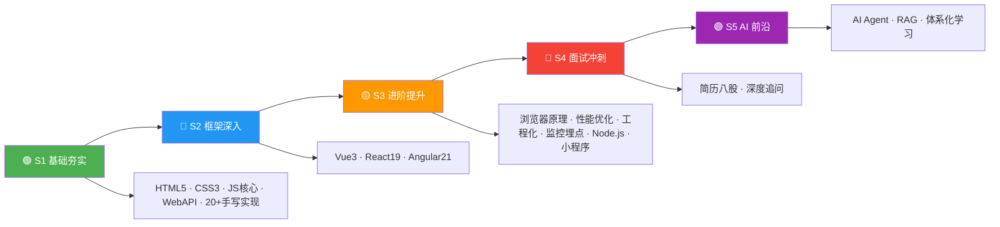

# 前端知识体系

React 19 文档站点，使用 Vite 8 构建，部署在 GitHub Pages。

## 技术栈

- **框架**: React 19 + TypeScript 7 (strict)
- **构建**: Vite 8 + rolldown
- **主题**: @interview-demo/shared-theme（共享主题包，useSyncExternalStore 方案）
- **路由**: React Router 8.1 (HashRouter)
- **内容**: Markdown (Vite raw glob import)
- **渲染**: react-markdown + remark-gfm + highlight.js
- **虚拟滚动**: IntersectionObserver 分片渲染（大文档仅渲染视口附近区块）
- **图表**: Mermaid (lazy loaded)
- **代码质量**: Biome, TypeScript strict mode

## 开发

```bash
bun dev        # 启动开发服务器
bun run build  # 构建生产版本
bun run lint   # 代码检查与格式化
bun run typecheck # 类型检查
bun test       # 运行测试
```

## 项目结构

```
src/
├── App.tsx                  # 根组件（路由 + ErrorBoundary）
├── main.tsx                 # 入口（StrictMode + HashRouter）
├── components/
│   ├── DocPage.tsx           # 文档页面（异步加载 markdown）
│   ├── DocVirtualScroll.tsx  # 虚拟滚动（分片渲染大文档）
│   ├── Header.tsx            # 顶栏导航 + 主题切换 + 搜索
│   ├── GlobalSearch.tsx      # 全局搜索（全文索引）
│   ├── MarkdownRenderer.tsx  # Markdown 渲染（代码高亮、图片灯箱）
│   ├── MermaidDiagram.tsx    # Mermaid 图表（lazy loaded）
│   ├── HeroCanvas.tsx        # 首页粒子动画
│   ├── HomePage.tsx          # 首页
│   ├── Outline.tsx           # 文档目录/大纲
│   ├── UpdateNotification.tsx # 版本更新提示
│   └── ErrorBoundary.tsx     # 错误边界
├── hooks/useTheme.ts         # 主题切换（useSyncExternalStore，基于 @interview-demo/shared-theme hook）
├── data/
│   ├── content.ts            # 内容加载（import.meta.glob）
│   └── navigation.ts         # 导航配置
├── utils/
│   ├── slugify.ts            # 标题 → anchor ID 算法
│   └── split-markdown.ts     # MD 按标题分片 + 高度预估
└── index.css                 # 全局样式（CSS 变量 + 暗色模式）
```

## 五阶段学习路径图



## 部署

GitHub Pages 自动部署（`.github/workflows/deploy-interview-docs.yml`），构建时通过 `VITE_BASE_PATH` 环境变量覆盖 base path 为 `/interview-demo/`。
