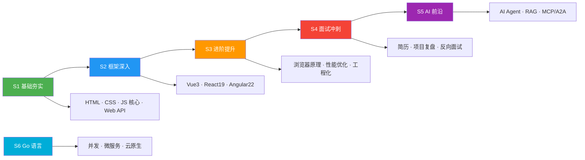
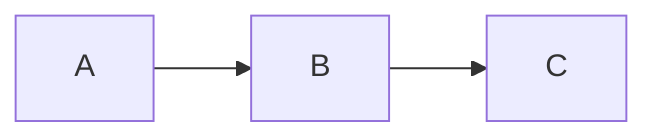

# 🎯 前端知识体系 Wiki

欢迎阅读 **前端知识体系（Frontend Knowledge System）** Wiki —— 面向准备面试、构建生产级 React 应用的前端工程师的文档站点说明。

> 最后更新：2026-10-08 · 对应代码：`apps/interview-demo`（workspace 包 `@interview-demo/interview-docs` v1.0.0）

## 快速导航

| 章节 | 说明 |
|------|------|
| [项目概览](#项目概览) | 这个应用是什么、核心特性、学习路径 |
| [技术栈](#技术栈) | 精确依赖版本 |
| [架构设计](#架构设计) | 入口结构、组件树、路由、状态、分包 |
| [组件参考](#组件参考) | 全部 12 个组件的 props、hooks 与行为 |
| [数据层](#数据层) | `docUrls` / `content` / `navigation` / `docSequence` |
| [工具函数](#工具函数) | `slugify` / `split-markdown` |
| [数据流](#数据流) | 内容加载、虚拟滚动、搜索、主题、版本检测 |
| [开发指南](#开发指南) | 环境、脚本、配置、编码规范 |
| [测试](#测试) | 9 个测试文件及其覆盖范围 |
| [内容贡献指南](#内容贡献指南) | 如何新增/编辑 Markdown 内容 |
| [部署](#部署) | 构建流程、GitHub Pages、CI/CD |
| [技术选型决策](#技术选型决策) | 每项技术选型的理由 |

## 项目概览

一个 **React 19** 静态文档站点，用作结构化的前端知识库。内容以 Markdown 形式存放在**仓库根目录的 `docs/`**，由本应用通过 Vite 的 `import.meta.glob` 消费，覆盖从 HTML/CSS 基础到 Go 后端开发的 6 个学习阶段。

本应用是 Bun + Turborepo monorepo（`interview-demo`）中的一个 workspace（`apps/interview-docs`）。它**不持有内容** —— Markdown 位于仓库根的 `docs/` 目录。

### 核心特性

- **React 19** + TypeScript strict 模式
- **Vite 8** 构建，rolldown 打包 + 精细化 chunk 分组
- **HashRouter** —— 静态托管无需任何服务端重写规则
- **117 篇 Markdown 文档**，每篇一个懒加载 chunk
- **虚拟滚动**：长文档按标题切分，屏幕外的章节只渲染占位标题
- **全局搜索**：延迟过滤，覆盖每一篇文档**以及每一个标题**
- **深色/浅色主题**：基于 `@interview-demo/shared-theme`，切换时带圆形裁剪过渡
- **Mermaid 11** 图表，仅在页面存在 `mermaid` 代码块时才加载
- **图片 / 图表灯箱**：滚轮缩放 + 拖拽平移
- **上一章/下一章导航**：由 URL 排序自动推导，无需手工维护
- **版本更新提示**：5 分钟轮询
- **Speculation Rules** 预渲染，实现近乎瞬时的文档跳转

### 学习路径



### 内容体量

| 阶段 | 目录 | Markdown 文件数 | 导航条目数 |
|------|------|----------------:|-----------:|
| S1 | `docs/S1-基础夯实/` | 14 | 11 |
| S2 | `docs/S2-框架深入/` | 8 | 8 |
| S3 | `docs/S3-进阶提升/` | 8 | 8 |
| S4 | `docs/S4-面试冲刺/` | 19 | 19 |
| S5 | `docs/S5-AI/` | 36 | 36 |
| S6 | `docs/S6-Go/` | 33 | 33 |
| **合计** | | **118** | **115**（另加「首页」） |

共 10 个 `index.md` 目录概览页。S1 是唯一一个三个 `index.md` 都没有进导航的阶段（S1 没有「阶段概览」条目）。

## 技术栈

| 层 | 技术 | 版本 |
|----|------|------|
| 框架 | React + TypeScript（strict） | `react ^19.0.0` |
| 构建 | Vite（rolldown） | `vite ^8.1.0` |
| 插件 | `@vitejs/plugin-react` | `^6.0.0` |
| 路由 | React Router（直接用 `react-router`，不是 `-dom`） | `^8.3.1` |
| 动画 | `motion`（Framer Motion 的继任包） | `^12.42.2` |
| 内容 | Markdown，通过 `import.meta.glob('?raw')` | — |
| 渲染 | react-markdown + remark-gfm | `^9.0.3` / `^4.0.0` |
| 代码高亮 | highlight.js | `^11.11.1` |
| 图表 | Mermaid（懒加载） | `^11.6.0` |
| 主题 | `@interview-demo/shared-theme`（workspace 包） | `workspace:*` |
| 类型检查 | TypeScript | `^7.0.2` |
| 测试 | Vitest + jsdom + Testing Library | `vitest ^4.1.9`、`jsdom ^29.1.1`、`@testing-library/react ^16.3.2` |
| 代码质量 | Biome（根目录统一配置，唯一标准） | 根 `biome.json` |
| 包管理 | Bun | 根 `packageManager` |
| 部署 | GitHub Pages | `.github/workflows/deploy-interview-docs.yml` |

值得注意的是**没有用到**：任何状态库（Zustand/Redux）、CSS 框架、CSS Modules、`rehype-*` 插件、`react-router-dom`、Ant Design。

---

# 架构设计

## 入口结构

```
createRoot(#root)                     src/main.tsx
└── <StrictMode>
    └── <HashRouter>                  react-router v8
        └── <App>                     src/App.tsx
```

`main.tsx` 在找不到 `#root` 时抛出 `Root element not found`。`index.css` 在此处一次性引入。整个应用**没有 Provider、没有 Context、没有 store** —— 所有状态要么是组件局部的，要么直接从 DOM 读取。

## 组件树

```
<App>
  <div.app>
    ├── <Header>                      （在 Routes 之外 —— 常驻）
    │     ├── Logo → "/"              src={import.meta.env.BASE_URL + 'logo.svg'}
    │     ├── <motion.nav.header-nav>
    │     │     └── <NavDropdown> ×N  （递归渲染，数据来自 navConfig）
    │     ├── <button> 搜索           （打开 GlobalSearch，title="搜索 (Ctrl+K)"）
    │     ├── <ThemeToggle>           来自 @interview-demo/shared-theme
    │     ├── GitHub 链接              https://github.com/KMaybe01/interview-demo
    │     └── {transitionOverlay}      主题切换的圆形裁剪遮罩
    │
    ├── <main.main-content>
    │     └── <ErrorBoundary>         只包裹 Routes（Header 永远不会被错误阻断）
    │           └── <Routes>
    │                 ├── "/"  → <HomePage>
    │                 │           ├── <HeroCanvas>          （60 粒子 canvas）
    │                 │           ├── FeatureCard × 6
    │                 │           └── MottoCard × 3
    │                 └── "/*" → <DocPage>
    │                               ├── <DocVirtualScroll content>
    │                               │     ├── <MarkdownRenderer>      （激活的章节）
    │                               │     │     ├── code  → hljs + <CopyButton>
    │                               │     │     ├── mermaid → 懒加载 <MermaidDiagram>
    │                               │     │     ├── img   → <LightboxImage>
    │                               │     │     └── a     → navigate / 平滑滚动
    │                               │     └── <SectionPlaceholder>    （屏幕外的章节）
    │                               ├── <DocPageNav prev next>
    │                               └── <Outline headings activeId>
    │
    └── <UpdateNotification>          （在 Routes 之外 —— 常驻）
```

## 路由设计

| 路径 | 组件 | 说明 |
|------|------|------|
| `/` | `HomePage` | 落地页：hero 粒子画布、6 张阶段卡片、语录区 |
| `/*` | `DocPage` | 兜底路由，承载全部 114 条内容路由 |

只有两条路由。每一篇 Markdown 都由 `/*` 兜底路由服务；`DocPage` 读取 `useLocation().pathname` 再向数据层索取内容。

所有内容路由都使用 `HashRouter` —— hash 部分（`#/path`）不会发送到服务端，因此静态托管无需重写规则。此外 `gen-version.mjs` 会把 `index.html` 复制为 `404.html` 作为双保险。

## 状态管理

没有全局状态库，状态通过以下方式管理：

| 手段 | 用途 |
|------|------|
| `useState` | 组件局部状态（content、loading、搜索词、菜单开合、灯箱变换） |
| `useSyncExternalStore` | 主题：通过 `@interview-demo/shared-theme` 的 `useTheme()`，用 `MutationObserver` 订阅 `<html class>` 变化 |
| `useMemo` | 派生数据（sections、headings、上下篇、搜索结果、导航扁平化） |
| `useRef` | 瞬态值（IntersectionObserver、sentinel 映射、高度缓存、拖拽状态、定时器、mermaid `initialized` 标志） |
| `useDeferredValue` | 搜索过滤：在过滤大索引时保持输入流畅 |
| `useCallback` | 稳定的回调，供 memo 化的 `components` 对象和 effect 使用 |
| `useInView`（motion） | `HomePage` 上的一次性滚动入场动画 |
| `forceUpdate` 计数器 | `DocVirtualScroll` 把 `activeRef`（一个 `Set`）放在 ref 里，用自增计数器触发重渲染，避免每次 intersection 都克隆一个 state `Set` |

## 分包策略

通过 `vite.config.ts` 中 rolldown 的**高级 chunk 分组**配置（不是 `manualChunks`）：

```typescript
rolldownOptions.output.codeSplitting.groups = [
  { name: 'vendor-react',  test: /node_modules[/\\](react|react-dom|react-router|zustand|scheduler)/, priority: 30 },
  { name: 'motion',        test: /node_modules[/\\](motion|framer-motion)/,                           priority: 27 },
  { name: 'antd-icons',    test: /node_modules[/\\]@ant-design[/\\]icons/,                            priority: 26 },
  { name: 'antd-cssinjs',  test: /node_modules[/\\]@ant-design[/\\]cssinjs/,                          priority: 26 },
  { name: 'antd',          test: /node_modules[/\\]antd[/\\]/,                                        priority: 25 },
  { name: 'dayjs',         test: /node_modules[/\\]dayjs/,                                            priority: 24 },
]
```

产物命名：`assets/[name]-[hash].js` / `assets/[name]-[hash][extname]`。

除此之外：

- **MermaidDiagram** —— `React.lazy(() => import('./MermaidDiagram'))`，只在页面存在 ```` ```mermaid ```` 代码块时才加载。
- **每一个 Markdown 文件** —— `import.meta.glob(..., { import: 'default' })` 是**懒加载**（不是 `eager`），因此 117 篇文档各自都是按需拉取的独立 chunk。
- `modulePreload.polyfill: false`、`chunkSizeWarningLimit: 400`、`target: 'es2020'`、`cssCodeSplit: true`、`sourcemap: false`。

## 错误处理

| 层 | 机制 |
|----|------|
| 渲染错误 | `ErrorBoundary`（唯一 class 组件）包裹 `<Routes>`，展示「出错了」+ 错误信息 + 重新加载按钮 |
| 内容加载失败 | `DocPage` 捕获 `loadContent` 的 rejection → `notFound` → 404 视图 +「返回首页」 |
| 竞态 | `DocPage` effect 中的 `cancelled` 标志；挂载标题 observer 前 `setTimeout(setupObserver, 100)` |
| 版本请求 | `UpdateNotification` 静默吞掉所有 fetch 错误 |
| 剪贴板 | `CopyButton` 降级到 `textarea` + `document.execCommand('copy')` |

---

# 组件参考

所有组件位于 `src/components/`，统一使用**默认导出**，且**没有 CSS Modules** —— 样式全部来自 `src/index.css`。

| 文件 | Props | 备注 |
|------|-------|------|
| `Header.tsx` | 无 | 223 行；内含未导出的递归组件 `NavDropdown` |
| `HomePage.tsx` | 无 | 177 行；模块级 `features` 数组含 6 个阶段 |
| `HeroCanvas.tsx` | 无 | 89 行；canvas 粒子场 |
| `DocPage.tsx` | 无（读 `useLocation()`） | 164 行 |
| `DocVirtualScroll.tsx` | `{ content: string }` | 200 行；内联 props 类型 |
| `MarkdownRenderer.tsx` | `{ content: string; basePath: string }` | 309 行；内含 `CopyButton`、`LightboxImage` |
| `MermaidDiagram.tsx` | `{ chart: string }` | 160 行；被懒加载 |
| `Outline.tsx` | `{ headings: Heading[]; activeId?: string }` | 52 行 |
| `GlobalSearch.tsx` | `{ onClose: () => void }` | 227 行；内含 `flattenNav`、`firstLink`、`extractHeadings` |
| `DocPageNav.tsx` | `{ prev: DocRef \| null; next: DocRef \| null }` | 44 行 |
| `ErrorBoundary.tsx` | `{ children: ReactNode }` | 44 行；class 组件 |
| `UpdateNotification.tsx` | 无 | 86 行 |

## App（`src/App.tsx`）

23 行的根布局。渲染 `Header`、`main > ErrorBoundary > Routes` 和 `UpdateNotification`。

```tsx
<div className="app">
  <Header />
  <main className="main-content">
    <ErrorBoundary>
      <Routes>
        <Route path="/" element={<HomePage />} />
        <Route path="/*" element={<DocPage />} />
      </Routes>
    </ErrorBoundary>
  </main>
  <UpdateNotification />
</div>
```

## Header（`src/components/Header.tsx`）

固定在顶部的导航栏，带递归的多级下拉菜单。

**内部组件**（未导出）：

```typescript
function NavDropdown({ item, currentPath, depth = 0, onClose }: {
  item: NavItem;
  currentPath: string;
  depth?: number;
  onClose?: () => void;
})
```

**状态**：`menuOpen`、`searchOpen`；每个 `NavDropdown` 自己持有 `dropdownOpen`。`timeoutRef: useRef<number>` 保存 200ms 的关闭定时器。

**Hooks**：`useTheme()`、`useThemeTransition(mode, toggleTheme, { darkBg: '#1a1a2e', lightBg: '#f5f5f0' })`、`useLocation()`。

**行为**：
- `navConfig` 递归渲染成下拉菜单：有 `items` 的节点渲染为 `<button>` + `<motion.ul>`，叶子节点渲染为 `<Link>`。
- **≥ 960px**：hover 开合（`onMouseEnter` / `onMouseLeave`）。
- **< 960px**：点击切换；汉堡按钮切换 `menuOpen`，给 `.header-nav` 加 `.open`、给 `body` 加 `.menu-open`，并出现 `.mobile-menu-backdrop` 点击关闭。
- 导航区 `onMouseLeave` 延迟 200ms 执行 `setMenuOpen(false)`，`onMouseEnter` 时清除定时器。
- 高亮判定：`currentPath.startsWith(item.link)`。
- 搜索按钮在 `<AnimatePresence>` 中打开 `<GlobalSearch>`。
- 主题开关委托给 `<ThemeToggle mode onToggle={handleToggleTheme} />`，并把 `{transitionOverlay}` 作为兄弟节点渲染以实现圆形揭示动画。

> 搜索按钮的 `title` 写着 `Ctrl+K`，但**全仓没有任何全局 keydown 监听** —— 该快捷键实际未实现。

## HomePage（`src/components/HomePage.tsx`）

落地页。模块级 `features` 数组驱动 6 张卡片：

| 卡片 | 链接 |
|------|------|
| 📚 S1 基础夯实 | `/S1-基础夯实/` |
| ⚛️ S2 框架深入 | `/S2-框架深入/` |
| 🚀 S3 进阶提升 | `/S3-进阶提升/` |
| 🎯 S4 面试冲刺 | `/S4-面试冲刺/` |
| 🤖 S5 AI 前沿 | `/S5-AI/` |
| 🐹 S6 Go 语言 | `/S6-Go/` |

**内部组件**：`FeatureCard({ f, i })` —— 阶梯式入场，`delay: i * 0.08`；`MottoCard({ children, delay })`。

**行为**：滚动入场通过 `useInView(ref, { once: true, margin: '-48px' | '-32px' })` 实现。Hero 区渲染 `<HeroCanvas />` 加两个 CTA：「开始学习」（`/S1-基础夯实/`）与「在 GitHub 查看」。语录区是一段 blockquote 加三张 `MottoCard`。

## HeroCanvas（`src/components/HeroCanvas.tsx`）

首屏背景的 canvas 粒子动画。

**行为**：
- 60 个粒子（`count = 60`），半径 `Math.random() * 2 + 1`，速度 `(Math.random() - 0.5) * 0.5`，碰到边界反弹。
- 距离在 `maxDist = 150` 以内的粒子之间连线，透明度 `0.12 * (1 - dist / maxDist)`；粒子本身透明度 `0.5`。
- 颜色**每帧**从 `getComputedStyle(document.documentElement)` 读取 `--c-brand`（兜底 `#3eaf7c`）与 `--c-brand-blue`（兜底 `#2196f3`）—— 因此主题切换会即时生效。
- 监听 `resize` 调整画布尺寸，卸载时 `cancelAnimationFrame`。

## DocPage（`src/components/DocPage.tsx`）

内容页：加载 Markdown、派生标题列表、追踪当前高亮标题、渲染虚拟滚动 + 目录 + 章节导航。

**状态**：`content: string | null`、`docUrl: string`、`loading: boolean`、`activeHeadingId: string`、`notFound: boolean`。

**派生数据**：

```typescript
const headings = useMemo(
  () => splitMarkdown(content).filter(s => s.heading).map(s => ({ level: s.level, text: s.heading! })),
  [content],
);
const { prev, next } = useMemo(() => getAdjacentDocs(docUrl), [docUrl]);
```

**行为**：
- `location.pathname` 变化时：重置状态 → `loadContent(pathname)` → 用 `cancelled` 标志防竞态；返回 `null` 或抛错则置 `notFound`。
- 内容就绪后等待 100ms，再对 `.doc-content h1[id], h2[id], h3[id]` 挂载 `IntersectionObserver`（`rootMargin: '-80px 0px -60% 0px'`，`threshold: 0`）。最靠上的可见标题会成为 `activeHeadingId`。id 取自 `el.id || slugify(el.textContent)`。
- 渲染分支：spinner（「加载中...」）→ 404（「页面未找到」+「返回首页」）→ 正文。
- 正文容器是以 `location.pathname` 为 `key` 的 `motion.div`，因此每次路由切换都会重播淡入动画。
- 仅当 `headings.length > 0` 时才渲染 `<Outline>`。

## DocVirtualScroll（`src/components/DocVirtualScroll.tsx`）

大型 Markdown 文档的虚拟滚动容器。

**Props**：`{ content: string }`

**常量**：`OVERSCAN = 3`、`ROOT_MARGIN = '600px 0px'`、`PLACEHOLDER_MIN_HEIGHT = 60`。

**内部 ref**：
- `containerRef` —— observer 的 root。
- `sentinelRefs: Map<number, HTMLDivElement>` —— 每个章节一个 `.doc-section-sentinel`，带 `data-section-idx`。
- `heightCache: Map<number, number>` —— 章节挂载后记录一次 `offsetHeight`。
- `activeRef: Set<number>` —— 初始为 `{0,1,2,3,4}`。

**行为**：
- `splitMarkdown(content)` → `SectionBlock[]`。
- `IntersectionObserver`（`root: containerRef`，`rootMargin: '600px 0px'`）：进入视口时激活 `idx - 3 … idx + 3`；离开时**只有当最近的激活章节距离超过 `OVERSCAN * 2`** 才回收 —— 这个迟滞设计可以避免滚动时的反复抖动。
- 激活的章节渲染 `<MarkdownRenderer content={section.content}>`；未激活的渲染 `<SectionPlaceholder>` —— 只有一个带正确 `id` 的 `h1/h2/h3` 和 `min-height: 60px`，完全不做 Markdown 解析。
- **短路逻辑**：若 `sections.length <= 1` 或 URL 带有片段 hash，则整篇交给单个 `MarkdownRenderer` 渲染（锚点必须能立即定位，所以此时跳过虚拟化）。
- hash 定位：`resolveHash()` 处理 HashRouter 产生的 `#/path#anchor` 形态并做 `decodeURIComponent`；`scrollToResolvedHash()` 先激活 `targetIdx ± 1`，再以 50ms 间隔最多重试 6 次 `getElementById(target).scrollIntoView({ behavior: 'smooth', block: 'start' })` —— 因为目标元素可能还没挂载。同时监听 `hashchange`。
- 由于 `activeRef` 是 ref，重渲染通过 `forceUpdate(n => n + 1)` 触发。

**性能**：任意时刻只有约 5 个章节（含 overscan）会经过 `react-markdown` 解析，而不是整篇文档。

## MarkdownRenderer（`src/components/MarkdownRenderer.tsx`）

核心 Markdown 渲染引擎。

**Props**：`{ content: string; basePath: string }` —— `basePath` 用于解析相对链接。

**管线**：`ReactMarkdown` 配置 `remarkPlugins={[remarkGfm]}`，**没有任何 rehype 插件**。`components` 对象以 `[navigate, basePath]` 为依赖做 `useMemo`，避免每次渲染都重建整棵树。根元素为 `<div className="markdown-body">`。

**自定义组件**：

| 元素 | 行为 |
|------|------|
| `code` | `lang === 'mermaid'` → `<Suspense fallback="Loading diagram…"><MermaidDiagram chart={code} /></Suspense>`。否则 `hljs.getLanguage(lang) ? hljs.highlight(code, { language: lang }) : hljs.highlightAuto(code)`，结果通过 `dangerouslySetInnerHTML` 注入，并在 `<pre>` 内前置 `<CopyButton>`。语言从 `className` 中用 `LANG_RE = /language-(\w+)/` 提取。 |
| `a` | 无 `href` → `<span>`；`http` / `//` 前缀 → `target="_blank" rel="noopener noreferrer"`；`#` 前缀 → `preventDefault` + `scrollIntoView`；其余 → 先 `resolveInternalUrl(href, basePath)`（去掉 `.md`，以 `window.location.origin + dir` 为基准解析），再 `preventDefault` + `navigate(resolved)`。 |
| `img` | `<LightboxImage>` —— `loading="lazy"`，点击打开遮罩；滚轮缩放限制在 `0.25–5`，鼠标拖拽平移，双击 / Esc / 点击遮罩复位并关闭。 |
| `h1` / `h2` / `h3` | `id={slugify(extractText(children))}`，供锚点导航使用。**h4 及以下不生成 id。** |

**内部组件**（未导出）：
- `CopyButton({ text })` —— 优先 `navigator.clipboard.writeText`，失败降级为临时 `<textarea>` + `document.execCommand('copy')`；文案在 1500ms 内从 复制 变为 ✓。
- `LightboxImage({ src, alt })`。
- `extractText(node)` —— 递归提取 React 节点中的纯文本，使包含行内代码/链接的标题也能正确生成 slug。

## MermaidDiagram（`src/components/MermaidDiagram.tsx`）

懒加载的图表渲染器。`mermaid` 在本文件内**静态 import**，正因为如此，调用处的 `lazy()` 才能把它拆成独立 chunk。

**Props**：`{ chart: string }`

**行为**：
- `mermaid.initialize({ startOnLoad: false, theme: 'neutral', themeVariables: { primaryColor: '#3eaf7c', primaryTextColor: '#fff', primaryBorderColor: '#2d8f5e', lineColor: '#666', secondaryColor: '#2196f3', tertiaryColor: '#f5f5f5' } })` —— 由 `initialized` ref 保证只执行一次。
- 通过 `mermaid.render(id, chart)` 渲染，其中 `id = mermaid-${Math.random().toString(36).slice(2, 9)}`；产出的 SVG 用 `innerHTML` 写入，并缓存到 `svgRef` 供灯箱复用。
- 点击打开灯箱；打开时计算 `fitScale = min(vw / svgW, vh / svgH)`（取 0.9 视口），限制在 `0.25–5`，支持滚轮缩放、拖拽平移、双击复位。
- 容器带 `role="button" tabIndex={0}` 以支持键盘访问。

## Outline（`src/components/Outline.tsx`）

右侧粘性目录（TOC）。

**Props**：`{ headings: Heading[]; activeId?: string }`，其中 `Heading = { level: number; text: string }`。

**行为**：
- `headings.length === 0` 时返回 `null`。
- 每项为 `href={'#' + slugify(h.text)}`，`paddingLeft: ${(h.level - 1) * 12}px`；文本经 `normalizeHeadingText(h.text)` 处理，去掉行内 Markdown 噪声。
- 点击时 `preventDefault` 并 `scrollIntoView({ behavior: 'smooth' })`；与 `activeId` 匹配的项加上 `.outline-item--active`。
- ≥ 1280px 才显示（由 CSS 控制）。

## GlobalSearch（`src/components/GlobalSearch.tsx`）

全局搜索弹层。

**Props**：`{ onClose: () => void }`

**类型**：

```typescript
interface PageInfo  { title: string; link: string; text: string }
interface SearchItem { pageTitle: string; pagePath?: string; pageText: string; heading?: string; hash?: string; link: string }
```

**状态**：`query`、`activeIndex`、`items: SearchItem[]`、`ready`。

**索引构建（挂载时）**：
1. `flattenNav(navConfig)` —— 未导出；遍历树，为每个叶子产出 `PageInfo`（`text` 是 `' / '` 连接的面包屑）。目录节点会产出一条 `link` 为 `firstLink(item.items)` 的记录。
2. `Promise.all(allPages.map(p => loadContent(p.link)))` —— 加载**全部**文档。
3. `extractHeadings(content)` —— `/^(#{1,3})\s+(.+)$/gm`，id 由 `slugify` 生成。
4. 每篇产出 1 条页面记录 + 每条标题 1 条记录（`link = ${p.link}#${id}`）。
5. `setReady(true)`；在此之前界面显示「加载索引中…」。

**过滤**：`useDeferredValue(query)`；对 `pageTitle`、`pageText`、`heading` 做大小写不敏感的 `includes` 匹配。

**键盘**：`Escape` → 关闭，`ArrowDown`/`ArrowUp` → 移动 `activeIndex`，`Enter` → 选中。带 hash 的项写入 `window.location.hash = ${pagePath}${hash}`（这样 `DocVirtualScroll` 的 hash 处理器才能定位）；否则 `navigate(item.link)`。

**UI**：`.search-overlay` / `.search-modal` / `.search-input`（自动聚焦，placeholder 为「搜索文章标题和章节...」）/ `.search-result-item`；空状态为「未找到匹配的内容」。

## DocPageNav（`src/components/DocPageNav.tsx`）

文档底部的上一篇/下一篇导航。

**Props**：`{ prev: DocRef | null; next: DocRef | null }`（`DocRef` 来自 `../data/docSequence`）。

**行为**：两者都为空时渲染 `null`。缺失的一侧渲染禁用态占位「已是第一章」/「已是最后一章」。存在的一侧渲染 `<Link>`，文案为「← 上一章节」/「下一章节 →」。外层为 `<nav aria-label="章节导航">`。

## ErrorBoundary（`src/components/ErrorBoundary.tsx`）

应用中唯一的 class 组件。

**Props**：`{ children: ReactNode }`；**State**：`{ hasError: boolean; error: Error | null }`。

**行为**：`static getDerivedStateFromError(error)` 捕获错误；`componentDidCatch` 是刻意的空实现。错误界面显示「出错了」+ `error.message || '未知错误'` +「重新加载」按钮，点击后重置 state 并调用 `window.location.reload()`。

## UpdateNotification（`src/components/UpdateNotification.tsx`）

版本更新轮询提示。

**常量**：`VERSION_KEY = 'cached-version'`、`DISMISSED_KEY = 'dismissed-version'`、`CHECK_INTERVAL = 300_000`（5 分钟）。

**行为**：
- `fetchVersion(base)` → `fetch(`${base}version.json?t=${Date.now()}`)`；非 OK 即抛错。
- **首次检查只写入 localStorage，绝不提示。**
- 之后满足 `newVersion !== cachedVersion && newVersion !== dismissedVersion` 才 `setVisible(true)`。
- 「刷新页面」写入 `VERSION_KEY`，并在 `finally` 中执行 `window.location.reload()`。「✕」写入 `DISMISSED_KEY`。
- 所有 fetch 错误静默忽略。

---

# 数据层

`src/data/` 下共 4 个文件。

## `docUrls.ts` —— URL ↔ 文件映射

```typescript
const lazyModules = import.meta.glob('../../../../docs/S{1,2,3,4,5,6}-*/**/*.md', {
  query: '?raw',
  import: 'default',
}) as Record<string, () => Promise<string>>;

const DOCS_PREFIX = /^(?:.*[/\\])?docs\//;
```

glob 是**相对 `src/data/`** 书写的，向上穿越 4 层跳出 `apps/interview-docs/` 到达仓库根的 `docs/`。每个匹配路径按以下规则转成 URL：

1. 去掉 `.md` 扩展名；
2. 把 `docs/` 及其之前的部分替换为 `/`；
3. 去掉结尾的 `/index`。

结果存入模块级的 `urlToFile: Map<string, string>`。

**导出**：

| 函数 | 签名 | 用途 |
|------|------|------|
| `getAllDocUrls` | `() => string[]` | 所有已知文档 URL |
| `getDocFile` | `(url: string) => string \| null` | URL → glob key |
| `loadRawDoc` | `(file: string) => Promise<string> \| null` | 触发懒加载 chunk 的 import |

因为用的是 `import: 'default'`（而非 `eager: true`），这是真正的懒加载 —— 每篇文档一个 chunk。

## `content.ts` —— 内容加载器

```typescript
const FRONTMATTER_RE = /^---[\s\S]*?\n---\s*\n/;

export async function loadContent(url: string): Promise<{ content: string; url: string } | null>
```

流程：`decodeURIComponent(url)` → 去掉结尾 `/` → `getDocFile(decoded) ?? getDocFile(withoutTrailing)` → 未命中返回 `null` → `loadRawDoc()` → `stripFrontmatter()` → 返回 `{ content, url: withoutTrailing || '/' }`。

`ContentResult` 与 `stripFrontmatter` 均为模块私有。

## `navigation.ts` —— 导航配置

```typescript
export interface NavItem {
  text: string;
  icon?: string;     // emoji
  link?: string;     // 叶子节点：有内容
  items?: NavItem[]; // 分支节点：子菜单
}

export const navConfig: NavItem[] = [ /* 385 行，7 个顶层分区，115 条 link，134 个节点 */ ]
```

| 分区 | 图标 | 子项 |
|------|------|-----:|
| 首页 | 🏠 | link `/` |
| 基础夯实 | 📚 | 11 个叶子 |
| 框架深入 | ⚛️ | 7 个叶子 |
| 进阶提升 | 🚀 | 8 个叶子 |
| 面试冲刺 | 🎯 | 「项目深度复盘」子组（9）+ 10 个叶子 = 19 |
| AI 前沿 | 🤖 | 阶段概览 + 入门与选型(3) + 实战篇(12) + 面试篇(7) + 课程实战(8) + LLM后端(5) = 36 |
| Go 语言 | 🐹 | 阶段概览 + 总纲 + 篇一(4) + 篇二(4) + 篇三(7) + 篇四(4) + 篇五(8) + 篇六(4) = 33 |

嵌套层数不限 —— `NavDropdown` 按 `depth` 递归，`GlobalSearch` 的 `flattenNav` 遍历同一棵树。

## `docSequence.ts` —— 阅读顺序

```typescript
export interface DocRef { url: string; title: string }
export const sortedDocUrls: string[] = getAllDocUrls().sort(compareDocUrls);
export function getAdjacentDocs(url: string): { prev: DocRef | null; next: DocRef | null }
```

- `NUMBER_PREFIX_RE = /^(?:\d+|阶段\d+(?:-\d+)?|第[一二三四五六七八九十百千\d]+[章讲部节])[-—、.\s]*/`
- `compareDocUrls` 用 `new Intl.Collator('zh', { numeric: true, sensitivity: 'base' })` **逐段**比较路径，段数不同时短的在前 —— 因此 `阶段02 < 阶段10`、`1-04 < 3-10`，且阶段的 `index` 概览页排在其子文档之前。
- `navTitles`：由 `collectNavTitles(navConfig)` 一次性构建的 `Map`；标题优先取导航文案，缺失时回退到 `titleFromSegment()`（剥掉数字前缀）。
- 未知 URL 返回 `{ prev: null, next: null }`。

正因如此，新增文档**不需要**任何排序维护 —— 只需加一条导航条目。

---

# 工具函数

`src/utils/` 下共 2 个文件。

## `slugify.ts`

| 导出 | 用途 |
|------|------|
| `normalizeHeadingText(text)` | 剥离图片、链接、行内代码、删除线、粗体、斜体和 HTML 标签，并压缩空白 |
| `slugify(text)` | normalize → 转小写 → 空格转 `-` → 仅保留 `[a-z0-9\u4e00-\u9fff\u3040-\u309f\u30a0-\u30ff-]` → 去掉首尾 `-` |

中日文字符都会被保留，因此 `## 浏览器原理` 会变成 `#浏览器原理`。

## `split-markdown.ts`

```typescript
export interface SectionBlock {
  index: number;
  heading: string | null;
  level: number;
  content: string;
  anchorId: string;          // slugify(heading)，无标题时为 ''
  estimatedHeight: number;
}

export function splitMarkdown(md: string): SectionBlock[]
```

按行首的 `/^(#{1,3})\s+(.+)/` 切分，并用 `inCodeBlock` 状态机保证**围栏代码块内的 `#` 不会被误判为标题**。没有标题的文档会产出恰好一个 `heading: null` 的块。

`estimateHeight()` 的启发式参数：`LINE_HEIGHT = 24`、每个围栏代码块 `CODE_BLOCK_EXTRA = 120`、每个表格行 `TABLE_EXTRA = 40`、每张图片 `IMAGE_EXTRA = 300`，最终夹在 `MIN_HEIGHT = 60 … MAX_HEIGHT = 3000` 之间。

---

# 数据流

## 内容加载管线

```
URL path（如 "/S1-基础夯实/01-HTML"）
        │
        ▼
DocPage useEffect → loadContent(location.pathname)
        │
        ▼
decodeURIComponent()  →  去掉结尾 "/"
        │
        ▼
getDocFile(url)（模块初始化时用 import.meta.glob 构建的 Map）
        │
        ├── 未命中 → null → setNotFound(true) → 404 视图
        ▼ 命中
loadRawDoc(filePath)   ← 动态 import，每个 .md 一个 Vite chunk
        │
        ▼
stripFrontmatter()  去掉开头的 ---…---
        │
        ▼
{ content, url }  →  setContent / setDocUrl
        │
        ├── splitMarkdown(content) → headings  → <Outline>
        ├── splitMarkdown(content) → sections  → <DocVirtualScroll>
        └── getAdjacentDocs(docUrl)            → <DocPageNav>
```

## URL 与文件的映射关系

在 `data/docUrls.ts` 模块加载时一次性构建。

| 文件路径 | URL |
|----------|-----|
| `docs/S1-基础夯实/01-HTML.md` | `/S1-基础夯实/01-HTML` |
| `docs/S1-基础夯实/index.md` | `/S1-基础夯实/`（也接受 `/S1-基础夯实`） |
| `docs/S5-AI/01-实战篇/02-进阶期-RAG应用.md` | `/S5-AI/01-实战篇/02-进阶期-RAG应用` |
| `docs/S2-框架深入/04-框架对比.md` | `/S2-框架深入/04-框架对比/`（允许带尾斜杠） |

由于 `loadContent` 在查表前会去掉尾斜杠，**单个文件**既可以不带斜杠也可以带斜杠链接 —— 这正是 `/S2-框架深入/04-框架对比/` 能工作的原因。

**重要**：只有仓库根 `docs/` 下匹配 `S{1,2,3,4,5,6}-*` 的目录才会被发现，其他位置对应用不可见。

## 虚拟滚动流程

```
content
  │ splitMarkdown
  ▼
SectionBlock[]（index / heading / level / content / anchorId / estimatedHeight）
  │
  ▼
.doc-section  × N
  ├── 激活?  → <MarkdownRenderer section.content>   （完整解析）
  └── 否则   → <SectionPlaceholder>                 （只有标题）
  │
  └── .doc-section-sentinel[data-section-idx]  ← 被观察
        │
        ▼
IntersectionObserver { root: container, rootMargin: '600px 0px' }
  ├── 进入 → 激活 idx-3 … idx+3
  └── 离开 → 仅当最近的激活章节距离 > 6 时才回收
        │
        ▼
activeRef.current = pending;  forceUpdate()
```

带 hash 进入（`#/path#anchor`）会绕过以上全部逻辑：`sections.length <= 1 || hasFragmentHash` 时渲染单个完整 `MarkdownRenderer`，随后 `scrollToResolvedHash` 反复重试 `scrollIntoView` 直到目标元素出现。

## 搜索索引

```
GlobalSearch 挂载
  │
  ├── flattenNav(navConfig)               → PageInfo[]（叶子 + 面包屑）
  │
  ├── Promise.all(loadContent(p.link))    → 全部文档
  │
  ├── extractHeadings(content)            → /^(#{1,3})\s+(.+)$/gm + slugify
  │
  └── SearchItem[] = [页面, ...标题]       → setItems + setReady(true)
                          │
                          ▼
                   useDeferredValue(query)
                          │
                          ▼
        includes() 匹配 pageTitle | pageText | heading
```

## 主题状态

```
index.html 内联脚本（React 挂载前执行，防止闪烁）
  │  读 localStorage['theme']，回退 prefers-color-scheme
  ▼
document.documentElement.classList.add('dark')
  │
  ▼
useTheme()（src/hooks/useTheme.ts）
  │  configureThemeHook({ storageKey: 'theme', domStrategy: 'class', domTarget: 'dark' })
  ▼
useSyncExternalStore(
  subscribe:   MutationObserver 监听 <html class>,
  getSnapshot: classList.contains('dark') ? 'dark' : 'light'
)  →  { theme, toggleTheme }
  │
  ▼
Header: <ThemeToggle mode onToggle={handleToggleTheme} />
        useThemeTransition → 全屏 clip-path 圆形（150% → 0%）过渡 0.55s
```

该 hook 只是 `packages/shared-theme` 的一层薄封装：

```typescript
// apps/interview-docs/src/hooks/useTheme.ts
import { configureThemeHook, useTheme } from '@interview-demo/shared-theme';
configureThemeHook({ storageKey: 'theme', domStrategy: 'class', domTarget: 'dark' });
export { useTheme };
```

该包同时提供 Zustand 版 `useThemeStore`，但**本站只用 hook** —— 这里没有 store 实例。

## 版本更新流程

```
UpdateNotification 挂载
  │
  ▼
fetch(`${BASE_URL}version.json?t=${Date.now()}`)
  │
  ├── 首次运行 → 写入 localStorage['cached-version']，不弹 UI
  │
  └── setInterval 300_000ms
        │
        ├── 与 cached 相同     → 无动作
        ├── 与 dismissed 相同  → 无动作
        └── 不同               → 弹出「网站内容已更新，请刷新页面获取最新内容」
              ├── 刷新页面 → 写入 cached-version → window.location.reload()
              └── ✕       → 写入 dismissed-version
```

## 性能考量

| 关注点 | 方案 |
|--------|------|
| 内容加载 | 每个 Markdown 文件通过 `import.meta.glob` 成为独立懒加载 chunk |
| 长文档 | `DocVirtualScroll` 按标题切分，屏幕外章节只渲染标题占位 |
| 滚动抖动 | overscan 3 + 仅当最近激活章节距离 > 6 时才回收 |
| 浏览器级跳过 | `.doc-section` 上的 `content-visibility: auto` |
| Mermaid 体积 | `React.lazy` + `Suspense`，仅在存在 `mermaid` 代码块时拉取 |
| 搜索过滤 | `useDeferredValue` 保证输入流畅 |
| 重渲染 | `useMemo` 派生数据、`useCallback` 稳定回调、memo 化的 `components` 对象 |
| 图片加载 | 原生 `loading="lazy"` |
| 跳转速度 | `index.html` 中的 Speculation Rules 预渲染（`eagerness: moderate`） |
| 首屏 | `index.html` 内联 loading spinner + 内联主题脚本；`modulePreload.polyfill: false` |

---

# 开发指南

## 前置条件

- **Bun**（唯一支持的包管理器 —— lockfile 为 `bun.lock`；不使用 npm/yarn/pnpm）

必须从 **monorepo 根目录**安装，它会安装所有 workspace：

```bash
cd interview-demo
bun install
```

## 命令

在 `apps/interview-docs/` 下执行，或在根目录用 `bun run --cwd apps/interview-docs <script>` 执行。

| 命令 | 作用 |
|------|------|
| `bun dev` | Vite 开发服务器，`http://localhost:5000` |
| `bun run build` | `tsc -p tsconfig.app.json --noEmit` → `tsc -p tsconfig.node.json --noEmit` → `vite build` → `node gen-version.mjs` |
| `bun run preview` | 本地预览 `dist/` |
| `bun run lint` | `bunx biome check --write .` |
| `bun run typecheck` | 两个 `tsc` project，只做类型检查 |
| `bun test` / `bun run test` | `vitest run` |
| `bun run test:watch` | `vitest` |

在 monorepo 根目录可用 Turborepo 统一编排：`bun run build`、`bun run lint`、`bun run test`、`bun run typecheck`；用 `--filter=@interview-demo/interview-docs` 限定范围。

产物体积分析：

```bash
ANALYZE=true bun run build    # 生成 dist/stats.html 并自动打开
```

## 项目结构

```
interview-demo/                    ← monorepo 根
├── docs/                          ← 全部内容（共享，在本应用之外）
│   ├── S1-基础夯实/                14 个文件
│   ├── S2-框架深入/                8 个文件
│   ├── S3-进阶提升/                8 个文件
│   ├── S4-面试冲刺/                19 个文件
│   ├── S5-AI/                    36 个文件
│   └── S6-Go/                    33 个文件
├── packages/shared-theme/         ← 主题 hook、ThemeToggle、useThemeTransition
└── apps/interview-docs/
    ├── public/                    logo.svg
    ├── src/
    │   ├── components/            12 个组件 + __tests__/（5 个文件）
    │   ├── data/                  docUrls · content · navigation · docSequence + __tests__/
    │   ├── hooks/                 useTheme.ts + __tests__/
    │   ├── utils/                 slugify.ts · split-markdown.ts + __tests__/
    │   ├── App.tsx
    │   ├── main.tsx
    │   ├── index.css              唯一的样式表（约 1180 行）
    │   ├── test-setup.ts
    │   └── vite-env.d.ts
    ├── index.html
    ├── gen-version.mjs            构建后：生成 version.json + 404.html
    ├── vite.config.ts             构建配置**与** vitest 配置合一
    ├── tsconfig.json              references: app / node / test
    ├── tsconfig.app.json          strict，排除 __tests__
    ├── tsconfig.node.json         vite.config.ts
    ├── tsconfig.test.json         vitest globals
    └── package.json
```

## 编码规范

### TypeScript

- `strict: true`、`target: ES2020`、`moduleResolution: "bundler"`、`jsx: "react-jsx"`、`noEmit`。
- `allowImportingTsExtensions: true` —— 共享包内部模块用显式 `.ts` 扩展名导入。
- 不用 `any`，优先 `unknown` + 类型收窄。
- `tsconfig.app.json` **排除** `**/__tests__/**`；`tsconfig.test.json` 包含它们并配置 `types: ["vitest/globals"]`。

### React

- 只用函数组件 —— 唯一例外是 `ErrorBoundary`。
- 每个组件文件默认导出；直接 import，**不使用 barrel 文件**。
- `useMemo` 处理派生数据，`useCallback` 保持回调稳定，`useRef` 保存 DOM ref 与瞬态可变值。

### 样式

- 单一全局 `src/index.css`。**没有 CSS Modules、没有 CSS-in-JS、没有 Tailwind。**
- 主题通过 `:root` 上的 CSS 自定义属性实现，在 `.dark` 下覆盖。
- 近似 BEM 命名：`.component-name`、`.component-name__element`、`.component-name--modifier`。
- 在用的断点：1280px（目录）、960px（导航 hover / click 切换）、900px、720px、700px、640px、600px。

### 代码检查

- Biome 是**唯一**的 linter/formatter，在 monorepo 根目录统一配置：2 空格缩进、单引号、**必须分号**、尾逗号 `all`、行宽 100。
- `interview-docs` 有自己的 Biome override，放宽了 `noNonNullAssertion`、`noArrayIndexKey`、`noDangerouslySetInnerHtml` 以及部分 a11y 规则 —— 分别被 `DocPage`、`Header`/`DocVirtualScroll`、`MarkdownRenderer`/`MermaidDiagram` 所需要。

## 配置文件

### `vite.config.ts`

从 **`vitest/config`** 导入 `defineConfig`，使构建与测试共用一份配置。

```typescript
const base = process.env.VITE_BASE_PATH || '/';
const isAnalyze = process.env.ANALYZE === 'true';

export default defineConfig({
  plugins: [react(), ...(isAnalyze ? [visualizer({ emitFile: true, filename: 'stats.html', open: true })] : [])],
  base,
  server: { port: 5000, host: 'localhost', fs: { allow: ['../../../..'] } },
  build: {
    sourcemap: false, cssCodeSplit: true, cssMinify: true,
    target: 'es2020', modulePreload: { polyfill: false }, chunkSizeWarningLimit: 400,
    rolldownOptions: { output: { /* 命名 + codeSplitting.groups，见「分包策略」 */ } },
  },
  test: {
    globals: true, environment: 'jsdom',
    setupFiles: './src/test-setup.ts',
    css: { modules: { classNameStrategy: 'non-scoped' } },
  },
});
```

`server.fs.allow: ['../../../..']` 是**必需的** —— 否则 Vite dev server 会拒绝提供 glob 所引用的仓库根 `docs/` 目录。

### `index.html`

- `lang="zh-CN"`、`theme-color #3eaf7c`、favicon `%BASE_URL%logo.svg`。
- `<meta http-equiv="Content-Security-Policy" content="upgrade-insecure-requests">`。
- `dns-prefetch` / `preconnect` → `//github.com`。
- **Speculation Rules**：对 `href_matches: "/*"` 以 `eagerness: "moderate"` 预渲染。
- 内联首屏 spinner（`#global-loading`），React 挂载后消失。
- 内联主题脚本（第 55–63 行）读取 `localStorage['theme']`，回退 `prefers-color-scheme: dark`，并给 `<html>` 加 `.dark` —— 这是防闪烁机制。

### `tsconfig.app.json`

```json
{
  "compilerOptions": {
    "target": "ES2020", "module": "ESNext", "moduleResolution": "bundler",
    "allowImportingTsExtensions": true, "strict": true,
    "resolveJsonModule": true, "isolatedModules": true, "esModuleInterop": true,
    "skipLibCheck": true, "noEmit": true,
    "lib": ["ES2020", "DOM", "DOM.Iterable"], "jsx": "react-jsx",
    "types": ["vite/client"], "tsBuildInfoFile": null
  },
  "include": ["src"], "exclude": ["**/__tests__/**"]
}
```

## 新增组件

1. 创建 `src/components/MyComponent.tsx`。
2. 为 props 声明 TypeScript interface（或内联对象类型）。
3. `export default function MyComponent()`。
4. 在使用处直接 import —— 不要建 barrel/index 再导出。
5. 样式加到 `src/index.css`，沿用既有的 BEM 命名与 CSS 变量。
6. 若有值得固定的逻辑，在 `src/components/__tests__/` 补测试。

## 提交前自检

```bash
bun run lint
bun run typecheck
bun run test
bun run build
```

---

# 测试

Vitest 4 + jsdom + `@testing-library/react` 16 + `@testing-library/user-event` 14。配置位于 `vite.config.ts`。测试与源码同目录，放在 `__tests__/` 下。

**共 9 个测试文件：**

| 文件 | 覆盖范围 |
|------|----------|
| `src/components/__tests__/Header.test.tsx` | Logo/标题、7 个顶层导航文案、汉堡按钮切换 `.header-nav.open`、搜索按钮开关 `GlobalSearch`、`.theme-switch input[type="checkbox"]` 存在、GitHub 链接的 href/target |
| `src/components/__tests__/HomePage.test.tsx` | Hero 文案、6 张卡片标题、指向 6 个阶段路径的 6 个链接、语录文案、GitHub href |
| `src/components/__tests__/Outline.test.tsx` | 渲染「目录」+ 全部标题、4 个锚点链接、缩进 0/12/24/12 px、空数组渲染为空 |
| `src/components/__tests__/DocPageNav.test.tsx` | prev/next 的 href 与标题、「已是第一章」/「已是最后一章」占位、两者皆空时渲染为空 |
| `src/components/__tests__/ErrorBoundary.test.tsx` | 正常透传渲染、错误态显示「出错了」+ 错误信息、「未知错误」兜底、重新加载按钮调用 `window.location.reload` |
| `src/data/__tests__/docSequence.test.ts` | `sortedDocUrls` 非空且无重复；数字自然序（`1-04` 早于 `3-10`）；首篇 `prev === null`、末篇 `next === null`；未知 URL 两者皆 null；S6-Go 全部文档都在导航中；导航中无失效的 S6-Go 链接 |
| `src/hooks/__tests__/useTheme.test.tsx` | 默认 light、`html.dark` 时为 dark、toggle 同时切换 class 与 `localStorage['theme']` |
| `src/utils/__tests__/slugify.test.ts` | `Hello World → hello-world`、标点剥离、中日文保留、首尾 `-` 修剪、空白折叠、空输出 |
| `src/utils/__tests__/split-markdown.test.ts` | 4 段切分与层级、无标题文档产出 1 段、代码围栏内的 `#` 被忽略、`index`/`anchorId`/`estimatedHeight`、空输入产出 1 段、标题多余空格被修剪 |

**`src/test-setup.ts`** 做两件事：

1. `vi.mock('./data/content', () => ({ loadContent: async () => null }))` —— 组件测试永远不加载真实 Markdown。
2. 提供全局 `MockIntersectionObserver`，否则 `DocPage` 与 `DocVirtualScroll` 在 jsdom 下会报错。

注意：虽然 `src/data/content` 被 mock 了，但 `docSequence.test.ts` 直接 import `docUrls`，因此仍然会走真实的 glob。

---

# 内容贡献指南

## 新增内容

### 1. 创建 Markdown 文件

内容位于 **monorepo 根目录**，不在本应用内：

```
docs/S1-基础夯实/       HTML、CSS、JavaScript 核心、Web API、手写实现
docs/S2-框架深入/       Vue3、React19、Angular22、框架对比、框架设计思想
docs/S3-进阶提升/       浏览器原理、性能优化、工程化、监控埋点、Node.js
docs/S4-面试冲刺/       简历、项目复盘、反向面试、通关指南
docs/S5-AI/            AI Agent、RAG、MCP/A2A、上下文工程、生成式 UI
docs/S6-Go/            Go 语言（六篇 + 总纲）
```

命名约定：`NN-中文标题.md`，数字前缀用于排序。

### 2. 更新导航

编辑 `apps/interview-docs/src/data/navigation.ts`：

```typescript
export const navConfig: NavItem[] = [
  {
    text: '基础夯实',
    icon: '📚',
    items: [
      { text: '📖 我的新文章', icon: '📖', link: '/S1-基础夯实/my-article' },
      // 允许任意深度的嵌套分组：
      { text: '分组', icon: '📁', items: [{ text: '子项', icon: '📄', link: '/S1-基础夯实/group/child' }] },
    ],
  },
]
```

这是**唯一**需要的一步 —— 上下篇顺序由 `docSequence.ts` 推导，搜索复用同一个 `navConfig`，目录来自文档自身的标题。

> 例外：放在 `docs/` 下但不在 `S{1..6}-*` 前缀内的新目录，永远不会被 `import.meta.glob` 发现。

### 3.（可选）设为目录首页

命名为 `index.md` 即映射到父目录 URL：

```
docs/S1-基础夯实/index.md        → /S1-基础夯实/
docs/S1-基础夯实/01-HTML.md      → /S1-基础夯实/01-HTML
```

单个文件也可以带尾斜杠链接（`/S2-框架深入/04-框架对比/`），`loadContent` 会做归一化。

## 内容格式

### Frontmatter（可选）

`---` 包裹的 YAML frontmatter 会被 `FRONTMATTER_RE = /^---[\s\S]*?\n---\s*\n/` 剥离：

```markdown
---
title: My Article
---

正文从这里开始...
```

### 标题

`h1`–`h3` 会获得 `id={slugify(text)}`，并进入目录与搜索索引。**`h4` 及以下没有 id**，也不进索引。

```markdown
# H1 —— 文档标题
## H2 —— 主要章节
### H3 —— 子章节
```

id 保留中文与日文字符。标题中的行内 Markdown（代码、链接、粗体）会在生成 slug 前由 `normalizeHeadingText` 剥离。

**注意**：同级重复的标题文本会产生重复 id，两个目录项都会滚动到第一个匹配。

### 图表（Mermaid）

````markdown

````

- 内联渲染为 SVG（`theme: 'neutral'` + 品牌色 `themeVariables`）。
- 可点击进入灯箱，支持滚轮缩放与拖拽平移。
- Mermaid 库**仅在页面包含此类代码块时**才会被拉取。

### 代码块

指定语言即可获得 highlight.js 高亮：

````markdown
```typescript
const x: number = 42
```
````

已知语言走 `hljs.highlight(code, { language })`，未知语言回退 `hljs.highlightAuto`。每个围栏代码块都会渲染一个复制按钮（复制 → ✓）。

### 内部链接

```markdown
[HTML 基础](./01-HTML)           ← 相对当前页面所在目录解析
[CSS 指南](../02-CSS)            ← 相对父目录
[阶段概览](/S1-基础夯实/)         ← 绝对路径，原样使用
[页内锚点](#section-name)
[也支持带后缀](./01-HTML.md)      ← .md 后缀会被自动剥离
```

外部链接在新标签页打开：

```markdown
[React 文档](https://react.dev)
```

### 图片

```markdown

```

渲染时带 `loading="lazy"` 与点击放大灯箱（滚轮缩放 0.25×–5×、拖拽平移、Esc/双击复位）。

## 内容组织规则

1. **一个文件一个主题。**
2. **目录首页** —— 每个阶段目录都有 `index.md` 概览。
3. **文件命名** —— `NN-中文标题.md`，数字前缀 + kebab-case。
4. **阶段前缀** —— 内容必须位于 `docs/S{1,2,3,4,5,6}-*` 之下才会被发现。
5. **必须有导航条目** —— 没有 `navConfig` 条目的文件无法通过导航或搜索到达（但仍可用直链访问）。

---

# 部署

## 构建流程

```bash
bun run build
```

四个步骤顺序执行：

1. `tsc -p tsconfig.app.json --noEmit` —— 应用类型检查
2. `tsc -p tsconfig.node.json --noEmit` —— `vite.config.ts` 类型检查
3. `vite build` —— rolldown 生产打包
4. `node gen-version.mjs` —— 生成构建产物

### 构建输出

```
apps/interview-docs/dist/
├── index.html                入口 HTML
├── 404.html                  SPA 兜底（index.html 的字节拷贝）
├── version.json              { "timestamp": <Date.now()> }
├── logo.svg
└── assets/
    ├── index-*.css
    ├── index-*.js            应用入口
    ├── vendor-react-*.js     react / react-dom / react-router / scheduler
    ├── motion-*.js           motion 运行时
    ├── MermaidDiagram-*.js   懒加载 chunk
    └── S{1-6}-*/**/*.js      每篇 Markdown 一个 chunk
```

### 构建后脚本（`gen-version.mjs`）

位于**应用根目录**（不在 `scripts/` 下）：

```javascript
const distDir = resolve(__dirname, 'dist');
mkdirSync(distDir, { recursive: true });
writeFileSync(resolve(distDir, 'version.json'), JSON.stringify({ timestamp: Date.now() }));
if (existsSync(resolve(distDir, 'index.html'))) {
  writeFileSync(resolve(distDir, '404.html'), readFileSync(resolve(distDir, 'index.html'), 'utf-8'));
}
```

`version.json` 供 `UpdateNotification` 使用；`404.html` 是 GitHub Pages 的兜底页。

## GitHub Pages

### 配置

- **base 路径**：`base = process.env.VITE_BASE_PATH || '/'` —— 本地开发用 `/`，CI 传入 `/interview-demo/`。
- **构建产物**：`apps/interview-docs/dist`
- **工作流**：`.github/workflows/deploy-interview-docs.yml`

```yaml
on:
  push:
    branches: [main]
    paths:
      - 'apps/interview-docs/**'
      - '.github/workflows/deploy-interview-docs.yml'
  workflow_dispatch:
concurrency:
  group: pages-interview-docs
  cancel-in-progress: false
permissions: { contents: read, pages: write, id-token: write }
```

`build` job：`actions/checkout@v5` → `oven-sh/setup-bun@v2`（Bun 1.3）→ 以 `bun.lock` 为 key 缓存 `~/.bun/install/cache` → `bun install --frozen-lockfile` → 带 `VITE_BASE_PATH: /${{ github.event.repository.name }}/` 执行 `bun run build --filter=@interview-demo/interview-docs` → `actions/upload-pages-artifact@v3`（path 为 `apps/interview-docs/dist`）。

`deploy` job：`actions/deploy-pages@v4`，发布到 `github-pages` environment。

### SPA 路由

`HashRouter` 意味着服务端只会看到 base 路径，因此不需要任何重写规则。`404.html` 只是针对直接访问 URL 的额外保险。

## 版本检测

`UpdateNotification` 每 5 分钟轮询 `version.json`。新构建上线后：

1. `version.json` 的 `timestamp` 变化。
2. 组件发现它与 `cached-version` **且**与 `dismissed-version` 都不同。
3. 弹出「🔄 网站内容已更新，请刷新页面获取最新内容」。
4. 用户刷新（写入缓存并重载）或忽略（写入 `dismissed-version`）。

---

# 技术选型决策

## React 19

**理由**：`use()` 支持基于 promise 的数据获取，`useActionState` 处理表单状态，兼容 React Compiler 的写法，改进的水合/SSR 支持（本站未用，但面向未来）。

**用途**：全部渲染、状态与副作用。除 `ErrorBoundary` 外没有 class 组件。

## TypeScript（strict 模式）

`strict: true` 启用 `noImplicitAny`、`strictNullChecks` 等。开启 `allowImportingTsExtensions` 是因为共享包内部模块用显式 `.ts` 扩展名导入。类型检查拆成三个 project（app / node / test），使测试 globals 不会泄漏进应用构建。

## Vite 8 + rolldown

原生 ESM 开发服务器带来即时 HMR；生产使用 Rust 实现的 rolldown。这里有两个关键能力：

- `import.meta.glob` 支持跨目录边界的文件系统内容发现。
- `rolldownOptions.output.codeSplitting.groups` 用于确定性的 vendor 分包（rolldown 中替代 rollup `manualChunks` 的机制）。

`server.fs.allow: ['../../../..']` 是让 dev server 能读取仓库根 `docs/` 的关键。

## React Router 8.3（HashRouter）

直接从 `react-router` 导入 —— **不依赖 `react-router-dom`**（v7+ 起已合并为扁平包）。

**为什么用 HashRouter**：形如 `https://site.com/interview-demo/#/path` 的 URL 完全不需要服务端配合。再配合复制出的 `404.html`，GitHub Pages 上直接访问 URL 也总能正常工作。

## react-markdown 9 + remark-gfm

通过 `components` 覆盖实现对渲染的完全控制（代码块、链接、图片、标题）。GFM 提供表格、删除线、任务列表和自动链接。**不用任何 rehype 插件** —— 标题 id 由自定义 `h1/h2/h3` 组件 + `slugify` 生成，高亮直接调用 `highlight.js` 而非 `rehype-highlight`，因为应用还需要拦截 `mermaid` 代码块并注入复制按钮。

## highlight.js 11

190+ 种语言；`hljs.highlight` 命中语言，未命中则 `highlightAuto` 兜底。主题来自 `index.css` 首行的 `@import "highlight.js/styles/github.css"`，再用 `.dark .hljs-*` 覆盖成暗色调色板。

## Mermaid 11（懒加载）

流程图、时序图、类图、甘特图等，渲染为内联 SVG。`React.lazy(() => import('./MermaidDiagram'))` 把它排除在主包之外，只在页面真正含有 `mermaid` 围栏时才拉取。

**代价**：页面上第一个图表在 chunk 下载期间会显示 `Loading diagram…`。

## motion 12

Framer Motion 的继任包。用于导航下拉、页面过渡、卡片入场、搜索弹层和目录。`useInView` 驱动一次性滚动入场，`AnimatePresence` 处理挂载/卸载过渡。

## @interview-demo/shared-theme

workspace 包（`packages/shared-theme/`），用于消除 monorepo 各 app 之间重复的主题逻辑。本站消费三个能力：

- `useTheme()` —— 基于 `useSyncExternalStore` 订阅 `<html class>` 变化（不会 tearing）。
- `ThemeToggle` —— 开关 UI。
- `useThemeTransition` —— 切换时的圆形 `clip-path` 揭示遮罩。

`configureThemeHook({ storageKey: 'theme', domStrategy: 'class', domTarget: 'dark' })` 覆盖了包的默认值（`theme-mode`），使 hook 与 `index.html` 里的内联脚本保持一致。

| App | 接口 | storageKey | DOM 策略 |
|-----|------|-----------|----------|
| interview-docs | `useTheme`（hook） | `theme` | `.dark` class |
| frontend | `useThemeStore`（Zustand） | `theme-mode` | `.dark` class |
| ai-demo | `useThemeStore`（Zustand） | `theme-mode` | `data-theme` 属性 |

## Biome

整个 monorepo 唯一的 linter/formatter —— 比 ESLint + Prettier 更快，原生解析 TypeScript。2 空格缩进、单引号、必须分号、尾逗号、行宽 100。

## Bun

monorepo 的包管理器与脚本运行器。安装更快、原生执行 TypeScript、兼容 Node API。**不支持 npm / yarn / pnpm。**

## 关键性能决策

| 决策 | 理由 |
|------|------|
| `import.meta.glob` 用 `import: 'default'`（而非 `eager`） | 117 篇文档各自成为按需 chunk |
| `DocVirtualScroll` + `IntersectionObserver` | 只有视口附近的章节会经过 `react-markdown`；约 5 个激活章节而非 80+ |
| overscan 3 + 距离 6 才回收 | 迟滞设计避免滚动时反复激活/回收 |
| 章节上的 `content-visibility: auto` | 浏览器级跳过屏幕外的布局与绘制 |
| memo 化 `components` 对象 | 避免每次渲染重建所有 Markdown 节点 |
| `useDeferredValue` 处理搜索 | 过滤整个索引时仍保持输入流畅 |
| `useSyncExternalStore` 处理主题 | 正确的外部 store 订阅，不会 tearing |
| 用 `useRef` 保存 mermaid `initialized` | 避免模块级可变状态（可测性） |
| CSS 变量 + `.dark` class | 单一样式表，主题切换零运行时开销 |
| 图片 `loading="lazy"` | 原生懒加载，无 JS 开销 |
| Speculation Rules 预渲染 | Chromium 上近乎瞬时的文档跳转 |
| 内联主题脚本 + 内联 spinner | 不闪主题，首屏立即可见 |
| `modulePreload.polyfill: false` | 省字节；目标浏览器均支持 module preload |
