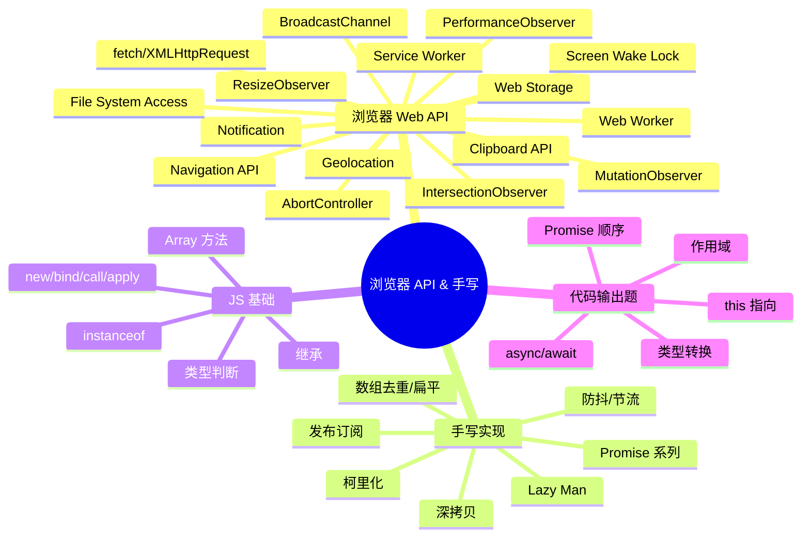

---
title: JavaScript 手写与代码
---
# 🌐 JavaScript 代码篇（Web API · 手写实现 · 输出题）

> **面试权重**：★★★★★（笔试与手撕的硬门槛） ｜ **建议用时**：3 天 ｜ **前置**：JavaScript 核心分册
>
> **分册定位**：S1 的「动手」分册。01 讲浏览器能力、02 讲手写实现、03 讲代码输出题。训练方法是**先写再对答案**：手写题记模板（定时器模板、状态机模板、Map 模板、原型链模板），输出题按三步推导。

## 🧭 分册核心考点

| 主题 | 必会考点 | 面试权重 |
|------|----------|----------|
| Web API | Observer 家族、存储与通信 API、`AbortController`、Service Worker | 🔥🔥🔥 |
| 手写：函数工具 | 防抖、节流、柯里化、`compose` | 🔥🔥🔥 |
| 手写：原型与 this | `new`、`call/apply/bind`、`instanceof`、继承 | 🔥🔥🔥 |
| 手写：异步 | Promise 骨架、`all/race/allSettled/any`、并发调度 | 🔥🔥🔥 |
| 手写：对象与模式 | 深拷贝、数组去重/扁平、发布订阅 | 🔥🔥 |
| 输出题 | `this`/作用域 → 类型转换 → 事件循环，三步推导 | 🔥🔥🔥 |

---

## 📈 浏览器 Web API 演进史

> 浏览器 API 的丰富程度，直接反映了 Web 从"文档平台"到"操作系统级平台"的跨越。

### Web API 发展代际

```
DOM 0-1 时代（1995-2000）
  ├─ document.getElementById / window.alert
  ├─ XMLHttpRequest（1999，改变世界）
  └─ 基础事件处理

HTML5 API 爆发（2008-2014）
  ├─ Web Storage / IndexedDB（本地存储）
  ├─ Web Worker / WebSocket（多线程 + 实时）
  ├─ Canvas / SVG / Audio/Video（多媒体）
  ├─ Geolocation / Drag & Drop（设备能力）
  └─ History API / requestAnimationFrame（SPA 基础）

现代 API 成熟（2015-2020）
  ├─ fetch / Service Worker / Cache API（PWA）
  ├─ IntersectionObserver / ResizeObserver（高效感知）
  ├─ WebRTC / Web Bluetooth / Web USB（设备通信）
  ├─ Clipboard / File System Access（生产力）
  └─ Performance API / Network Information（监控）

前沿 API 爆发（2021-2026）
  ├─ WebGPU / WebNN / WebAssembly（AI + 高性能）
  ├─ View Transitions / Navigation API（应用体验）
  ├─ Screen Wake Lock / Window Management（设备集成）
  ├─ AbortController / Compression Streams（控制流）
  └─ File System / Web Locks / BroadcastChannel（平台级）
```

---

## 📌 知识脑图



---


## 目录与建议顺序

| 顺序 | 篇目 | 重点 | 用时 |
|------|------|------|------|
| 1 | [浏览器 Web API](./01-浏览器WebAPI) | Observer 家族、存储与通信、控制流与离线 | 1 天 |
| 2 | [手写代码实现](./02-手写实现) | 函数工具、原型与 this、异步、对象与设计模式 | 持续练习 |
| 3 | [代码输出题](./03-代码输出题) | `this`/作用域、类型转换、事件循环 | 1 天 |

> ✅ 每篇末尾都有「自测清单」；手写题建议计时完成（单题 ≤ 15 分钟），输出题要求口述推导过程。
>
> 🔗 关联：[JavaScript 核心](../JavaScript核心/) ｜ [S1 阶段总纲](../index.md) ｜ [S3 篇四 算法题解](../../S3-进阶提升/04-算法题解)

