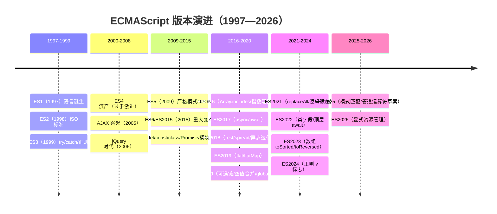
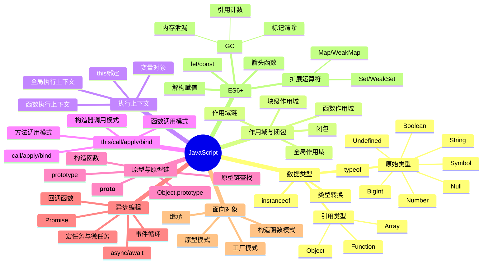

---
title: JavaScript 核心知识
---
# 📜 JavaScript 知识详解（面试精华版）

> **面试权重**：★★★★★（JS 是前端面试的主战场） ｜ **建议用时**：8 天 ｜ **前置**：HTML / CSS 基础
>
> **分册定位**：S1 的「语言内核」分册。建议按 01 → 06 的顺序推进：先建立类型与语法基础，再攻原型/作用域/闭包，然后是 this 与异步，最后收口于 GC/事件循环/新特性与 TypeScript。
>
> JavaScript 核心知识全面梳理，涵盖数据类型、闭包、原型链、异步编程、ES6+ 等核心考点
>
> 📌 浏览器 Web API、手写实现、代码输出题在 [JavaScript 代码篇](../JavaScript代码篇/)；框架层对比见 [S2 框架深入 · 框架对比](../S2-框架深入/04-框架对比)。

## 🧭 分册核心考点

| 主题 | 必会考点 | 面试权重 |
|------|----------|----------|
| 类型与转换 | 八种类型、`typeof`/`instanceof`/`toString`、隐式转换 | 🔥🔥🔥 |
| 原型与继承 | `prototype`/`__proto__`、原型链、`class extends` | 🔥🔥🔥 |
| 作用域与闭包 | 执行上下文、作用域链、变量提升与 TDZ、闭包 | 🔥🔥🔥 |
| `this` 与函数 | 绑定优先级、`call/apply/bind` 手写 | 🔥🔥🔥 |
| 异步 | Promise、`async/await`、事件循环、并发控制 | 🔥🔥🔥 |
| 内存 | 垃圾回收算法、内存泄漏与排查 | 🔥🔥 |
| 新特性 | ES2020+ → ES2025 → **ES2026（已发布）** | 🔥🔥 |
| TypeScript | 类型收窄、泛型、类型编程、TS 6 vs TS 7 | 🔥🔥🔥 |

---

## 📈 ECMAScript / JavaScript 版本演进史

> JavaScript 从诞生时 10 天设计的"玩具语言"，演变为全球最广泛使用的编程语言。

### ECMAScript 版本时间线



### 关键版本对比

| 版本 | 年份 | 核心新特性 | 对前端的影响 |
|------|------|-----------|-------------|
| **ES3** | 1999 | try/catch、正则、switch | 语言基础定型 |
| **ES5** | 2009 | 严格模式、JSON、bind | jQuery 时代 |
| **ES6/ES2015** | 2015 | **let/const、class、Promise、模块** | **现代 JS 起点** |
| **ES2017** | 2017 | async/await、Object.entries/values | 异步编程范式革新 |
| **ES2020** | 2020 | 可选链、空值合并、globalThis | 代码简洁性提升 |
| **ES2022** | 2022 | 类字段、顶层 await | OOP + 模块完善 |
| **ES2023** | 2023 | 数组不可变方法 | 函数式编程增强 |
| **ES2024** | 2024 | 正则 v 标志 | 正则增强 |
| **ES2025** | 2025 | 模式匹配、管道运算符 | 元编程成熟 |

### 为什么 ES6 是 JavaScript 的分水岭？

```
ES5 时代（2009-2015）："增强的脚本语言"
  ├─ var 函数作用域（变量提升陷阱）
  ├─ function 声明
  ├─ 回调地狱
  ├─ 手动模块化（IIFE/AMD/CMD）
  └─ Object.defineProperty 开始可用

ES6 时代（2015+）："现代化的编程语言"
  ├─ let/const 块级作用域
  ├─ 箭头函数 + class 语法糖
  ├─ Promise + async/await
  ├─ 原生模块（import/export）
  ├─ Proxy/Reflect 元编程
  └─ Symbol/BigInt/Map/Set 新数据结构
```

---

## 📌 知识脑图



---

> 📌 **关联文件**：浏览器 WebAPI / 手写实现 / 代码输出 → [JavaScript 代码篇](../JavaScript代码篇/) ｜ 框架对比 → [S2 框架深入 · 04-框架对比](../S2-框架深入/04-框架对比) ｜ 阶段总纲 → [S1 基础夯实](../index.md)


## 目录与建议顺序

| 顺序 | 篇目 | 重点 | 用时 |
|------|------|------|------|
| 1 | [数据类型与 ES6](./01-数据类型与ES6) | 八种类型、隐式转换、ES6 语法与 Map/Set/Proxy | 1.5 天 |
| 2 | [JavaScript 基础](./02-JavaScript基础) | `new`、`call/apply/bind`、继承、数组方法 | 1.5 天 |
| 3 | [原型、作用域与闭包](./03-原型作用域与this) | 原型链、`instanceof`、执行上下文、闭包 | 1.5 天 |
| 4 | [this 绑定与异步编程](./04-异步编程) | `this` 规则、Promise、事件循环、并发控制 | 2 天 |
| 5 | [垃圾回收、事件循环与新特性](./05-垃圾回收事件循环与新特性) | GC、内存泄漏、事件循环、ES2025/ES2026 | 1.5 天 |
| 6 | [TypeScript 高频题](./06-TypeScript高频题) | 类型收窄、泛型、类型编程、TS 6 vs 7（含 22 题索引） | 1.5 天 |

> ✅ 每篇末尾都有「自测清单」，读完即用来自查；答不出的条目回到对应章节补。

