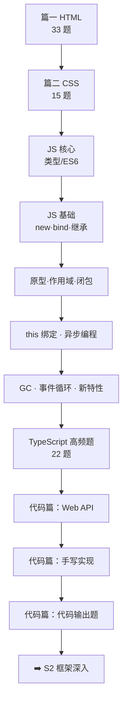

# 📘 S1 基础夯实 · 阶段总纲

> **版本**：v2.0（2026-10-10 体系化重构）｜ **题量**：**70 道**套用统一模板的题（HTML 33 + CSS 15 + TypeScript 22），另有 JS 各篇大量「章内问答」
> **适用对象**：① 准备前端面试（本仓库主要读者）；② 想系统补齐 HTML/CSS/JS/TS 基础的工程师
> **维护原则**：**版本事实联网核验**（见第 6 节）、**重难点显式标注**、**每题都有难度/频率/考点/记忆关键词/误区/一句话总结**

---

## 0. 三种用法，按需进入

| 你的处境 | 建议路径 |
|----------|----------|
| **系统学（2~3 周）** | 篇一 HTML → 篇二 CSS → JS 分册（数据类型 → 基础 → 原型作用域 → this/异步 → GC/新特性 → TS）→ 代码篇（Web API → 手写 → 输出题） |
| **1 周突击面试** | 直接读第 4 节「必考 Top 30」→ 逐题只看 **💡 记忆关键词** 与 **📝 一句话总结** → 用各篇「✅ 自测清单」查漏 |
| **只补短板** | 看第 2 节定位表 → 跳到对应篇的题目索引表（HTML/CSS/TS 有）或核心考点表 → 优先读带 🔥 的内容 |
| **手撕专项** | 代码篇 02 手写实现 + 代码篇 03 输出题 + JS 04（this/异步）+ S3 篇四算法题解 |

---

## 1. 阅读标记

| 标记 | 含义 |
|------|------|
| ⭐ ~ ⭐⭐⭐⭐⭐ | 难度：⭐⭐ 以下必会，⭐⭐⭐ 进阶，⭐⭐⭐⭐+ 专家级 |
| 🔥 | 面试高频（80%+ 概率被问） |
| 📌 | 常考（50%~80%） |
| 📖 | 了解即可（<50%，有时间再看） |
| 💡 记忆关键词 | 面试前 30 秒快速回忆 |
| ⚠️ 常见误区 | 最容易答错/被追问的点 |
| 📝 一句话总结 | 面试时组织语言的模板 |

---

## 2. 内容定位与知识地图

| 篇 | 文件 | 定位 | 面试权重 | 建议用时 | 题量 |
|----|------|------|----------|----------|------|
| 篇一 | [01-HTML](./01-HTML) | 语义化、资源加载、HTML5 能力、Web Components、PWA、ARIA | ★★★★☆ | 2 天 | 33 |
| 篇二 | [02-CSS](./02-CSS) | 选择器与层叠、盒模型、Flex/Grid、定位、动画、现代 CSS、性能 | ★★★★☆ | 3 天 | 15 |
| 篇三 | [JavaScript 核心](./JavaScript核心/) | 数据类型/ES6、基础手写、原型作用域闭包、this 与异步、GC 与事件循环、TypeScript | ★★★★★ | 8 天 | 22（TS） |
| 篇四 | [JavaScript 代码篇](./JavaScript代码篇/) | 浏览器 Web API、手写实现、代码输出题 | ★★★★★ | 3 天 | 章内问答 |

---

## 3. 各篇核心考点速览

| 篇 | 三个必须答出的点 |
|----|------------------|
| HTML | ① `src` vs `href`、`defer`/`async`；② 语义化与 ARIA 的收益；③ Web Components / Service Worker / Popover·Dialog 的能力边界 |
| CSS | ① 优先级与层叠上下文；② 盒模型、BFC、margin 合并；③ Flex vs Grid 与「为什么改 transform 不触发回流」 |
| JS 核心 | ① 原型链与 `instanceof`；② 闭包与作用域、变量提升/TDZ；③ `this` 绑定 + Promise + 事件循环 |
| TypeScript | ① `unknown` 与类型收窄；② 泛型 + `keyof`/条件/映射类型；③ `satisfies` vs `as const`、TS 6 vs TS 7 |
| 代码篇 | ① 防抖/节流/深拷贝/curry；② `new`/`bind`/继承/Promise 手写；③ 输出题的三步推导法 |

---

## 4. 必考 Top 30（跨篇）

| # | 题目 | 出处 | 难度 | 频率 |
|---|------|------|------|------|
| 1 | `src` 与 `href` 的区别 | 篇一-Q1 | ⭐⭐ | 🔥 |
| 2 | `defer` 与 `async` 的区别 | 篇一-Q4 | ⭐⭐⭐ | 🔥 |
| 3 | HTML 语义化的理解 | 篇一-Q2 | ⭐⭐ | 🔥 |
| 4 | Web Components 三件套与能力边界 | 篇一-Q21 | ⭐⭐⭐ | 🔥 |
| 5 | Service Worker 与 PWA 三要素 | 篇一-Q32 | ⭐⭐⭐ | 🔥 |
| 6 | `preload`/`prefetch`/`preconnect` 区别 | 篇一-Q22 | ⭐⭐⭐ | 📌 |
| 7 | ARIA 三要素与「原生优先」 | 篇一-Q30 | ⭐⭐⭐ | 🔥 |
| 8 | Canvas 与 SVG 的区别 | 篇一-Q15 | ⭐⭐⭐ | 🔥 |
| 9 | HTML 解析阶段与阻塞点 | 篇一-Q33 | ⭐⭐⭐⭐ | 📌 |
| 10 | CSS 选择器优先级怎么算 | 篇二-Q1 | ⭐⭐⭐ | 🔥 |
| 11 | 两种盒模型与 `box-sizing` | 篇二-Q2 | ⭐⭐ | 🔥 |
| 12 | BFC 是什么、解决什么 | 篇二-Q3 | ⭐⭐⭐ | 🔥 |
| 13 | 水平垂直居中的方案 | 篇二-Q4 | ⭐⭐ | 🔥 |
| 14 | `flex: 1` 到底代表什么 | 篇二-Q5 | ⭐⭐⭐ | 🔥 |
| 15 | Flex 与 Grid 怎么选 | 篇二-Q6 | ⭐⭐ | 🔥 |
| 16 | 层叠上下文与 `z-index` 失效 | 篇二-Q8 | ⭐⭐⭐⭐ | 🔥 |
| 17 | 哪些操作触发回流与重绘 | 篇二-Q13 | ⭐⭐⭐ | 🔥 |
| 18 | CSS 变量与预处理器变量 | 篇二-Q14 | ⭐⭐⭐ | 📌 |
| 19 | `new` 的实现原理 | JS 核心 02 | ⭐⭐⭐ | 🔥 |
| 20 | 手写 `call`/`apply`/`bind` | JS 核心 02/04 | ⭐⭐⭐ | 🔥 |
| 21 | 原型与原型链、`instanceof` | JS 核心 03 | ⭐⭐⭐ | 🔥 |
| 22 | 闭包与 `for` + `var` 经典题 | JS 核心 03 | ⭐⭐⭐ | 🔥 |
| 23 | `this` 绑定规则与优先级 | JS 核心 04 | ⭐⭐⭐ | 🔥 |
| 24 | Promise 原理与手写 | JS 核心 04 | ⭐⭐⭐⭐ | 🔥 |
| 25 | 事件循环与微/宏任务顺序 | JS 核心 05 | ⭐⭐⭐ | 🔥 |
| 26 | 垃圾回收与内存泄漏 | JS 核心 05 | ⭐⭐⭐ | 🔥 |
| 27 | `unknown` vs `any` 与类型收窄 | JS 核心 06-Q3/Q6 | ⭐⭐⭐ | 🔥 |
| 28 | `interface` vs `type` | JS 核心 06-Q2 | ⭐⭐ | 🔥 |
| 29 | 泛型与 `keyof`/条件/映射类型 | JS 核心 06-Q4/Q8 | ⭐⭐⭐⭐ | 🔥 |
| 30 | 手写防抖/节流/深拷贝 | 代码篇 02 | ⭐⭐⭐ | 🔥 |

---

## 5. 学习路径

### 5.1 三周系统路线

| 周 | 内容 | 产出 |
|----|------|------|
| 第 1 周 | 篇一 HTML + 篇二 CSS | 手写一个语义化、可访问（ARIA）的页面 + 用 Flex/Grid 完成三栏与响应式卡片 |
| 第 2 周 | JS 核心 01~05 | 默写 `new`/`bind`/继承/Promise/并发调度；推导 10 道输出题 |
| 第 3 周 | JS 核心 06（TS）+ 代码篇 | 用 TS 为一个工具库写完整类型；完成 Observer 埋点与手写题清单 |

**每日节奏**：1 小时阅读 + 1 小时动手。手写题必须「先写再对答案」，否则记不住。

### 5.2 一周突击路线

| 天 | 内容 |
|----|------|
| 第 1 天 | Top 30 第 1~9 题（HTML） |
| 第 2~3 天 | Top 30 第 10~18 题（CSS） |
| 第 4~5 天 | Top 30 第 19~26 题（JS 核心） |
| 第 6 天 | Top 30 第 27~30 题（TS + 手写） |
| 第 7 天 | 代码篇输出题 + 各篇自测清单查漏 |

---

## 6. 版本口径（2026-10-10 联网核验，全阶段统一）

| 技术 / 标准 | 真实状态 | 备注 |
|-------------|----------|------|
| TypeScript | **7.0.2**（`rc` `7.0.1-rc`，`next` `7.1.0-dev`） | TS 7 为 Go 原生编译器（tsgo）主线 |
| Angular 对 TS 的约束 | 只支持 `typescript >=6.0 <6.1` | **Angular 22 不支持 TS 7**（跨阶段易错点） |
| ECMAScript | **ES2026（第 17 版）已正式发布** | 代表特性：**Temporal API**、`using`/`await using` 显式资源管理 |
| ES2025 | 已发布 | 迭代器助手、`Promise.try`、`Set` 集合运算、`RegExp.escape` |
| HTML/CSS 新特性 | 支持度随浏览器变化 | View Transitions、Popover API、容器查询、`:has()`、`@layer` 等以 MDN/caniuse 为准 |

> **写作口径**：语言与标准版本可用「已发布/草案 Stage」表述；浏览器 API 必须标注「支持度需查」，不得断言全量可用。

---

## 7. 阶段自测清单（答不出就回对应篇补）

- [ ] 能说清 `src`/`href`、`defer`/`async` 的差异与影响
- [ ] 能列举语义化的三重收益，并写出一个带 ARIA 的可访问组件
- [ ] 能按「内联 > ID > 类 > 元素」比较优先级，解释层叠上下文
- [ ] 能说出 BFC 三类用途、margin 合并的规避方式
- [ ] 能写出 3 种居中方案，解释 `flex: 1` 与 Grid `fr`
- [ ] 能说出八种数据类型与可靠的类型判断方式
- [ ] 能手写 `new`、`call/apply/bind`、`instanceof`、继承
- [ ] 能解释闭包、TDZ 与作用域链，并推导经典输出题
- [ ] 能手写 Promise 骨架与并发调度器
- [ ] 能推导事件循环的顺序题，并比较浏览器与 Node 的差异
- [ ] 能列举 4 类内存泄漏场景与排查手段
- [ ] 能区分 `unknown`/`any`，写出类型守卫与判别联合
- [ ] 能手写一个工具类型，并说清 `satisfies` vs `as const`
- [ ] 能手写防抖/节流/深拷贝，并说明边界处理
- [ ] 面对输出题能按「this/作用域 → 类型转换 → 事件循环」三步推导

---

## 8. 与其他阶段的衔接

- **后续**：[S2 框架深入](../S2-框架深入/)（框架原理建立在 JS 原型、异步、闭包之上）、[S3 进阶提升](../S3-进阶提升/)、[S4 面试冲刺](../S4-面试冲刺/)
- **横向**：[S5-AI](../S5-AI/)、[S6-Go](../S6-Go/)
- **分册入口**：[JavaScript 核心（6 篇）](./JavaScript核心/) ｜ [JavaScript 代码篇（3 篇）](./JavaScript代码篇/)
