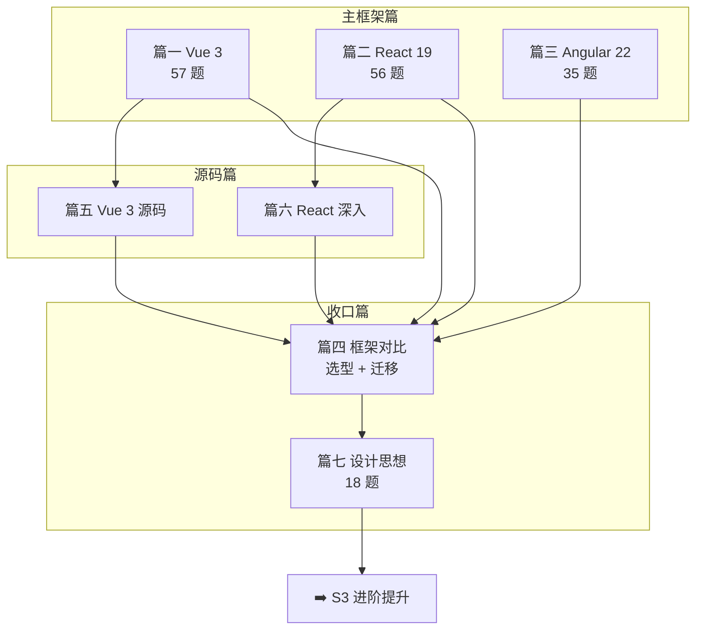

# 📘 S2 框架深入 · 阶段总纲

> **版本**：v2.0（2026-10-10 体系化重构）｜ **题量**：**166 道**，7 篇
> **适用对象**：① 准备前端社招/校招面试（本仓库主要读者）；② 想从「会用框架」升级到「讲清设计取舍」的工程师
> **维护原则**：**版本事实联网核验**（见第 6 节）、**重难点显式标注**、**每题都有难度/频率/考点/记忆关键词/误区/一句话总结**

---

## 0. 三种用法，按需进入

| 你的处境 | 建议路径 |
|----------|----------|
| **系统学（3~4 周）** | 篇一 Vue → 篇二 React → 篇三 Angular → 篇四对比 → 篇五/篇六源码 → 篇七设计思想；每篇读完过一遍「✅ 自测清单」 |
| **1~2 周突击面试** | 直接读第 4 节「必考 Top 30」→ 逐题只看 **💡 记忆关键词** 与 **📝 一句话总结** → 用第 7 节自测清单查漏 |
| **只补短板 / 跨框架对比** | 看第 2 节知识地图定位 → 跳到对应篇的题目索引表 → 重点读带 🔥 的题；框架对比看篇四，设计判断看篇七 |
| **被问「你为什么选这个框架」** | 篇四第 15/16 章（迁移心智差异 + 选型答题框架）+ 篇七第 9 章设计题五步法 |

---

## 1. 阅读标记

| 标记 | 含义 |
|------|------|
| ⭐ ~ ⭐⭐⭐⭐⭐ | 难度：⭐⭐ 以下必会，⭐⭐⭐ 进阶，⭐⭐⭐⭐+ 专家级 |
| 🔥 | 面试高频（80%+ 概率被问） |
| 📌 | 常考（50%~80%） |
| 📖 | 了解即可（<50%，有时间再看） |
| 💡 记忆关键词 | 面试前 30 秒快速回忆 |
| ⚠️ 常见误区 | 最容易答错/被追问的点 |
| 📝 一句话总结 | 面试时组织语言的模板 |
| 🔗 追问链 | 面试官顺着往下问的深挖路径（本篇特色，保留在各题正文末尾） |

---

## 2. 七篇定位与知识地图

| 篇 | 文件 | 定位 | 面试权重 | 建议用时 | 题量 |
|----|------|------|----------|----------|------|
| 篇一 | [01-Vue3](./01-Vue3) | Vue 3 全体系：响应式 → 编译优化 → 组件生态 → 源码 → 工程 | ★★★★★ | 5 天 | 57 |
| 篇二 | [02-React19](./02-React19) | React 19 全体系：渲染链路 → Fiber 调度 → 并发 → Hooks → Compiler → RSC | ★★★★★ | 5 天 | 56 |
| 篇三 | [03-Angular22](./03-Angular22) | Angular 22 全体系：DI → 变更检测 → Signals → 路由表单 → 源码 | ★★★★☆ | 5 天 | 35 |
| 篇四 | [04-框架对比](./04-框架对比) | 三框架横向对比 + 选型决策树 + 迁移心智差异 | ★★★★★ | 2 天 | — （16 章 + 答题框架） |
| 篇五 | [05-Vue3.0源码深度解析](./05-Vue3.0源码深度解析) | Vue 3 源码逐模块剖析 | ★★★★☆ | 2 天 | — （12 章） |
| 篇六 | [06-React深入浅出解析](./06-React深入浅出解析) | React 设计思想与版本演进逐层拆解 | ★★★★☆ | 3 天 | — （25 章） |
| 篇七 | [07-框架设计思想](./07-框架设计思想) | 声明式/命令式、编译时/运行时、响应式三流派、演进趋势、设计题 | ★★★★☆ | 1.5 天 | 18 |

**合计**：166 道题（Vue 57 + React 56 + Angular 35 + 设计思想 18），另有 53 章体系化正文。

---

## 3. 各篇核心考点速览

| 篇 | 三个必须答出的点 |
|----|------------------|
| Vue 3 | ① Proxy 懒代理 + track/trigger 三阶段；② `PatchFlag` + Block Tree 把 diff 压到动态节点；③ `ref`/`reactive` 差异与解构丢失 |
| React 19 | ① Trigger → Render → Commit 与可中断的原因；② Lane + `MessageChannel` 时间切片；③ Hooks 依赖与闭包陷阱 |
| Angular 22 | ① DI 分层注入器与作用域；② Zone.js → Zoneless → Signals 的触发机制演进；③ Signal Forms 与 Reactive Forms 的选型 |
| 框架对比 | ① 三种响应式模型；② 各框架的优化入口；③ 迁移心智差异与选型四步法 |
| 设计思想 | ① 响应式三流派的取舍；② 编译时 vs 运行时的分界；③ 设计题五步法 |

---

## 4. 必考 Top 30（跨框架）

> 按「被问概率 × 区分度」排序。出处列 `篇-题号` 可直接跳转。

| # | 题目 | 出处 | 难度 | 频率 |
|---|------|------|------|------|
| 1 | 说一说你对 Vue 响应式的理解 | 篇一-Q1 | ⭐⭐⭐ | 🔥 |
| 2 | 说说 React 的渲染流程（Trigger → Render → Commit） | 篇二-Q1 | ⭐⭐⭐ | 🔥 |
| 3 | Vue 3 的编译优化具体做了什么 | 篇一-Q2 | ⭐⭐⭐⭐ | 🔥 |
| 4 | React Hooks 为什么不能放在条件/循环中 | 篇二-Q8 | ⭐⭐⭐ | 🔥 |
| 5 | React Fiber 架构如何实现可中断渲染 | 篇二-Q12 | ⭐⭐⭐⭐ | 🔥 |
| 6 | Angular 的变更检测机制？Zone.js 和 Signals 区别 | 篇三-Q1 | ⭐⭐⭐ | 🔥 |
| 7 | Angular 依赖注入（DI）的核心原理 | 篇三-Q2 | ⭐⭐⭐ | 🔥 |
| 8 | Vue 中 Diff 算法怎么理解 | 篇一-Q9 | ⭐⭐⭐ | 🔥 |
| 9 | React 中 setState 是同步还是异步 | 篇二-Q18 | ⭐⭐⭐ | 🔥 |
| 10 | Hooks 闭包陷阱的成因与解决方案 | 篇二-Q25 | ⭐⭐⭐ | 🔥 |
| 11 | Vue 3 中 key 的作用与工作原理 | 篇一-Q23 | ⭐⭐⭐ | 🔥 |
| 12 | React 中 key 使用数组索引有什么危害 | 篇二-Q34 | ⭐⭐ | 🔥 |
| 13 | `nextTick` 的原理 | 篇一-Q8 | ⭐⭐⭐ | 🔥 |
| 14 | watch 和 computed 的区别与选用 | 篇一-Q3 | ⭐⭐ | 🔥 |
| 15 | `ref` 和 `reactive` 的核心区别 | 篇一-Q4 | ⭐⭐ | 🔥 |
| 16 | `useEffect` 与 `useLayoutEffect` 的选择策略 | 篇二-Q43 | ⭐⭐⭐ | 🔥 |
| 17 | `useMemo` / `useCallback` 什么时候必须用 | 篇二-Q27 | ⭐⭐⭐ | 🔥 |
| 18 | Server Component 与 SSR 的区别 | 篇二-Q16 | ⭐⭐⭐⭐ | 🔥 |
| 19 | React 19 Compiler 如何实现自动记忆化 | 篇二-Q11 | ⭐⭐⭐⭐ | 🔥 |
| 20 | React Concurrent 模式解决了什么问题 | 篇二-Q5 | ⭐⭐⭐⭐ | 🔥 |
| 21 | Signals 和 Observables 的核心区别 | 篇三-Q3 | ⭐⭐⭐ | 🔥 |
| 22 | Angular 三种表单方案怎么选 | 篇三-Q7 / Q8 | ⭐⭐⭐⭐ | 🔥 |
| 23 | Angular 内存泄漏与 `takeUntilDestroyed` | 篇三-Q18 / Q34 | ⭐⭐⭐ | 🔥 |
| 24 | Vue 3 内存泄漏排查方法 | 篇一-Q20 | ⭐⭐⭐ | 🔥 |
| 25 | Vue 的模板编译原理 | 篇一-Q45 | ⭐⭐⭐⭐ | 🔥 |
| 26 | Vue 2 与 Vue 3 的核心区别 | 篇一-Q34 | ⭐⭐⭐ | 🔥 |
| 27 | 谈谈你对虚拟 DOM 的理解 | 篇一-Q35 / 篇七-Q2 | ⭐⭐⭐ | 🔥 |
| 28 | 响应式三大流派的区别与代表框架 | 篇七-Q4 | ⭐⭐⭐⭐ | 🔥 |
| 29 | React 为什么不采用细粒度响应式（Signals） | 篇七-Q5 | ⭐⭐⭐⭐ | 🔥 |
| 30 | 为什么 React 需要调度器，Vue 不那么强调 | 篇七-Q11 | ⭐⭐⭐⭐ | 🔥 |

---

## 5. 学习路径

### 5.1 四周系统路线

| 周 | 内容 | 产出 |
|----|------|------|
| 第 1 周 | 篇一 Vue 3（`01`）+ 篇五源码选读 | 手写 30 行 mini 响应式 + 过一遍 Vue 自测清单 |
| 第 2 周 | 篇二 React 19（`02`）+ 篇六第 10~14 章 | 画出 Fiber 与调度流程图 + 过一遍 React 自测清单 |
| 第 3 周 | 篇三 Angular 22（`03`）重点：DI / 变更检测 / Signals / 表单 | 写一个 Zoneless + Signals 的 demo |
| 第 4 周 | 篇四对比 + 篇七设计思想 + 补齐 Top 30 | 准备 3 个「为什么选 X」的口述答案 |

**每日节奏**：1 小时阅读 + 1 小时写代码 > 周末突击 8 小时。每周用对应篇的「✅ 自测清单」做一次周检。

### 5.2 两周突击路线

| 天 | 内容 |
|----|------|
| 第 1~4 天 | Top 30 中自己主用框架的 10 题（看记忆关键词 + 一句话总结 + 追问链） |
| 第 5~7 天 | Top 30 中另外两个框架的各 8 题（只求「能讲清差异」） |
| 第 8~10 天 | 篇四第 15/16 章（迁移 + 选型）+ 篇七第 9 章设计题 |
| 第 11~14 天 | 用第 7 节自测清单查漏 + 模拟口述 5 道综合题 |

---

## 6. 版本口径（2026-10-10 联网核验，全阶段统一）

| 技术 | 真实状态 | 仓库（interview-demo） |
|------|----------|------------------------|
| Vue | stable **3.5.43**；**3.6 仍为 RC**（`3.6.0-rc.11`，未发布） | — |
| React | stable **19.3.0** | `^19.2.7` |
| React Compiler | `babel-plugin-react-compiler` **1.0.0 GA** | `^1.0.0` |
| Angular | `@angular/core` **22.2.2**；21.x LTS `21.2.25` | — |
| TypeScript | **7.0.2**（Angular 22 仅支持 `>=6.0 <6.1`，**不支持 TS 7**） | `^7.0.2` |
| Vite | **8.3.4** | `^8.0.16` |
| react-router | **8.4.0** | `^8.3.1` |
| Nuxt / Pinia | **4.6.1** / **4.0.3** | — |
| Next.js | **16.4.0** | — |
| RxJS | **7.8.2**（`next` 为 9.0.0-beta.1，从无 8.x） | — |
| Vitest | **5.0.3**（4.x 线 `4.1.11`） | `^4.1.9` |

> **写作口径**：stable 主线 + 预览特性单独标注（含成熟度、核验日期、生产建议）。**不得**把 RC 写成已发布；生态版本号一律以 npm 核验结果为准。

---

## 7. 阶段自测清单（答不出就回对应篇补）

- [ ] 能手写一个 mini 响应式系统（Proxy + track + trigger + WeakMap），并解释懒代理的原因
- [ ] 能画出 React 的 Fiber 双缓冲树与「Render 可中断 / Commit 不可中断」的边界
- [ ] 说清三种响应式模型（属性级追踪 / 组件级重渲染 + 调度 / 信号通知）的差异
- [ ] 解释编译时优化与运行时优化的分界，各举三个例子
- [ ] 说清 Vue 的 `PatchFlag`+Block Tree、React 的 Lane+时间切片、Angular 的 OnPush+Signals 各自的优化入口
- [ ] 能对比 `watch`/`computed`、`useEffect`/`useLayoutEffect`、`Signals`/`Observables` 三组易混概念
- [ ] 能给出 Vue↔React↔Angular 三向迁移的各 3 个心智冲突点
- [ ] 面对「为什么选 X」能按「业务 → 技术 → 结论 + 兜底 → 风险」四步作答
- [ ] 面对设计题能按「问题 → 约束 → 方案 → 代价 → 边界」五步作答
- [ ] 说出各框架当前真实版本，并对未发布特性主动标注成熟度
- [ ] 能列举 5 类内存泄漏场景与三个框架的对应清理手段

---

## 8. 与其他阶段的衔接

- **前置**：S1 基础夯实（事件循环、原型、`Proxy`、TypeScript 泛型）
- **后续**：[S3 进阶提升](../S3-进阶提升/)（工程化、性能、架构）、[S4 面试冲刺](../S4-面试冲刺/)（模拟面与复盘）
- **横向**：[S5-AI](../S5-AI/) 中的 AI 应用同样依赖本篇的框架能力（流式渲染、状态管理、性能）
