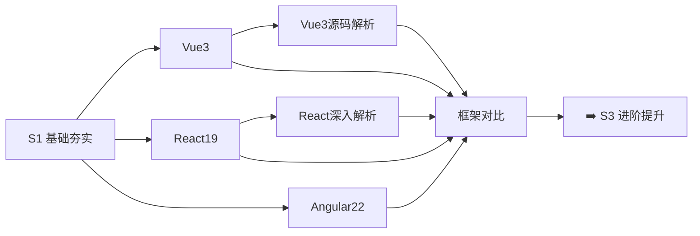

# S2 框架深入 🔵

> **学习目标**：深入掌握三大框架（Vue 3、React 19、Angular 22）的核心原理与实践

## 内容章节

- [🟢 Vue3 面试](./01-Vue3) — Vue 3 面试题精讲：源码级原理、Vue 3.5 稳定特性、Vue 3.6 预览特性、内存泄漏排查
- [🔵 React19 面试](./02-React19) — React 19 面试题精讲：Fiber、Render 调度、性能优化、Hooks 安全、React 19.2 新特性
- [🔴 Angular22 面试](./03-Angular22) — Angular 22 面试题精讲：依赖注入、变更检测、路由守卫、Zoneless、Signal Forms
- [⚖️ 框架对比](./04-框架对比) — Vue 3 vs React 19 vs Angular 22 横向对比
- [🔧 Vue3 源码深度解析](./05-Vue3.0源码深度解析) — 渲染器、响应式系统、编译器、内置组件源码剖析
- [🔬 React 深入浅出解析](./06-React深入浅出解析) — React 设计思想与版本演进逐层拆解

## 学习路线

