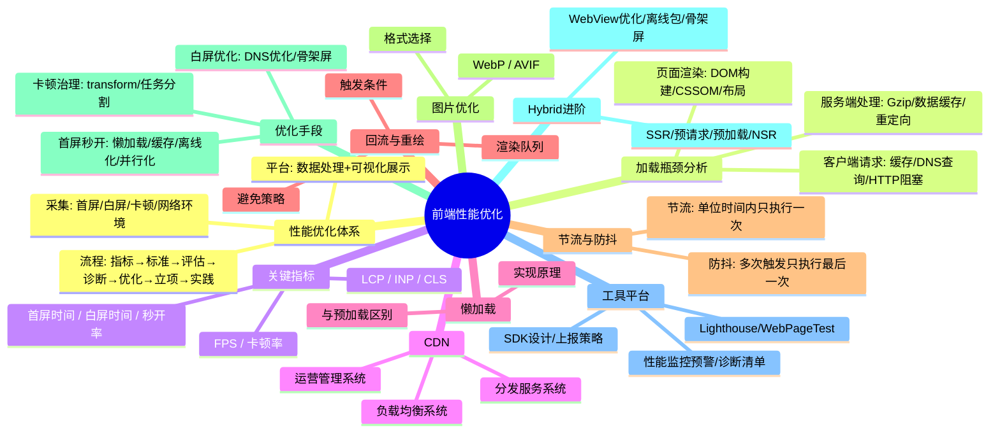
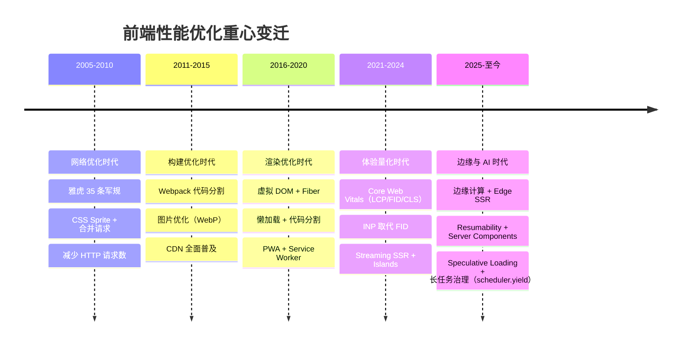
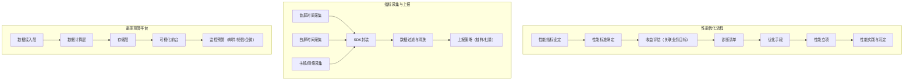
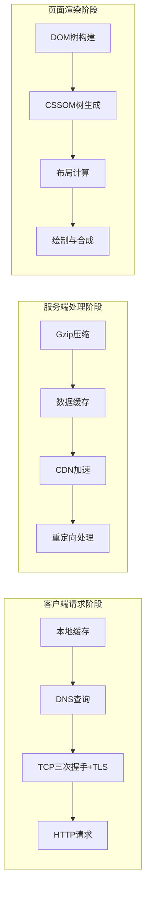
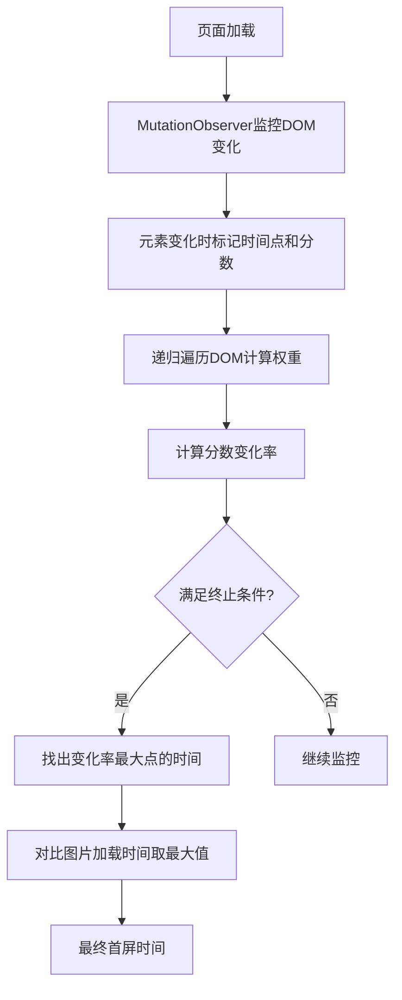
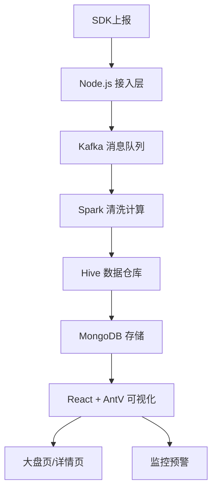
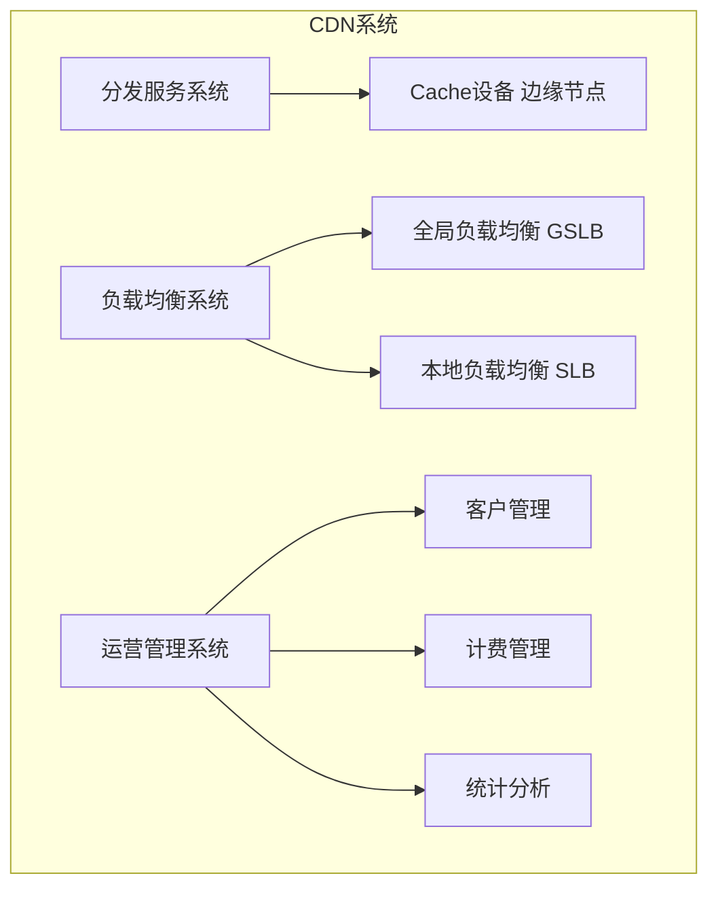
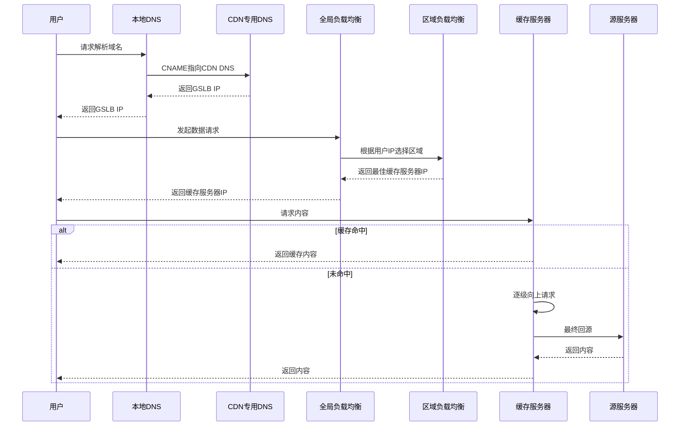

# 篇二 · 02 ⚡ 前端性能优化知识详解版（含 Mermaid 图解）

> **面试权重**：★★★★★（高级岗必考，且最考「有没有真做过」） ｜ **建议用时**：3 天 ｜ **前置**：01 浏览器原理（渲染流水线是优化的前提）
>
> **本篇定位**：S3 的「度量与治理篇」。性能优化面试的分水岭是——**能不能说出指标、基线与复测结果**，而不是罗列优化技巧。本篇按「指标体系 → 瓶颈定位 → 优化手段 → 监控闭环」组织。
>
> 基于拉钩教育《前端性能优化方法与实战》系统梳理，涵盖性能体系、瓶颈分析、指标采集、SDK 设计、监控平台、诊断优化、混合架构等全链路知识
>
> 📝 **版本说明**：Core Web Vitals 的阈值与权重会随 Chrome 团队调整（INP 已取代 FID）；文中的具体数字请以 web.dev 与 CrUX 官方口径为准。

## 🧭 核心考点

| 模块 | 必会考点 | 面试权重 |
|------|----------|----------|
| 指标体系 | LCP / INP / CLS 三档阈值、FCP/TTFB 辅助、Lab vs Field | 🔥🔥🔥 |
| 瓶颈定位 | 关键渲染路径、瀑布图、长任务、Performance 面板 | 🔥🔥🔥 |
| 加载优化 | 代码分割、预加载指令、资源优先级、CDN 与缓存 | 🔥🔥🔥 |
| 渲染优化 | 布局抖动、合成层、虚拟列表、懒加载 | 🔥🔥 |
| 交互优化 | 长任务拆分、`scheduler.yield`、节流防抖、INP 治理 | 🔥🔥🔥 |
| 体验兜底 | 白屏治理、骨架屏、SSR/流式渲染、离线包 | 🔥🔥 |
| 闭环 | 自建 RUM + 采样 + 告警，Lab 防回归、Field 看真实 | 🔥🔥 |

## 🧠 知识脑图



---

## 📈 性能优化技术演进史

> 性能优化的重心随 Web 应用形态的演变而不断迁移。

### 四个时代的性能重心



### Core Web Vitals（现行口径）

> 💡 **要点**：Core Web Vitals 只有 **LCP / INP / CLS** 三个，每个指标都有 Good / Needs Improvement / Poor **三档阈值**（通常取 P75 分位评估）。TTFB、FCP 属于**诊断指标**，不是 CWV。

| 指标 | 全称 | 衡量维度 | Good | Needs Improvement | Poor |
|------|------|---------|------|-------------------|------|
| **LCP** | Largest Contentful Paint | 加载性能 | ≤ 2.5s | 2.5s ~ 4s | **> 4s** |
| **INP** | Interaction to Next Paint | 交互响应 | ≤ 200ms | 200ms ~ 500ms | **> 500ms** |
| **CLS** | Cumulative Layout Shift | 视觉稳定 | ≤ 0.1 | 0.1 ~ 0.25 | **> 0.25** |

**诊断指标（辅助定位，不计入 CWV）：**

| 指标 | 良好 | 说明 |
|------|------|------|
| **TTFB** | ≤ 800ms | 首字节时间，反映服务端与网络链路 |
| **FCP** | ≤ 1.8s | 首次内容绘制 |
| **FID** | 已废弃 | **已被 INP 正式取代**，不再作为核心指标 |

**对应优化策略：**

| 指标 | 优化策略 |
|------|---------|
| **LCP** | 预加载 LCP 资源（`preload` / `fetchpriority="high"`）、CDN、图片格式与尺寸优化、减少阻塞渲染的 CSS/JS、SSR/流式渲染 |
| **INP** | 拆分长任务（`scheduler.yield()` / `setTimeout` 切片 / Web Worker）、减少事件处理器中的同步计算、降低水合成本 |
| **CLS** | 图片/广告位预留尺寸（`width`/`height` 或 `aspect-ratio`）、字体 `font-display: optional` + `size-adjust`、避免动态插入内容到已有内容上方 |

---

## 🏗️ 一、性能优化体系总览

> 💡 **要点**：前端性能优化体系包括三大核心：性能优化流程、指标采集及上报、性能监控预警平台。体系化思考是性能优化的基础，将零散工作系统化。



### 1️⃣ 性能优化流程

1. **性能指标设定**：选择可衡量、关注用户体验的关键指标
2. **性能标准确定**：设定优化目标（如秒开率 > 90%）
3. **收益评估**：关联产品目标（如 VPPV 提升 10%、订单转化率提升 8%）
4. **诊断清单**：接入性能平台，根据标准诊断问题
5. **优化手段**：根据诊断结果选择具体优化方案
6. **性能立项**：成立项目组，获取业务支持
7. **性能实践**：上线跟踪、效果评估、沉淀文档/代码

> 📝 **关键认知**：不要忽视"性能立项"环节。性能优化是跨团队工程，需要产品经理和后端同事的支持。将性能目标翻译为业务收益（如转化率提升），能让项目获得更多资源支持。

### 2️⃣ 关键指标设定及标准

| 指标 | 维度 | 标准 | 说明 |
|------|------|------|------|
| **白屏时间** | 加载 | ≤ 300ms | 输入内容回车到第一个字符出现 |
| **首屏时间** | 加载 | ≤ 1.5s（秒开 < 1s） | 白屏时间 + 渲染时间 |
| **秒开率** | 加载 | ≥ 90% | 1s 内打开用户占比（阿里首创） |
| **LCP** | 加载 | < 2.5s | 最大内容绘制 |
| **INP** | 交互 | < 200ms | 2024 取代 FID |
| **CLS** | 视觉 | < 0.1 | 累计布局偏移 |
| **FPS** | 流畅 | 连续 3 帧 ≥ 20 | 低于此值判定卡顿 |

---

## 🌐 二、页面加载全过程瓶颈分析

> 💡 **要点**：从 URL 输入到页面加载可分为三个阶段：客户端请求、服务端数据处理、页面渲染。每个阶段都有特定的性能瓶颈点。



### 1️⃣ 客户端请求阶段瓶颈

- **本地缓存**：未配置强缓存/协商缓存，每次请求都走完整流程。以 58 列表页为例，无缓存时 DNS 385ms + TCP 436ms + 数据 412ms ≈ 1233ms；有缓存几乎毫秒级完成
  - 强缓存：`Cache-Control: max-age=31536000`
  - 协商缓存：`Etag` / `Last-Modified`
- **DNS 查询**：每次需从手机到移动信号塔再到认证 DNS 服务器
  - 优化：`<link rel="dns-prefetch">` 预解析
- **HTTP 请求阻塞**：浏览器同域名连接数限制（默认 6 个）
  - 优化：域名散列或 HTTP/2 多路复用

### 2️⃣ 服务端处理阶段瓶颈

- **Gzip 压缩**：文本类资源可压缩至原来的 1/3
- **数据缓存**：Service Worker / 本地存储 / CDN 减少重复请求
- **重定向**：302 / META / JS 重定向会引发新的 DNS 查询和 TCP 握手

### 3️⃣ 页面渲染阶段瓶颈

- **DOM 树构建**：标签不语义化需额外容错；DOM 节点过多；`<script>` 阻塞（用 defer/async）
- **CSSOM 生成**：CSS 嵌套过深增加解析时间
- **布局计算**：流模型遍历所有元素，频繁触发重排性能急剧下降

---

## 📊 三、性能指标采集

> 💡 **要点**：性能指标采集分手动和自动化两种。现代方案应以 **Paint Timing（FP/FCP）+ LCP** 为准（浏览器原生、口径统一）；旧的 FMP 打分法仅作兼容参考。

### 1️⃣ 首屏时间采集

#### ✅ 现代方案：Paint Timing + LCP（推荐）

```javascript
// FP / FCP：浏览器原生，SPA 同样适用
new PerformanceObserver((list) => {
  for (const entry of list.getEntries()) {
    if (entry.name === 'first-contentful-paint') {
      report({ metric: 'FCP', value: entry.startTime });
    }
  }
}).observe({ type: 'paint', buffered: true });

// LCP：业界公认的"首屏主要内容可见"指标，取代手写打分
new PerformanceObserver((list) => {
  const entries = list.getEntries();
  const lcp = entries[entries.length - 1]; // LCP 会更新，取最后一个
  report({ metric: 'LCP', value: lcp.startTime, element: lcp.element?.tagName, url: lcp.url });
}).observe({ type: 'largest-contentful-paint', buffered: true });

// 关键元素级监控（Element Timing）：给业务关键元素打点
// 
new PerformanceObserver((list) => {
  for (const e of list.getEntries()) report({ metric: e.identifier, value: e.startTime });
}).observe({ type: 'element', buffered: true });
```

#### 手动采集（埋点方式，兼容老方案）

```javascript
FMP.Start();
// 首屏关键内容加载完毕（头图、价格、购买按钮等）
FMP.End();
// 首屏时间 = FMP.End() - FMP.Start()
```

**优点**：兼容性强、去中心化
**缺点**：与业务耦合、覆盖率不足、结果因人而异

#### 自动化采集 - 服务端模板业务

使用 `DOMContentLoaded`（仅适用于服务端直出，SPA 下不准确）：
```javascript
// Navigation Timing Level 2：不再使用已废弃的 performance.timing
const nav = performance.getEntriesByType('navigation')[0];
const domReady = nav.domContentLoadedEventEnd - nav.startTime;
```

#### 自动化采集 - SPA 业务（旧方案，仅供理解）

SPA 下 `DOMContentLoaded` 只代表空壳 HTML 解析完成（页面仍为空白），因此历史上采用 **MutationObserver 打分法**估算 FMP：

> ⚠️ **Warning**：FMP（First Meaningful Paint）**已被 LCP 取代**，打分法依赖 DOM 结构权重、结果不稳定且不同实现口径不一。新项目请直接用 **LCP + Element Timing**；下面内容用于理解演进与面试追问。



**核心逻辑**：
- 递归遍历 DOM 元素，按层级赋予权重（第一层 1 分，每增一层 +0.5）
- 排除 SCRIPT/STYLE/META/HEAD 标签，超出可视范围返回 0 分
- 终止条件：超过 30s / 4 轮且 1s 内分数不变 / 9 次且分数不变
- 图片处理：获取 IMG src 和 DIV 背景图 URL，用 `performance.getEntriesByName()` 获取下载时间，与 DOM 时间比较取最大值

### 2️⃣ 白屏时间采集

> ⚠️ **Warning**：`domLoading` 属于 **Navigation Timing Level 1**（`performance.timing`，已废弃），Level 2 中已移除该字段，**不要再使用**。白屏时间应直接用 Paint Timing 的 `first-paint`。

```javascript
// ✅ 正确：FP（首次绘制）即白屏结束时间点
new PerformanceObserver((list) => {
  for (const entry of list.getEntries()) {
    if (entry.name === 'first-paint') {
      report({ metric: 'FP', value: entry.startTime }); // 相对 navigationStart 的高精度时间
    }
  }
}).observe({ type: 'paint', buffered: true });

// ❌ 已废弃写法（仅作对照，不要再用）
// 白屏时间 FP = performance.timing.domLoading - performance.timing.navigationStart
```

```text
App 端：白屏时间 FP = WebView 初始化时间 + 浏览器端 FP
```

App 下多了 WebView 初始化时间，需在创建 WebView 和开始网络连接时分别打点获取。

### 3️⃣ 卡顿指标采集

**H5 场景**：`requestAnimationFrame` 计算 FPS

```javascript
function isBlocking(fpsList, below = 20, last = 3) {
    let count = 0;
    for (let i = 0; i < fpsList.length; i++) {
        if (fpsList[i] && fpsList[i] < below) count++;
        else count = 0;
        if (count >= last) return true;
    }
    return false;
}
```

**App 场景**：
- Android：`mChoreographer.getFrameTimeNanos()` 单帧渲染时长 > 250ms 严重卡顿，连续 5 次 > 50ms 卡顿
- iOS：`CFRunLoopObserverContext` 监控 RunLoop 节点间耗时

### 4️⃣ 网络环境采集

**优先使用 Network Information API**（浏览器原生，配合 RUM 做弱网分析）：

```javascript
const conn = navigator.connection;
if (conn) {
  report({
    effectiveType: conn.effectiveType, // '4g' | '3g' | '2g' | 'slow-2g'
    downlink: conn.downlink,           // 估算带宽（Mbps）
    rtt: conn.rtt,                     // 估算往返时延（ms）
    saveData: conn.saveData,           // 用户开启了省流量模式
  });
}
```

> 📝 **Note**：`navigator.connection` 在部分浏览器/端内 WebView 不可用。此时才降级为**图片测速**（历史方案）：

```text
请求 1x1 和 3x3 两张图片 → 记录加载时间 → 计算网速 → 概率分布判定
2G(750-1400ms) / 3G(230-750ms) / 4G/WiFi(0-230ms)（阈值为经验值，需按业务校准）
```

---

## 📦 四、性能 SDK 及上报策略设计

> 💡 **要点**：SDK 将指标采集封装为 Perf API（FMP/FP/BLOCK），一键初始化。上报需考虑日志过滤、数据抽样、网络自适应等策略。

### 1️⃣ SDK 设计

```javascript
// npm 接入
import { perfInit } from '@common/perf';
perfInit();

// 外链接入
<script src="https://s1.static.com/common/perf/1.0.0/perf.min.js"></script>
<script>try { perfInit(); } catch (err) { console.warn(err); }</script>
```

**设计要点**：
- 原生 JS 实现跨技术栈采集
- try catch 容错，不影响宿主页面
- 适配层统一不同终端（PC/移动端/小程序）
- 提供调试参数（`?PERF_DEV_MODEL=PERF_DEV_MODEL`）开启诊断模式

### 2️⃣ 上报策略

| 策略 | 说明 |
|------|------|
| **日志过滤** | 丢弃负值/非数值/超过 15s 等异常数据 |
| **数据抽样** | 日活千万级抽样 10%，活动时可动态降低 |
| **网络自适应** | 强网上报，弱网存储本地延后上报 |
| **空闲上报** | 浏览器侧 `requestIdleCallback` / App 空闲时批量上报 |
| **优先 Native** | 复用客户端连接，支持延时/批量 |

**传输方式选择（Web 侧）：**

| 方式 | 方法 | 大小限制 | 页面卸载可靠 | 说明 |
|------|------|---------|------------|------|
| `navigator.sendBeacon` | 仅 POST | Blob 约 64KB（超限静默失败） | ✅ | **首选**，卸载阶段最稳 |
| `fetch(..., { keepalive: true })` | GET/POST | 较小配额 | ✅ | sendBeacon 的替代/分片补充 |
| 图片打点（`new Image().src`） | 仅 GET | 受 URL 长度限制 | ✅ | 兼容性兜底 |
| XHR 同步 | 任意 | 无 | ✅ | **已废弃**，阻塞主线程，仅关键错误兜底 |

> 📝 **Note**：采样必须**同时上报 `sampleRate`**，服务端按 `1 / sampleRate` 加权还原真实量级；否则两个版本对比时采样率不一致会得出错误结论。

---

## 🖥️ 五、性能监控预警平台

> 💡 **要点**：数据流 SDK→Kafka→Spark/Hive→MongoDB→React/AntV 可视化。功能包括大盘页、详情页、监控预警。



**数据处理**：
- 入库：Node.js 接收 → URL 解析 key-value → 空数据/异常数据删除 → Kafka
- 清洗：去重、补全缺失、舍弃超范围数据
- 计算：首屏分布、秒开率、瀑布流时间（DNS/TCP/请求/传输/解析/加载）

**预警规则**：
- 超出标准 10%：企业微信通知
- 超出 20%：邮件通知
- 超出 30%：短信通知

---

## 🔍 六、诊断清单

| 维度 | 诊断思路 | 案例 |
|------|---------|------|
| **全量 vs 增量** | 是否一次性加载过多数据？ | App 列表页首屏只拉 4 条，滚动再加载 |
| **同步 vs 异步** | 接口串行阻塞？可否并行？ | 导航位和商品列表并行请求 |
| **实时 vs 缓存** | 非实时数据可否缓存？ | 榜单/排行数据定时更新 |
| **原片 vs 压缩** | 图片是否是原图？ | 先展示低质量图，用户关注时加载清晰图 |

**问题诊断流程**：用户反馈 → 确认共性/个例 → 共性问题看均值/分位值 → 定位终端 → 查看瀑布流 → 优化

> 📝 **AB 测试**：优化前后需先做 AA 测试（波动率 < 万分之一），再在订单标记 version=A/B，通过埋点统计转化率。

---

## 🌐 七、CDN

### 1️⃣ CDN 的概念

> CDN（内容分发网络）通过将内容缓存到离用户最近的节点来加速交付，由分发服务系统、负载均衡系统、运营管理系统三大子系统组成。



### 2️⃣ CDN 的工作原理



> 📝 **扩展**：CDN 使用场景包括第三方库引用加速、静态资源缓存分发、直播流媒体传送。性能上降低延迟减轻服务器负载，安全上防御 DDoS 和 MITM。

---

## 💤 八、首屏秒开优化（4 重保障）

> 💡 **要点**：懒加载减少非关键内容请求，缓存避免重复请求，离线化静态化本地，并行化增加请求通道。

### 1️⃣ 懒加载

> 现代推荐使用 **Intersection Observer API**，性能优于传统 scroll 事件监听。

```javascript
const lazyImages = document.querySelectorAll('img[data-src]');
const imageObserver = new IntersectionObserver((entries) => {
    entries.forEach(entry => {
        if (entry.isIntersecting) {
            const img = entry.target;
            img.src = img.dataset.src;
            img.removeAttribute('data-src');
            imageObserver.unobserve(img);
        }
    });
}, { rootMargin: '100px 0px', threshold: 0.01 });
lazyImages.forEach(img => imageObserver.observe(img));
```

### 2️⃣ 缓存

- **接口缓存**：端内走 Native 请求（WebView 初始化前即可请求数据）
- **强缓存**：`Cache-Control: max-age=31536000`
- **协商缓存**：Etag + If-None-Match

### 3️⃣ 离线化

适合首页/列表页等无需登录场景，支持 SEO。

```javascript
// Webpack 预渲染
new PrerenderSpaPlugin(
    path.join(__dirname, '../dist'),
    ['/', '/about', '/contact']
)
```

### 4️⃣ 并行化 - HTTP/2

HTTP/2 多路复用解决串行传输和同域名 6 连接限制，不再需要合并 JS/CSS 和域名散列。

---

## 🔄 九、回流与重绘

### 1️⃣ 概念及触发条件

- **回流（Reflow）**：元素尺寸/结构变化导致重新布局，影响范围分全局和局部
- **重绘（Repaint）**：仅样式变化不影响布局

**触发回流**：首次渲染、窗口大小变化、元素尺寸/位置/内容变化、字体变化、DOM 增删、激活 CSS 伪类、查询某些属性（offsetTop/scrollTop/clientWidth/getComputedStyle）
**触发重绘**：color/background/outline/border-radius/visibility/box-shadow 变化

> ⚠️ 回流必定触发重绘，重绘不一定引发回流。

### 2️⃣ 避免策略

- 低层级 DOM 操作
- 避免 table 布局
- `will-change` 提前告知浏览器
- 修改 class 而非逐条修改样式
- `position: absolute/fixed` 脱离文档流
- `DocumentFragment` 批量操作
- `display: none` 后操作
- **读写分离**：利用渲染队列，批量处理写操作后再读

---

## 🎯 十、节流与防抖

### 1️⃣ 概念

- **防抖**：连续触发只执行最后一次（按钮提交 / 搜索联想 / 表单验证）
- **节流**：单位时间只执行一次（拖拽 / resize / 滚动 / 动画）

### 2️⃣ 实现

```javascript
// 防抖
function debounce(fn, wait) {
    let timer = null;
    return function() {
        const context = this, args = [...arguments];
        if (timer) { clearTimeout(timer); timer = null; }
        timer = setTimeout(() => { fn.apply(context, args); }, wait);
    };
}

// 节流 - 时间戳版（立即执行第一次，停止不再执行）
function throttle(fn, delay) {
    let preTime = Date.now();
    return function() {
        const context = this, args = [...arguments], nowTime = Date.now();
        if (nowTime - preTime >= delay) {
            preTime = Date.now();
            return fn.apply(context, args);
        }
    };
}

// 节流 - 定时器版（延迟执行第一次，停止后执行最后一次）
function throttle(fun, wait) {
    let timeout = null;
    return function() {
        let context = this, args = [...arguments];
        if (!timeout) {
            timeout = setTimeout(() => {
                fun.apply(context, args);
                timeout = null;
            }, wait);
        }
    };
}
```

---

## 🖼️ 十一、图片优化

1. CSS 代替修饰类图片
2. 按需裁剪 + 响应式尺寸（`srcset` / `sizes` / `<picture>`）
3. 小图内联（Base64 或 SVG 内联）；**雪碧图在 HTTP/2+ 下已无必要**（多路复用使合并请求不再有收益，反而降低缓存粒度）
4. 现代格式：**WebP** / **AVIF**（JPEG XL 支持度不足，暂不建议作为主格式）
5. SVG 矢量不失真，适合 Logo / 图标

**图片格式横向对比：**

| 格式 | 压缩类型 | 相对 JPEG 体积 | 透明 | 动画 | 浏览器支持 | 建议 |
|------|---------|---------------|------|------|-----------|------|
| **JPEG** | 有损 | 基准 | ❌ | ❌ | 全部 | 兼容性兜底 |
| **PNG** | 无损 | 更大 | ✅ | ❌ | 全部 | 需要无损/透明的小图 |
| **GIF** | 无损（256 色） | 大 | ✅ | ✅ | 全部 | 仅简单动图（已被 WebP/AVIF 取代） |
| **WebP** | 有损/无损 | 约小 **25%~35%** | ✅ | ✅ | **现代浏览器普遍支持** | **首选**，兼顾体积与兼容 |
| **AVIF** | 有损（AV1） | 约小 **40%~50%** | ✅ | ✅ | 现代浏览器支持（渐进普及） | 对体积敏感场景，配合 WebP 回退 |
| **JPEG XL** | 有损/无损 | 理论更优 | ✅ | ✅ | **支持度不足**（主流浏览器已移除或从未默认启用） | ❌ 暂不建议生产使用 |

> ⚠️ **Warning**：「JPEG XL 小 60%」是过时说法——其浏览器支持长期不足，主流 Chromium 已移除支持，不应作为选型依据。生产做法是用 `<picture>` 做**渐进回退**：

```html
<picture>
  <source srcset="hero.avif" type="image/avif" />
  <source srcset="hero.webp" type="image/webp" />
  
</picture>
```

**懒加载三种方案对比：**

| 方案 | 用法 | 优点 | 局限 | 适用 |
|------|------|------|------|------|
| `loading="lazy"` | `` | 零 JS、浏览器原生 | 无法自定义触发时机与阈值 | 图片/iframe 首选 |
| `IntersectionObserver` | 观察元素进入视口 | 可控（rootMargin/threshold），可做曝光埋点 | 需写 JS | 复杂列表、需预加载距离控制 |
| `content-visibility: auto` | CSS 属性 | 跳过视口外元素的**渲染与布局**，长列表收益大 | 需配合 `contain-intrinsic-size` 避免滚动条抖动 | 超长列表/文档页 |

```css
/* 长列表渲染优化：视口外内容跳过布局与绘制 */
.list-item {
  content-visibility: auto;
  contain-intrinsic-size: auto 200px; /* 预留占位高度，避免滚动条跳动 */
}
```

---

## 🛠️ 十二、加载与渲染优化

### 1️⃣ Resource Hints

| 类型 | 用途 |
|------|------|
| `preload` | 提前加载当前页关键资源 |
| `prefetch` | 预取下一页可能用到的资源 |
| `preconnect` | 提前建立源站连接 |
| `dns-prefetch` | 仅提前解析 DNS |
| `modulepreload` | 预加载 ES Module 及其依赖 |
| `prerender`（旧）/ **Speculation Rules**（新） | 后台完整预渲染下一页，点击即展示 |

**优先级控制（LCP 优化关键）：**

```html
<!-- 提升 LCP 图片优先级，避免被排在 CSS/字体之后 -->

<!-- 降低非关键图片优先级 -->

```

### 2️⃣ 代码分割

```javascript
// React
const Home = React.lazy(() => import('./pages/Home'));
// Vue 3
const HeavyChart = defineAsyncComponent(() => import('./components/HeavyChart.vue'));
```

### 3️⃣ HTTP/2 vs HTTP/3

| 特性 | HTTP/2 | HTTP/3 |
|------|--------|--------|
| 传输协议 | TCP | QUIC (基于 UDP) |
| 队头阻塞 | 传输层(TCP) | 无 |
| 连接建立 | 1次 TCP + 协商 | 0-RTT / 1-RTT |
| 头部压缩 | HPACK | QPACK |

### 4️⃣ 渲染优化

**content-visibility**：一行 CSS 实现长列表虚拟渲染
```css
.long-list-item {
    content-visibility: auto;
    contain-intrinsic-size: 200px;
}
```

**will-change / GPU 加速**：
```css
.gpu-accelerated { transform: translateZ(0); }
```

**Critical CSS**：首屏关键样式内联 `<head>`，非关键 CSS 通过 preload + onload 异步加载

**字体优化**：`font-display: swap` 配合 `size-adjust` 减少 CLS；使用 woff2 + subset

---

## 💤 十三、白屏优化与卡顿治理

### 1️⃣ DNS 查询优化

- **dns-prefetch**：减少约 150ms
  ```html
  <meta http-equiv="x-dns-prefetch-control" content="on" />
  <link rel="dns-prefetch" href="https://s.google.com/" />
  ```
- **客户端预解析**：App 启动时 1x1 WebView 预解析域名
- **IP 直连**：SDK 解析域名直接请求 IP（需解决 HTTPS 证书问题）
- **httpDNS**：避免运营商劫持

### 2️⃣ 骨架屏

自动化生成骨架屏步骤：
1. 遍历 DOM 元素，计算宽高位置，转换为百分比
2. CLI 工具自动生成骨架屏代码
3. Puppeteer 注入页面自动运行

### 3️⃣ 卡顿治理

- 用 `transform` / `opacity` 替代 `height/width/margin/padding` 做动画（只触发合成，不触发布局）
- `DocumentFragment` 批量操作 DOM
- 复杂任务分割为队列，逐片让出主线程（见下方长任务优化）

**长任务（Long Task，>50ms）优化方案对比：**

| 方案 | 用法 | 优点 | 局限 | 现状 |
|------|------|------|------|------|
| **`scheduler.yield()`** | `await scheduler.yield()` 主动让出主线程 | 让出后**排到队首**，恢复比 `setTimeout` 更快；语义清晰 | 较新 API，需能力探测降级 | **推荐首选** |
| `setTimeout(fn, 0)` 切片 | 把任务切成多片 | 兼容性最好 | 恢复时机不确定，可能被其他任务插队 | 兜底 |
| **`isInputPending()`** | 轮询判断是否应先让出 | 曾是官方推荐 | **已被官方停止推广**，不建议新项目使用 | ⚠️ 过时 |
| `requestIdleCallback` | 空闲时段执行 | 不抢占关键任务 | 后台标签页几乎不触发（需 `timeout` 兜底） | 适合低优先级任务 |
| **Web Worker** | 把计算移出主线程 | 完全不阻塞主线程 | 无 DOM，通信有序列化成本 | 计算密集场景 |
| 时间切片框架（React 并发特性） | `startTransition` / `useDeferredValue` | 框架层自动让出 | 需框架支持 | React 项目优先 |

```javascript
// 长任务切片：优先 scheduler.yield()，不支持时降级 setTimeout
const yieldToMain =
  typeof scheduler !== 'undefined' && 'yield' in scheduler
    ? () => scheduler.yield()
    : () => new Promise((resolve) => setTimeout(resolve, 0));

async function processChunked(items) {
  let last = performance.now();
  for (const item of items) {
    handle(item);
    if (performance.now() - last > 50) {
      await yieldToMain(); // 让出主线程，避免长任务阻塞交互（改善 INP）
      last = performance.now();
    }
  }
}
```

> ⚠️ **Warning**：`translateZ(0)` / `will-change` 强制提升合成层是**旧技巧**，滥用会导致"层爆炸"、显存占用上升反而变慢。现代浏览器已能自动优化合成，只有在动画实测有抖动时才定向使用，且用完及时移除。

---

## 📱 十四、Hybrid 性能优化

> 💡 **要点**：WebView 初始化约 400ms（占首屏 40%），池化后可减少约 200ms。通过离线包、骨架屏、SSR、接口预加载综合优化。

### 1️⃣ App 启动阶段

**WebView 全局池化**：App 启动时创建 WebView 实例存入公共池，后续直接取用，减少初始化时间约 200ms。

### 2️⃣ 白屏阶段

- **离线包**：静态资源打包下载到本地，摆脱网络限制
- **骨架屏**：WebView 启动时覆盖骨架图，加载完成后渐隐
- **SSR**：CSR 第六帧才显示内容，SSR 第三帧即可

### 3️⃣ 首屏渲染阶段

- **接口预加载**：Native 在 WebView 初始化同时发起请求
- **预判预加载**：根据用户操作路径预测并提前获取数据

---

## 📦 十五、离线包设计

> 💡 **要点**：离线包将静态资源打包到本地，通过全量包 + 差分包实现高效更新。差分包（~200K）远小于全量包（~600K）。

**差分包**：`bsdiff` 生成差分包，`bspatch` 合并本地版本成新全量包

**部署流程**：FE 打包 → 离线包发 CDN → 管理后台配置 → 客户端下载 → 请求拦截走本地资源

**管理后台**：全局开关、列表页（版本号/包类型/发布时间）、详情页

> ⚠️ 做好开关功能，异常时及时关闭保证用户正常访问。

---

## 👻 十六、骨架屏及 SSR

### 1️⃣ 图片骨架屏

流程：UI 设计图 → 前端上传 CDN → 客户端配置文件 → WebView 启动覆盖 → 加载完成渐隐

注意事项：
- 区分首次/二次使用（首次下载，二次对比变更）
- 传给接口当前分辨率获取最适配图片
- 展示和销毁以日志形式记录

### 2️⃣ SSR 优化

**白屏 100ms 进阶**：
- 服务端性能远高于手机，CSR 600ms → SSR 300ms
- **LRU-Cache**：页面级缓存，缓存渲染后的页面
- **Redis**：跨进程数据接口缓存，减少 100ms

> ⚠️ 注意服务端安全（如订单信息不要出现在页面源码中），做好 CSR 降级。

---

## 🔮 十七、预请求、预加载及预渲染

- **预请求**：封装 `preReq`，Axios `BeforeFetch` 钩子统一拼装参数
- **预加载**：根据用户操作路径判断时机，`afterFetch` 钩子存储数据供下个路由使用
- **预渲染（NSR）**：离线包提供模板 + 预加载提供数据 → V8 引擎客户端渲染 → 放置在可视区域外

---

## 🔭 十八、前沿性能技术

### 1️⃣ Edge Computing

```javascript
// Cloudflare Workers 边缘渲染
export default {
    async fetch(request) {
        const url = new URL(request.url);
        if (url.pathname === '/product') {
            const product = await getProductFromKV(url.searchParams.get('id'));
            return new Response(renderHTML(product), {
                headers: { 'Content-Type': 'text/html' }
            });
        }
        return fetch(request);
    }
};
```

### 2️⃣ Islands Architecture

Astro 框架将交互组件视为独立"岛屿"，`client:load` / `client:visible` 控制加载时机，静态部分零 JS。

### 3️⃣ Streaming SSR

React 18+ `renderToPipeableStream` 分块发送 HTML，浏览器尽早渲染 Shell。

### 4️⃣ bfcache

冻结整个页面到内存，前进/后退瞬时恢复。避免 `unload` 事件和 `Cache-Control: no-store`。

---

## 🚀 十九、近年性能优化趋势

### 1️⃣ INP 优化

```javascript
// scheduler.yield() 让出主线程
async function processLargeArrayModern(arr) {
    for (let i = 0; i < arr.length; i++) {
        processItem(arr[i]);
        if (i % 100 === 0) {
            await scheduler.yield();
        }
    }
}
```

### 2️⃣ 值得关注的方向（定性描述，不承诺固定收益）

| 技术 | 价值 | 说明 |
|------|------|------|
| **Speculative Loading**（Speculation Rules / 预取） | 提前准备下一页，点击后近乎瞬时 | 收益取决于**命中率与 `eagerness` 配置**，需实测；成本是额外带宽与可能的埋点污染 |
| **WebTransport (QUIC)** | 多流、无队头阻塞，可选不可靠通道 | 适合低延迟实时场景，**需保留 WebSocket/HTTP 回退** |
| **Resumability**（Qwik 等） | 不做整体水合，按需恢复交互 | 首屏 JS 显著减少，但心智模型与生态门槛较高 |
| **Server Components**（RSC） | 服务端组件不进客户端 bundle | 减少客户端 JS 与序列化成本，与流式渲染配合 |
| **AI 辅助优化** | 辅助分析火焰图、生成优化建议 | **效果取决于具体场景**，不应引用"效率提升 N 倍"这类无来源数字 |

### 3️⃣ 三类性能数据源对比（面试高频）

| 数据源 | 类型 | 数据来自 | 优点 | 局限 | 用途 |
|--------|------|---------|------|------|------|
| **Lighthouse**（含 Lighthouse CI） | **实验室数据（Lab）** | 模拟环境单次跑分 | 可复现、可进 CI 卡口、给出明确建议 | 非真实用户，受机器与网络波动影响 | **回归检测**、发布卡口 |
| **CrUX / PageSpeed Insights** | **真实用户数据（Field）** | Chrome 真实用户匿名汇总 | 反映线上真实体验、可对标行业 | 数据有聚合延迟、仅覆盖部分用户群 | **线上大盘、对外对标** |
| **自建 RUM**（web-vitals + 上报） | **真实用户数据（Field）** | 自家埋点全量/采样 | 维度最全（可关联业务/版本/用户） | 需自建采集与存储 | **精细化分析、告警、AB 对比** |

> 📝 **Note**：Lab 数据用于**发现与防回归**，Field 数据用于**衡量真实体验**。两者结论不一致是常态（真实用户设备/网络差异），不要只用 Lighthouse 分数汇报性能收益。

---

**扩展阅读：**
- [web.dev / vitals](https://web.dev/vitals/) - Core Web Vitals 官方指南

- [Chrome DevTools Performance](https://developer.chrome.com/docs/devtools/performance/)

- [PageSpeed Insights](https://pagespeed.web.dev/) - Google 在线性能检测

---

## 📑 高频面试题（13 题）

> 难度：⭐⭐ 以下必会，⭐⭐⭐ 进阶，⭐⭐⭐⭐+ 专家级 ｜ 频率：🔥 高频（80%+）｜ 📌 常考（50%~80%）｜ 📖 了解（<50%）

| 题号 | 题目 | 难度 | 频率 |
|------|------|------|------|
| Q1 | 讲讲你的性能优化方法论，从哪几步入手？ | ⭐⭐⭐ | 🔥 |
| Q2 | Core Web Vitals 三大指标的阈值与常见优化手段？ | ⭐⭐⭐ | 🔥 |
| Q3 | Lab 数据与 Field 数据有什么区别？为什么结论会打架？ | ⭐⭐⭐ | 🔥 |
| Q4 | 首屏加载慢，你会按什么顺序排查与优化？ | ⭐⭐⭐ | 🔥 |
| Q5 | 图片优化有哪些手段？现代格式怎么选？ | ⭐⭐ | 🔥 |
| Q6 | 什么是长任务？如何治理以保证交互流畅？ | ⭐⭐⭐⭐ | 🔥 |
| Q7 | 什么是布局抖动（Layout Thrashing）？如何避免？ | ⭐⭐⭐ | 📌 |
| Q8 | 节流与防抖的区别？分别用在什么场景？ | ⭐⭐ | 🔥 |
| Q9 | 代码分割与懒加载怎么做？有哪些坑？ | ⭐⭐⭐ | 🔥 |
| Q10 | `preload`/`prefetch`/`preconnect`/`prefetchDNS` 有什么区别？ | ⭐⭐⭐ | 🔥 |
| Q11 | CDN 与缓存策略如何配合做性能优化？ | ⭐⭐⭐ | 🔥 |
| Q12 | 白屏与卡顿问题的排查流程是什么？ | ⭐⭐⭐ | 🔥 |
| Q13 | 骨架屏、SSR、流式渲染对性能的收益与代价？ | ⭐⭐⭐ | 📌 |


### Q1：讲讲你的性能优化方法论，从哪几步入手？

**难度**：⭐⭐⭐ ｜ **频率**：🔥 ｜ **考点**：度量 → 定位 → 优化 → 复测的闭环

**💡 记忆关键词**：先度量 / 定基线 / 抓瓶颈 / 复测归因

**答案要点**：四步闭环——① **度量**：确定指标（LCP/INP/CLS + FCP/TTFB）并采集 Lab（Lighthouse）与 Field（RUM/CrUX）两套数据；② **定位**：用 Performance 面板、瀑布图、长任务标记找到真正的瓶颈；③ **优化**：按「加载 → 渲染 → 交互」分层治理，优先做收益最大的那一项；④ **复测**：上线后用同一口径复测并归因，把收益写成「指标从 X 到 Y」而不是「快了很多」。

**⚠️ 常见误区**：跳过度量直接上手段（如无脑开 `preload`、无脑加 `memo`），最后说不清收益。

**📝 一句话总结**：性能优化不是技巧清单，而是「先有基线、后有归因」的闭环。

---

### Q2：Core Web Vitals 三大指标的阈值与常见优化手段？

**难度**：⭐⭐⭐ ｜ **频率**：🔥 ｜ **考点**：LCP/INP/CLS 的含义与达标线

**💡 记忆关键词**：LCP ≤2.5s / INP ≤200ms / CLS ≤0.1 / 良好-需改进-差

**答案要点**：**LCP**（最大内容绘制）良好 ≤2.5s，优化方向是资源优先级、预加载首屏图、SSR/流式、CDN 与缓存；**INP**（交互到下次绘制，已取代 FID）良好 ≤200ms，优化方向是拆分长任务、减少主线程占用、避免大状态同步更新；**CLS**（累积布局偏移）良好 ≤0.1，优化方向是给图片/广告预留尺寸、避免运行时插入内容、字体用 `font-display: optional` 或预加载。

**⚠️ 常见误区**：把 FID 当成现行核心指标（已被 INP 取代）；或只报「良好」比例不看 P75 分位口径。

**📝 一句话总结**：LCP 看首屏内容、INP 看交互响应、CLS 看视觉稳定，三者都按 P75 判定。

---

### Q3：Lab 数据与 Field 数据有什么区别？为什么结论会打架？

**难度**：⭐⭐⭐ ｜ **频率**：🔥 ｜ **考点**：合成监控 vs 真实用户监控、CrUX/RUM

**💡 记忆关键词**：Lighthouse / CrUX / RUM / P75 / 设备与网络差异

**答案要点**：**Lab**（Lighthouse、WebPageTest）在受控环境跑，用于**发现问题和防回归**，可复现但样本单一；**Field**（RUM、CrUX）来自真实用户，反映**真实体验**，但受设备、网络、地域影响大。两者打架是常态：真机更慢、网络更差、用户交互更多。正确用法是 Lab 定优先级、Field 定收益，并按 P75 汇报。

**⚠️ 常见误区**：只拿 Lighthouse 分数向业务方汇报收益——分数提升不等于用户变快。

**📝 一句话总结**：Lab 防回归、Field 看真实，汇报性能必须给出 Field 的分位数数据。

---

### Q4：首屏加载慢，你会按什么顺序排查与优化？

**难度**：⭐⭐⭐ ｜ **频率**：🔥 ｜ **考点**：关键渲染路径、瀑布图、资源优先级

**💡 记忆关键词**：关键路径 / 阻塞资源 / 请求链 / 优先级 hints

**答案要点**：① 看瀑布图确认 TTFB 是否偏高（服务端/CDN/重定向）；② 找关键渲染路径上的阻塞资源（CSS、同步 JS、字体）；③ 减少关键资源数量与体积（代码分割、按需、压缩、现代格式）；④ 缩短请求链（预连接 `preconnect`、预加载 `preload` 关键资源）；⑤ 首屏内容优先（SSR/流式、图片 `fetchpriority="high"`、懒加载非首屏）。

**⚠️ 常见误区**：一上来就做代码分割，却忽略了 TTFB 已经占了一半时间。

**📝 一句话总结**：按「网络 → 关键资源 → 请求链 → 渲染顺序」排查，先解决占用最大的那一环。

---

### Q5：图片优化有哪些手段？现代格式怎么选？

**难度**：⭐⭐ ｜ **频率**：🔥 ｜ **考点**：格式、响应式、懒加载、解码

**💡 记忆关键词**：AVIF/WebP / srcset / loading=lazy / 尺寸预留

**答案要点**：① 格式：优先 AVIF/WebP，JPEG/PNG 兜底（`<picture>` 多源）；② 响应式：`srcset` + `sizes` 按 DPR 与视口给合适尺寸；③ 懒加载：`loading="lazy"`（首屏图不要用）、`decoding="async"`；④ 尺寸：显式 `width`/`height` 或 `aspect-ratio` 防 CLS；⑤ 传输：CDN 图片处理、渐进式加载、占位骨架。

**⚠️ 常见误区**：给首屏 LCP 图加 `loading="lazy"`，反而推迟加载拖慢 LCP。

**📝 一句话总结**：图片优化 = 更小格式 + 更合适尺寸 + 更晚加载（首屏除外）+ 预留位置防抖动。

---

### Q6：什么是长任务？如何治理以保证交互流畅？

**难度**：⭐⭐⭐⭐ ｜ **频率**：🔥 ｜ **考点**：50ms 阈值、任务拆分、让出主线程

**💡 记忆关键词**：>50ms / 拆分 / scheduler.yield / isInputPending / 时间切片

**答案要点**：长任务是主线程上超过 **50ms** 的连续任务，会让输入得不到响应，直接恶化 INP。治理手段：① 拆分成小任务并在之间让出主线程（`scheduler.yield()`、`setTimeout` 或 `MessageChannel`）；② 把纯计算移到 Web Worker；③ 减少单次渲染工作量（虚拟列表、分页、避免大状态一次性更新）；④ 用 `PerformanceObserver` 观察 `longtask` 定位来源。

**⚠️ 常见误区**：以为把代码「异步化」就解决了——`Promise.then` 仍是微任务，不会让出主线程给渲染。

**📝 一句话总结**：长任务治理的关键是「主动让出主线程」，而不是「写成异步」。

---

### Q7：什么是布局抖动（Layout Thrashing）？如何避免？

**难度**：⭐⭐⭐ ｜ **频率**：📌 ｜ **考点**：强制同步布局、读写分离

**💡 记忆关键词**：读写交替 / 强制同步布局 / 批量读再批量写

**答案要点**：在循环中交替「读取布局属性（`offsetTop`、`getBoundingClientRect`）」与「修改样式」，会强制浏览器反复同步计算布局，导致耗时成倍放大。做法是**读写分离**：先一次性读取所有值，再统一写入；或改用不触发 Layout 的属性（`transform`）；也可用 `requestAnimationFrame` 把写入推到下一帧。

**⚠️ 常见误区**：以为只有改样式才触发重排——**读取**几何属性同样会触发（当布局已脏时）。

**📝 一句话总结**：布局抖动的病因是「读写交替」，处方是「先读后写、批量处理」。

---

### Q8：节流与防抖的区别？分别用在什么场景？

**难度**：⭐⭐ ｜ **频率**：🔥 ｜ **考点**：时间窗语义、场景选择

**💡 记忆关键词**：节流限频率 / 防抖等停止 / rAF / 首尾调用

**答案要点**：**节流**在固定时间窗内最多执行一次（保证持续有反馈），适合滚动、拖拽、resize 的高频回调；**防抖**在事件停止触发后再执行一次（只关心最终态），适合搜索输入、表单校验、窗口 resize 结束后的重排。实现上都要处理 `this`/参数与取消防抖（`cancel`），并注意组件卸载时清理定时器。

**⚠️ 常见误区**：把搜索框联想用节流（应该防抖，否则中间态请求全发出）；或忘了在卸载时清理导致回调打到已卸载组件。

**📝 一句话总结**：要「过程中的反馈」用节流，要「结束后的结果」用防抖。

---

### Q9：代码分割与懒加载怎么做？有哪些坑？

**难度**：⭐⭐⭐ ｜ **频率**：🔥 ｜ **考点**：路由级/组件级分割、预加载、水合

**💡 记忆关键词**：动态 import / 路由分割 / 魔法注释 / 预取 / 瀑布请求

**答案要点**：用动态 `import()` 做路由级与组件级分割，配合打包器的分块策略与魔法注释（`webpackChunkName`）命名；路由切换时用预取（hover/visible 时触发）平衡首屏与后续体验。坑点：① 过度分割导致请求数暴涨；② 懒加载组件在首屏内会拖慢 LCP；③ SSR 场景要处理懒加载组件的水合与闪烁；④ 分割后要重新评估公共依赖是否被重复打包。

**⚠️ 常见误区**：认为分割越多越好——每个 chunk 都有请求与解析成本，需要按路由与体积权衡。

**📝 一句话总结**：分割的目标不是「包更小」，而是「首屏只加载必需的」。

---

### Q10：`preload`/`prefetch`/`preconnect`/`prefetchDNS` 有什么区别？

**难度**：⭐⭐⭐ ｜ **频率**：🔥 ｜ **考点**：资源优先级提示、使用场景

**💡 记忆关键词**：preload 当前页 / prefetch 下一页 / preconnect 建连 / dns-prefetch

**答案要点**：`preload` 提前加载**当前页关键资源**（需与 `as` 配合，否则会重复下载）；`prefetch` 空闲时预取**未来可能用到**的资源（下一页）；`preconnect` 提前完成 DNS + TCP + TLS 握手；`dns-prefetch` 只解析 DNS，成本更低。误用 `preload` 会与关键资源抢带宽。

**⚠️ 常见误区**：给所有资源加 `preload`，结果挤占关键资源带宽，LCP 反而变差。

**📝 一句话总结**：preload 救当前、prefetch 备未来、preconnect 省握手，用错方向会适得其反。

---

### Q11：CDN 与缓存策略如何配合做性能优化？

**难度**：⭐⭐⭐ ｜ **频率**：🔥 ｜ **考点**：边缘节点、分层缓存、失效策略

**💡 记忆关键词**：边缘缓存 / 分层 / 带哈希长缓存 / 主动刷新

**答案要点**：CDN 把资源放到离用户更近的边缘节点，降低 TTFB 与传输耗时；静态资源带内容哈希后可设长期强缓存（`max-age=31536000, immutable`），HTML 用 `no-cache` 保证更新及时；发布时用「文件名哈希」避免依赖 CDN 刷新的强一致问题；动态内容可结合 `stale-while-revalidate` 与边缘计算。失效时优先用新 URL 而非等待刷新。

**⚠️ 常见误区**：给 HTML 设长缓存导致发版后用户拿不到新页面；或依赖 CDN 主动刷新的强一致（有延迟）。

**📝 一句话总结**：CDN 解决距离，哈希解决失效，两者配合才能安全地使用长缓存。

---

### Q12：白屏与卡顿问题的排查流程是什么？

**难度**：⭐⭐⭐ ｜ **频率**：🔥 ｜ **考点**：现象分层、工具链、归因

**💡 记忆关键词**：先分层 / 瀑布图 / Performance / 长任务 / 错误与埋点

**答案要点**：白屏先分三层——① 网络层（资源 404/失败、接口错误）；② 渲染层（JS 报错导致水合/挂载失败、CSS 阻塞）；③ 数据层（接口超时/空数据未兜底）。用 Console/Source 看错误、Network 看资源、Performance 看主线程；线上靠错误监控 + 白屏检测（DOM 节点采样/首屏元素检测）。卡顿则重点看长任务、强制同步布局与频繁 GC。

**⚠️ 常见误区**：线上白屏无法复现时不埋点，只凭猜测改代码；正确做法是先补齐错误与白屏埋点再定位。

**📝 一句话总结**：白屏按「网络 → 渲染 → 数据」三层排查，卡顿按「长任务 → 布局 → GC」三条归因。

---

### Q13：骨架屏、SSR、流式渲染对性能的收益与代价？

**难度**：⭐⭐⭐ ｜ **频率**：📌 ｜ **考点**：感知性能、首屏内容、TTFB 权衡

**💡 记忆关键词**：感知性能 / 首屏直出 / 流式分块 / 水合成本

**答案要点**：**骨架屏**降低等待焦虑（改善感知性能，不改真实指标）；**SSR** 让首屏 HTML 直出，显著改善 LCP 与 SEO，代价是 TTFB 变长、服务端压力与水合成本；**流式 SSR** 先把静态外壳发出、动态部分由 Suspense 分块补齐，兼顾首屏与个性化。要注意水合不匹配（hydration mismatch）导致的闪烁与重渲染。

**⚠️ 常见误区**：以为 SSR 一定更快——SSR 提升的是 LCP，代价是 TTFB 与水合，需要按页面类型权衡。

**📝 一句话总结**：骨架屏优化体感、SSR 优化首屏、流式 SSR 兼顾两者，代价都是服务端与水合成本。

---

## ✅ 自测清单（性能优化）

- [ ] 能说出 LCP/INP/CLS 的良好阈值，并各举 3 条优化手段
- [ ] 能解释 Lab 与 Field 的差异，并说明为什么要用 P75 汇报
- [ ] 能按「网络 → 关键资源 → 请求链 → 渲染」四步排查首屏慢
- [ ] 能说清 `preload`/`prefetch`/`preconnect` 的区别与误用后果
- [ ] 能解释长任务阈值（50ms）与三种让出主线程的手段
- [ ] 能写出布局抖动的复现代码并给出读写分离的解法
- [ ] 能区分节流与防抖，并给出各自典型场景
- [ ] 能说出代码分割的常见坑（过度分割、首屏懒加载、水合）
- [ ] 能解释 CDN + 内容哈希如何安全地支撑长缓存
- [ ] 能按三层归因排查白屏，并按三条归因排查卡顿
- [ ] 能说出 SSR / 流式 SSR 的收益与代价

  
