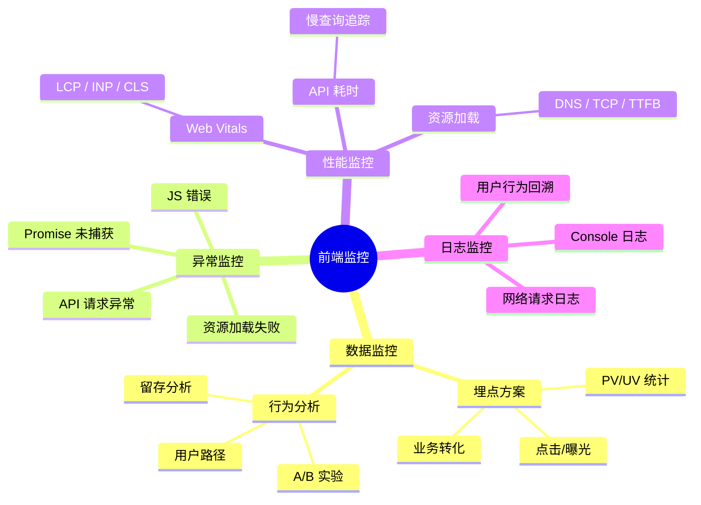
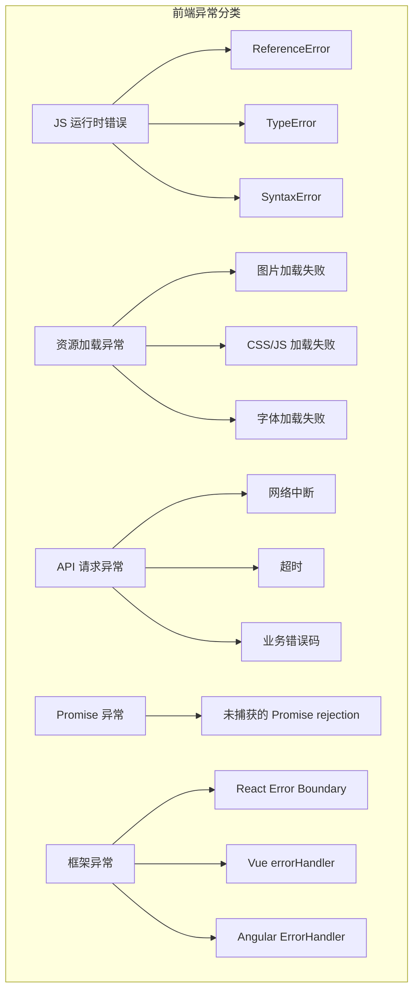
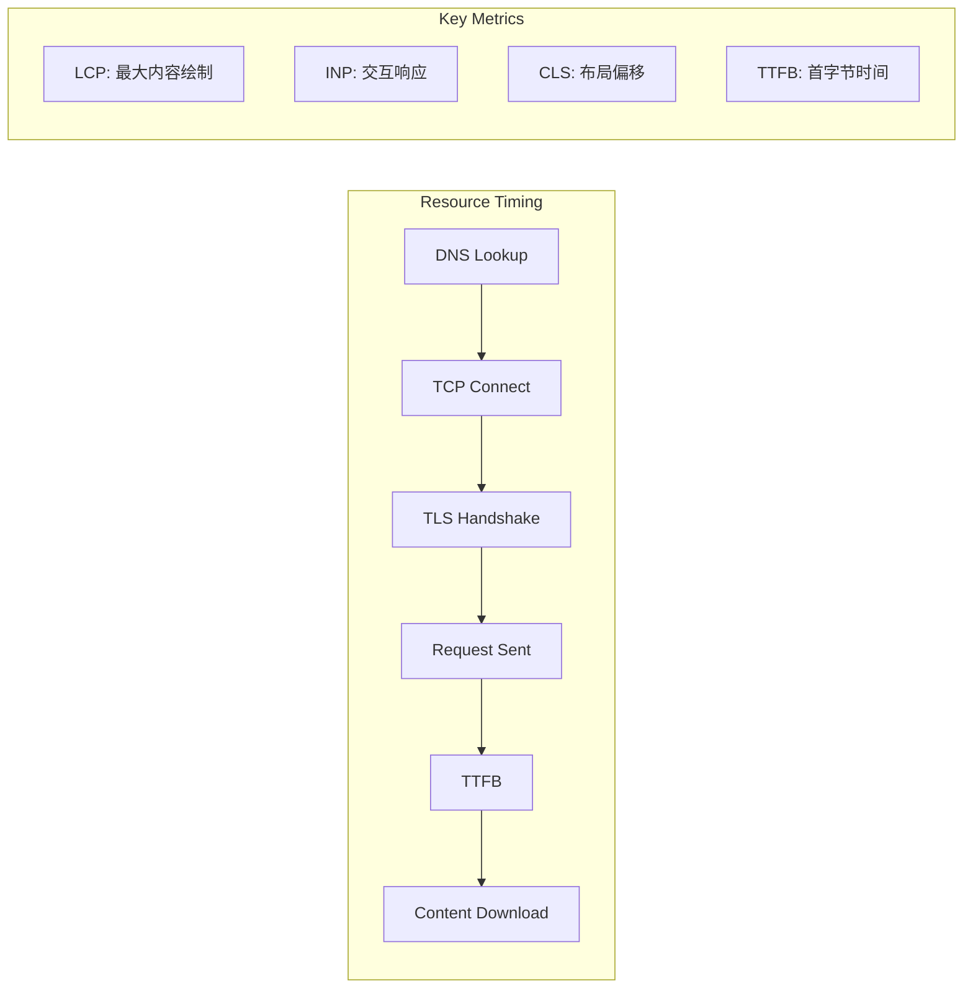
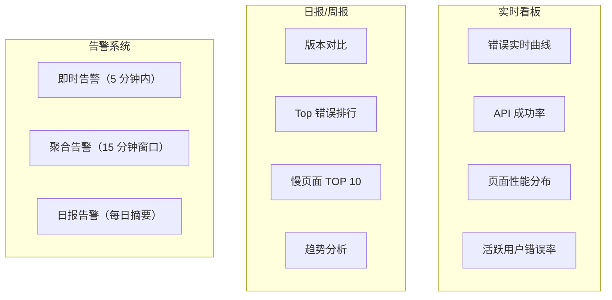

# 篇六 · 06 📊 前端监控与埋点知识详解（含 Mermaid 图解）

> **面试权重**：★★★★☆（中高级岗区分度很高，尤其做过「线上治理」的人） ｜ **建议用时**：1.5 天 ｜ **前置**：02 性能优化（Web Vitals）、01 浏览器原理（错误与资源加载）
>
> **本篇定位**：S3 的「线上闭环篇」。性能优化决定用户快不快，监控决定**出了问题能不能知道、能不能定位**。本仓库的 `shared-monitor` 包与 `/api/vitals/*` 上报链路就是本篇的落地示例。
>
> 前端监控体系涵盖埋点、异常上报、性能监控、行为分析，是线上应用质量保障的关键基础设施

## 🧭 核心考点

| 模块 | 必会考点 | 面试权重 |
|------|----------|----------|
| 埋点体系 | 代码埋点 / 声明式埋点 / 无埋点（全埋点）的取舍与数据模型 | 🔥🔥🔥 |
| 异常监控 | JS 错误、Promise 未捕获、资源加载失败、Source Map 还原 | 🔥🔥🔥 |
| 性能监控 | Web Vitals 采集（本仓库 `web-vitals`）、API 监控、采样倍率 | 🔥🔥🔥 |
| 上报策略 | `sendBeacon` / `fetch keepalive` / 图片打点、批量与优先级 | 🔥🔥🔥 |
| 告警与看板 | 指标阈值、错误率告警、版本对比与灰度门禁 | 🔥🔥 |
| 选型 | 自建 RUM vs Sentry / Faro / OTel RUM / ARMS | 🔥🔥 |
| 降级 | 柔性降级策略与前端实现（超时、fallback、UI 降级） | 🔥 |

---


## 📈 前端监控体系总览



### 前端监控的三个核心层次

| 层次 | 关注点 | 核心指标 | 工具/方案 |
|------|--------|---------|----------|
| **应用层** | 业务数据、用户行为 | PV/UV、转化率、点击率 | 自定义埋点 |
| **性能层** | 页面加载、交互响应 | LCP、INP、CLS、TTFB | Web Vitals |
| **异常层** | 错误、崩溃、异常 | JS Error 率、API 成功率 | Sentry / 自建 |

---

## 一、埋点方案设计

### 1. 业界常见的埋点方案

| 方案 | 原理 | 优点 | 缺点 | 适用场景 |
|------|------|------|------|---------|
| **代码埋点** | 开发人员在业务代码中手动插入埋点代码 | 精确控制、数据丰富 | 侵入性强、维护成本高 | 核心业务路径 |
| **可视化埋点** | 通过可视化工具圈选元素，自动生成埋点 | 无需开发介入、灵活调整 | 覆盖有限、无法处理动态内容 | 运营活动页 |
| **无埋点（全埋点）** | 自动采集所有用户交互事件 | 全面无遗漏、接入成本低 | 数据量大、需后端清洗 | 行为分析初期 |
| **声明式埋点** | 通过 data 属性声明埋点，由 SDK 自动采集 | 低侵入、与业务解耦 | 灵活性有限 | 中大型项目首选 |

**四类方案对比维度补充：**

| 维度 | 代码埋点 | 可视化埋点 | 无埋点 | 声明式埋点 |
|------|---------|-----------|--------|-----------|
| 接入成本 | 高 | 低 | 低 | 中 |
| 动态列表/虚拟滚动 | ✅ 可控 | ❌ 圈选失效 | ⚠️ 需元素标识稳定 | ✅ 配合模板变量 |
| 数据准确性 | 最高 | 中（依赖 DOM 结构） | 低（需大量清洗） | 高 |
| 改版后是否失效 | 否 | **是（DOM 变化即失效）** | 部分 | 否 |
| 适合阶段 | 核心转化路径 | 短期运营活动 | 探索期 | 长期维护项目 |

### 1.5 必须覆盖的埋点类型（常被遗漏）

| 类型 | 采集方式 | 关键点 |
|------|---------|--------|
| **页面浏览（PV/UV）** | 路由变化 + `visibilitychange` | SPA 无整页刷新，必须在路由钩子里上报；用 `document.visibilityState` 过滤后台标签页 |
| **页面停留时长** | 进入时间戳 → `pagehide`/路由离开 | 用 `pagehide` 而非 `beforeunload`（移动端与 bfcache 更可靠） |
| **曝光埋点** | `IntersectionObserver` | 需定义"有效曝光"：可见比例（如 50%）+ 持续时长（如 500ms），且同一元素只报一次 |
| **性能埋点** | Web Vitals 上报 | 应纳入埋点体系（LCP/INP/CLS + 自定义阶段耗时），才能做"性能 ↔ 转化"关联分析 |
| **Session Replay（rrweb）** | 录制 DOM 变更快照 + 事件流 | **必须采样**（如仅错误会话或 1%~5%）并做隐私脱敏（输入密码/身份证脱敏、禁用录制白名单外表单） |

> ⚠️ **Warning**：无埋点/可视化埋点的核心难点是**元素标识**：DOM 结构一变，XPath/CSS path 就失效。工程上的做法是维护"业务语义 ID"（如 `data-stat-id="home.banner.entry"`）作为主键，XPath 只作为辅助，并在改版时做映射迁移。

### 2. 声明式埋点示例

```html
<!-- data-stat 属性声明埋点 -->
<button data-stat="{ event: 'click', page: 'home', module: 'banner', target: 'entry' }">
  立即参与
</button>
```

```typescript
// 声明式埋点 SDK 核心逻辑
interface StatEvent {
  event: string;
  page: string;
  module: string;
  target?: string;
  extra?: Record<string, string>;
}

class StatSDK {
  private queue: StatEvent[] = [];
  private idleTimer: number | null = null;

  init() {
    document.addEventListener('click', (e) => {
      const target = (e.target as HTMLElement).closest('[data-stat]');
      if (!target) return;
      try {
        const event = JSON.parse(target.getAttribute('data-stat')!);
        this.enqueue(event);
      } catch { /* ignore malformed */ }
    });
  }

  private enqueue(event: StatEvent) {
    this.queue.push(event);
    this.scheduleFlush();
  }

  private scheduleFlush() {
    if (this.idleTimer) return;
    // 利用 requestIdleCallback 在浏览器空闲时上报
    this.idleTimer = requestIdleCallback(() => this.flush(), { timeout: 3000 });
  }

  private flush() {
    if (this.queue.length === 0) return;
    const events = this.queue.splice(0, this.queue.length);
    // 使用 sendBeacon 保证页面卸载时也能发送
    navigator.sendBeacon('/api/stat', JSON.stringify(events));
    this.idleTimer = null;
  }
}
```

> **🤔 追问：声明式埋点的 `data-stat` 属性在 Vue/React 动态渲染列表（如 `v-for` 生成 100 个按钮）时，事件委托到 `document` 后如何准确识别目标元素？如果某个按钮被条件渲染移除，埋点数据未上报就丢失了，如何设计容错机制？**
>
> **✅ 答案：** 事件委托到 `document` 后用 `e.target.closest('[data-stat]')` 可准确获取当前交互元素，避免因 DOM 更新导致的目标丢失。移除导致数据丢失时，设计"暂存队列+周期性 flush"机制：数据先入内存队列，组件卸载前调用 `flush()` 强制上报；若来不及上报则存入 sessionStorage，页面关闭前用 `beforeunload` + `sendBeacon` 兜底。

### 3. 埋点数据模型设计

```typescript
// 通用埋点数据模型
interface TrackEvent {
  // 基础信息
  event: string;           // 事件名称：page_view / click / exposure
  page: string;            // 页面标识：/home / /detail/123
  module: string;          // 模块标识：header / banner / footer
  timestamp: number;       // 事件时间戳

  // 用户信息
  userId?: string;         // 登录用户 ID
  deviceId: string;        // 设备唯一标识
  sessionId: string;       // 会话 ID

  // 环境信息
  ua: string;              // User-Agent
  url: string;             // 当前页面 URL
  referrer: string;        // 来源页

  // 业务扩展
  target?: string;         // 目标标识
  value?: number;          // 数值（如金额、时长）
  extra?: Record<string, string | number>;  // 扩展字段
}
```

---

> 💡 **追问链 A：埋点体系设计权衡**
>
> **Q1（概念区别）：** 四种埋点方案（代码/可视化/无埋点/声明式）能否在同一个项目中并存？如果并存，数据模型如何统一标识来源字段？同一次点击被代码埋点和无埋点同时捕获时，去重方案应该放在客户端还是服务端？
>
> **✅ 答案：** 可以并存，数据模型加 `source` 字段标识来源（`code`/`visual`/`auto`/`declarative`）。去重推荐放在客户端 SDK 内部：按 `event + page + module + target + timestamp（秒级）` 生成指纹，相同指纹的埋点合并上报。服务端不做去重——保留原始数据用于校验客户端是否漏报。
>
> **Q2（底层机制）：** 声明式埋点使用 `JSON.parse` 解析 `data-stat`，如果 JSON 格式错误导致 `JSON.parse` 抛异常，单个埋点的失败是否会阻断整个点击事件？如何设计容错机制让埋点 SDK"静默降级"而不影响业务交互？
>
> **✅ 答案：** `try/catch` 包裹 `JSON.parse`，失败时 `console.warn` 但不 `rethrow`，保证业务交互不受影响。静默降级：埋点 SDK 应做到"最强无感"——无论发生什么（JSON 解析失败、网络不可用、sendBeacon 超限），都不应抛出未捕获异常或阻塞用户交互。建议将埋点 SDK 的全部逻辑包裹在 `try/catch` 中，并在可疑处加 `performance.mark` 做异常追踪。
>
> **Q3（边界/未来）：** `TrackEvent` 的 `extra` 是 `Record<string, string | number>`，一旦业务方传入嵌套对象数据就静默丢失。未来埋点数据模型应该如何设计才能支持嵌套结构又不破坏 schema 约束？大规模场景下数据湖分层（ODS / DWD / DWS / ADS）如何与埋点 SDK 对齐？
>
> **✅ 答案：** 支持嵌套结构用 `Record<string, unknown>` + JSON Schema 运行时校验。数据湖对齐：SDK 层只保证字段完整（JSON 序列化），不关心数据湖分层；ODS 层保持原始 JSON，DWD 层展开嵌套字段，DWS 层聚合。SDK 输出与 DWD 对齐——用 `flattenKeys()` 将嵌套展平为 `extra.price.amount → 100`，保持 schema 可预测。

---

## 二、异常监控与上报

### 1. 异常分类



### 2. 异常捕获与上报

```typescript
// 全局异常捕获
class ErrorMonitor {
  init() {
    // 1. JS 运行时错误
    // 注意：msg 的类型是 string | Event（资源错误时可能是 Event），必须收窄后再用
    window.onerror = (msg, source, line, col, error) => {
      this.report({
        type: 'js_error',
        message: typeof msg === 'string' ? msg : String((msg as ErrorEvent)?.message ?? msg),
        stack: error?.stack,
        source,
        line,
        col,
      });
    };

    // 2. Promise 未捕获异常
    window.addEventListener('unhandledrejection', (event) => {
      this.report({
        type: 'promise_error',
        message: event.reason?.message || String(event.reason),
        stack: event.reason?.stack,
      });
    });

    // 3. 资源加载失败
    window.addEventListener('error', (event) => {
      const target = event.target;
      if (target && (target instanceof HTMLScriptElement
          || target instanceof HTMLLinkElement
          || target instanceof HTMLImageElement)) {
        this.report({
          type: 'resource_error',
          source: (target as HTMLElement).tagName,
          url: (target as HTMLScriptElement).src
            || (target as HTMLLinkElement).href
            || (target as HTMLImageElement).src,
        });
      }
    }, true);
  }

  private report(error: ErrorReport) {
    // 错误采样率：只上报 10% 的高频错误
    if (error.type === 'js_error' && Math.random() > 0.1) return;

    // 去重：相同错误 5 秒内不重复上报
    const key = `${error.type}:${error.message}`;
    if (this.isDuplicate(key)) return;

    // 使用 sendBeacon 或 Image 上报（不影响主流程）
    const payload = JSON.stringify({ ...error, timestamp: Date.now() });
    navigator.sendBeacon('/api/error', payload);
  }

  private dedupCache = new Map<string, number>();
  private isDuplicate(key: string): boolean {
    const now = Date.now();
    const last = this.dedupCache.get(key);
    if (last && now - last < 5000) return true;
    this.dedupCache.set(key, now);
    return false;
  }
}
```

> **🤔 追问：示例中错误去重使用内存 `Map` 且仅 5 秒窗口，但页面刷新后 `Map` 重置，同一错误会再次被当做"新错误"上报。如何实现跨页面生命周期的持久化去重（如 SessionStorage + IndexedDB 二级缓存）？高频相同错误在服务端如何做指纹聚合（Error Fingerprinting）？**
>
> **✅ 答案：** 持久化去重：先用内存 Map 做 5 秒去重（高频过滤），同时将错误指纹写入 sessionStorage（标签页级别持久化），页面刷新后从 sessionStorage 恢复去重状态。服务端指纹聚合：对 `error.message + stack trace line 1-3 + source URL` 做 hash 生成指纹，按指纹聚合统计次数，避免同一错误按"每个用户首次触发"重复计数。

> ⚠️ **Warning**：框架层的错误边界**不能替代**全局监听。React `ErrorBoundary` 只捕获**渲染期间（render/lifecycle）**的错误，以下场景它**捕获不到**：事件处理器中的错误、`setTimeout`/Promise 等异步代码、SSR 期间的错误、ErrorBoundary 自身抛出的错误。因此正确做法是 **ErrorBoundary（降级 UI）+ `window.onerror` / `unhandledrejection`（兜底上报）双保险**；Vue 侧对应 `app.config.errorHandler` + `onErrorCaptured`。

### 3. Source Map 还原


```typescript
// 使用 source-map 库还原
import { SourceMapConsumer } from 'source-map';

// 注意：source map 不应上传到 CDN（安全风险），应存储在内部系统
async function resolveStack(rawStack: string): Promise<string> {
  const lines = rawStack.split('\n');
  const resolved = await Promise.all(
    lines.map(async (line) => {
      const match = line.match(/(.+)\((.+):(\d+):(\d+)\)/);
      if (!match) return line;
      const [, context, file, lineNum, colNum] = match;
      const consumer = await loadSourceMap(file);
      if (!consumer) return line;
      const pos = consumer.originalPositionFor({
        line: parseInt(lineNum),
        column: parseInt(colNum),
      });
      return `${context}(${pos.source}:${pos.line}:${pos.column})`;
    })
  );
  return resolved.join('\n');
}
```

> ⚠️ **Warning**：`source-map` 从 v0.7 起 `SourceMapConsumer` 改为**异步构造**（基于 WASM），必须写 `await new SourceMapConsumer(rawMap)`，旧版的同步 `new SourceMapConsumer()` 已不可用；构造完成前不要复用，用完记得 `consumer.destroy()` 释放 WASM 内存。另外生产构建建议使用 `hidden-source-map`（**生成 map 但不在产物里写 `sourceMappingURL`**），把 map 只上传给内部还原服务，兼顾可调试与源码安全。

### 4. 如何快速定位异常位置

| 手段 | 做法 | 效果 |
|------|------|------|
| **Source Map** | 生产环境保留 source map 至内部系统 | 将压缩代码映射回源码 |
| **错误聚合** | 按错误 message + stack 指纹聚合 | 同一 Bug 自动归并 |
| **用户行为回溯** | 记录用户操作时间线（click / input / route） | 复现问题路径 |
| **环境信息** | 记录 UA、设备、网络、版本 | 快速判断影响范围 |
| **版本关联** | 每次发布记录 commit 和构建时间 | 确定是哪个版本引入的 Bug |

---

> 💡 **追问链 B：异常监控深度防御**
>
> **Q1（概念区别）：** `window.onerror`、捕获阶段 `error` 事件、`unhandledrejection` 三者各自捕获什么？为什么跨域脚本报错显示 `"Script error."` 而不是真实堆栈？配置 `crossorigin="anonymous"` + CORS 头部后，还有哪些异常无法被 JS 层捕获（如 Web Worker、iframe 内错误、WASM 崩溃）？
>
> **✅ 答案：** `window.onerror` 捕获 JS 运行时错误（含语法错误）；捕获阶段 `error` 捕获资源加载失败；`unhandledrejection` 捕获未 catch 的 Promise rejection。跨域脚本因浏览器安全策略不暴露跨域堆栈，需添加 `crossorigin="anonymous"` 和服务端 `Access-Control-Allow-Origin` 头部。JS 层无法捕获：Web Worker 内错误（需在 Worker 内自监听）、iframe 内错误（跨域 iframe 不可访问）、WASM 崩溃（宿主机层异常）。
>
> **Q2（底层机制）：** Source Map 上传到 Sentry 等外部平台的安全风险是什么？如果 source map 泄漏，攻击者能逆向出完整源码。如何做到"既保留 source map 堆栈还原能力，又不把源码暴露给第三方"（内部还原服务 + 私有 source map 分发 + 访问鉴权）？
>
> **✅ 答案：** 泄漏风险：攻击者可逆向出 API 密钥、前端鉴权逻辑、业务敏感逻辑。安全方案：source map 不上传任何第三方平台，仅上传到内部还原服务（自建服务 + IP 白名单 + 短期令牌认证）。生产环境不部署 source map，报错时上传 error 的 line/col + source URL 到内部服务，由内部服务用 source map 还原后返回 readable stack。
>
> **Q3（边界/未来）：** 错误去重使用内存 `Map`，长时间不刷新页面会导致 `dedupCache` 无限制增长形成内存泄漏。如果同一个错误在 10 万用户上爆发，客户端独立去重后服务端收到的是"每人首次触发"而非真实总次数。如何设计客户端采样 + 服务端加权还原的双层方案？
>
> **✅ 答案：** 客户端采样：高频错误按采样率上报（如 `Math.random() < 0.1`），同时上报采样倍率（`sampleRate: 0.1`）。服务端加权还原：收到的错误次数 ÷ sampleRate 估算真实总量（如收到 1000 条、采样率 0.1 → 估算 10000 次）。低频错误（critical error、白屏）不降采样，100% 上报。内存泄漏防护：限制 `dedupCache` 最大条目数（如 500 条），超限时淘汰最早条目。

---

## 三、性能监控

### 1. Web Vitals 采集

```typescript
// Web Vitals 性能采集（web-vitals v4/v5 风格）
import { onLCP, onINP, onCLS, onTTFB } from 'web-vitals';
import type { Metric } from 'web-vitals';

const SAMPLE_RATE = 0.5; // 采样率必须随数据一起上报，否则服务端无法还原真实量级

function reportWebVitals(metric: Metric) {
  // rating 由库给出：'good' | 'needs-improvement' | 'poor'
  if (Math.random() >= SAMPLE_RATE) return;

  const body = {
    name: metric.name,
    value: metric.value,
    rating: metric.rating,
    delta: metric.delta,
    id: metric.id,
    navigationType: metric.navigationType, // 便于区分首次加载/前进后退/预渲染
    sampleRate: SAMPLE_RATE, // ✅ 关键：上报采样倍率，服务端按 1/sampleRate 加权还原
    ts: Date.now(),
    url: location.href,
    ua: navigator.userAgent,
  };

  navigator.sendBeacon('/api/vitals', JSON.stringify(body));
}

onLCP(reportWebVitals);
onINP(reportWebVitals);
onCLS(reportWebVitals);
onTTFB(reportWebVitals);
```

**Core Web Vitals 判定阈值（必须记全三档）：**

| 指标 | Good | Needs Improvement | Poor | 说明 |
|------|------|-------------------|------|------|
| **LCP**（最大内容绘制） | ≤ 2.5s | 2.5s ~ 4s | **> 4s** | 首屏主要内容渲染 |
| **INP**（交互到下次绘制） | ≤ 200ms | 200ms ~ 500ms | **> 500ms** | **已取代 FID**，覆盖全部交互 |
| **CLS**（累计布局偏移） | ≤ 0.1 | 0.1 ~ 0.25 | **> 0.25** | 视觉稳定性 |

> 📝 **Note**：TTFB、FCP 属于**诊断指标**而非 Core Web Vitals；**FID 已被 INP 正式取代**，新项目不要再以 FID 作为主指标。web-vitals 大版本之间 API 有差异（指标集合与 attribution 字段），升级时需核对版本。

### 2. API 请求监控

```typescript
// 拦截 fetch 和 XMLHttpRequest
class APIMonitor {
  private originalFetch: typeof fetch;

  init() {
    this.monitorFetch();
    this.monitorXHR();
  }

  private monitorFetch() {
    this.originalFetch = window.fetch;
    window.fetch = (input, init) => {
      const startTime = performance.now();
      const url = typeof input === 'string' ? input : input.url;

      return this.originalFetch(input, init).then(async (response) => {
        const duration = performance.now() - startTime;
        const cloned = response.clone();

        // 慢请求追踪（> 1s）
        if (duration > 1000) {
          this.report({
            type: 'slow_api',
            url,
            method: init?.method || 'GET',
            duration,
            status: response.status,
            size: parseInt(cloned.headers.get('content-length') || '0'),
          });
        }
        return response;
      }).catch((error) => {
        // 网络异常上报
        this.report({
          type: 'api_error',
          url,
          method: init?.method || 'GET',
          error: error.message,
        });
        throw error;
      });
    };
  }

  private monitorXHR() { /* 类似 fetch 拦截 */ }
  private report(data: any) { /* 上报逻辑 */ }
}
```

> **🤔 追问：拦截 `fetch` 时 `response.clone()` 只克隆 body，`status` 和 `headers` 仍共享引用，慢请求判断 `duration > 1000` 是 `response` 返回后才执行，如果请求被浏览器 CORS 预检阻塞，`duration` 包含预检时间吗？`fetch` 的 `AbortSignal` 超时与请求本身的超时应如何处理才不会重复上报？**
>
> **✅ 答案：** `duration` 包含预检时间——`performance.now()` 在 fetch 调用时开始计时，预检完成后才发起实际请求。如需区分，用 `PerformanceObserver` 观察 `resource` 条目中的 `connectStart` 和 `responseStart` 差值。超时处理：`AbortController` 超时和请求级超时应合并为同一个 controller，用 `Promise.race([fetch(url, { signal }), timeout])` 模式，避免双重超时触发两次上报。

### 3. 性能指标采集



```typescript
// 使用 Performance API 采集
function collectPerformanceMetrics() {
  // Navigation Timing
  const nav = performance.getEntriesByType('navigation')[0] as PerformanceNavigationTiming;
  if (nav) {
    return {
      dns: nav.domainLookupEnd - nav.domainLookupStart,
      tcp: nav.connectEnd - nav.connectStart,
      tls: nav.secureConnectionStart ? nav.connectEnd - nav.secureConnectionStart : 0,
      // ⚠️ TTFB 官方定义：responseStart - startTime（包含重定向、Service Worker 启动、DNS/TCP/TLS 之外的等待时间）
      //    若只想看"请求发出到收到首字节"，才用 responseStart - requestStart
      ttfb: nav.responseStart - nav.startTime,
      ttfbRequestOnly: nav.responseStart - nav.requestStart,
      domInteractive: nav.domInteractive,
      domComplete: nav.domComplete,
      loadEvent: nav.loadEventEnd - nav.loadEventStart,
    };
  }

  // 资源加载统计（responseStatus 为较新字段，需做兼容兜底）
  const resources = performance.getEntriesByType('resource');
  const totalSize = resources.reduce((sum, r: any) => sum + (r.transferSize || 0), 0);
  const totalCount = resources.length;
  const failedCount = resources.filter((r: any) => r.responseStatus >= 400).length;

  return { totalSize, totalCount, failedCount };
}
```

**LCP / CLS 的 entry 级计算（自行采集时必须注意）：**

```typescript
// LCP：会持续更新，必须取「最后一个」entry；且要忽略 bfcache 恢复与后台标签页
let lcp = 0;
const lcpObserver = new PerformanceObserver((list) => {
  const entries = list.getEntries(); // type: 'largest-contentful-paint'
  lcp = entries[entries.length - 1].startTime;
});
lcpObserver.observe({ type: 'largest-contentful-paint', buffered: true });

// CLS：按「会话窗口」聚合，并过滤用户交互后 500ms 内的偏移（hadRecentInput）
let cls = 0;
let sessionValue = 0;
const clsObserver = new PerformanceObserver((list) => {
  for (const entry of list.getEntries() as PerformanceEventTiming[]) {
    const shift = entry as any;
    if (shift.hadRecentInput) continue; // 用户主动操作引起的位移不计入 CLS
    sessionValue += shift.value;
    cls = Math.max(cls, sessionValue);
  }
});
clsObserver.observe({ type: 'layout-shift', buffered: true });
```

> 📝 **Note**：生产环境优先直接用 `web-vitals` 库（它已正确处理 LCP 取最后一次、CLS 会话窗口、`hadRecentInput` 过滤、bfcache/预渲染场景）。上面代码用于说明原理，**不要自己重写一遍当 SDK 用**。

**Navigation Timing Level 1 vs Level 2：**

| 维度 | Level 1（已废弃） | Level 2（当前） |
|------|------------------|----------------|
| 入口 | `performance.timing`（`Date` 时间戳） | `performance.getEntriesByType('navigation')[0]`（`PerformanceNavigationTiming`，高精度 `DOMHighResTimeStamp`） |
| 白屏/首屏 | 用 `domLoading` 等字段 | **移除 `domLoading` / `domComplete` 部分语义**，改用 Paint Timing 的 `first-paint` / `first-contentful-paint` |
| 类型 | 无类型区分 | 区分 `navigate` / `reload` / `back_forward` / `prerender` |
| 建议 | 不要再使用 | 统一用 Level 2 + `PerformanceObserver` |

---

> 💡 **追问链 C：性能监控数据质量**
>
> **Q1（概念区别）：** Web Vitals 的 Good / Needs Improvement / Poor 阈值是 Google 制定的静态标准（LCP ≤ 2.5s / INP ≤ 200ms / CLS ≤ 0.1），但电商首页和后台管理的性能容忍度完全不同。大型项目应不应该维护自己的"业务基线阈值"？如何根据页面类型动态调整告警规则？
>
> **✅ 答案：** 应该维护业务基线。做法：按页面类型（首页/列表页/详情页/后台 Dashboard）分别采集 RUM 数据，用 P50/P95 建立各自的动态基线。告警规则使用"偏离基线百分比"而非固定阈值——如"LCP 比基线高 20% 持续 5 分钟"触发告警。Google 的静态阈值用作行业对标（Good 占比），业务基线用于迭代回归检测。
>
> **Q2（底层机制）：** `PerformanceObserver` 相比手动调用 `performance.getEntriesByType('navigation')` 有什么优势（内存泄漏、缓冲区溢出、跨域资源 TAO 限制）？采样率 50% 上报后要对两个版本做性能回归判断，如何计算所需样本量？均值对比有哪些陷阱（长尾分布下均值 vs P50/P95 vs 分位数回归）？
>
> **✅ 答案：** `PerformanceObserver` 优势：自动处理缓冲区溢出（`buffered: true`），不会漏掉早期条目；跨域资源受 TAO 限制时仍能拿到部分 timing。样本量：`n = (Z_alpha/2 * sigma / delta)^2`，如 95% 置信度、5% 效应量、预估标准差 500ms → 每组约需 384 个样本。均值陷阱：长尾分布下均值被极值污染，用 P50（中位数）对比更稳定，P95 监控尾部体验。
>
> **Q3（边界/未来）：** 跨域资源受 `Timing-Allow-Origin` 头部限制，CDN 资源、第三方 SDK 的性能数据无法通过 Resource Timing API 获取。除了要求第三方添加 TAO 头部外，还有哪些绕过方案（`PerformanceServerTiming`、`Server-Timing` 头部、自定义探针脚本）？当前值得关注的 Web 性能 API（如 `EventTiming`、`LargestContentfulPaint`）还有哪些新能力？
>
> **✅ 答案：** 绕过方案：用 `Server-Timing` 响应头部让服务端主动推送耗时数据（DNS/TCP/TTFB），前端通过 `PerformanceServerTiming` 读取；或部署"性能探针"脚本定时探测 CDN 资源（类似 Ping 但用 fetch 测实际端点）。值得关注的 API：`EventTiming` 提供交互延迟归因（哪个事件处理器耗时最长）、`LargestContentfulPaint` 标注具体元素、`SoftNavigation` 支持 SPA 路由变化的性能归因。

---

## 四、页面数据上报策略

### 1. 合理上报，不影响核心功能

| 策略 | 实现方式 | 效果 |
|------|---------|------|
| **采样上报** | 按比例抽取用户上报（如 10%） | 减少 90% 请求量 |
| **批量上报** | 聚合多条数据一次性发送 | 减少 HTTP 请求数 |
| **空闲上报** | `requestIdleCallback` 在浏览器空闲时上报 | 不阻塞主线程 |
| **离线缓存** | IndexedDB 暂存，网络恢复后发送 | 确保数据不丢失 |
| **分级上报** | 错误立即上报，埋点批量延迟上报 | 关键数据优先 |
| **sendBeacon** | 页面卸载时使用 `navigator.sendBeacon` | 不阻塞页面跳转 |

### 2. 上报策略对比

| 方案 | 实时性 | 对主线程影响 | 数据完整性 | 实现复杂度 |
|------|--------|-------------|-----------|----------|
| **XHR/fetch 异步** | 高 | 低 | 页面关闭可能丢失 | 低 |
| **sendBeacon** | 中 | 极低 | 页面关闭也能发送（>64KB 静默失败） | 低 |
| **fetch + keepalive** | 中 | 极低 | 页面关闭可发送，无 64KB 限制 | 低 |
| **图片打点（1x1 GIF）** | 中 | 极低 | 兼容性最好，仅 GET 且容量受 URL 长度限制 | 低 |
| **XHR 同步（已废弃）** | 高 | **阻塞主线程** | 高 | 低（仅最后兜底） |
| **Service Worker** | 中 | 无 | 高（但 SW 可能被杀） | 高 |

> ⚠️ **Warning**：`requestIdleCallback` 是**调度时机**（什么时候发），`sendBeacon` / `fetch keepalive` 是**传输方式**（怎么发），两者不在同一维度，应组合使用（RIC 调度 + sendBeacon 发送），不要并列成互斥选项。

**卸载阶段上报方式横向对比与降级顺序：**

| 方式 | 请求方法 | 大小限制 | 页面卸载可靠 | 兼容性 | 备注 |
|------|---------|---------|------------|--------|------|
| `navigator.sendBeacon` | 仅 POST | Blob **约 64KB**（超限静默失败返回 false） | ✅ | 好 | 首选；超大 payload 需分片或压缩 |
| `fetch(url, { keepalive: true })` | GET/POST | 较小配额（约 64KB 级，按浏览器实现） | ✅ | 现代浏览器可用（部分 Safari 版本有问题） | sendBeacon 的替代 |
| 图片打点 `new Image().src` | 仅 GET | 受 URL 长度限制（约 2KB 级） | ✅ | **最好** | 老浏览器兜底 |
| XHR 同步 | 任意 | 无 | ✅ | 差（已废弃） | 阻塞主线程，仅关键错误兜底 |

**推荐降级顺序**：`sendBeacon` → `fetch keepalive` → 图片打点 → （仅关键错误）同步 XHR → 丢弃。

### 3. 上报优先级分级

```typescript
enum ReportPriority {
  HIGH = 1,    // 错误、异常 → 立即上报
  NORMAL = 2,  // 性能数据 → 空闲时批量上报
  LOW = 3,     // 埋点数据 → 延迟批量上报
}

interface ReportItem {
  priority: ReportPriority;
  data: any;
  timestamp: number;
}

class ReportManager {
  private buffer: ReportItem[] = [];
  private scheduled = false;   // 标记「已排下一次 flush」，避免重复注册 RIC/定时器
  private readonly MAX_BATCH = 50;
  private readonly MAX_BUFFER = 1000; // 防止离线时无限堆积（超出丢弃最旧的数据）

  add(item: ReportItem) {
    if (item.priority === ReportPriority.HIGH) {
      this.immediateReport(item.data);
      return;
    }
    if (this.buffer.length >= this.MAX_BUFFER) this.buffer.shift();
    this.buffer.push(item);
    this.scheduleFlush();
  }

  private scheduleFlush() {
    if (this.scheduled || this.buffer.length === 0) return;
    this.scheduled = true;

    const run = () => {
      this.scheduled = false;
      this.flush();
      // ✅ 关键：若一次 flush 没取完（超过 MAX_BATCH），继续排下一次，避免丢数据
      if (this.buffer.length > 0) this.scheduleFlush();
    };

    if ('requestIdleCallback' in window) {
      requestIdleCallback(run, { timeout: 5000 });
    } else {
      setTimeout(run, 2000);
    }
  }

  private flush() {
    const batch = this.buffer.splice(0, this.MAX_BATCH);
    if (batch.length === 0) return;
    const payload = JSON.stringify(batch.map(b => b.data));
    // sendBeacon 超 64KB 会静默失败（返回 false），失败要降级并把数据还回队列
    const ok = navigator.sendBeacon('/api/report', payload);
    if (!ok) {
      this.buffer.unshift(...batch);
      fetch('/api/report', { method: 'POST', body: payload, keepalive: true }).catch(() => {});
    }
  }

  // 页面隐藏/卸载时强制上报
  flushAll() {
    while (this.buffer.length > 0) this.flush();
  }
}
```

> ⚠️ **Warning**：两个常见实现缺陷。① `flush()` 只取前 50 条但**不再重新调度**，剩余数据会一直滞留到下一次 `add()`。② 用 `isFlushing` 做去重会在同步执行路径上失效，正确做法是用 `scheduled` 标记"是否已排下一次 flush"，并在 flush 后根据剩余队列决定是否继续调度。

> **🤔 追问：`requestIdleCallback` 在后台标签页中触发频率大幅降低，低优先级埋点可能数分钟未上报。如果用户短时间内打开大量页面（如营销活动），每条页面都独立建立 IndexedDB 连接，如何控制总连接数？`sendBeacon` 在 `Blob size > 64KB` 时静默失败，长链路数据应该如何做分片或压缩？**
>
> **✅ 答案：** 大量页面场景用 `navigator.locks.request` 共享同一 IndexedDB 连接或通过 localStorage + 定时 flush 替代。64KB 限制用分片策略：数据按 32KB 分批调用 sendBeacon，或先用 pako.js 压缩 payload 再上报，压缩率可达 70-90%。后台标签页用 `visibilitychange` 事件兜底——页面不可见时立即 flush 一次而非等待 RIC。

---

> 💡 **追问链 D：上报架构极限场景**
>
> **Q1（概念区别）：** `sendBeacon`、`fetch keepalive`、`XMLHttpRequest` 三种页面卸载时发送请求的方式，在兼容性、数据大小限制、请求方法支持上有什么区别？为什么 `sendBeacon` 只能 POST 且 `Blob` 超过 64KB 时会静默失败？实际项目应该以什么顺序做方案降级（`sendBeacon` → `fetch keepalive` → `XHR sync` → 丢弃）？
>
> **✅ 答案：** sendBeacon：只能 POST，Blob 超 64KB 静默失败，但页面卸载时最可靠。fetch keepalive：可 GET/POST，无 size 限制，但兼容性略差（Safari 部分版本不支）。XHR sync：已被废弃（主线程阻塞），仅作最后兜底。降级顺序：sendBeacon → fetch keepalive → XHR sync（仅在需要保证送达的关键错误时使用）→ 丢弃（低优先级埋点可丢）。
>
> **Q2（底层机制）：** `requestIdleCallback` 在主线程繁忙时回调可能被延迟到 deadline 极限甚至跨帧执行，setTimeout 降级后如果页面正在执行长任务（500ms+），回调会直接加入宏任务队列阻塞主线程，反而恶化 INP。有没有完全不阻塞主线程的上报方案（`OffscreenCanvas` + Worker 拼接 payload、`Background Sync API`）？
>
> **✅ 答案：** 主动方案：在 Web Worker 中拼接 payload（序列化、压缩），Worker 线程不阻塞主线程。传输方案：Worker 通过 `Transferable Objects` 将 ArrayBuffer 传给主线程，主线程仅做一次 sendBeacon。未来方案：`Background Sync API` 注册 `sync` 事件，由浏览器在空闲/网络恢复时触发，不占用主线程资源。Safari 兼容用 `setTimeout(0)` 延迟到当前帧结束后执行。
>
> **Q3（边界/未来）：** Service Worker 天然适合做数据上报（独立于页面生命周期、可拦截请求），但 Sentry / 友盟 / 自建方案都很少用 SW 上报。SW 上报的延迟（SW 唤醒 + 消息传递开销）、数据可靠性（SW 被浏览器杀掉后队列丢失）、兼容性瓶颈具体在哪里？随着 SW 覆盖率继续提升，是否值得作为首选方案？
>
> **✅ 答案：** SW 上报瓶颈：(1) 首次 SW 唤醒需 100-300ms 冷启动；(2) postMessage 传递大 payload 有 structuredClone 开销；(3) 浏览器低内存时杀掉 SW，未同步数据丢失。就现状而言，SW 在现代浏览器中的覆盖率已经很高，但 SW 上报仍未成为主流——因为 sendBeacon + RIC + IndexedDB 三位一体已覆盖绝大多数场景，SW 引入的复杂度（注册、更新、调试难度）不值得；且 iOS 与部分国产浏览器对 SW 的限制仍需实测。**SW 更适合做"离线 fallback"和"请求拦截"，而非纯粹的数据上报通道。**

---

## 五、线上代码运行质量观察

### 1. 核心质量指标

| 维度 | 指标 | 健康阈值 | 告警阈值 |
|------|------|---------|---------|
| **错误率** | JS Error Rate | < 0.1% | > 0.5% |
| **API 成功率** | API Success Rate | > 99.5% | < 99% |
| **页面性能** | LCP / INP / CLS | Good 占比 > 75% | Good 占比 < 50% |
| **资源加载** | Resource Fail Rate | < 0.1% | > 0.5% |
| **用户影响** | 页面可用性（无白屏/无致命错误会话占比） | > 99.9% | < 99.5% |

> 📝 **Note**：`Crash Free Rate` 是**移动端原生 App** 的概念（进程崩溃率）。Web 端没有"进程崩溃"这一语义，对应指标应改为**页面可用率 / 无白屏率 / 无致命错误会话占比**，定义统一为"一次会话中未出现白屏或阻断性 JS 错误的比例"。

### 2. 质量看板设计



### 3. 版本发布对比分析

```typescript
// 版本发布后的质量对比
interface VersionCompareResult {
  version: string;
  deployTime: number;
  metrics: {
    before: { errorRate: number; lcp: number; apiSuccess: number };
    after: { errorRate: number; lcp: number; apiSuccess: number };
  };
  // 自动判断发布是否健康
  health: 'healthy' | 'warning' | 'critical';
}

function compareVersions(current: VersionCompareResult) {
  const threshold = {
    errorRate: { diff: 0.003 },   // 错误率上升 < 0.3%
    lcp: { diff: 0.5 },          // LCP 增加 < 500ms
    apiSuccess: { diff: -0.01 }, // API 成功率下降 < 1%
  };

  const issues: string[] = [];

  if (current.metrics.after.errorRate - current.metrics.before.errorRate
      > threshold.errorRate.diff) {
    issues.push('错误率异常上升');
  }

  return {
    version: current.version,
    health: issues.length === 0 ? 'healthy'
      : issues.length <= 1 ? 'warning' : 'critical',
    issues,
  };
}
```

---

## 六、版本发布监控与灰度

### 1. 发布过程监控要点

| 阶段 | 监控项 | 告警条件 | 处置动作 |
|------|--------|---------|---------|
| **灰度发布** | 错误率、性能、业务指标 | 任一指标超阈值 | 立即终止灰度，自动回滚 |
| **全量发布后 5min** | 错误率尖峰 | 错误率 > 5 倍基线 | 自动回滚 |
| **全量发布后 30min** | 性能回归 | LCP/INP 均值 > 基线 20% | 降级/回滚 |
| **全量发布后 24h** | 用户反馈、Crash 率 | Crash 率 > 0.5% | 修复后热修复 |

> **🤔 追问：灰度组和对照组按用户 ID 哈希分流，但如果灰度上线时间在凌晨，灰度组用户活跃度低，错误率和性能指标天然偏低。如何避免"时间偏差"导致的误判（同比 vs 环比、基线滑动窗口）？当灰度触发自动回滚时，正在灰度中的用户请求如何优雅地切回老版本（不掉会话、不丢数据）？**
>
> **✅ 答案：** 时间偏差用"同比对比"解决——灰度组上线后的数据与老版本同时段的基线数据对比（如早 8 点 vs 早 8 点），而非与全量均值对比。回滚优雅性：Ingress 层面用 Header 路由控制（`x-version: v2`），回滚时改为 `x-version: v1`，用户刷新后自动走老版本，已发请求不受影响；WebSocket 长连接保持不断，旧 Pod 的 terminaing grace period 设为 60s 等待请求完成。

### 2. 监控告警分级

```yaml
# 告警分级：每个级别用 name + 条件列表，避免"标量后紧跟缩进列表"这类非法 YAML
告警分级:
  - level: P0
    desc: 核心功能不可用，5 分钟内响应
    sla: 5m
    conditions:
      - 页面白屏率 > 1%
      - 登录/支付成功率 < 90%
    action: 触发自动回滚
  - level: P1
    desc: 功能异常，30 分钟内响应
    sla: 30m
    conditions:
      - 错误率上升 > 0.5%
      - 核心 API 成功率 < 95%
      - LCP 恶化超过 1s
    action: 通知值班 + 灰度暂停
  - level: P2
    desc: 体验问题，24 小时内修复
    sla: 24h
    conditions:
      - 非核心功能错误
      - 单项性能指标下降
      - 低影响兼容性问题
    action: 进入迭代排期
```

---

> 💡 **追问链 E：灰度发布与监控联动**
>
> **Q1（概念区别）：** 灰度分流的常见算法（用户 ID 哈希 / 分桶 / 分层抽样）各自的适用场景是什么？如果灰度组 5% 流量恰好集中某个地区或特定机型，错误率天然失真，如何保证分组的代表性？同一用户始终在同一组和每次请求随机分组各有什么优劣？
>
> **✅ 答案：** 用户 ID 哈希适合"同一用户始终一致"场景（如 UI 改版）；分桶适合 A/B 实验；分层抽样适合跨维度均衡（如按地区/机型分层）。代表性保障：灰度前按地区+机型+浏览器三层维度做预分流，确保灰度组和对照组在关键维度上分布一致。始终同组 vs 随机分组：前者用户体验一致（后端逻辑可缓存），后者统计偏差小但用户来回变换体验割裂。建议：核心功能用哈希（体验一致），实验功能用随机（数据准确）。
>
> **Q2（底层机制）：** 灰度看板使用"平均 LCP"、"平均错误率"做对比，容易被极端值污染。应该用什么统计量（P50/P95、MAD 中位数绝对偏差、Welch's t-test）来评估性能回归？在什么条件下才能判定"新版本性能比老版本差"具有统计显著性？
>
> **✅ 答案：** 推荐用 P50（中位数）做核心对比（抗极值），P95 监控尾部恶化。显著性判定用 Welch's t-test（不要求方差齐性）或 Mann-Whitney U 检验（非参数，适合非正态分布）。条件：p-value < 0.05 且效应量（Cohen's d）> 0.2。简单说：连续采集至少 1000 样本，新版 P50 比基线差 5% 以上且持续 15 分钟，才判定为回归。
>
> **Q3（边界/未来）：** 灰度中新版本 LCP 改善 10% 但转化率下降 3%，可能的原因是什么（缓存命中率差异、新用户 vs 老用户行为差异、实验新奇效应）？监控系统能否给出综合决策建议而非单一维度红绿告警？如何设计"多维度联合健康评分"来辅助发布决策？
>
> **✅ 答案：** 可能原因：新版可能加载了新 SDK 或动画导致转化流程阻断。综合决策：设计"发布健康评分"——性能权重 30%、错误率权重 30%、业务指标权重 40%，每项打分（0-100），总分低于 60 自动终止。LCP 改善 +10 分，但转化率下降 -30 分 → 总分降为 70 → 触发人工审核而非自动继续。核心原则：**业务指标权重大于性能指标**，用户体验好的前提是业务不受损。

---

## 七、柔性降级

### 1. 降级策略

| 降级层级 | 条件 | 降级动作 |
|---------|------|---------|
| **UI 降级** | 某模块接口超时 | 隐藏模块，显示骨架屏/占位 |
| **数据降级** | 实时数据不可用 | 展示缓存数据或默认值 |
| **功能降级** | 第三方服务不可用 | 禁用相关交互，提示"暂不可用" |
| **渲染降级** | 浏览器能力不足 | 降级为静态 HTML，关闭动画 |
| **资源降级** | CDN 资源加载失败 | 切回本地资源或低清版本 |

### 2. 降级实现示例

```typescript
// 柔性降级组件
function withDegradation<T>(
  fetcher: () => Promise<T>,
  fallback: T,
  options?: { timeout?: number; retryCount?: number }
) {
  let retries = options?.retryCount ?? 2;

  async function fetchWithTimeout(): Promise<T> {
    const controller = new AbortController();
    const timer = setTimeout(() => controller.abort(), options?.timeout ?? 3000);

    try {
      const result = await fetcher();
      clearTimeout(timer);
      return result;
    } catch {
      clearTimeout(timer);
      if (retries > 0) {
        retries--;
        return fetchWithTimeout();
      }
      return fallback;
    }
  }

  return fetchWithTimeout();
}

// 使用示例
const userData = await withDegradation(
  () => fetch('/api/user').then(r => r.json()),
  { name: '未知用户', avatar: '/default-avatar.png' },
  { timeout: 2000, retryCount: 1 }
);

```

> **🤔 追问：`withDegradation` 中 `fetcher` 返回 `{ code: -1, msg: '无权限' }` 这类业务错误时，`fetch` 本身是成功的（status 200），不会被 `catch` 捕获，降级逻辑不会触发。如何区分"网络容错"（网络异常）和"业务容错"（业务拒绝）？降级后的 fallback 数据应不应该也上报一条埋点标记"已降级"以便监控系统感知真实影响面？**
>
> **✅ 答案：** 区分方式：在 `fetcher` 内部增加业务码判断，`if (res.code !== 0) throw new BusinessError(res.msg)`，让业务错误也能被 catch 捕获。降级上报：必须上报一条 `{ type: 'degradation', module: xxx, reason: 'network_timeout' | 'business_deny' }` 埋点，否则监控看板的"成功率"指标会虚高——用户虽然看到了降级内容，但实际体验已受损。

---

## 八、监控工具选型
### 1. 业界主流监控方案

| 方案 | 形态 | 埋点 | 异常监控 | 性能/RUM | Session Replay | 私有化 | 接入成本 |
|------|------|------|---------|---------|----------------|--------|---------|
| **Sentry** | SaaS / 可私有化 | ✅ 支持自定义事件与转化 | ✅ 最强（Source Map、Release、Issue 聚合） | ✅ Tracing + Web Vitals | ✅ 官方 Replay | ✅ 支持自部署 | 低 |
| **Grafana Faro** | 开源（Grafana 官方 RUM agent） | ✅ | ✅ | ✅ Web Vitals | ⚠️ 需自行扩展 | ✅ 天然自建 | 中（需配 Loki/Tempo） |
| **OpenTelemetry Browser RUM** | 开源标准 | ✅ 自定义事件/日志 | ✅ 可导出 | ✅ 与后端链路统一 | ❌ 需自建 | ✅ | 中高（规范仍在演进） |
| **阿里云 ARMS / RUM** | 商业 SaaS | ✅ | ✅ | ✅ | ✅ | ❌ | 低 |
| **字节 WebSee** | 开源自建 | ✅ | ✅ | ✅ | ✅ 基于 rrweb | ✅ | 中 |
| **友盟 / 神策 / GrowingIO** | 商业 SaaS | ✅ 强（分析导向） | ⚠️ 一般 | ⚠️ 一般 | 部分支持 | ❌ | 低 |
| **完全自建（SDK + 采集端 + 存储）** | 自建 | ✅ 完全自定义 | 需自己实现 | 需自己实现 | 需集成 rrweb | ✅ | 高 |

> ⚠️ **Warning**：两个常见表述错误。①「Sentry 不支持埋点」——现已支持自定义事件、转化漏斗与 Session Replay，只是**不是分析型埋点平台**，深度用户分析仍需神策/GrowingIO 这类产品。②「Grafana + Prometheus 做前端 RUM」——**Prometheus 是时序拉取模型，不适合接收前端 RUM 事件**；前端 RUM 的正确组合是 **Faro（采集） + Loki（日志） + Tempo（链路） + Prometheus（后端指标）**。

### 2. 自建 vs 第三方方案决策

| 维度 | 自建方案 | 第三方方案 |
|------|---------|-----------|
| **成本** | 前期开发成本高，后期无许可费 | 按量付费，大流量成本高 |
| **灵活性** | 完全自定义，数据 100% 可控 | 受限于平台能力 |
| **数据安全** | 数据不出公司网络 | 数据上云，需合规审查 |
| **维护成本** | 需专人维护 | 厂商负责维护 |
| **成熟度** | 需自己打磨 | 开箱即用，功能完善 |
| **采样与配额** | 自主控制，可 100% 采集 | 受套餐配额限制，需采样 |
| **Source Map 归属** | map 留在内网，源码零外泄 | 需上传至厂商（或用私有化部署规避） |
| **Session Replay** | 需自集成 rrweb 并做脱敏 | 开箱可用，脱敏规则受平台限制 |

**推荐策略**：
- **起步阶段**：Sentry（异常 + 性能 + Replay）+ 自建轻量埋点通道
- **成长期**：埋点与业务指标自建（ClickHouse / Doris 等），异常仍用 Sentry
- **规模化 / 合规要求高**：Faro 或 OTel RUM 采集 + 自建存储与看板，统一前后端链路（Trace ID 打通）
- **强分析诉求**：Sentry（稳定性）+ 神策/GrowingIO（增长分析）并行，数据通过同一用户 ID 关联

---

## 九、面试题精选

### 📑 本篇题目索引（共 6 题）

| 题号 | 题目 | 难度 | 频率 |
|------|------|------|------|
| Q1 | 前端监控体系包含哪些层次？ | ⭐⭐ | 🔥 |
| Q2 | 如何合理上报数据，不影响主页面功能？ | ⭐⭐⭐ | 🔥 |
| Q3 | 如何快速定位到异常的具体位置？ | ⭐⭐⭐ | 🔥 |
| Q4 | 灰度发布如何与监控系统联动？ | ⭐⭐⭐ | 📌 |
| Q5 | 什么是柔性降级？在前端如何实现？ | ⭐⭐⭐ | 📌 |
| Q6 | 业界常见的埋点方案有哪些？各自优缺点？ | ⭐⭐⭐ | 🔥 |

### Q1：前端监控体系包含哪些层次？

**难度**：⭐⭐ ｜ **频率**：🔥 ｜ **考点**：监控的三层：数据（埋点）、异常、性能，各自回答不同问题

**💡 记忆关键词**：数据监控 / 异常监控 / 性能监控 / 三层互补

前端监控体系通常包含三个核心层次：
- **数据监控**（埋点）：PV/UV、用户行为、业务转化
- **异常监控**：JS 错误、API 异常、资源加载失败
- **性能监控**：页面加载、交互响应、核心 Web 指标

三个层次互为补充，数据监控回答"用户怎么用"，异常监控回答"哪里出了问题"，性能监控回答"体验怎么样"。

### Q2：如何合理上报数据，不影响主页面功能？

**难度**：⭐⭐⭐ ｜ **频率**：🔥 ｜ **考点**：采样、批量、空闲上报、sendBeacon 与优先级分级

**💡 记忆关键词**：采样 / 批量 / requestIdleCallback / sendBeacon / 优先级

- **采样上报**：高频事件按百分比采样，错误/关键事件 100% 上报
- **批量上报**：聚合多条数据后一次性发送
- **空闲上报**：`requestIdleCallback` 利用浏览器空闲时间
- **sendBeacon**：页面卸载时可靠发送，不阻塞跳转
- **优先级分级**：错误立即上报，埋点批量延迟

### Q3：如何快速定位到异常的具体位置？

**难度**：⭐⭐⭐ ｜ **频率**：🔥 ｜ **考点**：Source Map 还原 + 堆栈/环境/时间线采集 + 错误指纹聚合

**💡 记忆关键词**：Source Map / 错误指纹 / 版本关联 / 行为回溯

1. 保留 Source Map 至内部系统，配合 `source-map` 库还原源码位置
2. 采集完整的堆栈信息、环境信息、用户操作时间线
3. 按错误指纹聚合同类错误，关联发布版本
4. 建立慢查询追踪和用户行为回溯机制

### Q4：灰度发布如何与监控系统联动？

**难度**：⭐⭐⭐ ｜ **频率**：📌 ｜ **考点**：灰度指标对比、阈值门禁、版本标签透传与一键回滚

**💡 记忆关键词**：版本对比 / 阈值门禁 / 流量标签 / 自动终止

- 灰度期间实时对比新老版本的错误率、性能、业务指标
- 设置阈值自动门禁：任一指标超阈值自动终止灰度
- 灰度流量标签传递至后端，便于按版本分析数据
- 监控看板按版本维度展示数据，支持一键回滚

### Q5：什么是柔性降级？在前端如何实现？

**难度**：⭐⭐⭐ ｜ **频率**：📌 ｜ **考点**：依赖不可用时以降级姿态继续服务，而非崩溃

**💡 记忆关键词**：AbortController / fallback / UI 降级 / 资源降级

柔性降级指在依赖服务不可用时，系统以降级姿态继续提供服务，而非直接崩溃。前端实现方式：
- 接口超时：使用 `AbortController` + 超时控制
- 数据降级：提供 fallback 默认数据
- UI 降级：显示骨架屏或错误占位
- 资源降级：CDN 资源加载失败时切换至本地资源

### Q6：业界常见的埋点方案有哪些？各自优缺点？

**难度**：⭐⭐⭐ ｜ **频率**：🔥 ｜ **考点**：代码埋点 / 声明式埋点 / 全埋点（无埋点）的取舍

**💡 记忆关键词**：代码埋点 / 声明式 / 全埋点 / 维护成本 / 数据噪声

| 方案 | 适用阶段 | 优点 | 缺点 |
|------|---------|------|------|
| **代码埋点** | 核心业务路径 | 精确可控，数据质量高 | 侵入性强，维护成本高 |
| **可视化埋点** | 运营活动页 | 无需开发介入，方便调整 | 不支持动态内容，覆盖有限 |
| **无埋点** | 初期的行为分析 | 接入成本低，数据全面 | 数据量大需要清洗 |
| **声明式埋点** | 中大型项目 | 低侵入，与业务解耦 | 灵活性不如代码埋点 |

---


**⚠️ 常见误区**：以为全埋点最省事——它数据量大、噪声多、业务语义弱，分析成本反而高

**📝 一句话总结**：关键转化用代码埋点保证准确，通用行为用声明式/全埋点补充


---

## ✅ 自测清单（监控与埋点）

- [ ] 能说出监控的三个层次及其各自回答的问题
- [ ] 能对比代码埋点 / 声明式埋点 / 全埋点的成本与数据质量
- [ ] 能设计上报策略：采样、批量、空闲、sendBeacon、优先级分级
- [ ] 能讲清 Source Map 还原流程，并说明为什么不能把 map 发到公网
- [ ] 能设计错误指纹聚合与版本关联，支撑「这个版本是不是变差了」的判断
- [ ] 能用 web-vitals 采集 LCP/INP/CLS 并设置合理采样倍率
- [ ] 能给出自建 RUM 与 Sentry/Faro/OTel RUM 的选型理由
- [ ] 能设计灰度发布与监控的联动（同比指标 + 阈值门禁 + 一键回滚）
- [ ] 能列出柔性降级的四种前端实现手段
