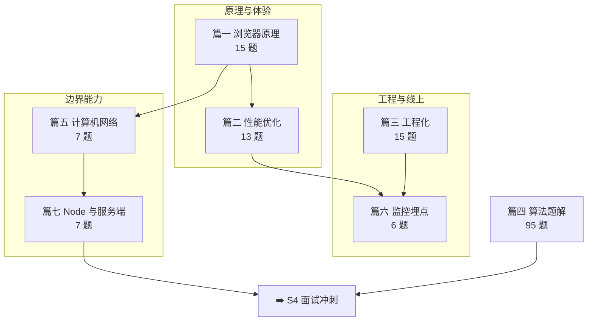

# 📘 S3 进阶提升 · 阶段总纲

> **版本**：v2.0（2026-10-10 体系化重构）｜ **题量**：**158 道**（63 道原理/工程/网络/服务端题 + 95 道唯一算法题，算法另有 104 个条目）
> **适用对象**：① 准备中高级前端面试（本仓库主要读者）；② 想从「会写业务」升级到「懂原理、能治理线上」的工程师
> **维护原则**：**版本事实联网核验**（见第 6 节）、**重难点显式标注**、**每题都有难度/频率/考点/记忆关键词/误区/一句话总结**

---

## 0. 三种用法，按需进入

| 你的处境 | 建议路径 |
|----------|----------|
| **系统学（3~4 周）** | 篇一浏览器 → 篇二性能 → 篇三工程化 → 篇五网络 → 篇六监控 → 篇七 Node；算法（篇四）每天 2~3 题并行 |
| **1 周突击面试** | 直接读第 4 节「必考 Top 30」→ 逐题只看 **💡 记忆关键词** 与 **📝 一句话总结** → 用第 7 节自测清单查漏 |
| **只补短板** | 看第 2 节定位表 → 跳到对应篇的题目索引表 → 优先读带 🔥 的题；算法单独按篇四的「优先掌握」列刷 |
| **算法专项** | 篇四按分类索引刷「优先掌握」列，再刷 🔥 标记的 48 题 |

---

## 1. 阅读标记

| 标记 | 含义 |
|------|------|
| ⭐ ~ ⭐⭐⭐⭐⭐ | 难度：⭐⭐ 以下必会，⭐⭐⭐ 进阶，⭐⭐⭐⭐+ 专家级 |
| 🔥 | 面试高频（80%+ 概率被问） |
| 📌 | 常考（50%~80%） |
| 📖 | 了解即可（<50%，有时间再看） |
| 💡 记忆关键词 | 面试前 30 秒快速回忆 |
| ⚠️ 常见误区 | 最容易答错/被追问的点 |
| 📝 一句话总结 | 面试时组织语言的模板 |

---

## 2. 七篇定位与知识地图

| 篇 | 文件 | 定位 | 面试权重 | 建议用时 | 题量 |
|----|------|------|----------|----------|------|
| 篇一 | [01-浏览器原理](./01-浏览器原理) | 进程架构、渲染流水线、缓存、安全、V8 GC、新能力 | ★★★★★ | 2 天 | 15 |
| 篇二 | [02-性能优化](./02-性能优化) | 指标体系（CWV）、瓶颈定位、加载/渲染/交互治理、监控闭环 | ★★★★★ | 3 天 | 13 |
| 篇三 | [03-前端工程化](./03-前端工程化) | 模块化、构建工具、Monorepo、代码质量、测试、微前端、CI/CD | ★★★★☆ | 2 天 | 15 |
| 篇四 | [04-算法题解](./04-算法题解) | Code Top 100：数据结构 + 高频算法 + 设计题 + ES6+ 手写 | ★★★★★ | 持续刷题 | 95（104 条目） |
| 篇五 | [05-计算机网络](./05-计算机网络) | 请求链路、HTTP 演进、HTTPS、缓存与 CDN、跨域与安全、实时通信 | ★★★★☆ | 2 天 | 7 |
| 篇六 | [06-前端监控与埋点](./06-前端监控与埋点) | 埋点体系、异常监控、性能监控、上报策略、告警与降级 | ★★★★☆ | 1.5 天 | 6 |
| 篇七 | [07-Node.js与服务端](./07-Node.js与服务端) | 运行时与事件循环、API 形态、高并发治理、BFF/SSR、排障 | ★★★★☆ | 1.5 天 | 7 |

---

## 3. 各篇核心考点速览

| 篇 | 三个必须答出的点 |
|----|------------------|
| 浏览器原理 | ① 多进程架构与站点隔离；② 渲染流水线五步与重排/重绘触发点；③ 缓存判定流程与安全（CORS/XSS/CSRF） |
| 性能优化 | ① LCP/INP/CLS 三档阈值与优化手段；② Lab 与 Field 的分工；③ 长任务治理与加载/渲染/交互三层优化 |
| 前端工程化 | ① ESM 与 Tree-shaking 前提；② Vite 为什么快、生产为何仍打包；③ Turborepo 的任务编排与增量缓存 |
| 算法题解 | ① 分类模板（哈希/双指针/链表/树/DP/回溯）；② 复杂度与边界；③ LRU、Promise 系列、并发调度等手写 |
| 计算机网络 | ① URL 到呈现的完整链路；② HTTP/2 与 HTTP/3 的队头阻塞差异；③ Token 存放与 CSRF/中间人防护 |
| 监控与埋点 | ① 监控三层；② 上报策略（采样/批量/beacon）；③ Source Map 还原与错误指纹聚合 |
| Node 与服务端 | ① 事件循环阶段与 `nextTick`/`setImmediate`；② 高并发分层治理；③ BFF 的超时/降级/可观测 |

---

## 4. 必考 Top 30（跨篇）

> 出处列 `篇-题号` 可直接跳转；算法篇单独给出高频清单。

| # | 题目 | 出处 | 难度 | 频率 |
|---|------|------|------|------|
| 1 | 从输入 URL 到页面呈现发生了什么 | 篇五-Q1 | ⭐⭐⭐ | 🔥 |
| 2 | 浏览器的多进程架构是怎样的 | 篇一-Q1 | ⭐⭐⭐ | 🔥 |
| 3 | 渲染流水线与重排/重绘触发点 | 篇一-Q2 | ⭐⭐⭐ | 🔥 |
| 4 | CSS/JS 阻塞规则与 defer/async/module | 篇一-Q3 | ⭐⭐⭐ | 🔥 |
| 5 | 事件循环中宏任务与微任务的执行顺序 | 篇一-Q4 | ⭐⭐⭐ | 🔥 |
| 6 | 强缓存与协商缓存、`Cache-Control` 怎么配 | 篇一-Q6 | ⭐⭐⭐ | 🔥 |
| 7 | 同源策略与 CORS 预检 | 篇一-Q8 | ⭐⭐⭐ | 🔥 |
| 8 | XSS 与 CSRF 的攻防 | 篇一-Q9 | ⭐⭐⭐ | 🔥 |
| 9 | V8 分代 GC 的原理 | 篇一-Q11 | ⭐⭐⭐⭐ | 🔥 |
| 10 | 内存泄漏场景与定位手段 | 篇一-Q12 | ⭐⭐⭐ | 🔥 |
| 11 | 你的性能优化方法论是什么 | 篇二-Q1 | ⭐⭐⭐ | 🔥 |
| 12 | Core Web Vitals 三指标与阈值 | 篇二-Q2 | ⭐⭐⭐ | 🔥 |
| 13 | Lab 数据与 Field 数据的区别 | 篇二-Q3 | ⭐⭐⭐ | 🔥 |
| 14 | 长任务是什么、如何治理 | 篇二-Q6 | ⭐⭐⭐⭐ | 🔥 |
| 15 | 图片优化手段与现代格式选择 | 篇二-Q5 | ⭐⭐ | 🔥 |
| 16 | ESM 与 CJS 的区别、Tree-shaking 前提 | 篇三-Q1 | ⭐⭐⭐ | 🔥 |
| 17 | Vite 为什么快？生产为何还要打包 | 篇三-Q2 | ⭐⭐⭐ | 🔥 |
| 18 | 构建工具怎么选（Webpack/Vite/Rspack/…） | 篇三-Q3 | ⭐⭐⭐ | 🔥 |
| 19 | Monorepo 与 Turborepo 解决什么问题 | 篇三-Q5 | ⭐⭐⭐ | 🔥 |
| 20 | 锁文件的作用与 CI 锁定安装 | 篇三-Q6 | ⭐⭐ | 🔥 |
| 21 | Biome / ESLint+Prettier / oxlint 怎么选 | 篇三-Q7 | ⭐⭐⭐ | 🔥 |
| 22 | 微前端解决什么、隔离机制差异 | 篇三-Q11 | ⭐⭐⭐⭐ | 🔥 |
| 23 | HTTP/2 队头阻塞与 HTTP/3 的解法 | 篇五-Q2 | ⭐⭐⭐⭐ | 🔥 |
| 24 | 为什么不用 Cookie 存 Token | 篇五-Q3 | ⭐⭐⭐ | 🔥 |
| 25 | HTTPS 中间人攻击怎么防 | 篇五-Q4 | ⭐⭐⭐ | 🔥 |
| 26 | 301/302/307/308 的区别 | 篇五-Q5 | ⭐⭐ | 📌 |
| 27 | 前端监控体系包含哪些层次 | 篇六-Q1 | ⭐⭐ | 🔥 |
| 28 | 如何上报数据而不影响主流程 | 篇六-Q2 | ⭐⭐⭐ | 🔥 |
| 29 | Node 事件循环的阶段与顺序 | 篇七-Q5 | ⭐⭐⭐ | 🔥 |
| 30 | `nextTick` 与 `setImmediate` 的区别 | 篇七-Q6 | ⭐⭐⭐ | 🔥 |

**算法高频清单（篇四）**：LRU 缓存（91）、Promise 系列（101/103）、并发调度器（102）、两数之和（1）、接雨水（7）、K 个一组翻转链表（13）、二叉树最大路径和（41）、编辑距离（44）、滑动窗口最大值（75）、岛屿数量（86）、课程表（88）。

---

## 5. 学习路径

### 5.1 四周系统路线

| 周 | 内容 | 产出 |
|----|------|------|
| 第 1 周 | 篇一浏览器 + 篇二性能 | 画出渲染流水线图；用 Lighthouse + web-vitals 测一次自己的项目并给出优化项 |
| 第 2 周 | 篇三工程化 | 搭一个 Bun/Turborepo + Biome + Vitest 的最小 Monorepo，配好 CI 门禁 |
| 第 3 周 | 篇五网络 + 篇六监控 | 讲清一次完整请求链路；实现一个最小监控 SDK（错误 + Web Vitals + sendBeacon） |
| 第 4 周 | 篇七 Node + 篇四算法（每天 2~3 题） | 写一个带超时/降级/日志的 BFF 接口；算法刷完「优先掌握」列 |

**每日节奏**：1 小时阅读 + 1 小时动手（写代码/做实验）> 周末突击 8 小时；每周用对应篇的「✅ 自测清单」做一次周检。

### 5.2 一周突击路线

| 天 | 内容 |
|----|------|
| 第 1~2 天 | Top 30 中第 1~15 题（浏览器 + 性能） |
| 第 3~4 天 | Top 30 中第 16~30 题（工程化 + 网络 + 监控 + Node） |
| 第 5~6 天 | 算法高频清单 11 题 + 各分类模板（哈希/双指针/链表/树/DP/回溯） |
| 第 7 天 | 用第 7 节自测清单查漏 + 模拟口述 3 道综合题（如「首屏慢怎么排查」） |

---

## 6. 版本口径（2026-10-10 联网核验，全阶段统一）

| 技术 | 真实状态 | 仓库（interview-demo） |
|------|----------|------------------------|
| Node.js | **26.11.1** | — |
| Deno | **2.9.6**（LTS `2.2.15`） | — |
| Bun | **1.4.3** | `bun@1.4.2`（packageManager） |
| Vite | **8.3.4** | `^8.0.16` |
| Rolldown | **1.2.13** | —（Vite 生产底座） |
| Rspack | **2.2.8** | — |
| Webpack | **5.111.1** | — |
| Rollup | **4.64.4** | — |
| esbuild | **0.28.2**（仍为 0.x） | — |
| SWC | **1.16.13** | — |
| Biome | **2.5.15** | `^2.5.0`（唯一 linter/formatter） |
| oxlint | **1.87.0** | —（对比项） |
| Turborepo | **2.11.7** | 仓库使用的任务编排器 |
| Nx | **23.3.0** | —（对比项） |
| pnpm | **12.10.1** | —（仓库用 Bun workspace） |
| qiankun | **2.10.16**（3.x 仍 RC `3.0.0-rc.22`） | — |
| Vitest | **5.0.3**（4.x 线 `4.1.11`） | `^4.1.9` |
| TypeScript | **7.0.2** | `^7.0.2` |

> **写作口径**：工具版本号迭代极快，表中为核验当日值，**仅作选型参考**；未正式发布的版本（如 qiankun 3.x RC）必须显式标注成熟度。

---

## 7. 阶段自测清单（答不出就回对应篇补）

- [ ] 能画出「输入 URL 到页面呈现」的完整链路，并指出每段的耗时来源
- [ ] 能说出渲染流水线五步，并判断某个改动触发到哪一步
- [ ] 能解释强缓存/协商缓存判定流程，以及 `no-cache` 与 `no-store` 的区别
- [ ] 能给出 LCP/INP/CLS 的阈值与各自 3 条优化手段
- [ ] 能解释长任务（>50ms）与三种让出主线程的手段
- [ ] 能说清 `preload`/`prefetch`/`preconnect` 的区别与误用后果
- [ ] 能给出构建工具选型理由，并按「定位 → 缩小 → 缓存 → 换引擎」优化构建
- [ ] 能解释 Turborepo 的任务编排、增量与缓存，以及锁文件的作用
- [ ] 能对比 Biome / ESLint+Prettier / oxlint 并给出选型
- [ ] 能说明微前端各方案的隔离差异，并判断什么时候「不该上微前端」
- [ ] 能对比 SSE / WebSocket / 长轮询，并设计心跳与重连
- [ ] 能讲清监控三层、上报策略与 Source Map 还原链路
- [ ] 能说出 Node 事件循环阶段顺序，并判断 `nextTick`/`setImmediate`/`setTimeout` 混合输出
- [ ] 能按「分流 + 减负 + 扩容 + 兜底」四层讲高并发治理
- [ ] 能在 45 分钟内完成 1 道中等算法题，并说清复杂度与边界

---

## 8. 与其他阶段的衔接

- **前置**：[S1 基础夯实](../S1-基础夯实/)、[S2 框架深入](../S2-框架深入/)（框架原理是性能与工程优化的上游）
- **后续**：[S4 面试冲刺](../S4-面试冲刺/)（模拟面与复盘）、[S5-AI](../S5-AI/)、[S6-Go](../S6-Go/)
- **与本项目技术栈的对应**（可在对应篇找到原理与对比）：

| 本项目实际使用 | 对应篇 | 对比内容 |
|---------------|--------|----------|
| Bun workspace + Turborepo | 篇三（Monorepo / 包管理器） | Turborepo vs Nx vs pnpm/Bun workspace |
| Biome（唯一 linter/formatter） | 篇三（代码质量） | Biome vs ESLint 9 + Prettier vs oxlint |
| Vite + Rolldown + Vitest | 篇三（构建工具 / 测试） | Rolldown vs esbuild vs SWC；Vitest vs Jest vs Bun test |
| web-vitals 上报 + 自建监控 | 篇六、篇二 | 自建 RUM vs Sentry/Faro/OTel RUM；Lab vs Field |
| SSE / WebSocket（Go 后端） | 篇五 | SSE vs WebSocket vs 长轮询 |
| JWT 双 Token + 401 无感刷新 | 篇五（认证）、篇七（BFF） | Cookie/Session/Token 对比 |
