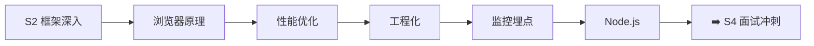

# S3 进阶提升 🟡

> **学习目标**：深入理解浏览器原理、性能优化、前端工程化、监控体系与服务端开发
>
> 📝 **版本说明**：文档中的版本号、性能数字均为**量级参考**，具体以各工具/标准官方发布为准；技术选型均给出**主流方案横向对比**而非单一结论。

## 内容章节

- [🌍 浏览器原理](./01-浏览器原理.md) — 渲染流程、V8 执行管线（Ignition/Sparkplug/Maglev/TurboFan）、Orinoco GC、事件循环、内存管理、安全机制、**三大引擎现状对比（Blink/WebKit/Gecko）**、Worker/WASM/WebGPU 能力矩阵
- [🚀 性能优化](./02-性能优化.md) — 加载优化、渲染优化、构建优化、**Core Web Vitals 三档阈值（LCP/INP/CLS）**、图片格式与懒加载方案对比、长任务治理、Lab vs Field 数据源对比
- [🏗️ 前端工程化](./03-前端工程化.md) — **构建工具全景对比（Webpack/Rollup/Vite/Rolldown/Rspack/Turbopack/Farm/esbuild/oxc/Bun）**、包管理器与锁文件现状、**Monorepo 方案对比（Turborepo/Nx/Rush/Bun workspace）**、**Lint 工具对比（ESLint9+Prettier/Biome/oxlint）**、**测试框架对比（Jest/Vitest/Bun test）**、**微前端方案对比（MF/qiankun/wujie/micro-app/Garfish）**、CI/CD（含 GitHub Actions 实战）
- [💡 算法题解](./04-算法题解.md) — 95 道唯一题目（100 个条目含 5 组跨分类复用索引）：排序、搜索、树、动态规划、设计题，另含 **ES6+ 高频手写（Promise 系列 / 并发调度 / 语言特性）**
- [🌐 计算机网络](./05-计算机网络.md) — HTTP/1.1→2→3、HTTPS/TLS 1.3、TCP vs **QUIC 对比**、DNS（含 DoH/HTTPDNS）、缓存（含缓存分区/SWR/103）、CORS、XSS/CSRF、**SSE vs WebSocket vs 长轮询三方对比**
- [📊 前端监控与埋点](./06-前端监控与埋点.md) — 三类埋点方案对比、Session Replay/曝光埋点、异常监控与 Source Map 还原、Web Vitals 采集（含采样倍率）、**监控选型对比（Sentry/Grafana Faro/OTel RUM/ARMS/WebSee）**、上报方式对比（sendBeacon/fetch keepalive/图片打点）
- [📦 Node.js 与服务端](./07-Node.js与服务端.md) — Node 版本与双模块体系、**运行时对比（Node/Deno/Bun）**、事件循环、REST vs GraphQL vs tRPC vs gRPC-web、高并发治理、**SSR 方案对比（Next/Nuxt/Remix/Astro/RSC）**、BFF 与边缘/Serverless 差异

## 学习路线

## 与本项目技术栈的对应关系

本项目（interview-demo）采用的主流方案，可在对应章节中找到原理与对比：

| 本项目实际使用 | 对应章节 | 对比内容 |
|---------------|---------|---------|
| Bun workspace + Turborepo | 03 工程化（Monorepo / 包管理器） | Turborepo vs Nx vs Rush vs pnpm/Bun workspace |
| Biome（唯一 linter/formatter） | 03 工程化（代码质量） | Biome vs ESLint 9 + Prettier vs oxlint |
| Vite + Rolldown + Vitest | 03 工程化（构建工具 / 测试） | Rolldown vs esbuild vs SWC vs oxc；Vitest vs Jest vs Bun test |
| web-vitals 上报 + 自建监控 | 06 监控埋点、02 性能优化 | 自建 RUM vs Sentry/Faro/OTel RUM；Lighthouse vs CrUX vs RUM |
| SSE / WebSocket（Go 后端） | 05 计算机网络 | SSE vs WebSocket vs 长轮询 |
| JWT 双 Token + 401 无感刷新 | 05 计算机网络（认证）、07 Node（BFF） | Cookie/Session/Token 对比 |
