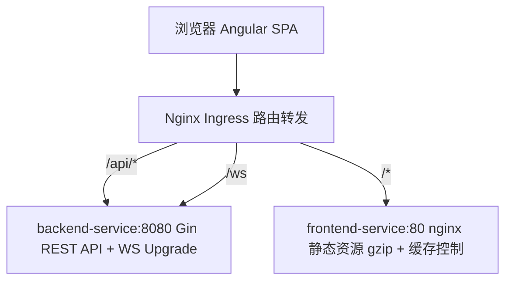
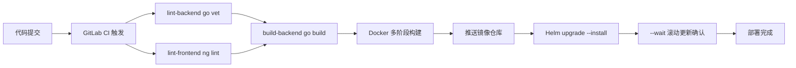

# Angular 中高级前端面试通关指南

> 面试不是考试，是**用你的技术体系打动另一个技术人**。
> 基于《前端知识体系·中高级通关指南》改编为 Angular 技术栈版本，覆盖 Angular 22、RxJS、NgRx、Signals 等核心专题。

---

# 第一部分：面试策略

## 1.1 面试流程与各环节策略

```
一小时模拟面试流程：
├─ 第一阶段 10min — 自我介绍 + 项目概述
│   └─ 给出清晰的技术定位，不展开细节，引导面试官到你准备好的方向
├─ 第二阶段 20min — 项目深挖 ⭐ 核心环节
│   ├─ 面试官关注：你的"不可替代性"是什么？
│   ├─ 遇到最大的技术挑战是什么？
│   ├─ 为什么选这个方案？有没有想过更好的方案？
│   └─ 按 STAR 回答：背景 → 任务 → 行动 → 结果
├─ 第三阶段 15min — 八股问答
│   ├─ Angular Zone.js + Change Detection 原理（必问）
│   ├─ RxJS 核心操作符 + 异步数据流（必问）
│   ├─ NgRx / Signals 状态管理原理
│   ├─ Angular DI 层次体系 + 注入器树
│   └─ 浏览器渲染流程（Layout / Paint / Composite）
├─ 第四阶段 10min — 手写题
│   ├─ 防抖 / 节流 / forkJoin / 深拷贝 / 自定义 Pipe
│   ├─ RxJS 操作符实现（map/filter/switchMap）
│   └─ 每天练 2-3 道
└─ 第五阶段 5min — 反问环节
    ├─ ✅ "团队目前的技术栈和工程体系是怎样的？"
    ├─ ✅ "你们在性能优化和可观测性上有什么建设？"
    ├─ ✅ "团队在 AI 辅助开发上的使用情况如何？"
    └─ ❌ 避免问加班/KPI/下午茶
```

## 1.2 自我介绍

### 3 分钟版本

```
我叫 XXX，目前有 4 年前端开发经验，主要方向是企业级 ToB 平台研发与实时通信系统架构。

参与并主导了多个企业级平台及内部基建，涵盖：
- 5G 核心网测试用例管理系统
- 企业级综合网络管理系统（AeMS）
- @axyom-ui 企业级内部组件库搭建

技术栈上，主要使用 Angular 22 + TypeScript 6 + NG-ZORRO 21 + NgRx，
配合 Go + Gin 后端，深度使用 TypeScript strict 模式 + Angular ESLint 规范。

核心能力聚焦于三个方向：
┌─ 实时通信 ─── 多协议降级传输层 (WS→SSE→Polling) + 背压控制 + 消息合并
│              → 1000+ QPS 下保持 60fps 全帧率渲染（优化前丢帧 47%/18fps）
├─ 性能攻坚 ─── GIS 十万级点位四重优化 (BBOX+Cluster+cache+惰性刷新)
│              → 帧率 <10fps → 60fps（7×提升），内存 ~200MB → ~30MB（↓85%）
└─ 工程架构 ─── 递归动态表单引擎 (4层AST树+策略模式+四级校验) + LRU路由缓存
               → 开发人效提升 80%（3人天→0.5小时零代码配置）
               → 页面切换性能提升 60%，权限越权降低 90%

举个例子：
- 用 BBOX + Cluster + dataCache + moveend 四重策略，把十万级 GIS 点位帧率从 <10fps 优化到 60fps（Angular + OpenLayers）
- 自研 JSON Schema 递归动态表单引擎(4层AST树+7种字段+条件显隐+字段联动)，开发人效提升 80%

此外，我也设计了多协议降级传输层（WebSocket → SSE → Polling 三级降级），`bufferTime(16ms/64条)` + RAF 双缓冲，4000 msg/s 全帧率渲染；以及内部组件库 @axyom-ui（表格代码减少 80%），以 ng-packagr Library 发布 + GitLab CI 条件触发全自动流水线。

**差异化优势**：React 19 + Angular 22 双栈，能根据项目规模和技术遗产灵活选型；全栈思维——从 Biome → ESLint → TS Strict 三层约束到 K8s 部署，独立完成全链路。
```

### 1 分钟版本（精简）

```
我有 4 年前端经验，专注企业级 ToB 平台与实时通信系统架构。
主导过 5G 测试平台、网络管理系统、@axyom-ui 组件库等项目。

技术栈：Angular 22 + TypeScript 6 + NG-ZORRO 21 + NgRx + Go。

 核心能力：
 - 架构：递归动态表单引擎、@axyom-ui 组件库
 - 性能：GIS 渲染从 <10fps 优化到 60fps、LRU 路由缓存
 - 工程：Signals + RouteReuseStrategy、HttpInterceptorFn 体系、CI/CD + K8s 部署
 - 组件库：Signals 声明式表格、配置驱动动态表单、注册表模式
```

## 1.3 简历优化策略

### 所有项目都必须量化

```
❌ 泛泛而谈：
   优化了系统性能，提升了用户体验

✅ 量化表达：
   响应效能提升 35% | 发布周期缩短 60% | 开发人效提升 80%
   排障效率提升 50% | 帧率从 <10fps 优化到 60fps
```

### 项目描述减少"平台化空话"

```
❌ 删掉：打造一站式闭环服务 / 构建全链路解决方案 / 赋能业务数字化升级
✅ 改成：支撑 200+ 自动化任务并发执行 / 万级 GIS 点位 60fps 流畅渲染 / 百万行日志毫秒级加载
```

### 数据可信度证明

面试官质疑数据真实性时，分三步证明：

1. **工具链路**：Lighthouse CI 性能报告 + Performance API 埋点（RUM）+ 自定义埋点
2. **数据口径**：明确是 P50 还是 P95（如"帧率 = DevTools Performance 录制 30 秒取均值"）
3. **内部工具替代**：没有 A/B 对比就说"功能密度提升"——改造前 3 人天 → 0.5 小时

核心原则：有数据说趋势（同比/环比），无数据说对比（改造前后/同行业标准）。

## 1.4 面试心态与技巧

### 回答问题的原则

```
├─ 先给结论，再展开
│   └─ "核心是 XXX，具体来说..."
├─ 用结构化表达
│   └─ "分三个方面：第一...第二...第三..."
├─ 承认不会，展示思路
│   └─ "这个我不太确定，但我的理解是...我可以分析一下..."
├─ 主动关联项目
│   └─ "这个在我们项目中用到了，比如..."
└─ 控制时间
    └─ 一个问题回答不超过 2 分钟
```

### 面对未知问题的三步法

1. **拆解**："您问的是 X，我先拆解为 A、B、C 三个方面"
2. **关联**："关于 A 我了解...，B 和 A 类似，所以 B 可能也..."
3. **推断**："我推测 X 的核心机制是...，当然需要验证"

"我不知道"关闭对话，"我可以分析一下"开启思考演示。面试官更看重后者。

### 面试后复盘

```
每次面试后记录：
├─ 哪些问题答得好？→ 保持，下次继续用这个思路
├─ 哪些问题答得不好？→ 记录问题，回去深入研究
├─ 哪些问题没听懂？→ 可能是问题表述问题，也可能是知识盲区
└─ 建立自己的"面试错题本"
```

## 1.5 不同企业面试风格

| 维度 | 大厂 | 外企 | 国企 |
|------|------|------|------|
| 八股深度 | ⭐⭐⭐⭐⭐ | ⭐⭐ | ⭐⭐⭐ |
| 算法要求 | ⭐⭐⭐⭐ | ⭐⭐⭐ | ⭐⭐ |
| 项目深挖 | ⭐⭐⭐⭐ | ⭐⭐⭐⭐ | ⭐⭐⭐ |
| 英文要求 | ⭐⭐ | ⭐⭐⭐⭐⭐ | ⭐ |
| 架构设计 | ⭐⭐⭐⭐ | ⭐⭐⭐⭐⭐ | ⭐⭐ |
| 学历看重 | ⭐⭐⭐ | ⭐⭐⭐ | ⭐⭐⭐⭐⭐ |

---

# 第二部分：项目与技术亮点（面试版）

## 2.1 项目全景

### 项目一：AeMS — 企业级综合网络管理系统

| 属性 | 内容 |
|------|------|
| 类型 | ToB 企业级 — 十万级网元统一监控与智能告警平台 |
| 技术栈 | Angular 22 + TypeScript 6 + NG-ZORRO 21 + OpenLayers 10.x + ECharts 5.x + WebSocket(STOMP) + Go + Gin |
| 状态 | 线上运行（Docker → K8s 内网部署） |
| 负责 | 前端架构设计、多协议降级传输层、RBAC权限体系、GIS性能优化、LRU路由缓存、精确Loading管理、工程化建设 |

**核心模块**：GIS 十万级点位四重优化(BBOX+Cluster+dataCache+moveend) ⭐、高并发实时告警中枢(三级降级+背压控制+消息合并+心跳保活) ⭐、LRU 路由页面缓存(RouteReuseStrategy)、RBAC 位编码权限(O(1)检查+三层联动+后端双校验)、精确 Loading 状态管理(请求级粒度追踪)、Hub-Spoke 仪表盘 + Recording Rules 预计算

### 项目二：@axyom-ui — 企业级内部组件库

| 属性 | 内容 |
|------|------|
| 类型 | ToB 企业级 — 基于 Angular 22 的企业级内部组件库 |
| 技术栈 | Angular 22 + TypeScript 6 + NG-ZORRO 21 + RxJS 7 + ng-packagr + Vitest |
| 状态 | 线上运行（GitLab NPM Registry 私有发布，复用 5+ 内部项目） |
| 负责 | 组件库整体架构设计、表格组件核心引擎、表单框架五层架构、工程化建设 |

**核心模块**：@axyom-ui/table（Signals响应式+三态分页+TemplateRef注册表插槽+列拖拽+列显隐持久化）⭐、@axyom-ui/form（配置驱动+五层架构+注册表模式动态分发+20种组件类型+10种验证器）⭐、GitLab CI 条件触发(test→build→npm publish自动化)

## 2.2 技术亮点速览

| 亮点 | 技术价值 | 量化效果 |
|------|----------|----------|
| 递归动态表单引擎（5GC/AeMS项目） | 4 层 AST 树 + 策略模式注册表 + 四级校验 + 条件显隐(CSP降级DSL) + 字段联动(拓扑排序) | 开发人效提升 80%（3人天→0.5小时零代码配置），复用于2个独立项目 |
| @axyom-ui/table 声明式表格 | Angular 22 Signals + 三态分页 + TemplateRef 注册表 + 列拖拽 + 列显隐持久化 | 表格用户代码量减少 80% |
| @axyom-ui/form 配置驱动表单框架 | 五层架构 + 注册表模式 + 20 种组件类型 + 10 种验证器 + NgComponentOutlet | 表单开发人效提升 80% |
| 多协议降级传输层 + 背压控制 | WebSocket→SSE→Polling 三级降级 + bufferTime(16ms/64条) + animationFrameScheduler RAF | 1000+ QPS 下 60fps 全帧率，平台可用性 99.9% |
| GIS 十万级点位四重优化 | BBOX 视口裁剪 + Cluster 聚合 + dataCache 全量缓存 + moveend 惰性刷新 | 帧率 <10fps → 60fps（7×），内存 ~200MB → ~30MB（↓85%） |
| 双 Token 无感刷新（HttpInterceptorFn） | RxJS Observable gate + Token Rotation + Replay 检测 | 平台可用性 99.9% |
| RBAC 位编码权限体系 | 位运算 O(1) + 菜单/路由/按钮三层联动 + 后端 API 双校验 | 越权漏洞降低 90%，6 种权限仅占 4 字节 |
| SSE 日志流式传输 | Observable + AbortController + 正则异常高亮 | 500 行 RingBuffer 内存可控 |
| LRU 路由页面缓存 | RouteReuseStrategy 四阶段生命周期 + LRU淘汰(最多6) + staleKeys写后失效 + TTL惰性过期(30s) | 页面切换性能提升 60% |
| 精确 Loading 状态管理 | HttpInterceptorFn 方法-路径动态标记 + Signal驱动OnPush精准更新 | 消除全局/区域Loading混淆，零无效遮罩 |
| Hub-Spoke 仪表盘 + Recording Rules | GitOps 工程化 + Prometheus 预计算 + 4 级递进告警 | 仪表盘加载 10+s → <1s，30+ 仪表盘零手工重复 |
| Web Worker 分治有序合并 | WorkerPool(parallel) + transferable objects零拷贝 + 有序(seq号排队)合并 | 25MB 级日志首段"秒开"，主线程零阻塞 |

## 2.3 八大技术难点 STAR 剖析

> 以下每个难点均可作为 STAR 故事的素材。按"背景 → 任务 → 行动 → 结果"展开讲 2-3 分钟。

### 难点 1：递归动态表单引擎 — 5GC/AeMS 项目

**背景**：5G核心网7种网元配置各不相同，频繁变动。传统硬编码模板每次改字段都要改代码发版，平均耗时3人天。@rjsf 适合标准JSON Schema场景，但条件显隐/字段联动/实时JSON编辑等定制需求力不从心。

**任务**：设计一套非前端人员也能零代码配置的表单系统，支持复杂布局、条件显隐、字段联动、自定义校验。将表单开发周期从"人天"压缩至"小时级"。

**行动**：

```
选型决策：
├─ 自研 JSON Schema 动态表单 ✅ — 完全可控
│   对比 @rjsf/Formily：自研仅4个核心文件+7字段组件，轻量无外部依赖
├─ Schema抽象为4层AST树(tabs→card→form→leaf)，递归渲染器逐层解析
│   tabs→Ant Design <nz-tab-group> / card→<nz-card> / form→<div> / leaf→策略模式查询字段组件
├─ registerField(type, Comp) 一行注册新字段(策略模式)
├─ 条件显隐表达式运行时解析(new Function变量替换)，CSP检测到限制时降级到预定义DSL
│   预定义DSL: { when: { field: "enableEncryption", eq: true } }
├─ 字段联动: autoFill + _isAutoFilling防死循环标记 + maxAutoFillDepth=5 + 依赖图拓扑排序
├─ 四级校验: 同步onChange → 异步(300ms debounce + AbortController取消前一次)
│   → AJV Schema → 后端业务校验(setFields精准映射到字段)
└─ 深度保护: _depth + maxDepth=20防无限递归; _visitedRefs WeakSet检测循环引用
```

**结果**：开发人效提升 80%（3人天 → 0.5小时零代码配置）；覆盖7种网元类型200+字段的复杂表单场景；已复用于2个独立项目。

---

### 难点 2：LRU 路由缓存策略 — AeMS 项目

**背景**：页面切换时每次都要卸载重建组件、重新请求数据，导致切换体验卡顿，滚动位置丢失。原系统在模块间反复切换时白屏等待严重。

**任务**：实现页面级路由缓存，保持DOM状态的同时保证数据一致性，页面切换性能提升。

**行动**：

```
核心设计（基于 Angular RouteReuseStrategy）：
├─ 自定义 RouteReuseStrategy 实现：
│   ├─ shouldReuseRoute：判断路由是否可复用（基于 routeKey）
│   ├─ shouldAttach：目标路由是否有缓存
│   ├─ retrieve：从缓存中获取组件
│   └─ store：缓存当前组件实例
├─ LRU 淘汰：最多缓存 6 个页面，超出自动销毁最久未访问的(Object.keys顺序遍历)
├─ 滚动位置恢复：store时取.ant-table-body的scrollTop，retrieve时setTimeout异步恢复
├─ 模块级隔离：切换大模块(如Setting→Manage)时清理目标模块缓存
├─ 写后失效（staleKeys）：写操作后标记对应 key，切换时自动刷新
├─ 30s TTL 惰性过期：切回时检查 loadedAt，过期自动刷新
├─ 倒计时指示器：卡片标题实时显示缓存剩余秒数（≤5s 红色警告）
├─ 三条件合一驱动刷新：!page.loaded || isStale || isTtlExpired
│   └─ 激活切换本身不触发请求，仅数据一致性条件驱动
└─ 手写方案 vs display:none方案：RouteReuseStrategy是Angular原生机制，
   组件attach/detach时走完整生命周期；display:none仅隐藏UI，JS实例仍在运行
```

**结果**：页面切换性能提升 60%，消除模块切换白屏等待。

---

### 难点 3：多协议降级传输层 + 背压控制 — AeMS 项目

**背景**：AeMS需处理1000+ QPS告警并发推送，企业内网可能屏蔽WebSocket、代理超时断开。原系统在万级并发下帧率<10fps卡顿严重；告警峰值导致47%丢帧(18fps)。

**任务**：设计多协议降级传输层+背压控制，实现1000+QPS高并发实时告警下60fps全帧率渲染，平台可用性99.9%，任意网络环境告警秒级触达。

**行动**：

```
架构决策：Transport统一接口抽象，上层组件无感知
├─ interface Transport<T> { messages$, status$, connect(), disconnect() }
├─ 三级降级链路：WsTransport(rxjs/webSocket) → SseTransport(EventSource/fetch) → Polling(interval+HttpClient)
│   降级触发：WS连续10次重连失败(指数退避1s→2s→4s...→30s,约5min后降级)
│   SSE连接失败→即时切Polling；Polling永不降级
├─ 背压控制：bufferTime(16ms, undefined, 64条) + animationFrameScheduler RAF双缓冲
│   4000 msg/s → 每帧合并~64条 → setState仅60次/s → 60fps
│   对比直接set：每秒set 4000次 → reconciliation来不及 → 丢帧47%
├─ 消息合并：16ms窗口/64条双条件触发，减少50x+渲染调用
├─ 心跳保活：30s ping / 10s pong超时检测，5s内发现僵尸连接
├─ 断线重连：retry({count:10, delay:指数退避+jitter})避免重连风暴
├─ 去重：seenRef Set上限5000，防重连后重复消息
└─ 生命周期管理：takeUntilDestroyed()组件销毁自动退订
```

**结果**：1000+ QPS 告警冲击下保持 **60fps 全帧率**（优化前 47%丢帧/18fps）；平台可用性 **99.9%**；任意网络环境告警秒级触达。

---

### 难点 4：GIS 十万级点位四重优化 — AeMS 项目

**背景**：十万个基站点位直接渲染到OpenLayers地图上，帧率<10fps，拖动卡顿2s+。内存占用~200MB，Feature数量10万独立渲染。

**任务**：在保持地图交互流畅的前提下，实现十万级点位的高效渲染。目标：帧率≥60fps，内存可控，拖动全程流畅无卡顿。

**行动**：

```
四重优化策略：
├─ BBOX视口裁剪：filterByExtent()只保留视口矩形内点位，裁剪约60%(100k→40k)
├─ Cluster聚类聚合：distance=40px，同区域聚合为1个聚类点(40k→~50点)
├─ dataCache全量缓存：Map<zoom+extent, features>，平移/缩放零请求
└─ moveend惰性刷新：拖动结束才触发重绘+50ms防抖，拖动全程60fps
流程：100k原始 → BBOX裁剪 → 40k → Cluster聚合 → ~50点 → 渲染
```

**结果**：Feature数从100k降至~50聚类点（↓2000×），帧率从 **<10fps → 60fps**（7×提升），内存从 **~200MB → ~30MB**（↓85%），拖动流畅无卡顿。

---

### 难点 5：RBAC位编码权限体系 — 跨项目

**背景**：传统权限用数组/Set存储权限列表，检查时需要遍历O(n)；369个旧权限码与新码需要兼容迁移。

**任务**：设计一套高效、可扩展、防篡改的权限系统。

**行动**：

```
位编码设计：
├─ 6种权限各占1位：READ=1<<0, WRITE=1<<1, ..., ADMIN=1<<5
├─ hasPermission = (code & perm) === perm → O(1)单条CPU指令
├─ SUPER = reduce自动聚合所有权限，新增权限无需改角色

树形常量树 → 自动权限码映射：
├─ ROLE常量树，每层M值拼接为完整权限码（如311=cell>active>EXPORT）
├─ 树形深度约束+M值编码，确保每个节点有唯一编码
├─ old_role.ts包含369个旧权限码映射，ROLE_LIST自动合并新旧映射
├─ getLeafNodesWithPath递归遍历，将权限管理从"人工配置"升级为"代码生成"

Angular三层联动 + 后端双校验：
├─ 菜单层：*ngIf指令 + 自定义结构指令(*aclHasPermission)递归过滤
├─ 路由层：CanActivateFn守卫拦截
├─ 按钮层：ButtonGroupComponent的action数组声明acl属性，ACLService.can()集中校验
└─ 后端层：POST /api/rbac/check独立位运算校验 + 前后端一致性对比
```

**结果**：越权漏洞发生率降低 **90%**；6种权限仅占 **4字节**存储。

**追问链**：
- **Q：位运算比数组/Set好在哪？** → 存储4字节vs数百字节；检查O(1)vsO(n)；组合1次位运算vs遍历
- **Q：32位限制怎么突破？** → JS位运算仅31位有效位；超过32种权限改用BigInt（1n << 33n）
- **Q：Angular中自定义结构指令和*ngIf的区别？** → 结构指令可以封装完整的权限判断逻辑，并且复用；利用microsyntax (*aclHasPermission="['READ', 'WRITE']")简洁易用
- **Q：前后端一致性对比的价值？** → 纯前端可被DevTools篡改；后端独立校验+前端对比展示不一致告警

---

### 难点 6：Signals响应式表格架构 — @axyom-ui/table

**背景**：企业内部多个Angular项目存在大量重复的表格业务逻辑，每个项目都需单独封装分页/排序/选择等功能，平均每个页面200+行重复代码。

**任务**：设计一套基于Angular 22 Signals的企业级声明式表格组件库，消除重复模板代码。

**行动**：

```
Signals响应式架构：
├─ signal()管理分页/排序/选中行等UI状态，computed自动追踪依赖图
├─ model()实现父子组件双向绑定，子组件可主动更新父组件分页和选中状态
├─ Set信号管理展开行/加载行状态，rowChecked computed生成Set<string|number>实现O(1)查重
└─ 对比RxJS：Signal同步推送、自动追踪依赖、无需subscribe/unsubscribe；RxJS保留给列拖拽事件流

三态分页设计：
├─ 前端分页：frontPagination=true, pageSize!=0 → 本地data信号排序分片
├─ 后端分页：frontPagination=false, pageSize!=0 → page model双向绑定通知父组件发HTTP
├─ 不分页：pageSize=0 → 隐藏分页栏，全量数据展示
└─ 排序策略自动适配：后端排序首次设置排序重置页码，已有排序时切换列保持当前页码

TemplateRef注册表插槽：
├─ AxyomRowSource作为中央注册表，AxyomRowDirective在ngOnInit注册TemplateRef
├─ {host:true} DI隔离确保每个表格实例拥有独立注册表，避免模板冲突
├─ CellComponent根据列配置的render属性查询注册表，ngTemplateOutlet渲染
└─ 重复key防御性检查，编译时即报错

列拖拽调整宽度：
├─ DragColumnDirective在ngAfterViewInit通过setTimeout延迟等待DOM渲染
├─ 动态创建<i>元素作为拖拽手柄，fromEvent管理mousedown→mousemove→mouseup事件链
├─ DragColumnService BehaviorSubject作为状态总线广播列宽变化
└─ takeUntilDestroyed安全清理，CSS user-select:none防止拖拽文字选中
```

**结果**：表格业务代码量减少 **80%**（每页面减少200+行），复用5+内部项目。

---

### 难点 7：配置驱动表单框架 — @axyom-ui/form

**背景**：Angular项目中表单开发重复模板代码多，手写FormGroup/FormControl、校验逻辑、条件显隐等需要大量样板代码，开发效率低。

**任务**：设计一套基于Angular 22的配置驱动型动态表单框架，五层架构+注册表模式，支持运行时动态组件分发。

**行动**：

```
五层架构设计：
├─ 基础设施层：提供10种自定义验证器（IP/URL/手机号/身份证/BigInt/跨字段联动等）
├─ 基类层：BaseInf泛型工具类型实现"必填key+可选配置"模式
├─ 组件层：20种内置组件类型，单行register()快速扩展
├─ 调度层：FormUnitRegistryService运行时动态组件分发(NgComponentOutlet)
└─ 容器层：DynamicModalService统一弹窗服务，AXYOM_FORM_CONFIG InjectionToken全局配置注入

TypeScript类型安全配置推断：
├─ type BaseInf<T, R={key:string}> = Omit<Partial<Omit<T,keyofR>> & R, 'controlType'|'control'|'view'>
├─ new StringUnit({key:'name'})只需传入key，其他属性可选
└─ controlType/control/view等库内部属性编译时自动排除

条件显示与FormControl动态管理：
├─ display支持布尔值（静态）和函数（动态）两种策略
├─ form.addControl/removeControl动态管理FormControl，隐藏时不参与校验
├─ form.getRawValue()获取所有值（含disabled），确保条件变化时数据不丢失
└─ 再次addControl时control保留原值和验证状态

跨字段联动验证：
├─ 闭包中subscribe标识实现一次性延迟订阅，避免依赖循环
├─ 目标字段变化时触发自身updateValueAndValidity，避免循环调用
└─ 支持equalTo/notEqualTo/laterTo等多种联动验证器
```

**结果**：表单开发人效提升 **80%**（配置驱动替代手写模板）。

---

### 难点 8：Hub-Spoke仪表盘 + Recording Rules 预计算 — Prometheus/Grafana

**背景**：30+个网元各有独立Prometheus仪表盘，手工维护成本高、加载慢（10s+），新增网元需要手工复制配置。

**任务**：设计GitOps驱动的Hub-Spoke仪表盘架构，实现零手工复制、秒级加载。

**行动**：

```
Hub-Spoke仪表盘架构：
├─ Hub（主仪表盘）：展示全局概览（所有NF汇总），标签导航下钻
├─ Spoke（NF详情）：每个NF自动生成独立详情仪表盘
├─ 单一数据源原则：JSON源文件是唯一人工维护文件，ConfigMap和CR全部自动生成
└─ 新增NF自动获得导航，零手工复制

Recording Rules预计算：
├─ 将复杂PromQL预计算结果写入TSDB，O(n²) → O(1)查询
├─ 本质：用10%额外存储换10倍查询性能
└─ 仪表盘加载从10+秒降至<1秒

4级递进告警 + 双层告警：
├─ Info → Warning → Critical → Emergency 逐级升级
├─ for: 10m防瞬态抖动，避免告警风暴
└─ 覆盖12个网元关键指标

5层CI验证：catalog冲突检测 → verify-resources → 语法校验 → 二进制检测 → 打包发布
git push即部署，可审计可回滚
```

**结果**：30+仪表盘零手工重复，加载从10+s → <1s，告警误报率大幅降低。

**背景**：AeMS 平台需要处理 1000+ QPS 的告警并发推送，企业内网可能屏蔽 WebSocket、代理超时断开。同时，导出 10 万条告警数据时后端异步生成文件，前端需要轮询状态并下载。核心目标：**任何网络环境下都能拿到数据，且实时性尽量高**。

**任务**：设计一套多协议降级传输层，实现高并发告警推送 + 异步导出轮询。

**行动**：

```
架构决策：将传输层抽象为独立 Transport 接口，所有实现统一契约，上层组件无感知。

第一步：定义统一 Transport 接口
├─ interface Transport<T> { messages$, status$, connect(), disconnect() }
├─ status$: Observable<TransportStatus> — 'connected' | 'connecting' | 'disconnected' | 'degraded'
└─ messages$: Observable<T> — 统一的实时消息流

第二步：三种 Transport 实现
├─ WsTransport — rxjs/webSocket：webSocket({ url, serializer, deserializer })
│   └─ 指数退避重连：retry({ count: 10, delay: (_, i) => timer(min(1000*2**i, 30s)) })
├─ SseTransport — EventSource：降级到 HTTP 长连接单向推送
│   └─ retry 操作符 + 指数退避自动重连
└─ PollingTransport — interval + HttpClient：保底轮询
    └─ interval(1000) + switchMap(http.get) + concatMap 拉平数组

第三步：ReconnectingTransport 降级链管理器
├─ 三级链路：WebSocket(0) → SSE(1) → Polling(2)
├─ 降级触发：WS 连续 10 次重连失败 → 切换 SSE；SSE 连接失败 → 即时切 Polling
├─ 手动切换：forceTransport(index) 断开全部 → 重建指定协议
└─ 降级信号：status$ 驱动 UI 展示 "WebSocket/SSE/轮询" 状态 Tag

第四步：背压控制 + 消息合并 — bufferTime + animationFrameScheduler
├─ bufferTime(16, undefined, 64)：16ms 窗口 / 64 条上限，双条件合并
├─ observeOn(animationFrameScheduler)：RAF 双缓冲渲染
├─ 4000 msg/s → 每帧合并约 64 条 → set 60 次/s → 60fps
└─ 对比直接 set：每秒 set 4000 次 → reconciliation 来不及完成 → 丢帧 47%

第五步：异步导出 — RxJS expand/takeWhile 流式轮询
├─ 发起导出 → mergeMap 切换 → expand 递归轮询
├─ 2s 间隔 timer + mergeMap 检查状态 → takeWhile('executing', true)
└─ success 时 <a> 标签浏览器直下，100k 级不占内存
```

```typescript
// Transport 接口
interface Transport<T = unknown> {
  readonly messages$: Observable<T>
  readonly status$: Observable<TransportStatus>
  connect(): void
  disconnect(): void
}

// WsTransport — rxjs/webSocket
@Injectable({ providedIn: 'root' })
export class WsTransport implements Transport<string> {
  readonly #status = signal<TransportStatus>('disconnected');
  readonly status$ = toObservable(this.#status);
  readonly #subject$ = new BehaviorSubject<WebSocketConfig | null>(null);

  readonly messages$ = this.#subject$.pipe(
    filter(Boolean),
    switchMap(cfg => webSocket<string>(cfg).pipe(
      retry({ count: 10, delay: (_, i) => timer(Math.min(1000 * 2 ** i, 30_000)) }),
    )),
    share(),
  );

  connect(url = '/hems-web-ui/alert/ws') {
    this.#status.set('connecting');
    this.#subject$.next({ url, serializer: JSON.stringify,
      deserializer: e => e.data,
      openObserver: { next: () => this.#status.set('connected') },
      closeObserver: { next: () => this.#status.set('disconnected') },
    });
  }

  disconnect() { this.#subject$.next(null); this.#status.set('disconnected'); }
}

// 背压控制 + 消息合并 — RAF 双缓冲
messages$.pipe(
  bufferTime(16, undefined, 64),
  filter(arr => arr.length > 0),
  observeOn(animationFrameScheduler),
  map(arr => arr.map(m => JSON.parse(m))),
).subscribe(alerts => {
  displayAlerts.update(list => [...list, ...alerts].slice(-2000));
});

// ReconnectingTransport — 降级链
@Injectable({ providedIn: 'root' })
export class ReconnectingTransport implements Transport<string> {
  readonly #ws = inject(WsTransport);
  readonly #sse = new SseTransport();
  readonly #poll = new PollingTransport();
  readonly #transports: Transport[] = [this.#ws, this.#sse, this.#poll];

  readonly status$ = this.#ws.status$;
  readonly messages$ = this.#ws.messages$;

  forceTransport(index: number) {
    this.#transports.forEach(t => t.disconnect());
    this.#transports[index].connect();
  }
}

// 异步导出 — RxJS expand/takeWhile 流式轮询
export() {
  this.neService.exportNeList(data).pipe(
    mergeMap(({ requestId }) =>
      this.common.downloadNeList(requestId).pipe(
        expand(res =>
          res.status === 'executing'
            ? timer(2000).pipe(mergeMap(() => this.common.downloadNeList(requestId)))
            : EMPTY
        ),
        takeWhile(res => res.status === 'executing', true),
      )
    ),
    takeUntilDestroyed(this.destroyRef),
  ).subscribe(res => {
    if (res.status === 'success') downloadFileByRequestId(res.requestId);
  });
}
```

**核心优化矩阵：**

| 方向 | Angular 21 实现 | 效果 |
|------|----------------|------|
| **传输降级** | WebSocket → SSE → Polling 三级 + Segmented 手动切换 | 任何网络环境都能工作 |
| **背压控制** | `bufferTime(16, undefined, 64)` + `animationFrameScheduler` | 4000 msg/s → 60 次/s set |
| **消息合并** | 16ms / 64KB 双条件窗口合并 | 减少 50x+ 渲染调用 |
| **断线重连** | `retry` 指数退避 1s→2s→4s...→30s + random jitter | 避免重连风暴 |
| **心跳保活** | `webSocket` 持连接 + 应用层 30s ping 检测 | 5s 内发现僵尸连接 |
| **连接管理** | `takeUntilDestroyed()` 组件销毁自动退订 | 消除内存泄漏 |
| **异步导出** | `expand/takeWhile` RxJS 操作符链 + `<a>` 标签浏览器直下 | 100k 级导出不占内存 |

**结果**：1000+ QPS 告警并发推送下 60fps 全帧率渲染，平台可用性 99.9%，任意网络环境告警秒级触达。异步导出支持 10 万级数据流式下载。

**追问链**：
- **Q：为什么用 `rxjs/webSocket` 替代原生 WebSocket？** → Observable 接口统一（与 HttpClient/Router.events 一致），`retry` 操作符天然支持指数退避重连，`switchMap` 实现协议切换，`takeUntilDestroyed` 自动清理
- **Q：三级降级的触发阈值？** → WS→SSE：连续 10 次重连失败（指数退避 1s→2s→4s...→30s，约 5 分钟后降级）。SSE→Polling：SSE 连接失败即时降级。Polling 永不降级
- **Q：`bufferTime(16, undefined, 64)` 的三个参数分别控制什么？** → ① 16ms 时间窗口（匹配 RAF 帧周期）② `undefined` 不限制启动间隔（首条消息立即启动）③ 64 条最大缓冲（防止高频场景单帧合并过多导致单次渲染卡顿）
- **Q：导出轮询为什么用 `expand` 而非循环 `setInterval`？** → `expand` 天然支持递归异步调用且完全 RxJS 链式表达；`setInterval` 需要手动管理清理逻辑、竞态问题（前一次未返回后一次已发出）

---

# 第三部分：面试高频 Q&A

## 3.1 技术追问链合集

### 表单引擎相关

**Q1：为什么自研动态表单引擎，不用 Angular 模板驱动表单？**

```
模板驱动表单（ngModel）：
├─ 静态绑定，无法根据 Schema 动态生成 FormGroup
├─ 适合字段固定、结构简单的表单
└─ 复杂条件显隐/字段联动需要大量 *ngIf 判断，维护困难

Reactive Forms + ControlValueAccessor：
├─ 动态 FormGroup 构建：根据 Schema 递归生成
├─ 7 种字段类型 + 条件显隐 + 字段联动完全可控
└─ 自定义 CVA 组件融入 Angular 表单体系，复用 Validator/touched/dirty
```

**Q2：条件显隐表达式为什么不用 eval？**

```
eval/new Function 在 CSP（Content Security Policy）严格模式下被禁止。
企业级应用通常启用 CSP 防止 XSS。

替代方案：
├─ 表达式解析器（手写语法分析）：灵活但复杂
├─ 安全沙箱（iframe + postMessage）：隔离执行
└─ 预定义条件 DSL（如 { when: { field: "X", eq: true } }）：最简单

当前实现用 new Function 但变量替换为参数名，限制在可控范围；
CSP 检测到限制时降级到 DSL 方案。
```

**Q3：后端返回的 Schema 中必填字段被条件显隐藏起来了，提交时怎么处理？**

```
├─ 提交时排除 visible === false 的字段，不参与 required 校验
├─ 后端收到数据后对隐藏字段赋默认值（Schema 中定义的 default）
└─ 无 default 又不是 visible → 后端按业务规则决定拒绝还是忽略
```

### RxJS WebSocket 传输层相关

**Q1：为什么 Angular 中用 RxJS WebSocket 替代原生 WebSocket？**

```
RxJS WebSocket（webSocket() / WebSocketSubject）：
├─ Observable 接口统一：与 HttpClient、Router.events 等数据源一致
├─ 自动重连：retry 操作符实现指数退避（count=10, delay=指数退避）
├─ 背压控制：bufferTime + animationFrameScheduler 实现 RAF 双缓冲
├─ 消息合并：bufferTime(16, undefined, 64) 合并 4000 msg/s → 60 次/s set
├─ 生命周期管理：takeUntilDestroyed() 组件销毁自动退订
└─ 降级链：switchMap 实现 WebSocket → SSE → Polling 无缝切换

对比原生 WebSocket：
├─ 原生：事件回调（onopen/onmessage/onerror），逻辑分散
├─ RxJS：操作符组合，声明式编程
└─ 核心差异：回调 → 可组合的 Observable 管道
```

```typescript
// WsTransport — webSocket() 封装
@Injectable({ providedIn: 'root' })
export class WsTransport implements Transport<string> {
  readonly #subject$ = new BehaviorSubject<WebSocketConfig | null>(null);

  readonly messages$ = this.#subject$.pipe(
    filter(Boolean),
    switchMap(cfg => webSocket<string>(cfg).pipe(
      retry({ count: 10, delay: (_, i) => timer(Math.min(1000 * 2 ** i, 30_000)) }),
    )),
    share(),
  );

  connect(url: string) {
    this.#subject$.next({
      url,
      serializer: JSON.stringify,
      deserializer: e => e.data,
      openObserver: { next: () => /* status='connected' */ },
      closeObserver: { next: () => /* status='disconnected' */ },
    });
  }

  disconnect() { this.#subject$.next(null); }
}
```

**Q2：三级降级的触发阈值是什么？**

```
WebSocket → SSE：连续 10 次重连失败（指数退避 1s→2s→4s...→30s，约 5 分钟后降级）
SSE → Polling：SSE 连接失败 → 即时降级
Polling 保底：永不降级
每次降级 UI 显示状态 Tag："SSE 降级" / "轮询降级"
```

**Q3：1000+ QPS 告警如何保证 60fps？**

```
核心：bufferTime(16, undefined, 64) + animationFrameScheduler

┌─ bufferTime 三个参数：
│   ① 16ms — 时间窗口，匹配 RAF 帧周期
│   ② undefined — 不限制启动间隔，首条消息立即启动定时器
│   ③ 64 — 最大缓冲条数，防止单帧合并过多导致渲染卡顿
├─ observeOn(animationFrameScheduler) — RAF 调度，帧头批量 set
└─ filter(arr => arr.length > 0) — 跳过空帧

效果：4000 msg/s → 每帧合并 ~64 条 → set 60 次/s → 60fps
对比直接 set：每秒 set 4000 次 → reconciliation 来不及 → 丢帧 47%
```

**Q4：异步导出轮询为什么用 expand 而非 setInterval？**

```
expand 优势：
├─ 完全 RxJS 链式表达 — mergeMap + expand + takeWhile 一条管道
├─ 天然防竞态 — 前一次请求返回后才发出下一次，不会重叠
├─ 自动完成 — status !== 'executing' 时 expand 返回 EMPTY 自然终止
└─ takeUntilDestroyed 集成 — 组件销毁自动退订

setInterval 缺陷：
├─ 手动清理 — clearInterval + ngOnDestroy 模板代码
├─ 竞态问题 — 前一次未返回后一次已发出，需要 switchMap 额外防护
└─ 边界处理 — 导出失败需要手动判断终止条件
```

**Q3：如何用 RxJS 实现 SSE 流式读取？**

```typescript
import { fromFetch } from 'rxjs/fetch';

// Angular service: 将 SSE 包装为 Observable（纯 RxJS 操作符实现）
sseLogs(url: string, signal?: AbortSignal): Observable<string> {
  const controller = new AbortController()
  const mergedSignal = signal
    ? AbortSignal.any([signal, controller.signal])
    : controller.signal

  return fromFetch(url, {
    headers: { Accept: 'text/event-stream' },
    signal: mergedSignal,
    selector: response => response.body!.getReader()
  }).pipe(
    switchMap(reader => new Observable<string>(observer => {
      const decoder = new TextDecoder()
      let remainder = ''

      const pump = () =>
        from(reader.read()).subscribe({
          next({ done, value }) {
            if (done) { observer.complete(); return }
            remainder += decoder.decode(value, { stream: true })
            const lines = remainder.split('\n')
            remainder = lines.pop() ?? ''
            lines
              .filter(l => l.startsWith('data: '))
              .forEach(l => observer.next(l.slice(6)))
            pump()
          },
          error: err => observer.error(err)
        })

      pump()
    })),
    finalize(() => controller.abort())
  )
}
```

**Q4：RAF 双缓冲渲染如何保证 60fps？**

```
消息到达 → 推入 pendingBuffer
RAF callback → 交换 pendingBuffer ↔ displayBuffer → 仅 displayBuffer 更新时触发变更检测
效果：4000 msg/s → 16ms 一帧 → 每帧合并约 64 条消息 → CD 60 次/s → 60fps
```

### Angular Signals 相关

**Q1：signal()、computed()、effect() 的区别？**

```
signal()：创建响应式状态，set()/update() 触发更新
  → 类比：BehaviorSubject（但无值相等检查）
  → 使用：组件内部状态、独立状态单元

computed()：基于其它 signal 的派生值，惰性求值 + 缓存
  → 类比：map 操作符 + shareReplay(1)
  → 使用：派生状态（如 filteredList = computed(() => list().filter(...))）

effect()：响应式副作用，在 signal 变化时自动执行
  → 类比：subscribe
  → 使用：日志、与第三方库同步、localStorage 持久化
  → 注意：禁止在 effect 中修改 signal（会导致循环）
```

**Q2：Signals 和 NgRx 怎么选？**

```
使用 Signals（自包含状态）：
├─ 组件内部的 UI 状态（展开/折叠、分页、选择）
├─ 服务内独立状态（不需要全局共享）
├─ 简单数据流（父子组件通信）
└─ 特点：轻量、零样板代码、细粒度更新

使用 NgRx（全局状态）：
├─ 跨组件/跨模块共享的数据（用户信息、权限）
├─ 需要可追踪的状态变更（Action 日志）
├─ 复杂的异步数据流（HTTP + Cache + 乐观更新）
├─ 多人协作的大型项目
└─ 特点：强规范（Action/Reducer/Effect）、DevTools 可调试

选型原则：组件内部用 Signal，跨组件用 NgRx，两者可共存
```

**Q3：Angular 18+ 引入的 Signal-based Components（signal inputs/outputs）和传统 @Input/@Output 的区别？**

```
传统 @Input()：
├─ 父组件变更 → 子组件 ngOnChanges 触发
├─ 无法区分外部变更和内部变更
└─ 需要 OnPush + ChangeDetectorRef.markForCheck()

Signal inputs（input() / output()）：
├─ 父组件变更时，子组件 signal API 自动响应
├─ 支持 computed() 派生
├─ 自动 OnPush，无需 markForCheck()
└─ output() 返回 OutputEmitterRef，不依赖 EventEmitter
```

### HTTP 拦截器相关

**Q：Angular HttpInterceptor 如何处理 Token 无感刷新？**

```typescript
// Angular 15+ 函数式拦截器
export const authInterceptor: HttpInterceptorFn = (req, next) => {
  const authService = inject(AuthService)
  const refreshService = inject(TokenRefreshService)

  const token = authService.getAccessToken()
  const authReq = req.clone({
    headers: req.headers.set('Authorization', `Bearer ${token}`)
  })

  return next(authReq).pipe(
    catchError((error: HttpErrorResponse) => {
      if (error.status === 401 && token) {
        // Token 过期 → 触发无感刷新
        return from(refreshService.acquireRefresh()).pipe(
          switchMap((newToken) => {
            const retryReq = req.clone({
              headers: req.headers.set('Authorization', `Bearer ${newToken}`)
            })
            return next(retryReq)
          }),
          catchError(() => {
            // 刷新失败 → 登出
            authService.logout()
            return throwError(() => error)
          })
        )
      }
      return throwError(() => error)
    })
  )
}
```

**关键设计**：`acquireRefresh()` 内部使用 ReplaySubject(1) 实现 gate 模式，首次 401 触发 refresh 并将结果推入 Subject，后续并发 401 通过 same-origin 去重直接订阅 Subject 等待结果，替代 Promise gate 的 then 链。

### GIS 优化相关

**Q1：BBOX、Cluster、dataCache 三层各自解决什么问题？为什么不能只用一层？**

```
BBOX：解决"空间范围"——只渲染视口内点位
  → 局限：即使视口内，上万点位仍会卡顿
Cluster：解决"视觉密度"——同区域聚合
  → 局限：高 Zoom 下聚合展开后仍可能很多
dataCache：解决"网络请求"——避免缩放平移重复请求后端
  → 局限：不减少渲染量，只减少请求次数

任一层都不够——必须三层组合：BBOX 先过滤不可见 → Cluster 聚合可见 → dataCache 保证不重复请求
```

**Q2：moveend 事件在快速拖拽时如何控制加载时机？**

```
├─ 拖拽中：throttle(200ms) 更新中间态聚合结果（轻量计算，不重绘）
├─ 拖拽结束：debounce(300ms) + moveend 触发最终 BBOX 裁剪 + 全量渲染
└─ 效果：拖拽时流畅（仅 throttle），停下后精确渲染
```

### NgRx 相关

**Q：NgRx 和 Services + Subjects 的区别？**

```
NgRx：
├─ Action 约束状态变更方向 → 可追溯、可重放
├─ Reducer 纯函数 → 状态可预测、可测试
├─ Effect 隔离副作用 → HTTP/WebSocket 不污染 Reducer
├─ Selector 派生 + 缓存 → 避免重复计算
├─ DevTools 调试 → 时间旅行、Action 日志
└─ 适合：多人协作、复杂状态逻辑、需要审计追踪

Services + Subjects：
├─ 灵活但无约束 → 任意 service 都可修改状态
├─ 调试困难 → 谁在什么时候改了状态难以追踪
├─ 难以扩展到大型项目
└─ 适合：小型项目、独立模块、简单数据流

选型：项目规模 > 30 个组件或需要状态追溯 → NgRx
```

## 3.2 八股高频考点速览

> 以下为 Angular 面试必问八股，需要在理解原理的基础上准备 30 秒以内的结构化回答。

### Angular Zone.js + Change Detection 原理

```
Angular 的变更检测（Change Detection）由 Zone.js 驱动。

Zone.js 做了什么：
├─ Monkey-patch 了所有异步 API（setTimeout/事件/DOM 回调等宏观任务）
├─ 任何异步操作执行后，通知 Angular "可能有数据变更"
├─ Angular 从根组件遍历 Component Tree
└─ 对每个组件检查绑定的值是否发生变化

变更检测策略：
├─ Default：每次异步事件触发全量遍历 Component Tree
│   └─ 组件数多时性能问题（大型表格、复杂列表）
├─ OnPush：只检查 @Input 引用变化 / Observable 派发 / signal 变化
│   └─ 配合不可变数据或 RxJS 精确控制变更检测边界

NgZone 控制：
├─ NgZone.runOutsideAngular()：执行无需触发变更检测的操作
├─ NgZone.run()：重回 Angular 上下文
└─ 应用：高频事件（mousemove/scroll）在 runOutsideAngular 中执行，
   避免频繁触发 CD

Angular 17+（Zoneless）：
├─ 基于 Signals 的变更检测，不再依赖 Zone.js
├─ signal.set() / update() 精确通知相关组件变更
├─ 无需 zone.js polyfill，减少 bundle 体积
└─ 当前处于开发者预览阶段，生产环境仍建议使用 Zone.js
```

### Angular DI 层次体系

```
Angular DI 是层次化的注入器（Injector）树：

注入器层次：
├─ 根注入器（root）：应用级单例，@Injectable({ providedIn: 'root' })
├─ 模块注入器（NgModule）：特定模块级单例，declarations + providers
├─ 组件注入器：组件级实例，每个组件实例对应一个注入器
└─ 指令注入器：与宿主元素绑定，常用于结构指令

依赖查找规则（自下而上）：
├─ 当前组件注入器查找 → 找不到 → 父组件注入器 → ... → 根注入器
├─ @Optional()：依赖可选，找不到不报错
├─ @Host()：限制在宿主元素注入器，不向上查找
├─ @SkipSelf()：跳过当前注入器，从父级开始查找
└─ @Self()：仅在当前注入器查找

ViewProvider vs Provider：
├─ providers：对组件及子组件可见
└─ viewProviders：仅对组件自身的 View（含 ContentChild）可见，
  对 ng-content 投影内容不可见

应用场景：
├─ 根注入器：全局服务（AuthService、HttpClient）
├─ 组件注入器：表单场景中每个表单实例独占的配置
├─ @Host + @SkipSelf：创建代理服务，包裹父级服务
└─ 多级注入器实现"隔离沙箱"——子模块可以覆盖父级的依赖
```

### Angular 路由与守卫

```
路由配置：
├─ 懒加载：loadChildren: () => import('./feature.routes') 按需加载模块
├─ 预加载策略：PreloadingStrategy → 带宽空闲时预加载后续模块
├─ 路由参数：paramMap / queryParamMap（Observable 接口，响应式）

路由守卫执行顺序：
├─ CanActivate：是否可以进入该路由
├─ CanActivateChild：是否可以进入子路由
├─ CanDeactivate：是否可以离开当前路由
├─ Resolve：进入路由前预加载数据
├─ CanLoad / CanMatch：是否可以加载该模块
└─ 所有守卫返回 boolean | UrlTree | Observable<boolean>（推荐）

RouteReuseStrategy（路由复用）：
├─ 缓存组件实例，切换时不销毁重建
├─ 适合：列表页 → 详情页 → 返回列表（保持滚动位置和搜索条件）
├─ 风险：缓存过多导致内存泄漏，需要 LRU 淘汰
└─ 风险：数据过期问题，需要写后失效 + TTL 机制
```

### RxJS 核心操作符

```
创建类：
├─ of(1,2,3)：同步发射值, Observable<number>
├─ from([1,2,3])：从数组/Iterable 创建
├─ fromEvent(el, 'click')：DOM 事件 → Observable
├─ ajax / fromFetch：HTTP 请求
├─ interval/timer：定时器
├─ webSocket：WebSocket 连接

转换类：
├─ map：同步转换每项数据
├─ scan：累计器（类似 reduce）
├─ pluck：提取对象属性（已弃用，推荐 map + 解构）

过滤类：
├─ filter：按条件过滤
├─ take / takeLast / takeUntil：按数量/条件完成
├─ first / last / single：发射第一/最后一/唯一项
├─ debounceTime / throttleTime：防抖/节流
├─ distinctUntilChanged：去重（值未变不发射）
└─ skip / skipUntil：跳过指定数量/条件

组合类：
├─ forkJoin：全部完成后发射最后值（并行等待）
├─ combineLatest：任一变化时，取所有最新值
├─ zip：按索引配对
├─ merge：合并流（任一上游发射都通知）
├─ concat：按顺序串联流
└─ race：取第一个完成的流

高阶映射类（核心）：
├─ switchMap：新流替换旧流（搜索、自动补全）
├─ concatMap：按顺序处理，前一个完成后处理下一个（上传队列）
├─ mergeMap / flatMap：并发处理所有流（并发请求）
└─ exhaustMap：正在处理时忽略新流（按钮防重复点击）

错误处理：
├─ catchError：捕获错误，返回兜底值或抛出
├─ retry(n)：失败后重试 n 次
├─ retryWhen：自定义重试策略（指数退避）
├─ timeout：超时报错
└─ finalize：无论成功/失败都执行（清理逻辑）

实用场景：
├─ 搜索防抖：searchInput$.pipe(debounceTime(300), distinctUntilChanged(), switchMap(q => http.get(...)))
├─ 自动保存：form.valueChanges.pipe(debounceTime(1000), switchMap(v => http.post('save', v)))
├─ 并发请求：forkJoin([http.get('/a'), http.get('/b')])
└─ 按钮防重复：click$.pipe(exhaustMap(() => http.post('order', data)))
```

## 3.3 Angular 版本演进要点

### Angular 17 核心变化

```
├─ 内置控制流（@if / @for / @switch）
│   └─ 替代 *ngIf / *ngFor / *ngSwitch，运行时更高效
├─ @defer（可延迟加载块）
│   └─ 按需加载组件，支持 placeholder / loading / error 状态
├─ 函数式路由守卫
│   └─ 替代类守卫，更简洁，无需装饰器
├─ Esbuild 构建系统
│   └─ 替代 Webpack，构建速度提升 5-10 倍
└─ 独立组件全面就绪
    └─ 不再需要 NgModule，standalone 是默认方式
```

### Angular 18 核心变化

```
├─ Signal-based Components（Signal inputs/outputs）
│   └─ input() / output() / model() 替代 @Input / @Output
├─ Zoneless Change Detection
│   └─ signal 变更自动触发 CD，无需 Zone.js
├─ httpResource()
│   └─ 基于 Signal 的 HTTP 请求包装，替代 HttpClient Observable
├─ NgRx Signals 集成
│   └─ NgRx 支持 Signal Selector，与 Angular Signals 互操作
└─ 可延迟视图 enhanced
    └─ @defer 支持更细粒度的触发条件
```

### Angular 19-22 核心变化

```
├─ Signals API 全面稳定
│   └─ signal/computed/effect/model 成为一等公民，推荐替代 RxJS 管理 UI 状态
├─ linkedSignal() 新原语
│   └─ 声明式响应式链，自动追踪 source 变化
├─ resource() / rxResource() API
│   └─ 基于 Signal 的数据获取原语，支持加载/错误状态自动管理
├─ Zoneless 正式可用
│   └─ 不依赖 Zone.js，bundle 减少 ~20KB，首屏性能提升
├─ Effect API 增强
│   └─ afterRenderEffect() 精确控制 DOM 更新时机
└─ Standalone 成为默认
    └─ NgModule 完全可选，新项目默认 standalone
```

---

# 第四部分：模拟面试

## 4.1 项目深挖模拟

### 项目一：AeMS — 企业级综合网络管理系统

**面试官**：十万级设备地图怎么优化？

```
核心问题不是地图渲染慢，而是海量 Feature 导致 Canvas 重绘压力过大。

四重优化策略：
├─ BBOX 视口裁剪：100k → 40k（裁剪视口外 60%）
├─ Cluster 聚合：40k → ~50 点（distance=40px）
├─ dataCache 全量缓存：后续平移/缩放零请求
└─ moveend 惰性渲染：拖动结束才重绘，拖动全程 60fps

效果：Feature 100k → ~50，帧率 <10fps → 60fps，内存 200MB → 30MB
```

**追问模拟**：
- Q：BBOX 和 Cluster 哪个先执行？为什么？
- Q：百万级怎么优化？
- Q：LRU 缓存的 RouteReuseStrategy 和 GIS 页面结合时内存泄漏怎么处理？

---

**面试官**：RouteReuseStrategy 路由复用怎么设计的？

```
基于 Angular RouteReuseStrategy 实现 LRU 路由缓存。

四阶段生命周期：
├─ shouldDetach → 判断 route.data.keepAlive 是否缓存
├─ store → 存储组件引用 + 滚动位置 + 模块名到 handlers Map
├─ shouldAttach → 目标路由是否有缓存
├─ retrieve → LRU 刷新（先 delete 后重新 insert，移到末尾）

LRU 淘汰：最多 6 个页面，超出自动销毁最久未访问的
模块级隔离：切换大模块（如 Setting→Manage）时清理目标模块缓存
声明式控制：路由 data: { keepAlive: true, moduleName: 'manage' } 声明缓存策略
```

**追问模拟**：
- Q：RouteReuseStrategy 和 display:none 方案的区别？
- Q：如何避免缓存数据不一致？
- Q：GIS 页面被缓存时内存泄漏风险怎么处理？

### 项目二：@axyom-ui — 企业级内部组件库

**面试官**：@axyom-ui/table 为什么要用 Signals 替代 RxJS？

```
核心决策：Signal 适合 UI 状态（同步、细粒度、自动追踪依赖），RxJS 适合事件流（异步、流式）。

Signal 的应用场景：
├─ signal() 管理分页/排序/选中行等 UI 状态
├─ computed() 自动追踪依赖图，派生 displayData、rowChecked 等
├─ model() 实现父子组件双向绑定（分页、选中状态）
└─ Set 信号管理展开行/加载行状态，O(1) 查重

保留 RxJS 的场景：
├─ 列拖拽事件流（fromEvent + mousemove 事件链）
├─ 列宽变化广播（DragColumnService BehaviorSubject 状态总线）
└─ 异步数据请求（表格数据 HTTP 请求）

对比效果：
├─ Signal：同步推送、自动追踪依赖、无需 subscribe/unsubscribe
├─ RxJS BehaviorSubject：需要手动订阅、手动清理、依赖链不透明
└─ 声明式 API：最简 cols+rows 两个入参，用户代码量减少 80%
```

**追问模拟**：
- Q：Signal 和 BehaviorSubject 在组件库中怎么分工？
- Q：三态分页如何保证排序正确性？
- Q：TemplateRef 注册表如何防止模板冲突？

---

**面试官**：@axyom-ui/form 的五层架构怎么设计的？

```
五层架构，每层职责清晰、可独立测试和替换：

├─ 基础设施层：10 种自定义验证器（IP/URL/手机号/身份证/BigInt/跨字段联动）
├─ 基类层：BaseInf 泛型实现"必填 key + 可选配置"类型推导
├─ 组件层：20 种内置组件类型，register(type, Comp) 单行扩展
├─ 调度层：FormUnitRegistryService + NgComponentOutlet 运行时动态组件分发
└─ 容器层：FormModal/DynamicModalService 统一弹窗 + AXYOM_FORM_CONFIG 全局配置

核心亮点：
├─ 类型安全：BaseInf<T, R> 泛型 + Omit/Partial 交叉类型推导配置对象类型
├─ 条件显示：FormControl 动态 add/remove，getRawValue() 保留隐藏字段值
├─ 跨字段联动：闭包延迟订阅避免循环依赖与死锁
├─ 弹层扩展：mergeDefault 分层合并（实例 > 全局 > 默认），回调失败不关闭弹窗
└─ 优雅降级：未知 type 自动回退到 string 类型
```

**追问模拟**：
- Q：NgComponentOutlet 动态分发如何保证类型安全？
- Q：条件显示隐藏的必填字段提交时怎么处理？
- Q：跨字段验证如何避免循环调用？

## 4.2 手写题速览

> 面试前每天练 2-3 道，重点理解"为什么这么写"而非"背代码"。

```typescript
// 防抖
function debounce<T extends (...args: unknown[]) => void>(fn: T, delay: number): T {
  let timer: ReturnType<typeof setTimeout> | null = null
  return ((...args: unknown[]) => {
    if (timer) clearTimeout(timer)
    timer = setTimeout(() => { fn(...args); timer = null }, delay)
  }) as T
}

// 节流
function throttle<T extends (...args: unknown[]) => void>(fn: T, delay: number): T {
  let last = 0
  return ((...args: unknown[]) => {
    const now = Date.now()
    if (now - last >= delay) { last = now; fn(...args) }
  }) as T
}

// 自定义 Pipe（Angular）
@Pipe({ name: 'duration', standalone: true })
export class DurationPipe implements PipeTransform {
  transform(seconds: number): string {
    const m = Math.floor(seconds / 60)
    const s = seconds % 60
    return `${m}分${s}秒`
  }
}

// RxJS 操作符实现 — map
function map<T, R>(project: (value: T) => R) {
  return (source: Observable<T>) => new Observable<R>((subscriber) => {
    return source.subscribe({
      next(value) { subscriber.next(project(value)) },
      error(err) { subscriber.error(err) },
      complete() { subscriber.complete() },
    })
  })
}

// RxJS 操作符实现 — switchMap
function switchMap<T, R>(project: (value: T) => Observable<R>) {
  return (source: Observable<T>) => new Observable<R>((subscriber) => {
    let innerSubscription: Subscription | null = null
    return source.subscribe({
      next(value) {
        innerSubscription?.unsubscribe()  // 取消上一次订阅
        innerSubscription = project(value).subscribe(subscriber)
      },
      error(err) { subscriber.error(err) },
      complete() { subscriber.complete() },
    })
  })
}

// 深拷贝
function deepClone<T>(obj: T, cache = new WeakMap()): T {
  if (obj === null || typeof obj !== 'object') return obj
  if (cache.has(obj)) return cache.get(obj)
  const result: Record<string, unknown> = Array.isArray(obj) ? [] : {}
  cache.set(obj, result)
  for (const key of Object.keys(obj as Record<string, unknown>)) {
    result[key] = deepClone((obj as Record<string, unknown>)[key], cache)
  }
  return result as T
}
```

---

# 第五部分：附录

## 5.1 核心数据结构参考

### 动态表单 Schema

```typescript
interface FormSchema {
  type: 'tabs' | 'card' | 'form' | 'leaf'
  key: string
  title?: string
  children?: FormSchema[]
  properties?: Record<string, LeafSchema>
  tabs?: TabSchema[]
}

interface LeafSchema {
  type: FieldType  // 'string' | 'number' | 'select' | 'switch' | 'datetime' | 'json' | 'array'
  key: string
  title: string
  required?: boolean
  default?: unknown
  visible?: string           // 条件显隐表达式: "enableEncryption === true"
  validators?: ValidatorFn[] // Angular 同步校验
  asyncValidators?: AsyncValidatorFn[] // Angular 异步校验
  autoFill?: Function        // 字段联动自动填充
  dependencies?: string[]
}
```

### RBAC 权限编码

```typescript
const Permissions = {
  READ:   1 << 0,  // 1
  WRITE:  1 << 1,  // 2
  DELETE: 1 << 2,  // 4
  EXPORT: 1 << 3,  // 8
  IMPORT: 1 << 4,  // 16
  ADMIN:  1 << 5,  // 32
} as const

function hasPermission(code: number, permission: number): boolean {
  return (code & permission) === permission  // O(1) 单条 CPU 指令
}
```

### 路由复用缓存

```typescript
// Angular RouteReuseStrategy 核心接口
interface RouteReuseStrategy {
  shouldReuseRoute(future: ActivatedRouteSnapshot, curr: ActivatedRouteSnapshot): boolean
  shouldStore(route: ActivatedRouteSnapshot): boolean
  store(route: ActivatedRouteSnapshot, handle: DetachedRouteHandle): void
  shouldAttach(route: ActivatedRouteSnapshot): boolean
  retrieve(route: ActivatedRouteSnapshot): DetachedRouteHandle | null
}

// 自定义实现核心逻辑
class LRURouteReuseStrategy implements RouteReuseStrategy {
  private cache = new Map<string, { handle: DetachedRouteHandle; loadedAt: number }>()
  private staleKeys = new Set<string>()
  private accessOrder: string[] = []
  private readonly CAPACITY = 3
  private readonly TTL = 30000

  shouldReuseRoute(future: ActivatedRouteSnapshot, curr: ActivatedRouteSnapshot): boolean {
    return future.routeConfig === curr.routeConfig
  }

  store(route: ActivatedRouteSnapshot, handle: DetachedRouteHandle): void {
    const key = this.getRouteKey(route)
    this.evictIfNeeded()
    this.cache.set(key, { handle, loadedAt: Date.now() })
    this.accessOrder.push(key)
  }

  retrieve(route: ActivatedRouteSnapshot): DetachedRouteHandle | null {
    const key = this.getRouteKey(route)
    const cached = this.cache.get(key)
    if (!cached) return null
    // 写后失效 + TTL 过期检查
    if (this.staleKeys.has(key) || Date.now() - cached.loadedAt > this.TTL) {
      this.cache.delete(key)
      this.staleKeys.delete(key)
      return null
    }
    return cached.handle
  }
}
```

### @axyom-ui/table Signals 响应式架构

```typescript
// 核心状态：Signal 管理 UI 状态
@Component({ standalone: true, selector: 'axyom-table' })
class AxyomTableComponent<T> {
  // 双向绑定：model() 替代 @Input + @Output
  readonly page = model<number>(1)
  readonly pageSize = model<number>(10)
  readonly selectedRows = model<T[]>([])

  // 内部状态：signal() 管理
  readonly sortField = signal<string | null>(null)
  readonly sortOrder = signal<'asc' | 'desc'>('asc')
  readonly expandedRows = signal<Set<string | number>>(new Set())

  // 派生状态：computed() 自动追踪依赖
  readonly displayData = computed(() => {
    const data = this.rows()
    const field = this.sortField()
    const order = this.sortOrder()
    if (!field) return data
    return [...data].sort((a, b) =>
      order === 'asc' ? a[field] - b[field] : b[field] - a[field]
    )
  })

  // 选中行 O(1) 查重
  readonly rowChecked = computed(() => new Set(this.selectedRows().map(r => r.id)))
}

// TemplateRef 注册表模式
@Directive({ selector: '[axyomRow]' })
class AxyomRowDirective {
  constructor(
    @Host() private source: AxyomRowSource,
    public template: TemplateRef<any>
  ) {
    this.source.register(this.axyomRow, template) // key → TemplateRef
  }
}

// 列拖拽服务（保留 RxJS 处理事件流）
@Injectable()
class DragColumnService {
  private resizeSubject = new BehaviorSubject<ColumnResizeEvent | null>(null)
  resize$ = this.resizeSubject.asObservable().pipe(filter(Boolean))
}
```

## 5.2 部署架构参考

### K8s 部署架构



### CI/CD 流水线



---

> **面试的本质**：知道答案 → 展示思路 → 成体系表达 → 拿 Offer。
>
> 面试官最看重的是：**你能不能把复杂项目讲成自己的技术体系。**
