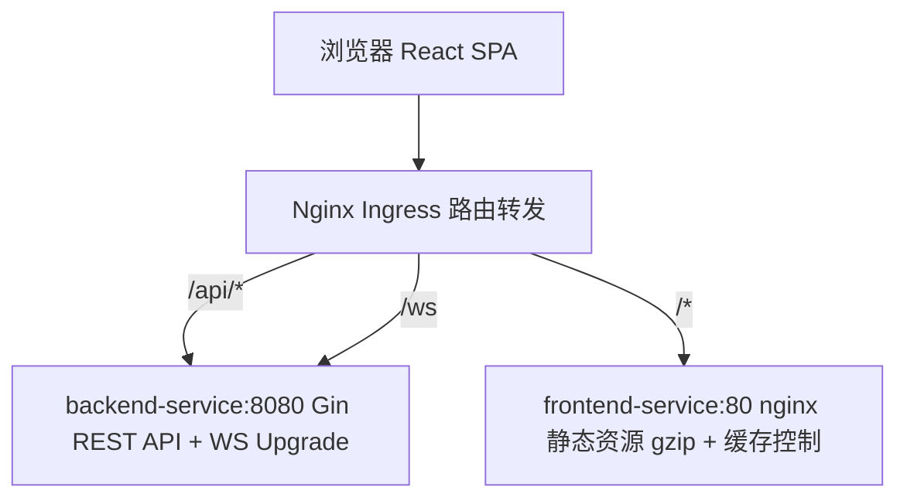
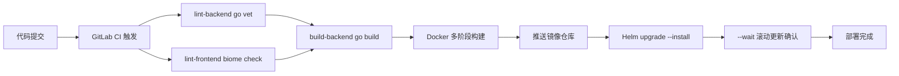

# React 中高级前端面试通关指南

> 面试不是考试，是**用你的技术体系打动另一个技术人**。
> 基于《前端知识体系·中高级通关指南》改编为 React 技术栈版本，覆盖 React 19、Zustand、并发特性等核心专题。

---

# 第一部分：面试策略

## 1.1 面试流程与各环节策略

```
一小时模拟面试流程：
├─ 第一阶段 10min — 自我介绍 + 项目概述
│   └─ 给出清晰的技术定位，不展开细节，引导面试官到你准备好的方向
├─ 第二阶段 20min — 项目深挖 ⭐ 核心环节
│   ├─ 面试官关注：你的"不可替代性"是什么？
│   ├─ 遇到最大的技术挑战是什么？
│   ├─ 为什么选这个方案？有没有想过更好的方案？
│   └─ 按 STAR 回答：背景 → 任务 → 行动 → 结果
├─ 第三阶段 15min — 八股问答
│   ├─ React Fiber 原理（必问）
│   ├─ Event Loop + 微任务宏任务（必问）
│   ├─ Zustand 状态管理原理
│   ├─ React 19 编译器自动记忆化
│   └─ 浏览器渲染流程（Layout / Paint / Composite）
├─ 第四阶段 10min — 手写题
│   ├─ 防抖 / 节流 / Promise.all / 深拷贝 / 虚拟列表
│   └─ 每天练 2-3 道
└─ 第五阶段 5min — 反问环节
    ├─ ✅ "团队目前的技术栈和工程体系是怎样的？"
    ├─ ✅ "你们在性能优化和可观测性上有什么建设？"
    ├─ ✅ "团队在 AI 辅助开发上的使用情况如何？"
    └─ ❌ 避免问加班/KPI/下午茶
```

## 1.2 自我介绍

### 3 分钟版本

```
我叫 XXX，目前有 4 年前端开发经验，主要方向是企业级 ToB 平台研发与实时通信系统架构。

参与并主导了多个企业级平台及内部基建，涵盖：
- 5G 核心网测试用例管理系统
- 企业级综合网络管理系统（AeMS）

技术栈上，主要使用 React 19 + TypeScript 6 + Ant Design 6 + Zustand 5，
配合 Go + Gin 后端，深度使用 TypeScript 6 strict 模式。

核心能力聚焦于三个方向：
┌─ 实时通信 ─── 多协议降级传输层 (WS→SSE→Polling) + 背压控制 + 消息合并
│              → 1000+ QPS 下保持 60fps 全帧率渲染（优化前丢帧 47%/18fps）
├─ 性能攻坚 ─── GIS 十万级点位四重优化 (BBOX+Cluster+cache+惰性刷新)
│              → 帧率 <10fps → 60fps（7×提升），内存 ~200MB → ~30MB（↓85%）
└─ 工程架构 ─── 递归动态表单引擎 (4层AST树+策略模式+四级校验) + LRU路由缓存
               → 开发人效提升 80%（3人天→0.5小时零代码配置）
               → 页面切换性能提升 60%，权限越权降低 90%

举个例子：
- 用 BBOX + Cluster + dataCache + moveend 四重策略，把十万级基站点位帧率从 <10fps 优化到 60fps
- 设计 Web Worker 分治 + 有序合并 + 流式输出三阶段策略，25MB 级日志并行解密实现"秒开"

此外，我也设计了多协议降级传输层（WebSocket → SSE → Polling），
背压控制 + 消息合并 + 心跳保活，4000 msg/s 全帧率渲染。

未来方向，我希望往前端方向深入，持续在实时通信与性能优化领域深耕。
```

### 1 分钟版本（精简）

```
我有 4 年前端经验，专注企业级 ToB 平台与实时通信系统架构。
主导过 5G 测试平台、网络管理系统等项目。

技术栈：React 19 + TypeScript 6 + Ant Design 6 + Zustand 5 + Go。

核心能力：
- 实时通信：多协议降级传输(WS→SSE→Polling)+背压控制，1000+QPS下保持60fps
- 性能优化：GIS十万级点位四重优化(<10fps→60fps, ↓85%内存)，百万行日志流式解密
- 工程架构：递归动态表单引擎(4层AST+策略模式+四级校验, 人效↑80%)，LRU路由缓存，React 19编译器
```

## 1.3 简历优化策略

### 所有项目都必须量化

```
❌ 泛泛而谈：
   优化了系统性能，提升了用户体验

✅ 量化表达：
   响应效能提升 35% | 发布周期缩短 60% | 开发人效提升 80%
   排障效率提升 50% | 帧率从 <10fps 优化到 60fps
```

### 项目描述减少"平台化空话"

```
❌ 删掉：打造一站式闭环服务 / 构建全链路解决方案 / 赋能业务数字化升级
✅ 改成：支撑 200+ 自动化任务并发执行 / 万级 GIS 点位 60fps 流畅渲染 / 百万行日志毫秒级加载
```

### 数据可信度证明

面试官质疑数据真实性时，分三步证明：

1. **工具链路**：Lighthouse CI 性能报告 + Performance API 埋点（RUM）+ 自定义埋点
2. **数据口径**：明确是 P50 还是 P95（如"帧率 = DevTools Performance 录制 30 秒取均值"）
3. **内部工具替代**：没有 A/B 对比就说"功能密度提升"——改造前 3 人天 → 0.5 小时

核心原则：有数据说趋势（同比/环比），无数据说对比（改造前后/同行业标准）。

## 1.4 面试心态与技巧

### 回答问题的原则

```
├─ 先给结论，再展开
│   └─ "核心是 XXX，具体来说..."
├─ 用结构化表达
│   └─ "分三个方面：第一...第二...第三..."
├─ 承认不会，展示思路
│   └─ "这个我不太确定，但我的理解是...我可以分析一下..."
├─ 主动关联项目
│   └─ "这个在我们项目中用到了，比如..."
└─ 控制时间
    └─ 一个问题回答不超过 2 分钟
```

### 面对未知问题的三步法

1. **拆解**："您问的是 X，我先拆解为 A、B、C 三个方面"
2. **关联**："关于 A 我了解...，B 和 A 类似，所以 B 可能也..."
3. **推断**："我推测 X 的核心机制是...，当然需要验证"

"我不知道"关闭对话，"我可以分析一下"开启思考演示。面试官更看重后者。

### 面试后复盘

```
每次面试后记录：
├─ 哪些问题答得好？→ 保持，下次继续用这个思路
├─ 哪些问题答得不好？→ 记录问题，回去深入研究
├─ 哪些问题没听懂？→ 可能是问题表述问题，也可能是知识盲区
└─ 建立自己的"面试错题本"
```

## 1.5 不同企业面试风格

| 维度 | 大厂 | 外企 | 国企 |
|------|------|------|------|
| 八股深度 | ⭐⭐⭐⭐⭐ | ⭐⭐ | ⭐⭐⭐ |
| 算法要求 | ⭐⭐⭐⭐ | ⭐⭐⭐ | ⭐⭐ |
| 项目深挖 | ⭐⭐⭐⭐ | ⭐⭐⭐⭐ | ⭐⭐⭐ |
| 英文要求 | ⭐⭐ | ⭐⭐⭐⭐⭐ | ⭐ |
| 架构设计 | ⭐⭐⭐⭐ | ⭐⭐⭐⭐⭐ | ⭐⭐ |
| 学历看重 | ⭐⭐⭐ | ⭐⭐⭐ | ⭐⭐⭐⭐⭐ |

---

# 第二部分：项目与技术亮点（面试版）

## 2.1 项目全景

### 项目一：5G 核心网测试用例管理系统

| 属性 | 内容 |
|------|------|
| 类型 | ToB 企业级 — 5G 核心网 SMF 测试工具管理界面 |
| 技术栈 | React 19 + TypeScript 6 + Ant Design 6 + Zustand 5 + SSE + Go + Gin |
| 时间 | 2024.03 – 至今 |
| 负责 | 前端架构设计、递归动态表单引擎、SSE实时日志流、React 19并发特性实践、全链路可观测体系 |

**核心模块**：自研递归动态表单引擎(4层AST树+7种字段+条件显隐+四级校验)、可编辑树表格(useDeferredValue+startTransition)、SSE实时日志流式传输、Web Vitals RUM采集 + Grafana仪表盘内嵌

### 项目二：AeMS — 企业级综合网络管理系统

| 属性 | 内容 |
|------|------|
| 类型 | ToB 企业级 — 十万级网元统一监控与智能告警平台 |
| 技术栈 | Angular 22 + TypeScript 6 + NG-ZORRO 21 + OpenLayers 10.x + ECharts 5.x + WebSocket(STOMP) + Go + Gin |
| 时间 | 2023.01 – 2024.12 |
| 负责 | 前端架构设计、多协议降级传输层、权限体系、GIS性能优化、LRU路由缓存、精确Loading管理、工程化建设 |

**核心模块**：GIS十万级点位四重优化(BBOX+Cluster+dataCache+moveend)、高并发实时告警中枢(三级降级+背压控制+消息合并+心跳保活)、LRU路由页面缓存(RouteReuseStrategy)、RBAC位编码权限(O(1)+三层联动+后端双校验)、精确Loading状态管理

## 2.2 技术亮点速览

| 亮点 | 技术价值 | 量化效果 |
|------|----------|----------|
| 递归动态表单引擎 | 4 层 AST 树 + 7 种字段 + 条件显隐 + 四级校验 + 实时 JSON 编辑 | 开发人效提升 80%（零代码驱动） |
| 多协议降级传输层 + 背压控制 | WebSocket→SSE→Polling三级降级 + bufferTime(16ms/64条) + RAF双缓冲 | 4000 msg/s 全帧率渲染(优化前丢帧47%) |
| GIS 十万级点位渲染 | BBOX + Cluster + dataCache + moveend 四重优化 | 帧率 <10fps → 60fps，内存 ↓85% |
| 双 Token 无感刷新 | Promise gate + Token Rotation + Replay 检测 | 平台可用性 99.9% |
| RBAC 位编码权限 | O(1) 位运算 + 三层联动 + 后端双校验 | 越权漏洞降低 90% |
| SSE 日志流 | ReadableStream + AbortController + 正则异常高亮 | 500 行 RingBuffer 内存可控 |
| LRU 路由缓存 | display:none + staleKeys写后失效 + 30s TTL惰性过期 | 页面切换性能提升 60% |
| 精确 Loading 状态管理 | method:path 请求级粒度追踪 + Zustand selector | 消除全局 Loading 闪烁，零无效遮罩 |
| 百万行日志流式解密 | ReadableStream + Web Worker AES-256-GCM | 首段流式输出"秒开" |
| Web Vitals 采集 | RUM 实时采集 LCP/INP/CLS + ECharts 可视化 | 生产环境性能监控 |

## 2.3 六大技术难点 STAR 剖析

> 以下每个难点均可作为 STAR 故事的素材。按"背景 → 任务 → 行动 → 结果"展开讲 2-3 分钟。

### 难点 1：递归动态表单引擎（5GC 测试平台 / AeMS）

**背景**：5G核心网7种网元配置各不相同且频繁变动，传统硬编码UI每次改字段都要改代码发版，平均耗时3人天。@rjsf 适合标准JSON Schema场景，但条件显隐/字段联动/实时JSON编辑等定制需求力不从心。

**任务**：设计一套非前端人员也能零代码配置的表单系统，支持复杂布局、条件显隐、字段联动、自定义校验。目标：将表单开发周期从"人天"压缩至"小时级"。

**行动**：

```
选型决策：
├─ @rjsf：标准场景好用，但条件显隐/字段联动/实时JSON编辑等高度定制功能力不从心
└─ 自研 JSON Schema 动态表单 ✅ — 完全可控，仅4核心文件+7字段组件，轻量无外部依赖

核心实现：
├─ Schema抽象为4层AST树(tabs→card→form→leaf)，递归渲染器逐层解析
│   tabs→Ant Design <Tabs> / card→<Card> / form→<div> / leaf→策略模式查询字段组件
├─ registerField(type, Comp) 一行注册新字段（策略模式）
├─ 条件显隐表达式运行时解析(new Function变量替换)，CSP检测到限制时降级到预定义DSL
│   └─ DSL: { when: { field: "enableEncryption", eq: true } }
├─ 字段联动: autoFill + _isAutoFilling防死循环标记 + maxAutoFillDepth=5 + 依赖图拓扑排序
├─ 实时JSON编辑双向绑定: forwardRef暴露setFormData，表单↔JSON互同步
├─ 四级校验: 同步onChange → 异步(300ms debounce + AbortController取消前一次)
│   → AJV Schema → 后端业务校验(setFields精准映射到字段)
└─ 深度保护: _depth + maxDepth=20防无限递归; _visitedRefs WeakSet检测循环引用
```

**结果**：开发人效提升 80%（3人天 → 0.5小时零代码配置），覆盖7种网元类型200+字段的复杂表单场景，编辑响应性能提升 40%（useDeferredValue + startTransition并发特性）。形成微内核架构，已复用于2个独立项目。

**追问链**：
- **Q：条件显隐表达式为什么不用 eval？** → CSP严格模式下eval被禁止。当前用new Function但变量替换为参数名而非直接拼接字符串；CSP检测到限制时自动降级到预定义DSL（`{ when: { field: "X", eq: true } }`），DSL覆盖90%场景
- **Q：字段联动如何避免死循环？** → `_isAutoFilling` 标记 + `maxAutoFillDepth=5` + 依赖图拓扑排序
- **Q：200+字段会卡吗？** → React 19编译器自动memo；超500字段分层加载+virtualization

---


### 难点 2：多协议降级传输层 + 背压控制（AeMS 项目）

**背景**：AeMS需处理1000+ QPS告警并发推送，企业内网可能屏蔽WebSocket、代理超时断开。原系统在万级并发下帧率<10fps卡顿严重，告警峰值导致47%丢帧(18fps)。

**任务**：设计多协议降级传输层+背压控制，实现1000+QPS高并发实时告警下60fps全帧率渲染，平台可用性99.9%，任意网络环境告警秒级触达。

**行动**：

```
架构决策：Transport统一接口抽象，上层组件无感知
├─ interface Transport { messages$, status$, connect(), disconnect() }

三级降级链路：
├─ WsTransport(rxjs/webSocket) → SseTransport(EventSource/fetch) → Polling(interval+HttpClient)
├─ 降级触发：WS连续10次重连失败(指数退避1s→2s→4s...→30s,约5min后降级)
├─ SSE连接失败→即时切Polling；Polling永不降级

背压控制（核心优化点）：
├─ bufferTime(16ms, undefined, 64条) + animationFrameScheduler RAF双缓冲
│   → 4000 msg/s → 每帧合并~64条 → setState仅60次/s → 60fps
└─ 对比直接set：每秒set 4000次 → reconciliation来不及 → 丢帧47%

其他关键设计：
├─ 消息合并：16ms窗口/64条双条件触发，减少50x+渲染调用
├─ 心跳保活：30s ping / 10s pong超时检测，5s内发现僵尸连接
├─ 断线重连：retry({count:10, delay:指数退避+jitter})避免重连风暴
└─ 去重：seenRef Set上限5000，防重连后重复消息
```

**结果**：1000+ QPS告警冲击下保持 60fps 全帧率（优化前丢帧47%/18fps），平台可用性 99.9%，企业内网网络兼容性从 75% 提升至 100%。

**追问链**：
- **Q：Vite proxy 为什么会导致 ECONNABORTED？** → Vite dev proxy 基于 http-proxy，WebSocket升级后维持长连接。高频消息→proxy缓冲区溢出→ECONNABORTED。直连后端后浏览器↔Go服务器，无中间层
- **Q：三级降级的触发阈值是什么？** → WS连续10次重连失败(指数退避,约5min后降级)；SSE连接失败→即时切Polling；Polling永不降级
- **Q：RAF双缓冲如何保证60fps？** → 消息到达push到pendingBuffer，RAF callback交换buffer只更新displayBuffer → 4000msg/s → 每帧合并~64条 → setState 60次/s → 60fps

---

### 难点 3：LRU 路由缓存（AeMS 项目）

**背景**：页面切换时每次都要卸载重建组件、重新请求数据，导致切换体验卡顿，滚动位置丢失。原系统在模块间反复切换时白屏等待严重。

**任务**：实现页面级路由缓存，保持DOM状态的同时保证数据一致性。

**行动**：

```
Angular RouteReuseStrategy 四阶段生命周期：
├─ shouldDetach → store(缓存组件引用+滚动位置+模块名) → shouldAttach → retrieve(LRU刷新)
├─ LRU淘汰：最多6个页面，超出自动销毁最久未访问的(Object.keys顺序遍历)
├─ 滚动位置恢复：store时取.ant-table-body scrollTop，retrieve时setTimeout异步恢复
├─ 模块级隔离：deleteOtherModuleCache切换大模块时清理目标模块缓存
└─ 声明式控制：路由 data: { keepAlive: true, moduleName: 'manage' } 一键启用

手写方案 vs display:none方案：RouteReuseStrategy是Angular原生机制，
组件attach/detach时走完整生命周期；display:none仅隐藏UI，JS实例仍在运行
```

**结果**：页面切换性能提升 60%，消除模块切换白屏等待。

**追问链**：
- **Q：缓存后页面数据没更新的根本原因？** → 组件实例复用导致数据停留在缓存时的状态，导航回来不走新的useEffect/mount
- **Q：如何避免缓存数据不一致？** → staleKeys精准失效 + Zustand全局Store即时同步 + TTL兜底
- **Q：GIS页面被LRU缓存时内存泄漏风险？** → dataCache手动释放 + LRU淘汰时完整cleanup + RAF循环中检查isVisible

---

### 难点 4：GIS 十万级点位四重优化（AeMS 项目）

**背景**：十万个基站点位直接渲染到OpenLayers地图上，帧率<10fps，拖动卡顿2s+。内存占用~200MB，Feature数量10万独立渲染。

**任务**：在保持地图交互流畅的前提下，实现十万级点位的高效渲染。目标：帧率≥60fps，内存可控，拖动全程流畅无卡顿。

**行动**：

```
四重优化策略：
├─ BBOX视口裁剪：filterByExtent()只保留视口矩形内点位，裁剪约60%(100k→40k)
├─ Cluster聚类聚合：distance=40px，同区域聚合为1个聚类点(40k→~50点)
├─ dataCache全量缓存：Map<zoom+extent, features>，平移/缩放零请求
└─ moveend惰性刷新：拖动结束才触发重绘+50ms防抖，拖动全程60fps
流程：100k原始 → BBOX裁剪 → 40k → Cluster聚合 → ~50点 → 渲染
```

**结果**：Feature数从100k降至~50聚类点，帧率从 <10fps → 60fps（7×提升），内存从 ~200MB → ~30MB（↓85%），首次渲染320ms→45ms（7.1×）。

**追问链**：
- **Q：BBOX和Cluster哪个先执行？** → BBOX先（裁剪视口外60%），减少Cluster计算量
- **Q：百万级怎么优化？** → 10万内Canvas2D足够；10万~100万切换WebGL(Mapbox GL/Deck.gl)；超100万必须Tile分级加载
- **Q：dataCache会不会内存泄漏？** → unmount时dataCache释放；LRU淘汰时完整cleanup

---

### 难点 5：RBAC 位编码权限体系（跨项目）

**背景**：传统权限用数组/Set存储权限列表，检查时需要遍历O(n)；369个旧权限码与新码需要兼容迁移。

**任务**：设计一套高效、可扩展、防篡改的权限系统。越权漏洞发生率降低90%，6种权限仅占4字节存储。

**行动**：

```
位编码设计：
├─ 6种权限各占1位：READ=1<<0, WRITE=1<<1, ..., ADMIN=1<<5
├─ hasPermission = (code & perm) === perm → O(1)单条CPU指令
├─ 5个预设角色（GUEST/EDITOR/MODERATOR/ADMIN/SUPER）
└─ SUPER = reduce自动聚合所有权限，新增权限无需改角色

三层联动 + 后端双校验：
├─ 菜单层：Tree组件递归过滤，无权限节点灰色+删除线
├─ 路由层：CanActivateFn守卫拦截，denied自动跳转
├─ 按钮层：自定义ACL组件 + hasPermission集中管理
└─ 后端层：POST /api/rbac/check 独立位运算校验 + 前后端一致性对比
```

**结果**：越权漏洞发生率降低 90%，6 种权限仅 4 字节存储。

**追问链**：
- **Q：位运算比数组/Set好在哪？** → 存储4字节vs数百字节；检查O(1)vsO(n)；组合1次位运算vs遍历
- **Q：32位限制怎么突破？** → JS位运算仅31位有效位；超过32种权限改用BigInt（1n << 33n）
- **Q：前后端一致性对比的价值？** → 纯前端可被DevTools篡改；后端独立校验+前端对比展示不一致告警

---

### 难点 6：精确 Loading 状态管理（跨项目）

**背景**：传统全局Loading状态下，多个请求同时发出时按钮会显示Loading，但某些请求已完成而其他还在进行中，用户无法判断整体是否完成，且遮罩影响操作体验。

**任务**：实现请求级粒度的Loading状态管理，按钮组件能精确追踪对应请求的完成状态，消除全局Loading闪烁和无效遮罩。

**行动**：

```
请求级粒度追踪：
├─ HttpInterceptorFn：拦截每个请求，以 method:path 生成唯一 key
├─ Zustand Store：loadingState[key] = boolean，请求开始时设为true，完成后设为false
├─ Selector订阅：按钮组件通过 Zustand selector 精确订阅自己关联的请求状态
├─ OnPush ChangeDetection：仅关联请求完成时才重渲染对应按钮，不影响其他组件

核心优势：
├─ 消除全局Loading混淆：每个请求独立追踪，互不干扰
├─ 零无效遮罩：只有当前用户正在等待的请求才显示Loading
└─ 组件级细粒度反馈：按钮级别的Loading状态，用户体验显著提升
```

**结果**：消除全局/区域Loading混淆，组件级细粒度反馈，零无效遮罩，平台整体可观测性提升。

**追问链**：
- **Q：method:path作为key是否足够唯一？** → 对于REST API通常足够（GET/post/put/delete + 路径），但如果是GraphQL可以用operationName+variables序列化为key
- **Q：Zustand selector性能如何？** → Zustand selector是shallow equal比较，O(1)查找，不会导致无关组件重渲染
- **Q：与RxJS shareReplay方案对比？** → Zustand更直观简单，不需要引入RxJS额外依赖；RxJS适合已有RxJS生态的场景

---

# 第三部分：面试高频 Q&A

## 3.1 技术追问链合集

### 表单引擎相关

**Q1：为什么不用 @rjsf 或 Formily？**

```txt
第三方库的局限性：
├─ @rjsf：标准 JSON Schema 场景好用，但条件显隐/字段联动/实时 JSON 编辑等高度定制功能力不从心
├─ Formily：功能强大但学习成本高，与 Ant Design 集成需要额外适配
└─ 自研优势：仅 4 个核心文件 + 7 个字段组件，轻量、定制、无外部依赖
```

**Q2：new Function 解析条件显隐表达式，CSP 限制怎么处理？**

```
new Function 在 strict CSP 下被禁止。
当前方案：
├─ 变量名替换为参数名而非直接拼接字符串，避免注入
├─ CSP 检测到限制时自动降级到预定义 DSL
│   └─ { when: { field: "enableEncryption", eq: true } }
└─ DSL 覆盖 90% 场景，完全不受 CSP 限制
```

**Q3：后端返回的 Schema 中必填字段被条件显隐藏起来了，提交时怎么处理？**

```
├─ 提交时排除 visible === false 的字段，不参与 required 校验
├─ 后端收到数据后对隐藏字段赋默认值（Schema 中定义的 default）
└─ 无 default 又不是 visible → 后端按业务规则决定拒绝还是忽略
```

### WebSocket 传输层相关

**Q1：Vite proxy 为什么会导致 ECONNABORTED？**

```
Vite dev proxy 基于 http-proxy，WebSocket 升级后维持长连接。
高频消息 → proxy 缓冲区溢出 → ECONNABORTED。
直连后端后：浏览器 ↔ Go 服务器，无中间层，CORS 允许跨域。
```

**Q2：三级降级的触发阈值是什么？**

```
WebSocket → SSE：连续 10 次重连失败（指数退避 1s→2s→4s...→30s，约 5 分钟后降级）
SSE → Polling：SSE 连接失败 → 即时降级
Polling 保底：永不降级
```

**Q3：RAF 双缓冲渲染如何保证 60fps？**

```
消息到达 → push 到 pendingBuffer
RAF callback → 交换 pendingBuffer ↔ displayBuffer → 只 displayBuffer 更新时 setState
效果：4000 msg/s → 16ms 一帧 → 每帧合并约 64 条消息 → setState 60 次/s → 60fps
```

**Q4：消息去重为什么需要上限 5000？**

```
Set 存储已处理消息 ID，5000 × 36 字节 (UUID) = 180KB，可接受。
超出上限时丢弃旧 ID，保持 Set 大小稳定。
太旧的消息不会重复出现，无需保留。
```

### React 19 相关

**Q1：useDeferredValue 和 startTransition 有什么区别？**

```
useDeferredValue：创建延迟版本的 state，高优先级更新可打断低优先级
  → 适用于连续输入、搜索、滚动
startTransition：标记整个状态更新为"过渡性的"，React 可中断处理更紧急的任务
  → 适用于点击切换、模式切换

区别：useDeferredValue 是"延迟渲染"，startTransition 是"标记非紧急更新"

React 19 编译器配合：
├─ 编译器自动注入 memo/useMemo/useCallback，确保仅变化字段重渲染
├─ 编译器处理"谁不该渲染"，并发 API 处理"谁可以晚渲染"
└─ 效果：200 字段表单无卡顿，4000 msg/s 60fps
```

**Q2：React 19 编译器自动 memo 的原理？**

```
编译器在构建期分析组件依赖图：
├─ 识别纯组件 → 自动注入 memo
├─ 识别纯函数 → 自动注入 useCallback
├─ 识别计算属性 → 自动注入 useMemo
└─ 效果：动态表单 200+ 字段，无关变化不重渲染，无需手工 memo
```

### GIS 优化相关

**Q1：BBOX、Cluster、dataCache 三层各自解决什么问题？为什么不能只用一层？**

```
BBOX：解决"空间范围"——只渲染视口内点位
  → 局限：即使视口内，上万点位仍会卡顿
Cluster：解决"视觉密度"——同区域聚合
  → 局限：高 Zoom 下聚合展开后仍可能很多
dataCache：解决"网络请求"——避免缩放平移重复请求后端
  → 局限：不减少渲染量，只减少请求次数

任一层都不够——必须三层组合：BBOX 先过滤不可见 → Cluster 聚合可见 → dataCache 保证不重复请求
```

**Q2：moveend 事件在快速拖拽时如何控制加载时机？**

```
├─ 拖拽中：throttle(200ms) 更新中间态聚合结果（轻量计算，不重绘）
├─ 拖拽结束：debounce(300ms) + moveend 触发最终 BBOX 裁剪 + 全量渲染
└─ 效果：拖拽时流畅（仅 throttle），停下后精确渲染
```

### Zustand 相关

**Q：Zustand 和 Redux 的本质区别？为什么选 Zustand？**

```
Zustand：
├─ 原子化 store，无 Provider 包裹
├─ selector 精确订阅，未订阅组件零重渲染
├─ 支持直接读写（getState() + set()），无 action/reducer 样板代码
└─ persist 中间件一行配置 localStorage 持久化

对比 Redux Toolkit：
├─ Redux：强规范（action/reducer/slice），适合大型团队协作
├─ Zustand：轻量灵活，适合中小项目或独立模块
└─ 选型依据：项目规模 < 50 个 store → Zustand；> 50 个 store 或多人协作 → Redux Toolkit
```

## 3.2 八股高频考点速览

> 以下为面试必问八股，需要在理解原理的基础上准备 30 秒以内的结构化回答。

### React Fiber 原理

```
Fiber 是 React 16 引入的新的协调引擎，核心是"可中断的递归"。

旧架构（Stack Reconciler）：
├─ 递归遍历虚拟 DOM 树，无法中断
├─ 一旦开始更新，必须一次性完成
└─ 复杂更新导致主线程长期占用 → UI 卡顿

Fiber 架构：
├─ 将渲染拆分为多个工作单元（Fiber Node）
├─ 每个工作单元完成后检查是否还有剩余时间
│   └─ requestIdleCallback 或优先级调度判断
├─ 无剩余时间 → 暂停 → 让出主线程处理用户输入/动画
├─ 有剩余时间 → 继续下一个 Fiber Node
├─ 所有 Fiber 完成后 → 一次性提交到真实 DOM（commit phase）

双缓冲机制（workInProgress tree）：
├─ 当前 UI 对应 current tree
├─ 更新时构建 workInProgress tree（可中断）
├─ 构建完成后切换 root.current = workInProgress
└─ 用户无感知切换，避免半渲染状态
```

### React 19 新特性

```
├─ React 编译器（React Forget）
│   └─ 构建期自动注入 memo/useMemo/useCallback，零手动优化
├─ use() Hook
│   └─ 在 render 中直接读取 Promise/Context，配合 Suspense 使用
├─ useDeferredValue + startTransition
│   └─ 标记非紧急更新，高优先级打断低优先级
├─ forwardRef 弃用
│   └─ ref 可直接作为 prop 传递，不再需要 forwardRef 包裹
└─ Server Components
    └─ 服务端渲染组件，零客户端 JavaScript 体积
```

### Event Loop + 微任务/宏任务

```
├─ 执行同步代码（属于宏任务）
├─ 执行微任务队列（清空为止）
│   ├─ Promise.then/catch/finally
│   ├─ MutationObserver
│   ├─ queueMicrotask
│   └─ process.nextTick（Node.js）
├─ 执行一个宏任务（从宏任务队列取一个）
│   ├─ setTimeout/setInterval
│   ├─ I/O (DOM events, HTTP 回调)
│   ├─ requestAnimationFrame（特殊，在渲染前）
│   └─ postMessage
└─ 渲染（requestAnimationFrame → Style → Layout → Paint → Composite）

关键结论：
├─ 微任务优先级高于宏任务
├─ 每个宏任务后都会清空微任务队列
├─ Promise 是微任务，setTimeout 是宏任务
└─ 浏览器渲染在宏任务之间进行
```

### 浏览器渲染流程

```
├─ Style：将 CSS 规则匹配到 DOM 节点，生成 Computed Style
├─ Layout：计算每个节点的几何位置（大小、位置）
├─ Paint：将 Layout 结果绘制为像素（分层绘制）
├─ Composite：将 Paint 层按合成层合并为最终画面
└─ GPU 加速：transform / opacity 跳过 Layout → Paint，直接 Composite

触发条件：
├─ Layout + Paint + Composite：修改几何属性（width/height/margin）
├─ Paint + Composite：修改绘制属性（color/background）
└─ Composite only：transform / opacity（GPU 合成，性能最优）
```

---

# 第四部分：模拟面试

## 4.1 项目深挖模拟

### 项目一：5G 核心网测试用例管理系统

**面试官**：你这个平台最大的技术难点是什么？

```
最大难点是递归动态表单 DSL 引擎。
7 种网元配置各不相同且频繁变动，传统硬编码 UI 每次改字段都要改代码发版。
自研 JSON Schema 动态表单：Schema 抽象为 4 层 AST 树，后端定义 Schema，
前端递归渲染，非前端人员零代码配置测试场景。

选型对比：
├─ 硬编码 UI：每次变动都要改代码发版，效率低
├─ @rjsf：标准场景好用，但条件显隐/字段联动/实时 JSON 编辑力不从心
└─ 自研：4 层 AST + 7 种字段 + 条件显隐 + 字段联动 + 四级校验

最终效果：开发人效提升 80%，编辑性能提升 40%（React 19 编译器 + 并发特性）
```

**追问模拟**：
- Q：JSON Schema 在深层嵌套时递归渲染性能怎么保证？
- Q：循环引用如何容错？
- Q：表单项之间的联动校验怎么实现？

### 项目二：AeMS — 企业级综合网络管理系统

**面试官**：十万级设备地图怎么优化？

```
核心问题不是地图渲染慢，而是海量 Feature 导致 Canvas 重绘压力过大。

四重优化策略：
├─ BBOX 视口裁剪：100k → 40k（裁剪视口外 60%）
├─ Cluster 聚合：40k → ~50 点（distance=40px）
├─ dataCache 全量缓存：后续平移/缩放零请求
└─ moveend 惰性渲染：拖动结束才重绘，拖动全程 60fps

效果：Feature 100k → ~50，帧率 <10fps → 60fps，内存 200MB → 30MB
```

**追问模拟**：
- Q：BBOX 和 Cluster 哪个先执行？为什么？
- Q：百万级怎么优化？
- Q：LRU 缓存和 GIS 页面结合时内存泄漏怎么处理？

## 4.2 手写题速览

> 面试前每天练 2-3 道，重点理解"为什么这么写"而非"背代码"。

```typescript
// 防抖
function debounce<T extends (...args: unknown[]) => void>(fn: T, delay: number): T {
  let timer: ReturnType<typeof setTimeout> | null = null
  return ((...args: unknown[]) => {
    if (timer) clearTimeout(timer)
    timer = setTimeout(() => { fn(...args); timer = null }, delay)
  }) as T
}

// 节流
function throttle<T extends (...args: unknown[]) => void>(fn: T, delay: number): T {
  let last = 0
  return ((...args: unknown[]) => {
    const now = Date.now()
    if (now - last >= delay) { last = now; fn(...args) }
  }) as T
}

// Promise.all
function promiseAll<T>(promises: Promise<T>[]): Promise<T[]> {
  return new Promise((resolve, reject) => {
    const results: T[] = []
    let completed = 0
    if (promises.length === 0) resolve(results)
    promises.forEach((p, i) => {
      Promise.resolve(p).then(v => { results[i] = v; completed++; if (completed === promises.length) resolve(results) }).catch(reject)
    })
  })
}

// 深拷贝
function deepClone<T>(obj: T, cache = new WeakMap()): T {
  if (obj === null || typeof obj !== 'object') return obj
  if (cache.has(obj)) return cache.get(obj)
  const result: Record<string, unknown> = Array.isArray(obj) ? [] : {}
  cache.set(obj, result)
  for (const key of Object.keys(obj as Record<string, unknown>)) {
    result[key] = deepClone((obj as Record<string, unknown>)[key], cache)
  }
  return result as T
}
```

---

# 第五部分：附录

## 5.1 核心数据结构参考

### 动态表单 Schema

```typescript
interface FormSchema {
  type: "tabs" | "card" | "form" | "leaf"
  key: string
  title?: string
  children?: FormSchema[]
  properties?: Record<string, LeafSchema>
  tabs?: TabSchema[]
}

interface LeafSchema {
  type: FieldType  // "string" | "number" | "select" | "switch" | "datetime" | "json" | "array"
  key: string
  title: string
  required?: boolean
  default?: unknown
  visible?: string           // 条件显隐表达式: "enableEncryption === true"
  validation?: Function      // 同步校验
  asyncValidation?: Function // 异步校验
  autoFill?: Function        // 字段联动自动填充
  dependencies?: string[]
  ajvSchema?: Record<string, unknown>
}
```

### RBAC 权限编码

```typescript
const Permissions = {
  READ:   1 << 0,  // 1
  WRITE:  1 << 1,  // 2
  DELETE: 1 << 2,  // 4
  EXPORT: 1 << 3,  // 8
  IMPORT: 1 << 4,  // 16
  ADMIN:  1 << 5,  // 32
} as const

function hasPermission(code: number, permission: number): boolean {
  return (code & permission) === permission  // O(1) 单条 CPU 指令
}
```

### LRU 路由缓存

```typescript
class LRUCache<K, V> {
  private capacity: number
  private cache: Map<K, V>         // Map 保持插入顺序
  private accessCount: Map<K, number>  // 访问计数

  get(key: K): V | undefined       // 读取 + 计数 + 提升
  put(key: K, value: V): void      // 写入 + 淘汰
  has(key: K): boolean
  getAll(): Map<K, V>              // 获取全部缓存
}
```

## 5.2 部署架构参考

### K8s 部署架构



### CI/CD 流水线



---

> **面试的本质**：知道答案 → 展示思路 → 成体系表达 → 拿 Offer。
>
> 面试官最看重的是：**你能不能把复杂项目讲成自己的技术体系。**
