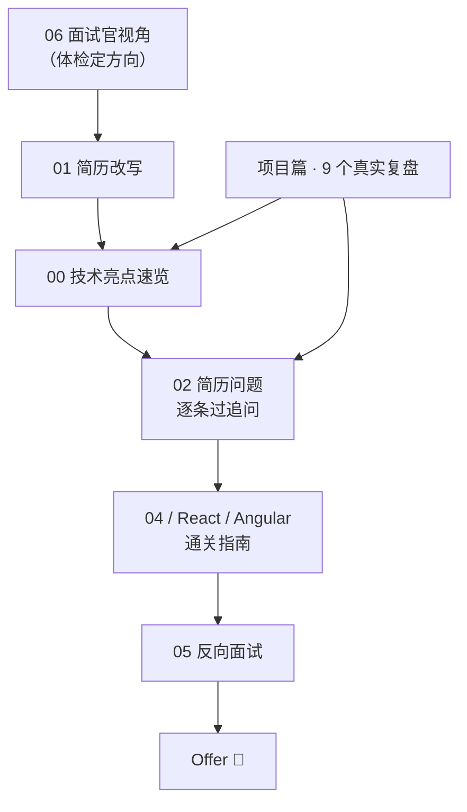

# 📘 S4 面试冲刺 · 阶段总纲

> **版本**：v2.0（2026-10-10 体系化重构）｜ **内容**：9 个主篇 + 9 个项目复盘篇
> **适用对象**：① 已进入投递/面试流程的求职者（本仓库主要读者）；② 想用「面试官视角」反向检验自己技术体系的人
> **维护原则**：**版本事实联网核验**（见第 6 节）、**每篇都有「适用阶段 + 核心要点」与「✅ 行动清单」**、**技术栈口径与仓库一致（Bun）**

---

## 0. 四种用法，按需进入

| 你的处境 | 建议路径 |
|----------|----------|
| **还有 2 周（系统冲刺）** | 06 面试官视角（做体检定方向）→ 01 简历改写 → 00 技术亮点 → 02 简历问题逐条过 → 04/React/Angular 通关指南 → 05 反向面试 |
| **只剩 3 天（快速冲刺）** | 04 或对应框架的通关指南 → 00 亮点速览 → 05 反向提问清单 → 06 自测清单打分 |
| **临面试 1 晚** | 00 亮点速览（30 分钟）+ React/Angular 指南附录 + 05 的 5 道被反问題 + 各篇行动清单打勾 |
| **面完复盘 / 长期建设** | 06 复盘 → 03（跨赛道）→ 项目篇（补真实项目细节）→ 回到 S1~S3 补短板 |

---

## 1. 阅读标记

| 标记 | 含义 |
|------|------|
| 🔥 | 高频（这类问题/环节几乎必遇到） |
| 📌 | 常考（50%~80% 会遇到） |
| 📖 | 了解即可 |
| ⭐ ~ ⭐⭐⭐⭐⭐ | 题目难度：⭐⭐ 以下必会，⭐⭐⭐ 进阶，⭐⭐⭐⭐+ 专家级 |
| 💡 记忆关键词 | 面试前 30 秒快速回忆 |
| ⚠️ 常见误区 | 最容易踩坑/被扣分的地方 |
| 📝 一句话总结 | 组织语言的模板 |
| ✅ 行动清单 | 每篇末尾可勾选的落地动作（本阶段的特色） |

---

## 2. 内容定位与冲刺地图

| 篇 | 文件 | 定位 | 适用阶段 | 建议用时 |
|----|------|------|----------|----------|
| 00 | [面试技术亮点汇总](./00-面试技术亮点汇总.md) | 15 大技术亮点速览与架构图 | 面试前 30 分钟速览 | 30 min |
| 01 | [简历](./01-简历.md) | 可复用的简历模板与写法约束 | 投递前 1~3 天 | 1 h |
| 02 | [简历问题](./02-简历问题.md) | 简历每句话会被怎么追问（9 大部分） | 准备期主力 | 1.5 天 |
| 03 | [ToC 转型面试策略](./03-ToC转型面试策略.md) | ToB → ToC 跨赛道的话术与证据重构 | 跨赛道投递 | 2 h |
| 04 | [ToB 前端可视化通关指南](./04-ToB前端可视化面试通关指南.md) | 选型 / 性能 / 架构 / 反问的完整攻防 | 可视化·GIS·BI 岗 | 3 h |
| 05 | [反向面试](./05-反向面试.md) | 反问清单 + 5 道「被反问」题 | 每轮最后 5 分钟 | 1 h |
| 06 | [面试官视角·22 场复盘](./06-面试官视角-22场技术面复盘.md) | 达标线、翻车现场、追问链、能力自检 | 第一站 / 最后一站 | 1 h |
| React | [React 中高级通关指南](./React-中高级前端面试通关指南.md) | 策略 + STAR + 追问链 + 手写题 | React 岗冲刺 | 0.5~1 天 |
| Angular | [Angular 中高级通关指南](./Angular-中高级前端面试通关指南.md) | 同上（Angular 22 / RxJS / NgRx / Signals） | Angular 岗冲刺 | 0.5~1 天 |



---

## 3. 项目深度复盘（9 篇）

> 项目篇是「STAR 素材库」：面试前挑 2~3 个与目标岗位最相关的项目，按「痛点 → 方案 → 量化结果」复述。

| 项目 | 技术看点 | 适合岗位 |
|------|----------|----------|
| [5G核心网测试用例管理系统](./项目/5G核心网测试用例管理系统.md) | React 19 动态表单、SSE 实时日志 | React / 复杂表单 |
| [AeMS 企业级综合网络管理系统](./项目/AeMS企业级综合网络管理系统.md) | Angular GIS 渲染、WebSocket 告警 | Angular / GIS / 实时 |
| [GNB-UI 企业级5G网元管理系统](./项目/GNB-UI企业级5G网元管理系统.md) | Angular 22、Bun 1.4 | Angular / 工程化 |
| [FMS-UI 企业级融合管理系统](./项目/FMS-UI企业级融合管理系统.md) | 企业级融合管理系统前端深度分析 | 中后台 / 架构 |
| [LI-OAM 网元运维与数据管理系统](./项目/LI-OAM%20网元运维与数据管理系统.md) | Web Worker 解密、审计追踪 | 性能 / 安全 |
| [Axyom ACL & HTTP Decorator](./项目/Axyom%20ACL%20%26%20HTTP%20Decorator%20Library.md) | Angular 装饰器、ACL 权限 | Angular / 权限体系 |
| [Axyom Form](./项目/Axyom-Form%20项目技术分析.md) | 动态表单引擎技术分析 | 组件库 / 表单引擎 |
| [Axyom Table](./项目/Axyom-Table%20项目技术分析.md) | 高性能表格组件技术分析 | 组件库 / 虚拟滚动 |
| [Prometheus+Grafana](./项目/Prometheus+Grafana.md) | 监控体系与可视化 | 监控 / SRE 协作 |

---

## 4. 冲刺路线

### 4.1 两周冲刺

| 天 | 内容 | 产出 |
|----|------|------|
| 第 1 天 | 06 面试官视角 | 能力打分表 + 短板清单（回到 S1~S3 定向补） |
| 第 2~3 天 | 01 简历 + 00 亮点 | 一页简历 + 5 个可讲 3 分钟的亮点 |
| 第 4~7 天 | 02 简历问题（按部分刷） | 每个技术点都能答 + 举出自己的例子 |
| 第 8~10 天 | 04 / React / Angular 通关指南 | STAR 陈述稿 + 追问链对答 |
| 第 11~12 天 | 项目篇（挑 3 个） | 3 个项目的完整 STAR 故事 |
| 第 13 天 | 05 反向面试 + 模拟面试 | 反问清单 + 一次完整模面录音回听 |
| 第 14 天 | 06 自测清单复查 | 低于 3 分的项清零或明确话术 |

### 4.2 三天冲刺

| 天 | 内容 |
|----|------|
| 第 1 天 | 对应框架通关指南 + 00 亮点速览 |
| 第 2 天 | 02 的第五/六部分（八股 + 手写）+ 项目篇挑 2 个 |
| 第 3 天 | 05 反向提问 + 各篇行动清单打勾 |

---

## 5. 面试现场的通用原则（速记）

| 环节 | 原则 |
|------|------|
| 自我介绍 | 背景一句话 + 2 个匹配亮点 + 1 个追问钩子，控制在 60~90 秒 |
| 项目陈述 | 按 STAR：情境 → 任务 → 行动 → 结果，结果必须量化 |
| 不会的题 | 先复述问题 + 说清已知部分 + 给出排查思路，切忌沉默或瞎猜 |
| 被追问到底 | 答到边界时诚实说「这块我没在生产验证过，我的判断是…」 |
| 反向提问 | 按面试官身份挑 3 个：问架构、问工程、问业务，不问福利 |
| 离职/规划 | 只讲「我想要什么」，规划要与目标岗位路径一致 |

---

## 6. 版本与技术栈口径（2026-10-10 联网核验）

> ⚠️ 简历与面试中报版本号是最容易被当场纠偏的细节，以下为核验值。

| 技术 | 当前真实状态 | 备注 |
|------|--------------|------|
| React | **19.3.0** | 本仓库 `^19.2.7` |
| Angular | **22.2.2**（21.x LTS `21.2.25`） | — |
| TypeScript | **7.0.2**（tsgo 主线） | **Angular 22 只支持 `>=6.0 <6.1`** |
| Vite | **8.3.4** | 本仓库 `^8.0.16` |
| Rolldown | **1.2.13** | Vite 生产底座 |
| Bun | **1.4.3** | 本仓库 `packageManager: bun@1.4.2` |
| Biome | **2.5.15** | 本仓库唯一 linter/formatter |
| antd | **6.6.5** | — |
| NG-ZORRO | **22.1.1** | 配 Angular 22 |
| Zustand | **5.0.15** | — |
| ECharts | **6.1.0** | — |
| OpenLayers | **10.11.0** | 简历旧值 10.9 已更新 |
| React Compiler | **1.0.0 GA** | 可写「已 GA」 |
| Go | **1.27.2** | 后端栈 |

## 项目与技术栈口径（与仓库一致）

本阶段列出的项目复盘以本仓库 `interview-demo` 的真实实现为参照：
**Bun workspace + Turborepo + Vite 8 + React 19 + TypeScript 7 + Biome**（包管理器为 **Bun**，不是 pnpm）。

```bash
bun install        # 从仓库根目录安装所有 workspace
bun run dev        # 并行启动 frontend(:5173) / ai-demo(:5175) / interview-docs(:5000)
bun run build      # 全量构建
```

---

## 7. 阶段行动清单（出发前逐项打勾）

- [ ] 简历控制在一页，每条经历都能讲 3 分钟 + 扛住 2 轮追问
- [ ] 简历中的版本号与第 6 节核验值一致
- [ ] 准备了 5 个技术亮点，每个都有量化结果
- [ ] 有 3 个完整的项目 STAR 故事（背景 → 判断 → 行动 → 结果）
- [ ] 八股题能举出自己的例子，而不是背定义
- [ ] 手写题限时完成过（防抖/节流/深拷贝/Promise/并发调度）
- [ ] 反向提问按面试官身份各备 3 个问题
- [ ] 用 06 的自测清单打过分，低于 3 分的项已处理
- [ ] 做过至少一次完整模拟面试并回听录音

---

## 8. 与其他阶段的衔接

- **前置**：[S1 基础夯实](../S1-基础夯实/)、[S2 框架深入](../S2-框架深入/)、[S3 进阶提升](../S3-进阶提升/)（S4 是它们的「输出层」）
- **横向**：[S5-AI](../S5-AI/)（AI 辅助编码是新题型，02 第七部分已覆盖）、[S6-Go](../S6-Go/)
- **反向用法**：面试复盘后把短板映射回 S1~S3 的具体篇目，形成「补齐 → 再冲刺」的闭环
