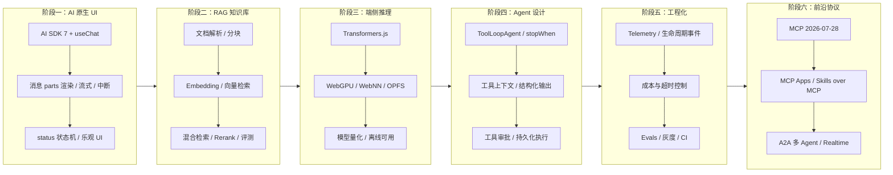

# 前端转型 Agent 路线图

> 从零到一构建生产级 AI Agent 应用的学习路径。

---

## 一句话理解

| 前端传统开发 | AI Agent 开发 |
|---|---|
| 用户点击 → 代码执行 → UI 更新 | 用户输入 → LLM 推理 + 工具调用 → 结构化输出 |
| 路由定义页面跳转 | Prompt + Context 定义"智能行为" |
| API 调用后端 | Agent 编排 LLM + 工具 + 记忆 |
| CSS 控制视觉 | Architecture 控制智能边界 |

**核心公式**：`Agent = LLM（大脑）+ Tools（手脚）+ Memory（记忆）+ Planning（规划）`

2026 年的补充：还缺一层 **Context Engineering（上下文工程）** —— 决定「什么信息在什么时刻进入模型视野」，它和 Prompt 一样是工程产物，而不是随手拼接的字符串。

---

## 六阶段学习路径

### 路径总览



### 每阶段详情

| 阶段 | 主题 | 时间投入 | 产出物 |
|------|------|:--------:|--------|
| **① AI 原生 UI** | AI SDK 7、useChat、流式渲染 | 1-2 周 | 生产级流式聊天应用 |
| **② RAG 知识库** | 文档分块、Embedding、向量检索 | 2-3 周 | 支持 PDF/Word 的知识问答系统 |
| **③ 端侧推理** | Transformers.js、WebGPU | 2 周 | 浏览器内可运行的 AI 模型 |
| **④ Agent 设计** | 工具调用、停止条件、审批 | 3-4 周 | 带审批与持久化的自主 Agent |
| **⑤ 工程化** | 可观测性、评估、成本控制 | 持续 | 可观测、可评估的生产系统 |
| **⑥ 前沿协议** | MCP、A2A、多 Agent | 持续 | MCP/A2A 多 Agent 系统 |

---

## 技术基线

- **AI SDK 7**（2026-06 发布）
- **MCP 规范 2026-07-28**
- **A2A（Linux Foundation）**

本仓库 `apps/ai-demo` 实际依赖 `ai@^7` + `@ai-sdk/react@^4`，文档示例与项目代码同版本。

---

## 与现有项目的映射

| 文档章节 | 代码实现位置 | 技术点 |
|---|---|---|
| AI 原生 UI | `apps/ai-demo/src/components/Chat.tsx` | Ant Design X + Zustand |
| AI SDK 集成 | `apps/ai-demo/src/components/AISDKDemo.tsx` | streamText + 流式 |
| RAG 知识库 | `backend/internal/knowledge/` | 文档加载/分块/嵌入/检索 |
| Agent | `backend/internal/agent/` | ReAct + Function Calling |
| 对话记忆 | `backend/internal/memory/` | 多轮会话记忆管理 |
| 流式通信 | `backend/internal/chat/` + `sse/` | 流式响应 + 日志流 |

---

## AI SDK 7 迁移要点

| 旧写法（AI SDK 4 及更早） | AI SDK 7 写法 |
|---|---|
| `useChat({ api })` | `useChat({ transport: new DefaultChatTransport({ api }) })` |
| `input / handleInputChange / handleSubmit` | 自己用 `useState` 管输入，`sendMessage({ text })` 发送 |
| `isLoading` | `status`：`'ready' \| 'submitted' \| 'streaming' \| 'error'` |
| `message.content` | `message.parts`（`text` / `tool-call` / `tool-result` / `reasoning` / `source`） |
| `toDataStreamResponse()` | `toUIMessageStreamResponse()` |
| `convertToCoreMessages()` | `convertToModelMessages()` |

---

## 术语速查表

| AI 术语 | 前端类比 | 理解方式 |
|---|---|---|
| **Token** | DOM 节点 | LLM 处理文本的最小单位 |
| **Context Window** | Virtual Scroll Window | 模型一次能"看到"的最大 Token 数 |
| **Embedding** | CSS Selector | 把文本转成数值向量 |
| **Temperature** | CSS Animation Duration | 控制输出随机性 |
| **RAG** | CDN Cache | 给 LLM 外挂知识库 |
| **Agent Loop** | React useEffect Cycle | 推理→调工具→喂回结果 |
| **Tool Call** | Props 传递 | 模型输出结构化 JSON |
| **KV Cache** | React.memo 缓存 | 缓存已计算的 K/V 矩阵 |
| **Quantization** | 图片压缩 | FP32→INT4，体积缩小 75% |
| **Context Engineering** | 状态管理设计 | 决定什么信息何时进入上下文 |
| **MCP** | USB-C 接口 | 工具/资源的标准化插拔协议 |
| **A2A** | 服务间 HTTP | Agent 与 Agent 之间的通信协议 |

---

## 快速开始

### 环境准备

```bash
# 本仓库统一使用 bun
bun install

# 独立新项目的最小依赖
bun add ai @ai-sdk/react @ai-sdk/openai zod          # AI SDK 7 核心
bun add @modelcontextprotocol/sdk                    # MCP 协议
bun add @langchain/core @langchain/community          # RAG（按需）
bun add @huggingface/transformers                     # 端侧推理（按需）
```

### 模型 Provider 推荐

| 场景 | 推荐方向 |
|------|---------|
| 日常聊天/高并发 | 小尺寸模型（gpt-4o-mini、Gemini Flash、Haiku） |
| 深度推理 | 带 reasoning 档位的旗舰模型 |
| 长文档 | 百万级上下文窗口的模型 |
| 中文优先 | DeepSeek / Qwen / GLM |
| 本地/离线 | Ollama + 量化小模型 |

---

## 常见问题

### Q: 前端学这些有什么用？

AI 正在重新定义前端开发的边界。你不再只是写 UI，而是在构建**智能交互层**——连接 LLM 和用户的桥梁。流式渲染、工具调用可视化、人机审批 UI、Agent 状态机、Token 成本感知设计，这些都不是后端能替你做的。

### Q: 需要懂机器学习吗？

**不需要**。大部分 AI 应用开发是"调用 API + 组装组件"，类似调用第三方服务。只有模型训练/微调才需要 ML 知识。

### Q: 学多久能达到就业水平？

按每周 10 小时计算：
- 1 个月：能搭建带 RAG 的客服机器人
- 3 个月：能独立构建带工具调用与审批的 Agent
- 6 个月：能主导 AI 产品架构设计

### Q: 应该学 AI SDK 还是 LangChain？

- **用户侧 UI 与流式** → AI SDK（原生 React 集成）
- **后端重编排** → LangChain / LangGraph
- **建议**：先用 AI SDK 打底，遇到覆盖不到的编排需求再引入 LangChain

---


