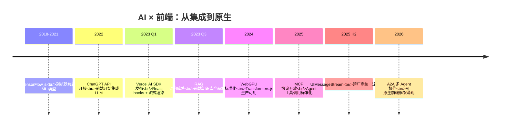
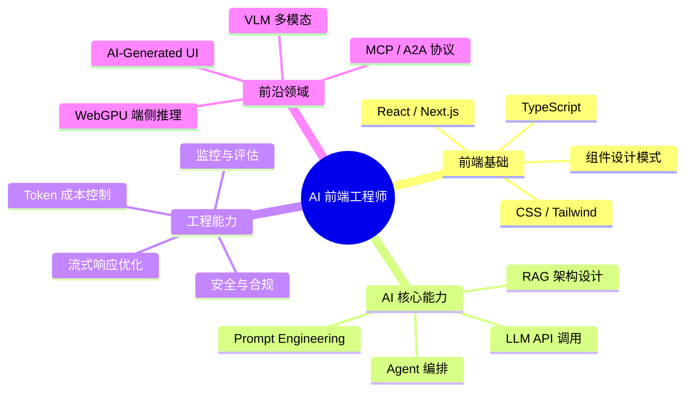

# 🚀 AI 前端开发体系化学习指南

> 面向有 React/TS 基础的前端开发者，系统化掌握 AI Agent 全栈开发能力。
> 包含：技术时间线、术语表、工具链清单、学习路线、FAQ、面试冲刺、职业规划。

---

## 📈 AI 与前端融合的技术演进

### 关键里程碑（前端视角）



### 前端角色演变

| 阶段 | 技术特征 | 前端职责 | 代表项目 |
|:---|:---|:---|:---|
| **API 集成期** (2022) | OpenAI API + SSE 流式 | 调用接口、渲染聊天界面 | ChatGPT 网页版 |
| **RAG 时期** (2023) | 向量库 + 文档解析 | 知识库管理 UI、引用溯源 | Docs + AI 搜索 |
| **端侧推理** (2024) | WebGPU / Transformers.js | 浏览器内离线推理 | AI 笔记、本地助手 |
| **Agent 交互** (2025) | Function Calling + ReAct Loop | 工具调用可视化、执行轨迹 | Copilot、智能客服 |
| **AI 原生** (2026+) | MCP/A2A 协议、Multi-Agent | 跨 Agent 协调界面、AI UX | AI-first 应用 |

---

## 🗺️ 能力矩阵：前端 → AI 工程师的升级路径



### 技能缺口分析（前端常见短板）

| 前端强项 | AI 补充项 | 学习难度 | 建议优先级 |
|---|---|:---:|:---:|
| React / Hooks | Stream 状态管理 (`useChat`) | ⭐ | **P0** |
| TypeScript | Zod Schema / JSON Schema | ⭐ | **P0** |
| CSS 布局 | Markdown 渲染 / Mermaid / 代码高亮 | ⭐⭐ | **P0** |
| State 管理 | Context + Memory 管理 | ⭐⭐⭐ | **P1** |
| API 调用 | SSE/WebSocket 流式消费 | ⭐⭐ | **P1** |
| Router | Agent Planning / Tool Routing | ⭐⭐⭐⭐ | **P2** |
| Performance | Token Budget / KV Cache | ⭐⭐⭐⭐ | **P2** |

---

## 📖 术语表（按概念分组）

### 基础概念

| 术语 | 解释 | 前端类比 |
|:---|:---|:---|
| **LLM** | 大语言模型，如 GPT-4o、Claude 3.5 | 后端 API |
| **Token** | 模型处理的文本最小单位，~0.75 英文词 | DOM 节点 |
| **Context Window** | 模型单次能处理的 Token 上限 | Virtual Scroll 窗口 |
| **Temperature** | 控制输出随机性参数，0=确定，1=创意 | 动画时长 |
| **Prompt** | 发送给模型的指令文本 | HTTP Request Body |
| **Embedding** | 文本→高维向量的映射过程 | CSS Selector |
| **Hallucination** | 模型编造看似合理但错误的事实 | Bug |

### RAG 相关

| 术语 | 解释 |
|:---|:---|
| **RAG** | Retrieval-Augmented Generation，检索增强生成 |
| **Chunking** | 将长文档切分为小片段供检索 |
| **Hybrid Search** | 向量检索 + BM25 关键词检索融合 |
| **Re-ranker** | 对初步检索结果进行精细排序 |
| **Query Expansion** | 改写/扩展用户查询以提升召回率 |
| **GraphRAG** | 引入知识图谱的多跳关系推理 RAG |
| **Agentic RAG** | Agent 驱动的多轮检索 + 推理循环 |

### Agent 相关

| 术语 | 解释 |
|:---|:---|
| **Agent** | 能自主决策、调用工具、执行任务的智能体 |
| **ReAct** | Thought-Action-Observation 循环模式 |
| **Function Calling** | LLM 输出结构化 JSON 描述函数调用 |
| **MCP** | Model Context Protocol，AI 工具标准化协议 |
| **A2A** | Agent-to-Agent，多智能体通信协议 |
| **Plan-and-Execute** | 先规划后执行的设计模式 |
| **Human-in-the-Loop** | 关键操作需人工审批 |

### 端侧推理

| 术语 | 解释 |
|:---|:---|
| **WebGPU** | 浏览器 GPU 计算 API |
| **Transformers.js** | HuggingFace 的浏览器端推理库 |
| **量化** | FP32→INT4 压缩模型体积和显存 |
| **ONNX Runtime Web** | 跨平台推理引擎 |
| **KV Cache** | 缓存已计算的 K/V 矩阵加速推理 |

---

## 📦 工具链速查

### 核心依赖安装

```bash
# === AI SDK 生态（前端流式 UI 首选）===
npm install ai @ai-sdk/openai @ai-sdk/react     # 聊天 + 流式
npm install react-markdown remark-gfm           # Markdown 渲染
npm install @dqbd/tiktoken                      # Token 精确计数

# === LangChain 生态（后端 RAG/Agent）===
npm install langchain @langchain/openai         # 核心框架
npm install @pinecone-database/pinecone          # 向量数据库

# === 端侧推理 ===
npm install @huggingface/transformers              # Transformers.js
npm install onnxruntime-web                        # ONNX Runtime

# === MCP 协议 ===
npm install @modelcontextprotocol/sdk              # MCP Client/Server SDK

# === 可观测性 & 评估 ===
npm install @opentelemetry/api                     # 遥测追踪
npx promptfoo eval                                   # Prompt 回归测试
```

### 各层框架选型

| 层级 | 推荐方案 | 备选方案 | 适用场景 |
|:---|:---|:---|:---|
| **UI 层** | Vercel AI SDK (`useChat`) | CopilotKit, assistant-ui | 聊天界面、流式渲染 |
| **路由层** | OpenAI / Anthropic 直连 | LiteLLM Gateway | 单模型 vs 多模型路由 |
| **逻辑层** | LangChain.js | 手写 (简单场景够用) | RAG / Agent 编排 |
| **存储层** | Pinecone (SaaS) / pgvector (自建) | Chroma (本地开发) | 向量检索 |
| **端侧** | Transformers.js + WebGPU | ONNX Runtime Web | 浏览器离线推理 |

---

## 📝 终极 FAQ

### 入门阶段

**Q: 我需要学 Python 吗？**  
A: **不需要**。整个技术栈可以纯 TypeScript/JavaScript 实现。Python 仅在模型微调时用到（LLaMA-Factory）。

**Q: 学完这个阶段我能做什么？**  
A: 搭建带流式响应的 AI 聊天应用；构建基于私有文档的智能问答系统；在浏览器内运行轻量级 AI 模型。

**Q: 哪些课程前置？**  
A: 完成 React 19 + TypeScript 基础即可上手。本项目 (`interview-demo`) 中 `apps/ai-demo/` 提供了完整参考实现。

### 进阶阶段

**Q: RAG 回答不准确怎么办？**  
A: 三件套：(1) 优化分块策略（512 tokens + 10% overlap）；(2) 混合检索（向量 + BM25）；(3) 引入重排序模型。

**Q: Token 消耗太快怎么控成本？**  
A: 上下文压缩（摘要早期对话）、模型路由（简单任务走 Mini 模型）、语义缓存命中重复问题。

### 生产环境

**Q: 如何防止 Prompt 注入？**  
A: 多层防护：输入过滤（正则）、分隔符隔离用户输入、系统提示词加固、输出内容审核。

**Q: 流式中断怎么处理？**  
A: 指数退避重试 + AbortController 取消旧请求 + SSE 断线自动重连。

---

## 🎓 面试冲刺要点

### 高频考点分布

| 类别 | 权重 | 典型问题 | 对应实战文档 |
|:---|:---:|:---|:---|
| **LLM 基础** | 20% | Temperature、Context Window、Token 机制 | [实战篇 01](./01-入门期-AI聊天室.md) |
| **RAG 架构** | 25% | 分块策略、混合检索、Lost in the Middle | [实战篇 02](./02-进阶期-RAG应用.md) |
| **端侧推理** | 15% | WebGPU vs WASM、模型量化、降级策略 | [实战篇 03](./03-深耕期-端侧推理.md) |
| **Agent 设计** | 25% | ReAct 循环、Function Calling、防无限循环 | [实战篇 04](./04-专家期-Agent设计.md) |
| **工程化** | 15% | Prompt 安全、成本优化、监控评估 | [实战篇 05](./05-生产化与工程化.md) |

### 面试话术模板

**自我介绍（AI 方向）**：
> "我专注于 AI 前端开发，从流式聊天 UI 起步，深入 RAG 知识库架构，掌握了端侧推理和 Agent 设计模式。在项目实践中实现了从零到一的全栈 AI 应用——包括支持混合检索的知识问答系统、具备工具调用能力的自主 Agent，以及生产级安全防护和可观测性体系。"

**项目经历讲述框架**：
> "我在 X 项目中遇到了 Y 问题，通过 Z 技术方案解决。核心指标是 W。其中最大的挑战是... 最终达成了..."

---

## 📈 职业发展建议

### AI 前端工程师的成长曲线

```
能力
 ↑
 │                                    ┌── 架构师
 │                              ┌─────┤
 │                        ┌─────┤     │
 │                  ┌─────┤  Agent │  │
 │            ┌─────┤ RAG  │     │  │
 │      ┌─────┤ 聊天 │     │     │  │
 │  ┌────┤ API  │     │     │     │  │
 └────────┴─────┴─────┴─────┴─────┴──→ 时间
    0-1月   1-3月   3-6月   6-12月   1年+
```

### 市场趋势

| 指标 | 数据 | 来源 |
|:---|:---|:---|
| AI 相关前端岗位增长 | +65% YoY | LinkedIn 2025 |
| 薪资溢价 | 20-40% vs 传统前端 | 招聘平台调研 |
| 核心技能需求 | RAG > Agent > 端侧推理 | 职位描述分析 |

---

## 📎 延伸阅读

| 文档 | 主题 | 阅读顺序 |
|:---|:---|:---:|
| [01 入门期-AI聊天室](./01-入门期-AI聊天室.md) | LLM 基础 + 流式聊天 + Token | ① |
| [02 进阶期-RAG应用](./02-进阶期-RAG应用.md) | 向量检索 + 混合检索 + GraphRAG | ② |
| [03 深耕期-端侧推理](./03-深耕期-端侧推理.md) | WebGPU + Transformers.js + 量化 | ③ |
| [04 专家期-Agent设计](./04-专家期-Agent设计.md) | ReAct + 工具注册 + Multi-Agent | ④ |
| [05 生产化与工程化](./05-生产化与工程化.md) | 安全 + 成本 + 监控 + SLO | ⑤ |
| [06 前沿技术与生态](./06-前沿技术与生态.md) | MCP + A2A + VLM + 未来趋势 | ⑥ |
| [07 技术选型对比合集](./07-技术选型对比合集.md) | 框架/DB/网关横向对比 | 查阅 |
| [08 开发实战与架构指南](./08-开发实战与架构指南.md) | 性能优化 / Prompt / 测试 / 部署 | 查阅 |
| [09 AI SDK 数据连接与聊天](./09-AI SDK 数据连接与聊天.md) | Provider多模型 / streamText / structured output / Tool Calling | 查阅 |

# 📚 AI 推荐学习资源

> 🎯 [AI 前端开发领域的优质学习资源 ](https://didilili.github.io/ai-agents-from-zero/#/%E5%B7%A5%E5%85%B7%E5%AF%BC%E8%88%AA%E4%B8%8E%E5%8F%82%E8%80%83%E8%B5%84%E6%96%99%E7%B4%A2%E5%BC%95) 
> 涵盖热门 AI 工具、LLM 原理、RAG 实战、Vibe Coding 等方向

---


## 🤖 Claude Code 专题

### 完整指南与教程

| 资源 | 说明 | 链接 |
|:---|:---|:---|
| **Claude Code 完整指南** | 从入门到精通的 Claude Code 使用教程 | [🔗 访问](https://bcefghj.github.io/claude-code-complete-guide/#/) |
| **Claude Code 指南（中文版）** | Claude Code 的中文学习资料 | [🔗 访问](https://wzf1997.github.io/claude-code-guide/) |
| **Claude Code 介绍** | 什么是 Claude Code？概念与架构 | [🔗 访问](https://ccb.agent-aura.top/docs/introduction/what-is-claude-code) |

### 核心能力

| 能力 | 说明 |
|:---|:---|
| **代码生成** | 根据自然语言描述生成完整代码 |
| **代码理解** | 分析现有代码库，提供修改建议 |
| **重构优化** | 识别代码坏味道，自动重构 |
| **测试生成** | 为现有代码生成单元测试 |
| **调试辅助** | 分析错误信息，定位问题根因 |
| **文档生成** | 自动生成代码文档和 README |

---

## 🧠 LLM 原理与应用

### 基础入门

| 资源 | 说明 | 链接 |
|:---|:---|:---|
| **Happy LLM** | 大语言模型入门教程，从原理到实践 | [🔗 访问](https://datawhalechina.github.io/happy-llm/#/) |
| **Happy Agents** | AI Agent 开发入门教程 | [🔗 访问](https://hello-agents.datawhale.cc/#/) |

### 学习路径建议

```
LLM 基础 → Prompt 工程 → RAG 应用 → Agent 开发 → 生产部署
   ↓           ↓            ↓           ↓           ↓
Happy LLM   实践练习     All-in-RAG   Happy Agents  项目实战
```

---

## 🔍 RAG 实战

| 资源 | 说明 | 链接 |
|:---|:---|:---|
| **All-in-RAG** | RAG 全栈实战教程，从理论到部署 | [🔗 访问](https://datawhalechina.github.io/all-in-rag/#/) |

### RAG 核心知识点

| 阶段 | 内容 | 重要性 |
|:---|:---|:---:|
| **文档解析** | PDF/Word/Markdown 解析 | ⭐⭐⭐ |
| **文本分块** | Chunk Size、Overlap 策略 | ⭐⭐⭐⭐ |
| **向量化** | Embedding 模型选择与优化 | ⭐⭐⭐⭐ |
| **检索优化** | 混合检索、重排序 | ⭐⭐⭐⭐⭐ |
| **生成增强** | Prompt 优化、上下文管理 | ⭐⭐⭐⭐ |

---

## 🎨 Vibe Coding

| 资源 | 说明 | 链接 |
|:---|:---|:---|
| **VibeVibe** | Vibe Coding 社区与资源 | [🔗 访问](https://www.vibevibe.cn/zh/) |
| **Easy Vibe** | Vibe Coding 入门教程 | [🔗 访问](https://datawhalechina.github.io/easy-vibe/zh-cn/) |
| **Lint 清华** | 清华大学 Lint 学习资源 | [🔗 访问](https://lintsinghua.github.io/) |

### Vibe Coding 是什么？

> **Vibe Coding** = 用自然语言描述需求 → AI 生成代码 → 人工审查优化

| 特点 | 说明 |
|:---|:---|
| **低门槛** | 不需要深入掌握编程语言语法 |
| **高效率** | 快速原型开发，缩短开发周期 |
| **人机协作** | AI 生成 + 人工审查 = 高质量代码 |
| **持续学习** | 通过 AI 生成的代码学习最佳实践 |

---

## 🌐 综合学习平台

| 平台 | 说明 | 适合人群 |
|:---|:---|:---|
| **ShareAI** | AI 学习与实验平台 | 入门到进阶 |
| **Datawhale** | 开源学习社区，提供多门 AI 课程 | 全阶段学习者 |

---

## 📖 学习路线推荐

### 阶段一：入门基础（1-2 周）

- [ ] 阅读 [Happy LLM](https://datawhalechina.github.io/happy-llm/#/) 了解 LLM 基础
- [ ] 学习 [Claude Code 指南](https://bcefghj.github.io/claude-code-complete-guide/#/) 掌握 AI 编码工具
- [ ] 完成 Vibe Coding 入门教程

### 阶段二：进阶实战（2-3 周）

- [ ] 学习 [All-in-RAG](https://datawhalechina.github.io/all-in-rag/#/) 掌握 RAG 开发
- [ ] 阅读 [Happy Agents](https://hello-agents.datawhale.cc/#/) 了解 Agent 开发
- [ ] 实践 Claude Code 项目

### 阶段三：生产应用（持续）

- [ ] 参与开源项目贡献
- [ ] 构建个人 AI 项目
- [ ] 跟踪最新技术趋势

---