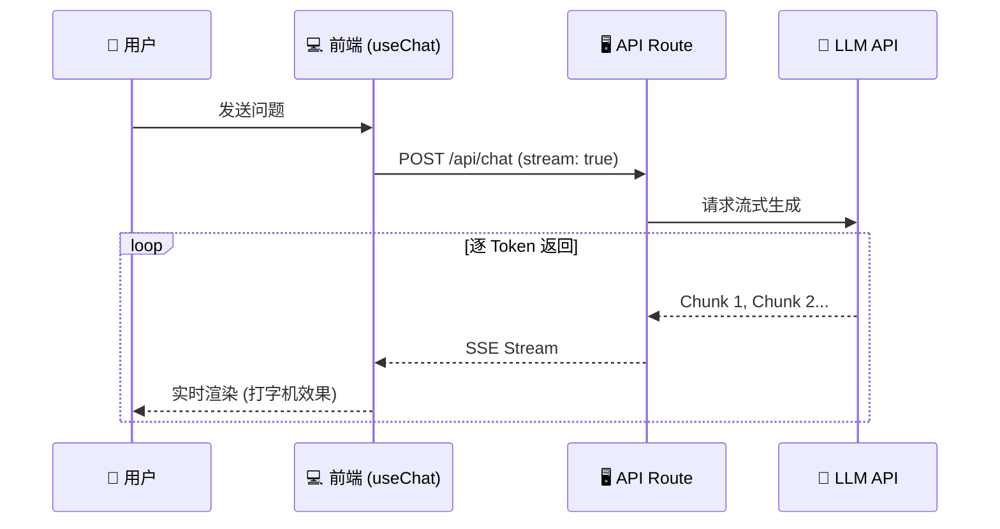
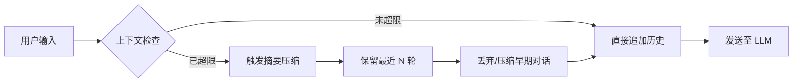
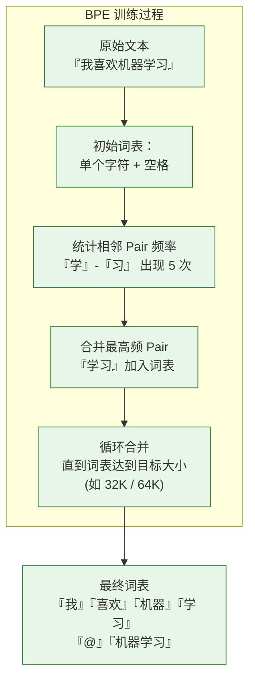
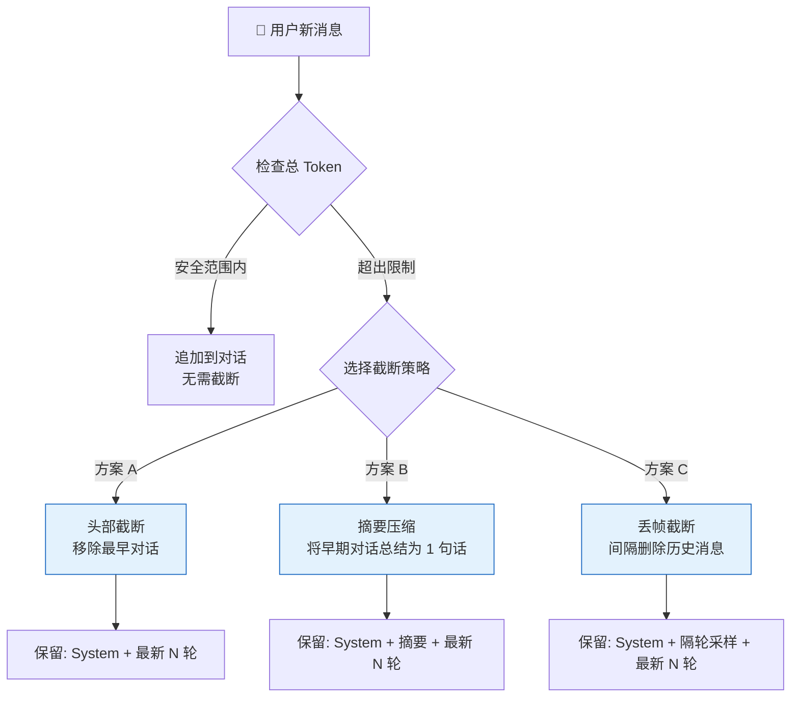

# 🟢 阶段一：入门期 - AI 聊天室

> 📖 **本文档为《AI 前端开发体系化学习指南》的阶段拆分文档**
> 完整指南请查看：[学习指南总览](./README.md#-ai-前端开发体系化学习指南)

---

> 🎯 **阶段目标**：打通 AI 应用开发的"任督二脉"，实现从 0 到 1 的突破。

### 💡 你将学到
- 大语言模型（LLM）的核心原理与关键参数调优
- [OpenAI](https://openai.com) API 的流式调用模式及选型
- 使用 [Vercel](https://vercel.com) AI SDK 零基础搭建生产级聊天界面
- 对话历史管理、上下文截断策略、Token 估算
- 完整的错误处理与指数退避重试机制
- **对应项目代码**: `apps/ai-demo/components/Chat.tsx` (Ant Design X Bubble.List + Sender)

### 🔗 前置知识
- **[TypeScript](https://www.typescriptlang.org)**：泛型、接口、类型推断
- **[React](https://react.dev)**：Hooks（useState, useEffect）、组件化思维
- **[Next.js](https://nextjs.org)**：App Router、API Routes 基础
- 完成后可继续学习 → [🔵 阶段二：进阶期 - RAG 应用](./02-进阶期-RAG应用.md)

### 📚 核心能力指标
- [ ] 理解大语言模型（LLM）的 Token 机制与上下文窗口
- [ ] 掌握 [OpenAI](https://openai.com) API 的同步与流式调用模式
- [ ] 使用 [Vercel](https://vercel.com) AI SDK 构建生产级聊天界面
- [ ] 实现对话历史管理与上下文截断策略
- [ ] 建立完整的错误处理与重试机制

### 🧠 核心概念解析

#### 1.1 大语言模型基础

**💡 什么是 LLM？**
大语言模型是基于 Transformer 架构的深度神经网络，通过在海量文本上进行预训练，学习语言的统计规律和语义表示。
- **核心机制**：Next Token Prediction（预测下一个词元）
- **上下文窗口**：模型一次能处理的 Token 数量上限（如 4K, 8K, 128K）
- **参数规模**：从 7B (70亿) 到 1T (1万亿) 不等，参数量越大，理解与生成能力越强。

**⚙️ 关键参数调优指南**

| 参数 | 作用域 | 推荐值 | 调优建议 |
|:---|:---|:---:|:---|
| `temperature` | 创造性 | `0.7-0.9` | 创意写作调高 (0.8)，事实问答调低 (0.2) |
| `max_tokens` | 长度限制 | `512-2048` | 根据业务需求设定，避免截断或浪费 |
| `top_p` | 采样范围 | `0.9` | 与 temperature 配合使用，通常二选一调整 |
| `frequency_penalty` | 去重 | `0.3-0.7` | 防止模型重复输出相同短语 |
| `presence_penalty` | 多样性 | `0.1-0.5` | 鼓励模型探索新话题，避免死循环 |

---

#### 1.2 API 调用模式对比

**流式 vs 同步：一句话选型**

| 模式 | 延迟 | 用户体验 | 适用场景 |
|:---|:---:|:---|:---|
| **同步调用** | 5-30s 等待 | 空白页 → 一次性显示 | 后端服务间调用、短答案生成 |
| **流式调用** ⭐ | 首字 <1s，逐字渲染 | 打字机效果，即时反馈 | **所有用户-facing 聊天界面** |

> 💡 **前端直觉类比**：同步 = `fetch` 等完整响应再 setState；流式 = SSE + `useRef` 逐 token 追加，类似 `requestAnimationFrame` 动画。



> ⚠️ **最佳实践**：生产环境务必使用**流式调用**，显著降低首字延迟 (TTFT)，提升用户体验。

### 🛠️ 环境搭建

#### 1.3 项目初始化

```bash
# 🚀 创建 Next.js 项目 (App Router + TypeScript + Tailwind)
npx create-next-app@latest ai-chat --typescript --tailwind --app

cd ai-chat

# 📦 安装核心依赖（Vercel AI SDK 6.x，2026+ 推荐写法）
# ai SDK 6 起，React 适配器拆分为独立包 @ai-sdk/react
npm install ai @ai-sdk/openai @ai-sdk/react

# 🎨 安装辅助依赖 (Markdown 渲染)
npm install react-markdown remark-gfm
```

> 💡 **AI SDK 6.x 关键变化**（2026+）：
> - `@ai-sdk/react` 成为独立包（不再藏在 `ai/react` 子路径中）
> - 流式协议统一为 **`UIMessageStream`**（与 AG-UI、CopilotKit 互通）
> - `useChat` / `useCompletion` API 微调
> - 详见 [Vercel AI SDK 迁移指南](https://sdk.vercel.ai/docs/migration)

#### 1.4 环境变量配置

```bash
# .env.local
# 🔒 安全提示：永远不要在前端暴露 API Key！
OPENAI_API_KEY=sk-your-api-key-here
```

> ⚠️ **安全红线**：
> 1. `.env.local` 中的环境变量**只会被服务端代码访问**（API Routes、Server Components）
> 2. **永远不要**在客户端组件（'use client'）中直接使用 `process.env.OPENAI_API_KEY`
> 3. 如果需要在客户端使用 AI 功能，必须通过服务端 API 路由进行代理

### 💻 核心实现

#### 1.5 服务端 API 路由

```typescript
// app/api/chat/route.ts
import { openai } from '@ai-sdk/openai';
import { streamText, convertToCoreMessages, UIMessage } from 'ai';

// ⏱️ 设置最大执行时间 (Vercel Hobby 计划为 10s, Pro 为 60s)
export const maxDuration = 30;

export async function POST(req: Request) {
  try {
    const { messages }: { messages: UIMessage[] } = await req.json();

    // ✅ 输入校验
    if (!messages || messages.length === 0) {
      return new Response('Invalid messages', { status: 400 });
    }

    // 🌊 启动流式生成（AI SDK 6.x 推荐写法）
    // 注意：convertToModelMessages 把 UI 消息格式转为模型消息格式
    const result = streamText({
      model: openai('gpt-4.1'),
      messages: convertToCoreMessages(messages),
      system: `你是一个专业的 AI 助手。请用简洁、准确的语言回答问题。
如果涉及代码，请使用代码块格式。`,
      temperature: 0.7,
      maxTokens: 2048,
    });

    // UI Message Stream 协议（统一前端流式协议）
    return result.toUIMessageStreamResponse();
  } catch (error) {
    console.error('🔥 Chat API Error:', error);
    return new Response('Internal Server Error', { status: 500 });
  }
}
```

> ⚠️ **API 变更说明**：
> - `toDataStreamResponse()` → `toUIMessageStreamResponse()`（AI SDK 6 协议统一）
> - `Message` → `UIMessage` + `convertToModelMessages()` 转换
> - 模型推荐从 `gpt-4o` 升级到 `gpt-4.1`（更稳定、更长上下文）

#### 1.6 客户端聊天组件 (React + AI SDK)

```tsx
// components/Chat.tsx — 使用 @ant-design/x 生产级实现
'use client';

import { useChat } from '@ai-sdk/react';
import ReactMarkdown from 'react-markdown';
import { Bubble, Sender } from '@ant-design/x';

export default function Chat() {
  const {
    messages, input, handleInputChange, handleSubmit, isLoading, stop,
  } = useChat({
    api: '/api/chat',
    onError: (error) => console.error('💥 Chat error:', error),
  });

  return (
    <div className="flex flex-col h-screen">
      {/* 💬 消息列表 — Bubble.List 自动处理 role 样式 + 打字动画 */}
      <Bubble.List
        items={messages.map(m => ({
          key: m.id,
          role: m.role === 'user' ? 'user' : 'assistant',
          content: m.role === 'assistant' ? (
            <ReactMarkdown>{m.content}</ReactMarkdown>
          ) : m.content,
        }))}
        loading={isLoading}
      />
      
      {/* ⌨️ 输入框 — Sender 内置 loading/取消/快捷键 */}
      <Sender
        value={input}
        onChange={handleInputChange}
        onSubmit={handleSubmit}
        loading={isLoading}
        onStop={stop}
        placeholder="输入你的问题..."
      />
    </div>
  );
}
```

> 💡 **对比原生实现**：手动写 `div` + `role` 样式需要 ~80 行代码处理加载态、消息气泡、Markdown 渲染。`@ant-design/x` 的 `Bubble.List` + `Sender` 组合通过一个 `items` 数组即可完成，内部已封装 typing animation + fade-in + stream marker。

#### 1.7 高级功能实现

**多轮对话上下文管理**



```typescript
// lib/context-manager.ts
import type { UIMessage } from 'ai';

const MAX_CONTEXT_MESSAGES = 10;
const MAX_TOKENS_ESTIMATE = 4000;

export class ContextManager {
  // 📉 消息截断策略
  static trimMessages(messages: UIMessage[]): UIMessage[] {
    const systemMessages = messages.filter(m => m.role === 'system');
    const chatMessages = messages.filter(m => m.role !== 'system');

    if (chatMessages.length > MAX_CONTEXT_MESSAGES) {
      return [
        ...systemMessages,
        ...chatMessages.slice(-MAX_CONTEXT_MESSAGES),
      ];
    }
    return messages;
  }

  // 🔢 Token 估算 (中文字符 ≈ 1.5 Token)
  static estimateTokenCount(messages: UIMessage[]): number {
    const totalChars = messages.reduce((sum, m) => sum + m.content.length, 0);
    return Math.ceil(totalChars * 1.5);
  }

  static shouldTrim(messages: UIMessage[]): boolean {
    return this.estimateTokenCount(messages) > MAX_TOKENS_ESTIMATE;
  }
}
```

**错误处理与重试机制**

```typescript
// lib/error-handler.ts
export class ChatErrorHandler {
  // 🚨 错误码映射
  static getErrorMessage(error: unknown): string {
    if (error instanceof Error) {
      if (error.message.includes('rate limit')) return '⏳ 请求过于频繁，请稍后再试';
      if (error.message.includes('invalid_api_key')) return '🔑 API 密钥无效，请检查配置';
      if (error.message.includes('context_length_exceeded')) return '📏 对话内容过长，请开启新对话';
      return error.message;
    }
    return '❓ 发生未知错误，请稍后重试';
  }

  // 🔄 指数退避重试
  static async withRetry<T>(
    fn: () => Promise<T>,
    maxRetries: number = 2,
    delayMs: number = 1000
  ): Promise<T> {
    let lastError: unknown;
    for (let i = 0; i <= maxRetries; i++) {
      try {
        return await fn();
      } catch (error) {
        lastError = error;
        if (i < maxRetries) {
          await new Promise(resolve => setTimeout(resolve, delayMs * Math.pow(2, i)));
        }
      }
    }
    throw lastError;
  }
}
```

---

### 🔤 Tokenizer 与 BPE 编码原理

> **理解 Token 的来历**：LLM 看到的不是"字"而是"Token"，理解分词机制是正确估算成本、设计 Prompt 的基础。

#### BPE (Byte Pair Encoding) 算法



| 概念 | 说明 | 前端影响 |
|:---|:---|:---|
| **词表大小** | 常见 32K/64K/128K，越大表示能力越强 | 模型文件大小、加载时间 |
| **回退 Token** | `<\|endoftext\|>`、`<\|im_end\|>` 等特殊标记 | 违规内容过滤逻辑 |
| **Unicode 分词** | UTF-8 字节到 Token 的映射 | 多语言内容处理 |
| **TikToken 库** | OpenAI 开源的快速 Tokenizer | 前端 Token 计数实现 |

```typescript
// 前端 Token 估算实现（不使用完整 Tokenizer）
export function estimateTokens(text: string): number {
  // 中文：约 1.5 tokens/字
  const chineseChars = (text.match(/[\u4e00-\u9fff]/g) || []).length;
  // 英文：约 0.25 tokens/字符
  const englishChars = text.length - chineseChars;
  return Math.ceil(chineseChars * 1.5 + englishChars * 0.25);
}

// 更精确的计数（使用 TikToken JS 版本）
// 需要安装 @dqbd/tiktoken 包
// import { getTiktokenEncoder } from '@dqbd/tiktoken';
export async function countTokens(text: string): Promise<number> {
  // 使用更精确的计数方式
  const encoder = await getTiktokenEncoder('cl100k_base');
  return encoder.encode(text).length;
}
```

#### 不同模型的 Tokenizer 对比

| 模型 | Tokenizer | 词表大小 | 中文效率 | 备注 |
|:---|:---|:---:|:---:|:---:|
| GPT-3.5 / GPT-4 | `cl100k_base` | 100K | 较差（中文约 2 tokens/字） | OpenAI 主流 |
| GPT-4o | `o200k_base` | 200K | 优秀（中文约 1 token/字） | 多语言优化 |
| Llama 3 | `SentencePiece BPE` (128K) | 128K | 一般 | 改进版 BPE |
| Qwen 2.5 | `Qwen2Tokenizer` | 152K | 优秀 | 中文场景推荐 |

---

### 📡 SSE (Server-Sent Events) 协议详解

> **流式响应的基石**：SSE 是 AI 聊天应用实现"打字机效果"的核心协议。

#### SSE vs [WebSocket](https://websockets.spec.whatwg.org) vs 轮询

| 特性 | SSE | WebSocket | 短轮询 |
|:---|:---:|:---:|:---:|
| **方向** | 服务端→客户端单向 | 双向 | 客户端→服务端 |
| **协议** | HTTP | WS/WSS | HTTP |
| **自动重连** | ✅ 内置 | ❌ 需手动实现 | ❌ |
| **浏览器支持** | 所有现代浏览器 | 所有现代浏览器 | 所有浏览器 |
| **适用场景** | 流式消息、通知推送 | 实时游戏、协作编辑 | 旧浏览器兼容 |
| **连接开销** | 低（复用 HTTP） | 中（需握手升级） | 高（反复请求） |

#### SSE 事件流格式

```text
// 标准 SSE 格式
event: token       // 事件类型（可选，默认 message）
data: {"token":"我"}  // 数据内容（必须以 data: 开头）
                   // 空行表示事件结束

event: token
data: {"token":"喜"}

event: token
data: {"token":"欢"}

event: done
data: {"usage":{"totalTokens":128,"promptTokens":50,"completionTokens":78}}
```

#### 前端 SSE 消费者实现

```typescript
// Web Streams API 消费 SSE（推荐方案）
async function consumeSSE(response: Response, onToken: (token: string) => void) {
  const reader = response.body!.getReader();
  const decoder = new TextDecoder();
  let buffer = '';

  while (true) {
    const { done, value } = await reader.read();
    if (done) break;

    buffer += decoder.decode(value, { stream: true });
    const lines = buffer.split('\n');
    buffer = lines.pop() || ''; // 保留不完整的行

    for (const line of lines) {
      if (line.startsWith('data: ')) {
        const data = line.slice(6); // 去掉 "data: " 前缀
        if (data === '[DONE]') return; // OpenAI 结束标记
        
        try {
          const parsed = JSON.parse(data);
          const content = parsed.choices?.[0]?.delta?.content || parsed.token || '';
          if (content) onToken(content);
        } catch {
          // 非 JSON 数据（如自定义事件）
          onToken(data);
        }
      }
    }
  }
}

// 使用示例
async function handleSubmit(prompt: string) {
  const response = await fetch('/api/chat', {
    method: 'POST',
    headers: { 'Content-Type': 'application/json' },
    body: JSON.stringify({ messages: [{ role: 'user', content: prompt }] }),
  });

  let fullContent = '';
  await consumeSSE(response, (token) => {
    fullContent += token;
    updateUI(fullContent); // 实时更新 UI
  });
}

// SSE 断线重连与退避策略
export class SSEClient {
  private abortController = new AbortController();
  private retries = 0;
  private maxRetries = 5;
  private backoff = (attempt: number) => Math.min(1000 * Math.pow(2, attempt), 30000);

  async connect(url: string, onToken: (t: string) => void, onDone: () => void) {
    while (this.retries < this.maxRetries) {
      try {
        const resp = await fetch(url, { signal: this.abortController.signal });
        await consumeSSE(resp, onToken);
        onDone();
        this.retries = 0; // 成功后重置
        return;
      } catch (err) {
        if (this.abortController.signal.aborted) break;
        this.retries++;
        console.warn(`SSE 断线，第 ${this.retries} 次重试...`);
        await new Promise(r => setTimeout(r, this.backoff(this.retries)));
      }
    }
    throw new Error('SSE 连接失败：已达最大重试次数');
  }

  disconnect() { this.abortController.abort(); }
}
```

#### 服务端 SSE 实现 ([Next.js](https://nextjs.org) Route Handler)

```typescript
// app/api/chat/route.ts
export async function POST(req: Request) {
  const { messages } = await req.json();

  // 创建 ReadableStream
  const stream = new ReadableStream({
    async start(controller) {
      const encoder = new TextEncoder();
      
      try {
        // 调用 LLM API 流式接口
        const response = await fetch(process.env.OPENAI_API_URL, {
          method: 'POST',
          headers: { 'Content-Type': 'application/json', Authorization: `Bearer ${process.env.OPENAI_API_KEY}` },
          body: JSON.stringify({ model: 'gpt-4o', messages, stream: true }),
        });

        const reader = response.body!.getReader();
        const decoder = new TextDecoder();

        while (true) {
          const { done, value } = await reader.read();
          if (done) break;

          const chunks = decoder.decode(value);
          // 转发 SSE 事件到前端
          controller.enqueue(encoder.encode(chunks));
        }
      } catch (error) {
        // 发送错误事件
        controller.enqueue(encoder.encode(`event: error
data: ${JSON.stringify({ error })}

`));
      } finally {
        controller.close();
      }
    },
  });

  return new Response(stream, {
    headers: {
      'Content-Type': 'text/event-stream',
      'Cache-Control': 'no-cache',
      'Connection': 'keep-alive',
    },
  });
}
```

---

### 🧮 上下文窗口管理策略

> 不同场景使用不同的截断策略，是 AI 应用工程化的基础。



| 策略 | 优势 | 劣势 | 适用场景 |
|:---|:---|:---|:---|
| **头部截断** | 简单高效 | 可能丢失早期关键信息 | 短对话、普通聊天 |
| **摘要压缩** | 保留语义完整性 | 多一次 LLM 调用，增加延迟 | 客服对话、报告生成 |
| **丢帧截断** | 保留对话时序 | 可能遗漏中间决策 | 长文档讨论、代码审查 |

```typescript
// 上下文管理器完整实现
class ContextManager {
  private readonly maxTokens: number;
  private readonly systemPrompt: string;
  
  constructor(config: { maxTokens: number; systemPrompt: string }) {
    this.maxTokens = config.maxTokens;
    this.systemPrompt = config.systemPrompt;
  }

  trimHistory(messages: UIMessage[]): UIMessage[] {
    // estimateTokens 需要从同一模块引用或 import（见上文「前端 Token 估算实现」）
    const systemTokens = estimateTokens(this.systemPrompt);
    let available = this.maxTokens - systemTokens - 500; // 500 保留给输出
    
    // 从最新消息开始反向遍历
    const trimmed: UIMessage[] = [];
    for (let i = messages.length - 1; i >= 0; i--) {
      const msgTokens = estimateTokens(messages[i].content);
      if (available - msgTokens >= 0) {
        trimmed.unshift(messages[i]);
        available -= msgTokens;
      } else if (trimmed.length === 0) {
        // 至少保留最后一条消息（可能被截断）
        trimmed.unshift({
          ...messages[i],
          content: messages[i].content.slice(0, available * 4),
        });
        break;
      } else {
        break;
      }
    }
    
    return trimmed;
  }
}
```

---

### ❓ 常见问题与自测

#### Q1: temperature 和 top_p 参数如何配合使用？为什么通常建议二选一调整而非同时调整？

**考察点**: 解码策略参数调优

> **回答要点**:
> 1. **temperature**: 控制输出随机性，值越高（如 0.9）输出越随机多样，值越低（如 0.1）输出越确定
> 2. **top_p (nucleus sampling)**: 控制采样范围，只从累积概率达到 p 的 token 中采样
> 3. **为什么二选一**: 同时调整会导致随机性叠加，难以预测输出分布。例如 temperature=0.9 + top_p=0.9 会产生过度随机的输出
> 4. **推荐策略**: 创意写作用 temperature=0.7-0.9，事实问答用 temperature=0.2-0.3
>
> 💡 **关键要点**: temperature 控制"温度"，top_p 控制"范围"，通常只调整其中一个

#### Q2: LoRA 微调时，rank (r) 值如何选择？r=8 和 r=64 在效果和开销上有什么区别？

**考察点**: LoRA 微调原理

> **回答要点**:
> 1. **rank 含义**: LoRA 低秩矩阵的秩，决定可训练参数量。r=8 表示用 8 维矩阵近似原始权重
> 2. **r=8 特点**: 参数量少（约 0.1% 原始权重），训练快，适合简单任务或数据量少的场景
> 3. **r=64 特点**: 参数量多（约 0.8% 原始权重），训练慢，但能捕获更复杂的任务特征
> 4. **选择建议**: 从 r=8 开始，如果效果不佳再尝试 r=16 或 r=32，一般不超过 64
> 5. **经验法则**: 任务越复杂、数据量越大，可以使用越大的 rank
>
> 💡 **关键要点**: rank 是效果与开销的权衡，从小值开始逐步增加

#### Q3: 在生产环境中，何时应该选择流式调用而非同步调用？流式调用有哪些需要特别注意的边界情况？

**考察点**: API 调用模式选型

> **回答要点**:
> 1. **选择流式的场景**: 长文本生成（>500 tokens）、用户体验敏感的聊天界面、需要实时显示进度
> 2. **选择同步的场景**: 短文本生成、后端对后端调用、需要完整响应后再处理
> 3. **边界情况**:
>    - 网络中断: 需要实现重试逻辑，已接收的内容可能不完整
>    - 并发控制: 流式连接占用时间长，需要限制并发数
>    - 内存管理: 大量流式连接可能导致内存泄漏
> 4. **生产建议**: 使用 AbortController 支持取消，设置超时时间，实现重试机制
>
> 💡 **关键要点**: 流式提升用户体验但增加复杂度，需要处理中断、重试、并发

#### Q4: 什么是 "Lost in the Middle" 问题？在上下文窗口管理中如何缓解？

**考察点**: 上下文窗口管理

> **回答要点**:
> 1. **问题定义**: LLM 对上下文中间部分的信息关注度较低，容易"遗忘"中间内容
> 2. **表现**: 当上下文很长时，模型更关注开头和结尾的信息，中间信息可能被忽略
> 3. **缓解策略**:
>    - 将重要信息放在上下文开头或结尾
>    - 使用摘要技术压缩中间内容
>    - 实现滑动窗口，只保留最近的对话
>    - 对长文档进行分块检索（RAG）
> 4. **实际应用**: 在多轮对话中，定期总结前面的对话，避免上下文过长
>
> 💡 **关键要点**: 重要信息放首尾，长上下文需要压缩或分块

#### Q5: SSE 和 WebSocket 在 AI 聊天场景中各有什么优劣？为什么 SSE 是更好的选择？

**考察点**: 通信协议选型

> **回答要点**:
> 1. **SSE 优势**:
>    - 单向通信（服务器→客户端），符合 AI 流式输出场景
>    - 基于 HTTP，天然支持身份验证、代理、CDN
>    - 实现简单，浏览器原生支持 EventSource API
>    - 自动重连机制
> 2. **WebSocket 优势**:
>    - 双向通信，适合需要客户端实时推送的场景
>    - 协议开销更小
> 3. **为什么 SSE 更适合 AI 聊天**:
>    - AI 生成是单向的（服务器生成，客户端显示）
>    - 不需要客户端实时推送数据到服务器
>    - SSE 更简单，更容易与现有 HTTP 基础设施集成
> 4. **WebSocket 适用场景**: 多人协作编辑、实时游戏、需要双向通信的场景
>
> 💡 **关键要点**: AI 聊天是单向流，SSE 更简单且与 HTTP 生态兼容

---

### 🏆 阶段一实战项目

| 项目 | 难度 | 核心考察点 | 完成标准 |
|:---|:---:|:---|:---|
| 🟢 **基础聊天室** | ⭐ | API 调用、流式渲染 | 能正常对话，支持 Markdown |
| 🔵 **多轮对话** | ⭐⭐ | 上下文管理、Token 估算 | 连续对话 10 轮不超限 |
| 🟣 **增强功能** | ⭐⭐⭐ | 错误处理、UI/UX 优化 | 包含清空、停止、重试、加载态 |
