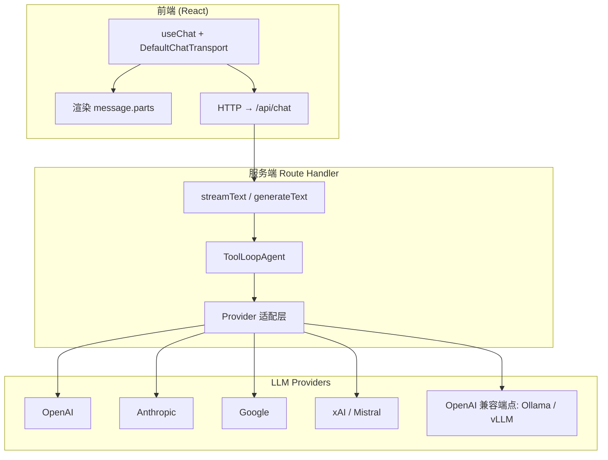
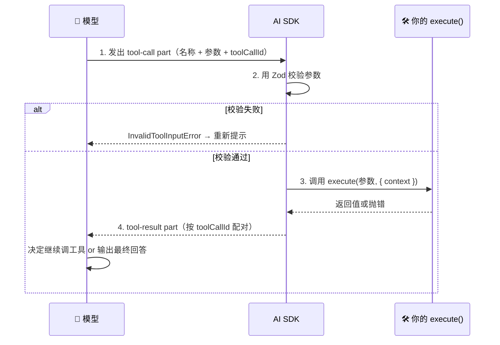
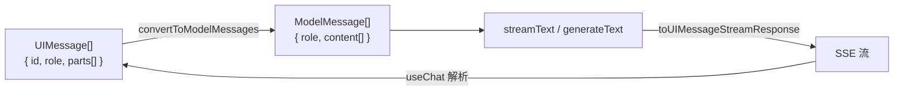

# 🟠 AI SDK 数据连接与聊天

> 📖 **本文档为《AI 前端开发体系化学习指南》的专题文档**
> 完整指南请查看：[学习指南总览](../index.md)

---

> 🎯 **学习目标**：掌握 Vercel AI SDK（**v7**）的核心 API——从多模型 Provider 连接，到流式生成、结构化输出、Tool Calling、Agent 循环，再到 React UI Hook 与 UIMessageStream 协议，打通「数据接入 → 模型调用 → 前端展示」全链路。

### 💡 你将学到
- Provider 多模型连接的统一接口（含 AI Gateway 与自定义兼容端点）
- `generateText` 同步生成与 `streamText` 流式生成的取舍
- `Output.object()` 结构化数据生成（以及为什么不再用 `generateObject`）
- Tool Calling 完整流程：`tool()` + `inputSchema` + `contextSchema` + `stopWhen`
- Agent 循环：`ToolLoopAgent`、工具审批、超时、`WorkflowAgent` 持久化
- React 客户端 `useChat` Hook 与 `DefaultChatTransport` 配置
- `UIMessageStream` 协议与消息格式转换 `convertToModelMessages`
- AI SDK 7 新增：`reasoning`、`uploadFile` / `uploadSkill`、MCP Apps、Realtime、Telemetry

### 🔗 前置知识
- 完成 [🟢 阶段一：入门期 - AI 聊天室](./01-入门期-AI聊天室.md)
- 熟悉 React Hooks（`useState` / `useEffect`）
- 了解 Zod 基础用法

### 📚 核心能力指标
- [ ] 使用统一接口连接多种 LLM Provider，并支持运行时切换
- [ ] 实现同步/流式文本生成，并读取性能指标
- [ ] 使用 Zod Schema 获取类型安全的结构化输出
- [ ] 定义并执行 Tool Calling，设置正确的停止条件与超时
- [ ] 用 `useChat` 构建生产级 React 聊天界面（含中断、重试、错误态）
- [ ] 用 `ToolLoopAgent` 构建带工具审批的 Agent
- [ ] 接入 Telemetry，能回答「这次请求花了多少 token、卡在哪一步」

> ⚠️ **版本基线**：本文基于 **AI SDK 7**（2026-06 发布）。本仓库 `apps/ai-demo` 依赖 `ai@^7`。
> 从 v6 升级请优先跑官方 codemod：`npx @ai-sdk/codemod v7`。

---

## 🧠 核心概念解析

### 11.1 AI SDK 是什么？

**💡 Vercel AI SDK 是全栈 TypeScript AI 开发工具包**

它提供了一套**统一的 API** 连接不同的 LLM 提供商（OpenAI、Anthropic、Google、Mistral、xAI 等），
同时在客户端提供 React Hooks 快速构建聊天 UI。



**为什么用 AI SDK 而不是直接调 OpenAI API？**

| 维度 | 直接调 API | 使用 AI SDK |
|:---|:---|:---|
| **多模型切换** | 需手写抽象层 | 一行换 `model` |
| **流式响应** | 手动解析 SSE | `streamText` + `toUIMessageStreamResponse()` |
| **React 集成** | 手动管理状态机 | `useChat` 提供 `status` / 乐观 UI / 中断 |
| **结构化输出** | 自行解析 + 校验 JSON | `Output.object()` + Zod 自动校验 |
| **Tool Calling** | 手动编排循环 | `tool()` + `ToolLoopAgent` + `stopWhen` |
| **消息格式** | 各模型不同 | `convertToModelMessages()` 统一适配 |

> ⚠️ **v6 → v7 的关键变化**（迁移时最容易踩的坑）：
> - `@ai-sdk/react` 是独立包，不再从 `ai/react` 子路径导入（v5 起已移除）
> - 消息从 `content: string` 改为 **`parts: UIMessagePart[]`**
> - `toDataStreamResponse()` → **`toUIMessageStreamResponse()`**
> - `convertToCoreMessages()` → **`convertToModelMessages()`**
> - `useChat({ api })` → **`useChat({ transport: new DefaultChatTransport({ api }) })`**
> - `isLoading` → **`status`**（`'ready' \| 'submitted' \| 'streaming' \| 'error'`）
> - 独立的 `generateObject` / `streamObject` **已废弃**，改用 `generateText` / `streamText` + `output`
> - 新增 `reasoning`、工具上下文、工具审批、`WorkflowAgent`、`registerTelemetry()`

---

### 11.2 Provider 多模型连接

**🔌 统一接口，一个 Provider = 一行代码**

```bash
# 核心包 + React Hooks
bun add ai @ai-sdk/react zod

# Provider（按需安装）
bun add @ai-sdk/openai      # OpenAI
bun add @ai-sdk/anthropic   # Anthropic
bun add @ai-sdk/google      # Google
bun add @ai-sdk/mistral     # Mistral
bun add @ai-sdk/xai         # xAI

# 可观测（可选，见 11.10）
bun add @ai-sdk/otel
```

```typescript
// lib/ai/providers.ts — 按「能力」而非「厂商」命名模型
import { anthropic } from '@ai-sdk/anthropic';
import { createOpenAI } from '@ai-sdk/openai';
import { google } from '@ai-sdk/google';
import type { LanguageModel } from 'ai';

export const models = {
  // 日常对话：追求首字延迟与成本
  fast: google('gemini-3.5-flash'),
  // 深度推理：配合 reasoning: 'high'
  reasoning: anthropic('claude-sonnet-4-6'),
  // 编码 Agent：结构化输出与工具调用最稳
  coding: 'openai/gpt-5',
} satisfies Record<string, LanguageModel | string>;

export function getModel(task: keyof typeof models) {
  return models[task];
}

// 🏗️ 自定义 OpenAI 兼容端点（本地 Ollama / 内网 vLLM / 任意网关）
const local = createOpenAI({
  baseURL: process.env.LOCAL_BASE_URL ?? 'http://localhost:11434/v1',
  name: 'local',
});

export const localModel = local.chat(process.env.LOCAL_MODEL ?? 'qwen2.5:7b');
```

> 💡 **选型原则**
> 1. **用 AI Gateway 做统一入口**：把模型路由、缓存、重试、限流收敛到网关，
>    业务代码只写 `'openai/gpt-5'` 这类字符串，换厂商不改代码。
> 2. **字符串模型 ID 可用**：AI SDK 支持 `model: 'google/gemini-3.5-flash'`
>    这种字符串写法，配合 Gateway 时更灵活。
> 3. **型号与价格以官方为准**：模型代次与定价变化极快，本文档不列出价格表，
>    请把厂商定价页作为唯一事实来源。

---

### 11.3 generateText — 同步生成

**⚡ 一次性获取完整回答（非流式）**

适用于：后端任务、批量处理、短答案、需要在拿到完整结果后再做分支判断的场景。

```typescript
// app/api/generate/route.ts
import { openai } from '@ai-sdk/openai';
import { generateText } from 'ai';

export async function POST(req: Request) {
  const { prompt } = (await req.json()) as { prompt: string };

  const result = await generateText({
    model: openai('gpt-5-mini'),
    system: '你是一个简洁专业的 AI 助手。',
    prompt,

    // 🧠 AI SDK 7：统一的推理档位，自动映射到各家原生参数
    //    OpenAI → reasoning.effort；Anthropic → thinking budget；Google → thinkingBudget
    reasoning: 'medium',

    // ⏱️ AI SDK 7：细粒度超时（防止 provider 开流不发数据 / 工具挂死）
    timeout: {
      totalMs: 60_000,
      stepMs: 10_000,
      chunkMs: 2_000,
    },

    abortSignal: req.signal, // 🛑 支持请求取消

    // 🔭 生命周期事件（计费、审计、调试都靠它）
    onStart({ callId, modelId }) {
      console.log('[ai] start', { callId, modelId });
    },
    onEnd({ callId, usage, finishReason }) {
      console.log('[ai] end', { callId, finishReason, totalTokens: usage.totalTokens });
    },
  });

  return Response.json({
    text: result.text,                 // 最终生成的文本
    usage: result.usage,               // { inputTokens, outputTokens, totalTokens, ... }
    finishReason: result.finishReason, // 'stop' | 'length' | 'content-filter' | 'tool-calls' | 'error'
    steps: result.steps,               // 每一步的详情（含工具调用与性能指标）
  });
}
```

**对比流式：**

| 特性 | `generateText` | `streamText` |
|:---|:---|:---|
| 首字延迟 | 等于全文完成时间（数秒～数十秒） | 通常 < 1s，逐 token 渲染 |
| 内存 | 占用较高（缓存全文） | 较低（边生成边消费） |
| 可中断 | ✅ `AbortSignal` | ✅ `AbortSignal` / `stop()` |
| 适用场景 | 后端任务、批处理、短答案 | 聊天界面、长回答、Agent 过程展示 |

> **经验法则**：面向用户的界面一律 `streamText`；后台流水线一律 `generateText`。
> 反过来用会在用户体验或成本上付出代价。

---

### 11.4 streamText — 流式生成

**🌊 打字机效果的核心引擎**

```typescript
// app/api/chat/route.ts
import { openai } from '@ai-sdk/openai';
import { convertToModelMessages, stepCountIs, streamText, type UIMessage } from 'ai';

export const maxDuration = 60;

export async function POST(req: Request) {
  const { messages }: { messages: UIMessage[] } = await req.json();

  const result = streamText({
    model: openai('gpt-5-mini'),

    // 📨 UI 消息 → 模型消息（同步函数，不需要 await，详见 11.9）
    messages: convertToModelMessages(messages),

    system: '你是一个专业的 AI 助手。请用简洁准确的语言回答问题。',

    // ⏱️ 平滑流式输出（按中文词粒度分块，避免逐字抖动）
    experimental_transform: smoothStream({
      delayInMs: 10,
      chunking: new Intl.Segmenter('zh-CN', { granularity: 'word' }),
    }),

    // 🛑 有工具时必须设置停止条件，否则模型可能无限循环烧钱
    stopWhen: stepCountIs(5),

    // 🎣 生命周期回调
    onError({ error }) {
      console.error('[ai] stream error', error);
    },
    onFinish({ usage, finishReason }) {
      // 落库 / 计费 / 上报
      console.log('[ai] finish', { finishReason, totalTokens: usage.totalTokens });
    },
  });

  return result.toUIMessageStreamResponse();
}
```

> 别忘了把 `smoothStream` 加进 import：
> `import { convertToModelMessages, smoothStream, stepCountIs, streamText, type UIMessage } from 'ai';`

**读取性能指标（AI SDK 7）**

```typescript
const result = streamText({ model: openai('gpt-5'), prompt: '写一段产品介绍' });

for await (const chunk of result.textStream) {
  process.stdout.write(chunk);
}

const { performance } = await result.finalStep;
console.log({
  responseTimeMs: performance.responseTimeMs,       // 总耗时
  timeToFirstOutputMs: performance.timeToFirstOutputMs, // 首字延迟（TTFO）
  outputTokensPerSecond: performance.outputTokensPerSecond, // 输出速度
});
```

> 💡 **前端视角**：`timeToFirstOutputMs` 就是用户感知的「点了多久才出字」。
> 它是聊天体验的头号指标，比总耗时更值得进监控面板。

---

### 11.5 Structured Output — 结构化数据生成

**📐 让模型直接吐出符合 Zod Schema 的 JSON**

AI SDK 7 推荐用 `generateText` / `streamText` 的 `output` 参数配合 `Output.*()`。
**独立的 `generateObject` / `streamObject` 已废弃**，新代码不要再使用。

```typescript
import { openai } from '@ai-sdk/openai';
import { Output, generateText } from 'ai';
import { z } from 'zod';

const RecipeSchema = z.object({
  title: z.string().describe('菜名'),
  servings: z.number().int().min(1).describe('份数'),
  ingredients: z.array(
    z.object({
      name: z.string(),
      amount: z.string().describe('带单位的用量，如 "200g"'),
    }),
  ),
  steps: z.array(z.string()).min(1),
  tags: z.array(z.string()).max(5),
});

const { output, usage } = await generateText({
  model: openai('gpt-5-mini'),
  output: Output.object({ schema: RecipeSchema }),
  system: '你是专业菜谱作者。所有字段用中文。',
  prompt: '给我一份番茄炒蛋的做法',
});

// output 已通过 Zod 校验，类型是 z.infer<typeof RecipeSchema>
console.log(output.title, output.ingredients.length);
```

**三种输出形态**

| 形态 | 用法 | 场景 |
|:---|:---|:---|
| `Output.object({ schema })` | 单个对象 | 表单预填、实体抽取、配置生成 |
| `Output.array({ element })` | 数组 | 批量抽取（如从文档抽 N 条记录） |
| `Output.choice({ options })` | 枚举 | 分类、路由、情感判定 |

**流式结构化输出到 UI**

前端用 `experimental_useObject`（React）：

```tsx
'use client';
import { experimental_useObject as useObject } from '@ai-sdk/react';

export function RecipeView() {
  const { object, submit, isLoading, error, stop } = useObject({
    api: '/api/recipe',
    schema: RecipeSchema,
  });

  return (
    <div>
      <button onClick={() => submit('番茄炒蛋')} disabled={isLoading}>
        生成菜谱
      </button>
      {isLoading && <button onClick={stop}>停止</button>}
      {/* object 是 Partial<Recipe>，边生成边渲染 */}
      <h3>{object?.title ?? '生成中…'}</h3>
      <ul>
        {object?.ingredients?.map((ing, i) => (
          <li key={i}>
            {ing?.name} — {ing?.amount}
          </li>
        ))}
      </ul>
      {error && <p className="text-red-600">{error.message}</p>}
    </div>
  );
}
```

> ⚠️ **注意**：流式结构化输出过程中 `object` 是**部分对象**，
> 所有字段都要做可选处理（`?.` 或默认值），否则渲染中途会崩。

---

### 11.6 Tool Calling — 工具调用

**🔧 让模型「动手」：查天气、搜数据库、发请求**

一次工具调用会经过四阶段生命周期：



```typescript
import { openai } from '@ai-sdk/openai';
import { stepCountIs, streamText, tool, type ToolLoopAgent } from 'ai';
import { z } from 'zod';

const weatherTool = tool({
  // 📝 description 写给「模型」看，不是写给人看
  //    写成触发条件，而不是实现机制
  description: '当用户询问某个城市当前或近期的天气时使用。无法回答训练数据之外的实时信息时也必须调用。',
  inputSchema: z.object({
    city: z.string().describe('城市名，如 "杭州"'),
    unit: z.enum(['celsius', 'fahrenheit']).default('celsius'),
  }),
  execute: async ({ city, unit }) => {
    const res = await fetch(
      `https://api.weather.example.com/current?city=${encodeURIComponent(city)}&unit=${unit}`,
      { signal: AbortSignal.timeout(5000) },
    );
    if (!res.ok) throw new Error(`天气服务返回 ${res.status}`);
    return res.json();
  },
});

export async function POST(req: Request) {
  const { messages } = await req.json();

  const result = streamText({
    model: openai('gpt-5-mini'),
    messages: convertToModelMessages(messages),
    tools: { weather: weatherTool },

    // 🛑 必须有停止条件！默认安全上限是 stepCountIs(20)，但仍建议显式声明
    stopWhen: stepCountIs(5),
  });

  return result.toUIMessageStreamResponse();
}
```

**四类工具形态**

| 形态 | 实现方式 | 场景 |
|:---|:---|:---|
| **服务端工具** | `tool({ inputSchema, execute })` | 检索、数据库查询、内部 API（约 80% 的工具） |
| **客户端工具** | 服务端声明 schema，浏览器端执行并回写结果 | 需要浏览器上下文：读剪贴板、开标签页、调钱包 |
| **需审批的工具** | `toolApproval` + `addToolResult` | 花钱、删除、写库等高风险操作 |
| **长耗时工具** | 返回 jobId，webhook/轮询后续恢复 | 超过函数超时（~30s）的任务：生图、批量查询 |

**错误分类（不要一律 catch 成 Error）**

| 错误类型 | 含义 | 典型原因 |
|:---|:---|:---|
| `NoSuchToolError` | 模型调了不存在的工具 | system prompt 没说清可用工具 |
| `InvalidToolInputError` | 参数没通过 Zod 校验 | schema 描述有歧义，或模型太小 |
| `ToolCallRepairError` | SDK 自动修复畸形调用也失败 | 模型输出不稳定 |
| `execute` 抛出的错误 | 你的业务代码失败 | 下游服务异常；会以 tool-error part 回传，模型可自行恢复 |

> 💡 **写 description 的三条规则**
> 1. 写成**触发条件**（"当…时使用"），而不是实现机制（"调用 XX API"）
> 2. 参数名要有语义（`searchQuery` 而非 `q`），必填项尽量少
> 3. 避免可被任意填充的可选自由文本字段

---

### 11.6.1 ToolLoopAgent — Agent 循环（AI SDK 7）

过去要在 AI SDK 上手写多步循环，现在有了一等公民的原语。
**这也是不再需要为「Agent 抽象」引入 LangChain 的主要原因。**

```typescript
import { anthropic } from '@ai-sdk/anthropic';
import { Experimental_Agent as Agent, stepCountIs, tool } from 'ai';
import { z } from 'zod';

const agent = new Agent({
  model: anthropic('claude-sonnet-4-6'),
  instructions: '你是一个严谨的研究助手。证据不足时主动说明，不要编造。',
  tools: {
    search: tool({
      description: '当问题无法从已有知识回答时使用，检索公开信息。',
      inputSchema: z.object({ query: z.string() }),
      execute: async ({ query }) => searchWeb(query),
    }),
    finalize: tool({
      description: '当你已收集到足够信息、准备给出最终结论时调用。',
      inputSchema: z.object({ summary: z.string() }),
      execute: async ({ summary }) => summary,
    }),
  },
  // 任一条件满足即停止：最多 10 轮，或模型显式调用 finalize
  stopWhen: [stepCountIs(10), hasToolCall('finalize')],
});

const { text, steps } = await agent.generate({ prompt: '对比三家云厂商的 Serverless 方案' });
```

**工具上下文：把密钥限定给单个工具**

第三方工具不应该拿到全部上下文。AI SDK 7 用 `contextSchema` 做隔离：

```typescript
const weatherTool = tool({
  description: '…',
  inputSchema: z.object({ city: z.string() }),
  contextSchema: z.object({ apiKey: z.string() }),
  execute: async (input, { context: { apiKey } }) => {
    // 这里只能拿到 apiKey，拿不到其他工具的上下文
    return fetchWeather(input.city, apiKey);
  },
});

const agent = new Agent({
  model,
  tools: { weather: weatherTool },
  toolsContext: { weather: { apiKey: process.env.WEATHER_API_KEY! } },
});
```

**工具审批（HITL）**

```typescript
const agent = new Agent({
  model,
  tools: { deleteUser, refund },
  toolApproval: {
    deleteUser: 'user-approval', // 必须人工确认
    refund: async ({ input }) => {
      // 也可写成函数：自动通过 / 自动拒绝 / 转人工
      return input.amount < 100 ? { approved: true } : { approved: false, reason: '金额过大' };
    },
  },
});
```

前端在渲染到 `tool-call` part 时弹确认卡片，用户确认后通过 `addToolResult` 回写，Agent 循环继续。
高风险场景可开启 **HMAC 签名的审批**，防止伪造确认。

**超时与持久化**

```typescript
// 超时：total / step / chunk / tool 四个维度
await generateText({
  model,
  tools: { weather, slowApi },
  timeout: {
    totalMs: 60_000,
    stepMs: 10_000,
    chunkMs: 2_000,   // 2 秒无 chunk 即中断
    toolMs: 5_000,    // 所有工具的默认值
    tools: { weatherMs: 3_000, slowApiMs: 10_000 }, // 单工具覆盖
  },
  prompt: '旧金山天气如何？',
});
// 超时以 TimeoutError 抛出，并沿流协议传播中断原因
```

```typescript
// 持久化执行：跨进程重启 / 部署 / 等待人工审批
import { WorkflowAgent } from '@ai-sdk/workflow';

const durableAgent = new WorkflowAgent({
  model,
  tools,
  runtimeContext: { userId: 'u_123' },
});
// 一个 run 可以跨越多次调用：等待审批数小时后回来继续执行
```

---

### 11.7 useChat — React 客户端 Hook

**⚛️ 客户端聊天状态的一切**

```tsx
'use client';
import { useChat } from '@ai-sdk/react';
import { DefaultChatTransport } from 'ai';
import { useState } from 'react';

export default function Chat() {
  const [input, setInput] = useState('');

  const {
    messages,
    sendMessage,
    status,        // 'ready' | 'submitted' | 'streaming' | 'error'
    error,
    stop,          // 中断当前生成
    regenerate,    // 重试最后一条
    setMessages,   // 高级用法：编辑并重发、服务端灌历史
  } = useChat({
    transport: new DefaultChatTransport({ api: '/api/chat' }),
  });

  const busy = status === 'submitted' || status === 'streaming';

  return (
    <div className="flex flex-col h-screen">
      <div className="flex-1 overflow-y-auto">
        {messages.map((m) => (
          <div key={m.id}>
            <strong>{m.role === 'user' ? '我' : 'AI'}</strong>
            {/*
              ⚠️ 消息是 parts 数组，不是 content 字符串。
              只渲染 text 会让工具调用、推理过程对用户在视觉上"消失"。
            */}
            {m.parts.map((part, i) => {
              switch (part.type) {
                case 'text':
                  return <Markdown key={i}>{part.text}</Markdown>;

                case 'reasoning':
                  return (
                    <details key={i} className="text-gray-500">
                      <summary>思考过程</summary>
                      <pre>{part.text}</pre>
                    </details>
                  );

                case 'tool-call':
                  return (
                    <div key={i} className="border rounded p-2 my-1">
                      调用工具 <code>{part.toolName}</code>
                      <pre>{JSON.stringify(part.input, null, 2)}</pre>
                    </div>
                  );

                case 'tool-result':
                  return (
                    <div key={i} className="text-sm text-gray-600">
                      工具返回：<pre>{JSON.stringify(part.output, null, 2)}</pre>
                    </div>
                  );

                case 'source':
                  return (
                    <a key={i} href={part.url} className="text-blue-600">
                      来源：{part.title ?? part.url}
                    </a>
                  );

                default:
                  return null;
              }
            })}
          </div>
        ))}

        {error && (
          <div className="text-red-600">
            请求失败。<button onClick={() => regenerate()}>重试</button>
          </div>
        )}
      </div>

      <form
        onSubmit={(e) => {
          e.preventDefault();
          if (!input.trim() || busy) return;
          sendMessage({ text: input });
          setInput('');
        }}
      >
        <input value={input} onChange={(e) => setInput(e.target.value)} placeholder="输入消息…" />
        {busy ? (
          <button type="button" onClick={stop}>停止</button>
        ) : (
          <button type="submit">发送</button>
        )}
      </form>
    </div>
  );
}
```

**`useChat` 返回值速查**

| 字段 / 方法 | 说明 |
|:---|:---|
| `messages` | `UIMessage[]`，每条含 `id` / `role` / `parts` |
| `status` | `'ready' \| 'submitted' \| 'streaming' \| 'error'` |
| `sendMessage(msg, opts?)` | 发送新消息（内部做乐观插入，失败自动回滚） |
| `regenerate(opts?)` | 重生成最后一条助手消息 |
| `stop()` | 中断生成 |
| `setMessages()` | 直接改消息数组（编辑重发、灌历史用，尽量少用） |
| `error` | 最后一次错误对象 |
| `clearError()` | 清除错误态 |

**消息 parts 的五种类型**

| `part.type` | 内容 | 前端职责 |
|:---|:---|:---|
| `text` | 自然语言输出 | Markdown 渲染 + 代码高亮 |
| `reasoning` | 推理链（开启 reasoning 时） | 折叠展示，别默认展开刷屏 |
| `tool-call` | `{ toolName, input, toolCallId }` | 展示「正在调用 XX」，高风险时弹审批 |
| `tool-result` | `{ toolCallId, output }` | 按 `toolCallId` 与调用配对展示 |
| `source` | 引用来源 | 渲染 citation 链接 |

> 💡 **最佳实践**
> - **不要自己写乐观插入**：`sendMessage` 已内置，重复实现会导致消息闪现/重复。
> - **把 `messages` 当只读**：渲染期修改会破坏流式重组。
> - **历史消息用 `initialMessages` 灌入**，而不是 `setMessages` 手动塞。
> - **`status` 而非布尔 loading**：`submitted`（已发送未出首字）和 `streaming`（已出首字）
>   应该给用户不同的反馈，这是一个常被忽略的体验细节。

---

### 11.8 UIMessageStream 协议

**📡 服务端往前端推的 SSE 协议**

`toUIMessageStreamResponse()` 产出的就是 UIMessageStream：`text` 增量、
`tool-call`、`tool-result`、`reasoning` 片段都走同一条流，用**可辨识的事件类型**区分。
你不需要手写解析——`useChat` 原生消费。

**什么时候需要手写流？** 当你想在一条流里夹带**自定义数据**（进度、引用、Agent 步骤）：

```typescript
// app/api/chat/route.ts
import { openai } from '@ai-sdk/openai';
import { createUIMessageStream, createUIMessageStreamResponse, streamText } from 'ai';

export async function POST(req: Request) {
  const { messages } = await req.json();

  const stream = createUIMessageStream({
    execute: async ({ writer }) => {
      // 1️⃣ 自定义数据 part：前端用同类型接收
      writer.write({ type: 'data-progress', data: { stage: '检索知识库', percent: 10 } });

      const result = streamText({
        model: openai('gpt-5-mini'),
        messages: convertToModelMessages(messages),
      });

      // 2️⃣ 把模型流合并进 UI 流
      writer.merge(result.toUIMessageStream());

      writer.write({ type: 'data-progress', data: { stage: '完成', percent: 100 } });
    },
    onError: (error) => `流处理失败：${error instanceof Error ? error.message : String(error)}`,
  });

  return createUIMessageStreamResponse({ stream });
}
```

前端接收自定义 part：

```tsx
{message.parts.map((part, i) => {
  if (part.type === 'data-progress') {
    return <ProgressBar key={i} {...part.data} />;
  }
  // …其他 part
})}
```

> ⚠️ 协议帧格式由 SDK 内部定义，**不要手写解析或伪造帧结构**。
> 想扩展就用 `createUIMessageStream` 的自定义 data part，这是官方支持的扩展点。

---

### 11.9 消息格式转换

**🔄 UI 消息 ↔ 模型消息**

```typescript
import { convertToModelMessages, type UIMessage } from 'ai';

// 前端传来的 UIMessage[]（含 text / file / image 等多种 part）
// → 模型能理解的 ModelMessage[]
const modelMessages = convertToModelMessages(uiMessages); // 同步函数，无需 await
```



**上下文裁剪**：长会话直接全量发送会快速吃满上下文窗口并放大成本。
常见做法（按侵入性从低到高）：

```typescript
// 方案 1：滑动窗口 + 保留 system（最简单，先用这个）
function slidingWindow(messages: UIMessage[], keep = 20): UIMessage[] {
  return messages.slice(-keep);
}

// 方案 2：旧消息摘要化 —— 用小模型压缩后作为一条 system/assistant 消息前置
async function summarizeOld(messages: UIMessage[], model: LanguageModel) {
  const old = messages.slice(0, -10);
  if (old.length === 0) return null;

  const { text } = await generateText({
    model,
    system: '把以下对话压缩为要点摘要，保留所有事实、数字与用户偏好。',
    prompt: old.map((m) => `${m.role}: ${JSON.stringify(m.parts)}`).join('\n'),
  });
  return text;
}
```

> 💡 **Context Engineering 提醒**：裁剪不是「砍得越狠越好」。
> 用户刚提到的约束、工具返回的引用、格式要求，被裁掉会直接导致质量塌方。
> 建议优先级：**system 指令 > 最近 N 轮 > 工具结果引用 > 历史摘要**。

---

### 11.10 Provider Options 与可观测性

**🎛️ 厂商特有参数**

AI SDK 7 把「推理强度」统一成了 `reasoning`，但各家的原生旋钮仍可通过 `providerOptions` 访问：

```typescript
import { anthropic } from '@ai-sdk/anthropic';
import { generateText } from 'ai';

// ✅ 推荐：统一档位（AI SDK 自动映射到各家原生参数）
await generateText({ model, prompt, reasoning: 'high' });

// 需要精细控制时才用 providerOptions
await generateText({
  model: anthropic('claude-sonnet-4-6'),
  prompt,
  providerOptions: {
    anthropic: {
      thinking: { type: 'enabled', budgetTokens: 16_000 },
      // 长 system prompt 建议开启 prompt caching
    },
  },
});
```

| Provider | 推理参数 | 说明 |
|:---|:---|:---|
| Anthropic | `thinking: { type, budgetTokens }` | 扩展思考，按 token 预算 |
| OpenAI | `reasoningEffort: 'low' \| 'medium' \| 'high'` | 推理档位 |
| Google | `thinkingConfig: { thinkingBudget }` | token 上限，0 表示关闭 |

**Telemetry：一次注册，全局生效**

AI SDK 7 把遥测收敛为「应用启动时注册一次」，不再需要给每个调用挂回调：

```typescript
// instrumentation.ts
import { registerTelemetry } from 'ai';
import { OpenTelemetry } from '@ai-sdk/otel';

registerTelemetry(new OpenTelemetry());
```

```typescript
// 业务代码只需声明 functionId
const result = await generateText({
  model: 'google/gemini-3.5-flash',
  prompt: '写一个关于猫的短故事',
  telemetry: { functionId: 'story-agent' },
});
```

也可以直接订阅 Node.js tracing channel：

```typescript
// instrumentation.ts
import { AI_SDK_TELEMETRY_TRACING_CHANNEL, type TelemetryTracingChannelMessage } from 'ai';
import { tracingChannel } from 'node:diagnostics_channel';

tracingChannel(AI_SDK_TELEMETRY_TRACING_CHANNEL).subscribe({
  start(message) {
    const { type, event } = message as TelemetryTracingChannelMessage;
    console.log(`[ai] ${type} started`, event);
  },
  asyncEnd(message) {
    console.log(`[ai] ${(message as TelemetryTracingChannelMessage).type} completed`);
  },
});
```

一次 trace 会覆盖：根 generation、每次模型调用、每个 step、工具执行、embedding、
reranking、usage、错误，以及选中的 runtime / tool context。
官方集成：Datadog、Langfuse、Braintrust、Raindrop、Sentry、Laminar、LangSmith。

> 📌 **最小可用可观测清单**（上线前至少要有这 5 个指标）：
> TTFO（首字延迟）、输出 tokens/s、每次会话总成本、工具失败率、`finishReason` 分布。

---

### 11.11 实用工具与 AI SDK 7 新增能力

```typescript
import {
  smoothStream,        // 平滑流式分块
  generateId,          // 生成消息 ID
  createIdGenerator,   // 带前缀的 ID 生成器
  stepCountIs,         // 按步数停止
  hasToolCall,         // 按「调用了某工具」停止
  isToolUIPart,        // 判断 part 是否为工具相关
} from 'ai';
```

**AI SDK 7 新增能力一览**

| 能力 | API | 用途 |
|:---|:---|:---|
| **文件一次上传，多次引用** | `uploadFile({ api, data, filename })` | 大 PDF/图片/Dataset 只传一次，后续调用传引用 |
| **Skill 一次上传** | `uploadSkill({ api, files, displayTitle })` | 配合 provider 容器环境复用技能 |
| **MCP Apps** | `experimental_MCPAppRenderer` | 在会话内渲染 MCP Server 返回的沙箱化 UI |
| **终端 UI** | `runAgentTUI({ agent })` from `@ai-sdk/tui` | 不写前端就能交互式调试 Agent |
| **复用成熟 Harness** | `HarnessAgent({ harness, sandbox, ... })` | 用统一接口跑 Claude Code / Codex / Pi |
| **Realtime 语音** | `experimental_useRealtime` | 浏览器直连 WebSocket 语音会话 |
| **视频生成** | `experimental_generateVideo` | fal / Google Veo / Replicate |
| **沙箱** | `SandboxSession` | 工具里跑 shell/文件/代码的可移植执行环境 |

**文件一次上传示例**

```typescript
import { readFileSync } from 'node:fs';
import { openai } from '@ai-sdk/openai';
import { streamText, uploadFile } from 'ai';

const { providerReference } = await uploadFile({
  api: openai.files(),
  data: readFileSync('./photo.png'),
  filename: 'photo.png',
});

const result = streamText({
  model: openai.responses('gpt-5.5'),
  messages: [
    {
      role: 'user',
      content: [
        { type: 'text', text: '描述你在这张图里看到的内容。' },
        { type: 'file', mediaType: 'image', data: providerReference }, // 传引用，不传字节
      ],
    },
  ],
});
```

**MCP Apps 渲染**

```tsx
import { experimental_MCPAppRenderer as MCPAppRenderer } from '@ai-sdk/react';
import { isToolUIPart } from 'ai';

{
  messages.map((message) =>
    message.parts.map((part) =>
      isToolUIPart(part) ? (
        <MCPAppRenderer
          key={part.toolCallId}
          part={part}
          sandbox={{ url: '/mcp-app-sandbox', className: 'h-96 w-full' }}
          loadResource={(app) => fetch(`/api/mcp-apps?uri=${app.resourceUri}`)}
          handlers={{ allowedTools: ['refreshDashboard'] }}
        />
      ) : null,
    ),
  );
}
```

**终端调试 Agent**（不写一行前端代码）

```typescript
// dev.ts
import { runAgentTUI } from '@ai-sdk/tui';
await runAgentTUI({ agent });
```

---

## 🏗️ 完整实战示例：带工具审批的多 Provider 聊天应用

**目录结构**

```
app/
  api/chat/route.ts        # 流式聊天 + 工具
  page.tsx
components/
  Chat.tsx                 # useChat + parts 渲染
lib/ai/
  providers.ts             # 模型注册表
  tools.ts                 # 工具定义
instrumentation.ts         # registerTelemetry
```

**1. 模型注册表** `lib/ai/providers.ts`

```typescript
import { anthropic } from '@ai-sdk/anthropic';
import { google } from '@ai-sdk/google';
import type { LanguageModel } from 'ai';

export const registry = {
  fast: google('gemini-3.5-flash'),
  smart: anthropic('claude-sonnet-4-6'),
} satisfies Record<string, LanguageModel>;

export function pick(complexity: 'fast' | 'smart') {
  return registry[complexity];
}
```

**2. 工具定义** `lib/ai/tools.ts`

```typescript
import { tool } from 'ai';
import { z } from 'zod';

export const searchKb = tool({
  description: '当用户问题涉及产品文档、内部知识时使用。',
  inputSchema: z.object({ query: z.string().describe('检索关键词') }),
  contextSchema: z.object({ kbId: z.string() }),
  execute: async ({ query }, { context }) => {
    const res = await fetch(`${process.env.KB_ENDPOINT}/search`, {
      method: 'POST',
      headers: { 'Content-Type': 'application/json' },
      body: JSON.stringify({ kbId: context.kbId, query, topK: 5 }),
      signal: AbortSignal.timeout(5000),
    });
    if (!res.ok) throw new Error(`知识库检索失败：${res.status}`);
    return res.json();
  },
});

// 🚨 高风险操作：写库，必须人工审批
export const createTicket = tool({
  description: '当用户明确要求创建工单时调用。创建前必须获得用户确认。',
  inputSchema: z.object({
    title: z.string(),
    priority: z.enum(['low', 'medium', 'high']),
  }),
  execute: async ({ title, priority }) => {
    const res = await fetch(`${process.env.TICKET_ENDPOINT}/tickets`, {
      method: 'POST',
      headers: { 'Content-Type': 'application/json' },
      body: JSON.stringify({ title, priority }),
    });
    if (!res.ok) throw new Error(`工单创建失败：${res.status}`);
    return res.json();
  },
});
```

**3. 路由** `app/api/chat/route.ts`

```typescript
import { convertToModelMessages, smoothStream, stepCountIs, streamText, type UIMessage } from 'ai';
import { pick } from '@/lib/ai/providers';
import { createTicket, searchKb } from '@/lib/ai/tools';

export const maxDuration = 60;

export async function POST(req: Request) {
  const { messages, complexity = 'fast' } = (await req.json()) as {
    messages: UIMessage[];
    complexity?: 'fast' | 'smart';
  };

  const result = streamText({
    model: pick(complexity),
    messages: convertToModelMessages(messages),
    system: '你是客服助手。回答必须基于知识库检索结果；不确定时说明并建议转人工。',
    tools: { searchKb, createTicket },
    toolsContext: { searchKb: { kbId: process.env.KB_ID! } },
    stopWhen: stepCountIs(5),
    timeout: { totalMs: 60_000, stepMs: 15_000, chunkMs: 3_000 },
    experimental_transform: smoothStream({
      delayInMs: 12,
      chunking: new Intl.Segmenter('zh-CN', { granularity: 'word' }),
    }),
    onFinish({ usage, finishReason }) {
      // 落库 / 计费 / 上报
      console.log({ finishReason, totalTokens: usage.totalTokens });
    },
  });

  return result.toUIMessageStreamResponse();
}
```

**4. 客户端** `components/Chat.tsx`

```tsx
'use client';
import { useChat } from '@ai-sdk/react';
import { DefaultChatTransport, isToolUIPart } from 'ai';
import { useState } from 'react';

export default function Chat() {
  const [input, setInput] = useState('');
  const { messages, sendMessage, status, stop, error, regenerate, addToolResult } = useChat({
    transport: new DefaultChatTransport({ api: '/api/chat' }),
  });

  const busy = status === 'submitted' || status === 'streaming';

  return (
    <div className="flex flex-col h-screen max-w-3xl mx-auto">
      <div className="flex-1 overflow-y-auto p-4 space-y-4">
        {messages.map((m) => (
          <div key={m.id}>
            {m.parts.map((part, i) => {
              if (part.type === 'text') {
                return <p key={i} className="whitespace-pre-wrap">{part.text}</p>;
              }

              // 🚨 高风险工具：渲染审批卡片
              if (isToolUIPart(part) && part.toolName === 'createTicket') {
                return (
                  <div key={i} className="border-l-4 border-amber-500 bg-amber-50 p-3 rounded">
                    <p>即将创建工单：{JSON.stringify(part.input)}</p>
                    <button
                      onClick={() =>
                        addToolResult({
                          tool: 'createTicket',
                          toolCallId: part.toolCallId,
                          output: { approved: true },
                        })
                      }
                    >
                      确认创建
                    </button>
                    <button
                      onClick={() =>
                        addToolResult({
                          tool: 'createTicket',
                          toolCallId: part.toolCallId,
                          output: { approved: false, reason: '用户取消' },
                        })
                      }
                    >
                      取消
                    </button>
                  </div>
                );
              }

              if (part.type === 'tool-call') {
                return <p key={i} className="text-sm text-gray-500">调用 {part.toolName}…</p>;
              }
              if (part.type === 'tool-result') {
                return (
                  <pre key={i} className="text-xs bg-gray-50 p-2 rounded">
                    {JSON.stringify(part.output, null, 2)}
                  </pre>
                );
              }
              return null;
            })}
          </div>
        ))}

        {error && (
          <div className="text-red-600">
            出错了。<button onClick={() => regenerate()}>重试</button>
          </div>
        )}
      </div>

      <form
        className="p-4 flex gap-2"
        onSubmit={(e) => {
          e.preventDefault();
          if (!input.trim() || busy) return;
          sendMessage({ text: input });
          setInput('');
        }}
      >
        <input
          className="flex-1 border rounded px-3 py-2"
          value={input}
          onChange={(e) => setInput(e.target.value)}
          placeholder="描述你的问题…"
        />
        {busy ? (
          <button type="button" onClick={stop}>停止</button>
        ) : (
          <button type="submit">发送</button>
        )}
      </form>
    </div>
  );
}
```

**5. 可观测** `instrumentation.ts`

```typescript
import { registerTelemetry } from 'ai';
import { OpenTelemetry } from '@ai-sdk/otel';

registerTelemetry(new OpenTelemetry());
```

---

## ✅ 自检清单

上线前逐项确认：

- [ ] 每个带 `tools` 的调用都设置了 `stopWhen`
- [ ] 每个用户侧调用都设置了 `timeout`（至少 `totalMs` + `chunkMs`）
- [ ] 前端渲染覆盖了全部 5 种 part，而不是只渲染 `text`
- [ ] 高风险工具配了 `toolApproval`
- [ ] `messages` 未经裁剪不会无限增长
- [ ] 已接入 Telemetry，能看到 TTFO / tokens / 成本 / 工具失败率
- [ ] 密钥只放在服务端，第三方工具通过 `contextSchema` 隔离

---

## 📎 延伸阅读

- [🟢 阶段一：入门期 - AI 聊天室](./01-入门期-AI聊天室.md)
- [🟡 阶段二：进阶期 - RAG 应用](./02-进阶期-RAG应用.md)
- [🔵 阶段四：专家期 - Agent 设计](./04-专家期-Agent设计.md)
- [🟣 阶段六：前沿技术与生态](./06-前沿技术与生态.md)（MCP / MCP Apps / A2A）
- [学习指南总览](../index.md)

---

## 🚨 常见错误速查

| 症状 | 原因 | 修复 |
|:---|:---|:---|
| `useChat` 拿不到 `input` / `handleInputChange` | 用了 v4 的 API | 自己 `useState` 管输入，用 `sendMessage({ text })` |
| 消息内容拿不到，打印 `message.content` 是 undefined | v5+ 改为 `parts` | 遍历 `message.parts`，按 `part.type` 分发 |
| 工具调用了但界面上什么都没有 | 渲染循环只处理了 `text` | 补上 `tool-call` / `tool-result` 分支 |
| Agent 一直跑停不下来 | 没有停止条件 | 加 `stopWhen: stepCountIs(N)` |
| 账单暴涨 | 同上 + 上下文无裁剪 | 停止条件 + 滑动窗口 / 摘要 |
| `generateObject` 告警 | 已废弃 | 改用 `generateText` + `output: Output.object({ schema })` |
| 导入 `@ai-sdk/react` 报找不到模块 | 只装了 `ai` | `bun add @ai-sdk/react` |
| 流式输出一个字一个字抖 | 没做平滑分块 | 加 `experimental_transform: smoothStream({ chunking })` |

---

> 📅 **最后更新**：2026-09 · 对齐 **AI SDK 7** / MCP 规范 **2026-07-28**
> 模型型号与价格请以各厂商官方定价页为准。
