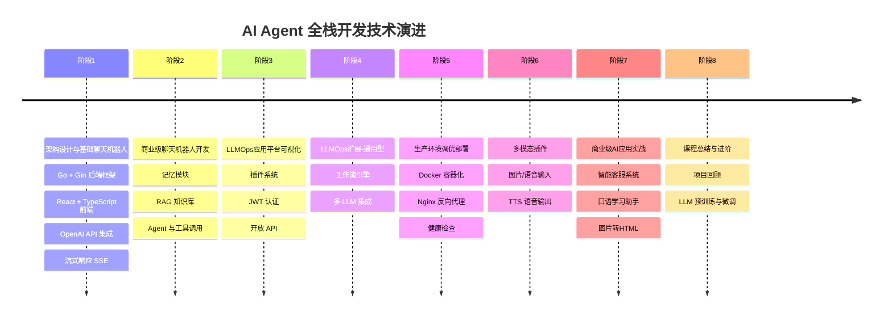
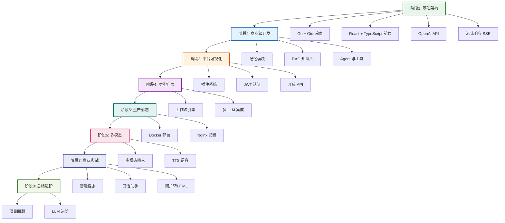
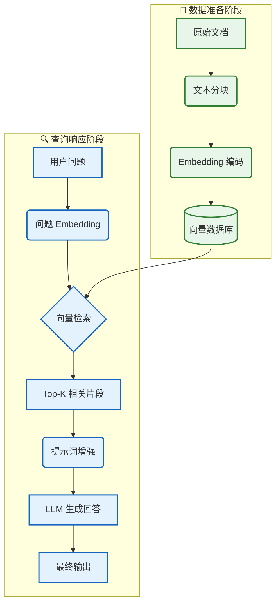
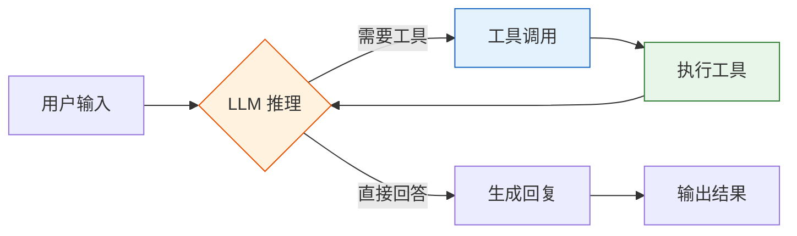

# 🚀 AI Agent 全栈开发工程师学习指南

> 📖 **从零到一构建商业级 AI Agent 应用，掌握 LLMOps 全栈开发技能**
> 技术栈：**Go Gin + React 19 + TypeScript + Docker**

---

> 🎯 **学习目标**：打通 AI 应用开发的"任督二脉"，实现从 0 到 1 的突破，掌握生产级 AI Agent 全栈开发能力。

### 💡 你将学到
- 大语言模型（LLM）的核心原理与关键参数调优
- [Go Gin](https://gin-gonic.com) 后端框架构建高性能 API 服务
- [LangChain Go](https://github.com/tmc/langchaingo) 实现 RAG、Agent、工具调用
- [React 19](https://react.dev) + [TypeScript](https://www.typescriptlang.org) 前端开发
- [Docker](https://www.docker.com) 容器化部署与 CI/CD 流程
- 生产级安全策略、性能优化、监控运维

### 🔗 前置知识
- **[Go](https://go.dev)**：基础语法、并发编程、接口
- **[React](https://react.dev)**：Hooks、组件化思维、状态管理
- **[TypeScript](https://www.typescriptlang.org)**：泛型、接口、类型推断
- 完成后可继续学习 → [阶段1：架构设计与基础聊天机器人开发](./阶段1-架构设计与基础聊天机器人开发.md)

### 📚 核心能力指标
- [ ] 理解大语言模型（LLM）的 Token 机制与上下文窗口
- [ ] 掌握 Go Gin 后端框架构建 RESTful API
- [ ] 使用 LangChain Go 实现 RAG 知识库与 Agent 工具调用
- [ ] 构建 React 19 + TypeScript 前端应用
- [ ] 实现 Docker 容器化部署与 CI/CD 自动化
- [ ] 建立完整的错误处理、日志、监控体系

---

## 📈 课程技术发展时间线

---

## 🗺️ 学习路线图总览

---

## 📚 课程内容总览

| 阶段 | 名称 | 视频数 | 核心技术 | 学习目标 |
|:---:|:---|:---:|:---|:---|
| 1 | 架构设计与基础聊天机器人开发 | 49 | Go, Gin, React, TypeScript, OpenAI | 搭建环境，实现第一个聊天机器人 |
| 2 | 商业级聊天机器人开发 | 101 | 记忆模块, RAG, Agent, LangChain Go | 实现记忆、知识库、插件功能 |
| 3 | LLMOps应用平台可视化 | 162 | 插件系统, JWT, 开放 API | 构建完整的 LLMOps 平台 |
| 4 | LLMOps扩展-实现通用型 | 80 | 工作流, 多 LLM 集成 | 实现工作流引擎和多模型支持 |
| 5 | 前端调优及生产环境调优部署 | 46 | Docker, Nginx, 健康检查 | 完成生产环境部署与优化 |
| 6 | LLMOps应用平台多模态插件 | 24 | 多模态, TTS | 实现多模态输入输出功能 |
| 7 | 火热五大商业级AI应用实战 | 45 | 智能客服, 口语助手 | 实战商业级 AI 应用开发 |
| 8 | 课程总结与LLM大语言模型进阶 | 17 | LLM 预训练, 微调 | 深入理解 LLM 原理与进阶 |

---

## 🧠 核心概念解析

### 🤖 大语言模型基础

**💡 什么是 LLM？**
大语言模型是基于 Transformer 架构的深度神经网络，通过在海量文本上进行预训练，学习语言的统计规律和语义表示。
- **核心机制**：Next Token Prediction（预测下一个词元）
- **上下文窗口**：模型一次能处理的 Token 数量上限（如 4K, 8K, 128K）
- **参数规模**：从 7B (70亿) 到 1T (1万亿) 不等，参数量越大，理解与生成能力越强。

**⚙️ 关键参数调优指南**

| 参数 | 作用域 | 推荐值 | 调优建议 |
|:---|:---|:---:|:---|
| `temperature` | 创造性 | `0.7-0.9` | 创意写作调高 (0.8)，事实问答调低 (0.2) |
| `max_tokens` | 长度限制 | `512-2048` | 根据业务需求设定，避免截断或浪费 |
| `top_p` | 采样范围 | `0.9` | 与 temperature 配合使用，通常二选一调整 |
| `frequency_penalty` | 去重 | `0.3-0.7` | 防止模型重复输出相同短语 |
| `presence_penalty` | 多样性 | `0.1-0.5` | 鼓励模型探索新话题，避免死循环 |

> **💡 推荐组合**：
> - 代码/数学 → Temperature=0.1, Top-P=0.1（精确）
> - 翻译/摘要 → Temperature=0.3, Top-P=0.5（平衡）
> - 创意写作 → Temperature=0.8, Top-P=0.9（多样）
> - 通用聊天 → Temperature=0.7, Top-P=0.9

---

### 🏗️ RAG 架构全景图

**RAG 核心概念对照表**

| 概念 | 通俗解释 | 技术实现 |
|:---|:---|:---|
| **Embedding** | 将文字翻译成数学坐标 | `text-embedding-3-small` (1536 维) |
| **向量数据库** | 语义搜索引擎 | Milvus, Pinecone, Chroma |
| **相似度** | 坐标轴上的距离 | 余弦相似度 (Cosine Similarity) |
| **分块 (Chunking)** | 把长文章切成小段落 | 固定长度、递归字符、语义分块 |
| **上下文窗口** | LLM 的短期记忆容量 | 4K, 8K, 32K, 128K Tokens |

> **⚠️ 最佳实践**：生产环境务必使用**流式调用**，显著降低首字延迟 (TTFT)，提升用户体验。

---

### 🤖 Agent 设计原理

**Agent 核心能力**

| 能力 | 说明 | 实现方式 |
|:---|:---|:---|
| **推理** | 理解问题并制定计划 | Chain-of-Thought Prompting |
| **工具调用** | 调用外部 API 或函数 | Function Calling |
| **记忆** | 记住对话历史和上下文 | BufferMemory, SummaryMemory |
| **规划** | 分解复杂任务为子任务 | LangGraph 工作流 |

---

## 🛠️ 技术栈清单

### 🤖 AI SDK & 模型调用

| 技术 | 用途 | 涉及阶段 |
|:---|:---|:---|
| OpenAI API | GPT 模型调用 | 阶段1-8 |
| LangChain Go | LLM 应用开发框架 | 阶段1-8 |
| go-openai | Go OpenAI SDK | 阶段1-8 |

### 🗄️ 数据库

| 技术 | 用途 | 涉及阶段 |
|:---|:---|:---|
| PostgreSQL | 关系型数据库 | 阶段1-8 |
| Milvus | 向量数据库 | 阶段2-5 |
| Redis | 缓存与消息代理 | 阶段3-5 |

### 🎨 前端技术

| 技术 | 用途 | 涉及阶段 |
|:---|:---|:---|
| React 19 | 前端框架 | 阶段3-7 |
| TypeScript | 类型安全 | 阶段1-8 |
| Ant Design | UI 组件库 | 阶段3-7 |
| Zustand | 状态管理 | 阶段3-7 |
| Vite | 构建工具 | 阶段3-7 |

### 🔧 后端技术

| 技术 | 用途 | 涉及阶段 |
|:---|:---|:---|
| Go | 编程语言 | 阶段1-8 |
| Gin | Web 框架 | 阶段1-8 |
| JWT | 认证授权 | 阶段3-5 |

### 🚀 部署技术

| 技术 | 用途 | 涉及阶段 |
|:---|:---|:---|
| Docker | 容器化部署 | 阶段5 |
| Nginx | 反向代理 | 阶段5 |
| GitHub Actions | CI/CD | 阶段5 |

---

## 📊 视频统计

| 阶段 | 视频数 | 学习时长 | 难度 |
|:---|:---:|:---:|:---:|
| 阶段1：架构设计与基础聊天机器人开发 | 49 | ~20 小时 | ⭐⭐ |
| 阶段2：商业级聊天机器人开发 | 101 | ~40 小时 | ⭐⭐⭐ |
| 阶段3：LLMOps应用平台可视化 | 162 | ~65 小时 | ⭐⭐⭐⭐ |
| 阶段4：LLMOps扩展-实现通用型 | 80 | ~32 小时 | ⭐⭐⭐⭐ |
| 阶段5：前端调优及生产环境调优部署 | 46 | ~18 小时 | ⭐⭐⭐ |
| 阶段6：LLMOps应用平台多模态插件 | 24 | ~10 小时 | ⭐⭐⭐ |
| 阶段7：火热五大商业级AI应用实战 | 45 | ~18 小时 | ⭐⭐⭐⭐ |
| 阶段8：课程总结与LLM大语言模型进阶 | 17 | ~7 小时 | ⭐⭐ |
| **总计** | **524** | **~210 小时** | - |

---

## 📖 详细教程

### 🟢 入门阶段
- [阶段1：架构设计与基础聊天机器人开发](./阶段1-架构设计与基础聊天机器人开发.md)

### 🔵 进阶阶段
- [阶段2：商业级聊天机器人开发](./阶段2-商业级聊天机器人开发.md)

### 🟠 高级阶段
- [阶段3：LLMOps应用平台可视化](./阶段3-LLMOps应用平台可视化.md)

### 🔴 专家阶段
- [阶段4-8：扩展部署与实战](./阶段4-8-扩展部署与实战.md)

---

## 🎓 学习建议

### 阶段一：基础入门（1-2 周）

- [ ] 搭建 Go + Gin 开发环境
- [ ] 实现第一个 GPT 聊天机器人 API
- [ ] 搭建 React + TypeScript 前端项目
- [ ] 实现流式聊天功能

### 阶段二：进阶实战（3-4 周）

- [ ] 实现记忆模块
- [ ] 掌握 RAG 知识库开发
- [ ] 学习 Agent 设计与工具调用

### 阶段三：平台开发（5-8 周）

- [ ] 构建完整的 LLMOps 平台
- [ ] 掌握插件系统、JWT 认证
- [ ] 实现开放 API

### 阶段四：扩展与部署（9-10 周）

- [ ] 实现工作流引擎
- [ ] 掌握多 LLM 集成
- [ ] 完成 Docker 生产环境部署

### 阶段五：实战与进阶（11-12 周）

- [ ] 实战商业级 AI 应用
- [ ] 深入理解 LLM 原理
- [ ] 构建个人 AI Agent 项目

---

## 🔗 相关资源

### 官方文档
- [Go](https://go.dev)
- [Gin](https://gin-gonic.com)
- [React](https://react.dev)
- [TypeScript](https://www.typescriptlang.org)
- [LangChain Go](https://github.com/tmc/langchaingo)
- [OpenAI API](https://platform.openai.com/docs)

### 开源项目
- [Dify](https://github.com/langgenius/dify)
- [FastGPT](https://github.com/labring/FastGPT)
- [LangChain Go](https://github.com/tmc/langchaingo)

---

> 💡 **学习建议**: 边学边做，每个阶段完成后都要动手实践，巩固所学知识。遇到问题时，善用官方文档和社区资源。
