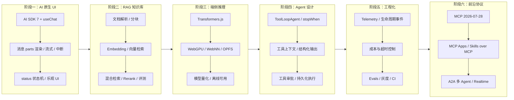

# AI Agent 全栈开发 · 前端转型指南

> **定位**：面向有 React/TS 基础的前端开发者，从零到一构建生产级 AI Agent 应用的学习路径。
>
> **前置要求**：熟悉 TypeScript + React Hooks，了解 HTTP/API 基本概念。不需要机器学习背景。
>
> **技术基线**：本文档对齐 **AI SDK 7**（2026-06 发布）、**MCP 规范 2026-07-28**、**A2A（Linux Foundation）**。
> 本仓库 `apps/ai-demo` 实际依赖 `ai@^7` + `@ai-sdk/react@^4`，文档示例与项目代码同版本。

---

## 一句话理解

| 前端传统开发 | AI Agent 开发 |
|---|---|
| 用户点击 → 代码执行 → UI 更新 | 用户输入 → LLM 推理 + 工具调用 → 结构化输出 |
| 路由定义页面跳转 | Prompt + Context 定义"智能行为" |
| API 调用后端 | Agent 编排 LLM + 工具 + 记忆 |
| CSS 控制视觉 | Architecture 控制智能边界 |

**核心公式**：`Agent = LLM（大脑）+ Tools（手脚）+ Memory（记忆）+ Planning（规划）`

2026 年的补充：还缺一层 **Context Engineering（上下文工程）** —— 决定「什么信息在什么时刻进入模型视野」，
它和 Prompt 一样是工程产物，而不是随手拼接的字符串。

---

## 学习路径：六阶段进阶



### 每个阶段对应文档

| 阶段 | 文档 | 时间投入 | 产出物 |
|:---|:---|:---:|:---|
| **① AI 原生 UI** | [实战篇 01](./实战篇/01-入门期-AI聊天室.md) | 1-2 周 | 生产级流式聊天应用 |
| **② RAG 知识库** | [实战篇 02](./实战篇/02-进阶期-RAG应用.md) | 2-3 周 | 支持 PDF/Word 的知识问答系统 |
| **③ 端侧推理** | [实战篇 03](./实战篇/03-深耕期-端侧推理.md) | 2 周 | 浏览器内可运行的 AI 模型 |
| **④ Agent 设计** | [实战篇 04](./实战篇/04-专家期-Agent设计.md) | 3-4 周 | 带审批与持久化的自主 Agent |
| **⑤ 工程化** | [实战篇 05](./实战篇/05-生产化与工程化.md) | 持续 | 可观测、可评估、有成本上限的生产系统 |
| **⑥ 前沿协议** | [实战篇 06](./实战篇/06-前沿技术与生态.md) | 持续 | MCP / MCP Apps / A2A 多 Agent 系统 |

> **AI SDK 专项**：[实战篇 09](./实战篇/09-AI%20SDK%20数据连接与聊天.md) 是贯穿全部阶段的
> API 参考手册，建议边学边查。

---

## 与现有项目的映射关系

本项目 (`interview-demo`) 已实现以下 AI 能力，可作为**生产级参考实现**。
文档中凡出现「项目对照」标记，均可直接打开对应文件对照阅读。

| 文档章节 | 代码实现位置 | 技术点 |
|---|---|---|
| AI 原生 UI | `apps/ai-demo/src/components/Chat.tsx` | Ant Design X（Bubble/Sender/Conversations）+ Zustand 聊天 store |
| AI SDK 集成 | `apps/ai-demo/src/components/AISDKDemo.tsx` | `streamText` + `toUIMessageStreamResponse()` + Gemini 流式 |
| RAG 知识库 | `backend/internal/knowledge/` | 文档加载 / 分块 / 嵌入 / 向量检索 |
| Agent | `backend/internal/agent/` | ReAct 流式 + Function Calling + Multi-Agent |
| 对话记忆 | `backend/internal/memory/` | 多轮会话记忆管理 |
| 流式通信 | `backend/internal/chat/`（SSE）+ `backend/internal/sse/` | 流式响应 + 日志流 |
| 端侧推理 | [实战篇 03](./实战篇/03-深耕期-端侧推理.md) | Transformers.js + WebGPU + 量化 |
| 安全与评估 | [实战篇 05](./实战篇/05-生产化与工程化.md) | 输入校验 + 遥测 + 成本控制 |
| 性能监控 | `apps/frontend/src/monitor/` + `backend/internal/vitals/` | Web Vitals 采集与聚合 |

> ⚠️ 注意路径：`ai-demo` 的源码在 `apps/ai-demo/src/` 下（含 `src/`），不是 `apps/ai-demo/`。

---

## 快速开始

### 1. 环境准备

```bash
# 本仓库统一使用 bun（不支持 npm）
bun install

# 独立起一个新项目时的最小依赖
bun add ai @ai-sdk/react @ai-sdk/openai zod          # AI SDK 7 核心
bun add @modelcontextprotocol/sdk                    # MCP 协议
bun add @langchain/core @langchain/community          # RAG（按需）
bun add @huggingface/transformers                     # 端侧推理（按需）
```

> `@xenova/transformers` 已迁移为 `@huggingface/transformers`；
> `ai/react` 子路径在 v5 起已移除，统一从 `@ai-sdk/react` 导入。

### 2. 推荐模型 Provider（按场景）

> 价格与型号更新快，使用前请以各厂商官方定价页为准；下表给的是**选型思路**而非报价。

| 场景 | 推荐方向 | 说明 |
|---|---|---|
| 日常聊天 / 高并发 | 各家小尺寸模型（如 `gpt-5-mini` 级、`gemini-3.5-flash` 级、Haiku 级） | 首包延迟低、单价便宜 |
| 深度推理 | 带 reasoning 档位的旗舰模型 | AI SDK 7 用 `reasoning: 'low' \| 'medium' \| 'high'` 统一控制 |
| 长文档 / 长上下文 | 百万级上下文窗口的模型 | 单价低但注意 KV Cache 与 Prompt Caching |
| 中文优先 | 国产模型（DeepSeek / Qwen / GLM 等） | 中文语感与本地合规性更好 |
| 本地 / 离线 | Ollama + 量化小模型 | 零成本、数据不出内网 |

**用 AI Gateway 做统一入口**（推荐）：把模型路由、缓存、重试、限流收敛到网关，
业务代码只写 `model: 'anthropic/claude-sonnet-4-6'` 这类字符串，切换厂商不改代码。

### 3. 第一个 Hello World：3 分钟跑通聊天

服务端（Next.js App Router）：

```typescript
// app/api/chat/route.ts
import { openai } from '@ai-sdk/openai';
import { convertToModelMessages, streamText, type UIMessage } from 'ai';

export async function POST(req: Request) {
  const { messages }: { messages: UIMessage[] } = await req.json();

  const result = streamText({
    model: openai('gpt-5-mini'),
    messages: convertToModelMessages(messages),
    system: '你是一个有帮助的助手。回答简洁，使用 Markdown。',
    // 有工具时务必设置停止条件，否则可能无限循环烧钱
    stopWhen: stepCountIs(5),
  });

  return result.toUIMessageStreamResponse();
}
```

客户端：

```tsx
// components/Chat.tsx
'use client';
import { useChat } from '@ai-sdk/react';
import { DefaultChatTransport } from 'ai';
import { useState } from 'react';
import Markdown from 'react-markdown';
import remarkGfm from 'remark-gfm';

export default function Chat() {
  const [input, setInput] = useState('');

  const { messages, sendMessage, status, stop, error, regenerate } = useChat({
    transport: new DefaultChatTransport({ api: '/api/chat' }),
  });

  const busy = status === 'submitted' || status === 'streaming';

  return (
    <div className="flex flex-col h-screen">
      <div className="flex-1 overflow-y-auto p-4">
        {messages.map((m) => (
          <div key={m.id} className={m.role === 'user' ? 'text-right' : 'text-left'}>
            {m.parts.map((part, i) => {
              // 消息是 parts 数组，不是 content 字符串
              if (part.type !== 'text') return null;
              return (
                <div
                  key={i}
                  className={`inline-block rounded-lg p-3 my-1 max-w-[80%] text-left ${
                    m.role === 'user' ? 'bg-blue-500 text-white' : 'bg-gray-100'
                  }`}
                >
                  <Markdown remarkPlugins={[remarkGfm]}>{part.text}</Markdown>
                </div>
              );
            })}
          </div>
        ))}

        {error && (
          <div className="text-red-600">
            出错了。<button onClick={() => regenerate()}>重试</button>
          </div>
        )}
      </div>

      <form
        onSubmit={(e) => {
          e.preventDefault();
          if (!input.trim() || busy) return;
          sendMessage({ text: input });
          setInput('');
        }}
        className="p-4 border-t flex gap-2"
      >
        <input
          value={input}
          onChange={(e) => setInput(e.target.value)}
          placeholder="输入消息…"
          className="flex-1 px-4 py-2 border rounded"
        />
        {busy ? (
          <button type="button" onClick={() => stop()} className="px-4 py-2 bg-gray-400 text-white rounded">
            停止
          </button>
        ) : (
          <button type="submit" className="px-4 py-2 bg-blue-500 text-white rounded">
            发送
          </button>
        )}
      </form>
    </div>
  );
}
```

**这段代码和旧版教程的 4 个关键差异**（迁移时最容易踩）：

| 旧写法（AI SDK 4 及更早） | AI SDK 7 写法 |
|---|---|
| `useChat({ api })` | `useChat({ transport: new DefaultChatTransport({ api }) })` |
| `input / handleInputChange / handleSubmit` | 自己用 `useState` 管输入，`sendMessage({ text })` 发送 |
| `isLoading` | `status`：`'ready' \| 'submitted' \| 'streaming' \| 'error'` |
| `message.content` | `message.parts`（`text` / `tool-call` / `tool-result` / `reasoning` / `source`） |
| `toDataStreamResponse()` | `toUIMessageStreamResponse()` |
| `convertToCoreMessages()` | `convertToModelMessages()` |

---

## 术语速查表（前端视角翻译）

| AI 术语 | 前端类比 | 理解方式 |
|---|---|---|
| **Token** | DOM 节点 | LLM 处理文本的最小单位，1 Token ≈ 0.75 英文词 |
| **Context Window** | Virtual Scroll Window | 模型一次能"看到"的最大 Token 数 |
| **Embedding** | CSS Selector | 把文本转成数值向量，相似文本向量接近 |
| **Temperature** | CSS Animation Duration | 控制输出随机性：低=确定，高=创意 |
| **RAG** | CDN Cache | 给 LLM 外挂知识库，回答实时数据 |
| **Agent Loop** | React useEffect Cycle | while(停止条件未满足) → 推理 → 调工具 → 喂回结果 |
| **Tool Call** | Props 传递 | 模型输出结构化 JSON 描述要调用的函数 |
| **Fine-tuning** | 组件库定制 | 用特定数据微调模型，让它学会新"语言" |
| **KV Cache** | React.memo 缓存 | 缓存已计算的 K/V 矩阵，加速重复推理 |
| **Quantization** | 图片压缩 | FP32→INT4，模型体积缩小约 75%，质量轻微下降 |
| **Context Engineering** | 状态管理设计 | 决定什么信息在何时进入上下文，是 Agent 质量的主因 |
| **MCP** | USB-C 接口 | 工具/资源/提示词的标准化插拔协议 |
| **MCP App** | iframe 微前端 | MCP Server 返回的、渲染在会话里的沙箱化交互 UI |
| **A2A** | 服务间 HTTP | Agent 与 Agent 之间的通信协议 |

---

## 常见问题 FAQ

### Q: 我是前端开发者，学这些有什么用？

**A**: AI 正在重新定义前端开发的边界。你不再只是写 UI，而是在构建**智能交互层**——连接 LLM 和用户的桥梁。
具体落到前端身上的新增职责：流式渲染与中断、工具调用的可视化、人机审批 UI、
Agent 状态机（`status`）、Token 成本感知的交互设计、端侧推理。这些都不是后端能替你做的。

### Q: 需要懂机器学习吗？

**A**: **不需要**。大部分 AI 应用开发是"调用 API + 组装组件"，类似调用第三方服务。
只有模型训练/微调才需要 ML 知识，而且可以用成熟工具低代码完成。

### Q: 学多久能达到就业水平？

**A**: 按每周 10 小时计算（因人而异，仅作节奏参考）：
- 1 个月：能搭建带 RAG 的客服机器人
- 3 个月：能独立构建带工具调用与审批的 Agent
- 6 个月：能主导 AI 产品架构设计（含成本、评测、可观测）

### Q: 应该学 Vercel AI SDK 还是 LangChain？

**A**:
- **用户侧 UI 与流式** → AI SDK（原生 React 集成，parts 模型与流式体验最佳）
- **后端重编排** → LangChain / LangGraph（并行图、复杂记忆、多 reranker 流水线）
- **2026 的现实**：AI SDK 7 已经内置 agent loop（`ToolLoopAgent`）、停止条件、工具审批、
  持久化执行（`WorkflowAgent`），**过去"必须用 LangChain 才有 Agent"的理由已不成立**。
  建议先用 AI SDK 打底，遇到 AI SDK 覆盖不到的编排需求再引入 LangChain。

### Q: 文档里的版本号会不会又过时了？

**A**: 会。本文档只锁定**写作时的基线**（AI SDK 7 / MCP 2026-07-28），
凡是涉及价格、榜单分数、模型代次的内容都标注了「以官方为准」。
升级大版本时优先跑官方 codemod：

```bash
npx @ai-sdk/codemod v7      # AI SDK 6 → 7
```

---

## 资源导航

| 类型 | 资源 | 链接 |
|---|---|---|
| **总览文档** | [AI 推荐学习](./实战篇/00-AI推荐学习.md) | 术语表 + 工具清单 + 学习路线图 |
| **API 参考** | [AI SDK 数据连接与聊天](./实战篇/09-AI%20SDK%20数据连接与聊天.md) | AI SDK 7 全量 API 与实战 |
| **技术选型** | [选型对比合集](./实战篇/07-技术选型对比合集.md) | 框架/数据库/网关/部署横向对比 |
| **实战指南** | [开发实战手册](./实战篇/08-开发实战与架构指南.md) | 性能优化 / Prompt / 测试 / 部署 |
| **面试准备** | [面试篇基础](./面试篇/01-基础篇.md) | 覆盖全部知识点的题库 |
| **课程实战** | [课程实战索引](./课程实战/index.md) | RAG / MCP+A2A / Agent / 训练全链路 |
| **Go 服务端** | [LLM 阶段教程](./LLM/index.md) | Go + Gin 视角的 LLM 后端实现 |

---

## 版本记录

| 日期 | 变更 |
|---|---|
| 2026-09 | 全量校准至 AI SDK 7 + MCP 2026-07-28；示例对齐 `apps/ai-demo` 真实代码；修正死链与过时模型表 |
| 2026-07 | 重构为前端转型 Agent 体系化学习路径 |
