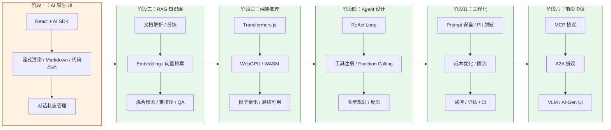

# AI Agent 全栈开发 · 前端转型指南

> **定位**：面向有 React/TS 基础的前端开发者，从零到一构建生产级 AI Agent 应用的学习路径。
> 
> **前置要求**：熟悉 TypeScript + React Hooks + Next.js，了解 HTTP/API 基本概念。不需要机器学习背景。

---

## 一句话理解

| 前端传统开发 | AI Agent 开发 |
|---|---|
| 用户点击 → 代码执行 → UI 更新 | 用户输入 → LLM 推理 + 工具调用 → 结构化输出 |
| 路由定义页面跳转 | Prompt + Context 定义"智能行为" |
| API 调用后端 | Agent 编排 LLM + 工具 + 记忆 |
| CSS 控制视觉 | Architecture 控制智能边界 |

**核心公式**：`Agent = LLM（大脑）+ Tools（手脚）+ Memory（记忆）+ Planning（规划）`

---

## 学习路径：六阶段进阶



### 每个阶段对应文档

| 阶段 | 文档 | 时间投入 | 产出物 |
|:---|:---|:---:|:---|
| **① AI 原生 UI** | [实战篇 01](./实战篇/01-入门期-AI聊天室.md) | 1-2 周 | 生产级流式聊天应用 |
| **② RAG 知识库** | [实战篇 02](./实战篇/02-进阶期-RAG应用.md) | 2-3 周 | 支持 PDF/Word 的知识问答系统 |
| **③ 端侧推理** | [实战篇 03](./实战篇/03-深耕期-端侧推理.md) | 2 周 | 浏览器内可运行的 AI 模型 |
| **④ Agent 设计** | [实战篇 04](./实战篇/04-专家期-Agent设计.md) | 3-4 周 | 具备工具调用能力的自主 Agent |
| **⑤ 工程化** | [实战篇 05](./实战篇/05-生产化与工程化.md) | 持续 | 可监控、可评估、安全的生产系统 |
| **⑥ 前沿协议** | [实战篇 06](./实战篇/06-前沿技术与生态.md) | 持续 | MCP/A2A 多 Agent 协作系统 |

---

## 与现有项目的映射关系

本项目 (`interview-demo`) 已实现以下 AI 能力，可作为**生产级参考实现**：

| 文档章节 | 代码实现位置 | 技术点 |
|---|---|---|
| AI 原生 UI | `apps/ai-demo/components/Chat.tsx` | Vercel AI SDK + Ant Design X Bubble/Sender |
| RAG 知识库 | `backend/internal/knowledge/` | BM25 + Vector 混合检索、文档解析、智能分块 |
| Agent | `backend/internal/agent/` | ReAct 流式 + Function Calling + Multi-Agent |
| 流式通信 | `backend/internal/chat/` + `frontend/src/utils/wsTransport.ts` | SSE 流式 + WebSocket 降级链 |
| 端侧推理 | `docs/S5-AI/实战篇/03-端侧推理.md` | Transformers.js + WebGPU + 模型量化 |
| 安全与评估 | `docs/S5-AI/实战篇/05-生产化与工程化.md` | PromptGuard + 遥测 + A/B 测试框架 |
| 网关架构 | `docs/S5-AI/实战篇/05-生产化与工程化.md` | Token Bucket 限流 + LRU 缓存 + SLO 定义 |

---

## 快速开始

### 1. 环境准备

```bash
# 核心依赖（按所需章节安装）
npm install ai @ai-sdk/openai @ai-sdk/react          # AI 聊天
npm install langchain @langchain/openai              # RAG
npm install @huggingface/transformers                  # 端侧推理
npm install @modelcontextprotocol/sdk                  # MCP 协议
```

### 2. 推荐模型 Provider（按场景）

| 场景 | 推荐模型 | API 提供商 | 成本控制 |
|---|---|---|---|
| 日常聊天 | GPT-4o-mini / Claude Haiku | OpenAI / Anthropic | $0.1-0.3/百万 tokens |
| 深度推理 | GPT-o1 / Claude Opus | OpenAI / Anthropic | $15/百万 tokens |
| 中文优先 | Qwen 2.5 / DeepSeek | 阿里云 / DeepSeek API | $0.27/百万 tokens |
| 本地推理 | Qwen2.5-0.5B (q4) | Ollama 本地 | 免费 |

### 3. 第一个 Hello World：3 分钟跑通聊天

```bash
# 创建项目
npx create-next-app@latest my-ai-chat --typescript --tailwind --app
cd my-ai-chat
npm install ai @ai-sdk/openai react-markdown remark-gfm

# 创建 API Route: app/api/chat/route.ts
```

```typescript
// app/api/chat/route.ts
import { openai } from '@ai-sdk/openai';
import { streamText } from 'ai';

export async function POST(req: Request) {
  const { messages } = await req.json();
  const result = streamText({
    model: openai('gpt-4o-mini'),
    messages,
    system: '你是一个有帮助的助手',
  });
  return result.toUIMessageStreamResponse();
}
```

```tsx
// components/Chat.tsx
'use client';
import { useChat } from '@ai-sdk/react';
import ReactMarkdown from 'react-markdown';

export default function Chat() {
  const { messages, input, handleSubmit, isLoading } = useChat();
  return (
    <div className="flex flex-col h-screen">
      {messages.map(m => (
        <div key={m.id} className={m.role === 'user' ? 'text-right' : 'text-left'}>
          <div className={`inline-block rounded-lg p-3 max-w-[80%] ${
            m.role === 'user' ? 'bg-blue-500 text-white ml-auto' : 'bg-gray-100'
          }`}>
            {m.role === 'assistant' ? (
              <ReactMarkdown>{m.content}</ReactMarkdown>
            ) : (
              m.content
            )}
          </div>
        </div>
      ))}
      <form onSubmit={handleSubmit} className="p-4 border-t">
        <input value={input} onChange={e => {} /* bind input */} placeholder="输入消息..." className="flex-1 px-4 py-2 border rounded" />
        <button type="submit" disabled={isLoading} className="ml-2 px-4 py-2 bg-blue-500 text-white rounded">发送</button>
      </form>
    </div>
  );
}
```

---

## 术语速查表（前端视角翻译）

| AI 术语 | 前端类比 | 理解方式 |
|---|---|---|
| **Token** | DOM 节点 | LLM 处理文本的最小单位，1 Token ≈ 0.75 英文词 |
| **Context Window** | Virtual Scroll Window | 模型一次能"看到"的最大 Token 数 |
| **Embedding** | CSS Selector | 把文本转成数值向量，相似文本向量接近 |
| **Temperature** | CSS Animation Duration | 控制输出随机性：低=确定，高=创意 |
| **RAG** | CDN Cache | 给 LLM 外挂知识库，回答实时数据 |
| **Agent Loop** | React useEffect Cycle | while(工具调用) → 执行 → 喂回 → 再想 |
| **Function Calling** | Props 传递 | LLM 输出结构化 JSON 描述要调用的函数 |
| **Fine-tuning** | 组件库定制 | 用特定数据微调模型，让它学会新"语言" |
| **KV Cache** | React.memo 缓存 | 缓存已计算的 K/V 矩阵，加速重复推理 |
| **Quantization** | 图片压缩 | FP32→INT4，模型体积缩小 75%，质量轻微下降 |

---

## 常见问题 FAQ

### Q: 我是前端开发者，学这些有什么用？

**A**: AI 正在重新定义前端开发的边界。你不再只是写 UI，而是在构建**智能交互层**——连接 LLM 和用户的桥梁。掌握 AI Agent 开发后：
- 薪资溢价 20-40%（招聘市场数据）
- 可从"组件开发"升级到"系统设计"
- 具备独立构建 AI SaaS 产品的能力

### Q: 需要懂机器学习吗？

**A**: **不需要**。大部分 AI 应用开发是"调用 API + 组装组件"，类似调用第三方服务。只有模型训练/微调才需要 ML 知识，而且可以用 LLaMA-Factory 等工具零代码完成。

### Q: 学多久能达到就业水平？

**A**: 按每周 10 小时计算：
- 1 个月：能搭建带 RAG 的客服机器人
- 3 个月：能独立构建 Agent 工作流
- 6 个月：能主导 AI 产品架构设计

### Q: 应该学 Vercel AI SDK 还是 LangChain？

**A**: 
- **前端 UI 层** → Vercel AI SDK（原生 React 集成，流式体验最佳）
- **后端逻辑层** → LangChain（丰富的工具链、RAG 组件、Agent 编排）
- **推荐组合**：AI SDK (前端) + LangChain (后端)，两者互补

---

## 资源导航

| 类型 | 资源 | 链接 |
|---|---|---|
| **总览文档** | [AI 推荐学习](./实战篇/00-AI推荐学习.md) | 术语表 + 工具清单 + 学习路线图 |
| **技术选型** | [选型对比合集](./实战篇/07-技术选型对比合集.md) | 框架/数据库/网关/部署横向对比 |
| **实战指南** | [开发实战手册](./实战篇/08-开发实战与架构指南.md) | 性能优化 / Prompt / 测试 / 部署 |
| **面试准备** | [面试篇目录](./面试篇/01-基础篇.md) | 八套面试题覆盖全部知识点 |
| **课程实战** | [课程实战索引](./课程实战/index.md) | RAG / MCP+A2A / Agent / 微调全链路 |

---

## 版本记录

| 日期 | 变更 |
|---|---|
| 2026-07 | 重构为前端转型 Agent 体系化学习路径，对齐 2025-2026 AI 前沿生态 |
