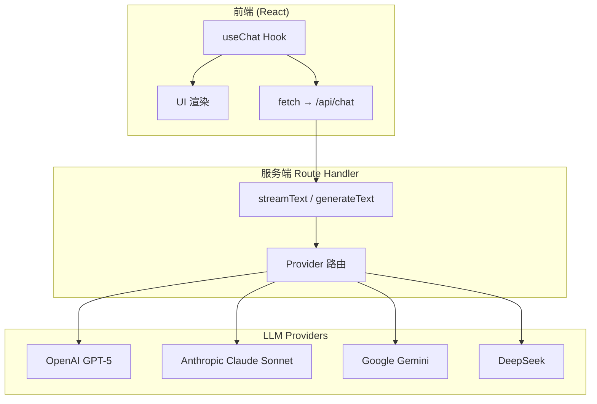
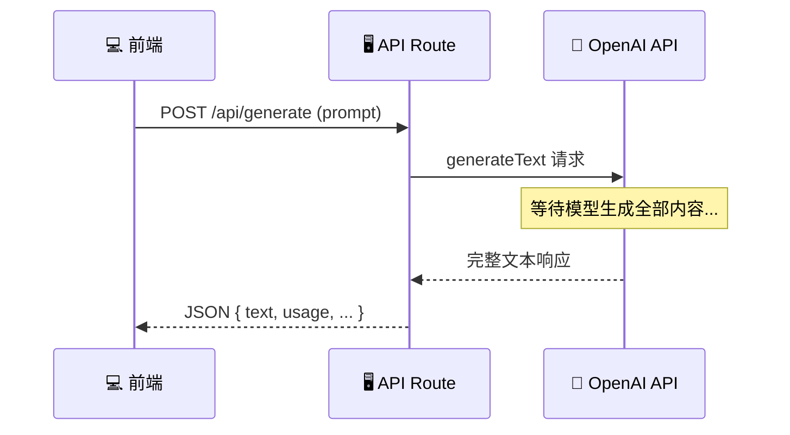
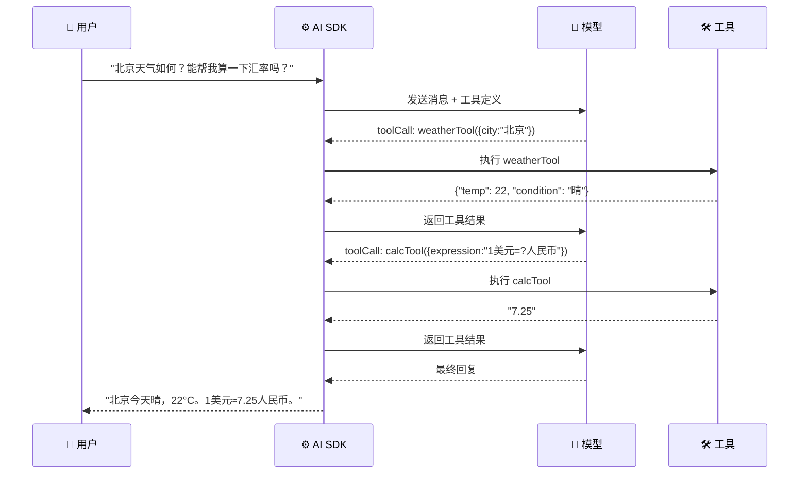
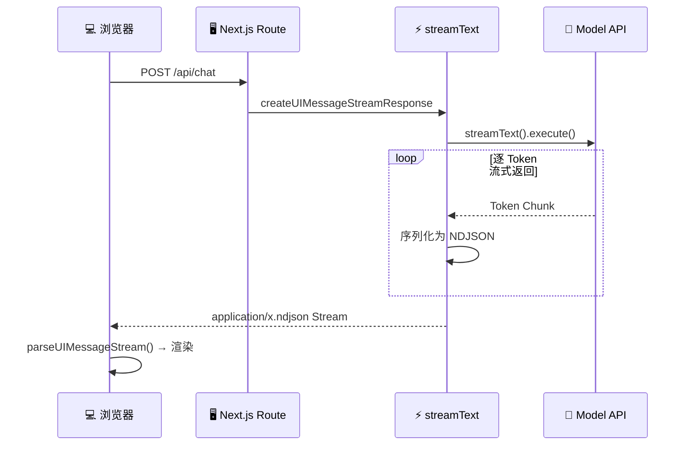

# 🟠 AI SDK 数据连接与聊天

> 📖 **本文档为《AI 前端开发体系化学习指南》的专题文档**
> 完整指南请查看：[学习指南总览](./index.md)

---

> 🎯 **学习目标**：掌握 Vercel AI SDK (`ai` v7) 的核心 API——从多模型 Provider 连接，到流式生成、结构化输出、Tool Calling，再到 React UI Hook 和 UIMessageStream 协议，打通"数据接入 → 模型调用 → 前端展示"全链路。

### 💡 你将学到
- Provider 多模型连接（OpenAI / Anthropic / Google）的统一接口
- `generateText` 同步生成与 `streamText` 流式生成的使用场景
- `Output.object()` / `Output.array()` / `Output.choice()` 结构化数据生成
- Tool Calling 完整流程（`tool()` + `inputSchema` + `execute` + `stopWhen`）
- React 客户端 `useChat` Hook 与 Transport 配置
- `UIMessageStream` 协议（`createUIMessageStream` + `createUIMessageStreamResponse`）
- 消息格式转换（`convertToModelMessages` + `pruneMessages`）
- Provider Options 和各模型特有参数
- 实用工具（`smoothStream` / `generateId` / `createIdGenerator`）

### 🔗 前置知识
- 完成 [🟢 阶段一：入门期 - AI 聊天室](./01-入门期-AI聊天室.md)
- 熟悉 React Hooks（useState, useEffect）
- 了解 Zod 基础用法

### 📚 核心能力指标
- [ ] 使用统一接口连接多种 LLM Provider
- [ ] 实现同步/流式文本生成
- [ ] 使用 Zod Schema 获取类型安全的结构化 JSON 输出
- [ ] 定义并执行 Tool Calling（含多步调用控制）
- [ ] 用 `useChat` 构建生产级 React 聊天界面
- [ ] 实现 UIMessageStream 服务端响应
- [ ] 正确处理消息格式转换

---

## 🧠 核心概念解析

### 11.1 AI SDK 是什么？

**💡 Vercel AI SDK 是全栈 TypeScript AI 开发工具包**

它提供了一套**统一的 API** 连接不同的 LLM 提供商（OpenAI、Anthropic、Google、DeepSeek 等），同时在客户端提供 React Hooks 快速构建聊天 UI。



**为什么用 AI SDK 而不是直接调 OpenAI API？**

| 维度 | 直接调 API | 使用 AI SDK |
|:---|:---|:---|
| **多模型切换** | 需手写抽象层 | 一行换 model |
| **流式响应** | 手动解析 SSE/NDJSON | 内置 streamText + UIMessageStream |
| **React 集成** | 手动管理状态 | useChat Hook 统一管理 |
| **结构化输出** | 自行解析+校验 JSON | Output.object() + Zod 自动校验 |
| **Tool Calling** | 手动编排循环 | tool() + 自动多步循环 |
| **消息格式** | 各模型不同 | convertToModelMessages 自动适配 |

> ⚠️ **版本说明**：本文基于 AI SDK v7（2026+）。v7 的关键变化：
> - `@ai-sdk/react` 成为独立包（不再藏在 `ai/react` 子路径中）
> - 流式协议统一为 **UIMessageStream**
> - `streamText().onFinish()` 被弃用，改用 `onEnd` 回调
> - `toUIMessageStreamResponse()` 替代旧的 `toDataStreamResponse()`

---

### 11.2 Provider 多模型连接

**🔌 统一接口，一个 Provider = 一行代码**

AI SDK 通过独立的 provider 包连接不同 LLM，所有 provider 暴露相同的 `LanguageModel` 接口。

```bash
# 📦 安装核心包 + Provider
npm install ai @ai-sdk/react
npm install @ai-sdk/openai      # OpenAI
npm install @ai-sdk/anthropic   # Anthropic
npm install @ai-sdk/google      # Google Gemini
npm install @ai-sdk/deepseek    # DeepSeek
```

```typescript
// lib/ai/providers.ts — 统一导出所有 Provider
import { openai } from '@ai-sdk/openai';
import { anthropic } from '@ai-sdk/anthropic';
import { google } from '@ai-sdk/google';
import { deepseek } from '@ai-sdk/deepseek';

// 🤖 按能力命名的模型实例
export const models = {
  fast:        openai('gpt-5-chat-latest'),     // 日常对话、快速响应
  reasoning:   anthropic('claude-opus-4-8'),     // 深度推理、复杂分析
  creative:    anthropic('claude-sonnet-5'),     // 创意写作、长文生成
  vision:      openai('gpt-5'),                  // 视觉理解
  multimodal:  google('gemini-2.5-flash'),       // 多模态
  costEffective: openai('gpt-5-nano'),           // 低成本批量任务
};

// 🔄 运行时动态选择模型
export function getModel(taskType: 'quick' | 'complex' | 'creative'): ReturnType<typeof openai> | any {
  switch (taskType) {
    case 'quick':    return models.fast;
    case 'complex':  return models.reasoning;
    case 'creative': return models.creative;
    default:         return models.fast;
  }
}

// 🏗️ 自定义 OpenAI 兼容端点（如本地 Ollama）
import { createOpenAI } from '@ai-sdk/openai';
const ollama = createOpenAI({
  baseURL: 'http://localhost:11434/v1',
  name: 'ollama',
});
export const localModel = ollama.chat('qwen2.5:7b');
```

> 💡 **选型建议**：
> - 日常对话 → `gpt-5-chat-latest`（快、便宜、质量好）
> - 深度推理 → `claude-opus-4-8` / `o4-mini`
> - 创意写作 → `claude-sonnet-5`
> - 低成本批量 → `gpt-5-nano`

---

### 11.3 generateText — 同步生成

**⚡ 一次性获取完整回答（非流式）**

适用于：后端服务间调用、短答案生成、需要完整响应后再处理的场景。

```typescript
// app/api/generate/route.ts
import { generateText, Output } from 'ai';
import { openai } from '@ai-sdk/openai';
import { z } from 'zod';

export async function POST(req: Request) {
  const { prompt } = await req.json();

  // ✅ 同步生成：等待完整响应后返回
  const result = await generateText({
    model: openai('gpt-5-chat-latest'),
    instructions: '你是一个简洁专业的 AI 助手。',
    prompt,
    temperature: 0.7,
    maxOutputTokens: 1024,
    abortSignal: req.signal,  // 🛑 支持请求取消
  });

  // 📤 返回完整文本 + 使用统计 + 元信息
  return Response.json({
    text: result.text,                   // 最终生成的文本
    usage: result.usage,                 // { inputTokens, outputTokens, totalTokens }
    finishReason: result.finishReason,   // 'stop' | 'length' | 'content-filter' | 'tool-calls'
    toolCalls: result.toolCalls,         // 工具调用（如果有）
    toolResults: result.toolResults,
    steps: result.steps,                 // 每步详情（含性能指标）
  });
}
```



**对比流式：**

| 特性 | generateText | streamText |
|:---|:---|:---|
| 延迟 | 首字 ≈ 完字（3-30s） | 首字 < 1s，逐字渲染 |
| 内存 | 占用较高（缓存全文） | 较低（边生成边消费） |
| 可中断 | ✅ AbortController | ✅ AbortController |
| 适用场景 | 后端任务、短答案 | 聊天界面、长回答 |

---

### 11.4 streamText — 流式生成

**🌊 打字机效果的核心引擎**

```typescript
// app/api/chat/route.ts
import { streamText, smoothStream, pruneMessages } from 'ai';
import { openai } from '@ai-sdk/openai';

export const maxDuration = 60;

export async function POST(req: Request) {
  const { messages }: { messages: any[] } = await req.json();

  const result = streamText({
    model: openai('gpt-5-chat-latest'),
    // 📨 将 UI 消息格式转为模型消息格式（详见 11.9）
    messages: await convertToModelMessages(messages),
    instructions: `你是一个专业的 AI 助手。请用简洁准确的语言回答问题。`,
    temperature: 0.7,
    maxOutputTokens: 4096,

    // ⏱️ 平滑流式输出（模拟人类打字速度）
    experimental_transform: smoothStream({
      delayInMs: 10,            // 每个 token 间隔 ms
      chunking: new Intl.Segmenter('zh-CN', { granularity: 'word' }), // 中文分词
    }),

    // 🎣 生命周期回调
    onChunk({ chunk }) {
      if (chunk.type === 'text-delta') {
        // 每收到一段文本 delta
      }
      if (chunk.type === 'tool-call') {
        console.log(`调用工具: ${chunk.toolName}`);
      }
    },
    onError({ error }) {
      console.error('流式错误:', error);
    },
    onEnd({ text, totalUsage, finishReason }) {
      // 📊 生成完成后：写入数据库、更新 Token 计数
      console.log(`✅ 完成: 输入 ${totalUsage.inputTokens}, 输出 ${totalUsage.outputTokens}`);
    },
  });

  // 📡 方案 A（推荐）：直接返回 UIMessageStream 响应
  return result.toUIMessageStreamResponse();
}
```

**streamText 返回的 Promise 属性**

当流结束后，以下属性会自动 resolve：

| 属性 | 类型 | 说明 |
|:---|:---|:---|
| `result.text` | `string` | 最终生成的完整文本 |
| `result.content` | `ContentPart[]` | 所有步骤的内容数组（text/toolCall/toolResult） |
| `result.usage` | `LanguageModelUsage` | 最后一步的 token 用量 |
| `result.totalUsage` | `LanguageModelUsage` | 所有步骤的累计用量 |
| `result.finishReason` | `string` | 结束原因 |
| `result.toolCalls` | `ToolCall[]` | 所有工具调用 |
| `result.toolResults` | `ToolResult[]` | 所有工具结果 |
| `result.steps` | `StepResult[]` | 每步详情（含性能指标） |
| `result.finalStep` | `StepResult` | 最后一步 |

**生命周期回调全景**

```typescript
const result = streamText({
  model: openai('gpt-5'),
  prompt,

  // ─── 阶段生命周期 ───
  onStart({ modelId, provider }) {
    console.log(`[${provider}/${modelId}] 开始生成`);
  },
  onStepStart({ stepNumber, modelId, messages }) {
    console.log(`第 ${stepNumber} 步开始 (${modelId})`);
  },
  onStepEnd({ stepNumber, finishReason, usage, performance }) {
    console.log(`第 ${stepNumber} 步完成: ${finishReason}, ${usage.totalTokens} tokens`);
  },
  onEnd({ text, totalUsage, finishReason }) {
    console.log(`全部完成: ${finishReason}`);
  },

  // ─── 调用级生命周期 ───
  onLanguageModelCallStart({ modelId, messageCount }) {
    console.log(`模型调用开始: ${modelId}, ${messageCount} 条消息`);
  },
  onLanguageModelCallEnd({ modelId, finishReason, content }) {
    console.log(`模型调用完成: ${modelId}, ${content.length} 个内容块`);
  },

  // ─── 工具执行生命周期 ───
  onToolExecutionStart({ toolCall }) {
    console.log(`执行工具: ${toolCall.toolName}`);
  },
  onToolExecutionEnd({ toolCall, toolExecutionMs, toolOutput }) {
    if (toolOutput.type === 'tool-error') {
      console.error(`工具执行失败: ${toolOutput.error}`);
    } else {
      console.log(`工具完成: ${toolCall.toolName} (${toolExecutionMs}ms)`);
    }
  },
});
```

**stream 迭代消费**

```typescript
for await (const part of result.stream) {
  switch (part.type) {
    case 'start':               console.log('流开始'); break;
    case 'start-step':          console.log(`新步骤 #${part.stepNumber}`); break;
    case 'text-start':          console.log('文本开始'); break;
    case 'text-delta':          process.stdout.write(part.text); break;
    case 'text-end':            console.log('\n文本结束'); break;
    case 'reasoning-start':     console.log('[推理开始]'); break;
    case 'reasoning-delta':     process.stdout.write(part.text); break;
    case 'reasoning-end':       console.log('[推理结束]'); break;
    case 'tool-call':           console.log(`工具: ${part.toolName}`, part.input); break;
    case 'tool-input-start':    console.log(`工具输入开始: ${part.toolName}`); break;
    case 'tool-input-delta':    process.stdout.write(part.delta); break;
    case 'tool-input-end':      console.log('工具输入结束'); break;
    case 'tool-result':         console.log(`工具结果: ${part.toolName}`, part.output); break;
    case 'finish-step':         console.log(`步骤结束: ${part.finishReason}`); break;
    case 'finish':              console.log('全部完成'); break;
    case 'error':               console.error('错误'); break;
  }
}
```

**流转换（Transform）**

`experimental_transform` 允许在流输出前进行处理：

```typescript
import { streamText, smoothStream } from 'ai';

const result = streamText({
  model: openai('gpt-5'),
  messages,
  experimental_transform: smoothStream({
    delayInMs: 10,
    chunking: new Intl.Segmenter('zh-CN', { granularity: 'word' }),
  }),
});
```

自定义转换示例（将输出转大写）：

```typescript
import { streamText, type TextStreamPart, type ToolSet } from 'ai';

const upperCaseTransform =
  <TOOLS extends ToolSet>() =>
  ({ stopStream }: { tools: TOOLS; stopStream: () => void }) =>
    new TransformStream<TextStreamPart<TOOLS>, TextStreamPart<TOOLS>>({
      transform(chunk, controller) {
        // 对 text-delta 做转换，其他类型透传
        controller.enqueue(
          chunk.type === 'text-delta'
            ? { ...chunk, text: chunk.text.toUpperCase() }
            : chunk,
        );
      },
    });

const result = streamText({
  model: openai('gpt-5'),
  messages,
  experimental_transform: upperCaseTransform(),
});
```

---

### 11.5 Structured Output — 结构化数据生成

**📋 用 Zod 定义 Schema，让模型输出类型安全的结构化数据**

> ⚠️ v7 中结构化输出已整合到 `generateText` 和 `streamText` 的 `output` 属性中，不再有独立的 `generateObject` / `streamObject` API。

```typescript
import { generateText, streamText, Output } from 'ai';
import { z } from 'zod';
import { openai } from '@ai-sdk/openai';

// 🏷️ 定义输出结构
const WeatherSchema = z.object({
  location: z.string().describe('城市名称'),
  temperature: z.number().describe('温度（摄氏度）'),
  condition: z.enum(['晴', '多云', '阴', '雨', '雪']),
  humidity: z.number().min(0).max(100),
});

// ========== 方式一：generateText 同步获取结构化输出 ==========
const { output } = await generateText({
  model: openai('gpt-5-chat-latest'),
  output: Output.object({
    schema: WeatherSchema,
  }),
  prompt: '查询北京的天气',
  temperature: 0,  // 结构化输出设 0 提高稳定性
});

console.log(output.location);     // "北京"
console.log(output.temperature);  // 22
```

```typescript
// ========== 方式二：streamText 流式获取结构化输出 ==========
const { partialOutputStream } = streamText({
  model: openai('gpt-5-chat-latest'),
  output: Output.object({
    schema: z.object({
      title: z.string(),
      summary: z.string(),
      tags: z.array(z.string()),
    }),
  }),
  prompt: '总结今天的新闻',
});

// 🌊 增量输出：每次新 token 到达时返回当前已解析的部分对象
for await (const partial of partialOutputStream) {
  console.log(partial); // { title: "今天", summary: "", tags: [] }
                        //      ↓
                        //      { title: "今天的", summary: "Today was", tags: [] }
                        //      ↓
                        //      { title: "今天的新闻", summary: "Today was a good day.", tags: ["news"] }
}
```

```typescript
// ========== Output.array() — 数组输出 ==========
const { output: articles } = await generateText({
  model: openai('gpt-5-chat-latest'),
  output: Output.array({
    element: z.object({
      title: z.string(),
      url: z.string().url(),
      score: z.number(),
    }),
  }),
  prompt: '列出今天 Top 5 的科技新闻',
});
// 类型: Array<{ title: string; url: string; score: number }>
```

```typescript
// ========== Output.choice() — 枚举选择 ==========
const { output: sentiment } = await generateText({
  model: openai('gpt-5-chat-latest'),
  output: Output.choice(['positive', 'neutral', 'negative']),
  prompt: '判断这句话的情感："今天的天气真不错！"',
});
// 类型: 'positive' | 'neutral' | 'negative'
```

```typescript
// ========== Output.json() — 自由 JSON（无 Schema 校验）==========
const { output: arbitraryJson } = await generateText({
  model: openai('gpt-5-chat-latest'),
  output: Output.json(),
  prompt: '返回用户画像 JSON',
});
// 类型: unknown，需自行校验
```

**结构化输出与 Tool Calling 结合**

```typescript
import { generateText, Output, tool, isStepCount } from 'ai';
import { z } from 'zod';
import { openai } from '@ai-sdk/openai';

const { output } = await generateText({
  model: openai('gpt-5-chat-latest'),
  tools: {
    weather: tool({
      description: '获取指定城市的天气',
      inputSchema: z.object({ city: z.string() }),
      execute: async ({ city }) => ({ temp: 22, condition: '晴' }),
    }),
  },
  output: Output.object({
    schema: z.object({
      summary: z.string(),
      recommendation: z.string(),
    }),
  }),
  stopWhen: isStepCount(5),  // 确保有足够步骤完成工具调用 + 输出
  prompt: '我今天应该穿什么？',
});
```

> ⚠️ **结构化输出步骤消耗**：生成结构化输出本身也算一步。使用 `stopWhen` 时需留出余量。

---

### 11.6 Tool Calling — 工具调用

**🛠️ 让 LLM 调用外部函数 / API**

```typescript
import { generateText, tool, isStepCount } from 'ai';
import { z } from 'zod';
import { openai } from '@ai-sdk/openai';

const weatherTool = tool({
  description: '搜索指定城市的实时天气信息',
  inputSchema: z.object({
    city: z.string().describe('城市名称，如"北京"、"上海"'),
    unit: z.enum(['celsius', 'fahrenheit']).default('celsius'),
  }),
  execute: async ({ city, unit }) => {
    // 🔌 调用真实 API
    const res = await fetch(`/api/weather?city=${city}&unit=${unit}`);
    return res.json();
  },
});

const calcTool = tool({
  description: '执行数学计算表达式',
  inputSchema: z.object({
    expression: z.string().describe('数学表达式，如 "2+2*3"'),
  }),
  execute: async ({ expression }) => {
    // ✅ 安全执行：使用 mathjs 替代 new Function()
    const math = await import('mathjs');
    return String(math.evaluate(expression));
  },
});
```

**多步 Tool Calling（AI SDK 自动处理 ReAct 循环）**

```typescript
const result = await generateText({
  model: openai('gpt-5-chat-latest'),
  messages,
  instructions: '你是智能助手，可以使用工具回答用户问题。',

  // 🧰 注册工具列表
  tools: { weatherTool, calcTool },

  // 🛑 停止条件：默认 isStepCount(1)，设为 >1 允许多步
  stopWhen: isStepCount(5),
});

// 📊 访问所有步骤的工具调用和结果
for (const step of result.steps) {
  console.log(`步骤 ${step.stepNumber}: 调用了 ${step.toolCalls.length} 个工具`);
  console.log('文本:', step.text);
}
```



**Tool Choice 控制**

```typescript
// 🔒 强制模型必须调用某个工具
await generateText({
  model: openai('gpt-5'),
  tools: { weatherTool },
  toolChoice: { type: 'tool', toolName: 'weatherTool' },
  prompt: '查天气',
});
```

**Tool Approval（Human-in-the-Loop）**

```typescript
// 🔐 敏感操作需用户批准
const result = await generateText({
  model: openai('gpt-5'),
  tools: { deleteFile },
  toolApproval: {
    deleteFile: 'user-approval',  // 执行前需人工确认
  },
  prompt: '删除 uploads/temp.pdf',
});

// 检查是否有需要审批的工具调用
for (const part of result.content) {
  if (part.type === 'tool-approval-request' && !part.isAutomatic) {
    console.log(`需要审批: ${part.approvalId}`);
    console.log(`工具: ${part.toolCall.toolName}`);
    // 展示给用户确认...
  }
}
```

**Dynamic Approval（根据参数动态决定是否需要审批）**

```typescript
const paymentTool = tool({
  description: '处理支付',
  inputSchema: z.object({ amount: z.number(), recipient: z.string() }),
  execute: async ({ amount, recipient }) => { /* ... */ },
});

await generateText({
  model: openai('gpt-5'),
  tools: { paymentTool },
  toolApproval: {
    paymentTool: async ({ amount }) =>
      amount > 1000 ? 'user-approval' : undefined,  // 大额才需审批
  },
  prompt: '给张三转账 1500 元',
});
```

**工具调用错误处理**

```typescript
try {
  const result = await generateText({ model, tools, prompt });
} catch (error) {
  // NoSuchToolError: 模型调用了未注册的工具
  // InvalidToolInputError: 模型传入的参数不符合 Schema

  if (NoSuchToolError.isInstance(error)) {
    console.log('未注册工具:', error.toolName);
  } else if (InvalidToolInputError.isInstance(error)) {
    console.log('参数校验失败:', error.message);
  }
}
```

**Tool Execution 回调**

```typescript
const result = await generateText({
  model: openai('gpt-5'),
  tools: { weatherTool },
  onToolExecutionStart({ toolCall }) {
    console.log(`🔧 开始执行: ${toolCall.toolName}`);
  },
  onToolExecutionEnd({ toolCall, toolExecutionMs, toolOutput }) {
    if (toolOutput.type === 'tool-error') {
      console.error(`❌ ${toolCall.toolName} 失败:`, toolOutput.error);
    } else {
      console.log(`✅ ${toolCall.toolName} 完成 (${toolExecutionMs}ms)`);
    }
  },
});
```

---

### 11.7 useChat — React 客户端 Hook

**🪝 一行接入完整聊天状态管理**

```tsx
// components/Chat.tsx
'use client';

import { useChat } from '@ai-sdk/react';
import { Bubble, Sender } from '@ant-design/x';
import ReactMarkdown from 'react-markdown';

export default function Chat() {
  const {
    messages,       // 📨 消息列表（UIMessage[]）
    input,          // ⌨️ 输入框值
    handleSubmit,   // 🚀 提交消息
    handleInputChange, // ✏️ 输入变化
    isLoading,      // ⏳ 是否正在生成
    stop,           // 🛑 停止生成
    error,          // ❌ 错误
    append,         // ➕ 直接追加消息
    setMessages,    // 📝 手动设置消息
    addToolOutput,  // 🔧 添加工具结果（配合 onToolCall 使用）
  } = useChat({
    api: '/api/chat',

    // 🎣 生命周期
    onError: (err) => console.error('💥 错误:', err),
    onFinish: ({ message, finishReason }) => {
      console.log(`✅ 完成: ${message.id}, 原因: ${finishReason}`);
    },
    onToolCall: ({ toolCall }) => {
      console.log(`🔧 工具: ${toolCall.toolName}`, toolCall.input);
      // 如需手动执行工具，调用 addToolOutput(...)
    },

    // 🚚 Transport 配置（自定义请求逻辑）
    transport: {
      // 自定义请求构造（可加鉴权头、注入 userId 等）
      postMessage: async ({ messages: uiMessages, sendMessageExtras }) => {
        const response = await fetch('/api/chat', {
          method: 'POST',
          headers: {
            Authorization: `Bearer ${getToken()}`,
            'Content-Type': 'application/json',
          },
          body: JSON.stringify({
            messages: uiMessages,
            ...sendMessageExtras,
          }),
        });
        if (!response.ok) throw new Error(`HTTP ${response.status}`);
        return response.body!;
      },
    },
  });

  return (
    <div className="flex flex-col h-screen">
      {/* 💬 消息列表 */}
      <Bubble.List
        className="flex-1 overflow-y-auto"
        items={messages.map(m => ({
          key: m.id,
          role: m.role === 'user' ? 'user' : 'ai',
          content: m.role === 'assistant' ? (
            <ReactMarkdown>{m.parts.map((p, i) =>
              p.type === 'text' ? p.text : ''
            ).join('')}</ReactMarkdown>
          ) : m.parts.filter(p => p.type === 'text').map(p => p.text).join(''),
        }))}
        loading={isLoading}
      />

      {/* ⌨️ 输入区域 */}
      <Sender
        value={input}
        onChange={handleInputChange}
        onSubmit={handleSubmit}
        loading={isLoading}
        onStop={stop}
        placeholder="输入你的问题..."
      />
    </div>
  );
}
```

**useChat 核心 API 速查**

| 属性/方法 | 类型 | 说明 |
|:---|:---|:---|
| `messages` | `UIMessage[]` | 当前消息列表（含 parts） |
| `input` | `string` | 输入框的值 |
| `isLoading` | `boolean` | 是否正在等待响应 |
| `error` | `Error \| undefined` | 错误信息 |
| `status` | `'submitted'\|'streaming'\|'ready'\|'error'` | 当前状态 |
| `handleSubmit()` | `() => void` | 提交当前输入 |
| `handleInputChange()` | `(e) => void` | 输入框 onChange handler |
| `stop()` | `() => void` | 中止当前流式生成 |
| `append(msg)` | `(msg) => Promise<void>` | 直接追加消息（跳过表单） |
| `regenerate()` | `() => Promise<void>` | 重新生成最后一条助手消息 |
| `clearError()` | `() => void` | 清除错误 |
| `resumeStream()` | `() => void` | 恢复被中断的流 |
| `addToolOutput()` | `({ tool, toolCallId, output }) => void` | 添加工具执行结果 |
| `setMessages()` | `(msgs) => void` | 直接设置消息（本地不触发 API） |

**➕ 使用 append 实现复杂交互**

```tsx
function ChatWithCode() {
  const { messages, append, isLoading } = useChat({ api: '/api/chat' });

  const runCode = async (code: string) => {
    // 注入系统指令到对话上下文
    await append({
      role: 'user',
      content: `请运行以下代码并解释输出：\n\`\`\`javascript\n${code}\n\`\`\``,
    });
  };

  return (
    <div>
      <CodeBlock onRun={runCode} />
      <MessageList messages={messages} isLoading={isLoading} />
    </div>
  );
}
```

---

### 11.8 UIMessageStream 协议

**🔌 统一的前端流式通信协议（AI SDK v6/v7）**

AI SDK v6 引入的 UIMessageStream 协议取代了旧版 DataStream，与 AG-UI、CopilotKit 等其他前端框架互通。

**服务端：推荐写法（toUIMessageStreamResponse）**

```typescript
// app/api/chat/route.ts
import { streamText, convertToModelMessages } from 'ai';
import { openai } from '@ai-sdk/openai';

export async function POST(req: Request) {
  const { messages }: { messages: any[] } = await req.json();

  const result = streamText({
    model: openai('gpt-5-chat-latest'),
    messages: await convertToModelMessages(messages),
    instructions: '你是一个专业的 AI 助手。',
    temperature: 0.7,
  });

  // 📡 一行返回流式响应
  return result.toUIMessageStreamResponse();
}
```

**服务端：精细控制（createUIMessageStreamResponse）**

```typescript
import {
  streamText,
  convertToModelMessages,
  toUIMessageStream,
  createUIMessageStreamResponse,
} from 'ai';
import { openai } from '@ai-sdk/openai';

export async function POST(req: Request) {
  const { messages }: { messages: any[] } = await req.json();

  return createUIMessageStreamResponse({
    execute: async ({ writer }) => {
      // 🔧 先写一条自定义 data 部分
      writer.write({
        type: 'data-start',
        id: 'status',
        data: { phase: 'starting' },
      });

      // 🌊 合并 streamText 的输出
      const result = streamText({
        model: openai('gpt-5-chat-latest'),
        messages: await convertToModelMessages(messages),
        instructions: '你是一个专业的 AI 助手。',
      });

      writer.merge(toUIMessageStream({ stream: result.stream }));

      // ✨ 流结束后写一条 data 部分
      writer.write({
        type: 'data-start',
        id: 'final-status',
        data: { phase: 'completed' },
      });
    },
    onError: (error) => `生成出错: ${error.message}`,
  });
}
```

**UIMessageStream 协议格式（NDJSON）**

```text
// 每条消息以 \n 分隔（Newline Delimited JSON）
// 文本增量
{"id":"msg_1","part":{"type":"text-delta","text":"你"}}
{"id":"msg_1","part":{"type":"text-delta","text":"好"}}
{"id":"msg_1","part":{"type":"text-delta","text":"！"}}
// 状态标记
{"id":"msg_1","part":{"type":"text-end"},"role":"assistant"}
```

**客户端消费 UIMessageStream**

```typescript
import { readUIMessageStream, parseUIMessageStream, toAssistantResponse } from 'ai';

async function consumeChatStream(response: Response): Promise<string> {
  // 方案 A：逐部分迭代
  for await (const part of readUIMessageStream(response.body!)) {
    if (part.type === 'text-delta') {
      process.stdout.write(part.text);
    }
  }

  // 方案 B：解析为完整 UIMessage
  const messages = await parseUIMessageStream(response.body!);

  // 方案 C：提取最终文本
  const responseText = toAssistantResponse(response.body!);
}
```



---

### 11.9 消息格式转换

**🔄 UI 消息 ↔ 模型消息的桥梁**

前端 `useChat` 管理的消息（`UIMessage`）包含 UI 扩展字段（如 `parts`），而 LLM API 需要的是 `ModelMessage`。AI SDK 提供转换工具自动处理。

```typescript
import {
  convertToModelMessages,
  pruneMessages,
  smoothStream,
} from 'ai';

// ========================================
// 场景 1: 前端 → 服务端（UIMessage → ModelMessage）
// ========================================
// useChat 管理的是 UIMessage 格式
// 发送到 API Route 时用 convertToModelMessages 转换
const result = streamText({
  model: openai('gpt-5'),
  // convertToModelMessages 接受 useChat 返回的 UIMessage[]
  messages: await convertToModelMessages(uiMessages),
});

// ========================================
// 场景 2: 消息截断优化（去掉中间轮次的 tool calls）
// ========================================
const prunedMessages = pruneMessages({
  messages,  // ModelMessage[]
  reasoning: 'all',               // 移除所有推理内容
  toolCalls: 'before-last-message', // 除最后一轮外移除所有工具调用
  emptyMessages: 'remove',        // 移除内容为空的消息
});

// ========================================
// 场景 3: 组合使用 — 截断 + 平滑 + 流式
// ========================================
const result = streamText({
  model: openai('gpt-5'),
  messages: pruneMessages({
    messages: modelMessages,
    toolCalls: 'before-last-2-messages', // 保留最近两轮工具调用
  }),
  experimental_transform: smoothStream({
    delayInMs: 10,
    chunking: new Intl.Segmenter('zh-CN', { granularity: 'word' }),
  }),
});
```

**ModelMessage 基本类型**

| 类型 | 字段 | 说明 |
|:---|:---|:---|
| `system` | `{ role: 'system'; content: string }` | 系统指令 |
| `user` | `{ role: 'user'; content: string \| Part[] }` | 用户消息（可含图片/文件） |
| `assistant` | `{ role: 'assistant'; content: string \| Part[] }` | 助手回复（可含推理/工具调用） |
| `tool` | `{ role: 'tool'; content: ToolResultPart[] }` | 工具执行结果 |

---

### 11.10 Provider Options — 各模型特有参数

**🎛️ 针对不同 Provider 的精细化控制**

AI SDK 支持通过 `providerOptions` 传入各模型的专属参数：

```typescript
import { streamText } from 'ai';
import { openai } from '@ai-sdk/openai';
import { anthropic } from '@ai-sdk/anthropic';

// ========== OpenAI 特有选项 ==========
streamText({
  model: openai('gpt-5'),
  messages,
  providerOptions: {
    openai: {
      // 🆔 用户级 ID（用于审计和反馈收集）
      user: 'user_123',
      // 📦 Logprobs：获取 token 级别概率
      logprobs: true,
      top_logprobs: 5,
      // 🧪 并行工具调用
      parallelToolCalls: false,
      // 🎯 服务等级
      serviceTier: 'flex',  // 'auto' | 'flex'(便宜50%) | 'priority'(更快)
    },
  },
});

// ========== Anthropic 特有选项 ==========
streamText({
  model: anthropic('claude-sonnet-5'),
  messages,
  providerOptions: {
    anthropic: {
      // 🔄 Thinking block 预算（推理模式）
      thinking: { type: 'enabled', budget_in_tokens: 1024 },
      // 📜 临时内容：暂存但不出现在后续上下文中
      transient: ['system', 'user'],
    },
  },
});
```

---

### 11.11 实用工具

**🧰 AI SDK 内置工具函数集合**

```typescript
import {
  smoothStream,            // 平滑流式输出
  pruneMessages,           // 消息截断优化
  generateId,              // 生成唯一 ID
  createIdGenerator,       // 自定义 ID 生成器
  toUIMessageStream,       // streamText → UIMessage stream
  toTextStream,            // streamText → 纯文本流
} from 'ai';

// ========================================
// 1. generateId — 生成唯一消息 ID
// ========================================
import { generateId, createIdGenerator } from 'ai';

// 默认生成器：随机字符串
const messageId = generateId();
// 输出: "cm3w7h0mr000001l8dqe4tgzs"

// 自定义前缀生成器
const myId = createIdGenerator({
  prefix: 'ai',
  length: 16,
})();
// 输出: "ai_x7y8z9a1b2c3d4e5"

// ========================================
// 2. pruneMessages — 智能截断消息
// ========================================
import { pruneMessages } from 'ai';

const trimmed = pruneMessages({
  messages: modelMessages,
  reasoning: 'all',                          // 移除所有推理内容
  toolCalls: 'before-last-message',          // 只保留最后一轮的工具调用
  emptyMessages: 'remove',                   // 移除内容为空的消息
});

// 高级用法：按工具逐个控制
const trimmedCustom = pruneMessages({
  messages: modelMessages,
  toolCalls: [
    { type: 'all', tools: ['calculator'] },     // 移除所有计算器调用
    { type: 'before-last-2-messages' },          // 默认策略
  ],
});

// ========================================
// 3. smoothStream — 平滑流式输出
// ========================================
import { streamText, smoothStream } from 'ai';

const result = streamText({
  model: openai('gpt-5'),
  messages,
  experimental_transform: smoothStream({
    // ⏱️ 均匀分发 token，消除突发延迟
    delayInMs: 10, // 每个 chunk 延迟 ms（越小越快，默认 10）

    // 📝 分词策略（中文推荐使用 Intl.Segmenter）
    chunking: new Intl.Segmenter('zh-CN', { granularity: 'word' }),
    // 可选: 'word'（默认英文单词） | 'line'（按行） | RegExp | Intl.Segmenter
  }),
});
```

---

## 🏗️ 完整实战示例：多 Provider 聊天应用

```typescript
// app/api/chat/route.ts — 完整的服务端实现
import {
  streamText,
  smoothStream,
  createIdGenerator,
  generateText,
} from 'ai';
import { openai } from '@ai-sdk/openai';
import { anthropic } from '@ai-sdk/anthropic';

export const maxDuration = 60;

export async function POST(req: Request) {
  const {
    messages,
    model = 'fast',       // 'fast' | 'smart' | 'creative'
  }: { messages: any[]; model?: string } = await req.json();

  // 🎯 动态选择模型
  const modelMap: Record<string, ReturnType<typeof openai> | any> = {
    fast:      openai('gpt-5-chat-latest'),
    smart:     anthropic('claude-opus-4-8'),
    creative:  anthropic('claude-sonnet-5'),
  };

  const selectedModel = modelMap[model] || modelMap.fast;

  const result = streamText({
    model: selectedModel,

    // 🔄 消息格式转换 + 流式优化
    messages: await convertToModelMessages(messages),

    instructions: `你是由 AI SDK 驱动的智能助手。
使用与用户相同的语言回答。回答应当精确、有用、友好。`,

    temperature: 0.7,
    maxOutputTokens: 4096,

    // ⏱️ 平滑流式输出
    experimental_transform: smoothStream({
      delayInMs: 10,
      chunking: new Intl.Segmenter('zh-CN', { granularity: 'word' }),
    }),

    // 🎣 回调
    onEnd({ text, totalUsage }) {
      console.log(`[${model}] Done: ${totalUsage.outputTokens} output tokens`);
    },
  });

  return result.toUIMessageStreamResponse();
}
```

---

## 📎 延伸阅读

| 文档 | 内容 | 相关章节 |
|:---|:---|:---|
| [🟢 阶段一：入门期](./01-入门期-AI聊天室.md) | AI 聊天室基础 | 流式传输、上下文管理 |
| [🔵 阶段二：进阶期](./02-进阶期-RAG应用.md) | RAG 知识库 | 向量检索、混合检索 |
| [🔴 阶段四：专家期](./04-专家期-Agent设计.md) | Agent 设计 | Tool Calling、ReAct Loop |
| [🛠️ 开发实战](./08-开发实战与架构指南.md) | 全栈架构 | Provider 适配、降级链 |
