# 🚀 五、实战项目篇

> 🎯 **核心考点：** 架构设计、性能优化、成本控制、安全监控、故障排查 | **题数：** 25 题

---

### Q1: 如何设计一个生产级的 Agent 架构？

> 💡 **要点**：生产级 Agent 需要考虑高可用、可观测、可扩展、安全合规四大维度

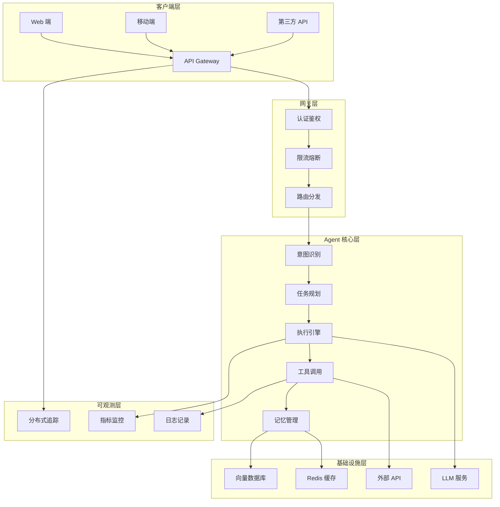

**生产级架构设计原则：**

| 原则 | 说明 | 实现方式 |
|------|------|---------|
| **高可用** | 单点故障不影响整体服务 | 多实例部署、负载均衡、自动故障转移 |
| **可观测** | 全链路可追踪、可监控 | OpenTelemetry、LangSmith、自定义指标 |
| **可扩展** | 支持水平扩展和垂直扩展 | 微服务架构、无状态设计、消息队列 |
| **安全合规** | 数据安全、权限控制、审计追踪 | RBAC、数据脱敏、操作日志、内容过滤 |

**架构设计 Checklist：**

- [ ] API 网关统一入口，支持限流、熔断、鉴权
- [ ] Agent 核心层无状态设计，支持水平扩展
- [ ] 记忆系统分层：短期（[Redis](https://redis.io)）+ 长期（向量数据库）
- [ ] 全链路追踪：每个请求生成 Trace ID
- [ ] 指标监控：延迟、吞吐、错误率、Token 消耗
- [ ] 日志规范：结构化日志，支持 ELK 检索
- [ ] 安全护栏：输入过滤、输出审核、权限控制
- [ ] 降级策略：LLM 不可用时的 Fallback 方案

---

### Q2: 如何优化 Agent 的响应延迟？

> 💡 **要点**：延迟优化需要从模型选择、缓存策略、并行执行、流式输出多维度入手

**延迟优化策略矩阵：**

| 优化维度 | 具体方案 | 预期效果 | 实施难度 |
|---------|---------|---------|---------|
| **模型选择** | 使用蒸馏小模型/量化模型 | 延迟降低 50-70% | 低 |
| **缓存策略** | 语义缓存 + Prompt 缓存 | 命中率 30-50% | 中 |
| **并行执行** | 独立工具调用并行化 | 延迟降低 30-60% | 中 |
| **流式输出** | SSE/WebSocket 流式响应 | 首字延迟 < 500ms | 低 |
| **预计算** | 提前生成常见回答模板 | 延迟降低 80%+ | 高 |
| **批处理** | 批量请求合并处理 | 吞吐提升 2-3x | 中 |

**流式输出实现示例：**

```typescript
async function* streamAgentResponse(userInput: string): AsyncGenerator<string> {
  // 1. 立即返回连接确认
  yield 'data: {"status": "connected"}\n\n';

  // 2. 流式输出思考过程
  for await (const thought of agent.thinkStream(userInput)) {
    yield `data: ${JSON.stringify({ type: 'thought', content: thought })}\n\n`;
  }

  // 3. 流式输出工具调用
  for await (const toolCall of agent.executeStream()) {
    yield `data: ${JSON.stringify({ type: 'tool', content: toolCall })}\n\n`;
  }

  // 4. 流式输出最终回答
  for await (const token of agent.responseStream()) {
    yield `data: ${JSON.stringify({ type: 'token', content: token })}\n\n`;
  }

  // 5. 完成信号
  yield 'data: {"status": "completed"}\n\n';
}
```

**延迟优化实战数据：**

| 优化阶段 | P50 延迟 | P99 延迟 | 首字延迟 |
|---------|---------|---------|---------|
| 优化前 | 3.2s | 8.5s | 2.8s |
| + 流式输出 | 3.2s | 8.5s | 0.4s |
| + 语义缓存 | 2.1s | 6.2s | 0.3s |
| + 模型降级 | 1.2s | 3.8s | 0.2s |
| + 并行执行 | 0.8s | 2.5s | 0.2s |

---

### Q3: 如何控制 Agent 的 Token 成本？

> 💡 **要点**：成本控制需要从模型降级、上下文优化、缓存复用、预算限制多维度设计

**成本控制策略：**

| 策略 | 原理 | 节省比例 | 适用场景 |
|------|------|---------|---------|
| **模型降级** | 简单任务用小模型，复杂任务用大模型 | 30-60% | 意图分类、简单问答 |
| **上下文压缩** | 摘要历史对话，只保留关键信息 | 40-70% | 长对话场景 |
| **Prompt 优化** | 精简 System Prompt，去除冗余 | 10-30% | 所有场景 |
| **缓存复用** | 相同/相似请求直接返回缓存结果 | 20-50% | 高频查询 |
| **工具调用优化** | 减少不必要的工具调用 | 15-40% | 多工具场景 |
| **预算限制** | 设置单次/每日 Token 预算上限 | 可控 | 所有场景 |

**智能模型路由示例：**

```typescript
class ModelRouter {
  route(task: string): string {
    const complexity = this.estimateComplexity(task);

    if (complexity < 0.3) {
      return 'gpt-4o-mini';        // 简单任务
    } else if (complexity < 0.7) {
      return 'gpt-4o';             // 中等任务
    } else {
      return 'claude-3-5-sonnet';  // 复杂任务
    }
  }

  private estimateComplexity(task: string): number {
    // 基于关键词、长度、历史数据等综合判断
    return 0.5;
  }
}
```

**成本核算示例：**

| 场景 | 单次调用 Token | 日均调用量 | 月成本（$） |
|------|---------------|-----------|------------|
| 简单问答 | 2K | 10,000 | 15 |
| 复杂推理 | 15K | 2,000 | 45 |
| 多工具调用 | 25K | 1,000 | 38 |
| **合计** | - | 13,000 | **98** |

---

### Q4: 如何设计 Agent 的安全防护体系？

> 💡 **要点**：安全防护需要多层次、纵深防御，从输入到输出全流程覆盖

**多层安全防护体系：**

```mermaid
graph TB
    subgraph "L1: 输入层"
        InputFilter["输入过滤"] --> PromptInject["Prompt 注入检测"]
        PromptInject --> SensitiveData["敏感信息脱敏"]
    end
    
    subgraph "L2: 规划层"
        IntentCheck["意图合法性检查"] --> ActionLimit["操作权限控制"]
        ActionLimit --> BudgetCheck["预算限制检查"]
    end
    
    subgraph "L3: 执行层"
        ToolValidate["工具参数校验"] --> RateLimit["调用频率限制"]
        RateLimit --> Sandbox["沙箱隔离执行"]
    end
    
    subgraph "L4: 输出层"
        OutputFilter["输出内容过滤"] --> HallucinationCheck["幻觉检测"]
        HallucinationCheck --> ComplianceCheck["合规性检查"]
    end
    
    subgraph "L5: 监控层"
        AuditLog["完整审计日志"] --> AnomalyDetect["异常行为检测"]
        AnomalyDetect --> Alert["实时告警"]
    end
```

**安全防护检查清单：**

| 层级 | 防护措施 | 实现方式 |
|------|---------|---------|
| **输入层** | Prompt 注入检测 | 正则匹配 + 分类模型 |
| **输入层** | 敏感信息脱敏 | PII 识别 + 替换 |
| **规划层** | 意图合法性检查 | 白名单/黑名单机制 |
| **规划层** | 操作权限控制 | RBAC + 最小权限原则 |
| **执行层** | 工具参数校验 | JSON Schema 验证 |
| **执行层** | 沙箱隔离执行 | Docker 容器隔离 |
| **输出层** | 内容过滤 | 敏感词库 + 分类模型 |
| **输出层** | 幻觉检测 | 事实核查 + 引用验证 |
| **监控层** | 审计日志 | 全链路日志记录 |
| **监控层** | 异常检测 | 行为模式分析 |

---

### Q5: 如何排查 Agent 的常见问题？

> 💡 **要点**：Agent 问题排查需要系统化的诊断流程，从症状到根因逐步定位

**常见问题诊断树：**

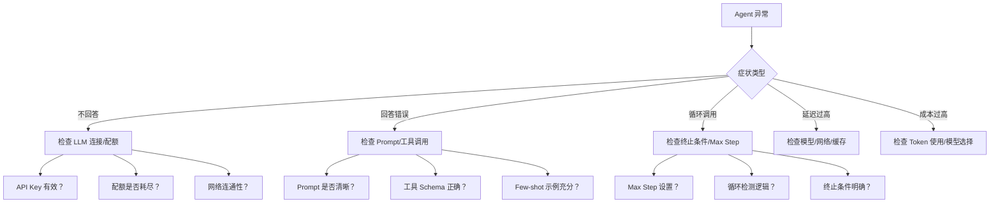

**诊断工具集：**

| 工具 | 用途 | 使用场景 |
|------|------|---------|
| **LangSmith** | 全链路追踪 | 查看完整执行轨迹 |
| **OpenTelemetry** | 分布式追踪 | 微服务架构问题定位 |
| **Prometheus + Grafana** | 指标监控 | 性能指标可视化 |
| **ELK Stack** | 日志分析 | 日志搜索与告警 |
| **自定义 Debug 面板** | 实时调试 | 开发阶段问题排查 |

**常见问题速查表：**

| 问题 | 可能原因 | 解决方案 |
|------|---------|---------|
| Agent 无限循环 | 终止条件缺失 | 设置 Max Step + 循环检测 |
| 工具调用失败 | 参数格式错误 | 校验 JSON Schema |
| 回答质量差 | Prompt 不清晰 | 增加 Few-shot 示例 |
| 延迟过高 | 模型过大/网络差 | 模型降级 + 缓存 |
| 成本过高 | Token 浪费 | 上下文压缩 + 预算限制 |

---

### Q6: 如何实现 Agent 的高可用部署？

> 💡 **要点**：高可用需要从多实例、负载均衡、故障转移、健康检查多维度保障

**高可用架构：**

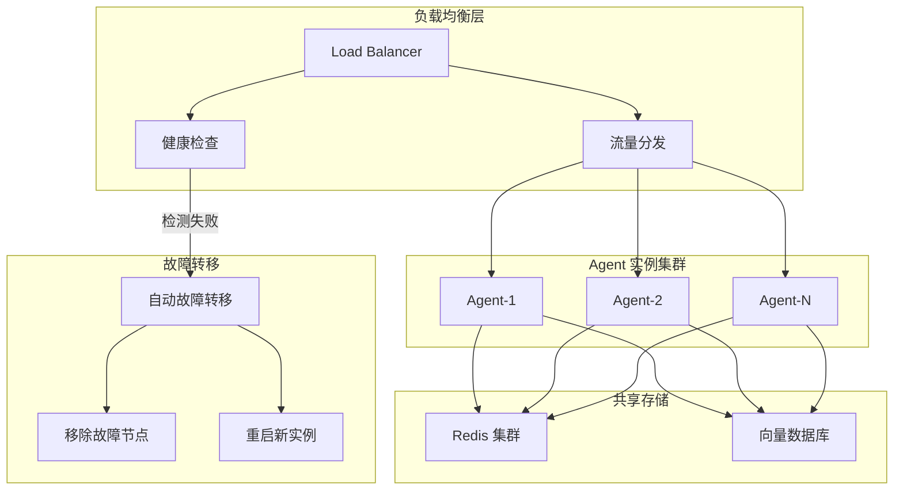

**高可用关键指标：**

| 指标 | 目标值 | 监控方式 |
|------|-------|---------|
| **可用性** | 99.9% | 健康检查 +  uptime 监控 |
| **故障恢复时间** | < 30s | 自动故障转移 |
| **数据一致性** | 强一致 | Redis 集群 + 向量数据库 |
| **并发能力** | 1000+ QPS | 水平扩展实例数 |

---

### Q7: Agent 系统的监控与告警如何设计？

> 💡 **要点**：监控需要覆盖业务指标、性能指标、资源指标，告警需要分级处理

**监控指标体系：**

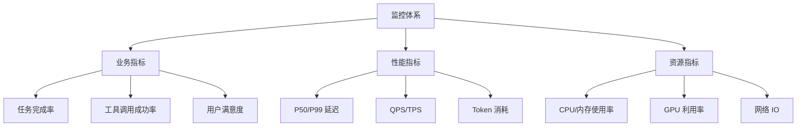

**告警分级策略：**

| 级别 | 触发条件 | 响应时间 | 通知方式 |
|------|---------|---------|---------|
| **P0-致命** | 服务不可用 | 5 分钟 | 电话 + 短信 + 钉钉 |
| **P1-严重** | 错误率 > 10% | 15 分钟 | 短信 + 钉钉 |
| **P2-警告** | 延迟 > 5s | 30 分钟 | 钉钉 |
| **P3-提示** | 资源使用 > 80% | 1 小时 | 邮件 |

---

### Q8: 如何处理 Agent 的并发请求？

> 💡 **要点**：并发处理需要队列管理、限流控制、异步执行、连接池优化

**并发处理架构：**

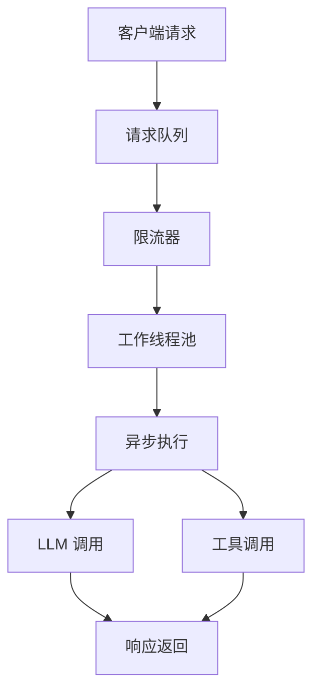

**并发优化策略：**

| 策略 | 说明 | 效果 |
|------|------|------|
| **请求队列** | 缓冲突发流量 | 防止系统过载 |
| **限流控制** | Token Bucket / Sliding Window | 保护后端服务 |
| **异步执行** | 非阻塞 IO | 提升吞吐 3-5x |
| **连接池** | 复用 LLM 连接 | 减少握手开销 |
| **批量处理** | 合并相似请求 | 降低 API 调用次数 |

---

### Q9: Agent 的灰度发布策略？

> 💡 **要点**：灰度发布需要流量分割、A/B 测试、快速回滚、数据对比

**灰度发布流程：**

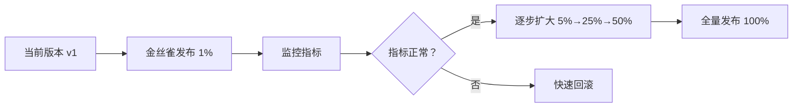

**灰度策略对比：**

| 策略 | 流量比例 | 持续时间 | 适用场景 |
|------|---------|---------|---------|
| **金丝雀** | 1-5% | 1-2 小时 | 重大变更验证 |
| **蓝绿** | 50/50 | 按需切换 | 零停机发布 |
| **渐进式** | 1%→5%→25%→50%→100% | 1-3 天 | 常规发布 |

---

### Q10: 如何设计 Agent 的降级与熔断机制？

> 💡 **要点**：降级保证核心功能可用，熔断防止级联故障

**降级策略：**

| 降级级别 | 触发条件 | 降级行为 |
|---------|---------|---------|
| **L1-轻度** | 延迟 > 3s | 关闭非必要工具调用 |
| **L2-中度** | 延迟 > 5s | 使用缓存结果 |
| **L3-重度** | LLM 不可用 | 返回预设模板回答 |
| **L4-极端** | 系统过载 | 返回服务降级提示 |

**熔断器状态机：**

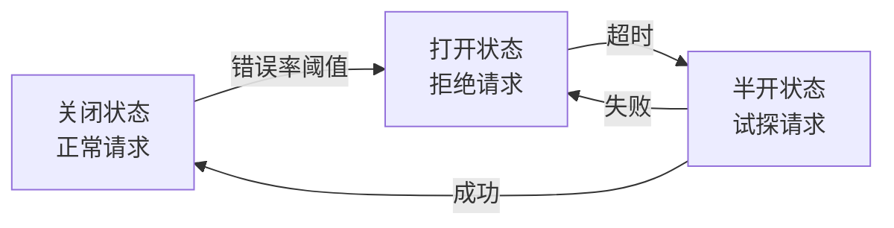

---

### Q11: Agent 系统的日志规范？

> 💡 **要点**：日志需要结构化、分级、包含关键上下文信息

**日志格式规范：**

```json
{
  "timestamp": "2026-05-19T10:30:00Z",
  "level": "INFO",
  "trace_id": "abc-123-def",
  "span_id": "span-456",
  "agent_id": "agent-001",
  "event": "tool_call",
  "tool_name": "search",
  "input": {"query": "天气"},
  "output": {"result": "晴天"},
  "duration_ms": 150,
  "token_usage": {"prompt": 100, "completion": 50}
}
```

**日志级别定义：**

| 级别 | 说明 | 示例 |
|------|------|------|
| **DEBUG** | 调试信息 | 工具调用参数 |
| **INFO** | 关键流程 | 任务开始/完成 |
| **WARN** | 警告信息 | 重试、降级 |
| **ERROR** | 错误信息 | 工具调用失败 |
| **FATAL** | 致命错误 | 系统崩溃 |

---

### Q12: 如何进行 Agent 的性能压测？

> 💡 **要点**：压测需要模拟真实场景，关注延迟、吞吐、错误率、资源使用

**压测方案：**

| 阶段 | 并发数 | 持续时间 | 关注指标 |
|------|-------|---------|---------|
| **基准测试** | 1-10 | 5 分钟 | 单请求延迟 |
| **负载测试** | 10-100 | 15 分钟 | P50/P99 延迟 |
| **压力测试** | 100-1000 | 30 分钟 | 最大吞吐、错误率 |
| **稳定性测试** | 50% 峰值 | 24 小时 | 内存泄漏、资源耗尽 |

**压测工具推荐：**

| 工具 | 特点 | 适用场景 |
|------|------|---------|
| **Locust** | Python 编写，易扩展 | 自定义场景 |
| **JMeter** | 图形界面，功能全 | 复杂场景 |
| **k6** | 现代化，CI/CD 集成 | 自动化测试 |
| **wrk** | 高性能，简单 | HTTP 压测 |

---

### Q13: Agent 的数据持久化方案？

> 💡 **要点**：数据持久化需要分层存储，热数据快取，冷数据归档

**数据存储分层：**

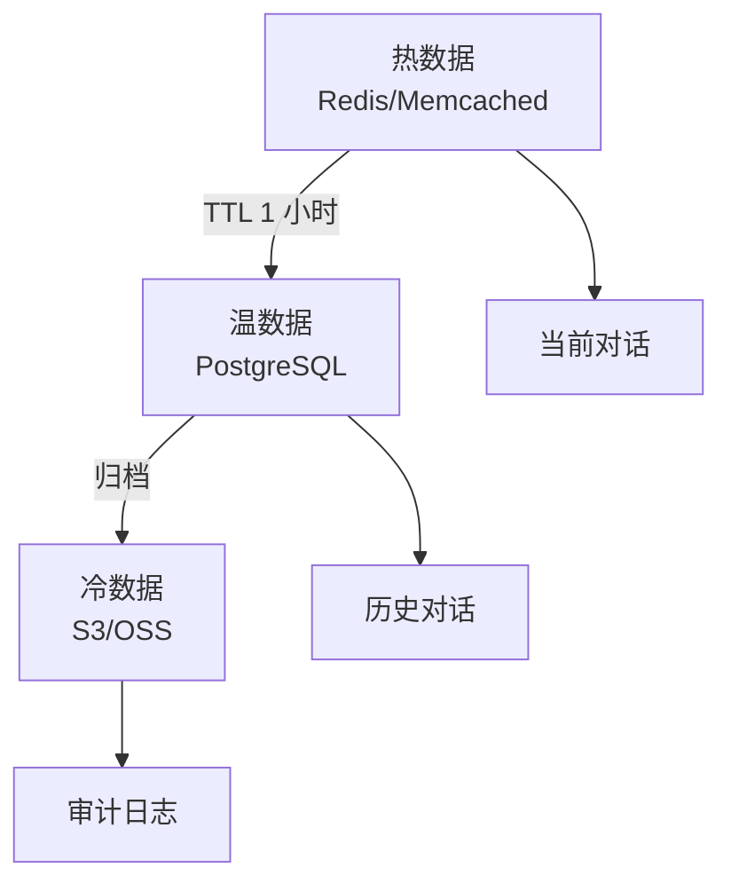

**存储方案对比：**

| 数据类型 | 存储介质 | 访问延迟 | 成本 |
|---------|---------|---------|------|
| 会话状态 | Redis | < 1ms | 中 |
| 向量索引 | Milvus/Pinecone | 5-20ms | 高 |
| 对话历史 | PostgreSQL | 10-50ms | 中 |
| 审计日志 | S3/OSS | 100-500ms | 低 |

---

### Q14: 如何保证 Agent 的幂等性？

> 💡 **要点**：幂等性保证重复请求产生相同结果，防止重复执行

**幂等性实现方案：**

| 方案 | 原理 | 适用场景 |
|------|------|---------|
| **请求 ID** | 唯一标识 + 去重表 | API 调用 |
| **乐观锁** | 版本号检查 | 数据更新 |
| **分布式锁** | Redis SETNX | 并发控制 |
| **状态机** | 状态流转检查 | 任务执行 |

**幂等性检查示例：**

```typescript
function executeTask(task: Record<string, unknown>): string {
  // 实际任务执行逻辑（需根据具体业务实现）
  return 'task result';
}

function executeWithIdempotency(requestId: string, task: Record<string, unknown>): string {
  // 1. 检查是否已执行
  if (redis.exists(`idempotent:${requestId}`)) {
    return getCachedResult(requestId);
  }

  // 2. 设置执行标记
  redis.setex(`idempotent:${requestId}`, 3600, 'executing');

  try {
    // 3. 执行任务
    const result = executeTask(task);

    // 4. 缓存结果
    redis.setex(`result:${requestId}`, 3600, result);
    return result;
  } catch {
    // 5. 失败则删除标记，允许重试
    redis.delete(`idempotent:${requestId}`);
    throw;
  }
}
```

---

### Q15: Agent 系统的容灾备份策略？

> 💡 **要点**：容灾需要多活部署、数据备份、快速恢复、定期演练

**容灾架构：**

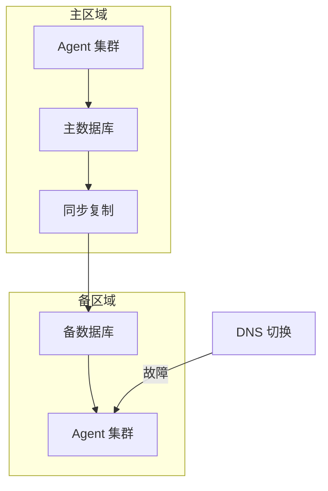

**容灾指标：**

| 指标 | 目标值 | 实现方式 |
|------|-------|---------|
| **RPO（数据丢失）** | < 1 分钟 | 同步复制 |
| **RTO（恢复时间）** | < 5 分钟 | 自动切换 |
| **可用性** | 99.99% | 多活部署 |

---

### Q16: 如何优化 Agent 的内存使用？

> 💡 **要点**：内存优化需要控制上下文大小、及时释放资源、使用对象池

**内存优化策略：**

| 策略 | 说明 | 效果 |
|------|------|------|
| **上下文压缩** | 摘要历史对话 | 减少 50% 内存 |
| **对象池** | 复用 LLM 客户端 | 减少 GC 压力 |
| **流式处理** | 避免全量加载 | 降低峰值内存 |
| **及时释放** | 显式删除大对象 | 防止内存泄漏 |
| **分页加载** | 按需加载数据 | 控制内存占用 |

---

### Q17: Agent 系统的配置管理？

> 💡 **要点**：配置需要集中管理、动态更新、版本控制、环境隔离

**配置管理架构：**

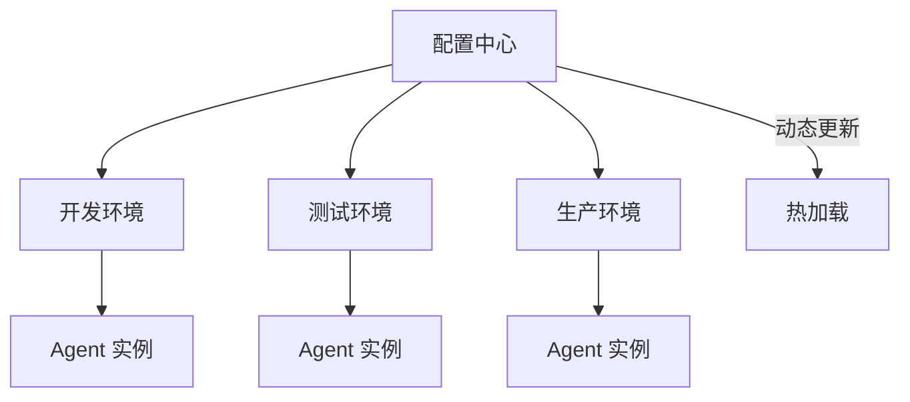

**配置分类：**

| 类型 | 示例 | 更新方式 |
|------|------|---------|
| **静态配置** | 数据库连接 | 重启生效 |
| **动态配置** | 限流阈值 | 热加载 |
| **敏感配置** | API Key | 加密存储 |
| **环境配置** | 日志级别 | 环境变量 |

---

### Q18: 如何进行 Agent 的 A/B 测试？

> 💡 **要点**：A/B 测试需要流量分割、指标对比、统计显著性、快速决策

**A/B 测试流程：**

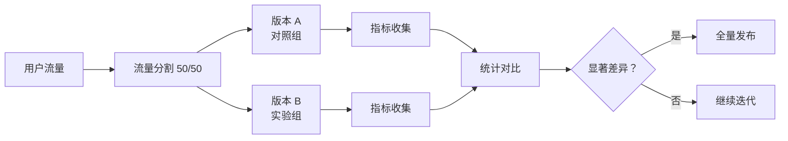

**关键指标：**

| 指标 | 说明 | 目标 |
|------|------|------|
| **任务完成率** | 成功完成任务的比例 | 提升 > 5% |
| **平均延迟** | 用户等待时间 | 降低 > 10% |
| **用户满意度** | 点赞/点踩比例 | 提升 > 10% |
| **Token 成本** | 单次调用成本 | 降低 > 15% |

---

### Q19: Agent 系统的版本管理策略？

> 💡 **要点**：版本管理需要语义化版本、向后兼容、弃用策略、迁移指南

**版本管理策略：**

| 策略 | 说明 | 示例 |
|------|------|------|
| **语义化版本** | MAJOR.MINOR.PATCH | v1.2.3 |
| **API 版本** | URL 路径或 Header | /api/v1/agent |
| **兼容策略** | 向后兼容 2 个版本 | v1, v2, v3 共存 |
| **弃用策略** | 提前 3 个月通知 | Deprecation Header |

---

### Q20: 如何构建 Agent 的 CI/CD 流水线？

> 💡 **要点**：CI/CD 需要自动化测试、代码检查、构建部署、回滚机制

**CI/CD 流水线：**

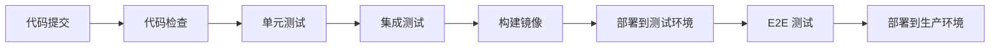

**流水线阶段：**

| 阶段 | 工具 | 耗时 |
|------|------|------|
| 代码检查 | ESLint, Pylint | 1 分钟 |
| 单元测试 | Pytest, Jest | 3 分钟 |
| 集成测试 | Docker Compose | 5 分钟 |
| E2E 测试 | Playwright | 10 分钟 |
| 部署 | Kubernetes | 2 分钟 |

---

### Q21: Agent 系统的故障演练？

> 💡 **要点**：故障演练需要模拟真实故障场景，验证系统容错能力

**故障演练场景：**

| 场景 | 模拟方式 | 验证目标 |
|------|---------|---------|
| **LLM 服务宕机** | 切断 API 连接 | 降级策略生效 |
| **数据库连接超时** | 网络延迟注入 | 超时重试机制 |
| **内存溢出** | 限制容器内存 | OOM Killer 处理 |
| **磁盘满** | 填充磁盘空间 | 日志轮转机制 |
| **网络分区** | 防火墙规则 | 服务发现容错 |

---

### Q22: 如何优化 Agent 的工具调用成功率？

> 💡 **要点**：工具调用成功率受 Prompt 质量、Schema 设计、重试策略影响

**优化策略：**

| 策略 | 说明 | 效果 |
|------|------|------|
| **Few-shot 示例** | 提供工具调用示例 | 提升 20-30% |
| **Schema 优化** | 清晰的参数描述 | 提升 15-25% |
| **重试策略** | 指数退避重试 | 提升 10-15% |
| **参数校验** | 调用前校验参数 | 减少 30% 错误 |
| **工具分组** | 相关工具分组传入 | 提升 10% |

---

### Q23: Agent 系统的多租户隔离？

> 💡 **要点**：多租户需要数据隔离、资源隔离、权限隔离、计费隔离

**隔离方案：**

| 隔离级别 | 方案 | 成本 | 安全性 |
|---------|------|------|--------|
| **数据库级别** | 独立数据库 | 高 | 最高 |
| **Schema 级别** | 独立 Schema | 中 | 高 |
| **行级别** | Tenant ID 字段 | 低 | 中 |

**资源隔离策略：**

| 资源 | 隔离方式 | 说明 |
|------|---------|------|
| **计算** | 容器配额 | CPU/内存限制 |
| **存储** | 配额限制 | 向量库容量 |
| **网络** | 带宽限制 | API 调用频率 |
| **Token** | 用量配额 | 月度 Token 上限 |

---

### Q24: 如何进行 Agent 的成本核算？

> 💡 **要点**：成本核算需要细化到每次调用，按租户/功能/时间段统计

**成本核算维度：**

| 维度 | 说明 | 数据来源 |
|------|------|---------|
| **按租户** | 每个租户的 Token 消耗 | 请求日志 |
| **按功能** | 不同功能的成本分布 | 工具调用日志 |
| **按时间段** | 峰谷时段的成本差异 | 时间序列数据 |
| **按模型** | 不同模型的成本对比 | LLM 调用记录 |

**成本优化建议：**

| 策略 | 预期节省 | 实施难度 |
|------|---------|---------|
| 模型路由 | 30-50% | 中 |
| 缓存复用 | 20-40% | 低 |
| 上下文压缩 | 40-60% | 中 |
| 批量处理 | 15-25% | 高 |

---

### Q25: Agent 系统的技术债管理？

> 💡 **要点**：技术债需要定期评估、优先级排序、渐进式重构、自动化检测

**技术债分类：**

| 类型 | 说明 | 优先级 |
|------|------|--------|
| **代码债** | 重复代码、复杂逻辑 | 中 |
| **架构债** | 耦合严重、扩展困难 | 高 |
| **测试债** | 覆盖率低、用例老旧 | 中 |
| **文档债** | 文档缺失、过时 | 低 |
| **依赖债** | 版本老旧、安全漏洞 | 高 |

**管理策略：**

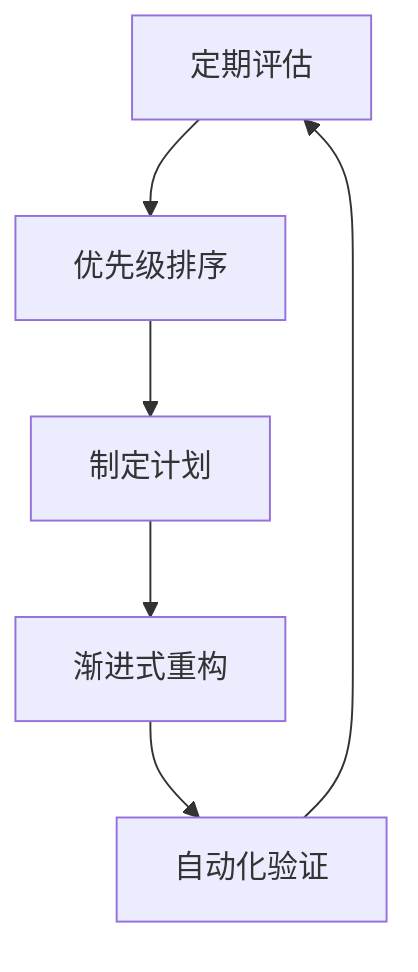

---

### Q26: 如何设计意图识别与任务路由系统？

> 💡 **要点**：意图识别是 Agent 系统的第一道关卡，采用"目标分类→路由机制→置信度治理"三层架构

**三层路由架构：**

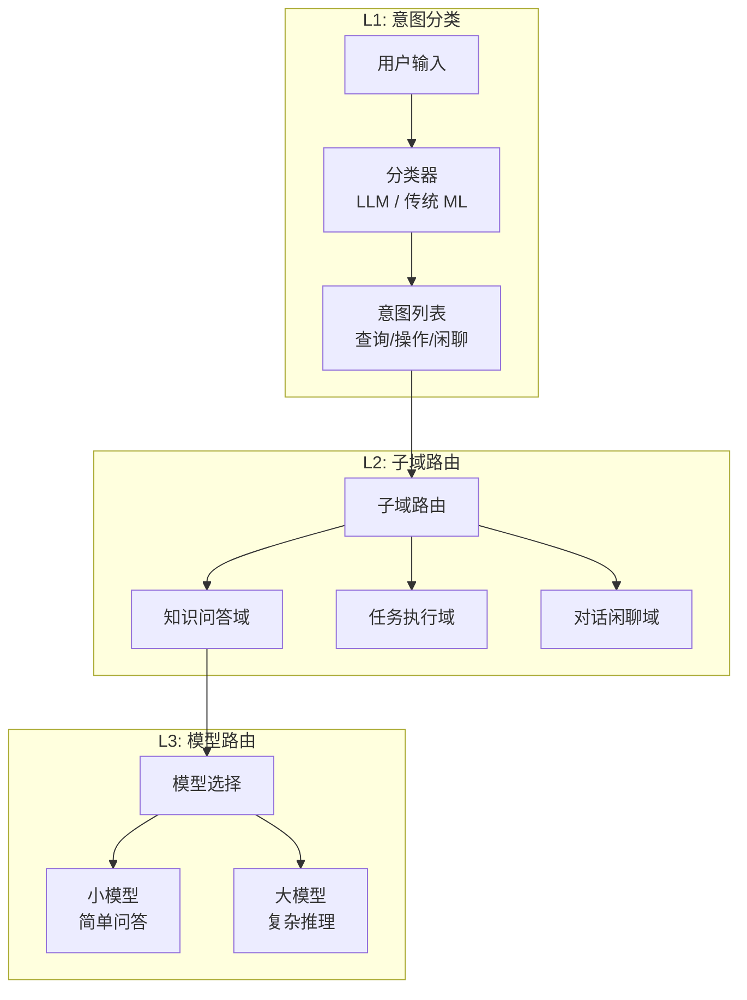

| 层级 | 职责 | 实现方式 | 延迟 |
|------|------|---------|:---:|
| **L1: 意图分类** | 判断用户意图类别 | LLM 分类 / BERT 分类器 / 关键词匹配 | < 100ms |
| **L2: 子域路由** | 映射到具体业务域 | 路由表 + 条件匹配 | < 50ms |
| **L3: 模型路由** | 按复杂度选择模型 | 复杂度评估 + 成本策略 | < 50ms |

**置信度治理：**
```
置信度 > 0.9  → 直接执行
0.7 - 0.9     → 执行并标记需人工审核
0.5 - 0.7     → 反问用户确认意图
< 0.5         → 转人工客服
```

**工程要点：**
- 意图分类器先用 LLM 快速验证，再蒸馏为小模型（如 BERT）降本
- 路由规则可配置化，支持运营人员动态调整
- 兜底原则：所有未匹配意图走"转人工"或"通用问答"通道

---

### Q27: 如何设计模型路由系统？

> 💡 **要点**：模型路由根据任务复杂度、实时性要求和成本预算，动态分配最适合的模型

| 路由策略 | 原理 | 节省成本 | 适用场景 |
|---------|------|:--------:|---------|
| **意图路由** | 按意图类别固定映射模型 | 30-50% | 场景明确 |
| **复杂度路由** | LLM 评估任务复杂度后路由 | 20-40% | 通用场景 |
| **成本路由** | 优先用小模型，失败时升级大模型 | 40-60% | 成本敏感 |
| **延迟路由** | 根据用户等待容忍度选择 | — | 对延迟敏感 |
| **回退策略** | 主模型失败自动降级到备用模型 | — | 高可用保障 |

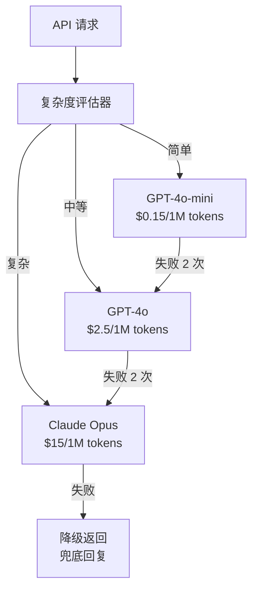

**实现要点：**
1. **复杂度评估**：基于 Token 数、领域关键词、历史调用数据综合判断
2. **失败回退链**：小模型→中模型→大模型→兜底，每级失败后自动升级
3. **成本监控**：实时追踪每级路由的 Token 消耗和调用量
4. **A/B 测试**：支持同一任务在不同模型间的效果对比

---

### Q28: 如何设计内网部署的 Agent 系统？

> 💡 **要点**：内网部署需考虑三层隔离架构、模型统一、网络隔离和降级策略

**三层隔离架构：**

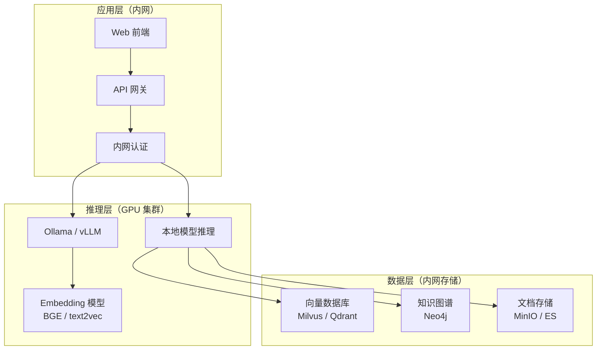

| 关注点 | 解决方案 | 说明 |
|--------|---------|------|
| **模型统一** | Ollama / vLLM | 统一管理开源模型部署 |
| **网络隔离** | 物理隔离 / VPC | 完全断开公网访问 |
| **数据安全** | 全链路加密 | 传输层 TLS + 存储层 AES-256 |
| **审计日志** | 全量操作记录 | 所有请求、模型输出、工具调用记录 |
| **降级策略** | 本地小模型 Fallback | 主模型不可用→本地小模型→缓存回复 |

**核心考量：**
1. **模型选择**：7B-14B 开源模型（Qwen2.5、Llama-3、DeepSeek）可满足大多数内网场景
2. **硬件要求**：至少 1 张 A100-80G 或 2 张 RTX 4090 运行 14B 模型
3. **离线更新**：通过内部 Registry 定期同步最新模型版本
4. **监控告警**：内网 Prometheus + Grafana 监控推理延迟和资源使用

---

### Q29: 如何设计一个 NL2SQL Agent？

> 💡 **要点**：NL2SQL Agent 需要 schema 链接、只读限制、执行沙箱和歧义澄清四大保障

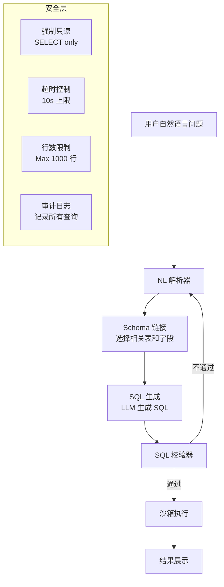

**设计要点：**

| 组件 | 说明 | 实现 |
|------|------|------|
| **Schema 链接** | 只暴露相关表和字段给 LLM，减少选择范围 | 用 embedding 匹配问题与表描述 |
| **只读保障** | 在数据库用户层面授予只读权限 | CREATE USER WITH READONLY |
| **执行沙箱** | 限制执行时间和返回行数 | 10s 超时 + 1000 行上限 |
| **歧义澄清** | 当 SQL 有歧义时反问用户确认 | LLM 判断并生成追问 |
| **结果解释** | 将 SQL 结果转为自然语言 | LLM 后处理 |

**关键陷阱：**
- 表名和字段名过时 → 需要定期同步数据库 Schema
- 复杂 JOIN 导致性能问题 → 设置查询超时 + 资源组隔离
- 用户输入 SQL 注入 → 在 DB 用户层做权限隔离（只读 + 限定 Schema）

---

### Q30: 如何设计一个代码 Agent？

> 💡 **要点**：代码 Agent 需要任务理解、代码库理解、工具层、规划执行、反馈闭环和安全治理六大模块

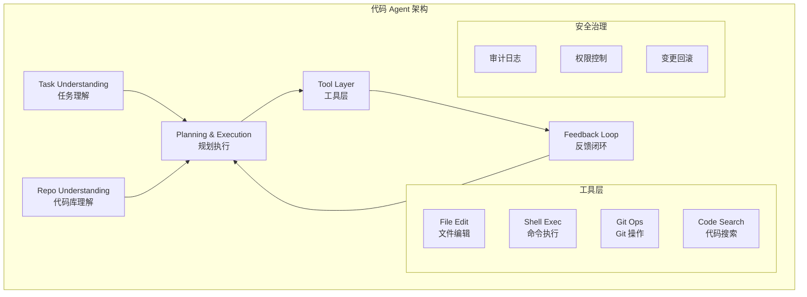

| 模块 | 核心能力 | 实现要点 |
|------|---------|---------|
| **任务理解** | 将 Issue/需求拆解为可执行任务 | 需求分析 + 范围界定 |
| **代码库理解** | 理解项目结构、依赖、代码约定 | 代码索引 + AST 分析 |
| **工具层** | 文件编辑、命令执行、Git 操作、代码搜索 | 每个工具独立沙箱 |
| **规划执行** | 先规划后执行，支持动态调整 | Plan-and-Execute 范式 |
| **反馈闭环** | 编译错误/测试失败自动修复 | 循环：执行→检查→修复 |
| **安全治理** | 敏感操作需审批，变更可回滚 | RBAC + Git revert |

**安全设计：**
1. **文件范围限制**：Agent 只能操作工作区内的文件
2. **命令白名单**：仅允许 `git`、`npm`、`cargo` 等安全命令
3. **自动回滚**：每次操作前创建 Git checkpoint，出问题自动回滚
4. **人工审批**：`git push`、`npm publish` 等关键操作需人工确认

---

### Q31: 如何设计深度研究（Deep Research）系统？

> 💡 **要点**：深度研究系统通过查询规划→多源检索→信息融合→迭代优化→报告生成五个阶段完成复杂调研任务

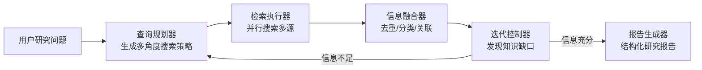

| 模块 | 功能 | 技术实现 |
|------|------|---------|
| **查询规划器** | 将主问题分解为多个子问题，生成多角度搜索查询 | LLM 生成查询语句 |
| **检索执行器** | 并行执行网络搜索、知识库查询、文档检索 | 多 Worker 并发 |
| **信息融合器** | 对检索结果去重、分类、建立关联 | LLM 摘要 + 聚类 |
| **迭代控制器** | 评估信息覆盖度，发现知识缺口，触发补充搜索 | LLM as Judge |
| **报告生成器** | 输出结构化研究结论，含出处引用 | LLM 按模板生成 |

**关键设计点：**
- **搜索策略多样性**：同时使用关键词搜索 + 语义搜索 + 引文回溯
- **信息冲突处理**：不同来源结论矛盾时，在报告中标注分歧
- **深度控制**：用户可设置"浅度/中等/深度"模式，控制迭代轮次
- **引用溯源**：每条结论必须关联具体来源链接

---

### Q32: 如何设计 Agent 与 RAG 的三种连接模式？

> 💡 **要点**：RAG 接入 Agent 有三种模式——预检索（检索后推理）、按需检索（推理中触发）、后验证（推理后验证）

**三种连接模式：**

```mermaid
graph TB
    subgraph "模式一：预检索"
        A1["用户输入"] --> A2["RAG 检索"]
        A2 --> A3["LLM 推理"]
        A3 --> A4["输出"]
    end
    
    subgraph "模式二：按需检索"
        B1["用户输入"] --> B2["LLM 推理"]
        B2 -->|需要知识| B3["检索工具触发"]
        B3 --> B2
        B2 --> B4["输出"]
    end
    
    subgraph "模式三：后验证"
        C1["用户输入"] --> C2["LLM 推理"]
        C2 --> C3["输出草稿"]
        C3 --> C4["事实核查"]
        C4 -->|不通过| C2
        C4 -->|通过| C5["最终输出"]
    end
```

| 模式 | 时序 | 适用场景 | 优势 | 劣势 |
|------|------|---------|------|------|
| **预检索** | 每次用户输入先检索 | 知识密集问答 | 简单可控，延迟固定 | 可能检索无关内容 |
| **按需检索** | 推理中 Agent 自主触发 | Agent 动态决策 | 灵活，仅查必要的 | 增加 Agent 循环次数 |
| **后验证** | 生成后再核查事实 | 高准确率要求场景 | 最高质量 | 成本最高 |

**工程建议：**
- **默认方案**：预检索 + 按需检索的组合——先预检索注入上下文，Agent 工具中保留检索能力作为补充
- **高准确场景**：加后验证层——用第二个 LLM 调用验证生成内容的事实准确性
- **成本敏感场景**：仅用按需检索，让 Agent 按需取用知识

---

### Q33: 如何设计安全的 Python 代码解释器 Agent？

> 💡 **要点**：Python 代码解释器 Agent 的核心挑战是安全——需要在沙箱中执行用户或 LLM 生成的任意代码

```mermaid
graph TB
    User["用户请求<br/>分析数据"] --> CodeGen["LLM 生成 Python"]
    CodeGen --> CodeReview["代码审查<br/>白名单检查"]
    CodeReview -->|不通过| CodeGen
    CodeReview -->|通过| Sandbox["沙箱执行"]
    
    subgraph 沙箱层
        Container["Docker 容器<br/>资源隔离"]
        Timeout["超时控制<br/>30s 上限"]
        NoNetwork["网络隔离<br/>禁止外连"]
        Whitelist["模块白名单<br/>pandas/numpy/matplotlib"]
    end
    
    Sandbox --> Result["结果审核"]
    Result --> Output["展示给用户"]
```

| 安全措施 | 说明 | 实现方式 |
|---------|------|---------|
| **容器隔离** | 每次执行启动独立容器，用完销毁 | Docker API / gVisor |
| **模块白名单** | 仅允许安全的数据分析库 | `pandas`、`numpy`、`matplotlib` 等 |
| **系统调用拦截** | 禁止文件系统/网络操作 | seccomp 策略 |
| **超时终止** | 单次执行最长 30 秒 | 进程级超时 Kill |
| **内存限制** | 最多使用 1GB 内存 | Docker --memory |
| **结果审核** | 输出内容安全过滤 | PII 检测 + 敏感内容过滤 |

**代码审查规则：**
```
❌ 禁止：os.system, subprocess, eval, exec, __import__, open
✅ 允许：pandas, numpy, matplotlib, scipy, sklearn, json, re, math, statistics
```

**适用场景：** 数据分析、图表生成、数据清洗、统计计算

---

### Q34: 如何设计一个类 Manus 的通用 Agent？

> 💡 **要点**：通用 Agent 需要任务规划、工具调度、状态/记忆、执行反思和安全治理五大能力

```mermaid
graph TB
    subgraph "通用 Agent 架构"
        Task["任务接收"] --> Planner["任务规划器"]
        Planner --> Scheduler["工具调度器"]
        Scheduler --> Executor["执行引擎"]
        Executor --> Reflector["执行反思器"]
        Reflector -->|需要调整| Planner
        Reflector -->|完成| Output["结果输出"]
        
        Memory["状态/记忆管理器"] --> Planner
        Memory --> Executor
        Security["安全治理层"] -.-> Scheduler
        Security -.-> Executor
    end
```

| 模块 | 职责 | 关键设计 |
|------|------|---------|
| **任务规划器** | 将复杂任务分解为子任务 DAG | 支持动态规划 + 计划修正 |
| **工具调度器** | 选择合适工具并编排执行顺序 | 工具注册表 + 依赖解析 |
| **执行引擎** | 并行/串行执行工具调用 | Worker 池 + 任务队列 |
| **状态/记忆管理器** | 跟踪任务状态、中间结果 | 检查点机制 + 记忆压缩 |
| **执行反思器** | 评估执行结果，发现不足 | LLM 自我评估 + 重试策略 |
| **安全治理层** | 敏感操作审批、权限控制 | RBAC + 操作审计 |

**与传统 Agent 的区别：**
- **持久性**：任务可跨多次会话继续执行
- **通用性**：不限定特定场景，工具集可动态扩展
- **人机协作**：关键节点可请求人工介入
- **可审计**：完整记录每次决策和执行轨迹

---

### 🔄 补充：Agent 系统可靠性设计模式（原理深究）

> **生产级 Agent 的核心命题**：不是"让 Agent 更聪明"，而是"让 Agent 更可靠"。

#### 可靠性设计的三个层次

| 层次 | 问题 | 解决方案 | 典型工具 |
|:---|:---|:---|:---|
| **L1 防崩溃** | Agent 卡在无限循环 | Max Step + 超时 + 相似 Action 检测 | 循环检测 Guard |
| **L2 自恢复** | 工具调用失败 | 重试 + 降级 + 熔断 | Retry + Fallback Chain |
| **L3 可审计** | 不知道 Agent 做了什么 | 完整 Trace + 决策日志 + 回放 | LangSmith / LangFuse |

#### 循环检测算法实现

```typescript
interface Action {
  name: string;
  [key: string]: unknown;
}

function detectLoop(actions: Action[], window: number = 5): boolean {
  if (actions.length < window * 2) {
    return false;
  }

  const recent = actions.slice(-window);
  const previous = actions.slice(-window * 2, -window);

  return actionSimilarity(recent, previous) > 0.8;
}

function actionSimilarity(a: Action[], b: Action[]): number {
  const matches = a.reduce((count, x, i) => {
    return count + (i < b.length && x.name === b[i].name ? 1 : 0);
  }, 0);
  return matches / Math.max(a.length, b.length);
}
```

#### 优雅降级策略模板

```
正常运行 → 第一级缓存命中（零成本）
    ↓ 缓存未命中
适当降级 → 用简单模型替代复杂模型（成本降低 90%）
    ↓ 简单模型也失败
安全降级 → 返回预设响应 / 触发 HITL（保证可用性）
    ↓ 持续失败
熔断 → 停止调用，返回错误页面，告警通知（防止级联故障）
```
