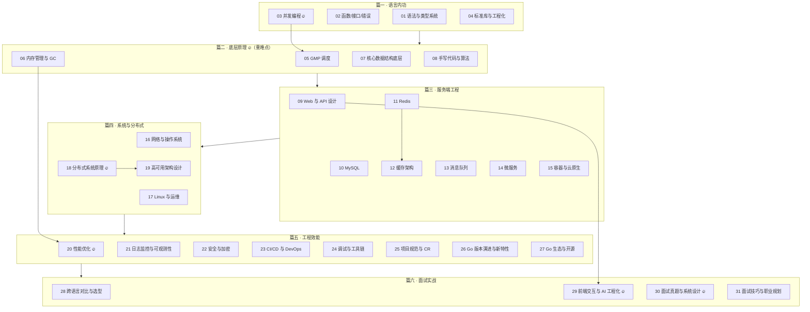

# 📘 Go 语言面试体系总纲（S6-Go）

> **版本**：v3.0（2026-09-30 重构）｜ **题量**：**415 道**，31 个专题，共六篇
> **适用对象**：① 有前端经验、准备转 Go 后端（本仓库主要读者）；② Go 后端求职者做系统复习
> **维护原则**：**版本事实联网核验**（见第 9 节）、**重难点显式标注**、**每题都有前端类比与一句话总结**

---

## 0. 三种用法，按需进入

| 你的处境 | 建议路径 |
|----------|----------|
| **零基础/刚转 Go**（系统学） | 篇一 → 篇二 → 篇三，边学边做「产出物」（见第 2 节）；篇四~篇六在项目/面试前再补 |
| **1~2 周突击面试** | 直接读第 5 节「必考 Top 30」→ 逐题只看 **💡 记忆关键词** 与 **📝 一句话总结** → 用每篇末尾「✅ 自测清单」查漏 |
| **已会 Go，只补短板** | 看第 3 节知识地图定位，再跳到对应专题；重点补 **篇二（底层原理）** 与 **篇四（分布式）** |
| **前端面试被问「为什么转 Go」** | 第 2 节「前端优势迁移表」+ [6-31 面试技巧](./6-31-面试技巧与职业规划.md) |

---

## 1. 阅读标记

| 标记 | 含义 |
|------|------|
| ⭐ ~ ⭐⭐⭐⭐⭐ | 难度：⭐⭐ 以下必会，⭐⭐⭐ 进阶，⭐⭐⭐⭐+ 专家级 |
| 🔥 | 面试高频（80%+ 概率被问） |
| 📌 | 常考（50%~80%） |
| 📖 | 了解即可（<50%，有时间再看） |
| 🔁 前端类比 | 用 JS/TS/浏览器知识解释 Go 概念 —— **本系列特色，前端读者的主要抓手** |
| 💡 记忆关键词 | 面试前 30 秒快速回忆 |
| ⚠️ 常见误区 | 最容易答错/被追问的点 |
| 📝 一句话总结 | 面试时组织语言的模板 |

---

## 2. 学习路径：前端 → Go 后端（3 个月）

### 2.1 三阶段安排（与六篇一一对应）

| 阶段 | 时间 | 对应篇 | 目标 | 必须产出 |
|------|------|--------|------|----------|
| **一、语法与标准库** | 第 1 月 | 篇一 | 能独立写小工具与 HTTP 服务 | ① CLI 工具；② 分层 REST API；③ 篇一自测清单全过 |
| **二、并发与底层** | 第 2 月 | 篇二 | 能安全写并发代码，讲清 GMP/GC | ① 并发任务池（`-race` 通过 + 优雅退出）；② pprof 优化前后对比数据；③ 手写 LRU/限流器/协程池 |
| **三、工程与实战** | 第 3 月 | 篇三~篇六 | 可上生产 + 能讲项目 | ① 完整服务（MySQL + Redis + Docker + CI）；② 项目复盘（架构图 + 压测数据 + 一次故障处理）；③ 3 道系统设计口述（含估算） |

**每日节奏（比计划本身更重要）**：1 小时阅读 + 1 小时写代码 > 周末突击 8 小时。每周用「自测清单」做一次周检。

### 2.2 前端已具备、可直接迁移的能力

| 前端已有 | Go 对应 | 迁移红利 |
|----------|---------|----------|
| HTTP/JSON、RESTful 设计 | `net/http`、Gin、gRPC-Gateway | 协议层认知完全可复用，能立刻看懂接口设计 |
| `Promise.all` / `async-await` | `goroutine` + `channel` + `select` | 并发思维已建立，只需学「共享内存要加锁」 |
| `AbortController` | `context` 取消传播 | 取消/超时语义一致，几乎零成本 |
| CI 打包与发布（npm → CDN） | 镜像构建 + 滚动/灰度发布 | 交付链路同构 |
| 埋点 / Web Vitals / Sentry | 日志 / 指标 / 链路追踪 | 可观测性三大支柱的思维一致 |
| 性能分析（Performance 面板、Lighthouse） | pprof / trace / bench | **瓶颈定位方法论完全相同**，这是最容易迁移的硬技能 |
| 缓存（强缓存/协商缓存） | Redis / 多级缓存 / 一致性 | 「缓存一致性与失效」是同一类问题 |

### 2.3 必须刻意转换的思维（高频踩坑）

| 前端习惯 | Go 后端思维 |
|----------|-------------|
| `try/catch` 兜住一切 | **错误是值**：`if err != nil` 显式处理，`%w` 包装后向上传播 |
| 一切皆引用（对象/数组） | 区分**值类型/指针**；slice 是描述符但共享底层数组 |
| 单线程事件循环，无数据竞争 | **真并行**：共享变量必须加锁/原子/channel，`-race` 是必备检查 |
| 依赖 npm 生态 | 标准库强大，**优先标准库**，第三方依赖要评估维护成本 |
| 热更新 + Dev Server | 编译型：`go run`/`go build`，**单二进制部署**，交叉编译极快 |
| 前端不关心内存 | 关心**逃逸分析、分配率、GC 停顿、goroutine 泄漏**（篇二整篇） |

---

## 3. 知识地图（六篇总览）

---

## 4. 文件索引（31 个专题）

### 篇一 · 语言内功（前端最容易上手，共 37 题）

| # | 专题 | 题量 | 权重 | 前置 |
|---|------|------|------|------|
| [1-01](./1-01-Go基础语法与类型系统.md) | Go 基础语法与类型系统 | 7 | 🔥🔥🔥🔥🔥 | — |
| [1-02](./1-02-函数接口与错误处理.md) | 函数、接口与错误处理 | 9 | 🔥🔥🔥🔥🔥 | 1-01 |
| [1-03](./1-03-并发编程.md) | **并发编程**（goroutine/channel/sync/context） | 14 | 🔥🔥🔥🔥🔥 | 1-01 |
| [1-04](./1-04-标准库与工程化基础.md) | 标准库与工程化基础 | 7 | 🔥🔥🔥🔥 | 1-01 |

### 篇二 · 底层原理（**面试区分度最高**，共 59 题）

| # | 专题 | 题量 | 权重 | 前置 |
|---|------|------|------|------|
| [2-05](./2-05-GMP调度模型.md) | **GMP 调度模型** | 9 | 🔥🔥🔥🔥🔥 | 1-03 |
| [2-06](./2-06-内存管理与GC.md) | **内存管理与垃圾回收** | 11 | 🔥🔥🔥🔥🔥 | 2-05 |
| [2-07](./2-07-核心数据结构底层.md) | 核心数据结构底层（含 map/slice/channel/sync 原语） | 29 | 🔥🔥🔥🔥 | 1-01、2-06 |
| [2-08](./2-08-手写代码与算法实战.md) | 手写代码与算法实战 | 10 | 🔥🔥🔥🔥 | 1-03 |

### 篇三 · 服务端工程（共 156 题）

| # | 专题 | 题量 | 权重 | 前置 |
|---|------|------|------|------|
| [3-09](./3-09-Web框架与API设计.md) | Web 框架与 API 设计 | 7 | 🔥🔥🔥🔥 | 1-04 |
| [3-10](./3-10-MySQL与数据访问.md) | MySQL 与数据访问 | 34 | 🔥🔥🔥🔥🔥 | 3-09 |
| [3-11](./3-11-Redis.md) | Redis 缓存与数据结构 | 40 | 🔥🔥🔥🔥🔥 | 3-10 |
| [3-12](./3-12-缓存架构设计.md) | 缓存架构设计 | 10 | 🔥🔥🔥🔥 | 3-11 |
| [3-13](./3-13-消息队列.md) | 消息队列（Kafka / RabbitMQ） | 18 | 🔥🔥🔥🔥 | 3-09 |
| [3-14](./3-14-微服务架构.md) | 微服务架构 | 16 | 🔥🔥🔥🔥 | 3-09 |
| [3-15](./3-15-容器与云原生.md) | 容器技术与云原生 | 31 | 🔥🔥🔥 | 3-14 |

### 篇四 · 系统与分布式（共 75 题）

| # | 专题 | 题量 | 权重 | 前置 |
|---|------|------|------|------|
| [4-16](./4-16-网络与操作系统.md) | 网络与操作系统原理（含 net/http 高并发、零拷贝） | 30 | 🔥🔥🔥🔥 | 2-05 |
| [4-17](./4-17-Linux与运维.md) | Linux 与运维 | 19 | 🔥🔥🔥 | 4-16 |
| [4-18](./4-18-分布式系统原理.md) | **分布式系统原理** | 18 | 🔥🔥🔥🔥🔥 | 3-11、3-13 |
| [4-19](./4-19-高可用架构设计.md) | 高可用架构设计 | 8 | 🔥🔥🔥🔥 | 4-18 |

### 篇五 · 工程效能（共 55 题）

| # | 专题 | 题量 | 权重 | 前置 |
|---|------|------|------|------|
| [5-20](./5-20-性能优化实战.md) | **性能优化实战**（pprof / trace / bench） | 9 | 🔥🔥🔥🔥 | 2-06 |
| [5-21](./5-21-日志监控与可观测性.md) | 日志、监控与可观测性 | 7 | 🔥🔥🔥 | 5-20 |
| [5-22](./5-22-安全与加密.md) | 安全与加密 | 8 | 🔥🔥🔥 | 3-09 |
| [5-23](./5-23-CICD与DevOps.md) | CI/CD 与 DevOps（含 CGO 与交叉编译） | 6 | 🔥🔥 | 3-15 |
| [5-24](./5-24-调试与工具链.md) | 高级调试与工具链 | 4 | 🔥🔥🔥 | 5-20 |
| [5-25](./5-25-项目规范与代码审查.md) | 项目规范与代码审查 | 7 | 🔥🔥🔥 | 1-04 |
| [5-26](./5-26-Go版本演进与新特性.md) | Go 版本演进与新特性 | 11 | 🔥🔥🔥🔥 | 1-01 |
| [5-27](./5-27-Go生态与开源.md) | Go 生态与开源 | 3 | 🔥🔥 | 1-04 |

### 篇六 · 面试实战（共 33 题）

| # | 专题 | 题量 | 权重 | 前置 |
|---|------|------|------|------|
| [6-28](./6-28-跨语言对比与技术选型.md) | 跨语言对比与技术选型 | 7 | 🔥🔥🔥 | 全篇 |
| [6-29](./6-29-Go与前端交互及AI工程化.md) | **Go 与前端交互及 AI 工程化** | 10 | 🔥🔥🔥🔥 | 3-09 |
| [6-30](./6-30-面试真题与系统设计.md) | **面试真题与系统设计** | 10 | 🔥🔥🔥🔥🔥 | 全篇 |
| [6-31](./6-31-面试技巧与职业规划.md) | 面试技巧与职业规划 | 6 | 🔥🔥 | 全篇 |

> **题量口径**：以 `### Qn:` 三级标题计数，共 **415 道**。同一主题可能在多篇出现（如「分布式锁」在 2-08 手写、3-11 Redis、4-18 分布式），此时**答法深浅不同**，属于刻意设计。

---

## 5. 重难点清单：必考 Top 30

> 用法：面试前一晚只看这一节。每条右侧是「一句话钩子」，答不出就点回对应专题。

### 语言与并发（篇一）

| # | 题目 | 一句话钩子 | 出处 |
|---|------|-----------|------|
| 1 | slice 与 array 的区别、扩容规则 | ptr/len/cap 描述符共享底层数组；1.18 起阈值 256、因子 2.0→1.25、最后按 size class 对齐 | 1-01 |
| 2 | map 是否并发安全 | 不安全；写并发会 fatal；用 RWMutex / sync.Map / 分片锁 | 1-01 |
| 3 | defer 顺序与陷阱 | LIFO；循环里 defer 会拖到函数返回，需匿名函数包裹 | 1-01 |
| 4 | 接口的鸭子类型与 iface/eface | 隐式实现；空接口非 nil 需要「类型+值都为 nil」 | 1-02 |
| 5 | **接口 nil 陷阱** | 返回具体类型的 nil 指针 → `err != nil` 为 true | 1-02 |
| 6 | 错误处理规范 | `%w` 包装 + `errors.Is/As` 判定；只在边界记一次日志 | 1-02 |
| 7 | 值/指针接收者与方法集 | `T` 只有值方法，`*T` 含全部；有指针方法则必须 `*T` 实现接口 | 1-02 |
| 8 | **goroutine vs 线程** | 2KB 起栈 + 用户态调度 + M:N，故「廉价」 | 1-03 |
| 9 | **channel 五大陷阱** | nil 永久阻塞、关后发送 panic、重复关闭 panic、关后收零值、发送方关闭 | 1-03 |
| 10 | **context 用法** | 取消/超时/值传递；父取消级联子；ctx 作第一个参数 + `defer cancel()` | 1-03 |
| 11 | goroutine 泄漏排查 | 卡在发送/接收/等锁；看 goroutine 数 + pprof + 1.27 的 `goroutineleak` | 1-03 |

### 底层原理（篇二，**最容易拉开差距**）

| # | 题目 | 一句话钩子 | 出处 |
|---|------|-----------|------|
| 12 | **GMP 模型** | G 任务、M 线程、P 工位 + 本地队列；P 数量 = GOMAXPROCS = 并行度 | 2-05 |
| 13 | **工作窃取与 1/61** | 本地 → 全局（每 61 次）→ 随机偷一半 → netpoll | 2-05 |
| 14 | **系统调用与 Handoff** | 系统调用阻塞则 M/P 解绑换 M；网络 IO 交给 netpoller 完全不占 M | 2-05 |
| 15 | 抢占式调度 | 函数调用点协作式 → Go 1.14 起信号异步抢占（防死循环占死 P） | 2-05 |
| 16 | 容器感知 GOMAXPROCS | Go 1.25+ 读 cgroup CPU limit 并动态更新，避免容器内线程/GC 暴涨 | 2-05 |
| 17 | **逃逸分析** | `-gcflags=-m`；指针返回/接口装箱/闭包捕获会逃逸；能栈不堆 | 2-06 |
| 18 | **三色标记 + 混合写屏障** | 白灰黑 + 写屏障维护三色不变式，STW 通常 <1ms；非分代、不整理 | 2-06 |
| 19 | GC 触发与调优 | GOGC（默认 100）+ 2 分钟定时 + `GOMEMLIMIT`；`gctrace` 观察 | 2-06 |
| 20 | **Green Tea GC（1.26 默认）** | 同一算法的**实现优化**，GC 开销降 10~40%；1.25 实验、1.26 默认 | 2-06 / 5-26 |
| 21 | map 底层（hmap/bmap/扩容） | 桶 + 溢出桶、负载因子 6.5、渐进式扩容（1.24 起 Swiss Table） | 2-07 |
| 22 | channel 底层 hchan | 环形缓冲 + sendq/recvq + 锁；无缓冲是同步交接 | 2-07 / 1-03 |

### 存储与分布式（篇三、篇四）

| # | 题目 | 一句话钩子 | 出处 |
|---|------|-----------|------|
| 23 | **MySQL 索引与最左前缀** | B+ 树、聚簇/二级索引、回表与覆盖索引、索引失效场景 | 3-10 |
| 24 | **事务隔离级别与 MVCC** | 四种隔离级别；RR 靠 MVCC + 间隙锁防幻读 | 3-10 |
| 25 | **Redis 缓存三大问题** | 穿透（布隆/空值）、击穿（互斥重建）、雪崩（随机 TTL + 多级缓存） | 3-12 |
| 26 | **Redis 分布式锁** | SET NX PX + 唯一 value + Lua 释放 + 续期；配幂等兜底 | 3-11 / 2-08 |
| 27 | **消息不丢与幂等消费** | 生产确认 + 副本同步 + 手动提交；消费端 `msgID` 去重 | 3-13 |
| 28 | **CAP/BASE 与分布式事务** | 取舍而非兼得；2PC/TCC/Saga/消息最终一致 | 4-18 |
| 29 | **限流熔断降级 + 幂等** | 令牌桶/漏桶、熔断三态、幂等靠唯一键/状态机 | 4-19 |
| 30 | **系统设计四步法 + 容量估算** | 澄清 → 估算（峰值系数 3~5、单机 QPS 量级）→ 架构 → 深挖 + 权衡 | 6-30 |

### 附加：最能体现版本敏感度的 5 个点（加分项）

1. Go 1.22 **循环变量每次迭代新建**（由 `go.mod` 的 `go` 版本控制）；
2. Go 1.24 **Swiss Table map** 与泛型类型别名、`omitzero`；
3. Go 1.25 **容器感知 GOMAXPROCS**、`testing/synctest` 转正、`jsonv2` 实验；
4. Go 1.26 **Green Tea GC 默认开启**、`new(expr)`、`go fix` modernizers；
5. Go 1.27 **泛型方法**、`encoding/json/v2` 正式版（v1 底层换芯）、`goroutineleak` profile 转正。

详见 [5-26 Go 版本演进](./5-26-Go版本演进与新特性.md)。

---

## 6. 前端转 Go 最易答错的 10 个点

| # | 常见错误回答 | 正确表述 | 出处 |
|---|--------------|----------|------|
| 1 | 「slice 是引用类型」 | slice 是**值类型**（ptr/len/cap 描述符），但拷贝时**共享底层数组** | 1-01 |
| 2 | 「扩容小于 1024 翻倍、否则 1.25 倍」 | 那是 **Go 1.18 之前**；1.18 起阈值 **256**，因子 2.0 平滑逼近 1.25 | 1-01 |
| 3 | 「for 循环变量共享」 | **Go 1.22 起每次迭代新建变量**，行为由 `go.mod` 的 `go` 版本决定 | 1-01 / 5-26 |
| 4 | 「Go 的 GC 是分代的」 | 非分代、不整理、并发三色标记 + 混合写屏障 | 2-06 |
| 5 | 「Go 1.26 换了新的 GC 算法」 | 是**同一算法下的实现优化**（Green Tea 提升局部性与并行度） | 2-06 / 5-26 |
| 6 | 「channel 谁都可以关」 | 约定**由发送方（唯一生产者）关闭**；重复关闭 panic | 1-03 |
| 7 | 「goroutine 死了会自动回收」 | 阻塞在发送/接收/锁上的 goroutine **永久泄漏**，必须设计退出路径 | 1-03 |
| 8 | 「异步编程用 async/await 那套」 | Go 用**同步写法 + goroutine**；取消靠 `context`，不要自己造 done channel 满天飞 | 1-03 |
| 9 | 「Redis 客户端用 Jedis/Redisson」 | **Go 项目用 `go-redis/v9`**（context + 连接池 + Cluster/Sentinel 全支持） | 3-11 |
| 10 | 「接口为 nil 就是没实现/没错误」 | 接口 nil 要求「类型 + 值」都为 nil，返回具体类型 nil 指针会「假非 nil」 | 1-02 |

---

## 7. 面试追问链示例（面试官如何深挖）

> 提前想清「第二问、第三问」，是拉开差距的关键。

1. `slice` → 「扩容策略」→「为什么按 size class 对齐」→「截取共享内存的线上 bug 怎么产生的」（1-01）
2. `channel` → 「底层结构」→「无缓冲如何唤醒接收者」→「select 多个就绪为什么随机」（1-03 / 2-07）
3. GMP → 「工作窃取」→「全局队列饥饿怎么解决（1/61）」→「协程死循环会怎样（异步抢占）」（2-05）
4. GC → 「三色标记」→「并发标记为什么会漏标（写屏障）」→「容器里 GC 太频繁怎么调（GOMAXPROCS/GOMEMLIMIT）」（2-06）
5. Redis 分布式锁 → 「为什么用 Lua 释放」→「锁超时业务没执行完怎么办（续期）」→「主从切换丢锁怎么办（fencing token）」（3-11 / 4-18）
6. 缓存一致性 → 「先删缓存还是先更新 DB」→「延迟双删为什么需要」→「订阅 binlog 的方案与代价」（3-12）
7. 限流 → 「令牌桶 vs 漏桶」→「单机怎么实现」→「分布式怎么做（Redis + Lua）」（4-19）
8. 系统设计 → 「短链怎么生成」→「如何防冲突」→「如何抗住 10 倍流量」（6-30）

---

## 8. 面试冲刺复习计划（4 周）

| 周次 | 重点 | 每日任务（2~3h） | 周末产出 |
|------|------|------------------|----------|
| 第 1 周 | 篇一 + 篇二（**语言与底层**） | 10 道题 + 手写 1 个并发/数据结构实现 | 手写 LRU + 限流器，能画 GMP 与 GC 流程图 |
| 第 2 周 | 篇三（**存储与工程**） | MySQL/Redis 各 5 题 + 1 个缓存场景题 | 讲清一条完整读写链路（缓存 → DB → 一致性） |
| 第 3 周 | 篇四 + 篇五（**架构与效能**） | 分布式/高可用/性能各 3 题 | 用 pprof 做一次真实优化并写出数据 |
| 第 4 周 | 篇六 + 全篇回顾 | 3 道系统设计 + 录音复述项目 | 模拟面试 2 次；只看「记忆关键词 + 一句话总结」 |

---

## 9. 版本事实基线（更新于 2026-10-10，**面试前务必复核**）

| 项 | 结论 | 来源 |
|----|------|------|
| **当前 stable** | **Go 1.27.2**（`go1.27.0` 2026-08-19；`go1.27.1` 2026-09-01；`go1.27.2` 2026-10-08） | [go.dev/doc/devel/release](https://go.dev/doc/devel/release) |
| 上一版本 | Go 1.26（2026-02，Green Tea GC 默认开启；仍在维护线，最新 `go1.26.9` 2026-10-08） | Go 1.26 Release Notes |
| 本仓库基线 | `backend/go.mod` 声明 **`go 1.27.2`**（2026-10 从 `go 1.26.2` 升级，Dockerfile/CI 同步为 1.27） | 仓库内文件 |
| 近期关键变化 | 1.24 Swiss map / 1.25 容器感知 GOMAXPROCS + `synctest` / 1.26 Green Tea GC / 1.27 泛型方法 + `json/v2` | 各版本 Release Notes |
| 仍在实验 | `simd`（1.27 便携包）、`simd/archsimd`、`runtime/secret`、`crypto/hpke` 之外的部分能力 | Release Notes |
| 表述纪律 | **stable 特性正常讲；实验特性必须标注 `GOEXPERIMENT` 与成熟度**，不得把它当作已发布能力 | 本文档维护原则 |

> ⚠️ 面试资料最容易出错的就是版本号。若时间紧张，**宁可说「我记得是 1.2x 引入的，具体版本我会查 Release Notes」**，也不要把实验特性说成已发布。

---

## 10. 版本迭代记录

| 版本 | 日期 | 变更 | 维护者 |
|------|------|------|--------|
| v1.0 | 2026-05-17 | 初始版本（按 32 个阶段划分） | System |
| v2.0 | 2026-05-17 | 扩展至 348 道题、32 阶段 | System |
| v2.1 | 2026-06-10 | Review 完善：扩展新特性、工程化、实战场景 | WeijieChen |
| **v3.0** | **2026-09-30** | **体系化重构**：① 32 阶段重组为 **六篇 31 个专题**，文件按「篇-序号」重排；② **题目编号连续化**（共 416 道）并为每篇生成题目索引表（含难度/频率）；③ 每篇新增「定位 / 面试权重 / 前置 / 🔁 前端类比 / 核心考点 / 自测清单」；④ **核验版本事实**：Go 版本演进更新到 **1.27**（1.25/1.26/1.27 全部按官方 Release Notes 核验，区分 stable 与 `GOEXPERIMENT` 实验特性）；⑤ 纠错：slice 扩容规则（Go 1.18 阈值 256）、Redis 客户端由 Java 生态改为 **go-redis**；⑥ 补全薄弱专题：GMP（1→9 题）、并发（6→14 题）、手写代码（3→10 题）、性能优化（3→8 题）、高可用（3→8 题）、安全（3→8 题）、系统设计（4→10 题）、可观测性（3→7 题）、CI/CD（2→5 题）、规范（3→7 题）、选型（3→7 题）、前端交互与 AI（6→10 题）等 | WeijieChen |

---

## 11. 配套练习：本仓库就是最好的项目素材

本目录所属仓库自带一个 **Go 后端（`backend/`）**，包含 19 个内部包，可直接作为「读懂真实项目」的靶子（见 [5-27 Go 生态与开源](./5-27-Go生态与开源.md) 的源码阅读方法论）：

| 选择练习目标 | 对应专题 |
|--------------|----------|
| `auth`（JWT 双 Token + 重放检测） | 5-22 安全与加密 |
| `upload`（大文件分片 + SHA-256 校验 + 会话管理） | 6-30 系统设计（断点续传） |
| `payment`（7 状态 × 6 驱动状态机 + 幂等 + 退避重试） | 4-19 高可用、3-13 消息队列 |
| `gis`（50 万随机点位）、`lrucache`、`vitals` | 5-20 性能优化 |
| `alert`（WebSocket/SSE/轮询三种告警通道）、`sse` | 6-29 前端交互（SSE vs WebSocket） |
| `agent` / `chat` / `knowledge`（ReAct、流式对话、RAG） | 6-29 AI 工程化 |

**建议练法**：挑一个包 → 画出调用链 → 写一遍它的单测 → 找出 1 个可优化点用 pprof 验证 → 把过程写成项目复盘（面试直接用）。

---

> 💡 **最后**：面试考的不是背诵量，而是**能不能把知识连成网、说清权衡**。遇到不会的题，用本系列的通用套路回答：
> ① 我理解这个问题想问什么；② 我确定的结论是什么；③ 相关但我还不确定的部分是什么；④ 如果让我解决，我会怎么验证。
