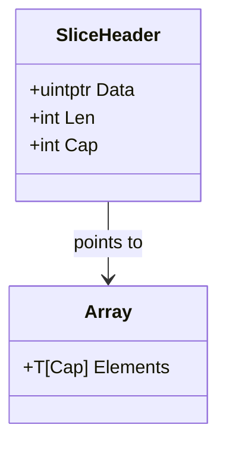
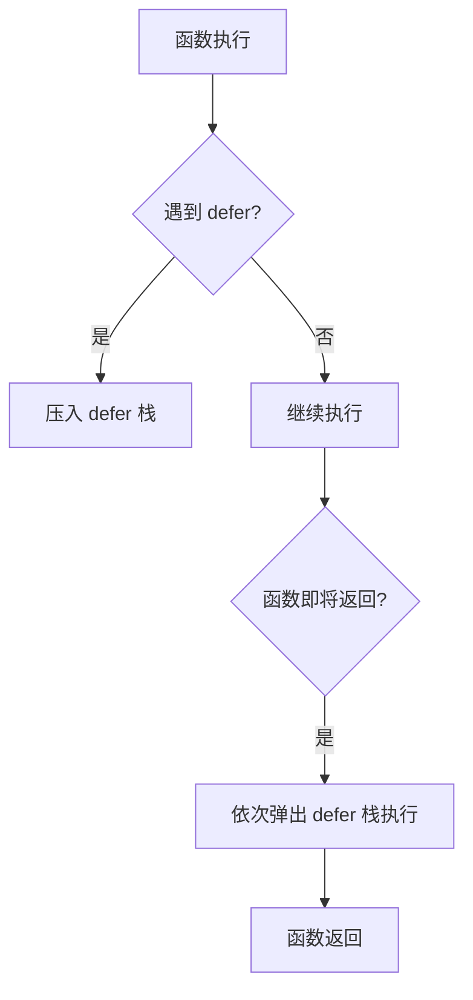
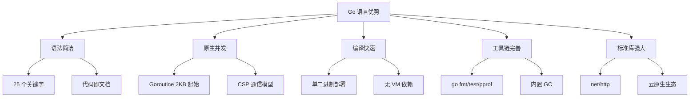
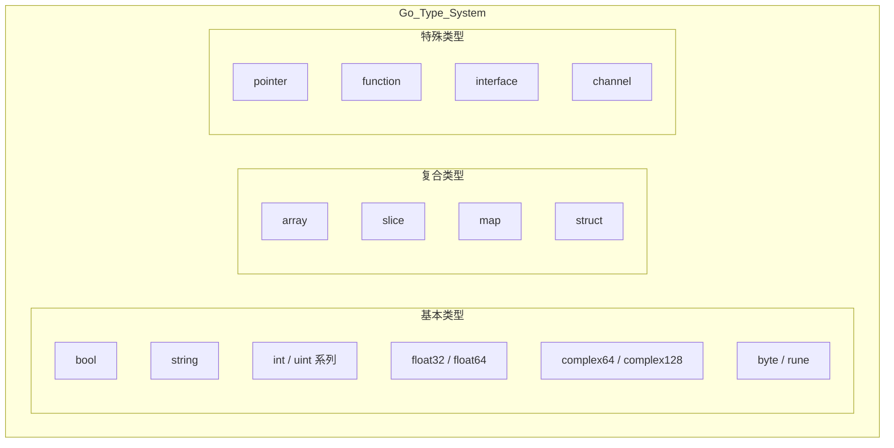

# 篇一 · 语言内功 · 01 Go 基础语法与类型系统

> **定位**：Go 语法与类型系统打底：值/引用语义、slice、map、零值、类型转换、defer
> **面试权重**：🔥🔥🔥🔥🔥 必考 ｜ **前置**：无（本系列起点）
> **🔁 前端类比**：JS 的 `let/const` + 数组/对象 → Go 的值语义与指针；TS 类型只在编译期，Go 类型参与内存布局

## 🧭 核心考点

- 值类型 vs 引用类型：struct 拷贝 vs slice/map 共享底层数组
- slice 三要素（ptr/len/cap）与扩容、截取共享内存的坑
- map 非并发安全与哈希冲突/扩容
- defer 的 LIFO 与循环中的资源泄漏
- 零值可用与显式类型转换（Go 无隐式转换）

## 📑 本篇题目索引（共 7 题）

| # | 题目 | 难度 | 频率 |
|---|------|------|------|
| Q1 | `slice` 和 `array` 的区别是什么？`slice` 的底层结构是怎样的？ | ⭐⭐ | 🔥 高频 |
| Q2 | `map` 是并发安全的吗？如何安全地在并发环境中读写 `map`？ | ⭐⭐ | 🔥 高频 |
| Q3 | `defer` 的执行顺序是什么？在循环中使用 `defer` 有什么风险？ | ⭐⭐ | 🔥 高频 |
| Q4 | 与其他语言相比，使用 Go 有什么好处？ | ⭐⭐⭐ | 📌 常考 |
| Q5 | Go 使用什么数据类型？ | ⭐⭐⭐ | 📌 常考 |
| Q6 | Go 程序中的包是什么？ | ⭐⭐⭐ | 📌 常考 |
| Q7 | Go 支持什么形式的类型转换？将整数转换为浮点数。 | ⭐⭐⭐ | 📌 常考 |

---

### Q1: `slice` 和 `array` 的区别是什么？`slice` 的底层结构是怎样的？

**难度**：⭐⭐ | **频率**：🔥 高频

**考点**：值类型 vs 引用类型、切片扩容机制、内存布局。

**💡 记忆关键词**：值/引用、指针+len+cap、1.18 扩容策略

**答案要点**：
- `array` 是**值类型**，长度是类型的一部分（`[3]int` 与 `[4]int` 是不同类型），赋值/传参**整体拷贝**。
- `slice` 本身也是**值类型**（一个三字段的描述符：`ptr`/`len`/`cap`），但拷贝时只复制描述符、**共享同一底层数组**，所以语义上表现得像引用类型 —— 面试务必说清这个区别。
- **扩容规则**（易考且常被答错）：
  - **Go 1.18 之前**：`cap < 1024` 时翻倍；`cap ≥ 1024` 时每次增加 25%（`newcap += newcap/4`）；
  - **Go 1.18 起**：阈值改为 **256**。`newcap < 256` 时翻倍；`newcap ≥ 256` 时按 `newcap += (newcap + 3*256) / 4` 平滑过渡，增长因子从约 **2.0 逐步逼近 1.25**（越大的切片增长越接近 1.25 倍）；
  - 之后还要按 `size class` 做**内存对齐（roundupsize）**，所以观察到的容量往往比公式算出的更大（如 `append` 到 5 个元素时 `cap` 可能是 6 或 8）。
- **截取共享底层数组的坑**：`s2 := s1[1:3]` 与 `s1` 共享内存，改 `s2` 会影响 `s1`；`append(s2, x)` 可能覆盖 `s1` 的数据（若未触发扩容）。要独立副本用 `slices.Clone(s)` 或 `copy`。

**🔁 前端类比**：JS 数组是「引用 + 可随意变长」；Go 用 `array`（定长值）+ `slice`（可增长的视图）把这两件事拆开了，`len`/`cap` 就等于「已用长度」与「已申请容量」。

**⚠️ 常见误区**：① 说「slice 是引用类型」（更准确的说法是「值类型但共享底层数组」）；② 把扩容讲成「一律 1.25 倍」或「小于 1024 翻倍」（那是 **Go 1.18 之前**的规则）。

**📝 一句话总结**：array 定长值拷贝，slice 是 ptr+len+cap 的描述符且共享底层数组；Go 1.18 起扩容阈值是 256，增长因子从 2.0 平滑逼近 1.25，最后还会按 size class 对齐。



### Q2: `map` 是并发安全的吗？如何安全地在并发环境中读写 `map`？

**难度**：⭐⭐ | **频率**：🔥 高频

**考点**：并发安全、`sync.Map`、读写锁。

**💡 记忆关键词**：非并发安全、fatal error、RWMutex/sync.Map/分片

**答案要点**：
- 原生 `map` 不是并发安全的，并发读写会触发 `fatal error: concurrent map writes`。
- 解决方案：
  1. 使用 `sync.RWMutex` 保护原生 `map`（适合读多写少）。
  2. 使用 `sync.Map`（适合读多写少或键空间稳定的场景，内部使用空间换时间的冗余机制）。
  3. 分片加锁（Sharding），如 `concurrent-map` 库。

### Q3: `defer` 的执行顺序是什么？在循环中使用 `defer` 有什么风险？

**难度**：⭐⭐ | **频率**：🔥 高频

**考点**：栈结构、延迟执行、资源泄漏。

**💡 记忆关键词**：LIFO、后进先出、循环陷阱、匿名函数包裹

**答案要点**：
- `defer` 遵循 LIFO（后进先出）原则。
- 在循环中注册 `defer` 会导致函数返回前才执行，若循环次数巨大，会占用大量栈空间或导致文件描述符/连接延迟释放。
- **最佳实践**：在循环内使用匿名函数包裹 `defer`，或手动 `Close()`。



---

### 1.1 接口与错误处理

### Q4: 与其他语言相比，使用 Go 有什么好处？

**难度**：⭐⭐⭐ | **频率**：📌 常考
**考点**：语言特性对比、并发模型、编译速度、工程化。
**答案要点**：
- 语法简洁，学习曲线低，代码可读性强（关键字仅 25 个）。
- 原生并发支持（goroutine + channel），基于 CSP 模型，轻量级且高效。
- 编译速度快，直接编译为机器码，无虚拟机依赖，部署简单（单二进制文件）。
- 内置垃圾回收（GC），工具链完善（`go fmt`, `go test`, `go pprof`, `go vet`）。
- 标准库强大，`net/http`、`encoding/json`、`crypto` 等开箱即用，适合网络编程和微服务。
- **技术发展**：Go 自 2009 年发布以来，在云原生领域（Docker, K8s, Prometheus, Etcd）占据主导地位，2026 年已成为后端开发的主流语言之一。



### Q5: Go 使用什么数据类型？

**难度**：⭐⭐⭐ | **频率**：📌 常考
**考点**：基本类型、复合类型、特殊类型、零值机制。
**答案要点**：
- **基本类型**：`bool`, `string`, `int`/`int8`/`int16`/`int32`/`int64`, `uint`/`uint8`/`uint16`/`uint32`/`uint64`, `float32`/`float64`, `complex64`/`complex128`, `byte`（`uint8` 别名）, `rune`（`int32` 别名，表示 Unicode 码点）。
- **复合类型**：`array`（固定长度）, `slice`（动态数组）, `map`（哈希表）, `struct`（结构体）。
- **特殊类型**：`pointer`（指针）, `function`（函数）, `interface`（接口）, `channel`（通道）。
- **零值机制**：声明未赋值时自动初始化为零值（数值为 `0`，字符串为 `""`，布尔为 `false`，引用类型为 `nil`）。



### Q6: Go 程序中的包是什么？

**难度**：⭐⭐⭐ | **频率**：📌 常考
**考点**：包管理、可见性规则、模块化、go mod。
**答案要点**：
- 包是代码组织的基本单元，每个 `.go` 文件必须声明所属的包（`package xxx`）。
- `main` 包是可执行程序的入口，必须包含 `main()` 函数。
- **可见性规则**：大写字母开头的标识符（变量、函数、类型）对外包可见（导出），小写字母开头仅包内可见。
- `go mod` 管理依赖，支持语义化版本（SemVer），`go.mod` 记录直接依赖，`go.sum` 记录哈希校验。

### Q7: Go 支持什么形式的类型转换？将整数转换为浮点数。

**难度**：⭐⭐⭐ | **频率**：📌 常考
**考点**：显式转换、类型断言、类型选择、转换规则。
**答案要点**：
- Go **不支持隐式类型转换**，所有类型转换必须显式声明。
- **数值类型转换**：`T(value)` 语法，如 `float64(intValue)`。
- **类型断言**：`value, ok := interfaceVar.(ConcreteType)`，用于从接口提取具体值。
- **类型选择**：`switch v := interfaceVar.(type) { case int: ... case string: ... }`。

```go
var i int = 42
var f float64 = float64(i)
var u uint = uint(i)
var b byte = byte(i)

var x interface{} = "hello"
if s, ok := x.(string); ok {
    fmt.Println(s)
}

func describe(v interface{}) {
    switch t := v.(type) {
    case int:
        fmt.Printf("整数: %d\n", t)
    case string:
        fmt.Printf("字符串: %s\n", t)
    default:
        fmt.Printf("未知类型: %T\n", t)
    }
}
```

---

## ✅ 自测清单（答不出就回去看对应题）

- [ ] 能脱离资料讲清本篇「核心考点」中的每一条
- [ ] 能手写/口述至少 2 道 🔥 高频题的最小实现
- [ ] 能结合自己的项目讲出 1 个坑或 1 次调优

