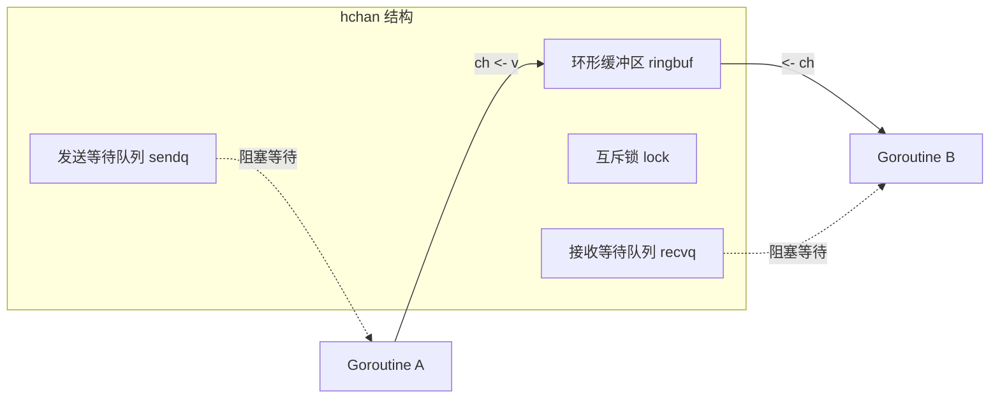

# 篇一 · 语言内功 · 03 并发编程（goroutine / channel / sync / context）

> **定位**：Go 面试区分度最高的一篇：并发原语、并发模式、泄漏与死锁排查
> **面试权重**：🔥🔥🔥🔥🔥 必考 ｜ **前置**：1-01、1-02
> **🔁 前端类比**：`Promise.all` / `async-await` → `goroutine + channel + select`；`AbortController` → `context` 取消传播；Web Worker → goroutine，但 goroutine 便宜几个数量级。

## 🧭 核心考点

- goroutine 与 OS 线程的成本差异（2KB 栈、用户态调度）
- channel 的阻塞语义、缓冲、关闭规则与**五大陷阱**
- `select` 多路复用、超时与非阻塞收发
- `sync` 全家桶：`Mutex` / `RWMutex` / `WaitGroup` / `Once` / `Pool` / `Map` / `atomic`
- `context`：取消、超时、值传递与传播规范（**面试必问**）
- 并发模式与 goroutine 泄漏排查

## 📑 本篇题目索引（共 14 题）

| # | 题目 | 难度 | 频率 |
|---|------|------|------|
| Q1 | `goroutine` 和操作系统线程的区别？为什么 Go 并发更高效？ | ⭐⭐ | 🔥 高频 |
| Q2 | 如何停止一个 goroutine？ | ⭐⭐ | 🔥 高频 |
| Q3 | `channel` 的底层实现？无缓冲和有缓冲的区别？ | ⭐⭐⭐ | 🔥 高频 |
| Q4 | 使用 channel 有哪些陷阱？ | ⭐⭐⭐ | 🔥 高频 |
| Q5 | channel 缓冲有什么特点？如何用 channel 做限流？ | ⭐⭐ | 📌 常考 |
| Q6 | `sync.Mutex` / `RWMutex` 有什么特点？ | ⭐⭐⭐ | 🔥 高频 |
| Q7 | `sync` 包里 `WaitGroup` / `Once` / `Cond` / `Poo… | ⭐⭐⭐ | 🔥 高频 |
| Q8 | `select` 的底层机制与典型用法？ | ⭐⭐⭐ | 🔥 高频 |
| Q9 | `context` 是什么？取消信号如何传播？ | ⭐⭐⭐ | 🔥 高频 |
| Q10 | 常见并发模式有哪些（fan-out/fan-in、worker pool、pipeline）… | ⭐⭐⭐ | 🔥 高频 |
| Q11 | 什么是数据竞争（Data Race）？如何检测与避免？ | ⭐⭐⭐ | 📌 常考 |
| Q12 | goroutine 泄漏的常见原因与排查手段？ | ⭐⭐⭐⭐ | 🔥 高频 |
| Q13 | 如何实现并发安全的单例？ | ⭐⭐ | 🔥 高频 |
| Q14 | 原子操作 vs 锁，怎么选？ | ⭐⭐⭐ | 📌 常考 |

---

## 3.1 goroutine

### Q1: `goroutine` 和操作系统线程的区别？为什么 Go 并发更高效？

**难度**：⭐⭐ | **频率**：🔥 高频

**考点**：用户态调度、栈成本、切换成本、GMP 初探。

**💡 记忆关键词**：2KB vs 1~8MB、用户态切换、几十万并发、M:N 映射

**答案要点**：

| 维度 | OS 线程 | goroutine |
|------|---------|-----------|
| 管理者 | 内核 | Go runtime（用户态） |
| 初始栈 | 通常 1~8MB（固定） | **约 2KB**，按需扩缩（64 位上限 1GB） |
| 切换成本 | 陷入内核、保存大量寄存器 | 仅保存少量寄存器，用户态完成 |
| 映射关系 | 1:1 | **M:N**（多个 G 复用多个 M，由 P 调度） |
| 创建成本 | 昂贵（系统调用） | 廉价（一次函数调用） |

- 单机可轻松运行**数十万** goroutine；阻塞的网络 IO 由 netpoller 接管，不占线程（详见 2-05）。

**🔁 前端类比**：Web Worker 是 OS 线程级别的「重」并发，通常只开几个；goroutine 类似「任务」粒度，可以随手创建。JS 的单线程 Event Loop 则完全无法利用多核。

**⚠️ 常见误区**：「goroutine 廉价」不等于「可以随便起不管」——泄漏的 goroutine 一样会吃内存、吃调度、拖垮 GC。

**📝 一句话总结**：goroutine 是 runtime 管理的用户态协程，2KB 起栈 + M:N 调度，所以「便宜到可以随手开」。

---

### Q2: 如何停止一个 goroutine？

**难度**：⭐⭐ | **频率**：🔥 高频

**考点**：协作式退出、context、channel 信号、无外部强杀。

**💡 记忆关键词**：不能外部强杀、函数返回 / channel / context、协作式退出

**答案要点**：
- **Go 没有「从外部杀死 goroutine」的 API**，设计哲学是**协作式退出**：让 goroutine 自己检查退出信号并返回。
- 三种常用方式：
  1. **函数自然返回**：最简单，任务跑完即退出。
  2. **channel 信号**：`done := make(chan struct{})`，`close(done)` 广播退出（**关闭 channel 会唤醒所有接收者**，这是广播的惯用法）。
  3. **`context` 取消**（推荐）：`context.WithCancel` / `WithTimeout`，可层层传播，适合 goroutine 树与请求链路。
- **注意**：退出时要释放资源（`defer close` / `defer cancel()`），避免泄漏。

```go
// 1) channel 广播退出
done := make(chan struct{})
go func() {
    defer wg.Done()
    ticker := time.NewTicker(time.Second)
    defer ticker.Stop()
    for {
        select {
        case <-done:
            return
        case <-ticker.C:
            doWork()
        }
    }
}()
close(done) // 一次关闭，所有监听者退出

// 2) context 取消（推荐：可超时、可级联）
ctx, cancel := context.WithTimeout(context.Background(), 3*time.Second)
defer cancel() // 务必调用，否则定时器资源泄漏到超时为止
go func() {
    for {
        select {
        case <-ctx.Done():
            return // ctx.Err() 可知是 Canceled 还是 DeadlineExceeded
        default:
            doWork()
        }
    }
}()
```

**🔁 前端类比**：就是 `AbortController.abort()` → `fetch` 的 `signal` → 请求中断，Go 里把这个模式标准化成了 `context` 并贯穿标准库。

**📝 一句话总结**：goroutine 只能「劝退」不能「强杀」——用 `context` 或关闭 channel 通知它自己返回。

---

## 3.2 channel

### Q3: `channel` 的底层实现？无缓冲和有缓冲的区别？

**难度**：⭐⭐⭐ | **频率**：🔥 高频

**考点**：`hchan` 结构、环形缓冲、sendq/recvq、阻塞唤醒。

**💡 记忆关键词**：hchan、环形缓冲区、sendq/recvq、同步 vs 异步

**答案要点**：
- 底层是 `runtime.hchan`，核心字段：`buf`（环形缓冲区）、`sendx/recvx`（读写下标）、`lock`、`sendq`/`recvq`（阻塞在该 channel 上的 goroutine 等待队列，元素是 `sudog`）。
- **无缓冲**（`make(chan T)`）：**同步通信**，发送方与接收方必须同时就绪才完成交接（直接把数据从发送 G 拷贝给接收 G），否则阻塞。
- **有缓冲**（`make(chan T, n)`）：**异步通信**，缓冲区未满即可发送、未空即可接收；满则发送阻塞，空则接收阻塞。
- **关闭语义**：`close(ch)` 后不能再发送（panic），接收会立即得到零值 + `ok == false`；关闭会唤醒所有等待的 goroutine。



**📝 一句话总结**：`hchan` = 环形缓冲 + 两等待队列 + 一把锁；无缓冲是「一手交钱一手交货」，有缓冲是「放货架上」。

---

### Q4: 使用 channel 有哪些陷阱？

**难度**：⭐⭐⭐ | **频率**：🔥 高频

**考点**：nil/已关闭 channel、重复关闭、零值接收、循环 defer。

**💡 记忆关键词**：nil 永久阻塞、关后发送 panic、重复关闭 panic、关后收零值、谁发送谁关闭

**答案要点**（**面试常要求一口气说出**）：
1. 向 **nil channel** 发送或接收会**永久阻塞**（`var ch chan int; ch <- 1` 死锁）——但 `select` 中把 channel 置 nil 可「禁用」某个 case，这是有用的技巧。
2. 向**已关闭**的 channel 发送会 **panic**。
3. 从**已关闭**的 channel 接收会立即返回**零值**，必须用 `v, ok := <-ch` 判断。
4. **重复关闭** channel 会 **panic**；关闭 nil channel 也 panic。
5. 在**循环里** `defer close(ch)` 会延迟到函数返回才执行，易造成资源长时间不释放。
6. **责任约定**：**由发送方关闭** channel（或唯一的生产者关闭），不要在多个 goroutine 中随意关闭。

```go
// 安全读取：判断通道是否关闭
if v, ok := <-ch; ok {
    fmt.Println("收到:", v)
} else {
    fmt.Println("通道已关闭")
}

// 非阻塞收发（select + default）
select {
case ch <- 42:
    fmt.Println("发送成功")
default:
    fmt.Println("缓冲已满，丢弃或降级")
}
```

**⚠️ 加分点**：`for v := range ch` 会在 channel 关闭且缓冲排空后自动退出，是最安全的消费写法。

**📝 一句话总结**：nil 阻塞、关闭后发送 panic、重复关闭 panic、关闭后收零值——记住「发送方负责关闭」。

---

### Q5: channel 缓冲有什么特点？如何用 channel 做限流？

**难度**：⭐⭐ | **频率**：📌 常考

**考点**：背压、并发度控制、信号量模式。

**💡 记忆关键词**：背压、缓冲即并发额度、semaphore、worker pool

**答案要点**：
- **无缓冲**用于同步协调（等待某事件、交接所有权）；**有缓冲**用于解耦生产/消费速度、做任务队列。
- **背压（Backpressure）**：缓冲满时发送方阻塞，天然限制上游速度，防止把内存打爆。
- **限流/并发度控制**：用「带缓冲 channel 当信号量」——获取额度发送、释放额度接收。

```go
// 用缓冲 channel 控制最大并发数（信号量模式）
sem := make(chan struct{}, 10) // 最多 10 个并发
for _, task := range tasks {
    sem <- struct{}{} // 占一个坑，满了就阻塞（背压）
    go func(t Task) {
        defer func() { <-sem }() // 释放
        process(t)
    }(task)
}
// 等待全部完成：再填满信号量说明所有 goroutine 都已释放
for i := 0; i < cap(sem); i++ {
    sem <- struct{}{}
}
```

**📝 一句话总结**：缓冲 channel 既是队列也是并发额度，用「发送占坑、接收放坑」就是最简单的并发限流。

---

## 3.3 sync 包

### Q6: `sync.Mutex` / `RWMutex` 有什么特点？

**难度**：⭐⭐⭐ | **频率**：🔥 高频

**考点**：互斥/读写锁、不可重入、饥饿模式、TryLock、锁粒度。

**💡 记忆关键词**：不可重入、正常模式+饥饿模式、RLock 可并发读、defer 解锁、锁粒度

**答案要点**：
- `sync.Mutex`：同一时刻只允许一个 goroutine 进入临界区。**不可重入**（同一 goroutine 重复 Lock 会死锁）。
- 内部有**正常模式**（自旋 + FIFO 排队，吞吐优先）与**饥饿模式**（等待超过 1ms 直接移交锁，防止尾部延迟），解锁时在这两种模式间切换。
- `sync.RWMutex`：允许多个读并发，**写独占且阻塞所有读**；适合**读多写少**。
- Go 1.18+ 提供 `TryLock()`（拿不到立即返回 false，**不要用它做自旋**）。
- **实践**：
  - 用 `defer mu.Unlock()` 保证释放；
  - **缩小临界区**（不要在锁内做 IO / 调用外部函数）；
  - 锁不要拷贝（复制含锁的结构体会导致锁失效，`go vet` 的 `copylock` 会报警）。

```go
var mu sync.Mutex
var counter int

func Inc() {
    mu.Lock()
    defer mu.Unlock()
    counter++
}

var rw sync.RWMutex
var cache = map[string]string{}

func Get(k string) string {
    rw.RLock()
    defer rw.RUnlock()
    return cache[k]
}

func Set(k, v string) {
    rw.Lock()
    defer rw.Unlock()
    cache[k] = v
}
```

**📝 一句话总结**：Mutex 互斥且不可重入，RWMutex 适合读多写少；锁要小粒度、别拷贝、别在锁里做 IO。

---

### Q7: `sync` 包里 `WaitGroup` / `Once` / `Cond` / `Pool` / `Map` 分别用在哪？

**难度**：⭐⭐⭐ | **频率**：🔥 高频

**考点**：并发原语选型、各自适用与不适用场景。

**💡 记忆关键词**：WaitGroup 等一组、Once 只一次、Cond 等条件、Pool 复用对象、Map 读多写少/键稳定

**答案要点**：

| 原语 | 用途 | 要点与坑 |
|------|------|----------|
| `WaitGroup` | 等待一组 goroutine 结束 | `Add` 要在启动 goroutine **之前**调用；`Wait` 与 `Add` 并发调用是数据竞争；Go 1.25 有 `wg.Go(f)` 简化写法 |
| `Once` | 只执行一次（单例、惰性初始化） | `Do` 内的 panic 也会标记为已执行 |
| `Cond` | 等待某个条件成立（比 `for + sleep` 高效） | 必须配合锁使用，且用 `for` 循环检查条件（防止虚假唤醒） |
| `Pool` | 复用临时对象，降低 GC 压力 | 取出的对象**必须重置**；Pool 中的对象**随时可能被 GC 回收**，不能当缓存用 |
| `Map` | 并发安全 map | 适合**读多写少**或**键集合稳定**（如每个 goroutine 写自己的键）；频繁写新键时不如 `RWMutex + map` |

```go
// WaitGroup：并发抓取并聚合
var wg sync.WaitGroup
results := make([]Result, len(urls))
for i, u := range urls {
    wg.Add(1)
    go func(i int, u string) {
        defer wg.Done()
        results[i] = fetch(u) // 各写各的下标，无竞争
    }(i, u)
}
wg.Wait()

// sync.Pool：复用 buffer
var bufPool = sync.Pool{New: func() any { return new(bytes.Buffer) }}
buf := bufPool.Get().(*bytes.Buffer)
buf.Reset()          // 必须重置
defer bufPool.Put(buf)
```

**📝 一句话总结**：等一组用 WaitGroup，只一次用 Once，等条件用 Cond，省 GC 用 Pool，并发 map 优先看读写比再决定 sync.Map 还是 RWMutex+map。

---

## 3.4 select 与 context

### Q8: `select` 的底层机制与典型用法？

**难度**：⭐⭐⭐ | **频率**：🔥 高频

**考点**：多路复用、随机选择、超时与心跳、nil channel 禁用 case。

**💡 记忆关键词**：同时就绪随机选、default 非阻塞、time.After 超时、nil 禁用分支

**答案要点**：
- `select` 同时监听多个 channel 操作；**若多个 case 同时就绪，会随机选一个**（避免饿死）。
- 无 `default` 且都未就绪 → 阻塞；有 `default` → 立即返回，实现非阻塞收发。
- 典型用法：
  1. **超时控制**：`case <-time.After(d)`（注意：在循环里用 `time.After` 会每次新建定时器，长时间循环应改用 `time.NewTimer` + `Reset`）；
  2. **退出信号**：`case <-ctx.Done()`；
  3. **心跳/定时**：`case <-ticker.C`；
  4. **禁用分支**：把某个 channel 置为 `nil`，对应 case 永远不就绪（常用在「消费完就不再消费」的场景）。

```go
func doWithTimeout(ctx context.Context, d time.Duration) error {
    timer := time.NewTimer(d)
    defer timer.Stop()
    select {
    case r := <-resultCh:
        return handle(r)
    case <-ctx.Done():
        return ctx.Err() // 上游取消
    case <-timer.C:
        return errors.New("timeout")
    }
}
```

**📝 一句话总结**：select 是 Go 的「事件循环」——多 case 就绪时随机选，`default` 变非阻塞，`nil` 通道可禁用分支。

---

### Q9: `context` 是什么？取消信号如何传播？

**难度**：⭐⭐⭐ | **频率**：🔥 高频

**考点**：四种 context、取消树、超时、值传递规范。

**💡 记忆关键词**：Background/WithCancel/WithTimeout/WithValue、父死子亡、ctx 作第一个参数、defer cancel

**答案要点**：
- **作用**：在 goroutine 树中传递**取消信号、截止时间、请求级数据**，是解决「请求取消/超时传播」的标准方案。
- **四种构造**：
  - `context.Background()`：根 context（`TODO()` 用于暂时不确定时）；
  - `WithCancel`：手动取消；
  - `WithTimeout` / `WithDeadline`：超时/到期自动取消；
  - `WithValue`：传值（**只用于请求级元数据**，如 traceID；不要用它传业务参数或可选参数）。
- **传播机制**：子 context 持有父的引用，**父 context 取消会级联取消所有子孙**；子 context 取消不影响父。
- **规范**：
  - `ctx` 作为**函数的第一个参数**，命名为 `ctx`；
  - **不要**把 context 存在结构体里（应在调用链显式传递）；
  - 派生 context 后**必须 `defer cancel()`**，否则定时器/父引用会泄漏到超时为止；
  - 下游函数应在阻塞处检查 `ctx.Done()`。

```go
func handler(ctx context.Context, userID string) error {
    ctx, cancel := context.WithTimeout(ctx, 2*time.Second)
    defer cancel()
    return queryDB(ctx, userID) // 取消信号随调用链传播到 DB 驱动
}
```

**🔁 前端类比**：`AbortController` 的 signal 可以在多层 `fetch` 间传递，Go 把它做成了贯穿标准库的 `context`。

**⚠️ 常见误区**：用 `WithValue` 传业务参数（会变成隐式耦合）；忘记 `defer cancel()`（典型泄漏源）。

**📝 一句话总结**：context 是「取消信号 + 截止时间 + 请求元数据」的载体，父取消级联子，ctx 放第一个参数并记得 `defer cancel()`。

---

## 3.5 并发模式与问题排查

### Q10: 常见并发模式有哪些（fan-out/fan-in、worker pool、pipeline）？

**难度**：⭐⭐⭐ | **频率**：🔥 高频

**考点**：channel 编排、关闭责任、结果聚合、错误处理。

**💡 记忆关键词**：扇出并行、扇入合并、流水线分段、谁生产谁关闭、errgroup 收敛错误

**答案要点**：
- **Fan-out（扇出）**：多个 goroutine 从同一个输入 channel 取任务并行处理。
- **Fan-in（扇入）**：把多个输出 channel 合并到一个 channel（用 `WaitGroup` 在所有生产者结束后**关闭**结果 channel）。
- **Pipeline（流水线）**：每个 stage 是 `func(in <-chan T) <-chan U`，stage 内部起 goroutine 消费输入、产出输出，**由 stage 自己关闭输出 channel**。
- **Worker Pool**：固定数量 worker 消费任务队列（见 Q5 的信号量/队列写法），控制并发度并复用 goroutine。
- **错误收敛**：使用 `golang.org/x/sync/errgroup`（`WithContext` 可在首个错误时取消整组任务）。

```go
// Fan-out + Fan-in：并发处理并合并结果
func merge(cs ...<-chan int) <-chan int {
    var wg sync.WaitGroup
    out := make(chan int)
    for _, c := range cs {
        wg.Add(1)
        go func(c <-chan int) {
            defer wg.Done()
            for v := range c {
                out <- v
            }
        }(c)
    }
    go func() {   // 所有生产者结束后关闭 out
        wg.Wait()
        close(out)
    }()
    return out
}
```

**📝 一句话总结**：扇出提并行、扇入做聚合、流水线分段；记住「谁生产谁关闭」，`errgroup` 收敛错误与取消。

---

### Q11: 什么是数据竞争（Data Race）？如何检测与避免？

**难度**：⭐⭐⭐ | **频率**：📌 常考

**考点**：竞争条件、-race、原子性、内存可见性。

**💡 记忆关键词**：并发读写且无同步、-race 检测、锁/原子/channel、不要靠「看起来没问题」

**答案要点**：
- **定义**：两个以上 goroutine 并发访问同一内存，**至少一个是写**，且**没有同步顺序**——结果依赖调度时序，属于未定义行为。
- **检测**：`go test -race ./...` / `go build -race`，运行时用 ThreadSanitizer 插桩，能定位到具体的读写栈（**CI 中建议常开**）。
- **避免手段**：
  1. **不要共享**——用 channel 传递所有权（"Don't communicate by sharing memory; share memory by communicating"）；
  2. **加锁**（Mutex/RWMutex）保护临界区；
  3. **原子操作**（`sync/atomic` 的 `Int64`、`Bool`、`Pointer`，Go 1.19+ 推荐类型化 API）用于简单计数/标志位；
  4. 注意 **`for` 循环变量捕获**（Go 1.22+ 已修复）与**闭包捕获可变变量**。

```go
var (
    mu      sync.Mutex
    visits  int
    counter atomic.Int64 // 简单计数用原子，避免锁开销
)

func inc() {
    counter.Add(1)
    mu.Lock()
    visits++
    mu.Unlock()
}
```

**📝 一句话总结**：并发读 + 写且无同步就是数据竞争；用 `-race` 检出，用「不共享 / 加锁 / 原子」三选一消除。

---

### Q12: goroutine 泄漏的常见原因与排查手段？

**难度**：⭐⭐⭐⭐ | **频率**：🔥 高频

**考点**：泄漏场景、pprof、goroutine dump、Go 1.27 新 profile。

**💡 记忆关键词**：无人接收的发送、阻塞在 nil/未关闭 channel、忘 cancel、死锁、pprof/goroutineleak

**答案要点**（**面试高频追问**）：
- **常见原因**：
  1. 向**没有接收者**的 channel 发送（或缓冲满后无人消费）→ goroutine 永久阻塞在发送；
  2. 从**永不关闭且永不发送**的 channel 接收 → 永久阻塞在接收；
  3. **提前 return 导致剩余 goroutine 卡在发送**（经典：收集结果时遇错直接返回，其余 goroutine 全泄漏）；
  4. 忘记调用 `cancel()`，导致子 context 树与定时器不释放；
  5. 死锁（互相等待、锁顺序不一致）。
- **排查手段**：
  1. `pprof` 的 **goroutine profile**（`/debug/pprof/goroutine?debug=2`）看阻塞栈与数量增长；
  2. 监控 goroutine 数（`runtime.NumGoroutine()` 或 `runtime/metrics`），持续上涨即泄漏信号；
  3. `go tool trace` 看 goroutine 状态分布；
  4. **Go 1.26 实验 / Go 1.27 转正的 `goroutineleak` profile**（`/debug/pprof/goroutineleak`）可直接报告「不可能再被唤醒」的 goroutine。
- **预防**：给每个 goroutine 明确的退出路径；用 `context` 统一取消；用带缓冲 channel 或 `select + default` 兜底；单测里断言 goroutine 数不增长。

```go
// 典型泄漏：出错提前 return，其余 goroutine 卡在 ch <- 上
for range len(ws) {
    r := <-ch
    if r.err != nil {
        return nil, r.err // 泄漏！ch 是无缓冲的
    }
}
// 修正：用 errgroup + context，或让发送方 select ctx.Done()
```

**📝 一句话总结**：泄漏 = goroutine 永远卡在「发送/接收/等锁」；用 goroutine 数监控 + pprof 定位，用 context 与明确的退出路径预防。

---

### Q13: 如何实现并发安全的单例？

**难度**：⭐⭐ | **频率**：🔥 高频

**考点**：`sync.Once`、双重检查锁、原子标志。

**💡 记忆关键词**：sync.Once、优于双重检查、Do 内 panic 也算执行过

**答案要点**：
- **最佳实践**：`sync.Once`，内部用原子标志 + Mutex，保证函数只执行一次，且并发调用会阻塞等待初始化完成（无竞态窗口）。
- **不要用双重检查锁**：在 Go 中既没有必要，也容易因缺少同步语义而出错。

```go
var (
    instance *Client
    once     sync.Once
)

func GetClient() *Client {
    once.Do(func() {
        instance = newClient() // 只执行一次
    })
    return instance
}
```

**📝 一句话总结**：单例用 `sync.Once`，别手写双重检查锁。

---

### Q14: 原子操作 vs 锁，怎么选？

**难度**：⭐⭐⭐ | **频率**：📌 常考

**考点**：CAS、适用场景、性能与可读性权衡。

**💡 记忆关键词**：简单变量用原子、复合操作用锁、CAS 防 ABA 误用、优先可读性

**答案要点**：
- **原子操作**（`sync/atomic`）：适用于**单个变量**的读写、自增、CAS（如计数器、状态标志、无锁队列）。开销远小于锁（无内核态切换）。
- **锁**：适用于**多个变量的复合不变式**或临界区包含一段逻辑（如「检查再更新」涉及两个字段）。原子操作无法保证多步操作的整体原子性。
- **CAS 注意**：`CompareAndSwap` 需处理失败重试；复杂数据结构上的 CAS 要警惕 **ABA 问题**（Go 无内建 tagged pointer，通常靠版本号字段解决）。
- **建议**：先用锁保证正确，压测证明锁是瓶颈后再换原子或无锁结构，并保留 benchmark 证据。

**📝 一句话总结**：单个变量用原子，一段逻辑用锁；先用锁写对，再用数据证明可以优化。

---

## ✅ 自测清单（答不出就回去看对应题）

- [ ] 能一口气说出 channel 的五大陷阱
- [ ] 能手写一个带超时与取消的并发任务（context + select + WaitGroup）
- [ ] 能说清 fan-out / fan-in 中「谁负责关闭 channel」
- [ ] 能讲出 3 种 goroutine 泄漏场景与对应排查手段
- [ ] 能说明 `sync.Map`、原子操作、锁的选型依据
