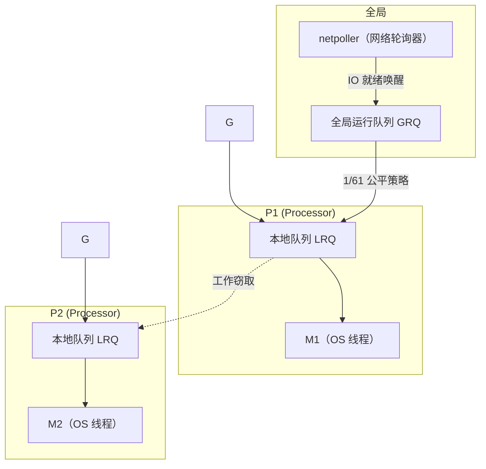

# 篇二 · 底层原理 · 05 GMP 调度模型

> **定位**：Go 高并发的根本：G/M/P 三要素、调度循环、工作窃取、系统调用与 netpoller
> **面试权重**：🔥🔥🔥🔥🔥 必考 ｜ **前置**：1-03 并发编程
> **🔁 前端类比**：浏览器 Event Loop 是「单线程 + 任务队列」；GMP 是「多核并行 + 用户态调度 + 网络轮询器」。Node 靠 `libuv` 把阻塞 IO 丢给线程池，Go 靠 netpoller 让网络 IO 完全不占线程。

## 🧭 核心考点

- G / M / P 三者的职责与数量关系（`GOMAXPROCS` = P 的数量）
- 调度循环：本地队列 → 全局队列 → 工作窃取，以及 1/61 的全局队列公平策略
- 抢占：协作式（函数调用栈检查）→ Go 1.14+ 异步抢占
- 三类阻塞的不同处理：系统调用（Handoff）、网络 IO（netpoller）、用户态阻塞（G 挂起）
- `GOMAXPROCS` 容器感知（Go 1.25+）与 goroutine 泄漏诊断（Go 1.27 的 `goroutineleak` profile）

## 📑 本篇题目索引（共 9 题）

| # | 题目 | 难度 | 频率 |
|---|------|------|------|
| Q1 | 详细描述 Go 的 GMP 调度模型。 | ⭐⭐⭐⭐ | 🔥 高频 |
| Q2 | `GOMAXPROCS` 是什么？设置多大合适？ | ⭐⭐⭐ | 🔥 高频 |
| Q3 | goroutine 的栈是如何管理的？与线程栈有何不同？ | ⭐⭐⭐ | 🔥 高频 |
| Q4 | 调度器一次调度循环（schedule loop）做了什么？ | ⭐⭐⭐⭐ | 📌 常考 |
| Q5 | 什么是工作窃取（Work Stealing）？全局队列饥饿如何解决？ | ⭐⭐⭐⭐ | 🔥 高频 |
| Q6 | Go 如何实现抢占式调度？为什么需要异步抢占？ | ⭐⭐⭐⭐ | 📌 常考 |
| Q7 | 系统调用阻塞时调度器怎么处理（Handoff / sysmon）？ | ⭐⭐⭐⭐ | 🔥 高频 |
| Q8 | 网络 IO 为什么不阻塞线程？netpoller 原理是什么？ | ⭐⭐⭐⭐ | 🔥 高频 |
| Q9 | 线上如何判断「调度出了问题」？常见症状与排查手段 | ⭐⭐⭐⭐ | 📌 常考 |

---

## 5.1 模型总览

### Q1: 详细描述 Go 的 GMP 调度模型。

**难度**：⭐⭐⭐⭐ | **频率**：🔥 高频

**考点**：G/M/P 角色、调度器循环、用户态调度。

**💡 记忆关键词**：G 存状态、M 跑代码、P 给资源、P 的数量 = 并行度

**答案要点**：

| 角色 | 全称 | 本质 | 关键字段 |
|------|------|------|----------|
| **G** | Goroutine | 用户态协程，保存栈、指令指针 `PC`、状态（`_Grunnable`/`_Grunning`/`_Gwaiting`…） | `g0`（调度栈）、`stack`、`sched` |
| **M** | Machine | 操作系统线程的抽象，真正执行机器码的载体 | 绑定 `P` 才能执行 G |
| **P** | Processor | 逻辑处理器，持有**本地运行队列 LRQ** 与分配资源（mcache），数量由 `GOMAXPROCS` 决定 | `runq`（256 长度的环形队列）、`runnext` |

- **核心关系**：**G 需要被放到 P 的队列里，由 M 取出执行**。M 必须绑定 P 才能运行 G，所以 **P 的数量 = 最大并行度**。
- **为什么要有 P**：早期 GM 模型直接把 G 放到全局队列，所有 M 竞争一把全局锁，多核下锁竞争严重。引入 P 后，每个 P 有本地队列，**大多数调度无需加锁**，这是 GMP 的关键设计。



**🔁 前端类比**：JS 的 Event Loop 只有一个调用栈 + 任务队列，同一时刻只能跑一个任务（并行靠 Web Worker 手动开）；GMP 默认就有 `GOMAXPROCS` 个并行执行流，且调度发生在用户态，不经过内核。

**⚠️ 常见误区**：
- 「goroutine 是协程所以不会有并发问题」——错。goroutine 会**并行**跑在多核上，共享变量照样要加锁。
- 「P 的数量等于 CPU 核数所以不能改」——错，`GOMAXPROCS` 可调，IO 密集场景调大、CPU 密集场景通常等于核数最优。

**📝 一句话总结**：G 是要执行的任务，M 是干活的线程，P 是给 M 的「工位 + 本地任务队列」；P 决定并行度，本地队列让调度尽量无锁。

---

## 5.2 GOMAXPROCS 与并行度

### Q2: `GOMAXPROCS` 是什么？设置多大合适？

**难度**：⭐⭐⭐ | **频率**：🔥 高频

**考点**：并行度、容器感知（Go 1.25+）、CPU 密集 vs IO 密集。

**💡 记忆关键词**：P 的数量、默认 = CPU 核数、容器看 cgroup、IO 密集可放大

**答案要点**：
- `GOMAXPROCS` 决定 **P 的数量**，即同一时刻最多有多少个 M 在跑 Go 代码。默认值为启动时可见的 CPU 逻辑核数 `runtime.NumCPU()`。
- **Go 1.25+ 容器感知**（面试加分点）：
  1. 在 Linux 会读取**所在 cgroup 的 CPU 带宽限制**，若低于逻辑核数，则 `GOMAXPROCS` 取较小值（对应 K8s 的 `resources.limits.cpu`，**不看 requests**）。
  2. 在所有平台上，若可用核数或 cgroup 限制**发生变化**，运行时会定期更新 `GOMAXPROCS`。
  3. 手动设置 `GOMAXPROCS`（环境变量或 `runtime.GOMAXPROCS`）后以上行为自动失效；可用 `GODEBUG=containermaxprocs=0`、`updatemaxprocs=0` 单独关闭，`runtime.SetDefaultGOMAXPROCS()` 可恢复默认。
- **调优建议**：
  - **CPU 密集**：保持默认（= 核数），调大只会增加调度开销。
  - **IO 密集**（大量网络/DB 调用）：阻塞不占 M（netpoller），默认通常够用；若大量 **cgo 或阻塞系统调用**，可适当调大。
  - **容器环境**：升级到 Go 1.25+ 自动感知；老版本建议显式设置或使用 `automaxprocs` 之类的库，避免「容器限 2 核、Go 以为有 64 核」导致 GC 与调度线程暴涨。

**📝 一句话总结**：`GOMAXPROCS` = P 的数量 = 并行度；Go 1.25 起会自动看容器 CPU limit，别再手动写死。

---

## 5.3 goroutine 栈

### Q3: goroutine 的栈是如何管理的？与线程栈有何不同？

**难度**：⭐⭐⭐ | **频率**：🔥 高频

**考点**：可增长栈、栈拷贝、栈扩缩容、与线程固定栈对比。

**💡 记忆关键词**：2KB 起步、分段/连续栈拷贝、最大 1GB、按需伸缩

**答案要点**：
- **初始栈**：goroutine 创建时只分配约 **2KB** 栈（线程通常 1~8MB 且固定），因此单机创建几十万 goroutine 是可行的。
- **动态伸缩**：栈不足时运行时插入 `morestack` 检查，**申请一块更大的栈并把旧栈内容拷贝过去**（Go 1.4 后是**连续栈**方案，早期是分段栈），栈指针同步修正；空闲过多时会缩容。
- **上限**：64 位平台默认最大 1GB（32 位 250MB），超过会 `stack overflow` fatal error。
- **逃逸的边界**：栈上分配的对象随 goroutine 结束自动回收，不需要 GC 介入，这是「小对象尽量栈分配」的性能意义。

**🔁 前端类比**：JS 的调用栈同样是「栈帧动态增长」，但由引擎管理且没有并发栈；Go 每个 goroutine 都有独立可增长栈，切换成本远低于线程上下文切换（无需陷入内核）。

**📝 一句话总结**：goroutine 栈 2KB 起步、按需拷贝扩容、上限 1GB，所以「廉价」；线程栈固定且昂贵。

---

## 5.4 调度循环与工作窃取

### Q4: 调度器一次调度循环（schedule loop）做了什么？

**难度**：⭐⭐⭐⭐ | **频率**：📌 常考

**考点**：`schedule()` → `execute()` → `gogo`、找 G 的优先级顺序。

**💡 记忆关键词**：runnext → LRQ → GRQ → 偷 → netpoll，找不到就休眠

**答案要点**（`runtime.schedule()` 找下一个可运行 G 的顺序）：
1. **P.runnext**：若有 `go` 关键字刚创建且被标记为 next 的 G，优先执行（保证局部性）。
2. **本地队列 LRQ**：从 P 的本地队列取（无锁）。
3. **全局队列 GRQ**：每调度 **61 次**强制去全局队列取一次，防止全局队列里的 G 被"饿死"。
4. **工作窃取（Work Stealing）**：随机挑一个其他 P，偷取其队列**一半**的 G。
5. **netpoll**：检查网络轮询器是否有就绪的 G（非阻塞）。
6. 都找不到：M 与 P 解绑，M 休眠（或进入自旋状态自旋一会儿再睡）。

**📝 一句话总结**：先本地、再全局（1/61）、再偷别人一半、再看网络 IO，全都没有就让线程睡。

---

### Q5: 什么是工作窃取（Work Stealing）？全局队列饥饿如何解决？

**难度**：⭐⭐⭐⭐ | **频率**：🔥 高频

**考点**：负载均衡、随机 P 选择、1/61 公平策略。

**💡 记忆关键词**：偷一半、随机选 P、全局队列 1/61、负载均衡

**答案要点**：
- **动机**：多核下各 P 负载不均，若某 P 空闲而其他 P 排队，CPU 就被浪费。
- **机制**：空闲 P 随机选择另一个 P，**从对方队列尾部偷走一半** G（从尾部取，与本地从头取形成方向相反，减少冲突）。
- **全局队列饥饿**：只取本地和偷别人会让 GRQ 中的 G 长期得不到执行。调度器用 `schedtick % 61 == 0` 的计数策略，**每 61 次调度强制从全局队列取一次**，保证公平。
- **效果**：既保持了本地队列的缓存友好性，又实现了近似全局负载均衡。

**📝 一句话总结**：本地队列优先保证快，61 次一次全局保证公平，空闲就随机偷一半保证均衡。

---

### Q6: Go 如何实现抢占式调度？为什么需要异步抢占？

**难度**：⭐⭐⭐⭐ | **频率**：📌 常考

**考点**：协作式抢占、栈增长检查、Go 1.14 异步抢占、GC 需要 STW 安全点。

**💡 记忆关键词**：morestack 检查点、Go1.14 异步抢占、信号 SIGURG、GC 安全点

**答案要点**：
- **协作式抢占**：编译器在函数调用处插入栈增长检查 `morestack`，运行时可借此标记 `stackguard0` 触发抢占。缺点是**纯计算且没有函数调用的循环无法被抢占**（`for {}` 会一直占用 M）。
- **异步抢占（Go 1.14+）**：由 `sysmon` 检测到某 G 运行超过约 10ms 后，向对应 M 发送信号（`SIGURG`），在信号处理的**安全点**插入抢占，使长时间运行的 G 也能被换下。
- **为什么必须抢占**：否则一个死循环 goroutine 能拖住整个 P，GC 的 STW 也无法进入（所有 G 必须到达安全点）。

**⚠️ 面试加问**：`runtime.Gosched()` 做什么？——主动让出当前 P，**把当前 G 放回全局队列**，等待下次调度（与阻塞挂起不同，G 仍是 runnable）。

**📝 一句话总结**：函数调用点是协作式抢占的抓手，Go 1.14 起补上基于信号的异步抢占，保证没有函数调用的循环也能被打断。

---

## 5.5 阻塞与 sysmon

### Q7: 系统调用阻塞时调度器怎么处理（Handoff / sysmon）？

**难度**：⭐⭐⭐⭐ | **频率**：🔥 高频

**考点**：M 与 P 解绑、sysmon 巡检、阻塞类型区分。

**💡 记忆关键词**：M 阻塞 P 转移、sysmon 巡检、Handoff、系统调用 vs 用户态阻塞

**答案要点**：

| 阻塞类型 | 典型场景 | 调度器行为 |
|----------|----------|------------|
| **阻塞系统调用** | 文件 IO、cgo、`syscall` | **M 一起阻塞**，P 与 M 解绑（Handoff），P 找新的 M 继续跑其他 G |
| **网络 IO** | `net.Conn.Read/Write` | G 挂起并注册到 **netpoller**，M 不阻塞，继续跑其他 G |
| **用户态阻塞** | channel、mutex、`time.Sleep` | G 置为 `_Gwaiting` 出队，M 继续跑其他 G |
| **Go 运行时管理的阻塞** | GC、栈扩容 | 由运行时接管，通常不额外占 M |

- **sysmon（监控线程）**：一个不需要 P 的后台 M，周期性巡检（常见口径：间隔 20µs~10ms）：
  1. 发现 M 因系统调用长时间占用 P，则触发 Handoff，把 P 转给其他（或新建）M；
  2. 触发异步抢占与 `netpoll`；
  3. 归还长期空闲的 P 与 M，强制 GC。
- **实践结论**：**网络 IO 不会耗尽线程**；真正会让线程暴涨的是**大量阻塞系统调用或 cgo**（每个阻塞调用占一个 M/线程），需要用连接池、超时或限制并发数来控制。

**📝 一句话总结**：系统调用让 M 卡住，就换 M 保住 P；网络 IO 交给 netpoller，连 M 都不卡。

---

### Q8: 网络 IO 为什么不阻塞线程？netpoller 原理是什么？

**难度**：⭐⭐⭐⭐ | **频率**：🔥 高频

**考点**：IO 多路复用、epoll/kqueue/IOCP、G 挂起与就绪回调。

**💡 记忆关键词**：epoll 多路复用、G 挂起不占 M、就绪后重新入队、同步写法异步执行

**答案要点**：
- **机制**：Go 在 底层封装了 OS 的 IO 多路复用（Linux `epoll`、BSD `kqueue`、Windows `IOCP`）。发起网络 IO 时：
  1. 若未就绪，把当前 G 与 fd 注册到 netpoller，调用 `gopark` 将 G 挂起；
  2. M 与 P 不阻塞，继续执行其他 G；
  3. netpoller（由 sysmon 或专门的 M）轮询到 fd 就绪，把对应 G 标记为可运行并重新入队。
- **关键收益**：开发者写的是**同步阻塞式代码**（`conn.Read()`），底层却是**事件驱动的非阻塞 IO**——既好写好调试，又能用满多核。
- **与 Node 对比**：Node 是「单线程事件循环 + 回调/Promise」，CPU 密集任务会阻塞整个循环；Go 是「多 P 并行 + netpoller」，阻塞的网络请求不占线程，CPU 密集任务还能并行。

**📝 一句话总结**：同步代码 + 非阻塞 IO，靠 netpoller 把「等 IO」变成「挂起 G、换别的 G 跑」。

---

## 5.6 诊断

### Q9: 线上如何判断「调度出了问题」？常见症状与排查手段

**难度**：⭐⭐⭐⭐ | **频率**：📌 常考

**考点**：可观测指标、pprof、trace、goroutine 泄漏。

**💡 记忆关键词**：GOMAXPROCS 不匹配、`/sched` 指标、trace 看 P 利用率、goroutineleak profile

**答案要点**：
- **典型症状**：容器 CPU limit 很小但 Go 以为核数很多 → 线程数暴涨、上下文切换飙升、GC 停顿变大；大量 cgo/阻塞系统调用 → `threads` 数远超 `GOMAXPROCS`；goroutine 数持续上涨 → 泄漏。
- **排查手段**：
  1. `runtime/metrics`（Go 1.16+，Go 1.26 丰富了调度指标）：`/sched/goroutines:goroutines`、`/sched/goroutines-created:goroutines`、`/sched/threads:threads`，以及各状态 goroutine 计数；
  2. `go tool pprof` 看 `goroutine`（泄漏）、`threadcreate`（线程）、`mutex`/`block`（阻塞点）；
  3. `go tool trace` 看 **P 利用率 / GC / 网络阻塞 / 系统调用** 时间线；Go 1.25 起可用 `runtime/trace.FlightRecorder` 常驻环形缓冲，出事时 dump 最近几秒；
  4. **Go 1.27 起 `goroutineleak` profile 转正**：直接暴露「永远不会再被唤醒」的 goroutine，`/debug/pprof/goroutineleak`（Go 1.26 时为 `GOEXPERIMENT=goroutineleakprofile` 实验特性）。

```go
// 用 runtime/metrics 观测调度健康度（可接入 Prometheus）
import "runtime/metrics"

func collectScheduler() map[string]uint64 {
    keys := []string{
        "/sched/goroutines:goroutines",
        "/sched/threads:threads",
        "/sched/latencies:seconds", // 直方图：goroutine 就绪到运行的延迟
    }
    samples := make([]metrics.Sample, len(keys))
    for i, k := range keys {
        samples[i].Name = k
    }
    metrics.Read(samples)
    out := make(map[string]uint64, len(keys))
    for _, s := range samples {
        if u, ok := s.Value.(metrics.Value).Uint64(); ok {
            out[s.Name] = u()
        }
    }
    return out
}
```

**📝 一句话总结**：看「goroutine 数是否持续涨、线程数是否远超 GOMAXPROCS、P 利用率是否忽高忽低」，配合 pprof/trace/goroutineleak 定位。

---

## ✅ 自测清单（答不出就回去看对应题）

- [ ] 能画出 GMP 结构图并说明「为什么要有 P」
- [ ] 能说清调度循环取 G 的 5 个来源与 1/61 公平策略
- [ ] 能区分系统调用阻塞、网络 IO 阻塞、用户态阻塞的不同处理
- [ ] 能解释 Go 1.25 容器感知 GOMAXPROCS 与 Go 1.14 异步抢占解决了什么问题
- [ ] 能用 pprof / trace 判断 goroutine 泄漏或线程暴涨
