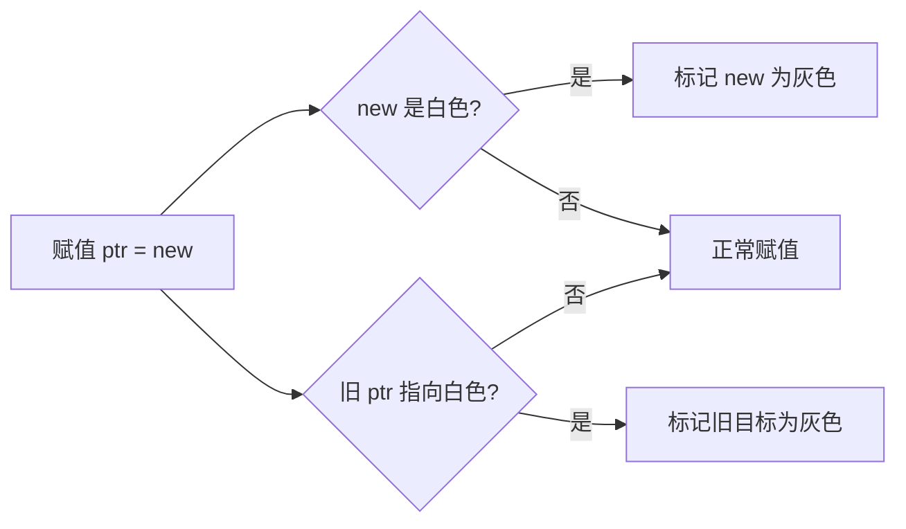

# 篇二 · 底层原理 · 06 内存管理与垃圾回收

> **定位**：逃逸分析、堆/栈分配、三色标记、写屏障、GC 调优（含 Go 1.26 Green Tea GC）
> **面试权重**：🔥🔥🔥🔥🔥 必考 ｜ **前置**：2-05
> **🔁 前端类比**：JS 引擎分代 GC 追求低延迟；Go 是非分代、三色标记 + 混合写屏障的并发 GC，STW 极短

## 🧭 核心考点

- 逃逸分析：`go build -gcflags="-m"` 判断分配位置
- 三色标记 + 混合写屏障为什么能并发标记
- GC 触发时机、GOGC、GC 暂停与调优
- 内存分配器：mheap/mcentral/mcache 与 size class
- 内存泄漏常见形态与排查（pprof heap）

## 📑 本篇题目索引（共 11 题）

| # | 题目 | 难度 | 频率 |
|---|------|------|------|
| Q1 | 什么是逃逸分析？变量分配在栈上还是堆上？ | ⭐⭐⭐⭐ | 🔥 高频 |
| Q2 | Go 的垃圾回收（GC）机制是怎样的？什么是三色标记法和写屏障？ | ⭐⭐⭐⭐ | 🔥 高频 |
| Q3 | 三色标记法的原理是什么？ | ⭐⭐⭐ | 📌 常考 |
| Q4 | 什么是插入写屏障（Dijkstra 屏障）？ | ⭐⭐⭐ | 📖 了解 |
| Q5 | 什么是删除写屏障（Yuasa 屏障）？ | ⭐⭐⭐ | 📖 了解 |
| Q6 | 写屏障的作用是什么？ | ⭐⭐ | 📌 常考 |
| Q7 | 混合写屏障是如何工作的？ | ⭐⭐⭐⭐ | 🔥 高频 |
| Q8 | GC 的触发时机有哪些？ | ⭐⭐ | 📌 常考 |
| Q9 | Go 语言中 GC 的完整流程是什么？ | ⭐⭐⭐ | 🔥 高频 |
| Q10 | GC 如何进行调优？ | ⭐⭐⭐ | 📌 常考 |
| Q11 | Go 1.24~1.27 的 GC 与内存有哪些变化？Green Tea GC 解决了什么？ | ⭐⭐⭐ | 🔥 高频（版本敏感度加分题） |

---

> 📌 **本文件只讲「内存管理与 GC」。** GMP 调度（G/P/M 角色、调度循环、工作窃取、Hand off、抢占、SYSMON）已独立成篇，请见 **[2-05 GMP 调度模型](./2-05-GMP调度模型.md)**。

### Q1: 什么是逃逸分析？变量分配在栈上还是堆上？

**难度**：⭐⭐⭐⭐ | **频率**：🔥 高频

**考点**：逃逸分析、栈/堆分配、内存分配器分层、编译期优化。

**💡 记忆关键词**：能栈不堆、`go build -gcflags="-m"`、接口装箱逃逸、mcache→mcentral→mheap、size class

**答案要点**：
- **逃逸分析**是编译器在**编译期**判断变量「能否安全分配在栈上」的过程：若变量在函数返回后仍可能被引用（逃逸），就必须分配到**堆**并交给 GC；否则放**栈**上，随栈帧回收，**不产生 GC 压力**。
- **常见逃逸场景（面试常让你举例）**：
  1. 返回局部变量的**指针**（`return &x`）；
  2. 赋值给 `interface{}` / `any`（装箱，如把值传给 `fmt.Println`）；
  3. 被**闭包**捕获且闭包生命周期长于该函数；
  4. 对象过大（超过栈对象大小限制，如大数组）；
  5. 通过 channel 传递指针、或存入全局 map/slice；
  6. 编译期无法确定大小的切片（`make([]T, n)` 且 n 为变量）。
- **观察方式**：`go build -gcflags="-m" ./...`（加 `-l` 禁用内联更易观察），输出 `moved to heap` / `escapes to heap`；`-m=2` 给出更详细的推理链。
- **优化实践**：小对象返回**值**而非指针、避免不必要的接口装箱、预分配切片容量、热路径用 `sync.Pool` 复用；但**不要为「零逃逸」把代码写坏**——先用 pprof 确认分配热点（见 5-20 Q5）。
- **延伸（内存分配器）**：Go 采用类 TCMalloc 的**三级分配**：`mcache`（每个 P 私有、**无锁**）→ `mcentral`（按 size class 的全局中心）→ `mheap`（页级堆）。小对象按约 68 档 **size class** 分配以减少碎片，> 32KB 的大对象直接走 mheap；这也是「小对象分配很快」的原因。

```go
type User struct{ Name string }

func escape() *User { u := User{Name: "a"}; return &u } // 逃逸到堆：指针被返回
func noEscape() User { u := User{Name: "a"}; return u }  // 值返回：可能留在栈上

func main() {
    fmt.Println(escape().Name)
}
```

```bash
$ go build -gcflags="-m" ./...
./main.go:3:25: moved to heap: u
```

**🔁 前端类比**：V8 的「逃逸分析 + 标量替换」思路一致 —— 能确定生命周期就放栈/寄存器，否则放堆交给 GC；Go 把这件事交给了编译期并可通过 `-m` 观察。

**📝 一句话总结**：逃逸分析决定栈还是堆，「指针返回、接口装箱、闭包捕获」最容易逃逸；用 `-gcflags=-m` 验证，目标是减少堆分配而不是零逃逸。

---

### Q2: Go 的垃圾回收（GC）机制是怎样的？什么是三色标记法和写屏障？

**难度**：⭐⭐⭐⭐ | **频率**：🔥 高频

**考点**：并发标记、STW、混合写屏障、非分代不整理。

**💡 记忆关键词**：非分代不整理、三色标记、混合写屏障、STW < 1ms、并发清扫

**答案要点**：
- Go 采用**非分代、不整理（不移动对象）、并发**的三色标记清除算法。
- **三色语义**：**白**（未访问，标记结束后仍为白即垃圾）、**灰**（已访问但子节点未扫描完）、**黑**（自身与子节点都已扫描）。
- **四个阶段**：标记准备（**STW**）→ 并发标记（与用户 goroutine 同时跑）→ 标记终止（**STW**）→ 并发清扫。
- **写屏障**：并发标记期间对象图会变（用户代码在改指针），可能导致「黑色对象引用了白色对象而白对象被漏标」。混合写屏障（Go 1.8+，插入屏障 + 删除屏障）在指针写操作时维护三色不变式，使 STW 通常 **< 1ms**。
- **本质**：用少量写屏障开销换取「标记阶段几乎不停顿」，这是 Go 适合低延迟服务的关键设计（对比：分代 + 复制整理的 JS/V8 会有对象移动成本）。


**📝 一句话总结**：非分代、不整理的三色标记清除；靠混合写屏障把标记并发化，两次 STW 加起来通常 < 1ms。

---

### Q3: 三色标记法的原理是什么？

**难度**：⭐⭐⭐ | **频率**：📌 常考

**考点**：白色、灰色、黑色、标记过程。

**💡 记忆关键词**：白灰黑三色、根对象扫描、并发标记、垃圾回收

**答案要点**：
- **白色**：未被访问，可能是垃圾。
- **灰色**：已访问，子节点未扫描。
- **黑色**：已访问，子节点已扫描。
- 过程：从根对象开始，灰色对象扫描子节点变黑，最终白色对象为垃圾。
- 优点：并发标记，减少 STW 时间。

### Q4: 什么是插入写屏障（Dijkstra 屏障）？

**难度**：⭐⭐⭐ | **频率**：📖 了解

**考点**：Dijkstra 屏障、强三色不变性、性能。

**💡 记忆关键词**：插入屏障、强三色、目标标灰、STW长

**答案要点**：
- 规则：写入指针时，若目标为白色则标记为灰色。
- 保证：黑色对象不能指向白色对象。
- 缺点：需要初始扫描所有栈，STW 时间长。
- Go 1.8 之前使用。

### Q5: 什么是删除写屏障（Yuasa 屏障）？

**难度**：⭐⭐⭐ | **频率**：📖 了解

**考点**：Yuasa 屏障、弱三色不变性、精度。

**💡 记忆关键词**：删除屏障、弱三色、旧值标灰、精度低

**答案要点**：
- 规则：删除指针时，若目标为白色则标记为灰色。
- 允许黑色指向白色，但删除时保护。
- 缺点：可能保留本应回收的对象（精度低）。
- 需重新扫描栈。

### Q6: 写屏障的作用是什么？

**难度**：⭐⭐ | **频率**：📌 常考

**考点**：并发标记安全、STW 优化、屏障组合。

**💡 记忆关键词**：并发标记、STW缩短、对象图保护、屏障演进

**答案要点**：
- 写屏障解决并发标记期间对象图变化问题。
- 无屏障需 STW 完成标记。
- 有屏障可并发标记，仅短暂 STW。
- Go 演进：无屏障 → 插入屏障 → 混合屏障。

### Q7: 混合写屏障是如何工作的？

**难度**：⭐⭐⭐⭐ | **频率**：🔥 高频

**考点**：Go 1.8+、插入+删除、STW < 1ms。

**💡 记忆关键词**：混合屏障、插入删除结合、STW<0.5ms、Go1.8+

**答案要点**：
- 结合插入和删除屏障的优点。
- 规则：
  1. 赋值时，若删除的指针指向白色对象，标记为灰色。
  2. 赋值时，新写入的指针指向白色对象，标记为灰色。
- 无需初始栈扫描，STW 时间大幅缩短（通常 < 0.5ms）。
- 标记终止阶段仍需短暂 STW。



### Q8: GC 的触发时机有哪些？

**难度**：⭐⭐ | **频率**：📌 常考

**考点**：内存阈值、定时触发、手动触发。

**💡 记忆关键词**：GOGC阈值、2分钟定时、手动GC、GOMEMLIMIT

**答案要点**：
- **内存增长**：分配的内存达到上次 GC 后存活对象的 GOGC% 倍（默认 100%）。
- **定时触发**：至少每 2 分钟触发一次。
- **手动触发**：`runtime.GC()` 或 `debug.FreeOSMemory()`。
- Go 1.19+ 支持 `GOMEMLIMIT` 限制最大内存。

### Q9: Go 语言中 GC 的完整流程是什么？

**难度**：⭐⭐⭐ | **频率**：🔥 高频

**考点**：标记准备、并发标记、标记终止、并发清扫。

**💡 记忆关键词**：标记准备STW、并发标记、标记终止STW、并发清扫

**答案要点**：
1. **标记准备**（STW）：开启写屏障，扫描根对象。
2. **并发标记**：标记所有可达对象，用户程序继续运行。
3. **标记终止**（STW）：关闭写屏障，完成最终标记。
4. **并发清扫**：回收白色对象，释放内存。

### Q10: GC 如何进行调优？

**难度**：⭐⭐⭐ | **频率**：📌 常考

**考点**：GOGC、GOMEMLIMIT、对象复用、pprof 分析。

**💡 记忆关键词**：GOGC调频、GOMEMLIMIT限内存、sync.Pool、gctrace

**答案要点**：
- 调整 `GOGC`：增大降低 GC 频率但增加内存，反之亦然。
- 设置 `GOMEMLIMIT`：限制最大内存，自动调节 GC 频率。
- 减少短期对象分配：使用 `sync.Pool`、预分配切片。
- 避免指针密集型结构：减少 GC 扫描开销。
- 使用 `GODEBUG=gctrace=1` 分析 GC 日志。
- pprof 查看 `heap` profile 定位分配热点。

---

### Q11: Go 1.24~1.27 的 GC 与内存有哪些变化？Green Tea GC 解决了什么？

**难度**：⭐⭐⭐ | **频率**：🔥 高频（版本敏感度加分题）

**考点**：Swiss Table map、Green Tea GC、小对象分配优化、`GOMEMLIMIT`、`GOEXPERIMENT` 灰度。

**💡 记忆关键词**：1.24 Swiss map、1.25 greenteagc 实验、1.26 默认开启（降 10~40%）、1.27 尺寸特化分配、同一算法的实现优化

**答案要点**（写于 2026-09，当前 stable 为 Go 1.27.x，详见 [5-26 版本演进](./5-26-Go版本演进与新特性.md)）：
- **Go 1.24**：内置 `map` 换用 **Swiss Tables** 实现，并优化小对象分配与运行时内部互斥锁，整体 CPU 开销平均下降 **2~3%**；`GOEXPERIMENT=noswissmap` 可回退。
- **Go 1.25**：新 GC（**Green Tea**）以 `GOEXPERIMENT=greenteagc` **实验特性**提供，官方预期 GC 开销降低 **10~40%** —— 改进点是**小对象标记与扫描的局部性与 CPU 可扩展性**。
- **Go 1.26**：Green Tea GC **默认开启**（收集反馈后转正），`GOEXPERIMENT=nogreenteagc` 可关闭；在 Intel Ice Lake / AMD Zen4 及更新的 amd64 上会利用**向量指令扫描小对象**，官方预期再降约 10%。
- **Go 1.27**：编译器为**小于 80 字节的小对象**生成尺寸特化的分配函数，分配开销最多降低 **30%**（整体约 1%，代价是二进制增大约 60KB）；`GOEXPERIMENT=nosizespecializedmalloc` 可关闭。
- **面试表述要点**：把「**三色标记 + 混合写屏障**」作为**不变的基本盘**，把 Green Tea GC 描述为「**同一套并发标记清除算法下的实现优化**（提升局部性与并行度）」，**而不是换了 GC 算法**——说成「Go 1.26 换了新 GC 算法」是常见错误。
- **验证方法**：`GODEBUG=gctrace=1` 观察 GC 频率与停顿，`pprof heap` 看分配与存活，`runtime/metrics` 的 GC 指标做版本对比（见 5-20 Q5）。

**📝 一句话总结**：1.24 换 Swiss Table map、1.25 Green Tea GC 实验、1.26 默认开启（GC 开销降 10~40%）、1.27 小对象分配提速；本质是**实现优化**而非换算法。

---

## ✅ 自测清单（答不出就回去看对应题）

- [ ] 能脱离资料讲清本篇「核心考点」中的每一条
- [ ] 能手写/口述至少 2 道 🔥 高频题的最小实现
- [ ] 能结合自己的项目讲出 1 个坑或 1 次调优

