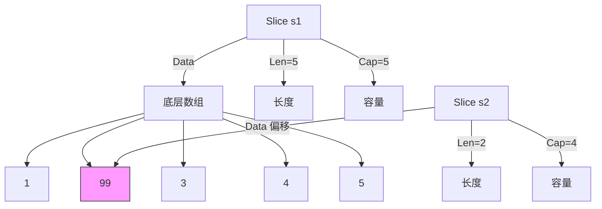
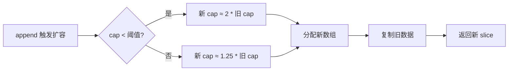
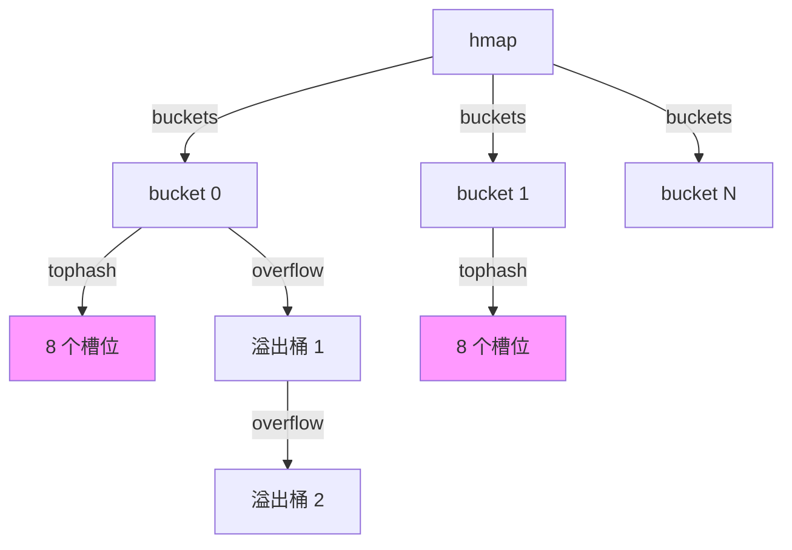
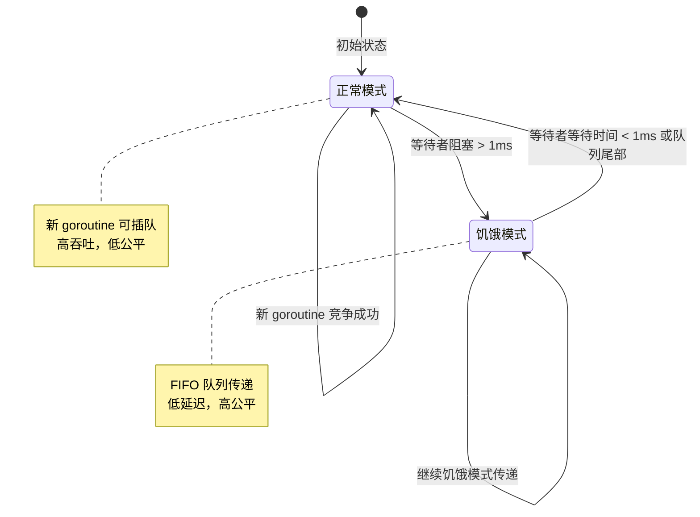
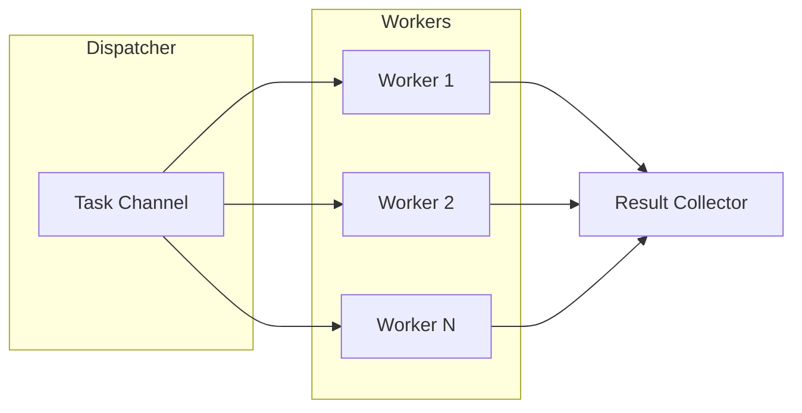

# 篇二 · 底层原理 · 07 核心数据结构底层

> **定位**：map / slice / channel / string / interface / sync.Pool 的运行时实现
> **面试权重**：🔥🔥🔥🔥 高频 ｜ **前置**：1-01、2-06
> **🔁 前端类比**：V8 的隐藏类与数组形态优化 → Go 的 struct 内存对齐、切片与哈希表实现

## 🧭 核心考点

- map：hmap/bmap、桶与溢出、负载因子与渐进式扩容
- slice：扩容策略与共享底层数组的副作用
- channel：hchan 环形缓冲 + sendq/recvq 阻塞唤醒
- string 与 []byte 转换的拷贝成本与 unsafe 优化
- sync.Pool、sync.Map 的适用场景与实现要点

## 📑 本篇题目索引（共 29 题）

| # | 题目 | 难度 | 频率 |
|---|------|------|------|
| Q1 | `map` 的底层结构是怎样的？扩容是如何进行的？ | ⭐⭐⭐⭐ | 🔥 高频 |
| Q2 | Golang Slice 的底层实现 | ⭐⭐ | 🔥 高频 |
| Q3 | Golang Slice 的扩容机制，有什么注意点？ | ⭐⭐⭐ | 🔥 高频 |
| Q4 | 扩容前后的 Slice 是否相同？ | ⭐⭐ | 📌 常考 |
| Q5 | Golang 的参数传递、引用类型 | ⭐⭐⭐ | 🔥 高频 |
| Q6 | Golang Map 底层实现 | ⭐⭐⭐⭐ | 🔥 高频 |
| Q7 | Golang Map 如何扩容 | ⭐⭐⭐⭐ | 🔥 高频 |
| Q8 | Golang Map 查找流程 | ⭐⭐⭐ | 📌 常考 |
| Q9 | 介绍一下 Channel | ⭐⭐⭐ | 🔥 高频 |
| Q10 | Go 语言的 Channel 特性 | ⭐⭐⭐ | 📌 常考 |
| Q11 | Channel 的 ring buffer 实现 | ⭐⭐⭐ | 📖 了解 |
| Q12 | Mutex 几种状态 | ⭐⭐⭐⭐ | 📌 常考 |
| Q13 | Mutex 正常模式和饥饿模式 | ⭐⭐⭐⭐ | 📌 常考 |
| Q14 | Mutex 允许自旋的条件 | ⭐⭐⭐ | 📖 了解 |
| Q15 | RWMutex 实现 | ⭐⭐⭐ | 📌 常考 |
| Q16 | RWMutex 注意事项 | ⭐⭐⭐ | 📌 常考 |
| Q17 | Cond 是什么 | ⭐⭐ | 📖 了解 |
| Q18 | Broadcast 和 Signal 区别 | ⭐⭐ | 📖 了解 |
| Q19 | Cond 中 Wait 使用 | ⭐⭐ | 📖 了解 |
| Q20 | WaitGroup 用法 | ⭐⭐ | 🔥 高频 |
| Q21 | WaitGroup 实现原理 | ⭐⭐⭐ | 📌 常考 |
| Q22 | 什么是 sync.Once | ⭐⭐ | 🔥 高频 |
| Q23 | 什么操作叫做原子操作 | ⭐⭐ | 📌 常考 |
| Q24 | 原子操作和锁的区别 | ⭐⭐ | 📌 常考 |
| Q25 | 什么是 CAS | ⭐⭐⭐ | 📌 常考 |
| Q26 | 如何实现一个并发安全的 Worker Pool？ | ⭐⭐⭐ | 🔥 高频 |
| Q27 | Go 的内存分配器（TCMalloc 思想）是如何工作的？ | ⭐⭐⭐⭐ | 📌 常考 |
| Q28 | 设计一个高并发计数器，支持百万级 QPS 读写。 | ⭐⭐⭐⭐ | 📌 常考 |
| Q29 | `sync.Pool` 的作用是什么？使用场景和注意事项？ | ⭐⭐⭐ | 📌 常考 |

---

### Q1: `map` 的底层结构是怎样的？扩容是如何进行的？

**难度**：⭐⭐⭐⭐ | **频率**：🔥 高频

**考点**：`hmap`、`bmap`、哈希冲突、渐进式扩容。

**💡 记忆关键词**：hmap桶数组、bmap八键值、负载因子6.5、渐进式迁移

**答案要点**：
- `hmap` 包含桶数组 `buckets`，每个桶 `bmap` 存 8 个键值对。
- 哈希高 8 位用于快速定位桶，低 8 位用于桶内比对。
- **扩容条件**：负载因子 > 6.5 或溢出桶过多。
- **渐进式**：扩容时创建新桶，旧桶数据在访问或后台 goroutine 逐步迁移，期间读写需同时检查新旧桶。

---

### Q2: Golang Slice 的底层实现

**难度**：⭐⭐ | **频率**：🔥 高频

**考点**：slice header、连续内存、动态数组。

**💡 记忆关键词**：SliceHeader、Data指针、LenCap、共享数组

**答案要点**：
- 底层是 `reflect.SliceHeader`：包含 `Data`（指针）、`Len`、`Cap` 三个字段。
- `Data` 指向底层数组的起始位置。
- 切片是数组的视图，多个切片可能共享同一底层数组。
- 修改切片元素会影响共享数组的其他切片。

```go
type SliceHeader struct {
    Data uintptr
    Len  int
    Cap  int
}

s1 := []int{1, 2, 3, 4, 5}
s2 := s1[1:3]
s2[0] = 99
```



---

### Q3: Golang Slice 的扩容机制，有什么注意点？

**难度**：⭐⭐⭐ | **频率**：🔥 高频

**考点**：扩容策略、Go 1.18 变更、内存对齐。

**💡 记忆关键词**：1.18平滑扩容、预分配容量、共享断开、阈值表

**答案要点**：
- **Go 1.18 之前**：cap < 1024 时双倍扩容，>= 1024 时 1.25 倍。
- **Go 1.18+**：使用更平滑的阈值表，减少内存浪费。
- **注意点**：
  1. 扩容会分配新数组，复制旧数据。
  2. 预分配容量可避免频繁扩容（`make([]T, 0, cap)`）。
  3. 切片共享数组时扩容会断开共享。

```go
s := make([]int, 0, 1000)
for i := 0; i < 1000; i++ {
    s = append(s, i)
}

s1 := make([]int, 0, 4)
s1 = append(s1, 1, 2, 3)
s2 := s1
s1 = append(s1, 4, 5)
s1[0] = 99
```



---

### Q4: 扩容前后的 Slice 是否相同？

**难度**：⭐⭐ | **频率**：📌 常考

**考点**：内存地址变化、数据迁移、引用关系。

**💡 记忆关键词**：地址改变、新数组、GC回收、%p验证

**答案要点**：
- 扩容后底层数组地址改变，是新的数组。
- 旧数组若无其他引用，会被 GC 回收。
- 扩容前的切片仍指向旧数组，不会自动更新。
- 验证：`fmt.Printf("%p\n", slice)` 前后地址不同。

### Q5: Golang 的参数传递、引用类型

**难度**：⭐⭐⭐ | **频率**：🔥 高频

**考点**：值传递本质、引用类型误解、指针传递。

**💡 记忆关键词**：只有值传递、SliceHeader副本、指针的指针、共享底层

**答案要点**：
- **Go 只有值传递，没有引用传递**。
- slice、map、channel 是"引用类型"但传递的是结构体副本。
- slice 传递的是 `SliceHeader` 副本，指向同一底层数组。
- 要修改指针本身需传递指针的指针。

### Q6: Golang Map 底层实现

**难度**：⭐⭐⭐⭐ | **频率**：🔥 高频

**考点**：hmap、bmap、哈希算法、溢出桶。

**💡 记忆关键词**：hmap结构、bmap八槽、tophash加速、遍历无序

**答案要点**：
- `hmap`：包含 count、B（桶数量 2^B）、buckets 指针、oldbuckets 等。
- `bmap`（bucket）：存储 8 个键值对，包含 tophash 数组加速查找。
- 哈希冲突：链地址法，通过溢出桶（overflow bucket）解决。
- 遍历无序：每次遍历顺序随机，防止依赖顺序的代码。

```go
type hmap struct {
    count     int
    B         uint8
    buckets   unsafe.Pointer
    oldbuckets unsafe.Pointer
    nevacuate uintptr
}

type bmap struct {
    tophash [8]uint8
    keys    [8]key
    values  [8]value
    overflow *bmap
}
```



---

### Q7: Golang Map 如何扩容

**难度**：⭐⭐⭐⭐ | **频率**：🔥 高频

**考点**：渐进式扩容、等量扩容、翻倍扩容。

**💡 记忆关键词**：负载因子6.5、翻倍等量、渐进迁移、oldbuckets

**答案要点**：
- **触发条件**：负载因子 > 6.5 或溢出桶过多。
- **翻倍扩容**：B++，桶数量翻倍。
- **等量扩容**：溢出桶过多时，重新组织数据。
- **渐进式**：写入时迁移 1-2 个桶，读取时检查新旧桶。
- 扩容期间 hmap 同时持有 oldbuckets 和 buckets。

```go
m := make(map[int]int)
for i := 0; i < 1000; i++ {
    m[i] = i
}
```

---

### Q8: Golang Map 查找流程

**难度**：⭐⭐⭐ | **频率**：📌 常考

**考点**：哈希计算、桶定位、tophash 匹配、溢出链。

**💡 记忆关键词**：哈希计算、低B定位、tophash匹配、溢出链查

**答案要点**：
1. 计算 key 的哈希值。
2. 低 B 位定位桶。
3. 高 8 位（tophash）快速匹配。
4. 遍历桶内 8 个槽位比对 key。
5. 未找到则检查溢出桶。
6. 若正在扩容，同时检查旧桶。

```go
func mapaccess1(t *maptype, h *hmap, key unsafe.Pointer) unsafe.Pointer {
    hash := alg.hash(key, uintptr(t.hasher))
    m := bucketMask(h.B)
    b := (*bmap)(add(h.buckets, (hash&m)*uintptr(t.bucketsize)))

    for {
        for i := 0; i < 8; i++ {
            if b.tophash[i] == top {
                if alg.equal(key, k) {
                    return val
                }
            }
        }
        if b.overflow == nil {
            break
        }
        b = b.overflow
    }
    return nil
}
```

---

### Q9: 介绍一下 Channel

**难度**：⭐⭐⭐ | **频率**：🔥 高频

**考点**：hchan 结构、类型安全、goroutine 通信。

**💡 记忆关键词**：hchan结构、环形缓冲、sendq/recvq、类型安全

**答案要点**：
- Channel 是 goroutine 之间的通信管道。
- 底层 `hchan` 结构：包含环形缓冲区、sendq、recvq、锁。
- 类型安全：编译期检查元素类型。
- 第一公民：可作为参数、返回值、结构体字段。

```go
type hchan struct {
    qcount   uint
    dataqsiz uint
    buf      unsafe.Pointer
    elemsize uint16
    closed   uint32
    elemtype *_type
    sendx    uint
    recvx    uint
    recvq    waitq
    sendq    waitq
    lock     mutex
}
```

---

### Q10: Go 语言的 Channel 特性

**难度**：⭐⭐⭐ | **频率**：📌 常考

**考点**：阻塞语义、close 行为、select 多路复用。

**💡 记忆关键词**：阻塞语义、close通知、select多路、nil阻塞

**答案要点**：
- 发送/接收可能阻塞（取决于缓冲和等待者）。
- `close(ch)` 通知接收方不再有数据。
- `select` 支持多 channel 非阻塞操作。
- `for range` 可遍历 channel 直到关闭。
- nil channel 操作永久阻塞。

```go
ch := make(chan int, 2)
ch <- 1
close(ch)

v, ok := <-ch
v, ok = <-ch

var nilCh chan int
<-nilCh

select {
case v := <-ch1:
    fmt.Println("ch1:", v)
case ch2 <- x:
    fmt.Println("sent to ch2")
default:
    fmt.Println("no channel ready")
}
```

---

### Q11: Channel 的 ring buffer 实现

**难度**：⭐⭐⭐ | **频率**：📖 了解

**考点**：环形队列、sendx/recvx 索引、内存连续。

**💡 记忆关键词**：环形数组、sendx/recvx、取模运算、CPU缓存友好

**答案要点**：
- 使用环形数组作为缓冲区。
- `sendx` 指向下一个发送位置，`recvx` 指向下一个接收位置。
- 通过取模运算实现环形：`index % dataqsiz`。
- 内存连续，CPU 缓存友好。

---

### Q12: Mutex 几种状态

**难度**：⭐⭐⭐⭐ | **频率**：📌 常考

**考点**：正常模式、饥饿模式、自旋状态、等待状态。

**💡 记忆关键词**：locked/woken/starved、正常饥饿、自旋等待、状态位

**答案要点**：
- 状态位：`locked`、`woken`、`starved`。
- 正常模式：新 goroutine 可与等待者竞争。
- 饥饿模式：直接传递给队列头部等待者。
- 自旋：短暂忙等待，避免立即挂起。

```go
const (
    mutexLocked      = 1 << iota
    mutexWoken
    mutexStarving
    mutexWaiterShift = iota
)
```

---

### Q13: Mutex 正常模式和饥饿模式

**难度**：⭐⭐⭐⭐ | **频率**：📌 常考

**考点**：模式切换、阈值、公平性。

**💡 记忆关键词**：正常插队、饥饿FIFO、1ms阈值、Go1.9引入

**答案要点**：
- **正常模式**：等待者排队，新 goroutine 可插队（不公平但吞吐高）。
- **饥饿模式**：等待超过 1ms 触发，新 goroutine 不竞争，直接排队。
- **切换**：饥饿模式下等待者获得锁后，若等待时间 < 1ms 或队列尾部，切回正常模式。
- Go 1.9 引入饥饿模式解决尾部延迟问题。



---

### Q14: Mutex 允许自旋的条件

**难度**：⭐⭐⭐ | **频率**：📖 了解

**考点**：自旋策略、多核、运行时判断。

**💡 记忆关键词**：多核GOMAXPROCS、队列非空、4次限制、忙等待

**答案要点**：
- 多核处理器（GOMAXPROCS > 1）。
- 全局运行队列非空或有空闲 P。
- 当前 P 的本地队列非空。
- 自旋次数有限（通常 4 次），避免 CPU 浪费。

```go
func runtime_canSpin(i int) bool {
    if i >= active_spin {
        return false
    }
    if ncpu <= 1 {
        return false
    }
    if gomaxprocs <= 1 || gp.schedlink != 0 {
        return false
    }
    return true
}
```

---

### Q15: RWMutex 实现

**难度**：⭐⭐⭐ | **频率**：📌 常考

**考点**：读写分离、计数器、写优先。

**💡 记忆关键词**：readerCount、写优先、阻塞新读者、Go1.14+

**答案要点**：
- 内部维护 `readerCount`（读计数）和 writer 锁。
- 读锁：`readerCount++`，若无写者则直接获取。
- 写锁：阻塞新读者，等待现有读者完成。
- Go 1.14+：写者优先，防止写饥饿。

```go
type RWMutex struct {
    w           Mutex
    writerSem   uint32
    readerSem   uint32
    readerCount int32
    readerWait  int32
}

func (rw *RWMutex) RLock() {
    if atomic.AddInt32(&rw.readerCount, 1) < 0 {
        runtime_SemacquireMutex(&rw.readerSem, false, 0)
    }
}

func (rw *RWMutex) Lock() {
    rw.w.Lock()
    r := atomic.AddInt32(&rw.readerCount, -rwmutexMaxReaders)
    if r != 0 {
        rw.readerWait = r
        runtime_SemacquireMutex(&rw.writerSem, false, 0)
    }
}
```

---

### Q16: RWMutex 注意事项

**难度**：⭐⭐⭐ | **频率**：📌 常考

**考点**：不可重入、升级死锁、降级问题。

**💡 记忆关键词**：不可重入、读升写死锁、写降读安全、读多写少

**答案要点**：
- 不可重入：同一 goroutine 不能重复获取同一把锁。
- 读锁不能升级为写锁（会导致死锁）。
- 写锁可降级为读锁（先 `Unlock()` 再 `RLock()`）。
- 不适合读多写少且读操作耗时的场景。

```go
var rw sync.RWMutex
func deadlock() {
    rw.RLock()
    rw.Lock()
    rw.Unlock()
    rw.RUnlock()
}

func correct() {
    rw.RLock()
    data := readData()
    rw.RUnlock()

    if needUpdate(data) {
        rw.Lock()
        writeData(data)
        rw.Unlock()
    }
}
```

---

### Q17: Cond 是什么

**难度**：⭐⭐ | **频率**：📖 了解

**考点**：条件变量、等待/通知、sync.Cond。

**💡 记忆关键词**：条件变量、Wait释放锁、Signal唤醒一、Broadcast唤醒全

**答案要点**：
- 条件变量：让 goroutine 等待某个条件成立。
- `sync.Cond` 基于 Locker（Mutex 或 RWMutex）。
- `Wait()`：释放锁并阻塞，被唤醒后重新获取锁。
- `Signal()`：唤醒一个等待者。
- `Broadcast()`：唤醒所有等待者。

```go
type Cond struct {
    noCopy noCopy
    L      Locker
    notify notifyList
    checker copyChecker
}

var mu sync.Mutex
cond := sync.NewCond(&mu)
var ready bool

go func() {
    cond.L.Lock()
    for !ready {
        cond.Wait()
    }
    fmt.Println("条件满足！")
    cond.L.Unlock()
}()

mu.Lock()
ready = true
cond.Signal()
mu.Unlock()
```

---

### Q18: Broadcast 和 Signal 区别

**难度**：⭐⭐ | **频率**：📖 了解

**考点**：单播 vs 广播、惊群效应、性能。

**💡 记忆关键词**：Signal单播、Broadcast广播、惊群效应、配置变更

**答案要点**：
- `Signal()`：唤醒一个等待者（FIFO 队列头部）。
- `Broadcast()`：唤醒所有等待者。
- Broadcast 可能导致惊群效应，需谨慎使用。
- 适用场景：Signal 用于一对一通知，Broadcast 用于配置变更等全局事件。

```go
cond.Signal()
cond.Broadcast()
```

---

### Q19: Cond 中 Wait 使用

**难度**：⭐⭐ | **频率**：📖 了解

**考点**：循环检查、虚假唤醒、锁保护。

**💡 记忆关键词**：for循环检查、虚假唤醒、Wait释放重获、if错误

**答案要点**：
- Wait 必须在循环中使用（检查条件）。
- 可能被虚假唤醒（spurious wakeup）。
- Wait 自动释放锁，唤醒后重新获取。

```go
cond.L.Lock()
for !condition() {
    cond.Wait()
}
cond.L.Unlock()
```

---

### Q20: WaitGroup 用法

**难度**：⭐⭐ | **频率**：🔥 高频

**考点**：Add/Done/Wait、goroutine 同步、计数器。

**💡 记忆关键词**：Add前Done后、Wait阻塞、计数器归零、传指针

**答案要点**：
- `Add(n)`：增加计数器。
- `Done()`：计数器减一（等价于 Add(-1)）。
- `Wait()`：阻塞直到计数器为零。
- 注意：Add 必须在 goroutine 启动前调用。

```go
var wg sync.WaitGroup
for i := 0; i < 10; i++ {
    wg.Add(1)
    go func(id int) {
        defer wg.Done()
        fmt.Println("task", id, "done")
    }(i)
}
wg.Wait()
fmt.Println("all tasks completed")
```

---

### Q21: WaitGroup 实现原理

**难度**：⭐⭐⭐ | **频率**：📌 常考

**考点**：原子操作、信号量、状态位。

**💡 记忆关键词**：64位状态、高32计数器、低32等待者、信号量阻塞

**答案要点**：
- 内部使用 64 位状态：高 32 位计数器，低 32 位等待者数。
- 使用原子操作（atomic）更新计数器。
- Wait 时若计数器非零，使用信号量阻塞。
- Done 时若计数器归零，释放所有等待者。
- 不可复制使用（需传指针）。

```go
func (wg *WaitGroup) Add(delta int) {
    state := atomic.AddUint64(&wg.state, uint64(delta)<<32)
    v := int32(state >> 32)
    w := uint32(state)

    if v < 0 {
        panic("negative counter")
    }
    if v == 0 && w > 0 {
        runtime_Semrelease(&wg.sema, false, 0)
    }
}
```

---

### Q22: 什么是 sync.Once

**难度**：⭐⭐ | **频率**：🔥 高频

**考点**：单次执行、线程安全、懒加载。

**💡 记忆关键词**：只执行一次、Mutex+atomic、懒加载单例、panic可重试

**答案要点**：
- 保证函数只执行一次，即使多次调用。
- 内部使用 Mutex + atomic 实现。
- 适合懒加载单例、初始化配置。
- 若 init 函数 panic，Once 视为未执行完成。

```go
type Once struct {
    done uint32
    m    Mutex
}

var once sync.Once
var config *Config

func GetConfig() *Config {
    once.Do(func() {
        config = loadConfig()
    })
    return config
}
```

---

### Q23: 什么操作叫做原子操作

**难度**：⭐⭐ | **频率**：📌 常考

**考点**：不可分割、CAS、硬件指令。

**💡 记忆关键词**：不可中断、sync/atomic、CPU指令、Add/Load/Store/CAS

**答案要点**：
- 原子操作是不可中断的操作，要么全部完成，要么完全不执行。
- Go 中通过 `sync/atomic` 包提供。
- 底层依赖 CPU 的原子指令（如 x86 的 LOCK 前缀、CMPXCHG）。
- 常见操作：Add、Load、Store、Swap、CompareAndSwap。

```go
import "sync/atomic"

var counter int64
atomic.AddInt64(&counter, 1)
val := atomic.LoadInt64(&counter)
atomic.StoreInt64(&counter, 100)
old := atomic.SwapInt64(&counter, 200)

var ptr atomic.Pointer[Config]
ptr.Store(&Config{})
cfg := ptr.Load()
```

---

### Q24: 原子操作和锁的区别

**难度**：⭐⭐ | **频率**：📌 常考

**考点**：性能、适用场景、粒度。

**💡 记忆关键词**：硬件级vs软件级、单变量vs多变量、无锁vs有锁、性能对比

**答案要点**：
- 原子操作：硬件级支持，无锁，性能极高，适合简单变量。
- 锁：软件级实现，可保护复杂临界区，开销较大。
- 原子操作无法保护多变量一致性。
- 选择原则：单变量用原子操作，多变量/复杂逻辑用锁。

```go
var hits atomic.Int64
hits.Add(1)

var mu sync.Mutex
var cache map[string]string
func updateCache(k, v string) {
    mu.Lock()
    cache[k] = v
    mu.Unlock()
}
```

---

### Q25: 什么是 CAS

**难度**：⭐⭐⭐ | **频率**：📌 常考

**考点**：Compare And Swap、无锁编程、ABA 问题。

**💡 记忆关键词**：比较并交换、无锁基础、ABA问题、版本号解决

**答案要点**：
- CAS：比较并交换，原子地检查值是否为预期，若是则更新。
- `atomic.CompareAndSwapInt64(&val, old, new)`。
- 无锁编程的基础。
- ABA 问题：值从 A→B→A，CAS 无法察觉，可用版本号解决。
- Go 1.19+ 引入 atomic 泛型类型。

```go
var value int64 = 10

if atomic.CompareAndSwapInt64(&value, 10, 20) {
    fmt.Println("更新成功")
} else {
    fmt.Println("值已被其他 goroutine 修改")
}

type Node struct {
    Value int
    Next  *Node
}

var head atomic.Pointer[Node]

func Push(v int) {
    newHead := &Node{Value: v}
    for {
        oldHead := head.Load()
        newHead.Next = oldHead
        if head.CompareAndSwap(oldHead, newHead) {
            break
        }
    }
}
```

---

### Q26: 如何实现一个并发安全的 Worker Pool？

**难度**：⭐⭐⭐ | **频率**：🔥 高频

**考点**：`errgroup`、`channel` 控制并发度、任务分发。

**💡 记忆关键词**：缓冲 Channel、固定 Goroutine、WaitGroup、errgroup

**答案要点**：
- 使用带缓冲的 `channel` 作为任务队列。
- 启动固定数量的 `goroutine` 从队列中消费任务。
- 使用 `sync.WaitGroup` 等待所有任务完成，或使用 `errgroup.Group` 处理错误传播和上下文取消。



---

---

---

### Q27: Go 的内存分配器（TCMalloc 思想）是如何工作的？

**难度**：⭐⭐⭐⭐ | **频率**：📌 常考

**考点**：`mcache`、`mcentral`、`mheap`、对象大小分类。

**💡 记忆关键词**：三级缓存、mcache 无锁、mcentral 补 Span、mheap 管全局

**答案要点**：
- Go 借鉴 TCMalloc，将内存分配分为三级缓存：
  1. **mcache**：线程（P）本地缓存，无锁分配，适合小对象（< 32KB）。
  2. **mcentral**：全局中心缓存，为 `mcache` 补充 Span，需加锁。
  3. **mheap**：向操作系统申请大块内存，管理所有 Span。
- **Tiny 对象**：多个微小对象合并分配，减少碎片。
- **大对象**：直接从 `mheap` 分配。

---

### Q28: 设计一个高并发计数器，支持百万级 QPS 读写。

**难度**：⭐⭐⭐⭐ | **频率**：📌 常考

**考点**：原子操作、分片、缓存一致性。

**💡 记忆关键词**：atomic 原子、Cache Line 伪共享、分片汇总、Redis INCR

**答案要点**：
- **方案一（单机）**：使用 `sync/atomic.AddInt64`，性能极高，但多核下 Cache Line 伪共享（False Sharing）可能导致瓶颈。可通过填充结构体对齐 Cache Line 解决。
- **方案二（分布式）**：使用 Redis `INCR` 命令，配合 Pipeline 或 Lua 脚本批量提交，减少网络 RTT。
- **方案三（分段锁）**：将计数器拆分为多个分片（Sharding），每个分片独立加锁或原子操作，最后汇总。

---

### Q29: `sync.Pool` 的作用是什么？使用场景和注意事项？

**难度**：⭐⭐⭐ | **频率**：📌 常考

**考点**：对象复用、GC 压力、生命周期。

**💡 记忆关键词**：临时对象、GC 清空、Buffer 复用、无状态数据

**答案要点**：
- `sync.Pool` 用于存储临时对象，减少频繁分配和 GC 压力。
- **注意**：池中的对象在 GC 时会被清空（Go 1.13 前是每次 GC 清空，之后改为保留部分），因此不能用于存储有状态或需要持久化的数据。
- **场景**：`fmt` 包内部的 buffer 复用、数据库连接句柄（通常用连接池而非 Pool）、序列化 buffer。

---

## ✅ 自测清单（答不出就回去看对应题）

- [ ] 能脱离资料讲清本篇「核心考点」中的每一条
- [ ] 能手写/口述至少 2 道 🔥 高频题的最小实现
- [ ] 能结合自己的项目讲出 1 个坑或 1 次调优

