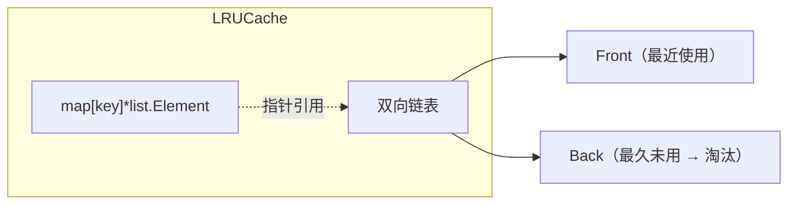

# 篇二 · 底层原理 · 08 手写代码与算法实战

> **定位**：白板/机试高频题：LRU、单例、Pipeline、协程池、限流器、分布式锁等**并发安全**实现
> **面试权重**：🔥🔥🔥🔥 高频 ｜ **前置**：1-03 并发编程
> **🔁 前端类比**：前端常考 LRU / 防抖节流；Go 版本额外要求「并发安全」——必须用 mutex 或 channel 保护共享状态，且要能说清复杂度与边界。

## 🧭 核心考点

- 数据结构题：LRU（map + 双向链表）、前缀树路由、Top K
- 并发原语题：单例、协程池、限流器、分片锁 Map
- 分布式题：Redis 分布式锁（SET NX PX + Lua 释放 + 续期）、Snowflake ID
- 通用要求：**先说思路与复杂度 → 再写代码 → 主动补并发安全与边界条件**

## 📑 本篇题目索引（共 10 题）

| # | 题目 | 难度 | 频率 |
|---|------|------|------|
| Q1 | 手写一个线程安全的 LRU Cache。 | ⭐⭐⭐⭐ | 🔥 高频 |
| Q2 | 实现一个线程安全且高性能的单例。 | ⭐⭐ | 🔥 高频 |
| Q3 | 如何实现 Pipeline（管道）模式？ | ⭐⭐⭐ | 📌 常考 |
| Q4 | 手写一个并发安全的令牌桶限流器。 | ⭐⭐⭐ | 🔥 高频 |
| Q5 | 手写一个协程池（Worker Pool）。 | ⭐⭐⭐⭐⭐ | 🔥 高频 |
| Q6 | 手写一个 Redis 分布式锁（含续期与安全释放）。 | ⭐⭐⭐ | 🔥 高频 |
| Q7 | 手写一个分片锁的并发安全 Map。 | ⭐⭐⭐⭐ | 📌 常考 |
| Q8 | 手写 Snowflake 分布式 ID 生成器。 | ⭐⭐⭐ | 🔥 高频 |
| Q9 | 手写一个简易 HTTP 路由（前缀树）。 | ⭐⭐⭐ | 📌 常考 |
| Q10 | 1 亿个数里找 Top K / 判断元素是否存在，怎么做？ | ⭐⭐⭐ | 📌 常考 |

---

## 8.1 数据结构实现

### Q1: 手写一个线程安全的 LRU Cache。

**难度**：⭐⭐⭐⭐ | **频率**：🔥 高频

**考点**：Map + 双向链表、`container/list`、并发控制。

**💡 记忆关键词**：Map 查 O(1)、双向链表维护顺序、最近使用放头部、超容删尾部、RWMutex

**答案要点**：
- **结构**：`map[key]*list.Element` 保证 O(1) 查找；`container/list` 维护访问顺序（头部最新、尾部最旧）。
- **Get**：命中则移到头部并返回值；未命中返回 `(nil, false)`。
- **Put**：已存在则更新值并移到头部；不存在则插入头部，若超容则删尾部并从 map 删除。
- **并发**：`sync.Mutex` 保护（Go 官方 `groupcache/lru` 也是这种方案）；读多写少也可用 `RWMutex`，但每次 Get 都会改链表，仍需写锁。

```go
type entry struct{ key, val any }

type LRUCache struct {
    mu       sync.Mutex
    cap      int
    ll       *list.List               // Front = 最近使用
    cache    map[any]*list.Element
}

func NewLRU(capacity int) *LRUCache {
    return &LRUCache{cap: capacity, ll: list.New(), cache: make(map[any]*list.Element, capacity)}
}

func (c *LRUCache) Get(key any) (any, bool) {
    c.mu.Lock()
    defer c.mu.Unlock()
    if e, ok := c.cache[key]; ok {
        c.ll.MoveToFront(e)
        return e.Value.(*entry).val, true
    }
    return nil, false
}

func (c *LRUCache) Put(key, val any) {
    c.mu.Lock()
    defer c.mu.Unlock()
    if e, ok := c.cache[key]; ok {
        e.Value.(*entry).val = val
        c.ll.MoveToFront(e)
        return
    }
    e := c.ll.PushFront(&entry{key, val})
    c.cache[key] = e
    if c.ll.Len() > c.cap {
        last := c.ll.Back()
        c.ll.Remove(last)
        delete(c.cache, last.Value.(*entry).key)
    }
}
```

**复杂度**：Get / Put 均摊 O(1)；空间 O(capacity)。



**⚠️ 加分点**：能说出「为什么用双向链表」——需要在 O(1) 内把任意节点从中间摘除并插入头部，单链表做不到。

**📝 一句话总结**：map 管查找、双向链表管顺序，头部最近、尾部淘汰，一把 mutex 保并发。

---

### Q2: 实现一个线程安全且高性能的单例。

**难度**：⭐⭐ | **频率**：🔥 高频

**考点**：`sync.Once`、双重检查锁（不推荐）。

**💡 记忆关键词**：sync.Once、原子操作、只初始化一次、优于双重检查

**答案要点**：
- **最佳实践**：`sync.Once`。内部基于原子标志 + Mutex，保证只执行一次，且并发调用会等待首次初始化完成。
- **双重检查锁不推荐**：在 Go 中缺少 C++/Java 式的必要性，且容易因为缺少内存屏障语义而出错。
- `sync.Once` 的坑：**`Do` 内的 panic 也会被视为「已执行」**，后续调用直接返回，不会重试初始化。

```go
type Singleton struct{ /* ... */ }

var (
    instance *Singleton
    once     sync.Once
)

func GetInstance() *Singleton {
    once.Do(func() { instance = &Singleton{} })
    return instance
}
```

**📝 一句话总结**：单例用 `sync.Once`，别手写双重检查锁。

---

### Q3: 如何实现 Pipeline（管道）模式？

**难度**：⭐⭐⭐ | **频率**：📌 常考

**考点**：Channel 串联、Stage 拆分、Fan-out / Fan-in、关闭责任。

**💡 记忆关键词**：Stage 函数、Channel 串联、扇出并行、扇入合并、谁生产谁关闭

**答案要点**：
- 每个 Stage 形如 `func(in <-chan T) <-chan U`：启动 goroutine 消费输入、产出输出，**由该 Stage 负责关闭自己的输出 channel**。
- 用 `Fan-out` 并行处理、`Fan-in` 合并结果（见 1-03 Q10）。
- **注意**：所有 channel 必须在生产者结束后关闭，否则消费端 `range` 永不退出 → goroutine 泄漏。

```go
// 生成器
func gen(nums ...int) <-chan int {
    out := make(chan int)
    go func() {
        defer close(out)
        for _, n := range nums {
            out <- n
        }
    }()
    return out
}

// 平方 Stage
func square(in <-chan int) <-chan int {
    out := make(chan int)
    go func() {
        defer close(out) // Stage 自己关闭输出
        for n := range in {
            out <- n * n
        }
    }()
    return out
}

for v := range square(gen(1, 2, 3)) {
    fmt.Println(v) // 1 4 9
}
```

**📝 一句话总结**：Pipeline 就是「Stage 函数 + channel 串联」，每个 Stage 负责关闭输出，谁生产谁关闭。

---

## 8.2 并发原语实现

### Q4: 手写一个并发安全的令牌桶限流器。

**难度**：⭐⭐⭐ | **频率**：🔥 高频

**考点**：令牌桶算法、懒计算、`time.Ticker`、原子性。

**💡 记忆关键词**：容量 + 匀速补充、按时间差懒补、允许突发、TryAcquire 非阻塞

**答案要点**：
- **令牌桶**：桶容量 `burst`，按固定速率补充令牌，请求取走令牌才能通过 → **允许突发流量**（桶内积累的令牌）。
- **实现要点**：不必真的起 `Ticker` 定时补令牌（浪费），而是**按时间差懒计算**（`elapsed * rate`）。
- 与**漏桶**区别：漏桶恒定速率流出、不允突发；令牌桶允许一定突发。

```go
type TokenBucket struct {
    mu       sync.Mutex
    rate     float64   // 每秒补充令牌数
    burst    float64   // 桶容量
    tokens   float64
    last     time.Time
}

func NewTokenBucket(rate float64, burst int) *TokenBucket {
    return &TokenBucket{rate: rate, burst: float64(burst), tokens: float64(burst), last: time.Now()}
}

func (b *TokenBucket) Allow() bool {
    b.mu.Lock()
    defer b.mu.Unlock()
    now := time.Now()
    b.tokens = math.Min(b.burst, b.tokens+now.Sub(b.last).Seconds()*b.rate) // 懒补令牌
    b.last = now
    if b.tokens < 1 {
        return false
    }
    b.tokens--
    return true
}
```

**⚠️ 加分点**：分布式场景单机令牌桶不够，需要 **Redis + Lua 原子脚本** 或网关层统一限流（见 4-19）。

**📝 一句话总结**：容量 + 速率 + 懒补充，取不到令牌就拒绝；令牌桶允许突发，漏桶不允许。

---

### Q5: 手写一个协程池（Worker Pool）。

**难度**：⭐⭐⭐⭐⭐ | **频率**：🔥 高频

**考点**：任务队列、固定 worker、优雅关闭、panic 兜底。

**💡 记忆关键词**：固定 worker 数、任务 channel、WaitGroup、close 通知退出、recover 兜底

**答案要点**：
- **动机**：无限制 `go f()` 会瞬间创建海量 goroutine，导致内存与调度抖动；协程池限定并发度并复用 goroutine。
- **结构**：任务 channel + N 个长期存活 worker + `WaitGroup` 等收敛 + `close(tasks)` 通知 worker 退出。
- **必备细节**：worker 内 `recover()`（一个任务 panic 不能拖垮整个池）、支持 `ctx` 取消、`Submit` 在池关闭后返回错误。

```go
type Pool struct {
    tasks   chan func()
    wg      sync.WaitGroup
    closed  atomic.Bool
}

func NewPool(workers, queue int) *Pool {
    p := &Pool{tasks: make(chan func(), queue)}
    for i := 0; i < workers; i++ {
        p.wg.Add(1)
        go func() {
            defer p.wg.Done()
            for task := range p.tasks { // channel 关闭后循环退出
                func() {
                    defer func() {
                        if r := recover(); r != nil {
                            log.Printf("task panic: %v", r)
                        }
                    }()
                    task()
                }()
            }
        }()
    }
    return p
}

func (p *Pool) Submit(f func()) error {
    if p.closed.Load() {
        return errors.New("pool closed")
    }
    p.tasks <- f // 队列满时阻塞，形成背压
    return nil
}

func (p *Pool) Close() {
    p.closed.Store(true)
    close(p.tasks)
    p.wg.Wait() // 等所有 worker 退出，正在执行的任务跑完
}
```

**⚠️ 加分点**：讨论「队列满了是阻塞、丢弃还是扩缩容」，以及生产环境可直接用 `panjf2000/ants`、`errgroup` 的取舍。

**📝 一句话总结**：固定 worker 消费任务 channel，`close` 通知退出，`WaitGroup` 等收敛，任务内必须 recover。

---

### Q6: 手写一个 Redis 分布式锁（含续期与安全释放）。

**难度**：⭐⭐⭐ | **频率**：🔥 高频

**考点**：`SET NX PX`、唯一 value、Lua 原子释放、续期、Redlock 争议。

**💡 记忆关键词**：SET NX PX、value 存随机串、Lua 比对后删、看门狗续期、锁超时要有业务兜底

**答案要点**：
- **加锁**：`SET key value NX PX ttl`（一条命令完成「不存在才设置 + 过期时间」，避免 `SETNX` + `EXPIRE` 非原子）。
- **value 必须是唯一随机串**（如 UUID）：释放时用 Lua 脚本「比对 value 相同才删除」，防止误删他人的锁。
- **续期**：业务执行可能超过 TTL，需要看门狗定时续期（本地维护 ctx，任务结束停止续期）——`go-redis` 的 `redsync`/`go-redsync` 已实现。
- **Redlock 争议**：主从切换可能丢锁，强一致场景需 fencing token（单调递增版本号，下游校验）或改用 etcd/ZK。
- **兜底**：锁只是优化手段，**最终一致性要靠 DB 唯一键/状态机等幂等设计**（见 4-19）。

```go
var unlockScript = redis.NewScript(`
if redis.call("GET", KEYS[1]) == ARGV[1] then
    return redis.call("DEL", KEYS[1])
else
    return 0
end`)

func Lock(ctx context.Context, rdb *redis.Client, key string, ttl time.Duration) (token string, ok bool, err error) {
    token = uuid.NewString()
    ok, err = rdb.SetNX(ctx, key, token, ttl).Result() // SET NX PX
    return
}

func Unlock(ctx context.Context, rdb *redis.Client, key, token string) error {
    return unlockScript.Run(ctx, rdb, []string{key}, token).Err() // 原子比对并删除
}
```

**📝 一句话总结**：`SET NX PX` 加锁、随机 value + Lua 释放、看门狗续期，再配一个幂等兜底才安全。

---

### Q7: 手写一个分片锁的并发安全 Map。

**难度**：⭐⭐⭐⭐ | **频率**：📌 常考

**考点**：分片（sharding）降锁竞争、哈希路由、扩容。

**💡 记忆关键词**：N 个分片各带一把锁、key 哈希路由、锁竞争降为 1/N、比 sync.Map 更通用

**答案要点**：
- **动机**：单个 `RWMutex + map` 在写多时锁竞争严重（与 key 无关的操作也互相阻塞）；`sync.Map` 适合读多写少/键稳定的场景，不适合通用场景。
- **做法**：把 map 拆成 N 个分片，每个分片独立一把锁；按 `hash(key) % N` 路由。写不同分片的 key 互不阻塞，锁竞争降为约 **1/N**。
- **工程实现**：`orcaman/concurrent-map`；N 通常取 16~256（2 的幂便于取模/位运算）。

```go
const shardCount = 32

type ConcurrentMap[K comparable, V any] struct {
    shards [shardCount]struct {
        mu sync.RWMutex
        m  map[K]V
    }
}

func NewConcurrentMap[K comparable, V any]() *ConcurrentMap[K, V] {
    cm := &ConcurrentMap[K, V]{}
    for i := range cm.shards {
        cm.shards[i].m = make(map[K]V)
    }
    return cm
}

func (c *ConcurrentMap[K, V]) shard(key K) int {
    h := fnv.New32a()
    fmt.Fprintf(h, "%v", key)
    return int(h.Sum32()) % shardCount
}

func (c *ConcurrentMap[K, V]) Set(key K, val V) {
    s := &c.shards[c.shard(key)]
    s.mu.Lock()
    s.m[key] = val
    s.mu.Unlock()
}

func (c *ConcurrentMap[K, V]) Get(key K) (V, bool) {
    s := &c.shards[c.shard(key)]
    s.mu.RLock()
    v, ok := s.m[key]
    s.mu.RUnlock()
    return v, ok
}
```

**📝 一句话总结**：把大 map 切成 N 份、各带一把锁，哈希路由后锁竞争降到 1/N。

---

## 8.3 分布式与算法题

### Q8: 手写 Snowflake 分布式 ID 生成器。

**难度**：⭐⭐⭐ | **频率**：🔥 高频

**考点**：位运算结构、时钟回拨、workerID 分配。

**💡 记忆关键词**：1 符号 + 41 时间戳 + 10 机器 + 12 序列、单机 4096/ms、时钟回拨要处理

**答案要点**：
- **结构（64 位）**：1 位符号（恒 0）+ **41 位毫秒时间戳**（约 69 年）+ **10 位机器 ID**（最多 1024 节点）+ **12 位序列号**（同一毫秒内最多 4096 个 ID）。
- **趋势递增**：高位是时间戳，整体按时间递增，利于 DB 索引（但**严格单调不保证**，同一毫秒内由序列决定）。
- **必须处理「时钟回拨」**：回拨小则等待，回拨大则直接报错拒绝生成（宁可失败也不要产生重复 ID）。
- 工程实现：`bwmarrin/snowflake`、`sony/sonyflake`；也可用 Redis `INCR`、号段模式（美团 Leaf）。

```go
const (
    epoch        = int64(1700000000000) // 自定义起始时间
    workerBits   = 10
    sequenceBits = 12
    maxSequence  = 1<<sequenceBits - 1
)

type Snowflake struct {
    mu       sync.Mutex
    lastTime int64
    workerID int64
    sequence int64
}

func (s *Snowflake) NextID() (int64, error) {
    s.mu.Lock()
    defer s.mu.Unlock()
    now := time.Now().UnixMilli()
    if now < s.lastTime {
        return 0, fmt.Errorf("clock moved backwards: %d ms", s.lastTime-now) // 回拨拒绝
    }
    if now == s.lastTime {
        s.sequence = (s.sequence + 1) & maxSequence
        if s.sequence == 0 { // 当前毫秒序列耗尽，等下一毫秒
            for now <= s.lastTime {
                now = time.Now().UnixMilli()
            }
        }
    } else {
        s.sequence = 0
    }
    s.lastTime = now
    return (now-epoch)<<(workerBits+sequenceBits) | s.workerID<<sequenceBits | s.sequence, nil
}
```

**📝 一句话总结**：41 位时间 + 10 位机器 + 12 位序列，趋势递增；时钟回拨必须显式处理。

---

### Q9: 手写一个简易 HTTP 路由（前缀树）。

**难度**：⭐⭐⭐ | **频率**：📌 常考

**考点**：前缀树（Trie）、路径参数、最长匹配。

**💡 记忆关键词**：按 `/` 分段建树、节点存 handler、支持 `:param`、回溯匹配

**答案要点**：
- **原由**：`map[string]handler` 无法处理路径参数（`/user/:id`）与通配符；前缀树（Radix Tree）能按段匹配并支持参数提取。
- **结构**：每个节点维护 `children map[string]*node`、`handler`、`isParam`；插入与查找都按 `/` 切段递归。
- 生产可直接用 **Go 1.22+ 标准库 `http.ServeMux`**（支持 `GET /user/{id}` 与 `{*path}`），或 gin（radix tree）、chi。

```go
type node struct {
    children map[string]*node
    handler  http.HandlerFunc
    isParam  bool
}

type Router struct{ root *node }

func (r *Router) add(pattern string, h http.HandlerFunc) {
    if r.root == nil {
        r.root = &node{children: map[string]*node{}}
    }
    cur := r.root
    for _, seg := range strings.Split(strings.Trim(pattern, "/"), "/") {
        if cur.children == nil {
            cur.children = map[string]*node{}
        }
        if _, ok := cur.children[seg]; !ok {
            cur.children[seg] = &node{children: map[string]*node{}, isParam: strings.HasPrefix(seg, ":")}
        }
        cur = cur.children[seg]
    }
    cur.handler = h
}

func (r *Router) ServeHTTP(w http.ResponseWriter, req *http.Request) {
    cur := r.root
    params := map[string]string{}
    for _, seg := range strings.Split(strings.Trim(req.URL.Path, "/"), "/") {
        if cur == nil {
            break
        }
        if next, ok := cur.children[seg]; ok {
            cur = next
        } else if next, ok := cur.children[":"+seg]; ok { // 参数匹配
            cur = next
        } else {
            cur = nil
        }
        _ = params
    }
    if cur == nil || cur.handler == nil {
        http.NotFound(w, req)
        return
    }
    cur.handler(w, req)
}
```

**📝 一句话总结**：按 `/` 分段建前缀树，节点挂 handler 与参数标记，匹配失败返回 404；生产优先用 1.22+ 的 `ServeMux`。

---

### Q10: 1 亿个数里找 Top K / 判断元素是否存在，怎么做？

**难度**：⭐⭐⭐ | **频率**：📌 常考

**考点**：海量数据处理、堆、布隆过滤器、分治。

**💡 记忆关键词**：Top K 用小顶堆 O(N log K)、存在性判断用布隆过滤器（有假阳无假阴）、分治 + 哈希桶

**答案要点**：
- **Top K（最大 K 个）**：维护容量 K 的**小顶堆**，遍历 N 个数，比堆顶大就替换 —— 时间 O(N log K)，空间 O(K)。（若求最小 K 个则用大顶堆。）
- **判断海量元素是否存在**：**布隆过滤器**（多个哈希函数映射到位数组），空间远小于 HashSet，代价是**可能误判存在（假阳），但不会漏判（假阴）**；适合「缓存穿透拦截」「URL 去重」「垃圾邮件判断」。
- **大数据排序/去重**：**分治 + 哈希分桶**（按 `hash % M` 落盘到 M 个文件，各文件单独处理再合并），或用 `sort` 外部排序。
- **精确去重的大空间方案**：Redis HyperLogLog（基数估算，误差 ~0.81%，只支持计数不支持判断单个元素）。

```go
// 用标准库 container/heap 求 Top K（小顶堆）
type IntHeap []int
func (h IntHeap) Len() int           { return len(h) }
func (h IntHeap) Less(i, j int) bool { return h[i] < h[j] } // 小顶堆
func (h IntHeap) Swap(i, j int)      { h[i], h[j] = h[j], h[i] }
func (h *IntHeap) Push(x any)        { *h = append(*h, x.(int)) }
func (h *IntHeap) Pop() any          { old := *h; n := len(old); v := old[n-1]; *h = old[:n-1]; return v }

func TopK(nums []int, k int) []int {
    h := &IntHeap{}
    heap.Init(h)
    for _, n := range nums {
        if h.Len() < k {
            heap.Push(h, n)
        } else if n > (*h)[0] {
            heap.Pop(h)
            heap.Push(h, n)
        }
    }
    return *h
}
```

**📝 一句话总结**：Top K 用小顶堆（O(N log K)），存在性判断用布隆过滤器（有假阳无假阴），超大数据先哈希分桶再分别处理。

---

## 📚 附录：高频编程题索引（50 道精选）

| 难度 | 题目 | 考点 | 推荐解法 |
|------|------|------|----------|
| ⭐ | 两数之和 | Map 查找 | `map[int]int` 一次遍历 |
| ⭐ | 有效的括号 | 栈 | `[]rune` 模拟栈 |
| ⭐ | 反转链表 / 判断回文 | 链表操作 | 双指针 + 虚拟头节点 |
| ⭐ | 合并两个有序数组 | 双指针 | 从后往前填充 |
| ⭐⭐ | 合并两个有序链表 | 链表操作 | 虚拟头节点 |
| ⭐⭐ | LRU 缓存 | Map + 双向链表 | 见本篇 Q1 |
| ⭐⭐ | 无重复字符的最长子串 | 滑动窗口 | `map[byte]int` 记录位置 |
| ⭐⭐ | 三数之和 | 排序 + 双指针 | 去重处理 |
| ⭐⭐ | 二叉树层序遍历 / 最大深度 | BFS/DFS | 队列或递归 |
| ⭐⭐ | 岛屿数量 | DFS/BFS | 原地标记已访问 |
| ⭐⭐ | 股票买卖最佳时机 | 贪心/DP | 记录历史最低价 |
| ⭐⭐ | 环形链表检测 | 快慢指针 | Floyd 判圈 |
| ⭐⭐ | 最小栈 | 双栈 | 辅助栈存最小值 |
| ⭐⭐⭐ | 实现并发安全的限流器 | 令牌桶 | 见本篇 Q4 |
| ⭐⭐⭐ | K 个一组翻转链表 | 链表 + 递归 | 分组处理 |
| ⭐⭐⭐ | 最长回文子串 | 中心扩展 | 双指针扩散 |
| ⭐⭐⭐ | 手写快排 / 归并排序 | 分治 | 基准选择与稳定性 |
| ⭐⭐⭐ | 求 Top K | 堆 | `container/heap` |
| ⭐⭐⭐ | 二叉树最近公共祖先 | 递归 | 后序遍历 |
| ⭐⭐⭐ | 编辑距离 | DP | 二维 DP 优化为一维 |
| ⭐⭐⭐ | 零钱兑换 | DP | 完全背包 |
| ⭐⭐⭐ | 解析 JSON 并提取指定字段 | 递归/反射 | `encoding/json` + `any` |
| ⭐⭐⭐⭐ | 实现简易 HTTP 路由 | 前缀树 | 见本篇 Q9 |
| ⭐⭐⭐⭐ | 分布式 ID 生成器 | Snowflake | 见本篇 Q8 |
| ⭐⭐⭐⭐ | 并发安全 Map | 分片锁 | 见本篇 Q7 |
| ⭐⭐⭐⭐ | 生产者消费者（带超时与优雅退出） | channel | `select` + `context` |
| ⭐⭐⭐⭐ | 定期任务调度器 | 最小堆 / `time.Timer` | 时间轮进阶 |
| ⭐⭐⭐⭐ | 一致性哈希 | 哈希环 + 虚拟节点 | 扩缩容再平衡 |
| ⭐⭐⭐⭐⭐ | 实现协程池（Worker Pool） | 并发控制 | 见本篇 Q5 |
| ⭐⭐⭐⭐⭐ | 实现简易 RPC 框架 | 序列化 / 网络 / 反射 | `net/rpc` + json |

> 💡 **建议**：⭐⭐ 及以下要求 10 分钟内手写并跑通；⭐⭐⭐ 要求说清复杂度与边界；⭐⭐⭐⭐+ 允许先说思路再写核心代码，但**并发安全与异常路径必须主动提及**。

---

## ✅ 自测清单（答不出就回去看对应题）

- [ ] 能在 15 分钟内写出并发安全的 LRU Cache 并说明复杂度
- [ ] 能手写令牌桶与协程池，并说清「队列满了怎么办」
- [ ] 能说清 Redis 分布式锁的三个必备要素（NX PX、唯一 value + Lua、续期）
- [ ] 能画出 Snowflake 的位结构并解释时钟回拨处理
- [ ] 遇到海量数据题能立刻说出「分治 + 堆 / 布隆过滤器」的取舍
