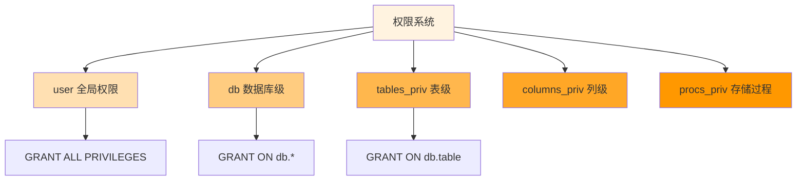
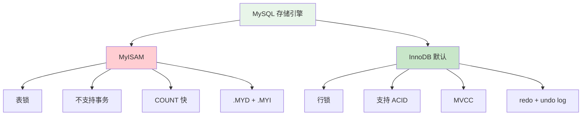
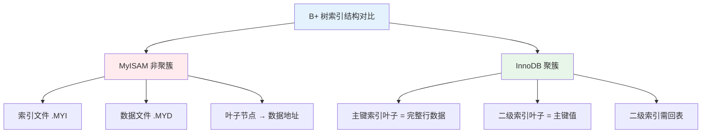
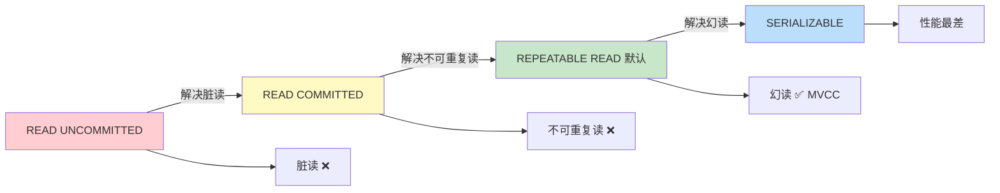

# 篇三 · 服务端工程 · 10 MySQL 与数据访问

> **定位**：索引与 B+ 树、事务与隔离级别、锁、SQL 优化、分库分表、GORM
> **面试权重**：🔥🔥🔥🔥🔥 必考 ｜ **前置**：3-09
> **🔁 前端类比**：排查「接口慢」的思路完全一致：定位（EXPLAIN/慢日志）→ 定位瓶颈 → 加索引/改 SQL/加缓存

## 🧭 核心考点

- B+ 树索引、聚簇/二级索引、最左前缀与索引失效
- 事务 ACID、四种隔离级别与 MVCC 实现
- 行锁/间隙锁/临键锁与死锁排查
- 慢 SQL 诊断：EXPLAIN、覆盖索引、分页优化
- database/sql 连接池与 GORM 使用要点

## 📑 本篇题目索引（共 34 题）

| # | 题目 | 难度 | 频率 |
|---|------|------|------|
| Q1 | 数据库三大范式是什么 | ⭐⭐⭐ | 📌 常考 |
| Q2 | MySQL 有关权限的表都有哪几个？ | ⭐⭐⭐ | 📌 常考 |
| Q3 | MySQL 的 binlog 有几种录入格式？分别有什么区别？ | ⭐⭐⭐ | 📌 常考 |
| Q4 | MySQL 存储引擎 MyISAM 与 InnoDB 区别 | ⭐⭐⭐ | 📌 常考 |
| Q5 | MyISAM 索引与 InnoDB 索引的区别？ | ⭐⭐⭐⭐ | 🔥 高频 |
| Q6 | 什么是索引？ | ⭐⭐⭐⭐ | 🔥 高频 |
| Q7 | 索引有哪些优缺点？ | ⭐⭐⭐⭐ | 🔥 高频 |
| Q8 | 索引有哪几种类型？ | ⭐⭐⭐⭐ | 🔥 高频 |
| Q9 | MySQL 中有哪几种锁？ | ⭐⭐⭐⭐ | 🔥 高频 |
| Q10 | InnoDB 支持的四种事务隔离级别名称，以及逐级之间的区别？ | ⭐⭐⭐⭐ | 🔥 高频 |
| Q11 | CHAR 和 VARCHAR 的区别？ | ⭐⭐⭐ | 📌 常考 |
| Q12 | 主键和候选键有什么区别？ | ⭐⭐⭐ | 📌 常考 |
| Q13 | 如何在 UNIX 和 MySQL 时间戳之间进行转换？ | ⭐⭐⭐ | 📌 常考 |
| Q14 | MyISAM 表类型将在哪里存储，并且还提供其存储格式？ | ⭐⭐⭐ | 📌 常考 |
| Q15 | MySQL 里记录货币用什么字段类型好？ | ⭐⭐⭐ | 📌 常考 |
| Q16 | 创建索引时需要注意什么？ | ⭐⭐⭐⭐ | 🔥 高频 |
| Q17 | 使用索引查询一定能提高查询的性能吗？为什么？ | ⭐⭐⭐⭐ | 🔥 高频 |
| Q18 | 百万级别或以上的数据如何删除？ | ⭐⭐⭐ | 📌 常考 |
| Q19 | 什么是最左前缀原则？什么是最左匹配原则？ | ⭐⭐⭐ | 📌 常考 |
| Q20 | 什么是聚簇索引？何时使用聚簇索引与非聚簇索引？ | ⭐⭐⭐⭐ | 🔥 高频 |
| Q21 | MySQL 连接器 | ⭐⭐⭐ | 📌 常考 |
| Q22 | MySQL 查询缓存 | ⭐⭐⭐⭐ | 🔥 高频 |
| Q23 | MySQL 分析器 | ⭐⭐⭐ | 📌 常考 |
| Q24 | MySQL 优化器 | ⭐⭐⭐⭐ | 🔥 高频 |
| Q25 | MySQL 执行器 | ⭐⭐⭐ | 📌 常考 |
| Q26 | 什么是临时表，何时删除临时表？ | ⭐⭐⭐ | 📌 常考 |
| Q27 | 谈谈 SQL 优化的经验 | ⭐⭐⭐⭐ | 🔥 高频 |
| Q28 | 什么叫外链接？ | ⭐⭐⭐ | 📌 常考 |
| Q29 | 什么叫内链接？ | ⭐⭐⭐ | 📌 常考 |
| Q30 | 使用 UNION 和 UNION ALL 时需要注意些什么？ | ⭐⭐⭐ | 📌 常考 |
| Q31 | MyISAM 存储引擎的特点 | ⭐⭐⭐ | 📌 常考 |
| Q32 | InnoDB 存储引擎的特点 | ⭐⭐⭐ | 📌 常考 |
| Q33 | MySQL 索引底层为什么用 B+ 树而不是 Hash 或 B 树？ | ⭐⭐⭐ | 🔥 高频 |
| Q34 | Go 中如何处理数据库事务的隔离级别？ | ⭐⭐ | 📌 常考 |

---

### Q1: 数据库三大范式是什么

**难度**：⭐⭐⭐ | **频率**：📌 常考

**考点**：第一范式、第二范式、第三范式、反范式化

**答案要点**：
- **1NF**：每列不可再分（原子性）
- **2NF**：在 1NF 基础上，非主键列完全依赖于主键（消除部分依赖）
- **3NF**：在 2NF 基础上，非主键列直接依赖于主键（消除传递依赖）
- 实际开发中常反范式化（冗余字段）提升查询性能

---

### Q2: MySQL 有关权限的表都有哪几个？

**难度**：⭐⭐⭐ | **频率**：📌 常考

**考点**：user、db、tables_priv、columns_priv

**答案要点**：
- `mysql.user`：用户全局权限
- `mysql.db`：数据库级权限
- `mysql.tables_priv`：表级权限
- `mysql.columns_priv`：列级权限
- `mysql.procs_priv`：存储过程权限

---

### Q3: MySQL 的 binlog 有几种录入格式？分别有什么区别？

**难度**：⭐⭐⭐ | **频率**：📌 常考

**考点**：STATEMENT、ROW、MIXED

**答案要点**：
- **STATEMENT**：记录 SQL 语句，体积小但不精确（函数/触发器问题）
- **ROW**：记录每行数据变化，精确但体积大（推荐）
- **MIXED**：自动选择，一般用 STATEMENT，特殊用 ROW

---

### Q4: MySQL 存储引擎 MyISAM 与 InnoDB 区别

**难度**：⭐⭐⭐ | **频率**：📌 常考

**考点**：事务、锁粒度、外键、崩溃恢复

**答案要点**：

| 维度 | MyISAM | InnoDB |
|------|--------|--------|
| 事务 | 不支持 | 支持（ACID） |
| 锁粒度 | 表锁 | 行锁 |
| 外键 | 不支持 | 支持 |
| 崩溃恢复 | 不支持 | 支持（redo log） |
| 全文索引 | 支持 | 5.6+ 支持 |
| COUNT | 快（有缓存） | 慢（需扫描） |

---

### Q5: MyISAM 索引与 InnoDB 索引的区别？

**难度**：⭐⭐⭐⭐ | **频率**：🔥 高频

**考点**：聚簇索引、非聚簇索引、回表

**答案要点**：
- **MyISAM**：非聚簇索引，索引和数据分离，索引叶子节点存数据地址
- **InnoDB**：聚簇索引，数据即索引（主键索引叶子节点存完整行数据）
- InnoDB 二级索引叶子节点存主键值，需回表查询

---

### Q6: 什么是索引？

**难度**：⭐⭐⭐⭐ | **频率**：🔥 高频

**考点**：B+树、查询加速、空间换时间

**答案要点**：
- 索引是帮助 MySQL 高效获取数据的数据结构
- 本质：B+ 树（InnoDB 默认）
- 优点：大幅提升查询速度
- 缺点：占用额外空间，降低写操作性能

---

### Q7: 索引有哪些优缺点？

**难度**：⭐⭐⭐⭐ | **频率**：🔥 高频

**考点**：查询加速、写性能下降、空间占用

**答案要点**：
- 优点：查询速度提升几个数量级，支持排序和分组优化
- 缺点：占用磁盘空间，INSERT/UPDATE/DELETE 需维护索引，降低写性能

---

### Q8: 索引有哪几种类型？

**难度**：⭐⭐⭐⭐ | **频率**：🔥 高频

**考点**：主键、唯一、普通、全文、组合

**答案要点**：
- **主键索引**（PRIMARY KEY）：唯一且非空
- **唯一索引**（UNIQUE）：值唯一，允许 NULL
- **普通索引**（INDEX）：无限制
- **全文索引**（FULLTEXT）：全文搜索
- **组合索引**（多列）：遵循最左前缀原则

---

### Q9: MySQL 中有哪几种锁？

**难度**：⭐⭐⭐⭐ | **频率**：🔥 高频

**考点**：表锁、行锁、间隙锁、意向锁

**答案要点**：
- **表锁**：MyISAM 默认，InnoDB 的 LOCK TABLES
- **行锁**：InnoDB 默认，锁住单行记录
- **间隙锁**（Gap Lock）：锁住索引记录之间的间隙，防止幻读
- **意向锁**：表级锁，表明事务打算对行加什么锁
- **记录锁**（Record Lock）：锁住单条索引记录

---

### Q10: InnoDB 支持的四种事务隔离级别名称，以及逐级之间的区别？

**难度**：⭐⭐⭐⭐ | **频率**：🔥 高频

**考点**：读未提交、读已提交、可重复读、串行化

**答案要点**：
- **READ UNCOMMITTED**：可读到未提交数据（脏读）
- **READ COMMITTED**：只能读已提交数据（解决脏读，有不可重复读）
- **REPEATABLE READ**（默认）：同一事务多次读取一致（解决不可重复读，MVCC 解决幻读）
- **SERIALIZABLE**：完全串行化（解决所有问题，性能最差）

---

### Q11: CHAR 和 VARCHAR 的区别？

**难度**：⭐⭐⭐ | **频率**：📌 常考

**考点**：定长 vs 变长、空间、性能

**答案要点**：
- **CHAR**：定长，不足补空格，查询快，适合固定长度（如 MD5、手机号）
- **VARCHAR**：变长，按需存储+长度标识，节省空间，适合长度不固定
- CHAR 最大 255，VARCHAR 最大 65535（受行大小限制）

---

### Q12: 主键和候选键有什么区别？

**难度**：⭐⭐⭐ | **频率**：📌 常考

**考点**：唯一性、NULL、选择

**答案要点**：
- **候选键**：能唯一标识一行的最小属性集
- **主键**：从候选键中选择的一个，作为表的唯一标识
- 主键不能为 NULL，候选键可以为 NULL
- 一个表只能有一个主键，但可有多个候选键

---

### Q13: 如何在 UNIX 和 MySQL 时间戳之间进行转换？

**难度**：⭐⭐⭐ | **频率**：📌 常考

**考点**：FROM_UNIXTIME、UNIX_TIMESTAMP

**答案要点**：
- MySQL → UNIX：`UNIX_TIMESTAMP('2026-01-01')`
- UNIX → MySQL：`FROM_UNIXTIME(1735689600)`
- Go 中：`time.Unix(timestamp, 0)`

---

### Q14: MyISAM 表类型将在哪里存储，并且还提供其存储格式？

**难度**：⭐⭐⭐ | **频率**：📌 常考

**考点**：文件结构、.MYD、.MYI、.frm

**答案要点**：
- `.frm`：表结构定义
- `.MYD`（MYData）：数据文件
- `.MYI`（MYIndex）：索引文件
- InnoDB：共享表空间（ibdata1）或独立表空间（.ibd）

---

### Q15: MySQL 里记录货币用什么字段类型好？

**难度**：⭐⭐⭐ | **频率**：📌 常考

**考点**：DECIMAL、精度、浮点数陷阱

**答案要点**：
- 使用 `DECIMAL(M,D)`，如 `DECIMAL(10,2)`
- 避免使用 FLOAT/DOUBLE（精度丢失）
- DECIMAL 以字符串形式存储，精确计算

---

### Q16: 创建索引时需要注意什么？

**难度**：⭐⭐⭐⭐ | **频率**：🔥 高频

**考点**：选择性、最左前缀、覆盖索引、避免过度

**答案要点**：
- 选择高选择性的列（区分度高）
- 遵循最左前缀原则创建组合索引
- 考虑覆盖索引（避免回表）
- 避免在频繁更新的列上建索引
- 不要过度索引（影响写性能）

---

### Q17: 使用索引查询一定能提高查询的性能吗？为什么？

**难度**：⭐⭐⭐⭐ | **频率**：🔥 高频

**考点**：索引失效、全表扫描、优化器选择

**答案要点**：
- 不一定。以下情况索引失效：
  1. 函数/表达式操作索引列
  2. 隐式类型转换
  3. LIKE '%xxx'（前缀通配符）
  4. OR 条件中有列无索引
  5. 数据量小，优化器选择全表扫描
- 使用 `EXPLAIN` 分析执行计划

---

### Q18: 百万级别或以上的数据如何删除？

**难度**：⭐⭐⭐ | **频率**：📌 常考

**考点**：分批删除、在线 DDL、归档

**答案要点**：
- 分批删除：`DELETE ... LIMIT 1000` 循环执行
- 创建新表，迁移保留数据，重命名替换
- 使用分区表，直接 DROP 分区
- 避免一次性大事务（锁表、binlog 膨胀）

---

### Q19: 什么是最左前缀原则？什么是最左匹配原则？

**难度**：⭐⭐⭐ | **频率**：📌 常考

**考点**：组合索引、匹配规则、索引失效

**答案要点**：
- 组合索引 `(a, b, c)`，查询必须从最左列开始匹配
- `WHERE a=1 AND b=2` ✅ 使用索引
- `WHERE b=2 AND c=3` ❌ 不使用索引（跳过 a）
- `WHERE a=1 AND c=3` ✅ 使用 a 部分索引
- 范围查询（>、<、LIKE）后的列不再使用索引

---

### Q20: 什么是聚簇索引？何时使用聚簇索引与非聚簇索引？

**难度**：⭐⭐⭐⭐ | **频率**：🔥 高频

**考点**：数据存储方式、InnoDB 主键、二级索引

**答案要点**：
- **聚簇索引**：数据行存储在索引叶子节点中，一个表只有一个
- **非聚簇索引**：索引叶子节点存储指向数据的指针
- InnoDB 主键索引就是聚簇索引
- 二级索引是非聚簇索引，需回表查询

---

### Q21: MySQL 连接器

**难度**：⭐⭐⭐ | **频率**：📌 常考

**考点**：连接管理、连接池、握手

**答案要点**：
- 负责与客户端建立连接、权限验证
- Go 中使用 `database/sql` + 驱动（`go-sql-driver/mysql`）
- 连接池管理：`SetMaxOpenConns`、`SetMaxIdleConns`

---

### Q22: MySQL 查询缓存

**难度**：⭐⭐⭐⭐ | **频率**：🔥 高频

**考点**：缓存命中、失效机制、8.0 移除

**答案要点**：
- MySQL 5.x 支持查询缓存，相同 SQL 直接返回结果
- 任何表更新都会使缓存失效，命中率低
- **MySQL 8.0 已移除**，推荐使用应用层缓存（Redis）

---

### Q23: MySQL 分析器

**难度**：⭐⭐⭐ | **频率**：📌 常考

**考点**：词法分析、语法分析、表/列验证

**答案要点**：
- 词法分析：识别 SQL 关键字、表名、列名
- 语法分析：检查 SQL 语法是否正确
- 验证表/列是否存在，权限是否足够

---

### Q24: MySQL 优化器

**难度**：⭐⭐⭐⭐ | **频率**：🔥 高频

**考点**：执行计划、索引选择、成本估算

**答案要点**：
- 选择最优执行计划（索引、连接顺序、算法）
- 基于成本模型（IO、CPU）
- 使用 `EXPLAIN` 查看优化器选择
- 可通过 `USE INDEX` / `FORCE INDEX` 干预

---

### Q25: MySQL 执行器

**难度**：⭐⭐⭐ | **频率**：📌 常考

**考点**：权限检查、引擎调用、结果返回

**答案要点**：
- 检查用户对表的权限
- 调用存储引擎接口执行查询
- 将结果集返回给客户端
- 慢查询日志在执行器层面记录

---

### Q26: 什么是临时表，何时删除临时表？

**难度**：⭐⭐⭐ | **频率**：📌 常考

**考点**：MEMORY 引擎、会话级、复杂查询

**答案要点**：
- 临时表用于存储中间结果（GROUP BY、ORDER BY、UNION）
- 会话结束时自动删除
- 也可显式创建：`CREATE TEMPORARY TABLE`
- 过大时可能落盘（磁盘临时表）

---

### Q27: 谈谈 SQL 优化的经验

**难度**：⭐⭐⭐⭐ | **频率**：🔥 高频

**考点**：EXPLAIN、索引、避免 SELECT *、分页优化

**答案要点**：
- 使用 `EXPLAIN` 分析执行计划
- 合理使用索引，避免索引失效
- 避免 `SELECT *`，只查需要的列
- 大分页优化：`WHERE id > last_id LIMIT 10`
- 避免在索引列上使用函数
- 使用覆盖索引减少回表

---

### Q28: 什么叫外链接？

**难度**：⭐⭐⭐ | **频率**：📌 常考

**考点**：LEFT JOIN、RIGHT JOIN、FULL JOIN

**答案要点**：
- **LEFT JOIN**：返回左表所有行，右表匹配不到为 NULL
- **RIGHT JOIN**：返回右表所有行，左表匹配不到为 NULL
- **FULL JOIN**：返回两表所有行（MySQL 不支持，可用 UNION 模拟）

---

### Q29: 什么叫内链接？

**难度**：⭐⭐⭐ | **频率**：📌 常考

**考点**：等值匹配、交集

**答案要点**：
- `INNER JOIN`：只返回两表匹配的行
- 等价于 `WHERE` 条件连接
- 是最常用的连接方式

---

### Q30: 使用 UNION 和 UNION ALL 时需要注意些什么？

**难度**：⭐⭐⭐ | **频率**：📌 常考

**考点**：去重、性能、排序

**答案要点**：
- `UNION`：自动去重，需要排序，性能较低
- `UNION ALL`：不去重，直接合并，性能更高
- 明确不需要去重时使用 `UNION ALL`

---

### Q31: MyISAM 存储引擎的特点

**难度**：⭐⭐⭐ | **频率**：📌 常考

**考点**：表锁、快速 COUNT、不支持事务

**答案要点**：
- 表级锁，并发写性能差
- COUNT(*) 快（有元数据缓存）
- 不支持事务和外键
- 适合读多写少、不需要事务的场景

---

### Q32: InnoDB 存储引擎的特点

**难度**：⭐⭐⭐ | **频率**：📌 常考

**考点**：行锁、事务、MVCC、外键

**答案要点**：
- 行级锁，高并发写性能好
- 支持 ACID 事务
- MVCC 实现非锁定读
- 支持外键约束
- 崩溃恢复（redo log + undo log）
- MySQL 默认存储引擎

---

---

### Q33: MySQL 索引底层为什么用 B+ 树而不是 Hash 或 B 树？

**难度**：⭐⭐⭐ | **频率**：🔥 高频

**考点**：索引结构、范围查询、磁盘 IO。

**💡 记忆关键词**：B+ 树、范围查询、矮胖树、叶子节点链表

**答案要点**：
- **对比 Hash**：Hash 仅适合等值查询，不支持范围查询和排序；B+ 树叶子节点通过指针连接，天然支持范围查询。
- **对比 B 树**：B 树非叶子节点也存数据，导致单页存储的键值少，树更高，IO 次数多；B+ 树非叶子节点只存索引，树更矮胖，查询更稳定（都在叶子节点）。

---

### Q34: Go 中如何处理数据库事务的隔离级别？

**难度**：⭐⭐ | **频率**：📌 常考

**考点**：`sql.Tx`、ACID、MVCC。

**💡 记忆关键词**：BeginTx、隔离级别、FOR UPDATE、乐观锁

**答案要点**：
- 使用 `db.BeginTx(ctx, &sql.TxOptions{Isolation: ...})` 指定隔离级别。
- **默认**：通常是 `READ COMMITTED` 或 `REPEATABLE READ`（取决于 DB 配置）。
- **实践**：对于资金类操作，使用 `SELECT ... FOR UPDATE`（悲观锁）或基于版本号/时间戳的乐观锁，配合事务确保一致性。

---

## ✅ 自测清单（答不出就回去看对应题）

- [ ] 能脱离资料讲清本篇「核心考点」中的每一条
- [ ] 能手写/口述至少 2 道 🔥 高频题的最小实现
- [ ] 能结合自己的项目讲出 1 个坑或 1 次调优

