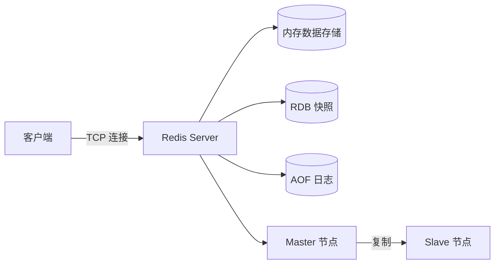
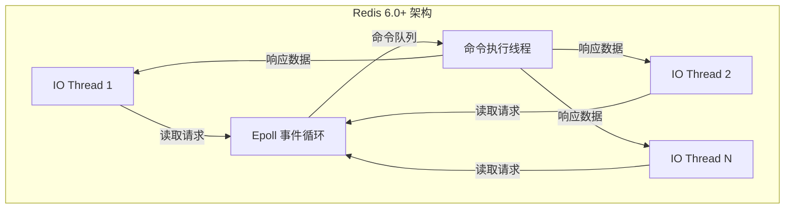
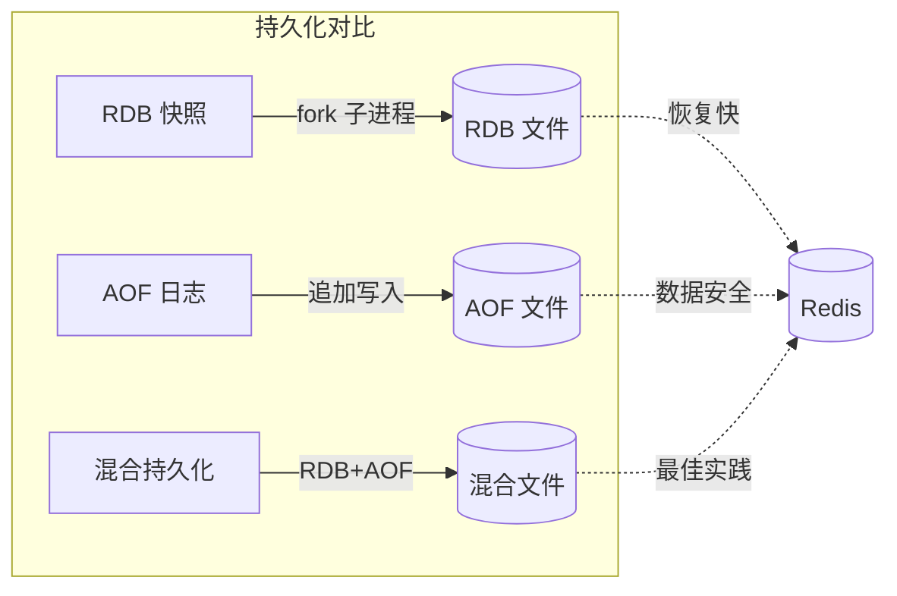
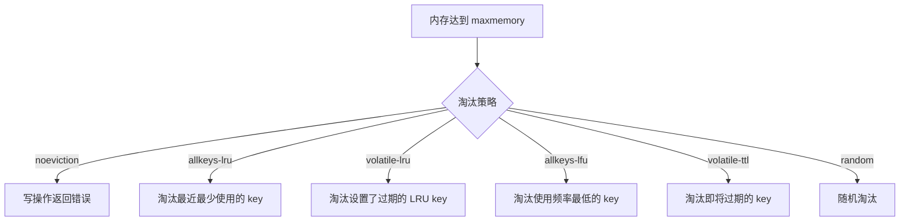
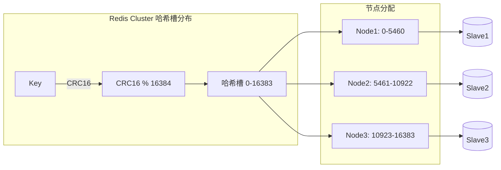

# 篇三 · 服务端工程 · 11 Redis 缓存与数据结构

> **定位**：Redis 数据类型与底层结构、持久化、集群、分布式锁（Go 客户端视角）
> **面试权重**：🔥🔥🔥🔥🔥 必考 ｜ **前置**：3-10
> **🔁 前端类比**：`localStorage` 是单机 KV，Redis 是带过期、淘汰、持久化和原子命令的服务端共享 KV

## 🧭 核心考点

- 五种基础类型与底层编码（SDS/ziplist/skiplist/hashtable）
- RDB/AOF 与混合持久化的取舍
- 主从、哨兵、Cluster 与哈希槽
- 分布式锁：SET NX PX / Redlock / go-redis 实现与续期
- Pipeline、Lua 脚本与原子性

## 📑 本篇题目索引（共 40 题）

| # | 题目 | 难度 | 频率 |
|---|------|------|------|
| Q1 | 什么是 Redis? | ⭐⭐⭐ | 📌 常考 |
| Q2 | Redis 的数据类型？ | ⭐⭐⭐ | 📌 常考 |
| Q3 | 使用 Redis 有哪些好处？ | ⭐⭐⭐ | 📌 常考 |
| Q4 | Redis 相比 Memcached 有哪些优势？ | ⭐⭐⭐ | 📌 常考 |
| Q5 | Memcached 与 Redis 的区别都有哪些？ | ⭐⭐⭐ | 📌 常考 |
| Q6 | Redis 是单进程单线程的？ | ⭐⭐⭐ | 📌 常考 |
| Q7 | 一个字符串类型的值能存储最大容量是多少？ | ⭐⭐⭐ | 📌 常考 |
| Q8 | Redis 的持久化机制是什么？各自的优缺点？ | ⭐⭐⭐⭐ | 🔥 高频 |
| Q9 | Redis 常见性能问题和解决方案 | ⭐⭐⭐ | 📌 常考 |
| Q10 | Redis 过期键的删除策略？ | ⭐⭐⭐⭐ | 🔥 高频 |
| Q11 | Redis 的回收策略（淘汰策略）? | ⭐⭐⭐⭐ | 🔥 高频 |
| Q12 | 为什么 Redis 需要把所有数据放到内存中？ | ⭐⭐⭐⭐ | 🔥 高频 |
| Q13 | Redis 的同步机制了解么？ | ⭐⭐⭐ | 📌 常考 |
| Q14 | Pipeline 有什么好处，为什么要用 Pipeline？ | ⭐⭐⭐⭐ | 🔥 高频 |
| Q15 | 是否使用过 Redis 集群，集群的原理是什么？ | ⭐⭐⭐⭐ | 🔥 高频 |
| Q16 | Redis 集群方案什么情况下会导致整个集群不可用？ | ⭐⭐⭐⭐ | 🔥 高频 |
| Q17 | Go 语言有哪些主流 Redis 客户端？如何选型？ | ⭐⭐ | 📌 常考 |
| Q18 | `go-redis` 与 `redigo` / `rueidis` 对比有什么优缺点？ | ⭐⭐ | 📌 常考 |
| Q19 | Redis 如何设置密码及验证密码？ | ⭐⭐⭐ | 📌 常考 |
| Q20 | 说说 Redis 哈希槽的概念？ | ⭐⭐⭐⭐ | 🔥 高频 |
| Q21 | Redis 集群的主从复制模型是怎样的？ | ⭐⭐⭐⭐ | 🔥 高频 |
| Q22 | Redis 集群会有写操作丢失吗？为什么？ | ⭐⭐⭐⭐ | 🔥 高频 |
| Q23 | Redis 集群之间是如何复制的？ | ⭐⭐⭐⭐ | 🔥 高频 |
| Q24 | Redis 集群最大节点个数是多少？ | ⭐⭐⭐⭐ | 🔥 高频 |
| Q25 | Redis 集群如何选择数据库？ | ⭐⭐⭐⭐ | 🔥 高频 |
| Q26 | 怎么测试 Redis 的连通性 | ⭐⭐⭐ | 📌 常考 |
| Q27 | 如何理解 Redis 事务？ | ⭐⭐⭐⭐ | 🔥 高频 |
| Q28 | Redis 事务相关的命令有哪几个？ | ⭐⭐⭐⭐ | 🔥 高频 |
| Q29 | Redis KEY 的过期时间和永久有效分别怎么设置？ | ⭐⭐⭐⭐ | 🔥 高频 |
| Q30 | Redis 如何做内存优化？ | ⭐⭐⭐⭐ | 🔥 高频 |
| Q31 | Redis 回收进程如何工作的？ | ⭐⭐⭐ | 📌 常考 |
| Q32 | 都有哪些办法可以降低 Redis 的内存使用情况呢？ | ⭐⭐⭐⭐ | 🔥 高频 |
| Q33 | Redis 的内存用完了会发生什么？ | ⭐⭐⭐⭐ | 🔥 高频 |
| Q34 | 一个 Redis 实例最多能存放多少 keys？ | ⭐⭐⭐ | 📌 常考 |
| Q35 | MySQL 有 2000W 数据，Redis 中只存 20W，如何保证 Redis 中都是热… | ⭐⭐⭐ | 📌 常考 |
| Q36 | Redis 最适合的场景？ | ⭐⭐⭐ | 📌 常考 |
| Q37 | 假如 Redis 有 1 亿个 KEY，其中 10W 以某个前缀开头，如何找出来？ | ⭐⭐⭐ | 📌 常考 |
| Q38 | 大量 KEY 设置同一时间过期，需要注意什么？ | ⭐⭐⭐⭐ | 🔥 高频 |
| Q39 | 使用过 Redis 做异步队列么，你是怎么用的？ | ⭐⭐⭐ | 📌 常考 |
| Q40 | 使用过 Redis 分布式锁么，它是什么回事？ | ⭐⭐⭐⭐ | 🔥 高频 |

---

### Q1: 什么是 Redis?

**难度**：⭐⭐⭐ | **频率**：📌 常考

**考点**：内存数据库、数据结构服务器、高性能

**答案要点**：
- Redis 是开源的内存数据结构存储系统，可用作数据库、缓存、消息中间件
- 支持多种数据结构：String、Hash、List、Set、ZSet 等
- 单线程模型（6.0+ 引入多线程 IO），性能极高（10w+ QPS）
- 支持持久化（RDB + AOF）、主从复制、集群



---

### Q2: Redis 的数据类型？

**难度**：⭐⭐⭐ | **频率**：📌 常考

**考点**：5种基础类型+3种特殊类型

**答案要点**：
- **String**：字符串/整数/浮点数，最基础类型
- **Hash**：哈希表，适合存储对象
- **List**：双向链表，支持阻塞操作
- **Set**：无序集合，支持交集/并集/差集
- **ZSet（Sorted Set）**：有序集合，按 score 排序
- **特殊类型**：Bitmap、HyperLogLog、Geo（地理位置）

---

### Q3: 使用 Redis 有哪些好处？

**难度**：⭐⭐⭐ | **频率**：📌 常考

**考点**：性能、数据结构、生态

**答案要点**：
- 极高的读写性能（内存操作）
- 丰富的数据结构，减少应用层复杂度
- 支持持久化，数据不丢失
- 原子操作，天然支持分布式锁
- 发布订阅、Lua 脚本、事务

---

### Q4: Redis 相比 Memcached 有哪些优势？

**难度**：⭐⭐⭐ | **频率**：📌 常考

**考点**：功能对比、数据类型、持久化

**答案要点**：
- Redis 支持更多数据类型（Memcached 仅 String）
- Redis 支持持久化，Memcached 不支持
- Redis 支持主从复制和集群
- Redis 支持 Lua 脚本、事务
- Memcached 多线程，Redis 单线程（6.0+ 多线程 IO）

---

### Q5: Memcached 与 Redis 的区别都有哪些？

**难度**：⭐⭐⭐ | **频率**：📌 常考

**考点**：架构对比、线程模型、场景

**答案要点**：

| 维度 | Redis | Memcached |
|------|-------|-----------|
| 数据类型 | 丰富 | 仅 String |
| 持久化 | 支持 | 不支持 |
| 线程模型 | 单线程+多线程IO | 多线程 |
| 集群 | 原生支持 | 客户端分片 |
| 事务 | 支持 | 不支持 |
| 适用场景 | 缓存/DB/消息 | 纯缓存 |

---

### Q6: Redis 是单进程单线程的？

**难度**：⭐⭐⭐ | **频率**：📌 常考

**考点**：事件循环、6.0 多线程、性能瓶颈

**答案要点**：
- Redis 6.0 之前：单进程单线程，基于 Reactor 事件循环
- Redis 6.0+：网络 IO 多线程，命令执行仍单线程
- 单线程优势：无锁竞争、简单、避免上下文切换
- 瓶颈：单核 CPU 性能上限，大 key 阻塞



---

### Q7: 一个字符串类型的值能存储最大容量是多少？

**难度**：⭐⭐⭐ | **频率**：📌 常考

**考点**：内存限制、SDS 结构

**答案要点**：
- 单个 String 值最大 512MB
- 底层使用 SDS（Simple Dynamic String）
- 实际受限于可用内存

---

### Q8: Redis 的持久化机制是什么？各自的优缺点？

**难度**：⭐⭐⭐⭐ | **频率**：🔥 高频

**考点**：RDB、AOF、混合持久化

**答案要点**：
- **RDB**：快照方式，定期保存全量数据
  - 优点：文件小、恢复快、适合备份
  - 缺点：可能丢失最后一次快照后的数据
- **AOF**：追加日志，记录每条写命令
  - 优点：数据安全性高（每秒/每次写入）
  - 缺点：文件大、恢复慢
- **混合持久化**（4.0+）：RDB 快照 + AOF 增量



---

### Q9: Redis 常见性能问题和解决方案

**难度**：⭐⭐⭐ | **频率**：📌 常考

**考点**：大 key、热 key、网络、内存

**答案要点**：
- **大 key**：拆分、压缩、删除
- **热 key**：本地缓存、读写分离、热点探测
- **网络延迟**：同机房部署、连接池、Pipeline
- **内存碎片**：重启、调整内存分配器

---

### Q10: Redis 过期键的删除策略？

**难度**：⭐⭐⭐⭐ | **频率**：🔥 高频

**考点**：定期删除、惰性删除、内存淘汰

**答案要点**：
- **定期删除**：每秒随机抽查过期 key 并删除
- **惰性删除**：访问时检查是否过期，过期则删除
- 两者结合：定期删除处理大部分，惰性删除兜底

---

### Q11: Redis 的回收策略（淘汰策略）?

**难度**：⭐⭐⭐⭐ | **频率**：🔥 高频

**考点**：8种策略、LRU/LFU

**答案要点**：
- `noeviction`：不删除，返回错误（默认）
- `allkeys-lru`：所有 key 中淘汰最近最少使用
- `volatile-lru`：仅淘汰设置了过期时间的 key
- `allkeys-lfu`：所有 key 中淘汰最少频率使用（4.0+）
- `volatile-lfu`、`allkeys-random`、`volatile-random`、`volatile-ttl`



---

### Q12: 为什么 Redis 需要把所有数据放到内存中？

**难度**：⭐⭐⭐⭐ | **频率**：🔥 高频

**考点**：性能设计、持久化补充

**答案要点**：
- 内存访问速度远超磁盘（纳秒 vs 毫秒）
- 单线程模型要求极低延迟
- 持久化作为数据备份，非主要存储
- Redis 7.0+ 实验性支持磁盘存储（非主流用法）

---

### Q13: Redis 的同步机制了解么？

**难度**：⭐⭐⭐ | **频率**：📌 常考

**考点**：全量同步、增量同步、PSYNC

**答案要点**：
- **全量同步**：首次连接或无法增量同步时，Master 生成 RDB 发送给 Slave
- **增量同步**：Master 将写命令传播给 Slave（复制积压缓冲区）
- **PSYNC**：2.8+ 引入，支持部分重同步，减少全量同步

---

### Q14: Pipeline 有什么好处，为什么要用 Pipeline？

**难度**：⭐⭐⭐⭐ | **频率**：🔥 高频

**考点**：减少 RTT、批量操作、性能提升

**答案要点**：
- 将多个命令打包一次发送，减少网络 RTT
- 性能提升显著（10x~100x）
- 注意：Pipeline 不是原子操作，大量命令可能阻塞

```go
pipe := client.Pipeline()
for i := 0; i < 1000; i++ {
    pipe.Set(ctx, fmt.Sprintf("key:%d", i), value, 0)
}
pipe.Exec(ctx) // 一次性发送
```

---

### Q15: 是否使用过 Redis 集群，集群的原理是什么？

**难度**：⭐⭐⭐⭐ | **频率**：🔥 高频

**考点**：哈希槽、去中心化、Gossip 协议

**答案要点**：
- 16384 个哈希槽，key 通过 CRC16 映射到槽
- 每个节点负责一部分槽
- 去中心化架构，节点间通过 Gossip 协议通信
- 客户端直连目标节点，MOVED/ASK 重定向



---

### Q16: Redis 集群方案什么情况下会导致整个集群不可用？

**难度**：⭐⭐⭐⭐ | **频率**：🔥 高频

**考点**：故障转移、槽覆盖、多数派

**答案要点**：
- 某个槽段的所有节点（主从）都宕机
- 超过半数 Master 节点不可用（集群元数据无法达成共识）
- 网络分区导致节点间无法通信

---

### Q17: Go 语言有哪些主流 Redis 客户端？如何选型？

**难度**：⭐⭐ | **频率**：📌 常考

**考点**：`go-redis`、`redigo`、`rueidis`、集群与哨兵支持。

**💡 记忆关键词**：go-redis 事实标准、支持 Cluster/Sentinel、连接池、Pipeline/事务

**答案要点**：
- **`github.com/redis/go-redis/v9`（事实标准，推荐）**：API 现代（`context` 贯穿所有调用）、完整支持 **Cluster / Sentinel / 单机**、内置连接池、Pipeline、Lua、Pub/Sub、SSE 场景够用；官方 Redis 组织维护（由 `go-redis/redis` 迁移而来）。
- **`gomodule/redigo`（老牌）**：贴近协议、轻量，但需要自己管理连接池（`redigo.Pool`）、API 缺少 context 支持，新项目不建议。
- **`rueidis`（高性能）**：基于 RESP3 的**自动流水线**与客户端缓存，极限吞吐场景有优势；生态与文档不如 go-redis。
- **选型建议**：**默认 go-redis**；只有在压测证明客户端本身成为瓶颈时才考虑 rueidis；`redigo` 仅维护老项目。

```go
import "github.com/redis/go-redis/v9"

rdb := redis.NewClient(&redis.Options{
    Addr:         "localhost:6379",
    Password:     os.Getenv("REDIS_PASSWORD"),
    DB:           0,
    PoolSize:     100,               // 连接池大小，按 QPS × 平均耗时估算
    MinIdleConns: 10,
    DialTimeout:  500 * time.Millisecond,
    ReadTimeout:  300 * time.Millisecond,
    WriteTimeout: 300 * time.Millisecond,
})

ctx, cancel := context.WithTimeout(context.Background(), time.Second) // 所有命令都带 ctx
defer cancel()

if err := rdb.Set(ctx, "k", "v", 10*time.Minute).Err(); err != nil {
    return fmt.Errorf("redis set: %w", err)
}
val, err := rdb.Get(ctx, "k").Result()
if errors.Is(err, redis.Nil) { // 专门的「键不存在」哨兵错误
    // 未命中
}
```

**⚠️ 面试加分点**：所有 Redis 调用**必须带超时**（`ctx`），且要区分 `redis.Nil`（键不存在，属正常）与其他错误（网络/服务异常，需要告警）—— 这是缓存穿透处理与错误监控的关键区别（见 3-12）。

**📝 一句话总结**：默认用 `go-redis/v9`（context + 连接池 + Cluster/Sentinel 全支持），新项目不要用 redigo，rueidis 留给极限吞吐场景。

---

### Q18: `go-redis` 与 `redigo` / `rueidis` 对比有什么优缺点？

**难度**：⭐⭐ | **频率**：📌 常考

**考点**：API 风格、连接管理、上下文支持、性能与生态。

**💡 记忆关键词**：context 支持、连接池内置 vs 自管、自动流水线、生态与文档

**答案要点**：

| 维度 | go-redis/v9 | redigo | rueidis |
|------|-------------|--------|---------|
| API 风格 | 高层封装（`Set/Get/HSet`）+ 命令式 | 贴近协议（`conn.Do("SET", k, v)`） | 高层 + RESP3 |
| `context` 支持 | ✅ 全 API | ❌（需自己用 dial 超时） | ✅ |
| 连接池 | 内置（`PoolSize` 等） | 需手动用 `redigo.Pool` | 内置 |
| 集群支持 | ✅ Cluster/Sentinel | 需自己实现 | ✅ |
| 性能 | 足够好（pipeline/Lua 可用） | 基础 | **最高**（自动流水线、客户端缓存） |
| 生态/文档 | 最好，社区最大 | 维护模式 | 较新、较小 |

- **结论**：**性能差异通常不是瓶颈**（Redis 本身 10 万 QPS 级别，业务侧更多受网络 RTT 与命令个数影响）；真正影响性能的是**是否用 Pipeline/批量命令**、**连接池是否够用**、**是否有大 key 与慢命令**。
- **实践优化**：批量操作用 `Pipeline` 或 `MGet/MSet`；热点数据加本地缓存；合理设置 `PoolSize`（过小会排队、过大会压垮 Redis）并监控 `PoolStats()`。

**📝 一句话总结**：三者差异主要在「context 支持 + 连接池 + 集群封装 + 生态」，性能够用时选生态最好的 go-redis；优化吞吐优先看 Pipeline 与连接池，而不是换客户端。

---

### Q19: Redis 如何设置密码及验证密码？

**难度**：⭐⭐⭐ | **频率**：📌 常考

**考点**：AUTH、CONFIG、安全性

**答案要点**：
- 配置文件：`requirepass yourpassword`
- 运行时：`CONFIG SET requirepass "password"`
- 客户端连接后：`AUTH password`
- 建议：结合 TLS 加密传输，避免明文密码

---

### Q20: 说说 Redis 哈希槽的概念？

**难度**：⭐⭐⭐⭐ | **频率**：🔥 高频

**考点**：16384 槽、CRC16、槽分配

**答案要点**：
- Redis Cluster 使用 16384 个哈希槽（0-16383）
- Key 通过 `CRC16(key) % 16384` 确定槽位
- 每个节点负责一段连续的槽
- Hash Tag：`{user:100}.name` 和 `{user:100}.age` 映射到同一槽

---

### Q21: Redis 集群的主从复制模型是怎样的？

**难度**：⭐⭐⭐⭐ | **频率**：🔥 高频

**考点**：一主多从、异步复制、读写分离

**答案要点**：
- 一个 Master 可挂多个 Slave
- Master 负责写，Slave 负责读（可配置）
- 异步复制：Master 写完成后异步传播给 Slave
- Slave 可级联复制（Master → Slave → Sub-Slave）

---

### Q22: Redis 集群会有写操作丢失吗？为什么？

**难度**：⭐⭐⭐⭐ | **频率**：🔥 高频

**考点**：异步复制、故障切换、数据一致性

**答案要点**：
- 会。因为主从复制是异步的
- Master 写入后未同步到 Slave 就宕机，这部分数据丢失
- 配置 `min-replicas-to-write` 可减少丢失风险
- 强一致性需使用 Redlock 或等待同步确认

---

### Q23: Redis 集群之间是如何复制的？

**难度**：⭐⭐⭐⭐ | **频率**：🔥 高频

**考点**：复制流、积压缓冲区、部分重同步

**答案要点**：
- Master 将写命令写入复制流（replication backlog）
- Slave 连接后从指定 offset 开始接收增量数据
- 若 offset 超出 backlog 范围，触发全量同步
- 复制流大小由 `repl-backlog-size` 控制

---

### Q24: Redis 集群最大节点个数是多少？

**难度**：⭐⭐⭐⭐ | **频率**：🔥 高频

**考点**：16384 槽限制、实际部署

**答案要点**：
- 理论最大 16384 个节点（每个节点一个槽）
- 实际建议不超过 1000 个节点
- Gossip 协议消息量随节点数增长

---

### Q25: Redis 集群如何选择数据库？

**难度**：⭐⭐⭐⭐ | **频率**：🔥 高频

**考点**：db 0-15、集群限制

**答案要点**：
- 单机 Redis 支持 16 个数据库（db 0-15）
- **Redis Cluster 仅支持 db 0**，不支持多数据库
- 集群环境下通过不同 key 前缀或命名空间隔离

---

### Q26: 怎么测试 Redis 的连通性

**难度**：⭐⭐⭐ | **频率**：📌 常考

**考点**：PING、客户端连接

**答案要点**：
- CLI：`redis-cli ping` 返回 PONG
- Go：`client.Ping(ctx).Err()`
- 检查网络、防火墙、bind 配置

---

### Q27: 如何理解 Redis 事务？

**难度**：⭐⭐⭐⭐ | **频率**：🔥 高频

**考点**：MULTI/EXEC、不隔离、无回滚

**答案要点**：
- Redis 事务不是真正的 ACID 事务
- 命令排队后一次性执行，不会被中断
- 不支持回滚（命令入队后即使语法错误也继续）
- 无隔离性，其他客户端命令可穿插执行

---

### Q28: Redis 事务相关的命令有哪几个？

**难度**：⭐⭐⭐⭐ | **频率**：🔥 高频

**考点**：MULTI、EXEC、DISCARD、WATCH

**答案要点**：
- `MULTI`：开启事务
- `EXEC`：执行事务
- `DISCARD`：取消事务
- `WATCH`：乐观锁，监控 key 变化
- `UNWATCH`：取消监控

---

### Q29: Redis KEY 的过期时间和永久有效分别怎么设置？

**难度**：⭐⭐⭐⭐ | **频率**：🔥 高频

**考点**：EXPIRE、PERSIST、TTL

**答案要点**：
- 过期：`SET key value EX seconds` 或 `EXPIRE key seconds`
- 永久：`PERSIST key` 移除过期时间
- 查询：`TTL key`（剩余秒数），-1 永久，-2 不存在

---

### Q30: Redis 如何做内存优化？

**难度**：⭐⭐⭐⭐ | **频率**：🔥 高频

**考点**：数据结构、编码、压缩

**答案要点**：
- 使用合适数据结构（Hash vs 多个 String）
- 启用压缩：`list-compress-depth`、`zset-max-ziplist-entries`
- 使用 short string 编码（embstr）
- 定期清理过期 key 和无用数据
- 控制 key 和 value 的长度

---

### Q31: Redis 回收进程如何工作的？

**难度**：⭐⭐⭐ | **频率**：📌 常考

**考点**：后台线程、惰性+定期、内存淘汰

**答案要点**：
- 惰性删除：访问时检查过期
- 定期删除：后台线程每秒随机抽查
- 内存淘汰：内存达到 maxmemory 时按策略淘汰
- 三者协同工作

---

### Q32: 都有哪些办法可以降低 Redis 的内存使用情况呢？

**难度**：⭐⭐⭐⭐ | **频率**：🔥 高频

**考点**：编码优化、压缩、数据结构选择

**答案要点**：
- 使用 Hash 替代多个 String key
- 缩短 key 和 field 名称
- 使用整数或短字符串
- 调整 ziplist/listpack 阈值
- 定期清理无用数据

---

### Q33: Redis 的内存用完了会发生什么？

**难度**：⭐⭐⭐⭐ | **频率**：🔥 高频

**考点**：maxmemory 行为、OOM、淘汰策略

**答案要点**：
- 默认：继续分配直到系统 OOM
- 设置 `maxmemory`：按淘汰策略处理
- `noeviction`：写操作返回错误
- 其他策略：淘汰旧数据腾出空间

---

### Q34: 一个 Redis 实例最多能存放多少 keys？

**难度**：⭐⭐⭐ | **频率**：📌 常考

**考点**：理论限制、实际限制

**答案要点**：
- 理论：2^32 - 1（约 42 亿）个 key
- List/Set/ZSet 最多 2^32 - 1 个元素
- 实际受限于内存大小和性能

---

### Q35: MySQL 有 2000W 数据，Redis 中只存 20W，如何保证 Redis 中都是热点数据？

**难度**：⭐⭐⭐ | **频率**：📌 常考

**考点**：LRU、缓存预热、淘汰策略

**答案要点**：
- 使用 `allkeys-lru` 或 `allkeys-lfu` 淘汰策略
- 缓存预热：启动时加载热点数据
- 业务层控制：仅缓存高频访问数据
- 监控命中率，调整 maxmemory

---

### Q36: Redis 最适合的场景？

**难度**：⭐⭐⭐ | **频率**：📌 常考

**考点**：缓存、排行榜、计数器、会话

**答案要点**：
- 缓存：热点数据加速访问
- 计数器/排行榜：INCR、ZSet
- 会话存储：分布式 Session
- 分布式锁：SETNX + 过期时间
- 消息队列：List/Stream
- 实时分析：HyperLogLog、Bitmap

---

### Q37: 假如 Redis 有 1 亿个 KEY，其中 10W 以某个前缀开头，如何找出来？

**难度**：⭐⭐⭐ | **频率**：📌 常考

**考点**：SCAN、KEYS 禁止、游标

**答案要点**：
- **禁止使用 KEYS**（阻塞 Redis）
- 使用 `SCAN` 命令游标迭代
- `SCAN 0 MATCH prefix:* COUNT 1000`
- Go 中使用 `client.Scan()` 迭代器

```go
iter := client.Scan(ctx, 0, "prefix:*", 1000).Iterator()
for iter.Next(ctx) {
    fmt.Println(iter.Val())
}
```

---

### Q38: 大量 KEY 设置同一时间过期，需要注意什么？

**难度**：⭐⭐⭐⭐ | **频率**：🔥 高频

**考点**：缓存雪崩、随机化、错峰

**答案要点**：
- 大量 key 同时过期可能导致瞬时请求穿透到 DB
- 解决：过期时间加随机值（±10%）
- 热点 key 设置不同过期时间
- 使用互斥锁防止缓存击穿

---

### Q39: 使用过 Redis 做异步队列么，你是怎么用的？

**难度**：⭐⭐⭐ | **频率**：📌 常考

**考点**：List、Stream、发布订阅

**答案要点**：
- **List**：`LPUSH` 生产，`BRPOP` 消费（阻塞弹出）
- **Stream**（5.0+）：更强大的消息队列，支持消费者组
- **发布订阅**：轻量但不持久，消费者离线丢失消息
- 推荐：Stream 适合生产环境

---

### Q40: 使用过 Redis 分布式锁么，它是什么回事？

**难度**：⭐⭐⭐⭐ | **频率**：🔥 高频

**考点**：SETNX、看门狗、Redlock

**答案要点**：
- 基础：`SET lock_key unique_value NX PX 30000`
- 释放：Lua 脚本原子检查并删除（防止误删）
- 续期：看门狗后台 goroutine 定时延长过期时间
- 高可用：Redlock（多节点独立加锁，多数成功）
- Go 实现：`redis-lock` 库或 Redisson（Java）

```go
// Go 分布式锁示例
lock, err := redislock.Obtain(ctx, client, "my-lock", 30*time.Second, nil)
if err == redislock.ErrNotObtained {
    // 获取锁失败
}
defer lock.Release(ctx)
// 执行业务逻辑...
```

---

---

---

## ✅ 自测清单（答不出就回去看对应题）

- [ ] 能脱离资料讲清本篇「核心考点」中的每一条
- [ ] 能手写/口述至少 2 道 🔥 高频题的最小实现
- [ ] 能结合自己的项目讲出 1 个坑或 1 次调优

