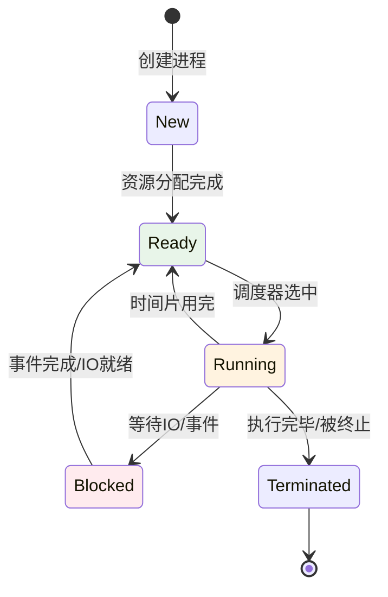
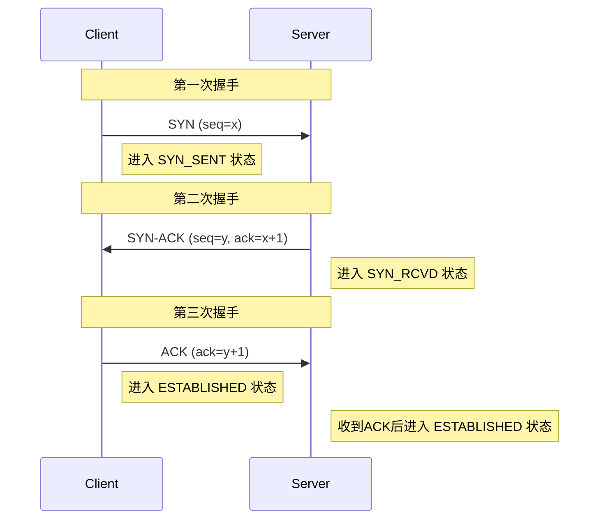
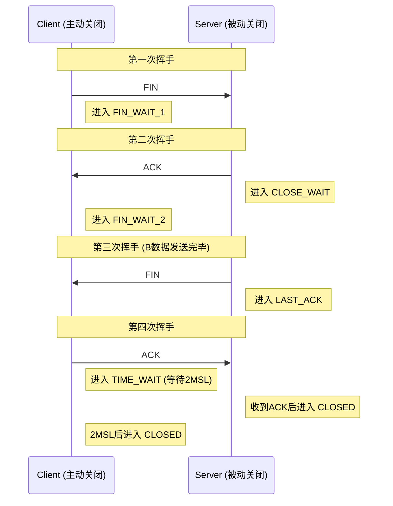
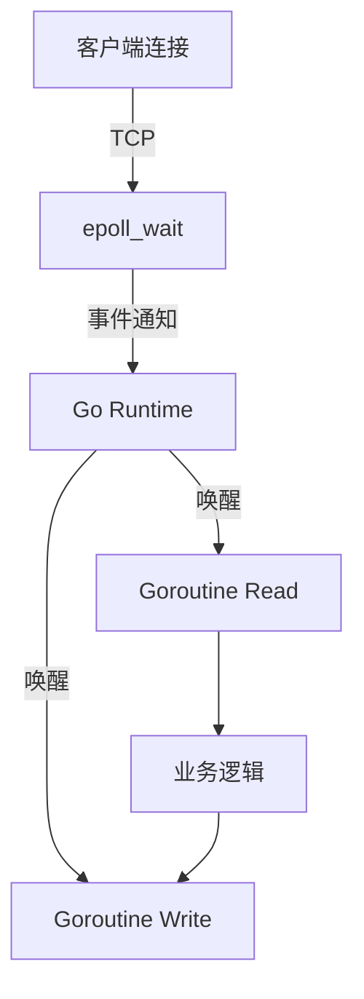

# 篇四 · 系统与分布式 · 16 网络与操作系统原理

> **定位**：TCP/IP、HTTP 演进、HTTPS、IO 多路复用、进程/线程/协程
> **面试权重**：🔥🔥🔥🔥 高频 ｜ **前置**：2-05
> **🔁 前端类比**：Node 的 libuv/epoll ≈ Go 的 netpoller；浏览器一次请求背后的 DNS/TCP/TLS 就是本篇内容

## 🧭 核心考点

- TCP 三次握手/四次挥手、状态机与 TIME_WAIT
- HTTP/1.1 → HTTP/2 → HTTP/3 与 HTTPS 握手
- IO 多路复用 select/poll/epoll 与 Go netpoller
- 进程/线程/协程的切换成本与调度
- 常见网络问题排查（连接数、TIME_WAIT、丢包）

## 📑 本篇题目索引（共 30 题）

| # | 题目 | 难度 | 频率 |
|---|------|------|------|
| Q1 | 进程和线程的区别？ | ⭐⭐ | 🔥 高频 |
| Q2 | 协程与线程的区别？ | ⭐⭐ | 🔥 高频 |
| Q3 | 并发和并行有什么区别？ | ⭐⭐ | 📌 常考 |
| Q4 | 进程与线程的切换流程？ | ⭐⭐⭐ | 📌 常考 |
| Q5 | 为什么虚拟地址空间切换会比较耗时？ | ⭐⭐⭐ | 📌 常考 |
| Q6 | 进程间通信方式有哪些？ | ⭐⭐⭐ | 🔥 高频 |
| Q7 | 进程间同步的方式有哪些？ | ⭐⭐⭐ | 📌 常考 |
| Q8 | 线程同步的方式有哪些？ | ⭐⭐⭐ | 📌 常考 |
| Q9 | 线程的分类？ | ⭐⭐ | 📌 常考 |
| Q10 | 什么是临界区，如何解决冲突？ | ⭐⭐ | 📌 常考 |
| Q11 | 什么是死锁？死锁产生的条件？ | ⭐⭐⭐ | 🔥 高频 |
| Q12 | 进程调度策略有哪几种？ | ⭐⭐ | 📌 常考 |
| Q13 | 进程有哪些状态？ | ⭐⭐ | 📌 常考 |
| Q14 | 什么是分页？ | ⭐⭐ | 📌 常考 |
| Q15 | 什么是分段？ | ⭐⭐ | 📌 常考 |
| Q16 | 分页和分段有什么区别？ | ⭐⭐ | 📌 常考 |
| Q17 | 什么是交换空间（Swap）？ | ⭐⭐ | 📌 常考 |
| Q18 | 页面替换算法有哪些？ | ⭐⭐ | 📌 常考 |
| Q19 | 什么是缓冲区溢出？有什么危害？ | ⭐⭐⭐ | 📌 常考 |
| Q20 | 什么是虚拟内存？ | ⭐⭐ | 📌 常考 |
| Q21 | 讲一讲 IO 多路复用？ | ⭐⭐⭐ | 🔥 高频 |
| Q22 | 硬链接和软链接有什么区别？ | ⭐⭐ | 📌 常考 |
| Q23 | 中断的处理过程？ | ⭐⭐ | 📌 常考 |
| Q24 | 中断和轮询有什么区别？ | ⭐⭐ | 📌 常考 |
| Q25 | 请详细介绍 TCP 的三次握手机制，为什么要三次握手？ | ⭐⭐⭐ | 🔥 高频 |
| Q26 | 讲一讲 SYN 超时、洪泛攻击，以及解决策略 | ⭐⭐⭐ | 📌 常考 |
| Q27 | 详细介绍 TCP 的四次挥手机制，为什么要有 TIME_WAIT 状态？ | ⭐⭐⭐ | 🔥 高频 |
| Q28 | 什么是零拷贝（Zero-Copy）？Go 中如何实现？ | ⭐⭐⭐ | 📌 常考 |
| Q29 | 如何实现一个简易的 TCP 连接池？ | ⭐⭐⭐ | 📌 常考 |
| Q30 | Go 的 `net/http` 是如何实现高并发的？底层网络模型是什么？ | ⭐⭐⭐⭐ | 🔥 高频 |

---

### Q1: 进程和线程的区别？

**难度**：⭐⭐ | **频率**：🔥 高频

**考点**：资源分配、调度单位、隔离级别

**💡 记忆关键词**：资源分配、调度单位、内存隔离

**答案要点**：
- **进程**：资源分配的基本单位，独立内存空间
- **线程**：CPU 调度的基本单位，共享进程内存
- 进程切换开销大，线程切换开销小
- 进程间隔离，线程间共享数据需同步

---

### Q2: 协程与线程的区别？

**难度**：⭐⭐ | **频率**：🔥 高频

**考点**：用户态、栈大小、调度方式

**💡 记忆关键词**：用户态调度、2KB栈、轻量切换

**答案要点**：
- **线程**：OS 内核管理，栈 1~2MB，内核态切换
- **协程**：用户态管理（如 Go goroutine），栈 2KB 起，用户态切换
- 协程切换成本远低于线程
- 协程由语言运行时调度，非 OS 调度

---

### Q3: 并发和并行有什么区别？

**难度**：⭐⭐ | **频率**：📌 常考

**考点**：时间维度、多核、概念区分

**💡 记忆关键词**：交替执行、同时执行、多核支持

**答案要点**：
- **并发**（Concurrency）：多个任务交替执行，宏观同时
- **并行**（Parallelism）：多个任务真正同时执行（需多核）
- 并发是结构问题，并行是执行问题
- Go 的 goroutine 支持并发，GOMAXPROCS > 1 时支持并行

---

### Q4: 进程与线程的切换流程？

**难度**：⭐⭐⭐ | **频率**：📌 常考

**考点**：上下文保存、状态切换、开销

**💡 记忆关键词**：上下文保存、PCB/TCB、页表切换

**答案要点**：
1. 保存当前进程/线程的上下文（寄存器、PC、SP）
2. 更新 PCB/TCB 状态
3. 调度器选择下一个进程/线程
4. 恢复新进程/线程的上下文
5. 进程切换需切换页表（TLB 失效），线程切换不需要

---

### Q5: 为什么虚拟地址空间切换会比较耗时？

**难度**：⭐⭐⭐ | **频率**：📌 常考

**考点**：TLB 刷新、页表切换、缓存失效

**💡 记忆关键词**：TLB失效、页表切换、缓存命中降

**答案要点**：
- 进程切换需切换页表（CR3 寄存器）
- TLB（Translation Lookaside Buffer）缓存失效
- CPU 缓存（L1/L2/L3）命中率下降
- 需要重新建立虚拟地址到物理地址的映射

---

### Q6: 进程间通信方式有哪些？

**难度**：⭐⭐⭐ | **频率**：🔥 高频

**考点**：管道、消息队列、共享内存、信号、Socket

**💡 记忆关键词**：管道消息、共享内存、信号Socket

**答案要点**：
- **管道**（Pipe）：匿名（父子进程）、命名（FIFO）
- **消息队列**：System V / POSIX，消息队列传递
- **共享内存**：最快，直接映射同一物理内存
- **信号**（Signal）：异步通知，如 SIGKILL、SIGTERM
- **Socket**：跨机器通信，最通用

---

### Q7: 进程间同步的方式有哪些？

**难度**：⭐⭐⭐ | **频率**：📌 常考

**考点**：信号量、互斥锁、条件变量、文件锁

**💡 记忆关键词**：信号量计数、互斥锁保护、条件变量等待

**答案要点**：
- **信号量**（Semaphore）：计数器，控制资源访问
- **互斥锁**（Mutex）：临界区保护
- **条件变量**（Cond）：等待条件成立
- **文件锁**：flock、fcntl
- **屏障**（Barrier）：多线程同步点

---

### Q8: 线程同步的方式有哪些？

**难度**：⭐⭐⭐ | **频率**：📌 常考

**考点**：Mutex、Cond、Semaphore、Atomic

**💡 记忆关键词**：互斥读写、条件等待、原子无锁

**答案要点**：
- **互斥锁**（Mutex）：互斥访问共享资源
- **读写锁**（RWMutex）：多读单写
- **条件变量**（Cond）：等待/通知
- **信号量**（Semaphore）：资源计数
- **原子操作**（Atomic）：无锁同步
- **Barrier**：等待所有线程到达

---

### Q9: 线程的分类？

**难度**：⭐⭐ | **频率**：📌 常考

**考点**：用户级、内核级、混合

**💡 记忆关键词**：用户线程、内核线程、M:N映射

**答案要点**：
- **用户级线程**：用户态管理，OS 不可见（如早期 Go）
- **内核级线程**：OS 内核管理，完全调度
- **混合线程**：用户态+内核态映射（如 Go GMP 模型）
- N:1（多用户线程映射到一线程）、1:1、M:N

---

### Q10: 什么是临界区，如何解决冲突？

**难度**：⭐⭐ | **频率**：📌 常考

**考点**：共享资源、互斥访问、同步机制

**💡 记忆关键词**：共享代码段、互斥访问、同步保护

**答案要点**：
- 临界区：访问共享资源的代码段
- 解决冲突：
  1. 互斥锁（Mutex）
  2. 信号量（Semaphore）
  3. 原子操作（Atomic）
  4. 关闭中断（内核态）

---

### Q11: 什么是死锁？死锁产生的条件？

**难度**：⭐⭐⭐ | **频率**：🔥 高频

**考点**：四个必要条件、预防、避免、检测

**💡 记忆关键词**：互斥占有、不可抢占、循环等待

**答案要点**：
- 死锁：多个进程/线程相互等待对方释放资源，永久阻塞
- **四个必要条件**：
  1. 互斥条件
  2. 占有并等待
  3. 不可抢占
  4. 循环等待
- **预防**：破坏任一条件
- **避免**：银行家算法
- **检测与恢复**：资源分配图

---

### Q12: 进程调度策略有哪几种？

**难度**：⭐⭐ | **频率**：📌 常考

**考点**：FCFS、SJF、优先级、时间片轮转

**💡 记忆关键词**：先来先服、短作业优、时间片轮转

**答案要点**：
- **FCFS**（先来先服务）：简单，但短作业等待长
- **SJF**（短作业优先）：平均等待时间最短
- **优先级调度**：按优先级执行
- **时间片轮转**（RR）：每个进程分配固定时间片
- **多级反馈队列**：综合策略，Linux CFS 使用

---

### Q13: 进程有哪些状态？

**难度**：⭐⭐ | **频率**：📌 常考

**考点**：五状态模型、转换

**💡 记忆关键词**：创建就绪、运行阻塞、终止五态

**答案要点**：
- **创建**（New）
- **就绪**（Ready）：等待 CPU
- **运行**（Running）：正在执行
- **阻塞**（Blocked/Waiting）：等待事件
- **终止**（Terminated）

**📝 一句话总结**：创建就绪运行中，阻塞等待事件完；终止结束五状态，转换流程记心间。

---

### Q14: 什么是分页？

**难度**：⭐⭐ | **频率**：📌 常考

**考点**：页框、页表、虚拟地址

**💡 记忆关键词**：固定大小、页表映射、虚拟内存

**答案要点**：
- 将物理内存和虚拟内存划分为固定大小的块（页）
- 页大小通常 4KB
- 通过页表映射虚拟页到物理页框
- 优点：无外部碎片，支持虚拟内存

---

### Q15: 什么是分段？

**难度**：⭐⭐ | **频率**：📌 常考

**考点**：段表、逻辑段、可变大小

**💡 记忆关键词**：逻辑分段、可变大小、段表映射

**答案要点**：
- 将程序划分为逻辑段（代码段、数据段、堆栈段）
- 段大小可变
- 通过段表映射逻辑地址到物理地址
- 优点：符合程序逻辑结构，支持共享和保护

---

### Q16: 分页和分段有什么区别？

**难度**：⭐⭐ | **频率**：📌 常考

**考点**：大小、碎片、共享

**💡 记忆关键词**：固定可变、内外碎片、页段共享

**答案要点**：
| 维度 | 分页 | 分段 |
|------|------|------|
| 大小 | 固定 | 可变 |
| 碎片 | 内部碎片 | 外部碎片 |
| 可见性 | 对用户透明 | 用户可见 |
| 共享 | 页级共享 | 段级共享（更自然） |
| 保护 | 页级 | 段级 |

**📝 一句话总结**：分页固定内碎片，分段可变外碎片；分页透明分段显，共享保护各不同。

---

### Q17: 什么是交换空间（Swap）？

**难度**：⭐⭐ | **频率**：📌 常考

**考点**：虚拟内存扩展、页面换出、性能

**💡 记忆关键词**：磁盘扩展、页面换出、性能下降

**答案要点**：
- Swap 是磁盘上的虚拟内存扩展
- 物理内存不足时，将不活跃页面换出到 Swap
- 换入换出导致性能大幅下降
- 设置：`swapon`、`swapoff`、`/etc/fstab`

---

### Q18: 页面替换算法有哪些？

**难度**：⭐⭐ | **频率**：📌 常考

**考点**：OPT、FIFO、LRU、Clock

**💡 记忆关键词**：OPT最优、LRU常用、Clock近似

**答案要点**：
- **OPT**（最优）：替换最久后才使用的页面（理论）
- **FIFO**：先进先出，可能 Belady 异常
- **LRU**：替换最近最少使用的页面（常用）
- **Clock**：近似 LRU，实现简单
- **LFU**：替换使用频率最低的页面

---

### Q19: 什么是缓冲区溢出？有什么危害？

**难度**：⭐⭐⭐ | **频率**：📌 常考

**考点**：栈溢出、代码注入、安全防护

**💡 记忆关键词**：超出容量、覆盖返回、代码注入

**答案要点**：
- 向缓冲区写入超出其容量的数据
- 覆盖相邻内存，可能覆盖返回地址
- 危害：程序崩溃、代码注入、权限提升
- 防护：栈保护（Canary）、DEP、ASLR、边界检查

---

### Q20: 什么是虚拟内存？

**难度**：⭐⭐ | **频率**：📌 常考

**考点**：地址空间、按需分页、隔离

**💡 记忆关键词**：独立地址、按需分页、进程隔离

**答案要点**：
- 为每个进程提供独立的地址空间
- 按需加载页面到物理内存
- 允许程序使用比物理内存更大的地址空间
- 提供进程间内存隔离

---

### Q21: 讲一讲 IO 多路复用？

**难度**：⭐⭐⭐ | **频率**：🔥 高频

**考点**：select、poll、epoll、高并发

**💡 记忆关键词**：单线程监控、epoll最优、事件驱动

**答案要点**：
- 允许单个线程监控多个文件描述符
- **select**：FD 数量有限（1024），每次全量拷贝
- **poll**：无 FD 数量限制，仍全量拷贝
- **epoll**（Linux）：事件驱动，仅返回就绪 FD，性能最优
- Go 的 net 包底层使用 epoll/kqueue

---

### Q22: 硬链接和软链接有什么区别？

**难度**：⭐⭐ | **频率**：📌 常考

**考点**：inode、跨文件系统、删除影响

**💡 记忆关键词**：同inode、跨文件系统、源删影响

**答案要点**：
| 维度 | 硬链接 | 软链接 |
|------|--------|--------|
| inode | 相同 | 不同 |
| 跨文件系统 | 不支持 | 支持 |
| 目录 | 不支持 | 支持 |
| 源文件删除 | 仍可访问 | 失效（悬空） |
| 本质 | 同一文件多个名字 | 指向路径的快捷方式 |

**📝 一句话总结**：硬链同 inode 不跨系，软链不同 inode 跨；源删硬链仍可访，软链失效悬空路。

---

### Q23: 中断的处理过程？

**难度**：⭐⭐ | **频率**：📌 常考

**考点**：保存上下文、中断服务程序、恢复

**💡 记忆关键词**：保存上下文、查向量表、执行ISR

**答案要点**：
1. CPU 暂停当前执行
2. 保存上下文（寄存器、FLAGS、返回地址）
3. 根据中断号查找中断向量表
4. 执行中断服务程序（ISR）
5. 恢复上下文，返回原程序

---

### Q24: 中断和轮询有什么区别？

**难度**：⭐⭐ | **频率**：📌 常考

**考点**：主动 vs 被动、CPU 利用率、实时性

**💡 记忆关键词**：设备主动、CPU定期检查、epoll结合

**答案要点**：
- **中断**：设备主动通知 CPU，CPU 利用率高，实时性好
- **轮询**：CPU 定期检查设备状态，浪费 CPU，延迟不确定
- 现代系统以中断为主，epoll 结合两者优势

---

### Q25: 请详细介绍 TCP 的三次握手机制，为什么要三次握手？

**难度**：⭐⭐⭐ | **频率**：🔥 高频

**考点**：SYN、SYN-ACK、ACK、连接建立

**💡 记忆关键词**：SYN同步、收发确认、序列号同步

**答案要点**：
1. Client → Server：SYN（seq=x）
2. Server → Client：SYN-ACK（seq=y, ack=x+1）
3. Client → Server：ACK（ack=y+1）
- **为什么三次**：
  1. 防止已失效的连接请求突然到达
  2. 双方确认对方的收发能力
  3. 同步初始序列号

**📝 一句话总结**：三次握手 SYN 始，SYN-ACK 回 ACK 终；防失效确认收发，同步序列建连接。

---

### Q26: 讲一讲 SYN 超时、洪泛攻击，以及解决策略

**难度**：⭐⭐⭐ | **频率**：📌 常考

**考点**：半连接队列、SYN Cookie、防火墙

**💡 记忆关键词**：半连接队列、SYN Cookie、防火墙过滤

**答案要点**：
- **SYN 超时**：Server 发送 SYN-ACK 后等待 ACK 超时（默认 60s）
- **SYN Flood 攻击**：伪造大量 SYN 请求，耗尽半连接队列
- **解决**：
  1. SYN Cookie：无状态验证
  2. 增加半连接队列大小
  3. 减少 SYN-ACK 重试次数
  4. 防火墙/IPS 过滤

---

### Q27: 详细介绍 TCP 的四次挥手机制，为什么要有 TIME_WAIT 状态？

**难度**：⭐⭐⭐ | **频率**：🔥 高频

**考点**：FIN、ACK、CLOSE_WAIT、TIME_WAIT

**💡 记忆关键词**：FIN关闭、TIME_WAIT等待、2MSL消散

**答案要点**：
1. A → B：FIN（A 无数据发送）
2. B → A：ACK（确认收到 FIN）
3. B → A：FIN（B 也无数据发送）
4. A → B：ACK（确认收到 FIN）
- **TIME_WAIT 作用**：
  1. 确保最后一个 ACK 到达 B
  2. 让旧连接的数据包在网络中消散（2MSL）
- **大量 CLOSE_WAIT**：应用层未调用 close()，检查代码

**📝 一句话总结**：四次挥手 FIN 始，ACK 确认 FIN 再 ACK 终；TIME_WAIT 等 2MSL，旧包消散连接清。

---

---

### Q28: 什么是零拷贝（Zero-Copy）？Go 中如何实现？

**难度**：⭐⭐⭐ | **频率**：📌 常考

**考点**：`sendfile`、`io.Copy`、内存拷贝优化。

**💡 记忆关键词**：零拷贝、sendfile、内核态直达、io.Copy 优化

**答案要点**：
- 零拷贝指数据从磁盘到网卡不经过用户态内存拷贝，减少 CPU 上下文切换和内存带宽消耗。
- Go 标准库 `io.Copy` 在底层会尝试使用 `sendfile` (Linux) 或 `TransmitFile` (Windows) 实现零拷贝。
- 若使用 `net.File` 或自定义 `io.ReaderFrom`/`io.WriterTo` 接口，可进一步优化大文件传输性能。

---

---

### Q29: 如何实现一个简易的 TCP 连接池？

**难度**：⭐⭐⭐ | **频率**：📌 常考

**考点**：连接复用、超时控制、健康检查。

**💡 记忆关键词**：Channel 池、Get/Put 操作、心跳保活、超时清理

**答案要点**：
- 使用 `chan net.Conn` 作为空闲连接池。
- `Get()`：尝试从 Channel 获取连接，若空则新建；检查连接是否过期或断开。
- `Put()`：将连接放回 Channel，若池满则关闭连接。
- 后台定时 Goroutine 清理空闲超时连接，定期发送心跳保活。

---

---

---

### Q30: Go 的 `net/http` 是如何实现高并发的？底层网络模型是什么？

**难度**：⭐⭐⭐⭐ | **频率**：🔥 高频

**考点**：epoll/kqueue、Goroutine 调度、连接复用。

**💡 记忆关键词**：epoll 封装、阻塞式 API、非阻塞 IO、Goroutine 挂起

**答案要点**：
- Go 的 `net` 包底层封装了操作系统的高效 I/O 多路复用机制（Linux 下为 `epoll`）。
- 每个连接由一个 `goroutine` 处理，阻塞式 API 在底层被转换为非阻塞 I/O + 运行时调度。当读写阻塞时，`goroutine` 被挂起，释放 `M` 执行其他任务，待 `epoll` 通知就绪后唤醒。
- `http.Server` 默认支持 Keep-Alive，通过连接池复用 TCP 连接，减少握手开销。

---

## ✅ 自测清单（答不出就回去看对应题）

- [ ] 能脱离资料讲清本篇「核心考点」中的每一条
- [ ] 能手写/口述至少 2 道 🔥 高频题的最小实现
- [ ] 能结合自己的项目讲出 1 个坑或 1 次调优

