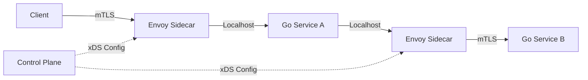

# 篇四 · 系统与分布式 · 19 高可用架构设计

> **定位**：限流、熔断、降级、超时重试、幂等、容灾与灰度发布
> **面试权重**：🔥🔥🔥🔥 高频 ｜ **前置**：4-18
> **🔁 前端类比**：前端的 Skeleton、兜底页、请求重试与超时，正是降级/熔断在用户侧的表现

## 🧭 核心考点

- 限流算法：固定/滑动窗口、令牌桶、漏桶
- 熔断三态与降级策略
- 超时、重试与重试风暴的控制
- 幂等设计：唯一键、Token、状态机
- 容量评估、容灾与灰度/蓝绿发布

## 📑 本篇题目索引（共 8 题）

| # | 题目 | 难度 | 频率 |
|---|------|------|------|
| Q1 | 什么是服务熔断（Circuit Breaker）？Go 中如何实现？ | ⭐⭐⭐ | 🔥 高频 |
| Q2 | 分布式系统中如何保证接口幂等性？ | ⭐⭐⭐ | 🔥 高频 |
| Q3 | Sidecar 模式在 Go 微服务中如何落地？Istio 与 Go 的关系？ | ⭐⭐⭐⭐ | 📌 常考 |
| Q4 | 常见限流算法有哪些？Go 如何实现单机与分布式限流？ | ⭐⭐⭐ | 🔥 高频 |
| Q5 | 什么是服务降级？降级开关如何设计？ | ⭐⭐⭐ | 🔥 高频 |
| Q6 | 超时与重试如何设计才能避免「重试风暴」？ | ⭐⭐⭐ | 📌 常考 |
| Q7 | 如何做容量评估与全链路压测？ | ⭐⭐⭐⭐ | 📌 常考 |
| Q8 | 灰度发布、蓝绿发布怎么落地？如何快速回滚？ | ⭐⭐⭐ | 📌 常考 |

---

### 19.1 服务治理
### Q1: 什么是服务熔断（Circuit Breaker）？Go 中如何实现？

**难度**：⭐⭐⭐ | **频率**：🔥 高频

**考点**：熔断器状态机、降级策略、`sony/gobreaker`。

**💡 记忆关键词**：Closed/Open/Half-Open、错误率阈值、降级逻辑

**答案要点**：
- **状态**：Closed（正常）、Open（熔断，直接拒绝）、Half-Open（试探性放行）。
- **触发条件**：错误率/慢调用比例超过阈值，或连续失败 N 次。
- **实现**：使用 `sony/gobreaker` 或自研中间件，结合 `context` 超时控制。熔断后执行降级逻辑（返回缓存、默认值或友好提示）。

### Q2: 分布式系统中如何保证接口幂等性？

**难度**：⭐⭐⭐ | **频率**：🔥 高频

**考点**：唯一请求 ID、Token 机制、数据库唯一索引。

**💡 记忆关键词**：Request-ID、唯一索引、乐观锁、Redis 去重

**答案要点**：
- **前端防重**：按钮置灰、请求去重。
- **网关层**：基于 `Request-ID` 在 Redis 记录已处理请求，重复请求直接返回上次结果。
- **业务层**：插入操作依赖数据库唯一索引；更新操作使用乐观锁（`version` 字段）或状态机校验。

### 19.2 服务网格 (Service Mesh)
### Q3: Sidecar 模式在 Go 微服务中如何落地？Istio 与 Go 的关系？

**难度**：⭐⭐⭐⭐ | **频率**：📌 常考

**考点**：流量劫持、Envoy 代理、mTLS、控制面/数据面。

**💡 记忆关键词**：流量劫持、Envoy 代理、mTLS、xDS 协议

**答案要点**：
- Go 服务无需引入 SDK，通过 Sidecar（如 Envoy）接管进出流量，实现服务发现、负载均衡、熔断限流、可观测性。
- **优势**：语言无关，Go 业务代码更轻量；**劣势**：增加网络跳数（Hop）和延迟。
- **Go 生态**：`go-control-plane` 用于编写 Istio 控制面插件；`grpc-go` 原生支持 xDS 协议。



---

---

### Q4: 常见限流算法有哪些？Go 如何实现单机与分布式限流？

**难度**：⭐⭐⭐ | **频率**：🔥 高频

**考点**：四种限流算法、单机 `rate.Limiter`、Redis + Lua 分布式限流。

**💡 记忆关键词**：固定窗口有临界问题、滑动窗口更平滑、令牌桶允许突发、漏桶恒定速率

**答案要点**：

| 算法 | 原理 | 特点 |
|------|------|------|
| 固定窗口 | 每 N 秒计数清零 | 简单，但**窗口边界会放过 2 倍流量** |
| 滑动窗口 | 统计最近 N 秒的请求 | 平滑，Redis 可用 ZSET 或分片计数近似 |
| **令牌桶** | 按速率补令牌，有桶容量 | **允许一定突发**，最常用 |
| 漏桶 | 请求入桶，恒定速率流出 | 输出绝对平滑，不允许突发 |

- **限流维度**：QPS / 并发数（信号量，见 1-03 Q5）/ 资源池 / 用户、租户、IP 维度。
- **单机**：官方 `golang.org/x/time/rate`（令牌桶）；**分布式**：Redis + Lua 脚本保证原子（或网关层统一限流：Nginx `limit_req`、Envoy、Kong）。
- **被限流后**：返回 429 + `Retry-After`，或排队/降级（见 Q5），不要静默失败。

```go
import "golang.org/x/time/rate"

var limiter = rate.NewLimiter(rate.Limit(1000), 200) // 1000 QPS，突发 200

func middleware(next http.Handler) http.Handler {
    return http.HandlerFunc(func(w http.ResponseWriter, r *http.Request) {
        if !limiter.Allow() { // 非阻塞；阻塞等待用 Wait(ctx)
            w.Header().Set("Retry-After", "1")
            http.Error(w, "too many requests", http.StatusTooManyRequests)
            return
        }
        next.ServeHTTP(w, r)
    })
}
```

**🔁 前端类比**：前端防抖节流是「客户端限流」保护自己；服务端限流是「保护系统」，且必须考虑分布式一致性。

**📝 一句话总结**：优先令牌桶（允许突发），单机用 `x/time/rate`，分布式用 Redis + Lua 原子实现。

---

### Q5: 什么是服务降级？降级开关如何设计？

**难度**：⭐⭐⭐ | **频率**：🔥 高频

**考点**：降级定义、分级策略、动态开关、自动 vs 手动。

**💡 记忆关键词**：牺牲非核心保核心、兜底数据、配置中心动态开关、自动触发（错误率/RT）、必须可回滚

**答案要点**：
- **定义**：系统压力过大或依赖故障时，**主动牺牲非核心功能**，保证核心链路可用（对比熔断：熔断是针对单个依赖的自动保护）。
- **手段**：返回兜底数据（默认值、上一次缓存、静态数据）、关闭非核心功能（推荐/评论/埋点）、读本地缓存、把同步转异步（先受理后处理）。
- **开关设计**：
  1. **分级**：P0 核心（支付/下单）不可降级，P1/P2 可降级；
  2. **可动态调整**：放配置中心（etcd/Nacos/Apollo），**不重启生效**；
  3. **自动 + 手动双通道**：自动依据错误率、P99 延迟、线程/连接池水位触发；同时保留人工开关兜底；
  4. **可观测 + 可回滚**：降级必须有指标与日志（降级次数、命中兜底），能一键恢复。
- **注意**：降级逻辑要有**超时与快速失败**，避免降级分支本身成为新故障点。

**🔁 前端类比**：Skeleton、兜底空状态、接口失败展示缓存数据 —— 这就是前端侧的降级，只是触发条件是单个请求失败，而不是整个系统。

**📝 一句话总结**：降级 = 保核心、弃边缘；开关要分级、动态、可观测、可回滚。

---

### Q6: 超时与重试如何设计才能避免「重试风暴」？

**难度**：⭐⭐⭐ | **频率**：📌 常考

**考点**：超时预算、重试条件、指数退避 + 抖动、放大效应。

**💡 记忆关键词**：超时逐层递减、只重试幂等可恢复错误、指数退避 + jitter、重试预算、上游统一重试

**答案要点**：
- **超时**：
  - 每个外部调用**必须设超时**（HTTP client、DB、Redis、RPC 都要），默认无超时是事故源头；
  - **超时预算逐层递减**：入口 1s → 上游 800ms → 下游 500ms，避免「下游还在跑，上游已放弃」的白白浪费；
  - 用 `context.WithTimeout` 贯穿调用链，让取消向下传播。
- **重试**：
  - **只重试幂等且可恢复的错误**：网络超时、连接失败、5xx、限流（可退避重试）；**不要重试**参数错误、业务失败、非幂等写操作（或必须先做幂等）；
  - **指数退避 + 抖动（jitter）**：避免所有客户端同时重试造成脉冲；
  - 限制**重试次数**与**总时长**（重试时间不超过上游超时预算）。
- **防重试风暴**：
  - 各层都重试会**指数级放大**（3 层各重试 3 次 = 27 倍流量）→ 通常只在**最靠近用户的入口层**重试；
  - 配合**限流 + 熔断**：依赖已熔断时不要再重试；
  - 引入**重试预算**（Google SRE 的 retry budget）：重试请求数不超过总请求的 10%。

```go
func retryDo(ctx context.Context, maxAttempts int, fn func(context.Context) error) error {
    var err error
    for i := 0; i < maxAttempts; i++ {
        if err = fn(ctx); err == nil {
            return nil
        }
        if !isRetryable(err) { // 业务错误直接返回，不重试
            return err
        }
        backoff := time.Duration(1<<i) * 100 * time.Millisecond
        jitter := time.Duration(rand.Int63n(int64(backoff / 2))) // 抖动
        select {
        case <-ctx.Done(): // 尊重上游超时预算
            return ctx.Err()
        case <-time.After(backoff + jitter):
        }
    }
    return fmt.Errorf("after %d attempts: %w", maxAttempts, err)
}
```

**📝 一句话总结**：超时逐层递减、只重试幂等错误、指数退避加抖动、只在入口层重试并有预算上限。

---

### Q7: 如何做容量评估与全链路压测？

**难度**：⭐⭐⭐⭐ | **频率**：📌 常考

**考点**：单机容量、实例数计算、压测方法、常用量级数字。

**💡 记忆关键词**：单机 QPS 实测、水位 50~70%、峰值系数 3~5、影子库压测、限流兜底

**答案要点**：
- **第一步：测单机容量**。用压测工具（wrk/hey/`vegeta`/自研）测出**单实例在目标 P99 延迟下的 QPS**，同时记录 CPU、内存、GC、连接数水位。生产一般控制在 **50%~70% 水位**（留突发余量）。
- **第二步：算实例数**：
  ```
  峰值 QPS = DAU × 人均日请求数 ÷ 86400 × 峰值系数(3~5)
  所需实例 = 峰值 QPS ÷ 单机 QPS × 冗余系数(1.5~2)  ÷ 目标水位
  存储容量 = 日增数据量 × 保留天数 × 副本数 × 1.2(索引/冗余)
  ```
- **常用量级（面试可背，需说明依赖场景）**：Go 单机简单接口约 **1~5 万 QPS**；Redis 单实例约 **10 万 QPS**；MySQL 单实例简单查询约 **几千 QPS**；Kafka 单分区约 **几 MB/s**；一条 100 字节记录 1 亿条约 **10GB**。
- **全链路压测**：
  - **影子库/影子表 + 流量标记**：压测流量打标（Header/染色），写入影子存储，避免污染生产数据；
  - **数据隔离**：压测账号、压测商品、独立缓存前缀；
  - **下游保护**：压测时对第三方与不可压测的下游做 mock 或限流；
  - **观察指标**：P99/P999、错误率、GC、连接池、DB 慢查询，找到**瓶颈点**（往往是 DB 或锁，而不是应用层）。
- **上线前**：明确限流阈值与熔断阈值，准备好扩容与降级预案。

**📝 一句话总结**：先实测单机容量，再按峰值公式算实例数并留水位与冗余；压测必须做数据隔离与下游保护。

---

### Q8: 灰度发布、蓝绿发布怎么落地？如何快速回滚？

**难度**：⭐⭐⭐ | **频率**：📌 常考

**考点**：三种发布策略、流量切分、数据库兼容、回滚方案。

**💡 记忆关键词**：蓝绿切流量、金丝雀按比例/标签、滚动更新探针、回滚靠镜像 + DB 兼容 + feature flag

**答案要点**：

| 策略 | 做法 | 优点 | 代价 |
|------|------|------|------|
| **滚动更新** | 逐个替换实例，`maxSurge`/`maxUnavailable` 控制节奏 | 资源省、K8s 默认 | 新旧版本并存，需接口兼容 |
| **蓝绿** | 两套环境（蓝=旧、绿=新），切流量入口 | 回滚秒级、验证充分 | 资源翻倍 |
| **金丝雀/灰度** | 按比例或用户标签/Header 逐步放量（1% → 10% → 100%） | 风险最小 | 需要流量路由能力 |

- **流量切分实现**：Nginx `weight`、Istio `VirtualService` 权重/Header 路由、K8s 多 Deployment + 统一 Service、网关按用户 ID 取模。
- **数据库必须先兼容**（最常见的翻车点）：**先加字段不删字段、新旧代码都能读写**；需要改语义时用「双写 → 迁移 → 双读校验 → 下线旧字段」四步，禁止「代码与 DDL 同版本一起上」。
- **快速回滚**：
  1. **镜像/版本回退**（保留上一版本镜像与 Deployment 历史，`kubectl rollout undo`）；
  2. **feature flag** 秒级关停新逻辑，无需回滚代码；
  3. **数据回滚**最难 —— 所以上线前就要保证变更**可向前兼容**，避免不可逆的数据迁移。
- **配套**：灰度期间对比新旧版本的错误率与延迟指标，异常自动停止放量。

```yaml
# Istio 金丝雀：先给 v2 放 5% 流量
apiVersion: networking.istio.io/v1
kind: VirtualService
spec:
  http:
    - route:
        - destination: { host: svc, subset: v1 }
          weight: 95
        - destination: { host: svc, subset: v2 }
          weight: 5
```

**📝 一句话总结**：滚动保常态、蓝绿保回滚、灰度保风险可控；核心是**DB 向前兼容 + 秒级回滚开关**。

---

## ✅ 自测清单（答不出就回去看对应题）

- [ ] 能脱离资料讲清本篇「核心考点」中的每一条
- [ ] 能手写/口述至少 2 道 🔥 高频题的最小实现
- [ ] 能结合自己的项目讲出 1 个坑或 1 次调优

