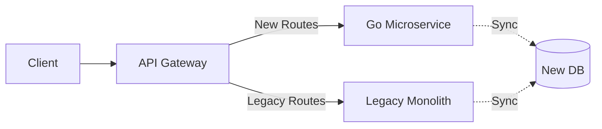

# 篇六 · 面试实战 · 28 跨语言对比与技术选型

> **定位**：Go vs Java / Node.js / Rust / Python：性能、生态、团队与迁移路径
> **面试权重**：🔥🔥🔥 常考 ｜ **前置**：全篇
> **🔁 前端类比**：像「React vs Vue」一样谈选型：场景、团队、生态、成本，而不是单纯比性能

## 🧭 核心考点

- 语言特性与运行时模型对比
- 生态与工程效率对比（依赖、工具链、人才）
- Node.js → Go 的迁移策略与绞杀者模式
- 什么时候不该用 Go
- 选型结论的表达方式（面试加分）

## 📑 本篇题目索引（共 7 题）

| # | 题目 | 难度 | 频率 |
|---|------|------|------|
| Q1 | Go 与 Java (Spring Boot) 在微服务架构中的对比？ | ⭐⭐ | 📌 常考 |
| Q2 | Go 与 Node.js 在高并发场景下的优劣？ | ⭐⭐ | 📌 常考 |
| Q3 | 如何将单体应用平滑迁移到 Go 微服务架构？ | ⭐⭐⭐ | 📌 常考 |
| Q4 | Go 与 Rust / Python 的对比与选型边界？ | ⭐⭐⭐ | 📌 常考 |
| Q5 | 什么场景下「不该用 Go」？ | ⭐⭐⭐ | 🔥 高频 |
| Q6 | Node.js 项目迁移到 Go 的完整路径与风险？ | ⭐⭐⭐⭐ | 🔥 高频 |
| Q7 | 面试中如何表达技术选型结论？（可套用模板） | ⭐⭐⭐ | 🔥 高频 |

---

### 28.1 Go vs 其他语言
### Q1: Go 与 Java (Spring Boot) 在微服务架构中的对比？

**难度**：⭐⭐ | **频率**：📌 常考

**考点**：启动速度、内存占用、生态成熟度、开发效率。

**💡 记忆关键词**：Go快轻简、Java生态熟、云原生选Go、企业级选Java

**答案要点**：
- **Go**：启动快（毫秒级）、内存低（MB 级）、部署简单（单二进制）、适合云原生/高并发/边缘计算；生态较年轻，泛型刚普及。
- **Java**：启动慢（秒级）、内存高（百 MB 级）、生态极其成熟（Spring 全家桶）、适合复杂企业级业务/大数据处理；GraalVM 正在改善启动性能。
- **选型**：追求极致性能/资源利用率选 Go；依赖丰富中间件/团队 Java 背景选 Java。

**📝 一句话总结**：Go快轻简云原生，Java生态企业级；性能资源Go优先，中间件团队Java选。

### Q2: Go 与 Node.js 在高并发场景下的优劣？

**难度**：⭐⭐ | **频率**：📌 常考

**考点**：多线程 vs 单线程、CPU 密集型、类型安全。

**💡 记忆关键词**：Go多核CPU、Node单线程IO、静态类型、BFF场景

**答案要点**：
- **Go**：多核并行（GMP），擅长 CPU 密集型任务；静态类型，重构安全；协程切换成本低。
- **Node.js**：单线程事件循环，擅长 I/O 密集型任务；动态类型，大型项目维护成本高；生态与前端无缝衔接。
- **结论**：计算密集型/高并发后端首选 Go；BFF/全栈快速开发首选 Node.js。

**📝 一句话总结**：Go多核擅计算，Node单线程IO强；静态类型重构安，BFF全栈Node选。

### 28.2 架构演进与迁移
### Q3: 如何将单体应用平滑迁移到 Go 微服务架构？

**难度**：⭐⭐⭐ | **频率**：📌 常考

**考点**：绞杀者模式（Strangler Fig）、双写迁移、流量切换。

**💡 记忆关键词**：绞杀者模式、双写迁移、灰度发布、回滚策略

**答案要点**：
- **绞杀者模式**：在旧系统前加代理，逐步将新功能或模块用 Go 重写，路由到新服务。
- **数据迁移**：双写新旧数据库，校验一致性后切换读流量。
- **流量切换**：使用网关按百分比灰度发布，监控错误率与延迟。
- **回滚策略**：保留旧系统直到新系统稳定，随时可切回。

**📝 一句话总结**：绞杀者模式渐进迁，双写校验切流量；灰度发布监控准，回滚策略保平安。

---

---

### Q4: Go 与 Rust / Python 的对比与选型边界？

**难度**：⭐⭐⭐ | **频率**：📌 常考

**考点**：内存模型、性能、开发效率、生态成熟度。

**💡 记忆关键词**：Rust 无 GC 极强安全但陡峭、Python 生态强（AI/数据）但性能弱、Go 折中（工程效率 + 并发）

**答案要点**：

| 维度 | Go | Rust | Python |
|------|-----|------|--------|
| 内存管理 | GC（低延迟） | 所有权/借用检查，**无 GC** | 引用计数 + GC |
| 性能 | 接近 C，启动快 | 极致（无 GC 停顿） | 慢 10~100 倍（重计算） |
| 学习曲线 | 平缓（25 个关键字） | **陡峭**（生命周期、trait 泛型） | 很低 |
| 并发 | goroutine + channel（简单） | async/tokio + Send/Sync（强约束） | GIL 限制多线程 CPU 并行 |
| 生态 | 云原生/中间件/CLI 极强 | 系统编程、Wasm、区块链、嵌入式 | **AI/数据/科学计算最强**、Web 也强 |
| 编译/部署 | 秒级编译、单二进制 | 编译慢（大项目分钟级） | 解释执行、依赖环境复杂 |

- **选型边界（面试可直接说）**：
  - **选 Go**：高并发网络服务、API 网关、微服务、DevOps/CLI 工具、云原生组件（K8s 生态原生语言）；
  - **选 Rust**：极致性能与内存安全要求（数据库引擎、代理、Wasm 运行时）、无 GC 的确定性延迟、嵌入式；
  - **选 Python**：AI/ML 训练与推理脚本科层、数据分析、快速原型 —— 生产高并发服务通常用 Go/Java 包一层，Python 只做模型服务。
- **组合拳**：`Python 训练模型 → 导成 ONNX/Triton 服务 → Go 做业务网关与流式代理`（正是本仓库 AI Demo 的形态）。
- **共同点与差异**：Go 与 Rust 都是编译型、静态类型、单二进制部署；差别在**「GC + 简单并发」换取工程效率** vs **「无 GC + 严格所有权」换取性能与安全**。

**📝 一句话总结**：Go 用 GC 和极简并发换工程效率，Rust 用所有权换极致性能与安全，Python 用解释执行换 AI/数据生态 —— 各自守住自己的场景。

---

### Q5: 什么场景下「不该用 Go」？

**难度**：⭐⭐⭐ | **频率**：🔥 高频

**考点**：语言短板、团队现状、场景错配。

**💡 记忆关键词**：CPU 密集计算、复杂 GUI/桌面、AI 训练、重泛型抽象、团队无 Go 经验

**答案要点**（**能说出「什么时候不用」，比只会吹更强**）：
1. **CPU 密集型科学计算 / 数值计算**：缺少成熟的向量化、矩阵与自动微分生态（Python/Julia/C++/Rust 更强）；
2. **AI/ML 训练**：训练框架生态在 Python；Go 适合做**推理服务与网关**（可用 ONNX Runtime、Triton 的客户端）；
3. **复杂泛型抽象与领域 DSL**：Go 泛型表达力弱于 Scala/Kotlin/Rust，类型级编程几乎不可行；
4. **桌面 GUI / 移动端**：生态不成熟（前端/原生是正解）；
5. **团队与业务约束**：团队全是 Java/Python 且无 Go 经验、招聘困难、已有成熟技术栈能解决问题 —— **技术选型要考虑团队与成本，而不是「哪个语言更快」**；
6. **极短生命周期的脚本/一次性数据处理**：Python/Shell 更快出结果（Go 需要编译、类型声明，前期成本更高）；
7. **需要成熟 ORM/企业级中间件生态的复杂业务系统**：Java（Spring）在复杂企业业务、事务编排、生态组件上仍有优势。
- **表达技巧**：「Go 的短板主要是**生态深度**（AI、GUI）和**抽象表达力**，但它的长板（并发 + 部署 + 工具链）恰好覆盖后端服务 90% 的诉求。」

**📝 一句话总结**：CPU 密集计算、AI 训练、复杂 GUI、重泛型抽象、团队无经验时慎用 Go；选型是成本问题，不只是性能问题。

---

### Q6: Node.js 项目迁移到 Go 的完整路径与风险？

**难度**：⭐⭐⭐⭐ | **频率**：🔥 高频

**考点**：绞杀者模式、接口契约、双跑校验、团队切换成本。

**💡 记忆关键词**：绞杀者（Strangler Fig）、按领域切分、灰度双跑、契约测试、回滚

**答案要点**（**对前端转 Go 的候选人最容易被问到**）：
- **路径（推荐「绞杀者模式」逐块替换，而非重写）**：
  1. **选第一个模块**：挑**边界清晰、并发/性能痛点明确、依赖少**的模块（如文件上传、报表导出、WebSocket 网关），**不要从最核心的下单链路开刀**；
  2. **接口先行**：保持 URL/请求响应结构与 Node 版本**完全一致**（或在网关做适配），前端零改动 —— 这点对前端转 Go 的候选人来说是天然优势；
  3. **分流灰度**：网关按用户/比例把流量切到 Go 版本，观察错误率与延迟；
  4. **双跑校验**（关键风险控制）：同一请求同时打给新旧实现，比对响应（忽略时间戳等易变字段），差异率可接受后再切全量；
  5. **逐个模块推进**，网关反向代理旧服务直到其**自然「饿死」**，最后下线；
- **主要风险与对策**：

| 风险 | 对策 |
|------|------|
| 行为不一致（浮点、时间格式、JSON 字段顺序/`null` 差异） | **契约测试** + 双跑 diff；显式统一时间格式（RFC3339）与 `omitempty` 行为 |
| 生态能力缺失（Node 有的库 Go 没有） | 提前做技术验证/spike；必要时自研小库 |
| 团队不熟 Go（并发、错误处理思维转换） | 先做**旁路的小服务**练手；建立 code review 与规范（见 5-25） |
| 数据层双写不一致 | 迁移期明确**单一数据源**，避免两个服务同时写同表；必要时先只读切换 |
| 排障能力下降 | 提前补齐可观测性（日志 + 指标 + 链路，见 5-21） |
| 回滚困难 | 保留旧实现可随时切回（网关开关），不删旧代码直到稳定期结束 |
- **成本收益对齐**：迁移要能说清收益（P99 延迟、单机承载、内存占用、CPU 成本、并发能力），用**压测数据**说话（见 5-20），而不是「Go 更快」。

**🔁 前端类比**：这就是前端的**渐进式重构/微前端迁移**（老页面逐步被新应用接管，而不是一次性重写）—— 思路完全一致：契约不变、灰度切换、双跑校验、随时回滚。

**📝 一句话总结**：绞杀者模式按模块替换，接口契约保持不变，双跑校验 + 灰度切流 + 保留回滚开关，用压测数据说明收益。

---

### Q7: 面试中如何表达技术选型结论？（可套用模板）

**难度**：⭐⭐⭐ | **频率**：🔥 高频

**考点**：结构化表达、量化依据、诚实边界。

**💡 记忆关键词**：场景 → 约束 → 候选 → 权衡 → 决策 → 验证与演进

**答案要点**：
- **六步模板**：
  1. **场景**：业务特征（并发量、延迟要求、数据一致性要求、团队规模）；
  2. **约束**：团队技能、招聘难度、上线时间、现有基础设施；
  3. **候选**：列出 2~3 个候选方案（不要说「只有 Go 能用」）；
  4. **权衡**：逐项对比（性能、生态、人力成本、可维护性），**给出量化依据**；
  5. **决策**：明确选择 + **一句最核心的理由**；
  6. **验证与演进**：如何验证（压测/POC）、什么条件下会重新评估。
- **示例回答（Go vs Java 做 API 网关）**：
  > 场景是单机需要支撑 5 万并发长连接、P99 < 50ms，团队有 3 名前端的同学要转后端。候选是 Java（Spring Cloud Gateway）与 Go。
  > Java 生态与治理组件更成熟，但单连接内存开销大（线程/堆），同样连接数需要更多机器；Go 的 goroutine 让单机承载更高，且**单二进制部署**、工具链简单，新同学上手成本低。
  > 我们做了 POC：同样 2C4G，Go 版本单机 3 万连接时 P99 是 38ms，Java 版本需要 3 倍机器。
  > 因此选 Go；如果后续需要复杂的企业级治理（如成熟的多租户审计、规则引擎），我们会重新评估 Java 侧组件。
  > 验证方式是先在非核心网关灰度，观察连接数与内存曲线。
- **加分点**：
  - 主动说**「不选 X 的理由」**与**「什么情况下会改」**（体现不是拍脑袋）；
  - 承认**未知**：「这部分我没在生产验证过，我的判断依据是文档与压测数据」；
  - 避免两类失误：只说性能不说成本（幼稚），或只讲团队习惯不讲数据（不专业）。

**📝 一句话总结**：场景 → 约束 → 候选 → 权衡（带数据）→ 决策 → 验证与演进；主动说不选谁、什么条件下会改。

---

## ✅ 自测清单（答不出就回去看对应题）

- [ ] 能脱离资料讲清本篇「核心考点」中的每一条
- [ ] 能手写/口述至少 2 道 🔥 高频题的最小实现
- [ ] 能结合自己的项目讲出 1 个坑或 1 次调优

