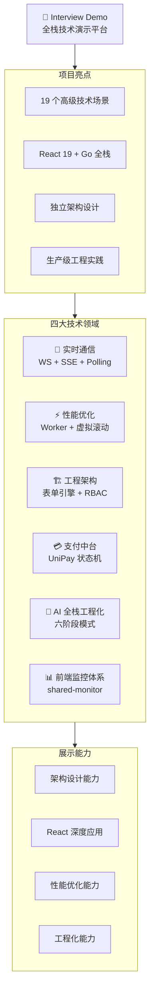
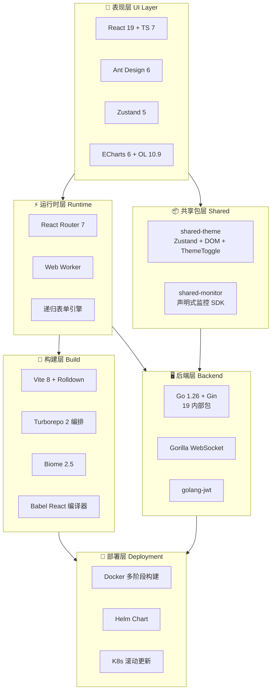
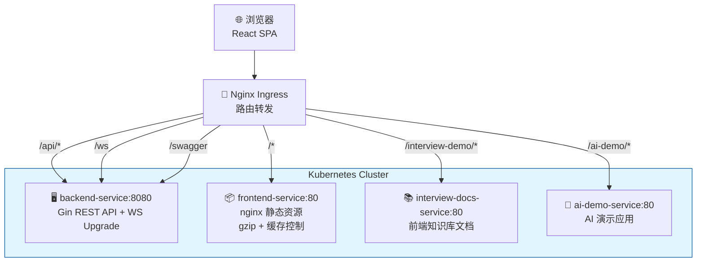
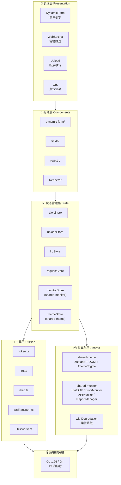
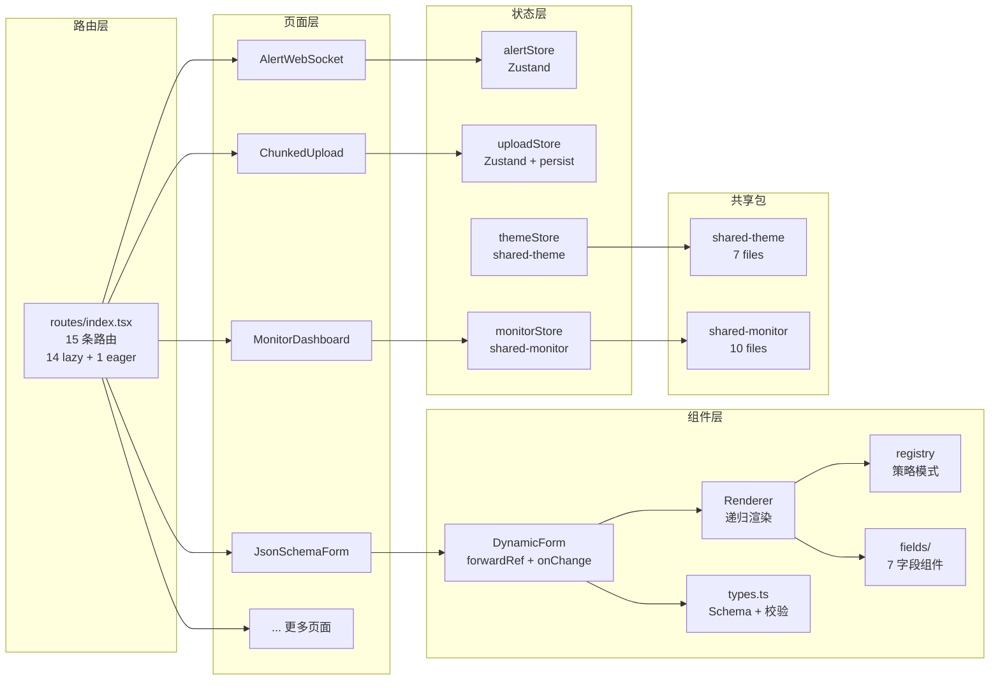

# Interview Demo — 全栈技术演示平台 · 项目技术分析报告

---



---

## 📑 目录导航

| # | 章节 | 内容 |
|---|------|------|
| **一** | [项目概述](#项目概述) | 背景 / 定位 / 技术栈 / 模块全景 / 部署 / CI/CD |
| **二** | [技术难点深度剖析](#二技术难点深度剖析) | 16 个技术点详解（表单引擎 / 断点续传 / WebSocket / Worker / GIS / 请求加载 / 日志解密 / 支付中台 / AI 后端六阶段 / 前端监控 SDK / 共享主题包） |
| **三** | [设计模式与架构亮点](#三设计模式与架构亮点) | 9 种设计模式 / 状态管理 / 错误处理 / 数据流 / 统一 HTTP 请求层 |
| **四** | [React 19 实战](#四react-19-新特性实战应用) | forwardRef / 编译器 / 闭包陷阱修复 |
| **五** | [性能优化策略](#五性能优化策略) | 渲染 / 计算 / 网络 / 构建 四级优化 |
| **六** | [工程化体系](#六工程化体系) | 三层约束 / Biome+TS / CI/CD / 构建优化 |
| **七** | [组件设计亮点](#七组件设计亮点) | 表单引擎组件 / Zustand Store / Web Worker |
| **八** | [面试高频问题](#八面试高频问题深度版) | 8 个深度 Q&A（闭包 / 表单 / WS vs SSE / Zustand...） |
| **九** | [面试追问模拟](#附面试追问模拟) | 5 个面试场景模拟 |
| **十** | [共享包](#十共享包) | shared-theme / shared-monitor |
| **十一** | [面试自我介绍](#十一面试自我介绍) | 1 分钟 / 3 分钟 两个版本 |

> 💡 **使用建议**: 面试前重点看「八、面试高频问题」和「附、面试追问模拟」；技术细节参考「二、技术难点深度剖析」

## 项目概述

### 一、项目背景

在 React 19 + TypeScript 7 的技术浪潮下，前端工程化与性能优化已成为中高级前端工程师的核心竞争力。本项目旨在构建一个**覆盖 17 个演示页面（含 14 个前端技术场景 + 2 个监控系统 + 1 个 AI 全栈演示平台 8 选项卡）的全栈演示平台**，系统性地展示实时通信、性能优化、工程架构、AI 智能、支付中台、前端监控六大领域的关键技术方案。

### 二、核心定位

| 属性 | 说明 |
|------|------|
| **项目名称** | Interview Demo — 全栈技术演示平台 |
| **项目类型** | 前端工程化与性能优化综合演示 |
| **开发周期/人数** | 独立开发，持续迭代 |
| **当前状态** | 本地开发运行，Docker/Helm 可部署 |
| **一句话定位** | 覆盖 19 个高级技术场景的 React 19 + Go 1.26 全栈演示平台，包含 frontend / ai-demo / interview-docs 三个前端应用，聚焦前端工程化、性能优化与架构设计 |
| **部署环境** | Docker 多阶段构建 → Kubernetes Helm (滚动更新) |
| **构建编排** | Bun workspaces + Turborepo 2 (缓存加速 + 并行编排) |
| **CI/CD** | GitHub Actions + GitLab CI, Turbo 缓存复用 |
| **访问方式** | 浏览器访问，React Router 路由模式 |

### 三、技术栈全景



### 四、核心功能模块全景

```mermaid
mindmap
  root((全栈演示平台<br/>17 个演示页面))
    ::icon(fa fa-globe)
    实时通信
      WebSocket 告警推送
        多协议降级链
        二进制协议
        背压控制
        心跳保活
        RAF 节流去重
      SSE 日志流
        ReadableStream
        AbortController
      🔑 双 Token 无感刷新
        Promise gate
        Token Rotation
        Replay 检测
    性能优化
      🚀 LRU 路由缓存
        display:none 保持状态
        写后失效一致性
      🧮 Web Worker 分治合并
        Worker Pool
        自适应分区
      🗺️ GIS 十万级点位渲染
        Cluster + BBOX
        dataCache 惰性刷新
      📝 十万行日志流解密
        生产/消费模式
        虚拟滚动
    工程架构
      📋 动态表单引擎
        递归渲染
        7 种字段类型
        实时 JSON 编辑
      🔐 RBAC 位编码权限
        位运算 O(1) 检查
        三层联动
      请求加载 Signal + use()
        Suspense + ErrorBoundary
      🌳 树形数据操作引擎
        递归 CRUD
        拖拽排序
      📦 大文件断点续传
        SHA-256 校验
        暂停/恢复/续传
     AI 后端模式
       🤖 LLM 流式对话
         SSE 流式
       📚 混合 RAG 知识库
         BM25 + Vector
       🧠 智能体 Agent
         ReAct 流式
         Function Calling
         Multi-Agent
         MCP 工具协议
       🎮 Playground 调试台
         PromptGuard
         ResponseCache
         Token 估算
       🛡️ 中间件层
         PromptGuard 中间件
         ResponseCache 中间件
       📊 遥测与监控
         Token/Latency 统计
    支付中台
       💳 UniPay 统一支付
         支付状态机
         幂等性防护
         指数退避重试
         T+1 对账
    前端监控
       📊 声明式埋点 SDK
         data-stat 属性
       🚨 异常监控
         onerror + unhandledrejection
       📡 API 监控
         Axios 拦截器
       ⚡ 性能采集
         Navigation Timing
       🛡️ 柔性降级
         withDegradation
```

### 五、项目规模

| 维度 | 数量 | 说明 |
|------|------|------|
| **前端应用** | 3 个 | frontend + ai-demo + interview-docs |
| **演示页面** | 16 个 | frontend 15 路由页 (含 Dashboard 首页 + MonitorDashboard) + 1 登录页 |
| **AI 演示页面** | 8 个 | ai-demo 8 选项卡 |
| **路由配置** | 15 条 | 14 条懒加载路由 + 1 条 Eager 加载登录页 |
| **后端 API (Go)** | 80+ | 19 个 internal 包 |
| **Go 内部包** | 19 个 | agent/alert/auth/chat/encryptedlog/gis/health/knowledge/lrucache/memory/middleware/model/payment/rbac/requestload/schema/sse/upload/vitals |
| **Go 源文件** | 37 个 | 非测试源文件 |
| **Go 测试文件** | 29 个 | `go test ./internal/... -v` 全量通过 |
| **前端状态存储** | 7 个 | Zustand 状态管理 (alert/auth/lru/monitor/request/theme/upload) |
| **共享包** | 2 个 | `shared-theme` (7 文件), `shared-monitor` (10 文件) |
| **工具函数** | 30+ 个 | Token/LRU/RBAC/WS 传输层/VitalsReporter/VitalsSnapshot/RequestResource + 共享监控 SDK + 3 Workers + AI Demo 工具链 |
| **Web Worker** | 3 个 | 归并排序 + AES-GCM 解密 + SHA-256 文件哈希 |
| **共享监控模块** | 10 文件 | 类型定义/ReportManager/StatSDK/ErrorMonitor/APIMonitor/PerformanceMonitor/BundleMonitor + store + barrel + degradation |
| **共享主题包** | 7 文件 | 类型定义/store/hook/dom/transition/ThemeToggle/barrel |
| **第三方依赖** | 20+ | React 生态核心库 + Ant Design X + Go |

### 六、核心数据结构

#### 动态表单 Schema

```typescript
interface FormSchema {
  type: "tabs" | "card" | "form" | "leaf"
  key: string
  title?: string
  description?: string
  children?: FormSchema[]
  properties?: Record<string, LeafSchema>
  tabs?: TabSchema[]
}

interface LeafSchema {
  type: FieldType  // "string" | "number" | "select" | "switch" | "datetime" | "json" | "array"
  key: string
  title: string
  required?: boolean
  default?: unknown
  visible?: string           // 条件显隐表达式: "enableEncryption === true"
  validation?: Function     // 同步校验
  asyncValidation?: Function // 异步校验
  autoFill?: Function       // 字段联动自动填充
  dependencies?: string[]
  ajvSchema?: Record<string, unknown>
}
```

#### LRU 路由缓存

```typescript
class LRUCache<K, V> {
  private capacity: number
  private cache: Map<K, V>     // Map 保持插入顺序
  private accessCount: Map<K, number>  // 访问计数

  get(key: K): V | undefined    // 读取 + 计数 + 提升
  put(key: K, value: V): void   // 写入 + 淘汰
  has(key: K): boolean
  getAll(): Map<K, V>           // 获取全部缓存
}
```

#### RBAC 权限编码

```typescript
const Permissions = {
  READ:   1 << 0,  // 1
  WRITE:  1 << 1,  // 2
  DELETE: 1 << 2,  // 4
  EXPORT: 1 << 3,  // 8
  IMPORT: 1 << 4,  // 16
  ADMIN:  1 << 5,  // 32
} as const

const Roles = {
  GUEST:     Permissions.READ,
  EDITOR:    Permissions.READ | Permissions.WRITE,
  MODERATOR: Permissions.READ | Permissions.WRITE | Permissions.DELETE,
  ADMIN:     Permissions.READ | Permissions.WRITE | Permissions.DELETE | Permissions.ADMIN,
  SUPER:     Object.values(Permissions).reduce((a, b) => a | b, 0),
} as const
```

### 七、技术亮点速览

| 亮点 | 技术价值 | 难度 |
|------|----------|------|
| **递归动态表单引擎** | 自定义递归渲染 + 7 种字段 + 条件显隐 + 双校验 + 实时 JSON 编辑 | ⭐⭐⭐ |
| **大文件断点续传** | SHA-256 分片 + Zustand 持久化 + 暂停/恢复 + 刷新恢复 + 代际锁 | ⭐⭐⭐ |
| **WebSocket 告警推送** | 多协议降级链 + 二进制协议 + 背压控制 + 消息合并 + 心跳保活 + RAF 节流 | ⭐⭐⭐ |
| **Web Worker 分治排序** | Worker Pool + 自适应分区 + 有序归并 | ⭐⭐⭐ |
| **GIS 十万级点位渲染** | Cluster + BBOX + dataCache + 惰性刷新 (60fps) | ⭐⭐ |
| **双 Token 无感刷新** | Promise gate + Token Rotation + Replay 检测 + 单设备登录 | ⭐⭐ |
| **RBAC 位编码权限** | 位运算权限编码 + 三层联动 + 后端 API 双校验 | ⭐⭐⭐ |
| **SSE 日志流** | ReadableStream + AbortController + RAF 节流 | ⭐⭐ |
| **请求加载 Signal + use()** | React 19 use() + Suspense + ErrorBoundary + AbortController | ⭐⭐⭐ |
| **树形数据操作引擎** | 递归 CRUD + 拖拽排序 + 节点校验 | ⭐⭐ |
| **LRU 路由缓存** | DOM display:none 保持状态 + LRU 淘汰 + staleKeys 写后失效 | ⭐⭐ |
| **十万行日志流解密** | 生产/消费模式 + AES-256-GCM 解密 + RSA 密钥交换 + 虚拟滚动 | ⭐⭐ |
| **Web Vitals 性能采集** | RUM 实时采集 LCP/INP/CLS + 页面级渲染追踪 + ECharts 可视化 | ⭐⭐ |
| **LLM 流式对话** | SSE 流式 `[DONE]` 标记 + DeepSeek 解析 + 上下文窗口管理 | ⭐⭐ |
| **混合 RAG 知识库** | BM25 + Vector 混合检索 + 多格式文档解析 + 智能分块策略 | ⭐⭐⭐ |
| **智能体 Agent 流式** | ReAct 循环 SSE 流式输出 + Function Calling + Multi-Agent + MCP | ⭐⭐⭐ |
| **Playground 调试台** | PromptGuard + ResponseCache + Token 估算 + 遥测上报 | ⭐⭐⭐ |
| **PromptGuard 中间件** | 提示注入检测（正则 + 关键词 + 模式匹配）+ HTTP 中间件封装 | ⭐⭐ |
| **ResponseCache 中间件** | LRU 缓存 + TTL 过期 + Content-Type 智能缓存 | ⭐⭐ |
| **AI 遥测系统** | Token 用量 / Latency / Cache 命中率 / 错误率上报 + ECharts | ⭐⭐ |
| **前端监控与埋点系统** | shared-monitor 共享包：声明式 data-stat 埋点 + 优先级上报队列 + 异常全捕获 + 性能采集 + 多级去重 + 柔性降级 | ⭐⭐⭐ |
| **共享主题包 (shared-theme)** | 跨应用 dark/light 主题切换统一管理：Zustand + DOM 策略 + Transition 动画 + ThemeToggle 组件 | ⭐⭐ |

### 八、部署架构



### 九、面试价值总结

本项目具有以下面试讲述价值：

1. **架构设计能力**：递归表单引擎、分层架构设计、状态管理策略
2. **算法设计能力**：LRU 缓存淘汰、RBAC 位运算（前后端双校验）、分治合并排序
3. **React 深度应用**：React 19 编译器、forwardRef + useImperativeHandle、闭包陷阱修复
4. **实时通信能力**：多协议传输层 (WebSocket→SSE→Polling)、背压控制、消息合并、心跳/重连
5. **性能优化能力**：Web Worker 多线程、GIS 四重优化、虚拟滚动、RAF 节流
6. **工程化能力**：TypeScript strict、Zustand 持久化、CI/CD、Docker/Helm 部署

## 一、项目架构全景

### 1.1 分层架构设计



### 1.2 核心模块依赖关系



---

## 二、技术难点深度剖析

### 2.1 递归动态表单引擎 ⭐⭐⭐

**位置**: `src/components/dynamic-form/` (4 核心文件 + 7 字段组件)

#### 实现思路

**为什么要自研而非 @rjsf？** 项目中需要的高度定制—条件显隐表达式、字段联动自动填充、实时 JSON 编辑双向绑定—超出了通用库 @rjsf 的灵活度。自研带来完全可控的递归渲染流程和零外部依赖。

**核心架构决策**：将表单 Schema 抽象为 AST 树（`tabs → card → form → leaf` 四层），用递归渲染器逐层解析，每层对应一种 Ant Design 容器组件。

#### 实现过程

**第零步：Schema/InitialData 后端化**

Schema 和初始数据从 `GET /api/schema/config` 获取，使用 `fetchedRef`（`useRef(false)`）做 StrictMode 幂等保护。

**第一步：定义 Schema 类型系统**

```typescript
interface FormSchema {
  type: "tabs" | "card" | "form" | "leaf"
  key: string
  title?: string
  children?: FormSchema[]
  properties?: Record<string, LeafSchema>
  tabs?: TabSchema[]
}
```

**第二步：构建策略模式注册表**

`Map<FieldType, Component>` → `registerField(type, Comp)` / `getField(type)` — 新增字段类型只需一行注册。

**第三步：实现递归渲染器**

Renderer 按 Schema.type 分派到不同渲染分支：

| Schema.type | 渲染目标 | 递归策略 |
|-------------|----------|----------|
| `tabs` | `<Tabs>` | 每个 Tab 的 children 递归 |
| `card` | `<Card>` | children 递归 |
| `form` | `<div>` 容器 | properties 每项递归 |
| `leaf` | 查询 registry | 递归终止 |

深度保护：`_depth` 参数 + `maxDepth=20`；`_visitedRefs` Set 检测循环引用。

**第四步：条件显隐**

字符串表达式 `"enableEncryption === true"` 在运行时求值：提取变量名 keys + 对应值 → `new Function(...keys, 'return ${prepared}')(...values)`。

**第五步：实时 JSON 编辑双向绑定**

```
表单编辑 → handleChange → setData → useEffect → onChange → JSON 面板刷新
JSON 编辑 → handleApplyJson → JSON.parse → formRef.setFormData → 表单刷新
```

**第六步：四重校验体系**

| 校验层级 | 触发时机 |
|----------|----------|
| 同步校验 `validation()` | 每次 onChange |
| 异步校验 `asyncValidation()` | onChange 防抖 300ms |
| AJV Schema 校验 | useEffect 监听 data |
| 后端业务校验 | Submit 提交 |

#### 优化

| 问题 | 优化手段 |
|------|----------|
| 递归深度无上限 | `_depth` 参数 + `maxDepth=20` |
| 循环引用 | `_visitedRefs` WeakSet 检测 |
| 条件显隐频繁重算 | useMemo key=data |
| 异步校验抖动 | 300ms debounce + AbortController |

---

### 2.2 大文件断点续传 ⭐⭐⭐

**位置**: `src/pages/ChunkedUpload.tsx` + `src/stores/uploadStore.ts` + `backend/handlers/upload.go`

#### 实现思路

**选型决策**：SHA-256 分片级校验、Zustand persist 持久化、滑动窗口并发（默认 4）。

**核心流程**：文件选择→哈希计算→初始化会话→并发上传（滑动窗口）→暂定/恢复(Promise Park)→合并+完整性验证→刷新恢复。

**代际锁（Generation Lock）**：`uploadingRef` 守卫 + `uploadGenRef` 代际计数器，防止连续点击停止→续传→停止导致的并发竞态。

#### 优化

| 维度 | 优化手段 |
|------|----------|
| 计算 | Web Worker 计算 SHA-256 |
| 网络 | 滑动窗口并发（默认 4，可调 1-10） |
| 网络 | 指数退避重试（1s/2s/4s） |
| 存储 | Zustand persist + localStorage |
| 内存 | 分片逐个读取，非全量加载 |
| 并发 | 代际锁防止并发竞态 |
| 数据安全 | SHA-256 分片 + 文件双重校验 |

---

### 2.3 WebSocket 告警推送 ⭐⭐⭐

**位置**: `src/utils/wsTransport.ts` (547 行) + `src/pages/AlertWebSocket.tsx` + `backend/handlers/alert.go`

#### 实现思路

```
理想链路: WebSocket (全双工, 实时)
降级链路: SSE (单向, 自动重连) 
保底链路: Polling (HTTP 轮询, 所有环境支持)
```

**统一 Transport 接口**：三种实现（WebSocketTransport / SSETransport / PollingTransport），通过 `ReconnectingTransport` 构建降级链。

**背压控制**：`bufferedAmount > 1MB` 进入排队模式，RAF 每帧检查，`< 256KB` 恢复发送。

**消息合并**：MessageBatcher 16ms 定时器或 64KB 上限触发 flush，减少网络包数量 10-50 倍。

**心跳保活**：30s Ping / 10s Pong 超时检测。

#### 优化

| 方向 | 优化 |
|------|------|
| 连接 | 指数退避 + jitter |
| 连接 | 三级协议降级 |
| 数据 | MessageBatcher 16ms/64KB |
| 数据 | BinaryProtocol 编码 |
| 数据 | seenRef 消息去重 (上限 5000) |
| 性能 | RAF 双缓冲 |
| 性能 | react-window 虚拟滚动 |
| 性能 | aliveRef 卸载保护 |

---

### 2.4 Web Worker 分治有序合并 ⭐⭐⭐

**位置**: `src/pages/WebWorkerMerge.tsx` + `src/utils/merge.worker.ts`

#### 实现思路

Worker Pool = `navigator.hardwareConcurrency`，自适应等量分区，K 路指针归并。

#### 关键流程

1. 分区：`Math.ceil(data.length / numChunks)`
2. 调度：空闲 Worker 优先，全部繁忙排队
3. Worker 内 `Array.sort()` 快速排序
4. 归并：线性扫描 K 个指针取最小值
5. Transferable Objects 零拷贝传输

#### 优化

| 维度 | 优化手段 |
|------|----------|
| 线程 | Worker Pool = hardwareConcurrency |
| 调度 | 空闲优先 + 任务队列 |
| 传输 | Transferable Objects |
| 容错 | worker.onerror + 替补 Worker |

---

### 2.5 GIS 十万级点位渲染 ⭐⭐

**位置**: `src/pages/GisRendering.tsx`

#### 优化链路

```
100,000 点 → BBOX 视口裁剪 (60%) → 40k → Cluster 聚合 (distance=40) → 50 点 → 渲染
```

#### 关键策略

- dataCache 全量缓存：平移/缩放零请求
- moveend 惰性渲染：拖动全程 60fps，结束才计算
- 50ms 防抖：连续 moveend 仅最后一次生效

---

### 2.6 双 Token 无感刷新 ⭐⭐

**位置**: `src/pages/TokenRefresh.tsx` + `src/utils/token.ts` + `src/utils/fetchClient.ts`

#### 核心机制

- **Promise gate**：`refreshPromise` 模块级变量，N 个并发 401 → 1 次刷新
- **Token Rotation**：刷新时同时更换 access + refresh token
- **Replay 检测**：已使用的 refresh token 被二次使用标记为重放攻击
- **请求拦截器主动等待**：Token 过期且刷新进行中，主动等待新 Token

---

### 2.7 单用户单设备登录 ⭐⭐

**位置**: `backend/internal/auth/service.go` + `apps/frontend/src/utils/fetchClient.ts`

服务端维护 `activeSessions[userId] → nonce`，nonce 嵌入 JWT claims。`AuthMiddleware` 全局校验，登录时生成新 nonce 覆盖旧记录。

---

### 2.8 RBAC 位编码权限 ⭐⭐⭐

**位置**: `src/pages/RbacPermission.tsx` + `src/utils/rbac.ts` + `backend/handlers/rbac.go`

6 种权限位编码，5 个预设角色，菜单/路由/按钮三层联动，后端 `POST /api/rbac/check` 双校验。

---

### 2.9 SSE 日志流 ⭐⭐

**位置**: `src/pages/SseLogStream.tsx`

`fetch + ReadableStream` 流式读取，`AbortController` 控制连接生命周期，RAF 节流合并渲染，pausedRef 暂停/恢复。

---

### 2.10 请求加载 Signal + React 19 use() ⭐⭐⭐

**位置**: `src/pages/RequestLoading.tsx` + `requestLoadingStore.ts` + `requestResource.ts`

- `use(resource.promise)` 消费 Promise，Suspense 自动处理加载态
- `createRequestResource` 封装 fetch + AbortController
- 每请求独立 Suspense + ErrorBoundary 边界

---

### 2.11 树形数据操作引擎 ⭐⭐

**位置**: `src/pages/TreeDataEngine.tsx`

纯函数递归 CRUD（findNode/removeNode/updateNode/insertNode），dnd-kit 拖拽排序，不可变数据模式。

---

### 2.12 LRU 路由缓存 ⭐⭐

**位置**: `src/pages/LruRouteCache.tsx` + `lruRouteStore.ts` + `lru.ts`

- DOM `display:none` 保持状态
- Map 插入顺序实现 LRU 淘汰（上限 3 个页面）
- staleKeys 写后失效 + 惰性刷新
- 30s TTL 惰性过期

---

### 2.13 十万行日志流解密 ⭐⭐

**位置**: `src/pages/LogStream.tsx` + `decrypt.worker.ts`

- RSA-2048 密钥交换 + AES-256-GCM 对称解密
- 多 Worker 并行解密（`hardwareConcurrency`）
- seq 序号保序合并 + rAF 批量渲染
- 三态按钮：idle → 解密中 → interrupted/done

---

### 2.14 UniPay 统一支付中台 ⭐⭐⭐⭐

**位置**: `apps/frontend/src/pages/UniPay.tsx` + `backend/internal/payment/`

- 7 种状态 × 6 种驱动力状态机
- Idempotency-Key 幂等性四层纵深防御
- 指数退避重试（1s/2s/4s 确定性）
- T+1 对账脚本（groupMap 去重 + 自动退款）
- 回调伪造检测 + 金额篡改二次验价

---

### 2.15 AI 后端六阶段进阶模式 ⭐⭐⭐

**位置**: `apps/ai-demo/` (9 组件 + 8 工具函数) + `backend/internal/` (agent/chat/knowledge/middleware/vitals)

| Stage | 功能 | 前端组件 | 后端包 |
|-------|------|----------|--------|
| 1 | LLM 流式对话 | Chat.tsx | chat/ |
| 2 | 混合 RAG 知识库 | KnowledgeBase.tsx | knowledge/ |
| 3 | 智能体 Agent | Agents.tsx | agent/ |
| 4 | Playground 调试台 | Playground.tsx | — |
| 5 | 中间件层 | — | middleware/ |
| 6 | 遥测与监控 | Dashboard.tsx | vitals/ |

8 个工具函数：token-estimator / error-handler / context-manager / text-splitter / prompt-guard / data-masker / response-cache / telemetry。

---

### 2.16 前端监控与埋点系统 ⭐⭐⭐

**位置**: `packages/shared-monitor/src/` (10 文件)

- 声明式 data-stat 埋点（事件委托 + JSON.parse）
- 优先级上报队列（HIGH/NORMAL/LOW）
- sendBeacon → fetch keepalive → XHR sync 降级链
- 异常全捕获：onerror / unhandledrejection / 资源错误
- API 监控：Axios 拦截器注入（慢查询 + 异常）
- 性能采集：Navigation / Resource / Bundle Timing
- 多级去重：内存 Map 5s + sessionStorage 持久化
- 柔性降级：`withDegradation`（超时/重试/业务容错）

---

### 2.17 共享主题包 (shared-theme) ⭐⭐

**位置**: `packages/shared-theme/src/` (7 文件)

跨应用 dark/light 主题切换统一管理：

| App | 接口 | DOM 策略 |
|-----|------|----------|
| frontend | `useThemeStore` (Zustand) | `.dark` class |
| ai-demo | `useThemeStore` (Zustand) | `data-theme` attribute |
| interview-docs | `useTheme` (hook) | `.dark` class |

新增：`ThemeToggle` 组件 + `useThemeTransition` 动画过渡。

---

## 三、设计模式与架构亮点

### 3.1 设计模式应用

| 模式 | 应用场景 |
|------|----------|
| 策略模式 | 表单字段渲染 registry.tsx |
| 递归渲染模式 | JSON Schema → React 组件 |
| 观察者模式 | 表单数据实时监听 |
| 命令模式 | 暂停/恢复上传 Promise park |
| 降级链模式 | 传输层协议降级 WS→SSE→Polling |

### 3.2 状态管理策略

分层按需架构：Zustand 全局状态 → useState 组件状态 → useRef 持久化引用。

### 3.3 统一 HTTP 请求层

**位置**: `src/utils/fetchClient.ts`

- 请求拦截器：自动注入 Bearer Token + 过期主动等待刷新
- 响应拦截器：401 自动触发无感刷新 + 重放原请求
- `getErrorMessage()`：统一错误信息提取

---

## 四、React 19 新特性实战应用

### forwardRef + useImperativeHandle

DynamicForm 通过 `forwardRef` 暴露 `setFormData` 方法，JSON 编辑面板可直接写入表单数据。

### React 19 编译器

Babel 插件启用，自动 memo（40+ 组件受益），消除手动 memo/useMemo。

### 闭包陷阱修复

`useRef` 持最新回调 + `useCallback` 稳定引用，结合代际锁（genRef）防止过期回调更新状态。

---

## 五、性能优化策略

| 级别 | 优化 |
|------|------|
| 渲染 | RAF 双缓冲、虚拟滚动、display:none 保活 |
| 计算 | Web Worker 多线程、自适应分区 |
| 网络 | 滑动窗口并发、指数退避、sendBeacon |
| 构建 | Rolldown Rust 打包、Vendor Chunk 分割、Tree Shaking |

---

## 六、工程化体系

### 代码规范

- Biome 2.5：2 空格、单引号、必分号、尾逗号、行宽 100
- TypeScript strict 模式
- Husky + commitlint conventional commits

### CI/CD

GitHub Actions + GitLab CI，Turborepo 并行缓存加速。

### Docker 多阶段构建

7 阶段构建：frontend-builder / ai-demo-builder / interview-docs-builder / backend-builder / frontend / ai-demo / interview-docs。

---

## 七、组件设计亮点

### 动态表单引擎

微内核架构：4 个核心文件 + 7 个字段组件，策略模式注册表，新增字段类型只需一行代码。

### Zustand Store 模式

7 个 Store 覆盖认证/告警/上传/主题/路由/请求/监控，`persist` 中间件自动序列化。

### Web Worker 管理

3 个 Worker 文件统一管理，Pool 模式复用，Transferable Objects 零拷贝。

---

## 八、面试高频问题（深度版）

### Q1: React 19 中 forwardRef 的使用场景？

DynamicForm 通过 forwardRef + useImperativeHandle 暴露 `setFormData` 方法，父组件通过 ref 直接写入表单数据，实现 JSON 编辑双向绑定。

### Q2: 条件显隐表达式为什么不直接用 eval？

CSP 严格模式下禁止 eval。当前用 `new Function` 但限制了变量名为参数名。替代方案：手写表达式解析器、安全沙箱、预定义条件 DSL。

### Q3: WebSocket vs SSE 的选型依据？

WS 全双工适用高频双向通信（心跳/背压/二进制协议），SSE 单向适用日志流等大流量场景。两者在项目中互补。

### Q4: Zustand 和 Redux 的取舍？

Zustand API 简洁、无 boilerplate、支持 `persist` 中间件、TypeScript 类型推导优秀。适合中小型项目。

### Q5: 位运算权限有什么优缺点？

O(1) 检查、4 字节存储、组合便捷。限制：32 位上限、可读性差。

### Q6: React 19 use() 与 useEffect + fetch 对比？

use() 声明式，Suspense 自动处理加载态，消除 loading 样板代码。useEffect + fetch 命令式，灵活但易出错。

### Q7: Promise park 模式实现原理？

暂停时将上传循环挂起在一个未 resolve 的 Promise 上，恢复时 resolve 该 Promise。

### Q8: 共享主题包的跨应用设计？

统一管理 `configureTheme()` 注入配置（storageKey/DOM 策略），各 app 通过本地 wrapper re-export，实现配置复用。

---

## 附：面试追问模拟

### 场景 1：表单引擎

**Q**: 条件显隐表达式如果涉及到多层嵌套字段（A→B→C），如何避免性能问题？  
**A**: 缓存表达式解析结果，只在依赖字段变化时重新计算。依赖图拓扑排序确保单向，`maxDepth=5` 防止循环。

### 场景 2：断点续传

**Q**: 如果用户在上传过程中关闭浏览器，如何恢复进度？  
**A**: Zustand persist 持久化文件元数据，页面加载后 `GET /api/upload/status` 与服务端对账。

### 场景 3：WebSocket 降级

**Q**: WebSocket 降级到 Polling 时，实时性损失多少？  
**A**: Polling 1s 间隔，理论上最大延迟 1s。WebSocket 毫秒级。实际场景告警聚合 100ms ticker，用户无感知。

### 场景 4：Web Worker

**Q**: Worker 报错如何不影响主流程？  
**A**: worker.onerror 捕获后 terminate 异常 Worker，创建新 Worker 替补，重新分配任务。

### 场景 5：支付幂等性

**Q**: Idempotency-Key 在分布式系统中如何保证全局唯一？  
**A**: 前端生成 `idem_timestamp_random` 保证单设备唯一。网关层去重表保证集群内唯一。DB 唯一索引保证最终一致性。

---

## 十、共享包

### shared-theme

| 文件 | 职责 |
|------|------|
| `types.ts` | ThemeMode、ThemeConfig 类型 |
| `dom.ts` | DOM 工具函数 |
| `store.ts` | Zustand store |
| `hook.ts` | useSyncExternalStore hook |
| `transition.tsx` | 主题切换动画 |
| `ThemeToggle.tsx` | 主题切换按钮组件 |
| `index.ts` | 桶文件导出 |

### shared-monitor

| 文件 | 职责 |
|------|------|
| `types.ts` | 监控类型 + ReportPriority |
| `reportManager.ts` | 优先级上报队列 |
| `statSDK.ts` | 声明式埋点 |
| `errorMonitor.ts` | 异常全捕获 |
| `apiMonitor.ts` | Axios API 监控 |
| `performanceMonitor.ts` | 性能采集 |
| `bundleMonitor.ts` | Bundle 体积监控 |
| `store.ts` | Zustand 监控大盘 |
| `degradation.ts` | 柔性降级 |
| `index.ts` | 桶文件 + initMonitor() |

---

## 十一、面试自我介绍

### 1 分钟版本

"这是一个 React 19 + TypeScript 7 + Go 1.26 的全栈技术演示平台，涵盖 19 个高级技术场景。我独立完成了所有前端架构设计和 Go 后端 API 开发。核心亮点包括递归动态表单引擎、WebSocket 三协议降级传输层、RBAC 位运算权限系统、大文件断点续传、UniPay 支付状态机、AI Agent 六阶段全栈工程化。此外还设计了两个共享包——跨应用主题切换和声明式前端监控 SDK，被三个前端应用复用。"

### 3 分钟版本

"该项目是一个 Monorepo (Bun + Turborepo) 全栈项目，包含三个前端应用和一个 Go 后端：

- **frontend**：React 19 SPA，16 个技术演示页面（含监控面板），覆盖实时通信、性能优化、工程架构、支付中台四大领域
- **ai-demo**：@ant-design/x 构建的 AI 全栈演示平台，8 个选项卡覆盖 LLM 对话、RAG 知识库、智能体 Agent、Playground 调试台
- **interview-docs**：前端知识库文档站点，Markdown 内容，GitHub Pages 部署
- **backend**：Go 1.26 + Gin，19 个内部包 80+ API

技术深度方面：

1. **递归动态表单引擎** — 4 层 AST 递归渲染、7 种字段类型、条件显隐/字段联动/实时 JSON 编辑/四重校验
2. **WebSocket 传输层** — 多协议降级链、背压控制、消息合并、心跳保活、RAF 双缓冲
3. **RBAC 位运算权限** — O(1) 位运算、前后端双校验一致性对比
4. **大文件断点续传** — 代际锁防并发竞态、Promise Park 暂停、SHA-256 校验
5. **UniPay 支付中台** — 7 状态状态机、Idempotency-Key 四层防御、指数退避重试、T+1 对账
6. **AI 全栈工程化** — 六阶段渐进式设计，从 LLM 流式对话到生产级中间件和遥测体系

工程化方面：Biome 规范、Zustand 状态管理、Web Worker 多线程、Docker/Helm 部署、Turborepo 并行加速。

所有代码和文档都遵循规范，强调生产级工程实践而非玩具演示。"
